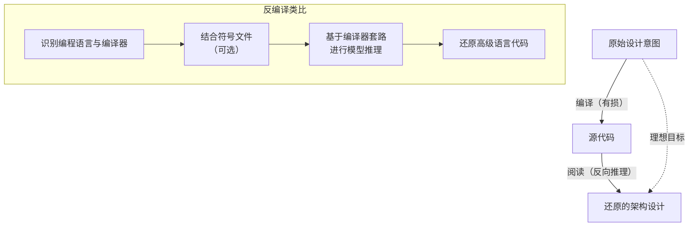
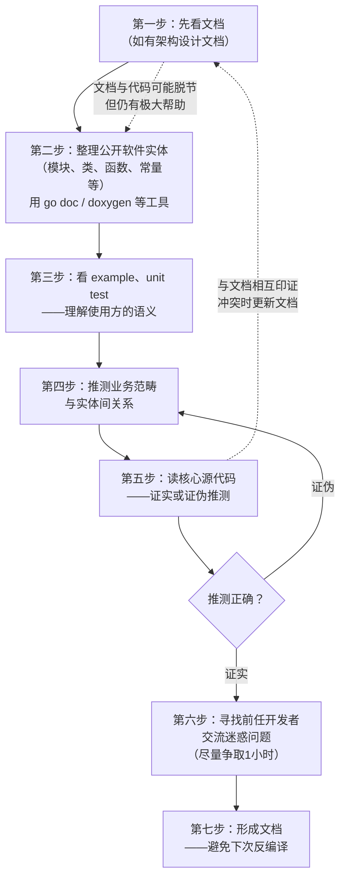
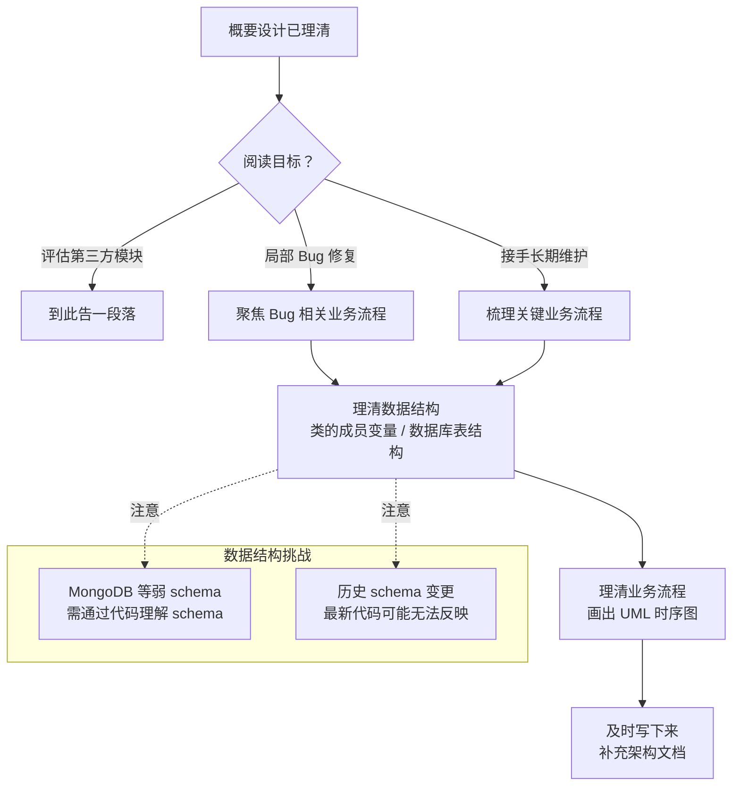

# 如何阅读别人的代码

## 章节导言：架构的反向工程

阅读代码是架构设计的反向过程。架构设计是从需求出发，自上而下地分解与构建系统；而阅读代码是从实现出发，自下而上地还原架构思想。这个过程类似于反编译——不是指令级的反编译，而是需要根据代码反推更高维的设计意图。

编译过程是有损的：大部分软件实体的名字在编译过程中被去除。即使有符号文件，精确还原高级语言代码仍然非常难——它需要模型推理，需要识别出熟悉的"套路"，然后按照套路进行还原。阅读源代码同样如此：一方面很难，另一方面必须有产出。**有产出的学习过程，才是最好的学习方式。**

> 交叉参考：本节是 [70讲 - 怎么写设计文档] 的反向视角——写文档是从设计到表达，读代码是从表达还原设计。

---

## 核心概念与原理

### 阅读代码的四种目标

明确阅读目标是第一步，因为它决定了你能为此付出多大成本：

| 目标类型 | 投入深度 | 关键产出 |
|---------|---------|---------|
| 评估引入第三方模块 | 低——理解概要设计即可 | 是否采用的决策 |
| 修复局部 Bug | 中——理解相关业务流程 | Bug 修复方案 |
| 以开源模块为榜样学习 | 中高——理解核心架构思想 | 可借鉴的设计范式 |
| 接手并长期维护模块 | 高——理解全部业务流程 | 完整的架构文档 |

### 阅读代码的产出：构建程序的思路

阅读源代码的产出应该是什么？**答案是构建这个程序的思路——也就是架构设计。**

类比"智能反编译器"的工作方式，可以理解阅读代码的本质：

---

## Mermaid 图表：代码阅读方法论

### 系统架构理解流程

### 业务实现机制理解流程

### 核心方法论：程序 = 数据结构 + 算法

理解业务流程的方法论回归到最基础的公式：**程序 = 数据结构 + 算法**

1. **先理数据结构**：类的成员变量、数据库的表结构，通常都有快速提取的方式。理清楚数据结构，事情就解决了大半。
2. **再理算法**：各个 UserStory 的业务流程，画出 UML 时序图。这个过程随时可以补充，挑选与当前工作最相关的来做。

---

## 设计原则与权衡（Trade-off 分析）

### 原则一：有文档一定先看文档

如果已经有架构设计文档，坚持自己通过代码一步步反向理解就是愚蠢的。但必须记住：文档和代码很容易脱节。所以我们看到的很可能是过时版本的设计。即使如此，阅读过时的架构设计思想对理解源代码仍有极大帮助——在此基础上再看源代码，可以相互印证。发生冲突时，及时修改文档到与代码一致。

### 原则二：理解概要设计是首要目标

概要设计的关注点是：各软件实体的业务范畴，以及它们之间的关系。有了这些，就能理解系统架构设计的核心脉络。只有在必要的情况下，才深入研究实现机制。

### 原则三：代码即文档，阅读代码不可替代

哪怕团队共识管理很好、团队很默契、大家都很乐意写文档，这些都替代不了阅读代码这个基础活动。因为：

- **代码即文档**：代码是理解一致性更强的文档
- 文档可能过时，代码永远反映真实状态
- 阅读代码是对文档的验证和补充

### 原则四：阅读代码时可以顺手改代码，但有原则

阅读代码的过程中，顺手修改几行明显风格不好的代码，应该被鼓励——这是随时随地消除臭味的好习惯。但必须遵循三条原则：

1. **不做大改动**：限定单个函数内改动不超过 10 行
2. **语义完全一致**：包括所有 corner case（错误码、条件语句边界等）
3. **补全单元测试**：不管多自信，有改动就必须补全相关单元测试

### Trade-off：投入深度 vs 阅读目标

- 评估第三方模块：理解概要设计即可，深入研究实现是过度投入
- 修复 Bug：聚焦相关业务流程，全面理解系统是过度投入
- 接手维护：关键业务流程优先，细节可以逐步补充
- **核心原则**：不要在没有明确目标的情况下试图"完整读懂"一个系统

### Trade-off：自己理解 vs 前任交流

- 自己从代码推导：成本高，但理解更深入
- 找前任开发者交流：效率高，但依赖对方可用性和表达能力
- **最佳实践**：先自行梳理到有一定理解，再找前任交流。提前准备迷惑问题列表，争取一小时左右的交流机会。这能大幅缩短理解过程。

---

## 实践案例与反模式

### 案例：使用工具提取软件实体规格

整理公开软件实体是阅读代码的第一步，现有工具能大幅加速：

- **Go 语言**：`go doc` 可自动生成包的文档
- **多语言通用**：`doxygen` 支持几乎所有主流语言
- 这一步让我们找到有哪些软件实体及它们的规格
- 但各实体的业务范畴和关系，需要进一步分析

### 案例：从 example / unit test 理解语义

example 和 unit test 属于研究对象的使用方（客户），它们能辅助理解各软件实体的语义。结合：
- 软件实体的规格
- 说明文档
- example
- unit test
- 软件实体名字本身隐含的语义

可以初步推测出各软件实体的业务范畴及关系，然后通过阅读核心源代码来证实或证伪。

### 反模式：坚持从零开始反向推导

如果已有架构文档却不看，坚持从零开始通过代码反向理解——这是不必要的浪费。即使文档可能过时，它仍然提供了理解系统的起点和高维视角。

### 反模式：试图完整理解所有细节

完整把一个系统的代码"读懂"需要极大精力。在没有明确目标的情况下试图全面理解，往往导致：
- 投入过多时间在不相关的细节上
- 无法产出有价值的结论
- 陷入代码细节泥潭，丧失全局视角

**正确做法**：根据目标确定投入深度，先理解概要设计，只在必要时深入研究实现。

### 反模式：阅读代码后不形成文档

阅读代码后不写文档，意味着下一次有人接手这个系统时，需要重新再来一次"反编译"。及时把理解写下来，形成架构文档的一部分，是知识传承的基本要求。

---

## 小结与关键要点

1. **阅读代码是架构的反向过程**：类似反编译，需要根据代码反推更高维的设计思想。核心产出是构建程序的思路（架构设计）。

2. **明确目标决定投入深度**：四种目标（评估、修 Bug、学习、接手维护）对应不同的投入深度，不要在没有目标的情况下试图完整读懂一个系统。

3. **先文档后代码**：有文档一定先看文档，与代码相互印证。冲突时更新文档。

4. **理解概要设计是首要目标**：各软件实体的业务范畴及关系，才是架构的核心脉络。深入研究实现只在必要时才进行。

5. **程序 = 数据结构 + 算法**：理清数据结构是理解业务流程的大半工作，再画出 UserStory 的 UML 时序图。

6. **阅读代码可以顺手改代码，但有原则**：改动不超过 10 行、语义完全一致（包括 corner case）、必须补全单元测试。

7. **代码即文档不可替代**：无论团队文档多么完善，阅读代码都是不可或缺的基础能力。

> 下一篇 [72讲 - 发布单元与版本管理] 将讨论软件工程中确定性管理的关键手段——版本管理。