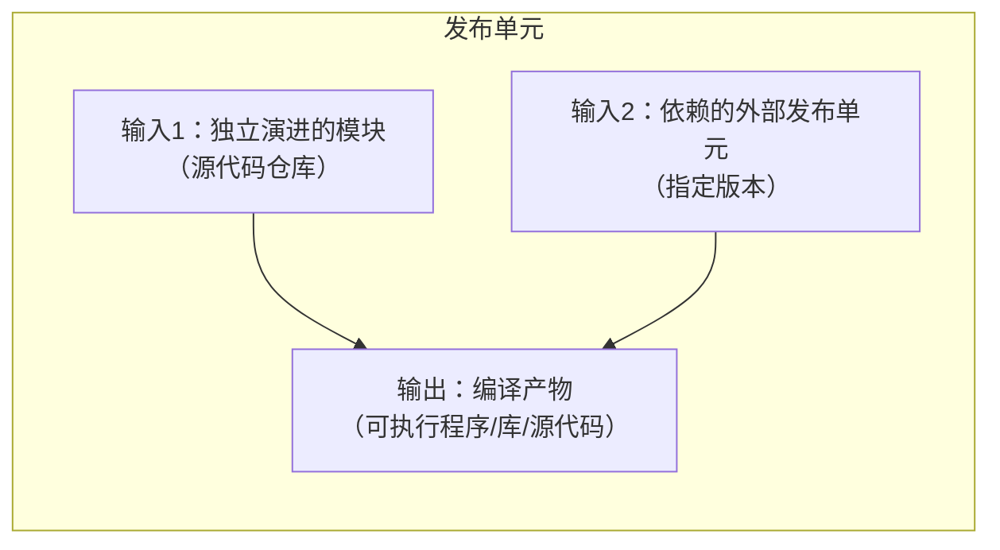
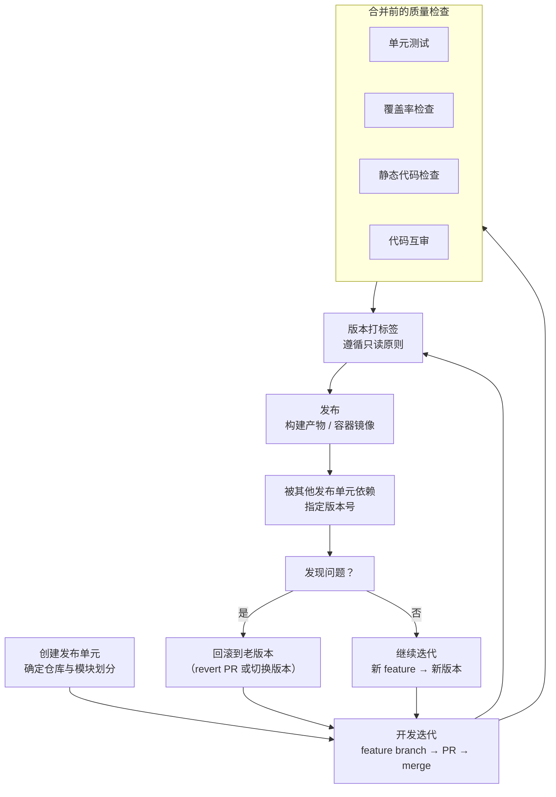
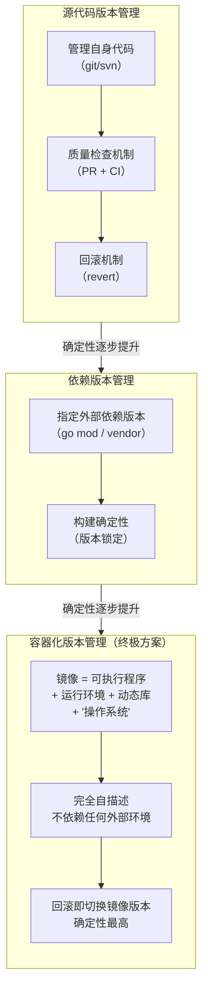
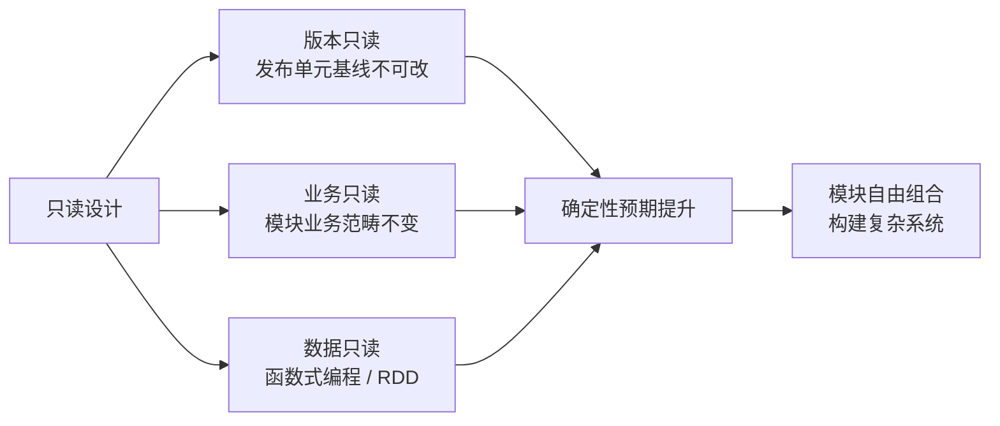

# 发布单元与版本管理

## 章节导言：确定性管理的核心手段

软件工程终其完整生命周期中，是反复迭代与演进的。这种反复迭代的工程要保证质量相当困难。怎么确保质量？最本能的思路是：万一出问题了，就召回，换用老版本。这便是版本管理的来由。

但版本管理远不止召回——它关乎整个软件工程的确定性。在 [68讲] 中我们提出：软件工程的核心是在不确定性中找到确定性。版本管理正是实现确定性的关键手段，其核心哲学是**只读设计**。

> 交叉参考：[68讲] 提出了"在不确定性中寻找确定性"的核心命题，本节是这一命题的具体工程实现。[73讲] 将在此基础上讨论质量管理的更多手段。

---

## 核心概念与原理

### 发布单元：软件工程的分治基础

从软件架构设计可知，软件是分模块开发的。不同模块可能由不同团队开发，甚至有些模块是外部第三方团队开发。这意味着，一个软件工程的生命周期中，包含着很多个彼此完全独立的子软件工程。这些子软件工程有自己的独立迭代周期，我们的软件只是它们的"客户"。

**发布单元** = 拥有独立迭代周期的软件实体。

发布单元与模块的区别：

| 维度 | 模块 | 发布单元 |
|------|------|---------|
| 直观感受 | 代码中的逻辑划分 | 有自己独立的源代码仓库（repo） |
| 迭代节奏 | 与系统整体同步 | 有独立的迭代周期 |
| 交付物 | 功能性代码 | 可执行程序 / 动态库 / 静态库 / 源代码本身 |
| 管理边界 | 系统内部 | 可被外部依赖 |

### 发布单元的输入与输出

发布单元的输出类型：

| 输出类型 | 说明 |
|---------|------|
| 可执行程序 / 字节码 | 完整可运行的程序 |
| 动态库（so/dylib/dll/jar） | 运行时链接的库 |
| 静态库（.a 文件） | 编译过程的半成品，由链接器组装 |
| 源代码本身 | 如 Go 语言的价值主张 |

### 只读设计的确定性

**一个打好了版本号的发布单元是只读的，不能对其做任何改动。** 这句话包含两层含义：

1. 不能修改发布单元自身包含的各模块的代码
2. 不能修改发布单元依赖的外部模块（发布单元）的版本——例如将 opencv 从 v1.0 升级到 v2.0，这也是一次变更，需要修改自己的版本号

**只读设计带来巨大的收益，因为版本是一个"基线"，我们对基线的预期是确定性的。**

---

## Mermaid 图表：发布单元生命周期与版本策略

### 发布单元生命周期

### 版本管理策略对比

| 管理层级 | 管控范围 | 确定性程度 | 残留不确定性 |
|---------|---------|-----------|------------|
| 源代码版本管理 | 自身代码 | 中 | 依赖版本、操作系统、编译器 |
| + 依赖版本管理 | + 外部依赖版本 | 较高 | 操作系统内核、编译器版本 |
| + 容器化版本管理 | + 运行环境 + OS | **最高** | 几乎为零 |

---

## 设计原则与权衡（Trade-off 分析）

### 原则一：只读设计的确定性

只读思想在软件工程中被广泛运用：

- **版本只读**：打好版本号的发布单元不可修改
- **模块业务只读**：开闭原则背后的架构治理哲学——模块业务范畴只读，接口稳定
- **变量只读**：函数式编程的核心——不可变数据，提高确定性预期
- **RDD 只读**：Spark 的弹性分布式数据集——变换产生新 RDD，让重试、延迟计算、缓存变得极其简单

### 原则二：容器化是版本管理的终极方案

源代码版本管理的好处是构建过程相对封闭可预期——可以规定操作系统种类和版本、编译器版本、预装软件等。但软件发布过程却不然——用户之间系统环境差异太大。

**容器的镜像**比源代码版本管理更进一步，实现完完全全的自描述：
- 包含可执行程序本身
- 包含所有运行环境（依赖的动态库和运行时）
- 甚至包含它依赖的"操作系统"

这意味着新版本有缺陷？回滚到老版本即可。确定性达到了最高水平。

### 原则三：版本兼容的细节是魔鬼

让一个模块依赖另一个发布单元的特定版本，解决了确定性问题。但在某个时刻，我们总是希望升级到新版本——无论是为了新功能、Bug 修复还是纯粹的心理诉求。

**最大风险是被依赖模块完成了一次重构。** 兼容模块的主体功能并不复杂，但兼容的难度全在细节上——错误码、低频的分支行为等。

### Trade-off：兼容 vs 不兼容（改名）

| 方案 | 优点 | 缺点 | 适用场景 |
|------|------|------|---------|
| 行为兼容 | 升级无缝 | 兼容细节多、风险高 | 内部模块、可控依赖 |
| 改名不兼容 | 干脆明确 | 升级需重写、重测 | 破坏性重构、内部模块 |

对于互联网服务（API），放弃兼容意味着放弃用户——不可接受。常见做法：为所有 API 引入版本号（`/v2/foo/bar` → `/v3/foo/bar`）。

### Trade-off：并行版本 vs 完全兼容

- 保留两个版本服务同时存在（11-Nginx基础概述 做 API 网关分流）：降低重构时行为兼容的负担，但增加运维成本
- 完全兼容：单一版本维护，但行为细节兼容工作量大
- **最佳实践**：能兼容就尽量兼容。并行版本是不得已的办法，客户端升级的心智负担随不兼容点增多而加大

---

## 实践案例与反模式

### 案例：Go 语言的版本管理演进

Go 语言早期并没有官方的版本管理手段，导致社区出现很多版本管理方案。直到 go mod 机制终于统一了这一纷争。所有外部依赖管理无非要达到一个目标：**指定我这个发布单元依赖的各个模块的建议版本**，理论上就能稳定构建出相同能力的输出结果。

### 案例：GitHub 的源代码质量管理手段

GitHub 提供了完善的源代码质量管理闭环：

1. **开发独立性**：每个人极低成本建立 feature branch，工作未完成时对其他人不可见
2. **质量检查机制**：提交 PR 时可配置自动化检查（unit test / coverage / lint / code review）
3. **开放设计**：质量检查过程需求易变，GitHub 做了开放设计——开闭原则的又一次体现
4. **回滚机制**：合并后发现 Bug 可 revert PR，主干得到去除该功能的新版本

### 案例：Spark RDD 的只读设计

Spark 的核心建立在统一的抽象——弹性分布式数据集（RDD）之上。RDD 的核心思想正是只读：对只读 RDD 施加变换（transform）得到另一个 RDD。这种设计让分布式运算在重试、延迟计算、缓存等过程变得极其简单。

### 反模式：破坏版本只读语义

如果有人破坏了版本的只读语义——例如直接修改已发布版本的代码或偷偷修改依赖版本号——就会导致所有依赖它的发布单元的版本只读语义也被破坏。这是必须极力避免的事情。

### 反模式：忽视操作系统和编译器的不确定性

仅保证发布单元自身源代码和依赖只读，仍然不足以保证输出结果的确定性。因为：
- 不同版本的操作系统内核行为不完全一致
- 不同版本的编译器理论上可能产生不同行为

容器化是解决这个问题的终极方案——镜像包含完整的运行环境甚至操作系统，彻底消除环境差异。

### 反模式：互联网 API 不做版本管理

发布一个 API 就很难收回——使用这个 API 的客户端可能有很多。放弃 API 意味着放弃用户。正确做法是为所有 API 引入版本号，发生不兼容修改时升级版本号，通过网关分流并行版本。

---

## 小结与关键要点

1. **发布单元是分治的基础**：复杂软件总可分割为若干独立迭代的发布单元，分而治之。切割不宜过细，以一个小团队负责起来比较舒服为宜。

2. **只读设计是确定性的核心**：打好版本号的发布单元不可修改。只读思想被广泛运用——版本只读、业务只读、数据只读。确定性预期是软件工程管理最核心的追求。

3. **容器化是版本管理的终极方案**：镜像完全自描述，不依赖任何外部环境。回滚即切换镜像版本。确定性最高。

4. **版本兼容的难度在细节**：兼容主体功能容易，兼容错误码和低频分支行为才是魔鬼。能兼容尽量兼容，不得已才用并行版本。

5. **只读设计与软件工程核心矛盾**：[68讲] 提出"在不确定性中找确定性"，只读设计正是实现确定性的工程手段——从版本只读到数据只读，贯穿整个软件工程。

> 下一篇 [73讲 - 软件质量管理：单元测试、持续构建与发布] 将讨论只读思想之外，软件工程质量管理的更多手段。