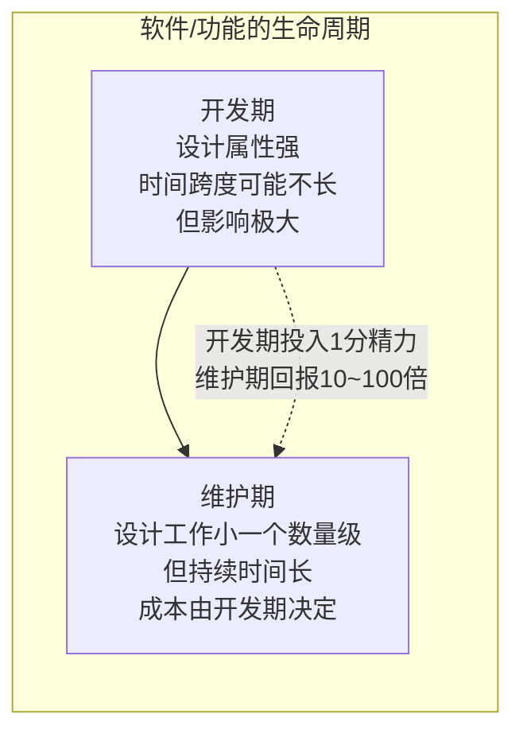
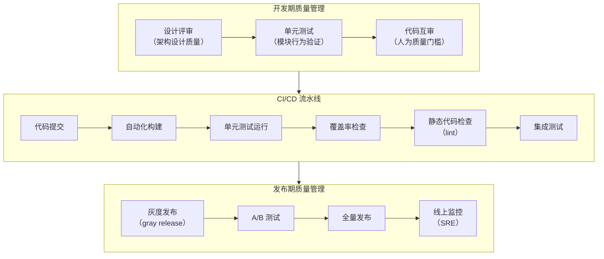
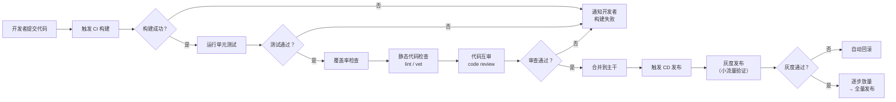
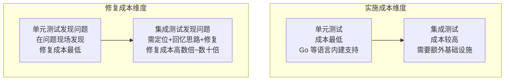

# 软件质量管理-单元测试、持续构建与发布

## 章节导言：软件工程质量管理的反直觉之处

软件质量管理横跨整个软件工程完整的生命周期。但软件工程的质量管理思想与传统工程截然不同——甚至往往是**反其道而行之**。

传统工程中，设计工作占比极少，重复性工作占绝大部分，检查清单（Check List）即可实现质量管理。但软件工程中，设计工作贯穿始终，连编码实现都依赖个体创造力。Check List 完全无法满足软件工程的质量管理需要。

究其根本，还是因为 [68讲] 提出的核心矛盾：**软件工程的核心在于如何在高度的不确定性中找到确定性。** 上一篇 [72讲] 讨论的"只读设计"为确定性注入了基线保障，本节则讨论质量管理的更多手段。

---

## 核心概念与原理

### 开发期 vs 维护期：预见性是关键

**关键认知**：开发期的时间跨度可能不长，但它基本决定了后期维护期的成本有多高。这意味着软件工程是需要有极强预见性的工程。开发期恰如其分地多投入一分精力，维护期就有十倍甚至百倍以上的回报。

设计工作的质量至关重要。但它在执行上不太有复制性，可复制的只是设计范式和设计思维。我们只能在这种执行的不确定性中找工程上的确定性。

### 质量管理的两大支柱

如何在不确定性中找到确定性？两大支柱：

1. **自动化测试**——通过可回归的验证注入确定性
2. **持续构建与持续发布**——通过高频交付降低变更风险

---

## Mermaid 图表：质量管理体系与 CI/CD 流水线

### 质量管理体系全景

### CI/CD 流水线详细流程

---

## 核心实践一：单元测试

### 自动化测试的核心价值

软件工程的生命周期往往几年甚至几十年之久，不能只关注单次测试的效率，更要关注测试的可回归性。自动化测试的核心价值在于：

1. **可回归性**：可反复执行，一次完整的测试集几分钟而非几天
2. **覆盖率**：不受人力限制，可以覆盖更多场景

自动化测试的重要特征：

| 特征 | 说明 |
|------|------|
| 自动化、可回归 | 可反复执行，无需人工干预 |
| 静默（Quiet） | 没有错误时不说话，降低噪音 |
| 安全受控 | 某案例失败不影响其他案例运行 |

### 单元测试是重中之重

从测试成本两个维度看，单元测试都是最优选择：

### 推广单元测试的认知障碍

很多公司推不起来单元测试，根因在于认知问题：**我们不应把推广单元测试看作让大家多做一件额外的事情，而是规范大家做单元测试的方法。**

实际上单元测试大家都会做——很少有人不经验证就直接交付。但验证方式五花八门：

| 常见"土"方法 | 问题 |
|-------------|------|
| print 调试 | 不可回归，需人脑判断 |
| 可视化界面测试 | 不可回归，依赖人工观察 |
| 单步跟踪 | 不可回归，一次性消费 |

这些方法代价不低，且最大的问题是**没有办法固化已知的 Bug，最大程度保留测试案例**。

**核心认知**：测试代码同样是开发成果，理应获得和功能代码同等重要的地位，理应被保留下来。

---

## 核心实践二：持续构建与持续发布

### 更小的发布，更高的频率

我们鼓励更小的发布、更短的发布周期、更高的发布频率。这种极度高频交付的机制与传统工程的质量管理迥异，但被证明是应对软件工程不确定性的最佳方式。

**为什么高频交付更优？**

1. **回滚代价低**：交付功能越少，因错误回滚的影响面越小。同时发布数十个功能，一个出问题影响整体——不如只回滚出问题的功能，放行其他所有功能
2. **过程熟练度高**：交付频率越高，对交付过程的训练越频繁，执行效率越高。交付成为自然习惯后，研发绩效与功能线上表现关联，面向客户价值

### CI/CD 中的质量管理抓手

| 抓手 | 作用 | 自动化程度 |
|------|------|-----------|
| 单元测试（unit test） | 验证模块行为 | 全自动 |
| 覆盖率检查（code coverage） | 量化测试充分度 | 全自动 |
| 静态代码检查（lint / vet） | 发现潜在问题 | 全自动 |
| 代码互审（code review） | 人为质量门槛 | 半自动 |
| 灰度发布（gray release） | 小范围验证 | 半自动 |
| A/B 测试 | 数据驱动决策 | 半自动 |

---

## 设计原则与权衡（Trade-off 分析）

### 原则一：设计质量是第一质量

开发期的时间跨度不长，但影响极大——基本决定了维护期成本。因此：
- 在设计上多投入精力，回报十倍百倍
- 可复制的不是设计执行，而是设计范式和设计思维
- 设计评审是质量管理的第一道关卡

### 原则二：测试代码与功能代码同等重要

测试代码是开发成果，不是负担。保留测试案例的价值远超编写成本：
- 固化已知 Bug 的验证
- 提供可回归的安全网
- 作为模块行为的精确规格说明

### 原则三：极度高频交付优于低频大版本

| 维度 | 低频大版本 | 高频小版本 |
|------|-----------|-----------|
| 回滚代价 | 高——影响面大 | 低——影响面小 |
| 问题定位 | 难——变更太多 | 易——变更少且近 |
| 过程训练 | 弱——发布是特殊事件 | 强——发布是日常习惯 |
| 研发心态 | 做完功能就完事 | 面向线上客户价值 |
| 系统化要求 | 较低 | 较高——需要完善的 CI/CD |

### Trade-off：单元测试覆盖率 vs 开发速度

- 100% 覆盖率：质量最高，但编写和维护成本高
- 0% 覆盖率：速度最快，但质量风险极高
- **最佳实践**：核心模块追求高覆盖率（80%+），周边模块适度覆盖。关键路径必须覆盖，边界条件必须覆盖

### Trade-off：自动化 vs 人工审查

- 全自动化：效率高、可回归，但无法判断设计合理性
- 人工审查：能发现设计问题，但效率低、不可回归
- **最佳实践**：自动化处理可机械化检查的部分（测试、lint、覆盖率），人工审查聚焦设计合理性和业务正确性

---

## 实践案例与反模式

### 案例：Go 语言的工程工具链

Go 语言从 1.0 开始就内建了完善的工程工具支持，体现了"工程能力内建"的理念：

- `go test`：单元测试
- `go doc`：文档生成
- `go vet`：静态检查
- `go tool pprof`：性能分析
- `go tool cover`：覆盖率检查

这些工具链的完善，大幅降低了推广单元测试和代码质量检查的门槛。

### 案例：灰度发布策略

灰度发布是高频交付的安全网：
1. 新版本先发布给 1% 的用户
2. 观察关键指标（错误率、延迟、业务指标）
3. 指标正常则逐步放量（1% → 5% → 20% → 50% → 100%）
4. 指标异常则自动回滚到老版本

### 反模式：用 Check List 管理软件质量

传统工程的 Check List 在软件工程中完全失效——因为软件工程没有大量重复性工作。每一行代码都是新的创造，每一个功能都是新的设计。用 Check List 管理软件质量，是对软件工程本质的误解。

### 反模式：单元测试是额外负担

把单元测试看作"额外的事情"，是推广失败的根本原因。正确认知是：**大家本来就在做验证，只是方式不对——print、单步跟踪、界面测试都不可回归。单元测试是规范验证方式，而非增加工作量。**

### 反模式：发布是特殊事件

如果发布是几个月一次的"大事件"，团队就会：
- 一次堆积大量变更，回滚代价极高
- 发布过程缺乏训练，容易出错
- 研发与线上割裂，做完功能就完事

正确做法：让发布成为日常习惯，持续构建、持续发布。

---

## 小结与关键要点

1. **软件工程的质量管理与传统工程迥异**：设计贯穿始终，Check List 完全不适用。核心是在高度不确定性中找到确定性。

2. **开发期决定维护期成本**：软件工程需要极强的预见性。开发期多投入一分精力，维护期回报十倍百倍。

3. **单元测试是重中之重**：实施成本最低、问题发现最早、修复成本最小。核心认知：测试代码与功能代码同等重要。

4. **持续构建与持续发布**：更小的发布、更高的频率。回滚代价低、过程熟练度高、面向客户价值。

5. **极度高频交付需要系统化支撑**：CI/CD 流水线 + 质量管理抓手（单元测试、覆盖率、lint、code review、灰度发布、A/B 测试）。

6. **软件工程的质量管理理念往往是反直觉的**：传统工程追求稳定和低频变更，软件工程恰恰相反——拥抱变化、高频交付、自动化回归。

> 下一篇 [74讲 - 开源、云服务与外包管理] 将讨论跨组织的分工与协同——什么该自己做，什么该外包出去。