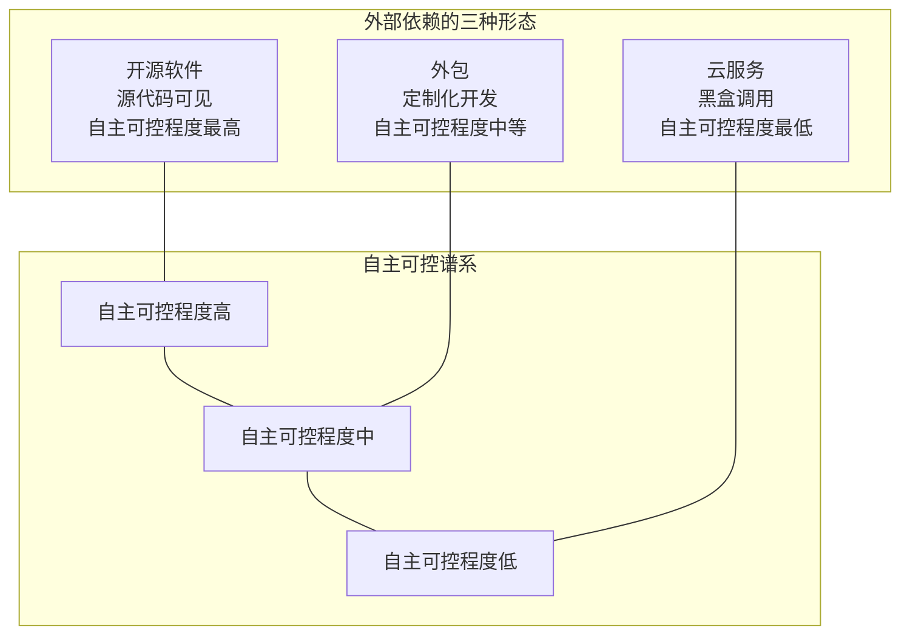
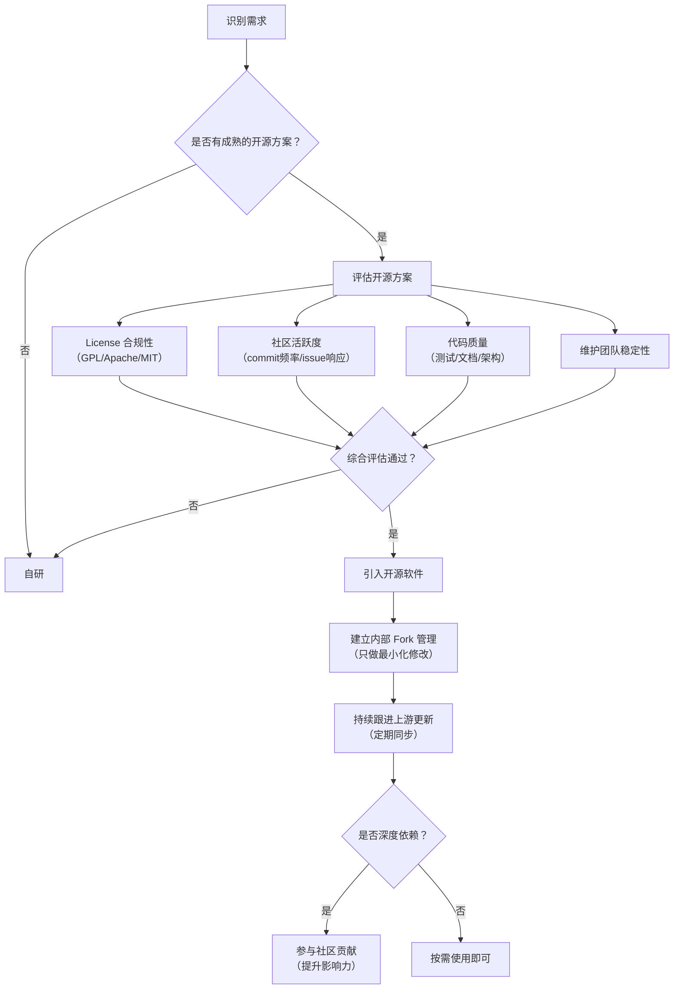
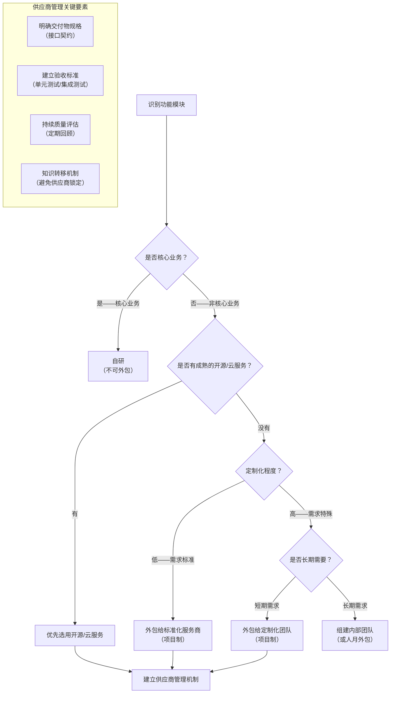
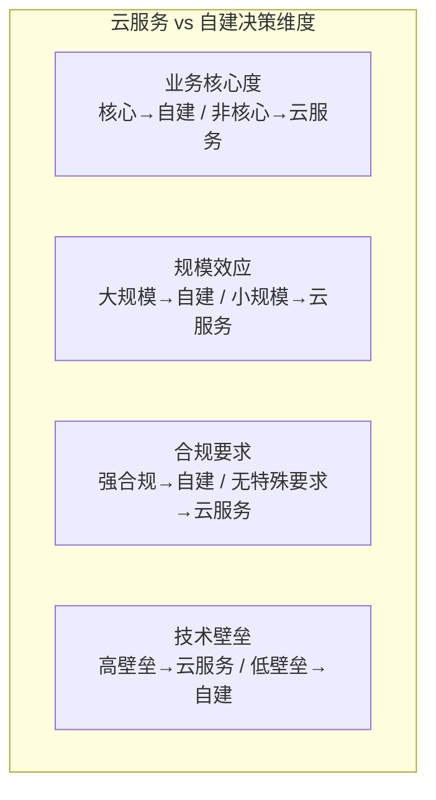

# 开源、云服务与外包管理

## 章节导言：跨组织的分工与协同

回到 [72讲] 提到的认知：一个软件工程的生命周期中，包含着很多个彼此完全独立的子软件工程。这些子软件工程中，绝大多数并非自研——它们可能是开源软件、云服务或外部团队外包的模块。

这意味着，**跨组织的分工与协同不仅常见，而且不可避免**。本节关注的核心问题是：什么自己做？什么交给别人做？交给谁？

> 交叉参考：[72讲] 建立了发布单元与版本管理的确定性基础，本节讨论跨组织依赖的管理。[75讲] 将在此基础上讨论版本迭代的规划——自研与外包的决策直接影响迭代节奏。

---

## 核心概念与原理

### 软件工程分工的三种外部依赖形态

| 依赖类型 | 本质 | 自主可控 | 成本结构 | 适用场景 |
|---------|------|---------|---------|---------|
| **开源软件** | 社区驱动的公共基础设施 | 高——源代码可见、可改 | 零授权费 / 维护成本 | 通用性强的底层能力 |
| **云服务** | 供应商托管的服务 | 低——黑盒调用、依赖 SLA | 按用量付费 | 非核心业务的基础设施 |
| **外包** | 定制化开发 | 中——可约定交付物 | 合同约定 | 非核心业务的功能模块 |

### 开源软件：公司与公司的竞争是生态的竞争

开源软件是公司参与行业竞争的生态战略。公司与公司之间的竞争越来越像国与国之间的竞争，更像两大生态之间的竞争。大量的软件被开源出来，目的是：
- 形成行业标准
- 减少整个行业的无谓重复投入
- 构建以自身为核心的生态圈

### 云服务：基础能力的社会化

云服务本质上是"基础能力的社会化"。随着公有云越来越成熟，越来越多的基础能力被纳入云服务范畴：

- 存储（对象存储 / 块存储 / 文件存储）
- 数据库（关系型 / NoSQL / 时序 / 图）
- 计算（虚拟机 / 容器 / Serverless）
- AI 能力（NLP / CV / 大模型推理）
- DevOps（CI/CD / 监控 / 日志）

### 外包：软件工程分工的必然形态

**不要排斥外包。** 很多人对业务外包有天然的排斥心理，这是不理性不客观的。原因有二：

1. **存在即合理**：外包市场有几千亿美元的规模，不可能是一个不理性的事物
2. **软件工程分工的必然性**：没有人能做完所有事情，总是有一部分需要让别人去做

---

## Mermaid 图表：开源治理与外包决策框架

### 开源软件引入与治理流程

### 外包决策框架

### 云服务 vs 自建基础设施决策

---

## 设计原则与权衡（Trade-off 分析）

### 原则一：核心业务必须自研

**所有围绕目标用户群体需求而产生的业务子系统，都应该自研。** 原因有二：

1. 目标用户群体是我们商业闭环的价值源泉，围绕他们的所有工作都是核心业务
2. 外包团队不会对我们目标用户群体产生同理心——服务目标用户群体的心态只有我们自己的团队才有

### 原则二：开源软件引入需建立治理机制

引入开源软件不是"下载使用"那么简单：

1. **License 合规**：不同 License 对商业使用有不同约束
2. **Fork 管理**：内部修改应最小化，定期同步上游更新
3. **安全漏洞响应**：建立开源软件的安全漏洞跟踪机制
4. **社区参与**：深度依赖的开源软件应积极参与社区贡献

### 原则三：外包的关键是接口契约

外包的本质是"以接口为边界的分工"。外包管理的关键是：
- **交付物规格**明确：接口定义、行为规格、非功能需求
- **验收标准**清晰：单元测试、集成测试、性能指标
- **知识转移**机制：避免供应商锁定

### 原则四：云服务的 SLA 是生死线

云服务是黑盒调用，自主可控程度最低。关键风险点：
- **SLA 保障**：可用性承诺是核心指标
- **数据安全**：敏感数据是否适合托管
- **供应商锁定**：迁移成本和可行性
- **服务降级预案**：云服务不可用时的降级方案

### Trade-off：开源 vs 云服务

| 维度 | 开源软件 | 云服务 |
|------|---------|--------|
| 自主可控 | 高 | 低 |
| 运维成本 | 高——自行维护 | 低——供应商托管 |
| 灵活性 | 高——可改源码 | 低——黑盒调用 |
| 前期投入 | 中——学习成本 | 低——开箱即用 |
| 长期成本 | 低——无授权费 | 高——按用量付费 |
| 适用阶段 | 早期 / 有定制需求 | 快速验证 / 非核心能力 |

### Trade-off：外包 vs 自建团队

| 维度 | 外包 | 自建团队 |
|------|------|---------|
| 成本弹性 | 高——按需增减 | 低——固定人力成本 |
| 质量可控性 | 中——依赖合同约束 | 高——直接管理 |
| 知识积累 | 低——知识在外包团队 | 高——知识在内部积累 |
| 响应速度 | 低——需求传递链路长 | 高——直接沟通 |
| 适用场景 | 非核心业务、短期需求 | 核心业务、长期迭代 |

---

## 实践案例与反模式

### 案例：七牛云与开源生态

七牛云作为云服务提供商，本身就是"基础能力社会化"的实践者。同时，七牛也开源了大量基础设施软件，参与构建行业生态。这种"使用开源 + 贡献开源"的双向参与，是现代科技公司的标准范式。

### 案例：核心业务自研 + 非核心外包

典型架构决策：
- **自研**：用户系统、核心业务逻辑、推荐算法
- **云服务**：对象存储、CDN、数据库（初期）
- **开源**：消息队列、日志收集、监控
- **外包**：客服系统、内部管理工具

### 反模式：核心业务外包

将核心业务外包是最常见的战略错误。外包团队不会对目标用户产生同理心，做出的产品往往缺乏灵魂。短期看节省人力成本，长期看丧失核心竞争力。

### 反模式：对开源软件放任不管

引入开源软件后不建立治理机制：
- 不跟踪安全漏洞
- 不定期同步上游更新
- 内部修改与上游分歧越来越大
- 最终成为不可维护的"内部分支"

正确做法：建立开源软件的引入评估和持续治理流程。

### 反模式：过度依赖云服务

所有基础设施都依赖云服务，没有降级预案：
- 云服务故障时业务完全不可用
- 数据迁移困难，供应商锁定严重
- 长期成本不可控

正确做法：核心能力自建，非核心能力使用云服务，始终保留降级预案。

---

## 小结与关键要点

1. **跨组织分工不可避免**：软件工程的生命周期中包含大量外部依赖。正确处理开源、云服务、外包的关系，是架构师的核心职责。

2. **核心业务必须自研**：围绕目标用户群体的业务不可外包。外包团队缺乏对目标用户的同理心。

3. **开源软件需要治理**：License 合规、Fork 管理、安全漏洞跟踪、社区参与——引入不是终点，治理才是关键。

4. **云服务是基础能力社会化**：非核心业务优先选用云服务，但需关注 SLA、数据安全、供应商锁定风险。

5. **外包的关键是接口契约**：明确的交付物规格和验收标准，是外包管理的基础。

6. **公司与公司的竞争是生态的竞争**：开源不仅是技术选择，更是生态战略。

> 下一篇 [75讲 - 软件版本迭代的规划] 将讨论如何规划自研与外包模块的迭代节奏——哪些先做，哪些后做。