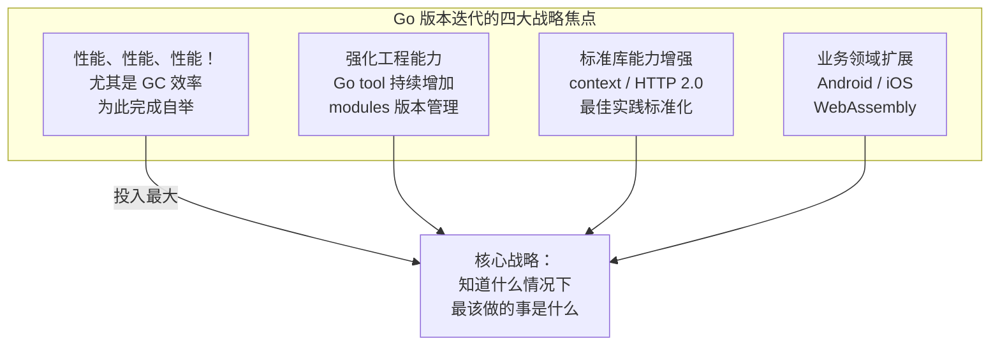
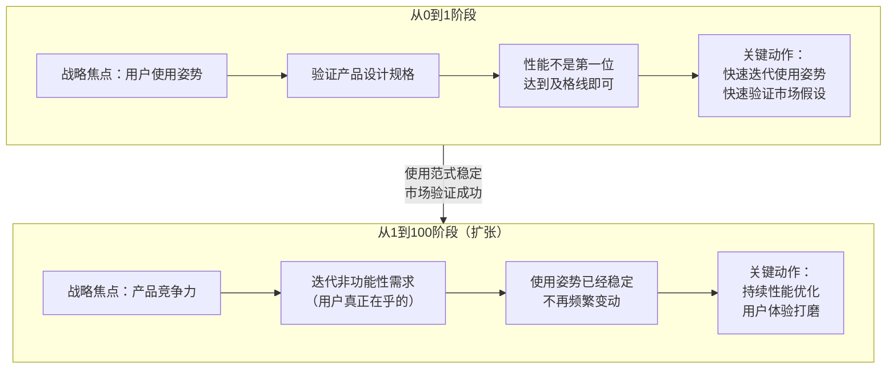
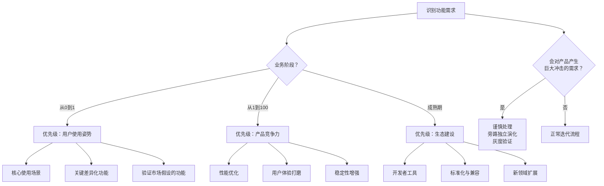

# 软件版本迭代的规划

## 章节导言：方向与执行路径同等重要

到今天为止，我们的话题主要集中在软件工程的质量与效率上。架构师对软件工程的执行结果负责（[68讲]），包括按时按质迭代发布、敏捷响应需求变更、防范质量风险、降低维护成本。

但本节探讨一个更高维的话题：**软件版本迭代的规划**——下一步的重点应该放在哪里？哪些先做，哪些后做？

这是一个极其关键的话题。方向正确并不代表能够走到最后，执行路径和方向同等重要。版本规划可以影响一个业务的成败，一个企业的生死存亡。

> 交叉参考：[68讲] 提出架构师对工程结果负责，[74讲] 讨论了外包决策，本节讨论的是自研内容的迭代节奏——先做什么、后做什么。

---

## 核心概念与原理

### 版本规划的核心逻辑

版本规划不是简单的"功能排序"，而是需要根据业务发展阶段动态调整战略重心。许式伟以 Go 语言的版本演进作为典型案例，揭示了版本规划的深层逻辑。

### Go 版本演进的关键脉络

| 版本 | 时间 | 核心变化 | 战略阶段 |
|------|------|---------|---------|
| Go 1.0 | 2012.03 | 兼容性承诺、完善工程工具链 | **从0到1：确立使用范式** |
| Go 1.1 | 2013.05 | 性能改善（编译器、GC、map、goroutine调度） | 从1到100：性能打磨 |
| Go 1.2 | 2013.12 | 单元测试覆盖率工具 go tool cover | 工程能力强化 |
| Go 1.3 | 2014.06 | 连续栈、sync.Pool、channel 优化 | 性能持续优化 |
| Go 1.4 | 2014.12 | runtime 用 Go 重写、go generate | 基础设施重构（为自举铺垫） |
| Go 1.5 | 2015.08 | 自举、并发 GC（延迟降一个数量级）、vendor | **里程碑：解决最大痛点** |
| Go 1.6 | 2016.02 | GC 延迟进一步降低、HTTP/2 | 性能持续 |
| Go 1.7 | 2016.08 | context 入标准库、编译性能优化 | 标准库增强 |
| Go 1.8 | 2017.02 | GC 延迟降至毫秒级以下、defer 性能 | 性能持续 |
| Go 1.9 | 2017.08 | type alias、sync.Map | 语言微调 |
| Go 1.10 | 2018.02 | go test 缓存、go build 缓存 | 工程效率 |
| Go 1.11 | 2018.08 | Go modules、WebAssembly | **版本管理解决 + 新领域** |
| Go 1.13 | 2019.08 | sync.Pool 改善、逃逸分析重写、GOPROXY | 性能 + 生态 |

### Go 版本迭代的核心战略洞察

**关键洞察**：Go 1.0 之后语言本身的功能基本非常稳定，只有极少量的变动。这些年 Go 都在变化什么？

1. **性能、性能、性能！** 尤其在 GC 效率这块，持续不断优化。为了它大范围重构实现、完成自举
2. **强化工程能力**：各种 Go tool 增加，最突出的是模块版本管理（vendor → modules）
3. **标准库能力增强**：context、HTTP 2.0 等，context 是网络编程最佳实践的标准化
4. **业务领域扩展**：整体专注服务端，对 Android/iOS/WebAssembly 做经验性支持

---

## Mermaid 图表：版本迭代规划与功能优先级

### 业务不同阶段的版本规划策略

### 功能优先级决策框架

---

## 设计原则与权衡（Trade-off 分析）

### 原则一：从0到1阶段，用户使用姿势是第一位

Go 语言的版本规划给出了最好的示范：它首先把焦点放在用户使用姿势的迭代上。凡与此无关的事情，只要达到及格线了就可以先放一放。这也是为什么 Go 1.0 虽然有很多关于 GC 效率的吐槽，但他们安之若素，仍然专注于使用姿势的迭代。

**使用姿势 = 产品设计的规格**。如果使用姿势错了，后面的一切都是在错误地基上盖高楼。

### 原则二：从1到100阶段，非功能性需求成为战略焦点

一旦语言开始大规模推广，进入扩张阶段，版本迭代的关注点切换到用户看不见的地方——**非功能性需求**。生产环境中用户最关心的指标，就成了团队最关注的事情，日复一日不断迭代优化。

这是很了不起的战略定力：**知道什么情况下，最该做的事情是什么。**

### 原则三：重大冲击需求——谨慎处理，旁路演化

遇到会对产品产生巨大冲击的功能需求（如 Go 的泛型），正确的姿势是：

1. **认真对待**：Go 团队非常认真地对待泛型需求
2. **不急于实现**：并没有急着在 1.9、1.10 或 1.13 中加入
3. **旁路独立演化**：泛型经历了多年的设计草案与 go2go 旁路验证，最终在 Go 1.18（2022 年）合并到 1.x
4. **灰度验证**：在少量客户上先做灰度

**尊重客户的正确姿势是：别折腾他们。**

### Trade-off：使用姿势 vs 性能

| 阶段 | 优先级 | 理由 |
|------|-------|------|
| 从0到1 | 使用姿势 | 错的使用姿势 = 错的产品方向，性能再好也无意义 |
| 从1到100 | 性能/稳定性 | 使用姿势已稳定，竞争力在非功能性需求 |

**核心原则**：在不同阶段，版本迭代的侧重点会有极大的不同。不要用一个固定优先级框架套用所有阶段。

### Trade-off：快速响应 vs 稳定演进

- 快速响应重大需求：满足客户期望，但可能打乱迭代节奏、引入不兼容变更
- 稳定演进旁路演化：保护既有客户，但短期可能引起社区不满
- **最佳实践**：重大冲击需求放旁路独立演化，成熟后再合并。回到从0到1方法论，在少量客户上先做灰度。

### Trade-off：功能丰富度 vs 使用姿势稳定性

- 功能越丰富，产品越有吸引力，但使用姿势变动风险越大
- 使用姿势越稳定，迁移成本越低，但功能演进速度受限
- **最佳实践**：Go 1.0 发布兼容性承诺是里程碑——使用姿势一旦稳定就锁定，新功能只能在旁路演化

---

## 实践案例与反模式

### 案例：Go 1.0 的兼容性承诺

Go 1.0 发布的兼容性文档是 Go 语言发展的里程碑：承诺未来版本将保持向后兼容，保证已有代码在新版本下编译和运行的正确性。这个承诺的代价是语言变化必须极其谨慎（如 type alias 就已经是关键语法变化），但收益是用户使用姿势的稳定性——这是从0到1阶段最重要的成果。

### 案例：Go 版本管理的演进

Go 1.5 引入 vendor 机制试图解决模块版本管理问题，但不成功。Go 1.11 推翻重来引入 module 机制。这个演进过程说明：

1. **版本规划不排斥推翻重来**：vendor 不成功就推翻，module 是更好的方案
2. **核心痛点必须持续攻坚**：版本管理是 Go 1.0 后最大的痛点（社区调查排名第一），Go 团队没有回避
3. **从1到100阶段，工程能力是战略焦点**

### 案例：Go 泛型的旁路演化

Go 团队对泛型的处理方式是版本规划的经典范例：

- Go 1.9 时社区期待 Go 2.0 和泛型，但 Go 团队没有急于实现
- 泛型被放到旁路版本独立演化
- 直到验证成熟才合并到 Go 1.x——最终于 Go 1.18（2022 年）落地，并未推出断裂式的 Go 2.0
- 这是"尊重客户的正确姿势：别折腾他们"的最佳诠释

### 反模式：技术背景的版本规划者陷入技术细节

蛮多技术背景的同学在做版本规划时，容易一开始就陷入技术细节的泥潭。但对于从0到1的业务，首先应该把焦点放到什么地方，这个选择才至关重要。技术细节可以后续迭代优化，但如果产品方向错了，所有技术投入都是浪费。

### 反模式：扩张阶段忽视非功能性需求

进入从1到100阶段后，仍然把大量精力放在新功能的开发上，忽视性能、稳定性、用户体验的打磨。这会导致：
- 产品竞争力不足，被竞品超越
- 用户吐槽集中在"慢""不稳定""体验差"
- 技术债越积越多，最终拖垮整个系统

### 反模式：急于响应重大冲击需求

遇到社区或客户强烈要求的功能（如泛型），急于在当前版本中实现：
- 引入不兼容变更，折腾所有既有用户
- 实现不成熟，可能需要二次重构
- 打乱正常的迭代节奏

正确做法：旁路独立演化，灰度验证，成熟后再合并。

---

## 小结与关键要点

1. **版本规划是战略级决策**：它影响业务成败和企业生死存亡。方向与执行路径同等重要。

2. **从0到1阶段聚焦用户使用姿势**：验证产品设计规格，性能不是第一位。使用姿势错了，后面一切都是在错误地基上盖高楼。

3. **从1到100阶段聚焦非功能性需求**：产品竞争力来自用户真正在乎的指标——性能、稳定性、用户体验。战略定力：知道什么情况下最该做的事是什么。

4. **重大冲击需求谨慎处理**：旁路独立演化，灰度验证，成熟后再合并。尊重客户的正确姿势是：别折腾他们。

5. **Go 语言版本规划是经典范例**：从使用范式确立（1.0 兼容性承诺）到性能攻坚（1.5 并发 GC）到工程能力强化（1.11 modules），每一步都精准服务于当前阶段的战略目标。

6. **不同阶段的侧重点极大不同**：不要用一个固定优先级框架套用所有阶段。版本规划必须根据业务发展阶段动态调整。

> 下一篇 [76讲 - 软件工程的未来] 将探讨这门年轻学科的发展方向——软件工程的成熟标志是什么？