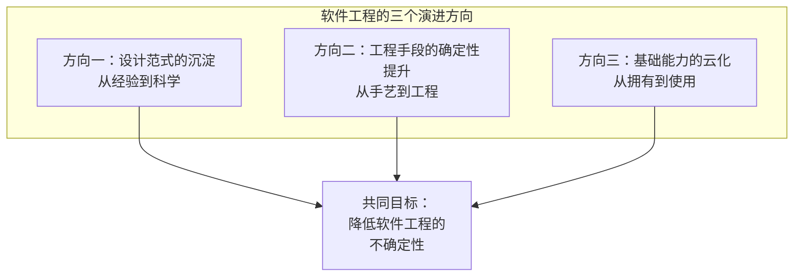
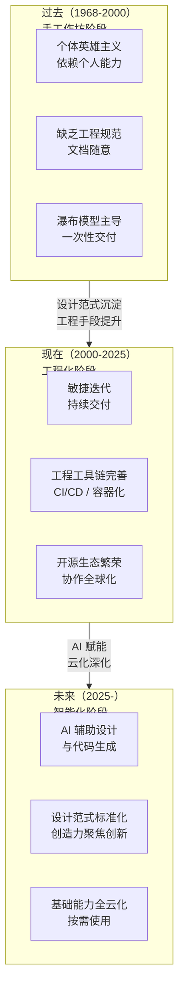
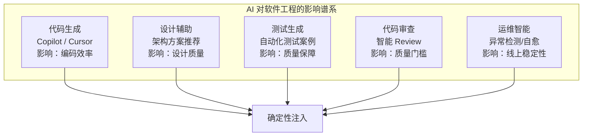
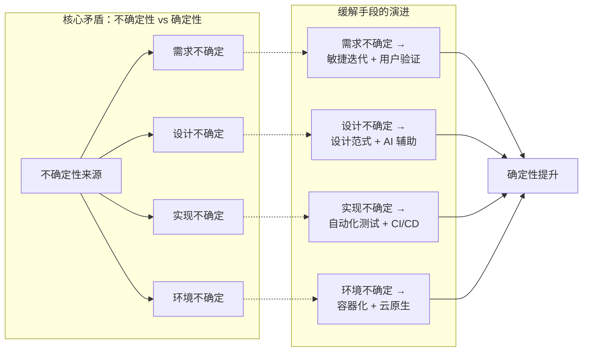

# 软件工程的未来

## 章节导言：一门约60年学科的成熟之路

回到本篇开篇 [68讲] 的一句话：软件工程只有约 60 年的历史。相比动辄跨世纪的自然科学，它太年轻了。正因为年轻，我们对它的认知仍然肤浅。

但正因如此，才需要思考未来。软件工程会走向何方？它的成熟标志是什么？哪些东西正在发生根本性的变化？

> 交叉参考：[06讲 - 操作系统演进] 和 [14讲 - 图形与图像] 讨论了基础软件的演进历史，本节聚焦软件工程方法论本身的未来走向。[68讲] 提出的核心矛盾——"在不确定性中寻找确定性"——是理解未来走向的钥匙。

---

## 核心概念与原理

### 软件工程的三个演进方向

软件工程的未来，从三个维度展开：

### 方向一：设计范式的沉淀

软件工程是高度设计驱动的工程活动。设计范式的沉淀是走向成熟的第一个标志：

| 层次 | 说明 | 成熟度 |
|------|------|-------|
| 架构范式 | MVC、微服务、事件驱动、CQRS | 较成熟 |
| 设计模式 | GoF 23 种设计模式 | 成熟 |
| 并发范式 | Actor、CSP、响应式 | 较成熟 |
| 数据范式 | 关系型、文档型、时序型、图 | 较成熟 |
| 业务范式 | 领域驱动设计、Event Sourcing | 发展中 |
| AI 辅助设计 | LLM 辅助架构决策、代码生成 | 快速发展期（代码生成已较成熟，架构决策辅助仍在早期） |

**关键判断**：设计范式的沉淀不是让设计变成机械化的套公式，而是让"套路"成为默认起点，把创造力释放到真正需要创新的地方。

### 方向二：工程手段的确定性提升

从 [68讲] 到 [75讲]，我们反复讨论的核心主题：**在不确定性中找到确定性**。工程手段的确定性提升贯穿了：

- **版本管理**：从无到 go mod（[72讲]）
- **质量管理**：单元测试、CI/CD、灰度发布（[73讲]）
- **共识管理**：从架构图到接口定义、代码即文档（[69讲]）
- **容器化**：从源代码版本管理到镜像级别确定性（[72讲]）

### 方向三：基础能力的云化

[74讲] 讨论了云服务作为"基础能力社会化"的本质。这一趋势只会加速：

1. **IaaS 层**：计算、存储、网络完全云化（已实现）
2. **PaaS 层**：数据库、消息队列、监控完全云化（进行中）
3. **SaaS 层**：CRM、ERP、协作工具云化（进行中）
4. **AI 能力层**：大模型推理、训练云化（高速发展中）

---

## Mermaid 图表：软件工程趋势与未来展望

### 软件工程成熟度演进

### AI 对软件工程的影响

### 软件工程核心矛盾的缓解趋势

---

## 设计原则与权衡（Trade-off 分析）

### 原则一：设计范式的沉淀不等于设计的机械化

设计范式提供的是"套路"，是默认起点。但它不替代创造力：
- 架构范式帮助快速选择合适的架构风格
- 设计模式帮助在模块级快速找到合适的设计
- 创造力应该释放到业务创新和前所未有的架构挑战上

**类比**：围棋的定式不是让对局机械化，而是让棋手不必在每一个局部重新发明——把思考力留给真正需要创造力的局面。

### 原则二：AI 辅助不会替代架构师，但会改变架构师的工作

AI 在软件工程中的角色：
- **编码层面**：大幅提升编码效率，但需要人类审查
- **设计层面**：辅助方案探索，但无法替代战略判断
- **质量层面**：自动化测试生成，但覆盖率策略需人类定义

架构师的核心竞争力不是写代码的速度，而是：
- 对业务方向的判断力
- 对权衡取舍的决策力
- 对团队协同的影响力

这些能力在 AI 时代反而更加重要。

### 原则三：云化深化不是全盘云化

云化的边界始终存在：
- **核心业务逻辑**：自研，不可云化
- **合规敏感数据**：私有化部署，不可公有云
- **差异化能力**：竞争优势所在，不可依赖云服务

### Trade-off：AI 生成代码 vs 人类编写代码

| 维度 | AI 生成 | 人类编写 |
|------|---------|---------|
| 速度 | 极快 | 慢 |
| 一致性 | 高 | 取决于个体 |
| 创造力 | 低——基于已有模式 | 高——突破性创新 |
| 可审查性 | 需要人类审查 | 可追溯思考过程 |
| 长期维护 | 不确定性高 | 可控性高 |

**最佳实践**：AI 生成模板代码和重复性代码，人类负责架构决策和创新性设计。AI 生成的代码必须经过与人类代码同等严格的质量检查。

### Trade-off：全盘云化 vs 核心自建

| 维度 | 全盘云化 | 核心自建 |
|------|---------|---------|
| 前期效率 | 极高 | 较低 |
| 长期成本 | 高——按用量付费 | 低——固定投入 |
| 自主可控 | 低 | 高 |
| 竞争优势 | 同质化 | 差异化 |

**最佳实践**：非核心能力云化，核心能力自建。随着规模增长，部分云化能力可逐步自建以降低成本。

---

## 实践案例与反模式

### 案例：Go 语言的设计范式沉淀

Go 语言本身就是设计范式沉淀的典型案例：
- **CSP 并发范式**：goroutine + channel，将复杂的并发编程范式化
- **工程工具链内建**：将工程能力从"可选"变成"默认"
- **兼容性承诺**：将版本管理的确定性范式化

### 案例：云原生架构的工程确定性提升

云原生架构（Kubernetes + Service Mesh + Serverless）正在系统性地提升工程确定性：
- **容器编排**：声明式部署，消除了环境不确定性
- **Service Mesh**：将服务治理能力从业务代码中剥离
- **Serverless**：将伸缩和运维的不确定性完全交给云平台

### 案例：AI 辅助编程的实际效果

GitHub Copilot 等 AI 工具已经在以下场景展现了显著效果：
- 生成样板代码（CRUD、数据转换）
- 补全测试案例
- 辅助代码审查
- 文档生成

但 AI 在以下场景仍然受限：
- 架构方案选型
- 业务逻辑设计
- 性能优化策略
- 跨模块一致性设计

### 反模式：AI 生成代码不经审查直接使用

AI 生成的代码可能包含：
- 逻辑错误
- 安全漏洞
- 性能问题
- 与既有架构不一致的设计

**核心原则**：AI 生成的代码必须经过与人类代码同等严格的质量检查——单元测试、代码审查、集成测试，一项不能少。

### 反模式：过度追求范式导致僵化

设计范式是默认起点，不是终极答案。过度追求范式导致：
- 所有系统看起来一样，缺乏差异化
- 不合理的范式套用（如用微服务架构做内部管理工具）
- 创造力被束缚，无法应对前所未有的挑战

### 反模式：忽视软件工程的本质矛盾

无论技术如何进步，软件工程的核心矛盾——不确定性 vs 确定性——不会消失。AI 和云化是缓解手段，不是终极解决方案。忽视这一本质，会导致：
- 过度依赖工具，丧失架构判断力
- 过度追求自动化，忽视人为审查的价值
- 过度追求标准化，扼杀创新

---

## 小结与关键要点

1. **软件工程正在从手艺走向工程**：三个演进方向——设计范式沉淀、工程手段确定性提升、基础能力云化。共同目标：降低不确定性。

2. **设计范式沉淀不等于设计机械化**：范式提供默认起点，把创造力释放到真正需要创新的地方。类比围棋定式。

3. **AI 辅助不替代架构师**：AI 提升编码效率和代码质量，但架构师的核心竞争力——业务判断力、权衡决策力、协同影响力——反而更加重要。

4. **云化深化不等于全盘云化**：核心业务逻辑和合规敏感数据始终需要自研和私有化。云化的边界是竞争优势所在。

5. **核心矛盾不会消失**：无论技术如何进步，"在不确定性中寻找确定性"始终是软件工程的核心命题。AI 和云化是缓解手段，不是终极解决方案。

6. **软件工程的成熟标志**：当设计范式足够丰富、工程手段足够确定、基础能力足够标准化时，软件工程将从"手艺"真正走向"工程"。但这条路还很长。

> 下一篇将进入"画图程序"的整体架构实战，把前面各讲的方法论在实践中融会贯通。