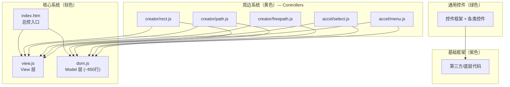
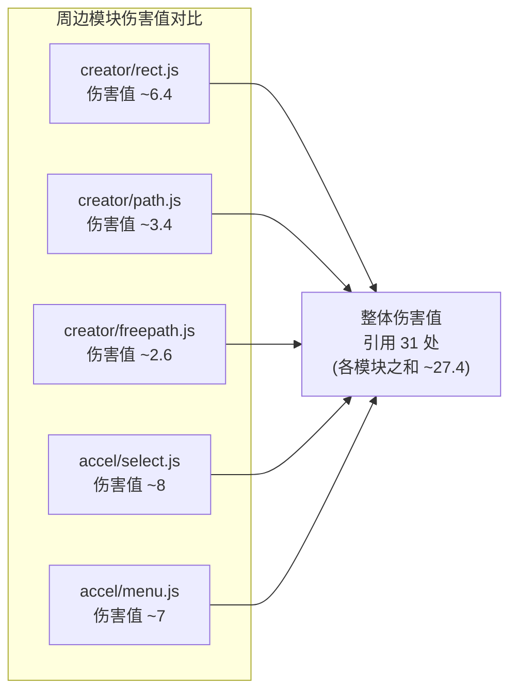
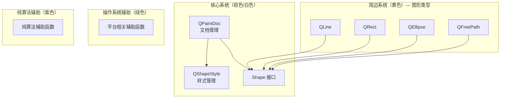
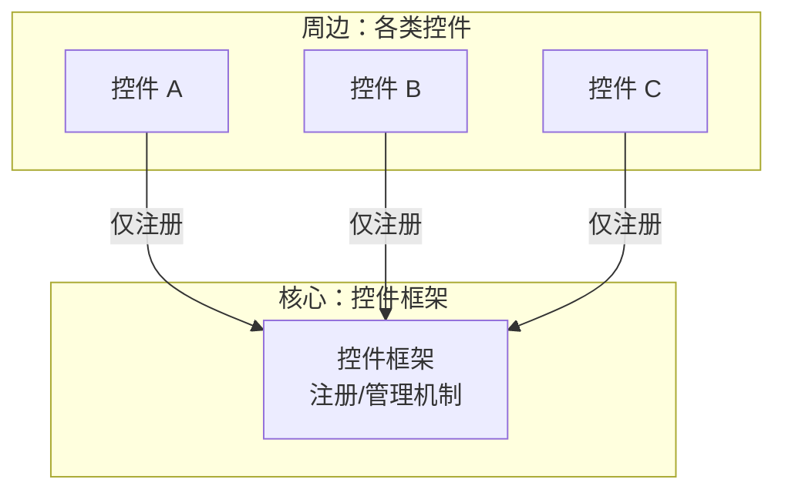

# 实战-“画图程序”的整体架构

## 一、章节导言：从实战验证架构思维

在前面的架构思维篇中（第57讲（详见架构思维/架构设计篇对应章节） ~ 第60讲（详见架构思维/架构设计篇对应章节）），我们反复强调了三个核心论点：

- 架构的本质是**业务的正交分解**，分解后的每个模块业务上仍然自洽
- 关注每个模块的**业务属性**，是架构的最高准则
- 任何业务总可以分解出一个**核心系统**和多个**周边系统**，不同周边系统相互正交

但论点是否成立，终究要看实战验证。本节以第二章"桌面开发篇"的画图程序（v44 版本）为例，解剖架构设计的实际运作机制。

> 源码参考：[https://github.com/qiniu/qpaint/tree/v44](https://github.com/qiniu/qpaint/tree/v44)

## 二、核心概念与原理

### 2.1 四类代码的分类体系

架构分解的第一步，是对代码进行分类。画图程序的全部文件被划分为四类：

| 类别 | 颜色标记 | 定义 | 特征 |
|------|----------|------|------|
| **核心系统** | 棕色 | 业务核心，不可或缺 | 去掉后系统无法完整运行 |
| **周边系统** | 黄色 | 业务的可选组件 | 去掉后系统仍可运行（但功能缩减） |
| **通用控件** | 绿色 | 与业务无关的通用界面元素 | 被周边系统引用，不直接属于业务 |
| **基础框架** | 紫色 | 第三方代码或底层框架 | 最基础的依赖 |

### 2.2 伤害值：量化架构质量的度量

**伤害值**是许式伟提出的衡量周边模块对核心系统"侵入程度"的工程度量。其定义逻辑如下：

- 每处对核心系统接口的引用计为 1 处伤害
- 但如果某接口被 N 个周边模块共用，则每个周边模块仅分担 1/N 的伤害值
- 原因：被多个模块共用的接口天然更稳定，单个模块对其造成的"不稳定风险"更低

> **本质洞察**：抽象出共性的业务方法，比给某个周边模块单独开绿灯要好。每增加一个引用方，就实证了接口的通用性——这正是增加新周边模块反而降低既有模块伤害值的原因。

## 三、Mermaid 图表

### 3.1 画图程序整体文件结构



**关键发现**：画图程序的内核极小——仅 `index.htm`、`view.js`、`dom.js` 三个文件。去掉所有周边系统及其依赖后，程序仍可工作，只不过退化为一个只读的画图查看器（QPaintViewer）。这证明了所有 Controller 都做到了彼此完全正交的可选组件。

### 3.2 周边模块伤害值分析



### 3.3 Model 层的二次分解



**Model 层的伤害值极低**：所有图形对核心系统的需求完全一样，整体伤害值仅为 4，平均每种图形的伤害值为 1。这正是正交分解带来的结果——Shape 接口定义了统一的契约，各图形只需要实现这个契约，对核心系统的侵入极小。

### 3.4 通用控件库的分解



**伤害值更低**：控件只需把自己注册到控件框架中，整体伤害值为 1，平均每种控件的伤害值为 1/3。

## 四、设计原则与权衡分析

### 4.1 核心系统最小化 vs 功能完整性

| 策略 | 优势 | 风险 |
|------|------|------|
| **核心系统最小化** | 内核稳定、周边正交、伤害值低 | 初期功能不完整（如只读查看器） |
| **核心系统膨胀** | 功能完整、无需可选组件 | 耦合度高、演进困难、伤害值高 |

**Trade-off**：接受"最小内核 + 可选周边"的架构，换取长期的演进自由度。核心系统只保留不可或缺的业务逻辑，其余全部以正交的周边模块形式存在。

### 4.2 伤害值共担机制的合理性

伤害值共担机制看似违反直觉——新增一个周边模块反而降低既有模块的伤害值？但这恰恰是工程测量的正确逻辑：

- **被多个模块引用的接口 = 更稳定的接口**。实证比主观判断更可靠。
- **被单一模块引用的接口 = 更危险的接口**。它可能只是为某个模块的"特殊需求"开的绿灯。
- 架构师应追求接口的自然性和通用性，而非为特定周边模块定制接口。

### 4.3 Shape 接口设计的权衡

```go
type Shape interface {
    onpaint(ctx CanvasRenderingContext2D)
    hitTest(pt Point) HitResult
    bound() Rect
    setProp(parent any, key string, val any)
    move(parent any, dx, dy float64)
    toJSON() any
}
```

这个接口的设计选择了**"接口继承 + 组合"而非"类继承"**，体现了 Go 语言的设计哲学：组合实现代码复用，接口实现多态，彼此完全独立。

> **交叉参考**：这与 加餐"想当架构师，我需要成为全才吗？" 中关于"组合优于继承"的讨论一致。

## 五、实践案例与反模式

### 5.1 正面案例：去掉周边系统后的降级运行

去掉所有 Controller 及其依赖后，画图程序退化为 QPaintViewer——一个只读查看器。这看似是"功能缺失"，实则是一个极具工程价值的特征：

- **核心系统独立可用**：即使所有周边模块崩溃，核心仍然可以提供基本功能
- **降级运行是高可用系统的标配**：参见 加餐"怎么保障发布的效率与质量？" 中的故障模式分析

### 5.2 反模式：核心系统为周边模块定制接口

如果核心系统为某个周边模块单独提供接口（只有该模块引用），这相当于为特定需求开了绿灯。表面上解决了问题，实际上：

- 该接口的稳定性仅由单一模块保证，一旦该模块变化，接口也随之变化
- 伤害值分析会立即暴露这类问题（红色标记的独立引用）
- 正确做法是抽象出自然的通用接口，让多个模块共担稳定性

### 5.3 反模式：周边模块之间的直接耦合

两个周边模块不应该直接交互。如果它们需要建立联系，必须通过核心系统作为中介。这确保了周边模块之间的正交性，使得任何一个周边模块可以被独立替换或移除。

## 六、小结与关键要点

1. **架构的本质是业务正交分解**：实战验证了这一论点——画图程序的核心系统极小，周边模块彼此完全正交。
2. **伤害值是量化架构质量的利器**：它不是抽象的"好坏评判"，而是可计算的工程度量。Model 层伤害值仅 4，通用控件库伤害值仅 1——正交分解越彻底，伤害值越低。
3. **核心系统最小化是演进自由度的保障**：去掉所有周边模块后，程序退化为只读查看器仍可运行——这才是好的架构。
4. **接口通用性需要实证而非主观**：被多个模块引用的接口更稳定，伤害值共担机制正是对这一事实的量化表达。
5. **组合优于继承**：Shape 接口的设计证明了接口继承 + 组合比类继承更灵活、更正交。

> **交叉参考**：
> - 架构思维基础：第57讲"心性"（详见架构思维/架构设计篇对应章节）、第58讲"架构设计优劣"（详见架构思维/架构设计篇对应章节）
> - 业务正交分解：第59讲"少谈点框架，多谈点业务"（详见架构思维/架构设计篇对应章节）、第60讲"架构分解：边界"（详见架构思维/架构设计篇对应章节）
> - MVC架构：第22讲"桌面程序的架构建议"
