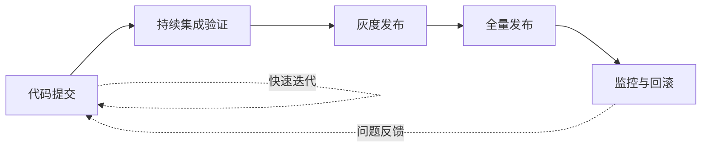
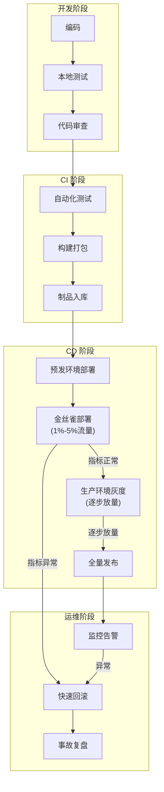
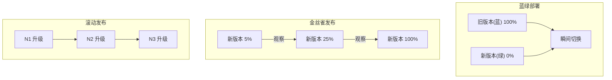
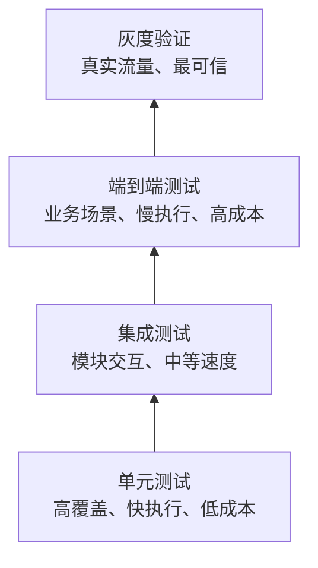

# 怎么保障发布的效率与质量

## 一、章节导言：发布——工程能力的终极考验

"发布"听起来只是工程流程中的一个环节，但它实际上是一切工程能力的集中体现。**开发效率再高，发布跟不上，价值就无法交付。** 发布涉及的不只是技术问题，还涉及团队协作、流程设计、风险控制——它是架构思维在工程实践中的最完整投射。

核心矛盾：**速度与质量的博弈**。发布速度慢意味着交付周期长、反馈慢、机会成本高；发布质量差意味着线上事故、用户信任流失、回滚成本高。两者必须同时保障，不可偏废。

## 二、核心概念与原理

### 2.1 发布的本质：一个置信度博弈过程

发布不是"代码写完推上去"这么简单。每一次发布本质上是一个**置信度博弈**：你需要在"尽早发布获取反馈"和"充分验证降低风险"之间找到最优平衡点。

### 2.2 发布效率的关键度量

| 度量维度 | 定义 | 意义 |
|----------|------|------|
| **发布频率** | 单位时间内的发布次数 | 衡量团队交付能力 |
| **发布前置时间** | 从代码提交到上线的时间 | 衡量流程效率 |
| **发布成功率** | 无回滚的发布占比 | 衡量质量保障能力 |
| **变更失败率** | 导致线上事故的变更占比 | 衡量风险控制能力 |
| **恢复时间（MTTR）** | 从事故发生到恢复的时间 | 衡量应急响应能力 |

### 2.3 破窗效应与发布质量

一个容易被忽视的心理学原理：**破窗效应**。如果发布流程中允许"紧急绕过审批""先上线再补测试"等行为，就是在释放"规矩可以打破"的信号。久而久之，流程的权威性下降，质量保障形同虚设。

**推论**：任何例外都必须被追踪和关闭，不能成为新的常态。

## 三、Mermaid 图表

### 3.1 发布流程全景

### 3.2 灰度发布策略对比

### 3.3 质量保障金字塔

## 四、设计原则与权衡分析

### 4.1 快速回滚 vs 快速修复

| 策略 | 适用场景 | 风险 |
|------|----------|------|
| **快速回滚** | 影响范围大、根因不明 | 回滚本身可能引入新问题 |
| **快速修复** | 根因明确、修复简单 | 修复可能不完整或引入新 bug |

**Trade-off**：默认选择快速回滚（止损优先），除非根因非常明确且修复的置信度极高。这与 第57讲"心性：架构师的修炼之道"（详见架构思维/架构设计篇对应章节） 中"先求不败，再求胜"的思想一致。

### 4.2 发布频率：越高越好？

高频发布（如每日多次）的优势：
- 每次变更集小，问题定位容易
- 回滚范围小，影响面可控
- 团队反馈周期短，迭代速度快

但高频发布的前提条件：
- 完善的自动化测试覆盖
- 灰度发布和快速回滚能力
- 良好的功能开关（Feature Flag）机制

**Trade-off**：发布频率应与工程能力匹配。跳过能力建设直接追求高频发布，等于跳过安全网走钢丝。

### 4.3 自动化验证 vs 人工验证

| 维度 | 自动化验证 | 人工验证 |
|------|-----------|---------|
| **速度** | 极快（秒级） | 慢（分钟到小时级） |
| **一致性** | 完全一致 | 受人为因素影响 |
| **覆盖边界** | 已知场景 | 可发现未知问题 |
| **成本** | 一次性投入高，边际成本低 | 每次都有成本 |
| **适用范围** | 逻辑验证、回归测试 | 体验验证、探索性测试 |

**Trade-off**：自动化验证覆盖主流程和回归场景，人工验证聚焦用户体验和探索性场景。两者互补而非互斥。

## 五、实践案例与反模式

### 5.1 正面案例：七牛的 httptest 驱动的持续验证

结合《实战-"画图"程序后端实战》中介绍的 httptest DSL，七牛实现了：

- 每次代码提交自动触发全量 httptest 测试
- 同一套测试脚本在 staging 和 production 环境执行
- 测试覆盖核心 API 的所有主流程和边界场景

这确保了发布前的高置信度验证，大幅降低了发布风险。

### 5.2 反模式：手动发布清单

"发布前对照清单逐项检查"看似严谨，实则：
- 清单的维护成本高，容易过时
- 人工检查容易遗漏，尤其是疲劳状态下
- 无法与 CI/CD 流程集成

**正确做法**：将清单中的每一项自动化——测试、配置检查、环境验证、灰度发布——全流程无人值守。

### 5.3 反模式：大爆炸式发布

将多个功能积累到一起做一次大发布，表面上"节省发布次数"，实际上：
- 变更集大，问题定位困难
- 回滚影响面大（好功能跟着坏功能一起回滚）
- 风险集中，一次事故影响所有功能

**正确做法**：小步快跑，每个功能独立发布。利用 Feature Flag 控制功能的可见性，而不是控制发布的粒度。

## 六、小结与关键要点

1. **发布是工程能力的终极考验**：它不是独立环节，而是开发、测试、运维能力的综合体现。
2. **速度与质量不是对立面**：高质量保障（自动化测试、灰度发布、快速回滚）恰恰是高频发布的前提，而非障碍。
3. **破窗效应不可忽视**：任何流程例外都必须被追踪和关闭，否则流程的权威性将逐渐瓦解。
4. **灰度发布是最有效的质量保障手段**：真实流量验证比任何测试环境都更可信。
5. **小步快跑优于大爆炸**：每个功能独立发布，利用 Feature Flag 控制可见性。

> **交叉参考**：
> - 测试方法论：《实战-"画图"程序后端实战》中的 httptest 与 mockhttp 实践
> - 架构思维基础：第57讲"心性：架构师的修炼之道"（详见架构思维/架构设计篇对应章节）
> - 工程实践：《实战-"画图程序"的整体架构》
