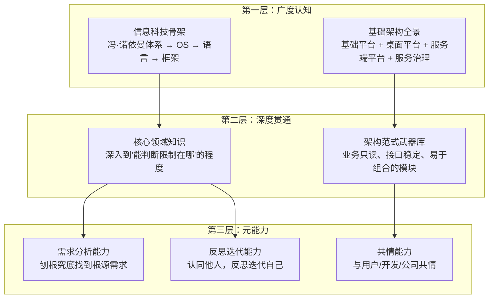
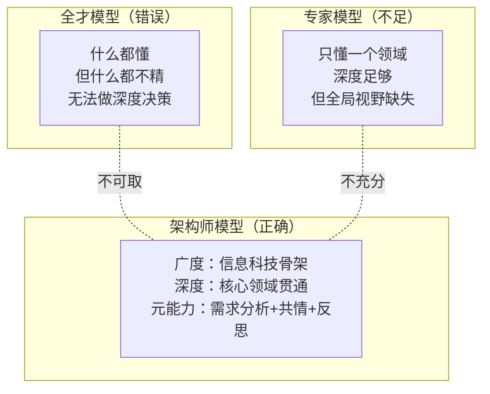
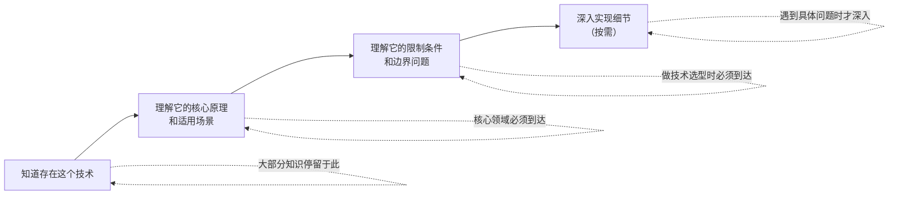
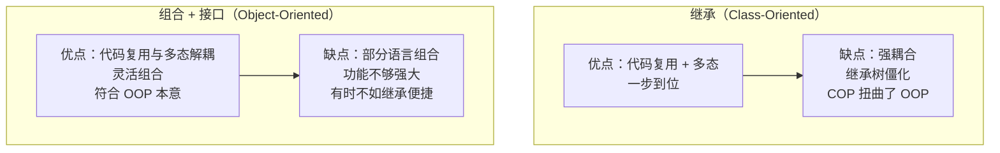

# 想当架构师，我需要成为“全才”吗

## 一、章节导言：架构师的能力模型之争

"架构师是不是什么都得懂？"这是架构课中最常被问到的问题。表面上看，架构师需要全局视野，似乎确实需要"全才"——懂前端、懂后端、懂运维、懂数据库、懂网络、懂操作系统……

但许式伟的回答非常明确：**架构师绝对不是要把自己打造为全才。** 架构师掌控全局的核心思想是**打通经络，让自己的内力在全身自然流通，浑然一体**。在不影响理解的情况下，你需要放弃很多实现细节的专研，但有一天你需要细节的时候，你能够知道存在这些细节，并且快速钻研进去。

> 本节精选自架构课留言区的深度问答，浓缩了许式伟对架构师能力模型、学习方法论、技术选型等核心问题的系统回应。

## 二、核心概念与原理

### 2.1 架构师的能力三层模型

**核心原则**：先广度后深度，但深度不是"什么都深"，而是"需要时能深"。大部分知识不需要深入细节，只在你需要的时候深入，但深入的时候要很深。

### 2.2 "打通经络"的本质

打通经络 ≠ 什么都懂。它的本质是：

| 维度 | 误解 | 正解 |
|------|------|------|
| **知识广度** | 面面俱到、样样精通 | 知道存在什么、能判断边界在哪 |
| **知识深度** | 每个领域都深入 | 核心领域深入，其余按需深入 |
| **知识关联** | 孤立的知识点 | 串成完整认知，不留疑惑 |
| **实践能力** | 每个技术都能上手 | 理解限制条件，能做正确决策 |

## 三、Mermaid 图表

### 3.1 架构师 vs 全才 vs 专家

### 3.2 知识深度策略：按需深入

### 3.3 继承 vs 组合：架构决策的典型权衡

## 四、设计原则与权衡分析

### 4.1 "一专多能"还是"先广后深"？

| 策略 | 适用阶段 | 风险 |
|------|----------|------|
| **一专多能** | 初级工程师，需要先立足 | 容易过早局限在单一领域 |
| **先广后深** | 中级工程师，准备向架构师发展 | 广度可能流于表面 |
| **广度+核心深度+按需深度** | 架构师 | 需要极强的自我驱动力 |

**Trade-off**：不存在唯一正确答案。关键在于"广度"不是浮光掠影，而是要串成完整认知、不留疑惑。"深度"不是什么都深，而是核心领域必须深、其余按需深。

### 4.2 算法学习的必要性

"中小公司学了算法基本用不到"——许式伟指出，更准确的说法是**"想不到"**，或者已经有人实现了你只需要调用。但只有你知道了背后的道理，你才能明白算法对应的限制在哪里，什么情况下应该用什么算法。

**Trade-off**：不需要自己实现每个算法，但必须理解每个算法的前提条件和限制——这是做正确技术选型的基础。

### 4.3 编程框架 vs 编程范式

| 维度 | 编程框架 | 编程范式 |
|------|----------|----------|
| **适用范围** | 领域性（如网络服务器框架） | 普适性（适用于任何领域） |
| **约束力度** | 强约束（规定架构骨架） | 弱约束（提供思维模式） |
| **灵活度** | 低（框架内自由） | 高（范式下自由组合） |

### 4.4 需求分析：架构师的核心能力

准确的需求分析是做出良好架构设计的基础。很多优秀的架构师之所以换到一个新领域一上来并不一定能够设计出好的架构，往往需要经过几次迭代才趋于稳定——**原因在于新领域的需求理解需要一个过程**。

需求分析的关键要素：
- **用户**：面向什么人群
- **问题**：他们有什么要解决的问题
- **核心系统**：我解决这个问题的核心系统

只有满足这三个要素的需求，才能进一步讨论变化点和稳定点。

## 五、实践案例与反模式

### 5.1 正面案例：Go 语言的组合+接口设计

Go 语言是"组合优于继承"理念的第一批明确回应者之一。在 Go 中：
- **组合**实现代码复用
- **接口**实现多态
- 彼此完全独立，非常清晰

这比 C++/Java 的"继承揉合了代码复用和多态"要干净得多。Delphi 之父在创建 .Net Framework 时曾不想要继承，最终向市场低头——但历史终将让 COP（Class-Oriented Programming）回到 OOP 的本来面目。

### 5.2 反模式："最小机器人系统"的需求陈述

> "我要做一个最小机器人系统，需要考虑需求的变化点和稳定点。"

这看似合理，实则缺失了需求分析的关键要素：
- **面向什么用户？**——没有描述
- **解决什么问题？**——没有描述
- **核心系统是什么？**——"最小机器人"可能符合第三点，但前两点缺失

没有用户和问题，就无法判断哪些因素稳定、哪些易变。

### 5.3 反模式：面向类的设计（COP）

COP 的典型问题：每个程序员似乎都要先成为领域专家，然后成为领域分类学专家，构造一个完整的继承树，然后才能 `new` 出对象让程序跑起来。1994 年 Robert C. Martin 就建议面向对象设计从对象活动图入手而非类图入手；1994 年《Design Patterns》建议优先考虑组合而不是继承。

## 六、小结与关键要点

1. **架构师不是全才，而是"打通经络"的人**：广度认知串成完整体系，深度按需深入但深入时极深。
2. **核心能力是需求分析**：架构师至少需要三分之一精力在需求分析上——刨根究底找到根源需求。
3. **组合优于继承**：代码复用和多态应该解耦，Go 语言的"组合+接口"是更干净的设计。
4. **算法的价值在于"理解限制"**：不需要自己实现，但必须理解前提条件和边界——这是正确技术选型的基础。
5. **架构在于创造**：如果从事的事情总是重复别人，那这个公司又有何价值？即使有所参考，也应该有自己的精气神。

> **交叉参考**：
> - 架构师修炼：第57讲"心性：架构师的修炼之道"（详见架构思维/架构设计篇对应章节）
> - 需求分析：第17讲"需求分析（上）"（详见架构思维/架构设计篇对应章节）、第18讲"需求分析（下）"（详见架构思维/架构设计篇对应章节）
> - 架构分解：第60讲"架构分解：边界"（详见架构思维/架构设计篇对应章节）
> - 极限思维：结束语"放下技术人的身段，用极限思维提升架构能力"（详见架构思维/架构设计篇对应章节）
