# 架构师成长与实战方法论

> 本篇合并了三篇加餐内容：「站在更高的视角看架构」「如何做HTTP服务的测试」「想当架构师，我需要成为全才吗？」，共同回答一个核心问题：**如何从工程师成长为架构师，并在实战中验证架构思维？**

---

## 第一部分：架构思维的跃迁——站在更高的视角看架构

### 一、认知跃迁的三阶段模型

从架构课学员"胖哥"（杨彪）的学习经历中，可以提炼出工程师认知升级的三个阶段：

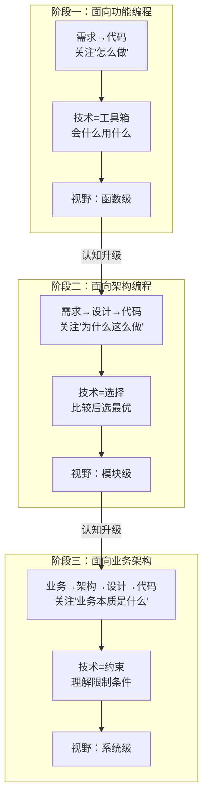

**关键洞察**：架构思维的获得不是"学更多技术"，而是"换一个视角看技术"。每个视角都是上一个视角的"元视角"——站在代码视角无法理解模块设计，站在模块视角无法理解系统架构，只有站在业务视角才能真正理解"为什么"。

### 二、"站在更高视角"的维度展开

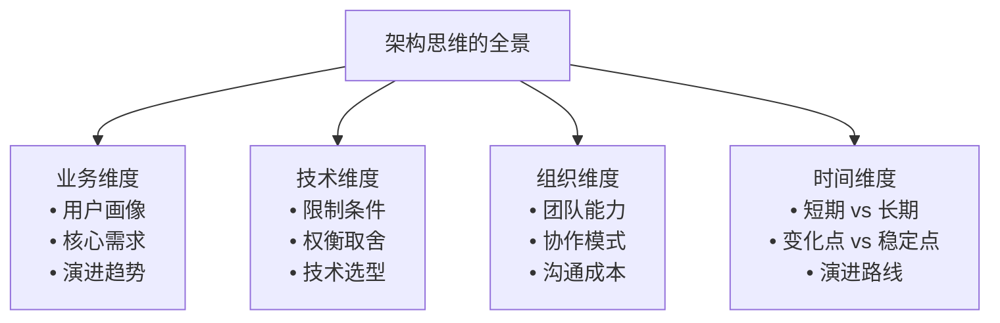

### 三、"学更多" vs "看更高"

| 策略 | 特征 | 效果 |
|------|------|------|
| **学更多技术** | 横向扩展知识面 | 知识面更广，但视角不变 |
| **看更高视角** | 纵向提升认知层次 | 视角改变，旧知识有新理解 |
| **两者结合** | 先提升视角，再扩展知识 | 最高效的学习路径 |

**Trade-off**：单纯"学更多"容易陷入"知识越多越困惑"的困境。只有提升视角后，才能判断"对谁好、在什么条件下好"。

### 四、认知升级的触发机制

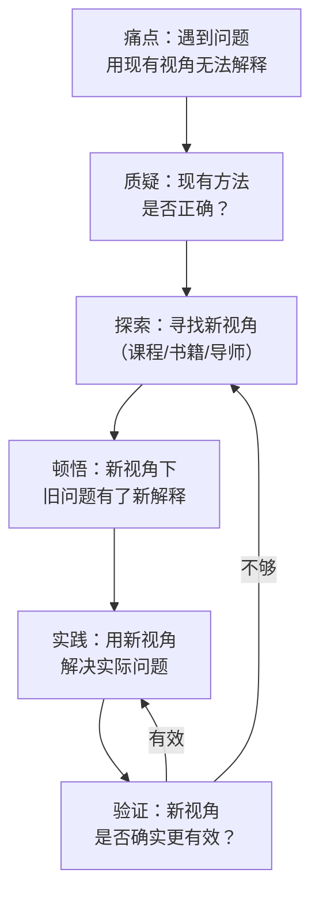

### 五、从"学框架"到"理解设计意图"

胖哥的核心转变：以前学框架关注"怎么用"（API、配置、最佳实践）；现在学框架关注"为什么这样设计"（它解决了什么问题、做了什么权衡、有哪些限制条件）。

正面案例：从"会用 Spring"到"理解 Spring 的设计意图"——关注 IoC 容器解决了什么问题（依赖管理）、AOP 解决了什么问题（横切关注点分离）、Spring Boot 的自动配置做了什么权衡（约定优于配置）。这种转变不是"学到了新知识"，而是"站在了新视角"。

---

## 第二部分：HTTP 服务测试的实战方法论

### 一、HTTP 服务测试的核心困境

基于 HTTP 协议提供服务的好处显而易见，但**如何高效地验证服务逻辑本身**才是工程实践中真正的痛点。核心矛盾在于：**服务端开发与客户端 SDK 的耦合**。传统测试路径存在三重问题：

1. **客户端 SDK 变动导致测试编译失败**，测试稳定性受制于 SDK 的稳定性
2. **SDK 的 API 设计面向使用方而非测试方**，测试代码冗长、意图不直观
3. **过早陷入"SDK 如何抽象更合理"的细节**，偏离了验证服务逻辑本身的目标

**本质问题**：测试应该是"协议级别"的验证，而非"SDK 级别"的验证。网络协议一旦确定，测试就应该能够开始，而无需等待 SDK 成熟。

### 二、解耦策略演进

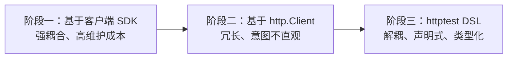

### 三、httptest DSL 的设计哲学

| 原则 | 含义 | 对比 |
|------|------|------|
| **协议级解耦** | 测试直接面向 HTTP 协议，不依赖任何客户端 SDK | 传统方式依赖 SDK 接口 |
| **声明式表达** | "描述想要什么"而非"怎么做" | 命令式代码冗长且意图模糊 |
| **类型化参数** | 每个参数有 JSON 类型，非纯字符串 | Shell 脚本只有字符串类型 |

### 四、httptest DSL 语法结构

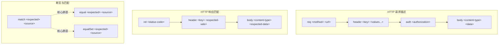

### 五、请求-响应-断言流程

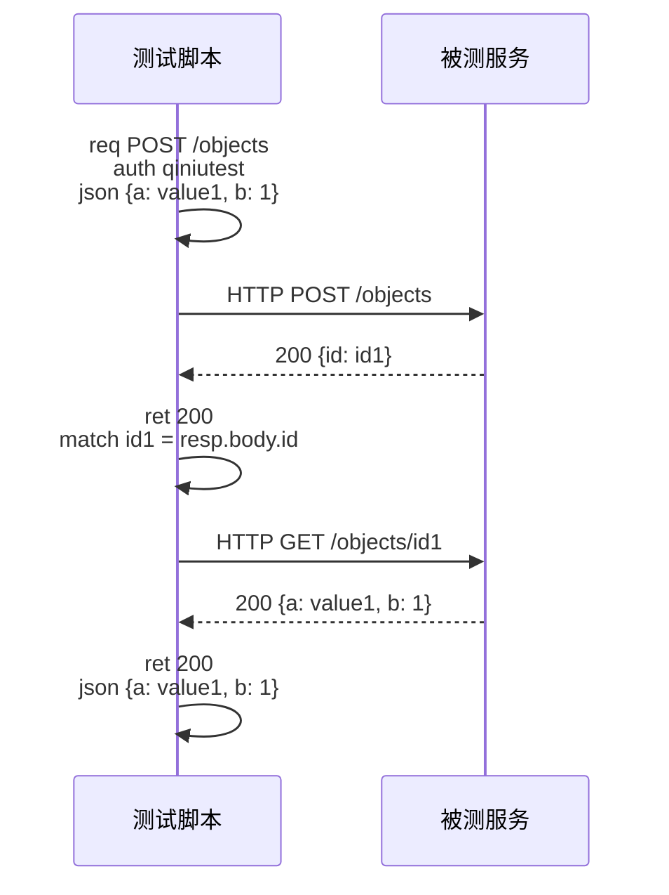

### 六、渐进式严格性

- **match**：允许未绑定变量，支持模式匹配——适合"只关心部分字段"的场景
- **equal**：要求精确相等——适合"必须完全一致"的场景
- **equalSet**：忽略数组顺序的集合相等——适合"内容正确但顺序不确定"的场景

这三者的分层设计体现了**渐进式严格性**原则：默认宽松，按需加严。

### 七、环境参数化机制

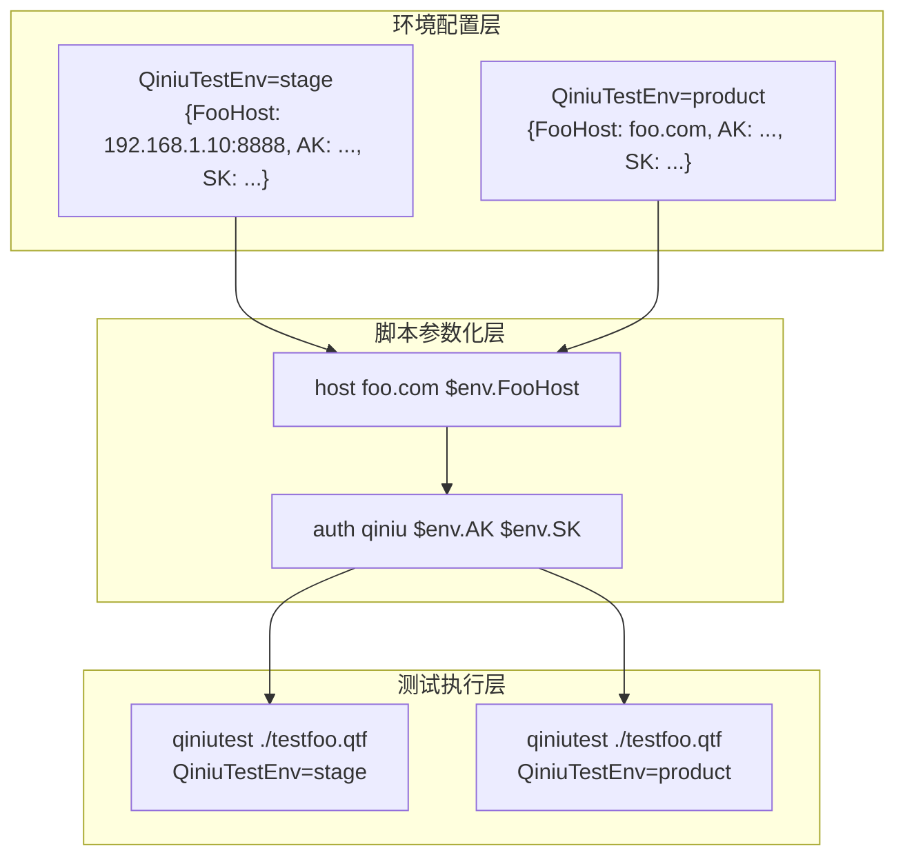

**核心价值**：测试脚本与运行环境完全解耦，一套脚本、多环境执行。

### 八、DSL vs 通用编程语言的权衡

| 维度 | 通用编程语言测试 | httptest DSL |
|------|------------------|--------------|
| **表达力** | 完全图灵完备 | 覆盖 90%+ 场景，极端情况受限 |
| **学习成本** | 无额外学习成本 | 需要学习 DSL 语法（但极简） |
| **测试意图清晰度** | 被样板代码淹没 | 声明式，意图一目了然 |
| **维护成本** | 随 SDK 变化而变化 | 仅随协议变化而变化 |

**Trade-off**：牺牲约 10% 的极端场景覆盖能力，换取 90% 场景下的开发效率倍增——典型的帕累托最优策略。

> 开源项目：[httptest 框架](https://github.com/qiniu/httptest)、[qiniutest 工具](https://github.com/qiniu/qiniutest)

---

## 第三部分：架构师的能力模型——需要成为"全才"吗？

### 一、架构师的能力三层模型

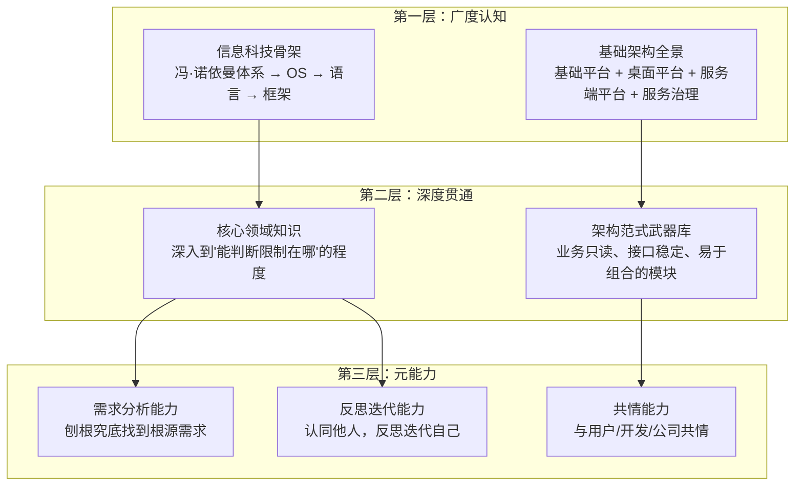

**核心原则**：先广度后深度，但深度不是"什么都深"，而是"需要时能深"。大部分知识不需要深入细节，只在你需要的时候深入，但深入的时候要很深。

### 二、"打通经络"的本质

许式伟的回答非常明确：**架构师绝对不是要把自己打造为全才。** 架构师掌控全局的核心思想是**打通经络，让自己的内力在全身自然流通，浑然一体**。

| 维度 | 误解 | 正解 |
|------|------|------|
| **知识广度** | 面面俱到、样样精通 | 知道存在什么、能判断边界在哪 |
| **知识深度** | 每个领域都深入 | 核心领域深入，其余按需深入 |
| **知识关联** | 孤立的知识点 | 串成完整认知，不留疑惑 |
| **实践能力** | 每个技术都能上手 | 理解限制条件，能做正确决策 |

### 三、架构师 vs 全才 vs 专家

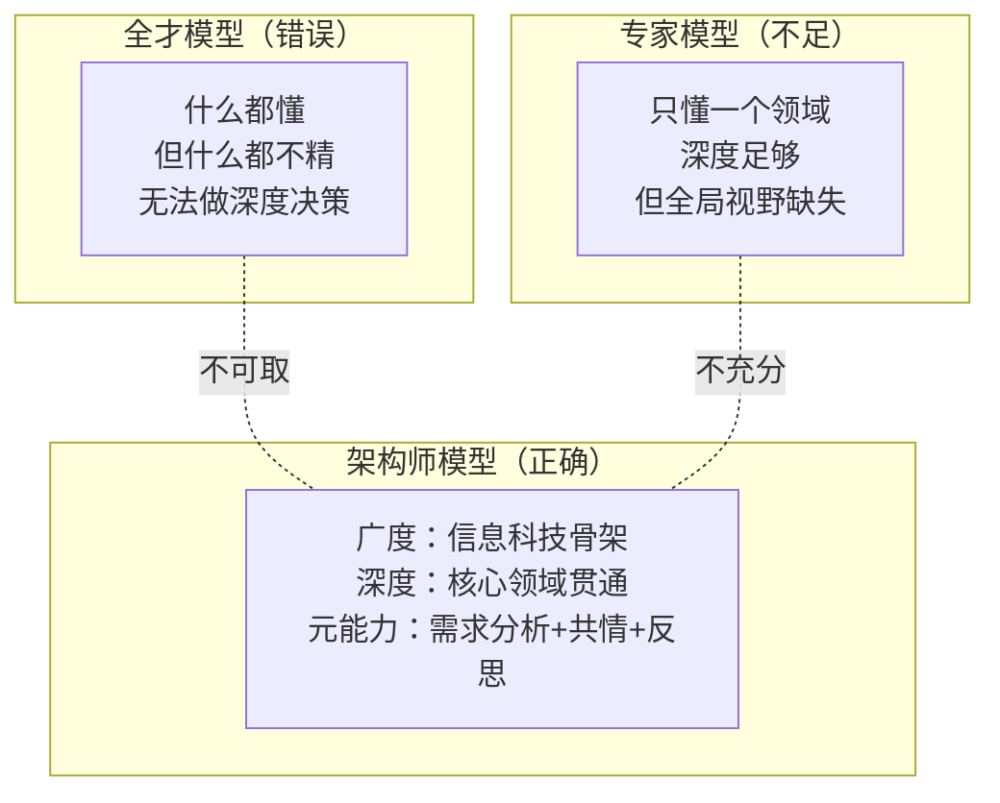

### 四、知识深度策略：按需深入

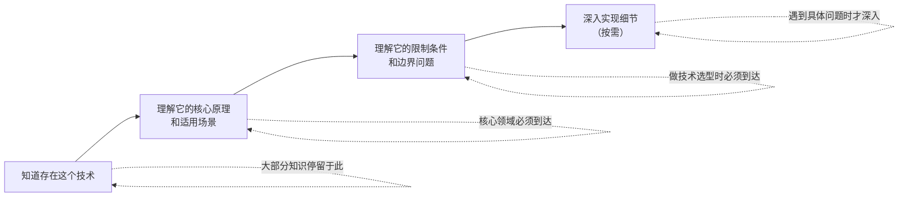

### 五、继承 vs 组合：架构决策的典型权衡

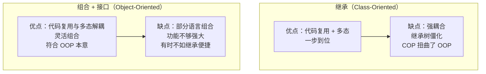

Go 语言的"组合+接口"设计是"组合优于继承"理念的典型实践：组合实现代码复用，接口实现多态，彼此完全独立。

### 六、需求分析是架构师的核心能力

准确的需求分析是做出良好架构设计的基础。需求分析的关键要素：

- **用户**：面向什么人群
- **问题**：他们有什么要解决的问题
- **核心系统**：解决这个问题的核心系统

只有满足这三个要素的需求，才能进一步讨论变化点和稳定点。

---

## 全篇小结与关键要点

1. **架构思维的获得是视角的跃迁**：从"怎么做"到"为什么"，从代码视角到业务视角
2. **协议级测试是正道**：HTTP 服务的测试应直接面向协议，而非面向 SDK
3. **架构师不是全才，而是"打通经络"的人**：广度认知串成完整体系，深度按需深入但深入时极深
4. **需求分析是架构师的核心能力**：至少需要三分之一精力在需求分析上
5. **组合优于继承**：代码复用和多态应该解耦，Go 语言的"组合+接口"是更干净的设计
6. **"为什么"比"怎么做"更重要**：理解设计意图才能做出正确的技术选型
7. **实践与理论必须交替迭代**：每学一个架构概念，立即在项目中验证
8. **效率提升有指数级收益**：测试编写效率的微小提升，日积月累的效果惊人

> **交叉参考**：
> - 架构师修炼：57丨心性：架构师的修炼之道（详见架构思维/架构设计篇对应章节）
> - 架构分解：60丨架构分解与全局性功能设计（见本系列《架构分解与全局性功能设计》）
> - 架构思维总结：67丨架构思维篇：回顾与总结（详见架构思维/架构设计篇对应章节）