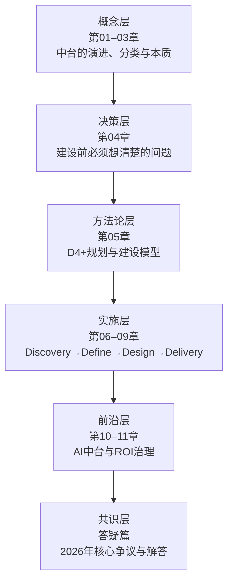

# 开篇词 | 中台的前世今生与2026新格局

## 一个概念的生死轮回

2019 年，"中台"一词席卷中国 IT 圈，几乎每家互联网企业都在高喊"大中台、小前台"。2021 年，"中台已死"的声音开始浮现，一时间质疑与反思铺天盖地。2023–2024 年，阿里拆分中台事业群，腾讯裁撤部分中台团队，似乎一切都在印证那个悲观的判断。然而，到了 2025–2026 年，当大模型（LLM）与 AI Agent（AI 智能体）开始深入企业业务流程，当平台工程（Platform Engineering）成为全球技术社区的主流叙事，当"能力复用"这个核心命题以新的形态再次浮现——业界终于形成了一个更为清醒的共识：

> **中台并未消亡，而是完成了从概念狂热到理性沉淀的生命周期演进。其内核——企业级能力的识别、沉淀与复用——从未失效，只是承载形式从"大一统平台"走向了"分布式能力网格"。**

本文档旨在基于 2026 年的行业全景，系统性地重构中台知识体系。不回避争议，不粉饰失败，不迷信概念，而是以演进视角呈现一个从 2015 年到 2026 年完整周期中，中台从诞生、爆发、质疑到重构的全过程。

## 本文的设计逻辑

全文遵循"**概念→决策→方法论→实施→前沿**"的五层递进结构：

**概念层**（第 01–03 章）：从历史演进与分类体系出发，收敛至中台的本质定义——"企业级能力复用平台"。这一层解决"中台是什么"的问题。

**决策层**（第 04 章）：在中台本质理解的基础上，回答"企业是否需要中台、需要何种中台"的前置决策问题。这一层解决"要不要做"的问题。

**方法论层**（第 05 章）：呈现 D4+模型——从战略到落地的完整方法论框架。这一层解决"怎么做"的整体路线问题。

**实施层**（第 06–09 章）：以业务中台为样本，逐阶段展开 D4+的四个实施阶段。这一层解决"每一步具体怎么做"的问题。

**前沿层**（第 10–11 章）：聚焦 2024–2026 年最具变革性的两大议题——AI 中台与 ROI（Return on Investment，投资回报率）治理体系。这一层解决"前沿方向与度量标准"的问题。

**共识层**（答疑篇）：梳理 2026 年业界对中台核心争议的最新共识。

## 阅读建议

| 读者画像 | 建议路径 | 核心关注 |
|----------|----------|----------|
| 企业技术决策者（CIO/CTO） | 第 04 章→第 11 章→第 05 章→答疑篇 | 是否建中台、ROI 评估、方法论选型 |
| 架构师 | 第 03 章→第 07 章→第 10 章→第 06–09 章 | 本质理解、架构设计、AI 融合 |
| 中台产品经理 | 第 05 章→第 08 章→第 09 章→第 11 章 | D4+模型、产品设计、运营治理、度量 |
| 业务负责人 | 第 01 章→第 03 章→第 04 章→答疑篇 | 中台价值认知、决策判断 |
| AI/数据工程师 | 第 10 章→第 07 章→第 03 章 | AI 中台架构、数据复用模式 |

## 一个核心心法

原文作者王健在 2019 年总结篇中提出的心法——"**以用户为中心**"——至今仍是中台建设的根本出发点。但 2026 年的语境下，这句话需要一次升级：

> **以用户为中心，以能力为原子，以 AI 为加速器，以演进为常态。**

- **以用户为中心**：中台存在的唯一理由是更好地服务前台业务，最终服务用户。脱离此目标的任何中台建设都是过度设计。
- **以能力为原子**：中台复用的不是系统，不是服务，而是"能力"——一种可以被识别、封装、编排、度量且面向业务场景的业务单元。
- **以 AI 为加速器**：大模型与 AI Agent 正在重塑能力复用的实现方式——从人工编排到智能编排，从静态沉淀到动态生成，中台的效率边界正在被突破。
- **以演进为常态**：2026 年的共识是：不存在一劳永逸的中台架构。中台必须像产品一样持续演进，接受业务变化、技术迭代和组织调整的持续冲击。

这四句话构成了 2026 版《说透中台》的心法内核。后文所有章节，均围绕此心法展开。