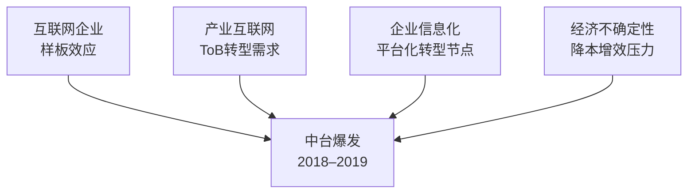
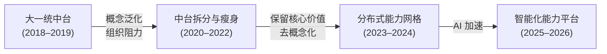
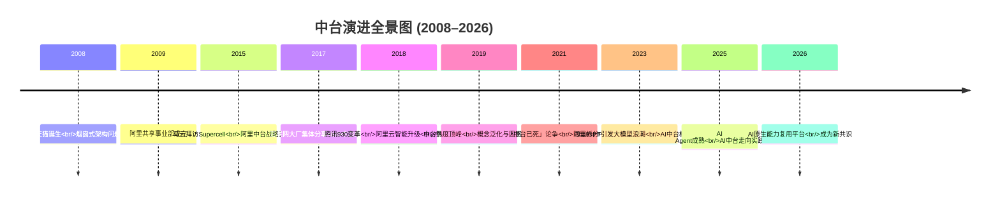

# 中台演进史：从2015到2026的完整脉络

## 1.1 概述

中台并非凭空诞生的概念，亦非昙花一现的炒作。从 2008 年阿里共享事业部的萌芽，到 2015 年中台战略的正式提出，再到 2021 年的"中台已死"论争，直至 2025–2026 年 AI 中台的崛起——这条时间线揭示了一条清晰的演进逻辑：**企业对能力复用的需求从未消失，只是在不同技术周期中呈现出不同的形态**。

本章将中台的发展历程划分为六个阶段，每一阶段以关键事件、核心驱动力与行业影响三个维度展开论述。

## 1.2 阶段一：孕育期（2008–2014）

### 1.2.1 关键事件

- **2008 年**：阿里巴巴战略调整催生天猫。天猫与淘宝出现重复建设问题，即"烟囱式系统架构"——各业务线独立建设功能高度重叠的系统，导致资源浪费与数据割裂。
- **2009 年**：阿里共享事业部正式成立，承担各前台系统中公共部分的平台化改造职责。初期推进困难，直至聚划算业务爆发，共享事业部的价值才被验证，奠定了"大中台"的组织基因。
- **2012–2014 年**：移动互联网爆发期，各互联网企业面临多端适配（Web、iOS、Android、微信）的重复建设压力。腾讯、百度、美团等企业内部出现类似"共享平台"的实践，但尚未上升为战略级概念。

### 1.2.2 核心驱动力

| 驱动因素 | 具体表现 |
|----------|----------|
| 业务规模扩张 | 多业务线并行，烟囱式架构导致重复建设 |
| 移动化浪潮 | 多端适配加剧重复投入 |
| 组织效率诉求 | 各业务线资源争夺，急需统筹机制 |

### 1.2.3 行业影响

此阶段中台尚未成为显性概念，但"厚平台、薄应用"的架构理念已在头部互联网企业内部萌芽。核心矛盾是**平台化治理与企业敏捷响应之间的张力**。

## 1.3 阶段二：战略诞生期（2015–2016）

### 1.3.1 关键事件

- **2015 年**：马云率阿里高管团队拜访芬兰移动游戏公司 Supercell。该公司不足 200 人，凭借 6 年沉淀的公共游戏素材与算法组件，支撑 5–7 人小团队在数周内构建出新产品原型，实现快速试错与规模化创新。Supercell 模式与阿里"厚平台、薄应用"方向高度契合，加速了中台战略的正式确立。
- **2015 年 12 月 7 日**：时任阿里巴巴集团 CEO 张勇发布内部信，宣布全面启动阿里巴巴集团中台战略，构建符合 DT 时代的更创新灵活的"大中台、小前台"组织机制和业务机制。**阿里巴巴中台战略正式诞生**。
- **2016 年**：中台概念处于暗流涌动的沉淀期。阿里内部推进共享事业部升级为中台事业群，滴滴出行启动内部平台化改造，但对外发声较少。

### 1.3.2 核心驱动力

| 驱动因素 | 具体表现 |
|----------|----------|
| 产业互联网转型 | 消费互联网增长见顶，ToB 成为新增长极 |
| 能力复用的战略价值 | 中台成为互联网企业进入传统行业的"技术抓手" |
| 组织敏捷化 | Supercell 模式验证了"小团队+大平台"的可行性 |

### 1.3.3 行业影响

中台从阿里内部实践升级为企业战略级概念，但其影响力尚局限于少数互联网头部企业。传统企业仍处于观望状态。

## 1.4 阶段三：爆发期（2017–2019）

### 1.4.1 关键事件

- **2017 年**：阿里与滴滴出行开始在行业会议和社区中分享中台建设经验。相关书籍（《企业 IT 架构转型之道》）出版。早期探索者（如苏宁、京东）启动中台规划。
- **2018 年 Q3**：中台迎来全面爆发。腾讯 9 月 30 日宣布时隔 6 年的最大规模组织变革（930 变革），新成立云与智慧产业事业群（CSIG），宣布打造技术中台。阿里 11 月将阿里云升级为阿里云智能事业群，中台智能化与云全面结合。京东 12 月宣布组织架构调整，划分前中后台。
- **2019 年**：中台热度达到顶峰。大量传统企业（银行、保险、地产、零售）开始跟进中台建设。市面上出现数十种"XX 中台"概念。同时，行业困惑加剧：中台与平台的边界模糊、建设方法论缺失、ROI 难以量化等问题集中暴露。

### 1.4.2 爆发成因分析

中台的爆发并非单一因素驱动，而是四股力量汇聚的结果：

1. **互联网企业的样板效应**：头部企业高度一致的中台表态与可见的建设成果，形成了强烈的示范效应。
2. **产业互联网转型需求**：消费互联网增长放缓，互联网企业通过中台+云的组合切入传统行业 ToB 市场。
3. **企业信息化平台化转型节点**：经过多年信息化建设，企业内部烟囱林立、数据孤岛等问题日益突出，中台恰好提供了系统性解决方案的叙事框架。
4. **经济不确定性与降本增效压力**：经济下行压力下，企业管理层对能力沉淀、成本优化、快速创新的需求愈发迫切。

### 1.4.3 行业影响

中台从互联网企业走向全行业。但高速扩张带来了概念泛化、方法论缺失、期望过高等问题，为后续的质疑期埋下了伏笔。

## 1.5 阶段四：质疑与反思期（2020–2022）

### 1.5.1 关键事件

- **2020 年**：新冠疫情加速企业数字化转型，中台建设在部分企业中由战略级项目降级为常规 IT 治理项目。部分企业发现中台建设周期长、见效慢，与业务快速迭代的需求产生冲突。
- **2021 年**："中台已死"论争爆发。标志性事件包括：阿里内部开始对中台进行拆分与瘦身，将部分中台能力下沉至各业务线；部分企业中台项目被裁撤或缩减规模。
- **2022 年**：行业进入深度反思期。Gartner 在技术成熟度曲线中将中台相关概念调整至"幻灭低谷期"（Trough of Disillusionment）。但与此同时，数据中台在金融、零售等数据密集型行业持续深化建设，展现出较强的韧性。

### 1.5.2 质疑的核心原因

| 原因 | 具体表现 |
|------|----------|
| 概念泛化 | "万物皆可中台"导致概念边界模糊，建设中台变成政治正确而非业务需要 |
| 方法论缺失 | 大量企业缺乏从战略到落地的系统方法论，建设中台沦为"重新包装微服务" |
| 组织阻力 | 中台涉及跨部门利益再分配，缺乏组织变革配套导致推进困难 |
| 期望过高 | 将中台视为银弹，忽视其建设周期长、见效慢的客观规律 |
| 技术选型误区 | 将中台等同于微服务架构，技术驱动而非业务驱动 |

### 1.5.3 行业影响

质疑期并非中台的终结，而是概念从"狂热"走向"理性"的必要调整。核心洞察：**失败的往往不是中台理念本身，而是将中台当作目标而非手段的建设方式**。那些将中台与业务战略深度绑定、采用渐进式建设路径的企业，在此阶段反而展现出更好的建设成效。

## 1.6 阶段五：理性重构期（2023–2024）

### 1.6.1 关键事件

- **2023 年**：ChatGPT 引发大模型浪潮，AI 中台概念开始出现。阿里云发布通义大模型，并推动 AI 能力与中台的融合。部分企业开始探索"LLM（Large Language Model，大语言模型）+ 中台"的智能化能力复用新范式。
- **2023–2024 年**：平台工程（Platform Engineering）概念从海外传入，成为 DevOps 社区的热点话题。平台工程强调开发者自助服务（Self-Service）和内部开发者平台（IDP）建设，与中台的"赋能前台"理念存在深层呼应。
- **2024 年**：Gartner 发布"新兴技术成熟度曲线"，中台不再作为独立概念出现，但其核心理念——能力复用、平台化、业务赋能——已被整合进"组合式业务"（Composable Business）、"AI 增强型应用"等新叙事中。

### 1.6.2 理性重构的核心逻辑

**从"大一统中台"到"分布式能力网格"**：企业不再追求建设一个覆盖所有业务线的巨型中台，而是转向识别和沉淀细粒度的业务能力单元，通过 API 网关、服务网格、事件总线等技术基础设施实现能力的动态组合与编排。

**从"技术平台"到"业务赋能"**：中台的核心价值始终是业务赋能，而非技术去重。2024 年的共识是：技术去重是平台化的目标，业务赋能才是中台化的目标。

**从"静态沉淀"到"动态演进"**：中台不再是"建好即用"的静态资产，而是需要持续演进、持续验证价值假设的产品。

### 1.6.3 行业影响

质疑期后的理性重构，使中台概念完成了"去泡沫化"过程。行业共识从"要不要建中台"转向"如何正确地建中台"以及"中台在新技术条件下的形态演进"。

## 1.7 阶段六：AI 融合期（2025–2026）

### 1.7.1 关键事件

- **2025 年**：AI Agent（AI 智能体）技术成熟，企业开始将 LLM Agent 与中台能力结合，实现"自然语言驱动的能力调用"。AI 中台从概念走向实践，头部企业（阿里、华为、百度）发布 AI 中台产品或解决方案。
- **2025 年**：MLOps（Machine Learning Operations，机器学习运维）与 LLMOps（Large Language Model Operations，大模型运维）工程体系逐步成熟，为 AI 能力的平台化沉淀提供了技术基础。模型管理、Prompt 编排、RAG（Retrieval-Augmented Generation，检索增强生成）管线、Agent 编排等能力模块开始进入企业中台的复用能力清单。
- **2026 年**：中台与 AI 的融合进入深水区。行业关注点从"是否需要 AI 中台"转向"如何构建 AI 原生的能力复用平台"。低代码/无代码平台与 AI 中台融合，进一步降低前台业务接入中台能力的门槛。

### 1.7.2 AI 融合对中台架构的影响

| 维度 | 传统中台模式 | AI 融合后模式 |
|------|-------------|--------------|
| 能力发现 | 人工梳理业务流程，跨线比对 | AI 辅助业务分析，自动识别复用模式 |
| 能力编排 | 人工定义 API 组合与流程 | LLM Agent 动态编排，自然语言驱动 |
| 能力接入 | 前台团队手动对接 API | 低代码 + AI Copilot 自助接入 |
| 数据复用 | ETL（Extract-Transform-Load，抽取-转换-装载）管线 + 数据仓库 | RAG 管线 + 向量数据库 + 实时数据流 |
| 运营治理 | 人工监控 + SLA（Service Level Agreement，服务等级协议）管理 | AI 驱动的异常检测与自愈 |

### 1.7.3 行业影响

AI 融合期正在重新定义中台的效率边界。传统中台中"人工梳理→手动编排→逐一接入"的线性流程，正在被"AI 辅助发现→Agent 动态编排→自助式接入"的智能化流程替代。但需警惕：AI 是加速器而非替代品——中台的核心逻辑（企业级能力识别、沉淀与复用）并未因 AI 而改变，AI 改变的是实现效率和实现方式。

## 1.8 中台演进全景图

**要点解读**：该时间线直观呈现了中台从 2008–2009 年阿里内部的萌芽，经 2015 年正式上升为战略、2017–2019 年爆发，到 2021 年"中台已死"论争、2023 年 AI 中台涌现、直至 2026 年 AI 原生能力平台成型的过程，呼应了"需求驱动、形式演化、内核不变"的演进逻辑。

## 1.9 本章小结

回顾 2008 年至 2026 年的演进历程，可以提炼出三条核心规律：

**规律一：需求驱动，而非概念驱动。** 中台的每一次跃升都源于真实的业务需求——从烟囱式架构的重复建设之痛，到产业互联网的 ToB 转型之需，再到 AI 时代的能力智能编排之诉求。概念本身不创造价值，对真实问题的有效回应才创造价值。

**规律二：形式演化，内核不变。** 中台的承载形式从"共享事业部"到"大中台"，从"分布式能力网格"到"AI 原生能力平台"，经历了多次变革。但其内核——企业级能力的识别、沉淀与复用——始终未变。

**规律三：周期震荡，螺旋上升。** 中台的发展并非线性推进，而是经历了爆发→质疑→重构的周期震荡。每一次震荡都淘汰了错误的实践方式，保留了核心价值，使中台理念更加精炼与务实。

下一章将从空间维度展开，呈现 2026 年中台的分类体系全景图谱。