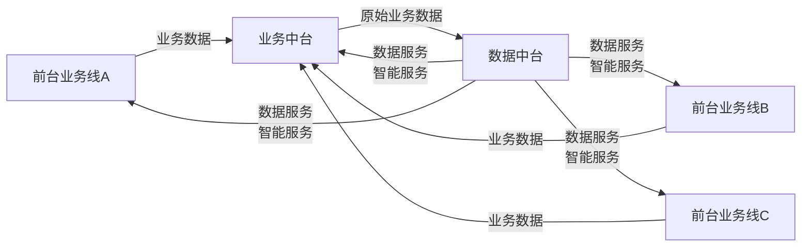
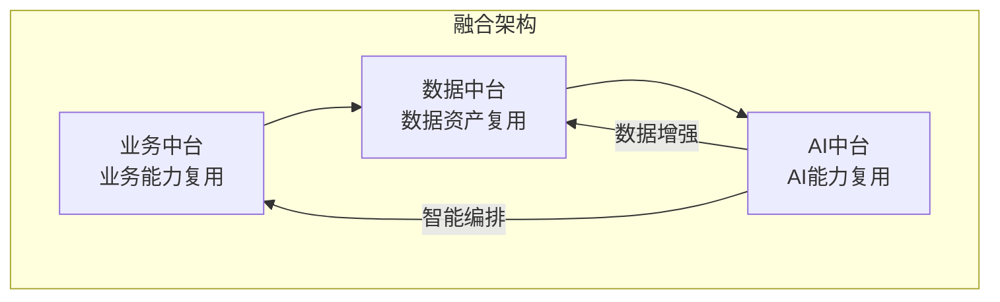
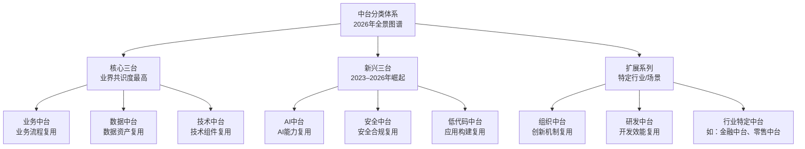

# 中台分类体系：2026年全景图谱

## 2.1 概述

2019 年，中台概念爆发期出现了数十种"XX 中台"的命名——业务中台、数据中台、技术中台、研发中台、移动中台、管理中台、组织中台、财务中台、采购中台……一时间"万物皆可中台"，概念边界严重模糊。

2026 年的视角下，这些命名并非全无意义——它们反映了不同企业从不同维度识别到的能力复用需求。但需要一套更系统化的分类框架来厘清边界。本章提出**"核心三台 + 新兴三台"**的分类体系，作为 2026 年中台分类的行业参考框架。

## 2.2 分类原则

对中台进行分类，须遵循以下三条原则：

1. **业务相关性原则**：中台的核心价值是业务赋能。分类应反映不同中台与业务耦合度的差异，而非仅按技术栈划分。
2. **复用粒度原则**：不同中台承载的能力复用粒度不同。分类应反映从粗粒度（业务模式复用）到细粒度（技术组件复用）的层次关系。
3. **演进独立性原则**：不同中台的演进节奏与生命周期不同。分类应允许各中台独立演进，而非强制绑定于统一的建设路线图。

## 2.3 核心三台

核心三台是中台分类体系的基础层，也是业界共识度最高的三类中台。它们分别对应企业能力复用的三个基本维度：**业务流程复用、数据资产复用、技术组件复用**。

### 2.3.1 业务中台

**定义**：业务中台是承载企业通用业务能力的平台，通过将不同业务线解决相同问题域的解决方案进行抽象与封装，以配置化、插件化、服务化等机制兼顾各业务线的特性需求，实现跨业务线的业务支撑。

**问题域视角**：业务中台的核心问题是——**企业的业务能够顺利开展，需要解决哪些共性问题？**

以电商场景为例，业务开展需要解决的核心问题域包括：

| 问题域 | 核心问题 | 典型中台能力 |
|--------|----------|-------------|
| 用户域 | 用户是谁？从哪里来？如何留存？ | 用户中心、会员中心、认证中心 |
| 商品域 | 卖品是什么？从哪里来？如何定价？ | 商品中心、库存中心、价格中心 |
| 交易域 | 用户如何购买？如何支付？如何退换？ | 订单中心、支付中心、履约中心 |
| 营销域 | 如何让用户知道？如何促进转化？ | 营销中心、优惠券中心、内容中心 |
| 履约域 | 货如何送？如何售后？ | 物流中心、售后中心 |

**关键特性**：

- **狭义业务性**：业务中台承载的是狭义业务概念——保障业务顺利开展的必要业务元素，而非泛化的"所有与业务相关的能力"。
- **问题域驱动**：业务中台的能力划分应以问题域（DDD 中的 Domain，即领域驱动设计中的"领域"）为边界，而非以组织架构或系统边界为边界。
- **多业务线共性**：业务中台必须服务于多条业务线。仅服务于单条业务线的能力沉淀不构成中台，仅为该业务线的内部服务化。

### 2.3.2 数据中台

**定义**：数据中台是对业务数据进行二次加工与治理的平台，通过数据资产化管理、数据服务构建、数据体系化建设，将数据转化为可复用的数据服务，反馈至业务中台与前台，为业务进行数据与智能赋能。

**与数据仓库的本质区别**：

| 维度 | 数据仓库 / 大数据平台 | 数据中台 |
|------|---------------------|----------|
| 出发点 | 技术侧：先有什么数据，能做什么分析 | 业务侧：业务需要什么数据服务，再想办法获取数据 |
| 关注焦点 | 数据存储与计算效率 | 数据资产化与服务化 |
| 服务方式 | 报表、BI（Business Intelligence，商业智能）看板 | 数据 API、数据产品、智能服务 |
| 价值定位 | 支撑性技术系统 | 业务赋能平台 |
| 治理深度 | 数据质量、ETL（Extract-Transform-Load，抽取-转换-装载）管理 | 数据资产目录、指标体系、数据安全、成本治理 |

**数据工厂模型**：数据中台可类比为一个"数据工厂"——原材料仓库（数据采集）→ 流水线加工（数据清洗、计算、建模）→ 产品仓库（数据资产存储）→ 数据商店（数据 API 服务）→ 控制中心（调度与治理）。

**与业务中台的关系**：业务中台产生数据，数据中台对数据进行二次加工，并将结果反馈服务于业务。两者互为输入输出，构成**业务数据双中台**模式。

**要点解读**：图中展示了业务中台与数据中台的协同闭环——各前台业务线把原始业务数据汇入业务中台，业务中台再转交数据中台做二次加工，最终数据中台以"数据服务/智能服务"回流至业务中台及各前台，形成"业务+数据双中台"互相喂养、闭环赋能的结构。

### 2.3.3 技术中台

**定义**：技术中台是将云基础设施能力、技术中间件能力进行整合与包装，过滤技术细节，提供简单一致、易于使用的应用技术基础设施能力接口，助力前台与业务中台、数据中台的快速建设。

**与中间件平台的本质区别**：技术中台与中间件平台的区别不在于技术本身，而在于**视角与治理方式**的差异——

| 维度 | 中间件平台 | 技术中台 |
|------|-----------|----------|
| 驱动力 | 技术去重：消除重复的技术组件 | 业务赋能：让业务更便捷地使用技术能力 |
| 用户体验 | 面向技术人员，API 文档驱动 | 面向业务开发者，自助服务控制台驱动 |
| 治理方式 | 技术标准与规范 | SLA（Service Level Agreement，服务等级协议）保障 + 白屏化运营 |
| 演进方向 | 技术深度优化 | 向业务靠近，降低使用门槛 |

**2026 年技术中台的新内涵**：在云原生与平台工程的双重推动下，技术中台正在从"中间件集合"演进为**内部开发者平台（IDP）**——提供自助式的环境管理、部署流水线、可观测性、安全合规等能力，与平台工程的理念高度融合。

## 2.4 新兴三台

新兴三台是 2023–2026 年间随技术演进与行业需求变化而崛起的三类中台。它们并非对核心三台的替代，而是在新场景下的能力复用延伸。

### 2.4.1 AI 中台

**定义**：AI 中台是承载企业 AI 能力的平台，通过将模型管理、Prompt（提示词）编排、RAG（Retrieval-Augmented Generation，检索增强生成）管线、Agent 编排、MLOps/LLMOps（机器学习/大模型运维）等 AI 工程能力进行平台化沉淀，实现 AI 能力在多业务线间的复用与治理。

**核心能力模块**：

| 能力模块 | 职责 | 典型实现 |
|----------|------|----------|
| 模型中心 | 大模型的版本管理、A/B 测试（A/B Testing，对比实验）、灰度发布 | 模型注册中心、模型评估框架 |
| Prompt 编排 | Prompt 模板管理、版本控制、效果评测 | Prompt Registry、Prompt Flow |
| RAG 管线 | 知识库管理、向量化、检索增强生成 | 向量数据库、Embedding 服务、检索服务 |
| Agent 编排 | 多 Agent 协作、工具调用、任务分解 | Agent Framework、Tool Registry |
| MLOps/LLMOps | 训练管线、推理服务、监控告警 | 训练平台、推理网关、效果监控 |

**与业务/数据中台的关系**：AI 中台并非独立于业务中台与数据中台之外的"第四台"，而是与两者深度融合——

AI 中台消费数据中台的数据资产，为业务中台提供智能编排能力；业务中台的运行数据又回流至数据中台，形成闭环。三者构成**智能化业务数据三中台**的融合架构。

### 2.4.2 安全中台

**定义**：安全中台是承载企业安全与合规能力的平台，通过将身份认证、访问控制、数据脱敏、安全审计、合规检测等安全能力进行平台化沉淀，实现安全策略在多业务线间的统一管控与复用。

**兴起的背景**：2023–2026 年，数据安全法规持续收紧（如《数据安全法》《个人信息保护法》的深入执行），同时大模型应用带来了新的安全风险（Prompt 注入、数据泄露、模型窃取等）。安全能力从各业务线"各自为战"走向"统一管控"成为必然趋势。

### 2.4.3 低代码中台

**定义**：低代码中台是承载企业应用快速构建能力的平台，通过将 UI 组件、业务逻辑模板、数据模型、集成连接器等应用构建要素进行平台化沉淀，实现前台应用在多业务线间的快速搭建与复用。

**与业务中台的关系**：低代码中台可视为业务中台的"最后一公里"——业务中台沉淀了后端的业务能力，低代码中台则提供了前端应用快速组装这些能力的工具链。两者结合，可实现从"能力沉淀"到"能力组装"的完整闭环。

## 2.5 2026 年中台分类全景图谱

**要点解读**：该全景图按"核心三台—新兴三台—扩展系列"三层组织：核心三台（业务/数据/技术）是复用共识度最高的基础层，新兴三台（AI/安全/低代码）代表2023–2026年技术演进下的能力复用延伸，扩展系列则涵盖组织中台、研发中台以及金融、零售等行业特定中台。

## 2.6 分类判别准则

面对"XX 中台"的命名，如何判断其是否属于中台范畴？基于第 03 章将展开的"企业级能力复用平台"定义，可使用以下判别准则：

| 准则 | 判断问题 | 通过标准 |
|------|----------|----------|
| 企业级 | 是否服务于多条业务线或多个前台产品？ | 至少 2 条业务线 |
| 能力性 | 是否承载了可识别的业务/技术能力？ | 能力可被命名、描述、度量 |
| 复用性 | 是否存在跨业务线的复用场景？ | 复用场景已被验证 |
| 平台化 | 是否以平台形式（API/服务/控制台）对外提供？ | 具备标准化的接入方式 |
| 赋能性 | 是否为前台业务提供了增量价值？ | 前台接入后效率/质量可量化提升 |

**五项准则全部满足**，方可判定为真正意义上的中台。仅满足部分准则的，应归入"平台"或"服务"范畴，不宜冠以"中台"之名。

## 2.7 本章小结

2026 年的中台分类体系已从 2019 年的"万物皆可中台"走向"核心三台 + 新兴三台"的理性框架。核心三台（业务、数据、技术）构成了中台的基础层，新兴三台（AI、安全、低代码）代表了技术演进下的能力复用延伸。

关键洞察：**中台的分类不是目的，而是手段——它帮助企业厘清自身需要复用哪类能力，从而避免"为建中台而建中台"的误区**。下一章将深入中台的本质定义，为分类体系提供理论基础。