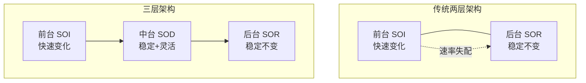
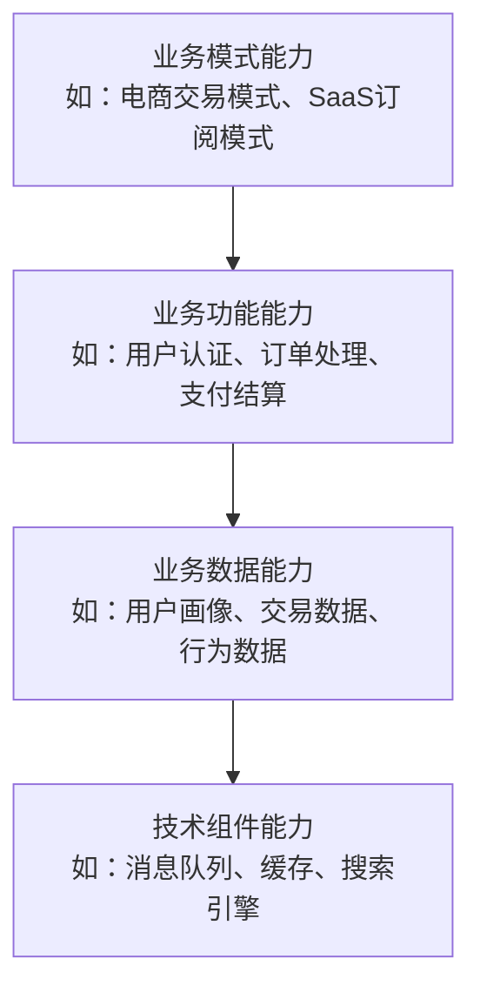
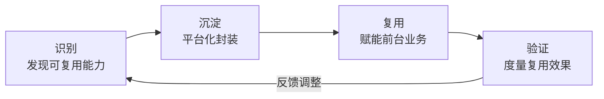

# 中台本质论：企业级能力复用平台的深层逻辑

## 3.1 概述

前两章分别从时间维度与空间维度建立了中台的全局视野。本章将从本质层面回答一个根本性问题：**当我们谈论中台时，我们到底在谈论什么？**

这一问题的回答至关重要——它不仅是一个概念定义问题，更是一把"尺子"，用于丈量任何自称"中台"的系统是否货真价实；同时也是一个"指南针"，为中台建设提供方向指引。

## 3.2 从企业平台化到中台化

### 3.2.1 企业为什么需要平台化

**核心命题**：在以用户为中心的商业环境中，企业的生存与发展取决于其**用户响应力**——即快速响应、探索、挖掘、引领用户需求的能力。

平台化（Platformization）是提升用户响应力的关键手段。其核心逻辑是：通过将企业核心的底层能力进行抽象与沉淀，以平台化包装赋能前台业务，用底层的确定性应对前台业务及用户需求的不确定性。

**平台化思维（Platform Thinking）** 鼓励企业不断抽象沉淀核心能力，但传统平台化存在一个根本性局限——**关注点偏向内部治理，而非前台赋能**。

### 3.2.2 传统"前台+后台"架构的根本矛盾

传统企业架构可简化为"前台+后台"两层模型：

- **前台**：由各类前端业务系统组成，是用户触点，追求快速迭代创新。
- **后台**：由管理企业核心资源（数据+计算）的系统组成，追求稳定可靠，变更成本高。

两层之间存在**速率匹配失衡**——前台需要快速变化以响应用户需求，后台需要稳定运行以保障核心资源安全。这种矛盾在企业业务发展壮大后日益尖锐，导致两种典型反模式：

1. **前台膨胀**：为绕过后台的变更瓶颈，将大量业务逻辑塞入前台系统，导致前台臃肿、重复建设、用户响应力下降。
2. **后台冻结**：为保障后台稳定，拒绝一切变更请求，导致前台业务无法获得所需的后端能力支撑。

### 3.2.3 Gartner Pace-Layered 理论与中台的必然性

Gartner 提出的 **Pace-Layered Application Strategy**（最早发表于 2008 年）为中台的必然性提供了理论支撑。该模型将企业应用系统按变化速率划分为三层：

| 层次 | 名称 | 变化速率 | 典型系统 |
|------|------|----------|----------|
| SOR | Systems of Record | 慢（年级别） | ERP（Enterprise Resource Planning，企业资源计划）、核心账务、财务系统 |
| SOD | Systems of Differentiation | 中（月/季度级别） | 业务中台、数据中台 |
| SOI | Systems of Innovation | 快（周级别） | 前台应用、营销活动 |

**中台就是 SOD**。它提供了比前台（SOI）更强的稳定性，以及比后台（SOR）更高的灵活性，在稳定与灵活之间建立了平衡层。

**要点解读**：对照"传统两层架构"与"三层架构"可直观看到中台（SOD）的定位——通过在前台（SOI）与后台（SOR）之间插入一层更灵活、又更有稳定性保障的中间层，化解前台"快速创新"与后台"稳定不变"之间的速率失配，这正是中台作为"稳定+灵活"平衡层的价值所在。

### 3.2.4 中台化是平台化的下一站

**核心论断**：中台化是平台化向业务方向的进一步演进。传统平台化关注"去重"（消除重复建设），中台化关注"复用"（让前台更容易使用沉淀的能力）。

| 维度 | 平台化 | 中台化 |
|------|--------|--------|
| 核心关注 | 去重（向后看，技术驱动） | 复用（向前看，业务驱动） |
| 视角 | 内部治理 | 前台赋能 |
| 价值度量 | 消除的重复建设量 | 前台接入效率与业务满意度 |
| 演进方向 | 技术深度优化 | 向业务靠近，降低使用门槛 |

## 3.3 中台定义：企业级能力复用平台

经过上述推导，中台的定义可以收敛为九个字：

> **企业级能力复用平台**

这九个字看似简单，但每个词都承载着深层含义。下文逐一拆解。

### 3.3.1 "企业级"——定义范围

**企业级**定义了中台的范围边界：中台处理的问题在企业级别，即至少包含多条业务线或服务多个前台产品（团队）。

**关键推论**：

1. 仅服务于单条业务线的能力沉淀不构成中台，仅为该业务线的内部服务化。
2. 中台建设不是技术问题，而是**企业架构问题**——须跳出单条业务线，站在企业整体视角审视业务全景。
3. 中台建设必然涉及组织问题——跨业务线的利益再分配、职责重新界定、资源重新调配。

**2026 年补充**：在分布式能力网格模式下，"企业级"的内涵从"大一统平台"演进为"跨业务线的能力可发现、可组合"。企业级不再要求所有能力沉淀于同一平台，而是要求能力具备跨业务线的可访问性与可组合性。

### 3.3.2 "能力"——定义承载对象

**能力**定义了中台主要承载的对象。能力的抽象解释了为何存在多种中台——不同企业之所以能同时存在，正是因为其核心能力不同，满足用户不同层面的需求。

**能力的层次结构**：

- **业务模式能力**（最粗粒度）：跨业务线可复用的完整业务模式，如电商交易模式可复用于各垂直品类。
- **业务功能能力**（中粒度）：跨业务线可复用的业务功能单元，如用户认证、订单处理。
- **业务数据能力**（中粒度）：跨业务线可复用的数据资产，如用户画像、交易数据。
- **技术组件能力**（最细粒度）：跨业务线可复用的技术基础设施，如消息队列、缓存。

**2026 年补充**：AI 时代新增一类能力——**AI 推理能力**（如大模型推理服务、Agent（AI 智能体）编排能力）。此类能力横跨业务功能与业务数据两个层次，是 2025–2026 年中台能力清单的重要新增项。

### 3.3.3 "复用"——定义核心价值

**复用**定义了中台的核心价值，也是区分中台化与平台化的关键。

传统平台化关注"可复用性"（Capability 是否可以被复用），中台化进一步关注"易复用性"（Capability 是否容易被前台使用）。从"可复用"到"易复用"的跃迁，体现了从**治理视角**到**赋能视角**的转换。

**复用的三个层次**：

| 层次 | 含义 | 实现方式 | 2026 年演进 |
|------|------|----------|-------------|
| 静态复用 | 预先沉淀的能力被前台调用 | API / SDK / 配置化 | 基础层次，仍为复用的主体 |
| 动态编排 | 预先沉淀的能力被按需组合 | 服务编排 / 事件驱动 / 流程引擎 | 与 AI Agent 编排融合 |
| 智能生成 | 基于意图自动生成能力组合 | LLM（Large Language Model，大语言模型）Agent / 自然语言驱动 | 2025–2026 年前沿方向 |

**关键度量**：

- **可复用性**（Reusability）：能力被多少条业务线使用？
- **易复用性**（Ease of Reuse）：前台接入一个能力需要多少成本（人天/代码量/配置项）？
- **业务响应力**（Business Responsiveness）：前台基于中台能力构建新业务的速度提升了多少？
- **业务满意度**（Business Satisfaction）：前台业务对中台服务的满意度评分？

### 3.3.4 "平台"——定义主要形式

**平台**定义了中台的主要形式——区别于传统应用系统拼凑的方式，中台通过对更细粒度能力的识别与平台化沉淀，实现企业能力的柔性复用。

**平台化的技术要求**：

1. **服务化**：能力以标准化服务（API/事件/消息）形式对外暴露。
2. **可配置化**：能力的行为可通过配置而非代码修改来调整。
3. **可观测化**：能力的运行状态、使用情况、性能指标可被实时监控。
4. **自助化**：前台可通过自助控制台（Self-Service Console）完成能力发现、接入、配置，无需中台团队人工介入。

## 3.4 中台化定义

基于"企业级能力复用平台"的定义，中台化可定义为：

> **利用平台化的思维和手段，梳理、识别、沉淀与复用企业级核心能力的过程。**

中台化是一个**持续过程**，而非一次性工程。它包含以下循环：

1. **识别**：从企业战略与业务现状出发，发现跨业务线的可复用能力。
2. **沉淀**：将识别出的能力进行平台化封装，包括服务化、配置化、文档化、自助化。
3. **复用**：将沉淀的能力赋能前台业务，通过接入与运营实现价值落地。
4. **验证**：度量复用效果，基于反馈调整能力识别与沉淀策略。

## 3.5 2026 年视角的补充：从静态平台到动态能力网格

2026 年的中台实践正在经历一次形态跃迁——从"静态平台"走向"动态能力网格"。

| 维度 | 静态平台模式 | 动态能力网格模式 |
|------|-------------|-----------------|
| 能力形态 | 预先沉淀的固定服务 | 可动态发现与组合的能力单元 |
| 组织模式 | 集中式中台团队 | 分布式能力团队 + 平台治理团队 |
| 技术基础 | 微服务 + API 网关 | 服务网格 + 事件网格 + AI 编排层 |
| 接入方式 | 前台主动对接 API | 能力自动发现 + AI 辅助接入 |
| 演进方式 | 版本化发布 | 持续流动发布（Continuous Flow） |

**动态能力网格**并不意味着中台平台的消解，而是意味着中台的治理重心从"建设平台"转向"治理能力网格"——确保每个能力单元可被发现、可被组合、可被度量、可被演进。

## 3.6 本章小结

中台的本质定义——**企业级能力复用平台**——在 2026 年依然成立，但其内涵已从"静态平台"演进为"动态能力网格"。核心逻辑未变：识别、沉淀、复用企业级能力；变化的是实现方式——从人工编排到 AI 辅助编排，从集中式平台到分布式网格，从一次性建设到持续演进。

**中台到底是什么根本不重要。如何持续提升企业对用户需求的响应力，才是核心命题。** 中台化只是恰好走在正确方向上的一种架构实践。