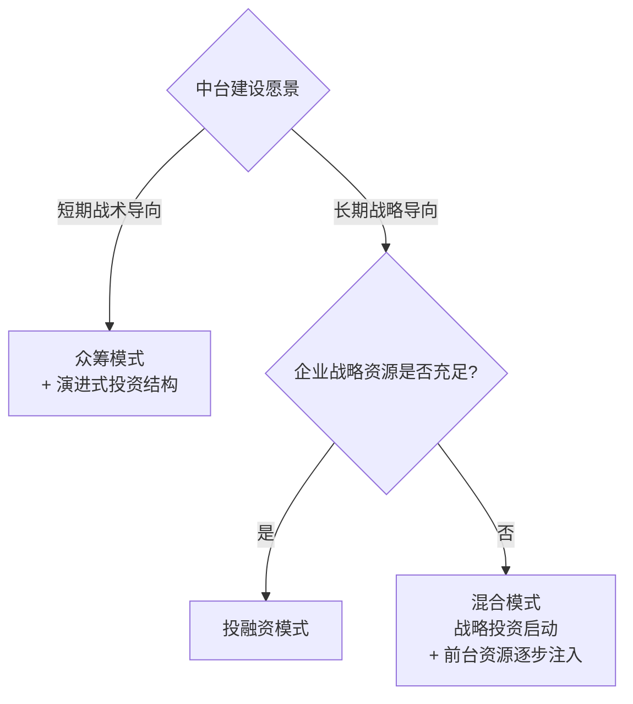
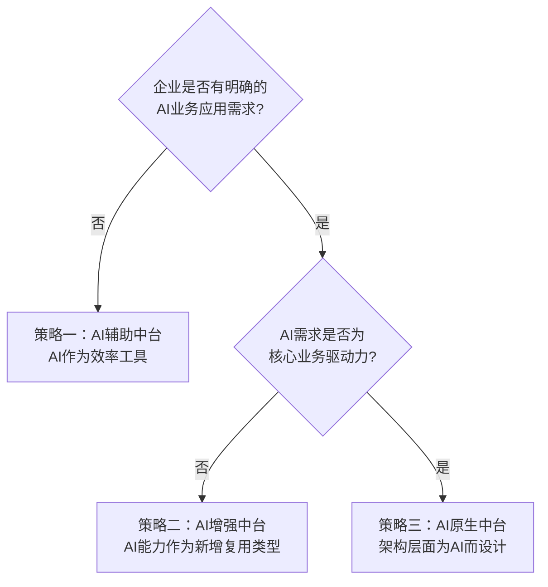
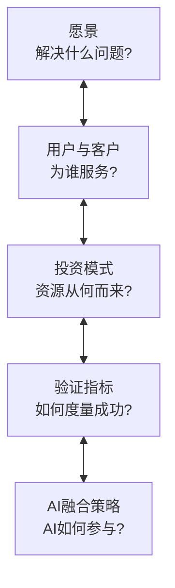

# 中台建设前置决策框架

## 4.1 概述

中台建设失败的首要原因，往往不是技术能力不足或方法论缺失，而是在启动前未充分回答一组前置决策问题。本章基于"极客地产"案例，系统阐述中台建设前必须明确的五个核心问题，并新增 2026 年语境下不可回避的"AI 融合策略"决策维度。

## 4.2 一个警示案例

"极客地产"是一家专注于一线城市高科技园区周边地产开发的垂直型企业。行业转型压力下，管理层决定启动中台建设，将任务交给公司最资深的 IT 负责人小王。六个月后，项目陷入困境：

- **需求拥堵**：中台成为各前台业务的共享外包团队，需求排期爆满，但前台仍投诉响应慢。
- **干系人旋涡**：前台、后台、管理层各有不同诉求且相互矛盾，中台团队被多方拉扯。
- **价值模糊**：半年过去，产出零散，前台不愿接入，建设效果无法量化。
- **边界失焦**：中台什么需求都接，无法判断哪些该做哪些不该做。

此案例并非虚构——在中台建设史上，类似困境屡见不鲜。其根因可追溯至五个未充分回答的前置问题。

## 4.3 前置问题一：中台建设的愿景是什么？

### 4.3.1 为什么愿景是第一问题

"遇事不决看愿景"——这是中台规划与落地过程中最核心的行动准则。

中台是一个解决方案，而非问题本身。将中台当作问题本身（"我们需要一个中台"）是建设失败的首要风险。正确的起点是：**中台建设要解决什么问题？对企业与业务有什么价值？**

愿景的作用：

1. **指引方向**：让所有角色明确中台建设的方向，避免在建设过程中迷失。
2. **做减法**：帮助判断哪些事情是中台该做的（符合愿景），哪些不是（不符合愿景）。做减法比做加法更重要。
3. **形成共识**：愿景须上至管理层、下至中台相关人员均明确并达成一致。

### 4.3.2 愿景制定的常见误区

| 误区 | 表现 | 后果 |
|------|------|------|
| 愿景缺失 | "领导说要做中台" | 方向不清，随波逐流 |
| 愿景模糊 | "消除烟囱、打通孤岛" | 无法判断优先级，什么都做 |
| 愿景过大 | "成为行业领先的中台" | 难以落地，资源分散 |
| 愿景不一致 | 各方对中台目标理解不同 | 内部拉扯，效率低下 |

### 4.3.3 愿景制定工具：电梯演讲

电梯演讲（Elevator Pitch）是一种强制收敛的产品愿景表达工具。其核心是限定产品最关键因素——用户是谁、解决什么问题、差异化特点是什么——在极短时间内讲清楚。

| 要素 | 问题 | 示例（极客地产中台） |
|------|------|---------------------|
| 目标用户 | 谁是中台的用户？ | 前台业务线的产品与研发团队 |
| 核心问题 | 中台解决什么问题？ | 新业务线从 0 到 1 构建业务系统的周期过长 |
| 解决方案 | 中台如何解决问题？ | 沉淀成熟业务线通用能力，复用至新业务线 |
| 差异化 | 与现有平台的区别？ | 从"技术去重"到"业务赋能" |
| 价值度量 | 如何验证成功？ | 新业务线基于中台能力上线周期缩短 50% |

**关键原则：愿景的价值和难度在于充分收敛，而非充分展开。**

## 4.4 前置问题二：中台的用户与客户是谁？

### 4.4.1 用户与客户的区分

中台作为企业内部平台类产品，其干系方体系远比 ToC 产品复杂：

- **用户**（User）：中台服务的直接使用者——前台业务线的产品与研发团队。关注短期战术目标（本月/本季度的 KPI 达成）。
- **客户**（Customer）：中台建设的实际出资方与决策者——企业管理层。关注长期战略目标（企业 3–5 年的发展方向）。
- **其他干系方**：后台系统团队、合规部门、安全部门等，各有不同诉求。

### 4.4.2 长期战略与短期战术的张力

中台建设的根本张力在于：**客户（管理层）关注长期战略价值，用户（前台）关注短期战术效果**。

| 干系方 | 关注维度 | 典型诉求 |
|--------|----------|----------|
| 管理层（客户） | 长期战略 | 能力沉淀、业务创新、降本增效 |
| 前台团队（用户） | 短期战术 | 快速响应需求、降低接入成本 |
| 后台团队 | 稳定安全 | 最小变更、合规审计 |
| 中台团队 | 自主发展 | 清晰边界、自主规划 |

**核心结论**：中台建设需兼顾各方利益，但**主要解决的是企业管理层对公司长期生存与可持续发展的战略诉求**。前台业务团队的短期战术诉求是中台建设过程中的重要约束，但不应成为中台方向的唯一驱动力。

## 4.5 前置问题三：中台的资金与资源从何而来？

### 4.5.1 两种投资模式

| 模式 | 机制 | 适用场景 | 风险 |
|------|------|----------|------|
| 众筹模式 | 前台业务出资，中台反哺前台 | 愿景为解决短期战术问题 | 中台沦为前台外包团队，失去自主性 |
| 投融资模式 | 企业战略投资，建设期后逐步回收 | 愿景为解决长期战略问题 | 前期资源需求大，需较强战略决心 |

### 4.5.2 模式选择决策矩阵

**2026 年补充**：AI 中台建设通常需要较高的前期投入（GPU 算力、模型训练成本、数据标注成本），更适合采用投融资模式或混合模式启动。

## 4.6 前置问题四：中台的目标如何验证？

### 4.6.1 度量难点

中台度量的核心难点在于：中台不直接面向最终用户，其价值须通过前台业务间接体现。中台可以声称"前台的成功有我赋能之功"，但无法拿出数据证明多少用户增长归因于中台。相反，前台可能归咎"中台拖了后腿"。

### 4.6.2 验证指标设计原则

1. **以终为始**：在建设开始前即设计验证指标，而非建设完成后补设。
2. **多维度设计**：按干系方关注点设计不同维度的指标。
3. **可归因**：指标应能区分"中台贡献"与"前台自身贡献"。

### 4.6.3 验证指标框架

| 维度 | 指标示例 | 数据来源 |
|------|----------|----------|
| 战略价值 | 新业务线基于中台上线的数量与速度 | 项目立项与上线时间记录 |
| 用户价值 | 前台接入满意度评分（NPS，Net Promoter Score，净推荐值） | 季度满意度调查 |
| 降本提效 | 前台接入中台能力后的研发人天节省量 | 项目工时对比 |
| 质量保障 | 中台服务可用性（SLA 达标率，Service Level Agreement） | 监控系统数据 |
| 创新赋能 | 基于中台能力衍生的创新业务数量 | 业务创新评审记录 |
| AI 增效 | AI 辅助能力调用次数与准确率 | AI 服务日志 |

### 4.6.4 阿里中台考核体系参考

阿里巴巴的中台考核体系曾设计为：**40% 稳定性 + 25% 业务创新 + 20% 服务接入量 + 15% 客户满意度**。

此体系不可直接照搬——中台愿景不同，考核重点自然不同。但其设计思路值得借鉴：**多维度、有侧重、可量化**。

## 4.7 前置问题五（2026 新增）：中台与 AI 的融合策略

2025–2026 年，大模型与 AI Agent 技术已深入企业业务流程。中台建设者在启动前须回答一个新问题：**中台与 AI 的融合策略是什么？**

### 4.7.1 三种融合策略

| 策略 | 描述 | 适用场景 | 风险 |
|------|------|----------|------|
| AI 辅助中台 | AI 用于加速中台自身建设（如 AI 辅助代码生成、自动化测试、智能运维） | 所有中台建设项目 | AI 贡献有限，仅为效率工具 |
| AI 增强中台 | 中台沉淀 AI 能力（如 LLM 推理服务、RAG 管线），作为新的复用能力类型 | 企业有明确的 AI 应用需求 | AI 能力治理复杂度高 |
| AI 原生中台 | 中台从架构层面为 AI 而设计，能力以 Agent 可调用形式存在 | AI 驱动型业务（如智能客服、智能推荐） | 架构改造幅度大，技术风险高 |

### 4.7.2 融合策略选择决策树

**要点解读**：该决策树先判断企业是否有明确的 AI 业务应用需求：无则选"AI 辅助中台"（把 AI 当效率工具）；有则进一步看 AI 是否为核心业务驱动力，非核心选"AI 增强中台"（把 AI 能力沉淀为复用类型），核心则选"AI 原生中台"（从架构层面为 AI 而设计），层层收敛出三种融合策略的适用边界。

## 4.8 决策框架总结

五个前置问题构成了中台建设的**决策框架**：

五个问题并非线性递进，而是相互关联——愿景决定用户与客户，用户与客户影响投资模式，投资模式约束验证指标，AI 融合策略则与愿景和投资模式双向关联。

**核心结论**：中台建设的"周边环境"是否就绪，比中台建设方法论本身更为关键。许多企业中台失败，不是因为方法不对，而是因为走得过早——思路超前的代价往往是组织与资源尚未准备就绪。