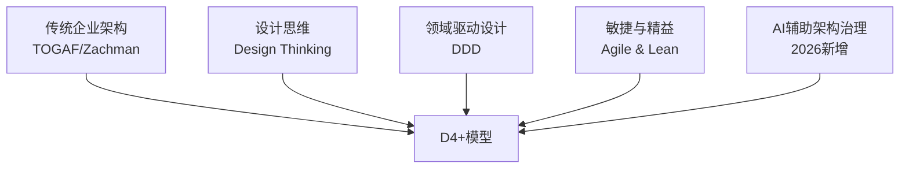
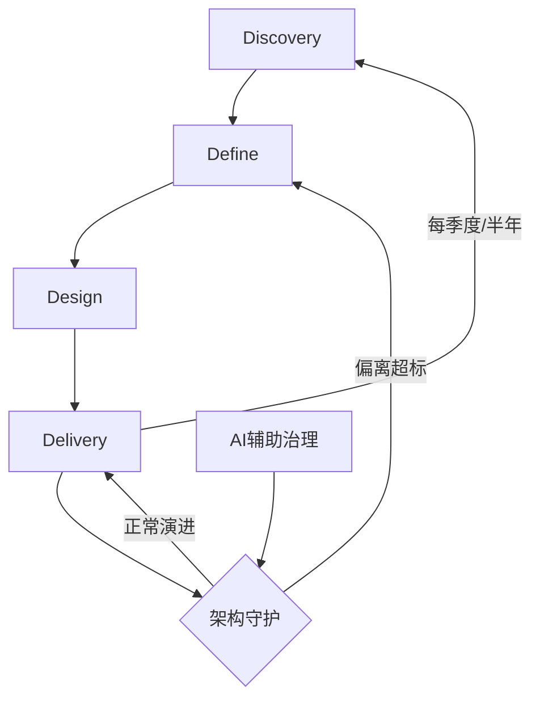

# D4+ 模型：中台规划建设方法论（2026升级版）

## 5.1 概述

第 04 章明确了中台建设前须回答的五个前置问题。假设这些问题已得到充分回答，接下来的核心问题就是：**中台到底该如何落地？**

本章基于 ThoughtWorks 在 2017–2024 年间多个中台建设项目中沉淀的方法论——D4 模型，结合 2025–2026 年 AI 融合与平台工程的新实践，提出 **D4+ 模型**。

## 5.2 从系统级到企业级：中台建设的本质差异

### 5.2.1 一个典型的困境

中台建设启动时，最常见的误区是以"做一个分布式系统"的思路来"做一个中台"。以极客地产为例：小王作为资深架构师，对分布式服务化改造、微服务技术架构、领域驱动建模轻车熟路。但真正动手后，发现中台建设的难度远超系统建设——

- **范围不可控**：中台涉及企业全业务线，业务梳理的范围与粒度如何界定？
- **验证无标准**：规划出的中台方案，如何证明它是对的？
- **组织阻力大**：跨部门协调、利益再分配，远超技术挑战。

### 5.2.2 根因："企业级"改变了问题的性质

做一个中台与做一个分布式系统的根本差异在于**范围**——"企业级"三个字改变了问题的性质：

1. **目标层面**：企业级问题是战略级问题，须从企业战略分析入手，不能仅从现状业务出发。
2. **组织层面**：企业级问题必然涉及组织变革与利益再分配——"为什么要配合中台？""为什么要把数据给中台？"
3. **业务层面**：企业级业务不仅包含当前的全业务线，还包括未来尚未成型的创新业务。

**核心结论**：中台建设本质上是一个**面向用户与创新的平台型企业架构**问题，而非技术架构问题。

## 5.3 为什么传统 EA 方法力不从心

传统企业架构方法（如 TOGAF（The Open Group Architecture Framework，开放群组架构框架）、Zachman）已有 20 余年历史，但在处理中台这种平台型企业架构时存在三重局限：

| 局限 | 具体表现 |
|------|----------|
| 基于 As-Is 的流程梳理 | 传统 EA 基于现状业务流程，产出多为"该采购什么系统"。中台建设更多是为未来（To-Be）业务创新服务。 |
| 重的流程 | 传统 EA 需长时间大量调研，产出动辄数百页文档。在互联网级变化速度下，规划完成即过时。 |
| 缺乏能力复用视角 | 传统 EA 解决"信息化"问题，中台解决"能力复用"问题。前者关注流程效率，后者关注能力沉淀。 |

因此，需要在传统 EA 框架基础上，融入三组新方法论：



- **设计思维**：解决创新问题，以用户为中心而非以流程为中心。
- **领域驱动设计**：解决能力识别问题，透过业务流程洞见问题域本质。
- **敏捷与精益**：解决过程重、响应慢的问题，实现轻量快速的架构演进。
- **AI 辅助架构治理**（2026 新增）：利用 AI 辅助架构分析、影响评估与持续治理。

## 5.4 D4+ 模型全貌

D4+ 模型将中台从整体规划到落地交付的过程划分为四个阶段，包含**两轮发散与收敛**，以及贯穿始终的**持续演进机制**：

```mermaid
graph LR
    subgraph 第一轮：企业级
        D1[Discovery<br/>发散：全景调研] --> D2[Define<br/>收敛：架构定义]
    end

    subgraph 第二轮：产品级
        D3[Design<br/>发散：产品设计] --> D4[Delivery<br/>收敛：交付验证]
    end

    D2 --> D3
    D4 -->|持续演进| D1

```

**要点解读**：D4+ 模型分为两轮"发散→收敛"——第一轮在企业级完成从 Discovery（全景调研）到 Define（架构定义）的收敛；第二轮在产品级完成从 Design（产品设计）到 Delivery（交付验证）的收敛；末端的"持续演进"箭头回到 Discovery，形成覆盖中台建设全生命周期的闭环。

### 5.4.1 Discovery（发现）：全景调研

**目标**：建立企业与行业的全局视野，为后续收敛提供充分的信息支撑。

**输入**：企业愿景与战略。

**核心活动**：
- 由外到内：行业趋势与竞争对手分析
- 自上而下：企业战略分解
- 自下而上：业务与 IT 现状调研

**产出**：多维度的企业全景信息——行业趋势、竞争格局、战略举措、业务痛点、IT 资产全貌。

**2026 升级**：引入 AI 辅助调研——利用 LLM（Large Language Model，大语言模型）自动分析行业报告、竞品资料、企业内部文档，加速信息收集与初步分析。

### 5.4.2 Define（定义）：架构定义

**目标**：基于 Discovery 收集的信息进行收敛，设计平台型企业架构，确定中台建设的优先级与路线图。

**输入**：Discovery 的多维信息产出。

**核心活动**：
- 跨业务线业务梳理与重合度分析
- 领域驱动设计（DDD）问题域分析
- 平台型企业架构设计（业务架构→数据架构→应用架构→技术架构）
- 多维度优先级排序，形成演进路线图

**产出**：平台型企业架构设计文档 + 中台建设演进路线图。

**关键决策点**：回答"要不要建中台？需要哪些中台？谁先建？"

### 5.4.3 Design（设计）：产品设计

**目标**：针对实施路线图中的具体中台产品，进行详细的产品级设计。

**输入**：Define 阶段的架构定义与路线图。

**核心活动**：
- 中台产品愿景确定（电梯演讲）
- 业务梳理范围确定
- 细粒度业务梳理与中台需求识别
- MVP（Minimum Viable Product，最小可行产品）定义与优先级排序
- 运营计划与度量指标前置设计

**产出**：中台产品设计文档（含愿景、边界、需求列表、技术架构、交付计划、成本预估）。

### 5.4.4 Delivery（交付）：精益交付

**目标**：以精益与敏捷方式交付中台产品，快速验证、持续调整。

**输入**：Design 阶段的产品设计文档。

**核心活动**：
- 团队组建与能力建设
- 精益产品研发流程（小步迭代、快速验证）
- 中台运营治理（用户分层、SLA（Service Level Agreement，服务等级协议）管理、白屏化）
- 架构守护与持续演进

**产出**：可运行的中台产品 + 持续运营机制。

## 5.5 D4+ 的"+"——持续演进机制

D4+ 相较于原 D4 模型的核心升级，在于增加了**持续演进机制**。中台建设不是一个"从 Discovery 到 Delivery 就结束"的线性过程，而是一个持续循环的演进过程：



**持续演进的核心实践**：

1. **定期轻量 Discovery**：每季度到半年，重新审视企业战略与业务变化，调整中台规划方向。
2. **架构守护（Architecture Fitness）**：建立架构适应度函数，持续监控实现与设计的偏离度。偏离超标时触发 Define 阶段的重新收敛。
3. **AI 辅助架构治理**：利用 AI 工具自动检测架构漂移、识别技术债务、评估变更影响，降低架构治理的人力成本。

## 5.6 D4+ 的核心原则

D4+ 模型践行以下核心原则：

| 原则 | 含义 | 体现 |
|------|------|------|
| Think Big | 想得长远——站在企业战略高度规划 | Discovery + Define 阶段的全景视野 |
| Start Small | 快速切入——以 MVP 方式启动建设 | Design 阶段的 MVP 定义 |
| Move Fast | 持续演进——基于反馈快速调整 | Delivery 阶段的精益迭代 + 持续演进机制 |
| AI Accelerated | AI 加速——利用 AI 提升各阶段效率 | AI 辅助调研、AI 辅助架构治理、AI 增强中台 |

## 5.7 本章小结

D4+ 模型是从传统企业架构方法出发，融合设计思维、领域驱动设计、敏捷精益与 AI 辅助治理而形成的**面向用户与创新的平台型企业架构方法论**。它通过两轮"发散→收敛"的过程，实现了从企业战略到产品交付的完整闭环，并通过持续演进机制应对中台建设过程中的不确定性与复杂性。

后续四章将逐阶段展开 D4+ 的实施细节。