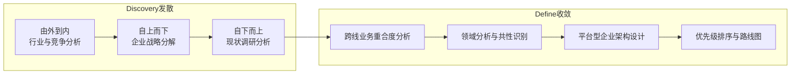
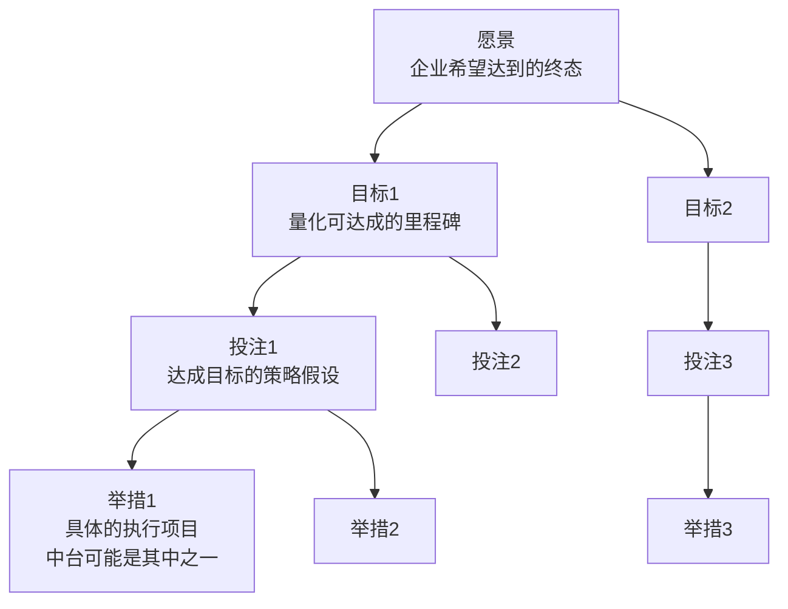

# Discovery：企业战略分解与全景调研

## 6.1 概述

Discovery 是 D4+ 模型的第一阶段，也是整个中台建设的"信息基石"。其核心目标是**建立企业与行业的全局视野**，为 Define 阶段的架构收敛提供充分的信息支撑。

Discovery 与 Define 合称 **Portfolio Discovery（PD）**，即"投资组合规划"。PD 的本质是回答：在资源有限的前提下，如何找到最优的数字化建设投资组合——中台建设只是其中一个潜在选项。

整个 PD 过程以**工作坊**方式推进，通常持续 4–8 周，关键角色协同参与。

## 6.2 为什么需要 PD 式的规划

### 6.2.1 PD 解决的核心问题

如果将企业数字化转型视为一项投资组合决策，CIO（Chief Information Officer，首席信息官）的核心问题就是：

- 未来 1–5 年，数字化建设的预算如何分配？
- 新增哪些系统？购买还是自研？干掉/优化/维护哪些系统？
- 是否需要建设中台？如果需要，优先级如何？

**关键洞察**：中台并非必然选项，而是基于企业战略与现状推导出的潜在解决方案之一。如果一开始就将中台作为既定方向，可能会错过更简单、更有效的解决方案，或在不需要中台的场景下过度设计。

### 6.2.2 PD 的发散-收敛逻辑

Discovery 的充分发散是 Define 有效收敛的前提。发散不足会导致架构设计缺乏全局视野，收敛出的方案可能解决局部问题但偏离企业战略方向。

## 6.3 由外到内：行业与竞争对手分析

### 6.3.1 分析框架

采用梁宁"点-线-面-体"理论作为分析框架：

| 层次 | 分析内容 | 目的 |
|------|----------|------|
| 点 | 中台本身——企业是否需要中台？需要何种中台？ | 明确问题的具体形态 |
| 线 | 企业发展历程——中台在这条线上的位置，从哪里来，向哪里去 | 理解中台出现的必然性与局限性 |
| 面 | 同行业其他企业——竞争对手在做什么？战略与数字化重点？ | 避免盲目跟风，找到差异化定位 |
| 体 | 行业整体与跨界趋势——行业本身的演进方向，跨行业可借鉴的模式 | 捕捉跨界创新机会 |

### 6.3.2 常用工具

| 工具 | 用途 | 适用场景 |
|------|------|----------|
| 波特五力模型 | 分析行业竞争格局 | 行业整体态势判断 |
| SWOT 分析 | 分析企业优势、劣势、机会与威胁 | 企业在行业中的定位 |
| 商业模式画布 | 分析企业与竞争对手的商业模式 | 商业模式差异化 |
| 竞争态势分析矩阵 | 多维度比较竞争对手 | 具体竞争策略制定 |

### 6.3.3 2026 升级：AI 辅助行业分析

2026 年，可利用 LLM 加速行业分析——自动阅读行业报告、竞品资料、财报数据，生成初步的行业趋势总结与竞争格局分析。但须注意：**AI 产出为辅助素材，不可替代人类判断**。关键决策仍需基于深度行业认知与实际业务经验。

## 6.4 自上而下：企业战略分解

### 6.4.1 战略平衡三角形

战略是"如何达成目标与能力的平衡，并根据环境变换做出合适的调整"（《论大战略》）。战略平衡三角形帮助企业理解战略的三个要素及其关系：

- **目标**（Goal）：企业希望达到的状态
- **能力**（Capability）：企业当前拥有的资源与能力
- **举措**（Action）：结合能力与环境，为实现目标采取的具体行动

**企业战略分解**的本质是：将企业整体的目标-能力-举措关系，分解为各部门的目标-能力-举措关系。

### 6.4.2 精益价值树

在 PD 过程中，采用**精益价值树（Lean Value Tree）**作为战略分解工具。精益价值树是一种以价值成效为导向、用于分析和沟通业务愿景、战略与投资的树形结构工具：

- **愿景**（Vision）：企业希望达到的终态
- **目标**（Goal）：量化可达成的里程碑
- **投注**（Bet）：达成目标的策略假设
- **举措**（Initiative）：具体的执行项目

**关键原则**：中台建设通常是精益价值树中的一个举措（Initiative），而非目标本身。如果中台无法向上追溯到企业愿景与目标的关联性，则其建设必要性值得质疑。

## 6.5 自下而上：现状调研与分析

### 6.5.1 调研范围

自下而上的现状调研覆盖企业架构的五个维度：

| 维度 | 调研内容 | 常用工具 |
|------|----------|----------|
| 业务架构 | 各业务线的业务流程、业务痛点、业务目标 | 用户旅程、服务蓝图、价值流映射 |
| 应用架构 | 现有应用系统全貌、系统集成关系、技术债务 | 应用系统盘点、系统集成拓扑 |
| 数据架构 | 数据资产分布、数据流转链路、数据质量问题 | 数据资产盘点、数据流图 |
| 技术架构 | 技术栈、基础设施、技术能力成熟度 | 技术雷达、基础设施审计 |
| 组织架构 | 组织结构、团队职责、决策机制 | 干系人地图、RACI 矩阵 |

### 6.5.2 调研顺序与粒度控制

**推荐顺序**：先完成自上而下的企业战略分解，再开展自下而上的现状调研。战略分解为调研提供了全局视角，有助于控制粒度与深度。

**粒度控制策略**：

1. 先粗后细：初始粒度偏粗，确保全局覆盖，有余力时再向下展开。
2. 时间驱动：按调研总时间倒推每条业务线的梳理深度。两天/业务线可深入，半天/业务线则偏粗。
3. 战略聚焦：与战略方向高度相关的业务线深入梳理，关联度低的适当放粗。

### 6.5.3 业务梳理工具：用户旅程 + 服务蓝图

传统业务流程图基于现状流程梳理，容易受限于"业务债"——长期积累的流程惯性并非最优解，而是历史妥协的产物。

PD 中采用**设计思维**驱动的方法，以**用户旅程（User Journey Map）+ 服务蓝图（Service Blueprint）**替代传统流程图：

| 工具 | 视角 | 优势 |
|------|------|------|
| 传统流程图 | 流程视角：事情按什么顺序发生 | 适合梳理现状流程 |
| 用户旅程 | 用户视角：用户在什么场景下遇到什么问题 | 以用户为中心，发现真实需求 |
| 服务蓝图 | 服务视角：前台行为→后台支撑→系统实现的完整映射 | 连接用户需求与系统实现 |

## 6.6 Discovery 产出物

完成 Discovery 后，应产出以下材料：

1. **行业趋势与竞争分析报告**：含五力模型分析、竞争对手对比、行业趋势判断
2. **精益价值树**：企业愿景→目标→投注→举措的完整分解
3. **企业架构现状梳理文档**：业务/应用/数据/技术/组织五个维度的现状描述
4. **痛点清单**：各业务线核心痛点汇总，含根因分析
5. **干系人地图**：关键干系方、利益诉求、影响力评估

## 6.7 本章小结

Discovery 是"先发散后收敛"的第一步——通过由外到内的行业分析、自上而下的战略分解、自下而上的现状调研，充分收集信息，建立全局视野。其核心原则是**先建立全局观，再聚焦关键问题**。

下一章将进入 Define 阶段，基于 Discovery 的信息进行架构收敛。