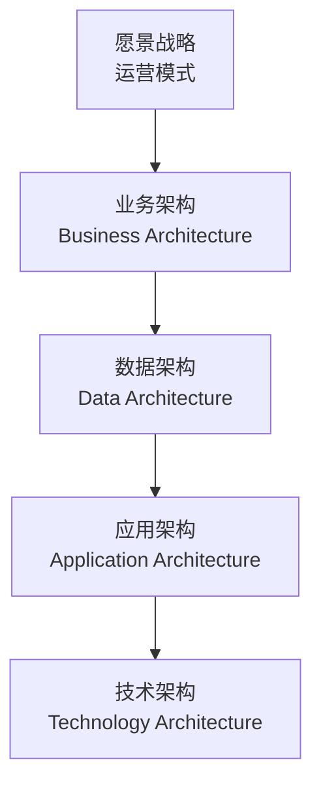
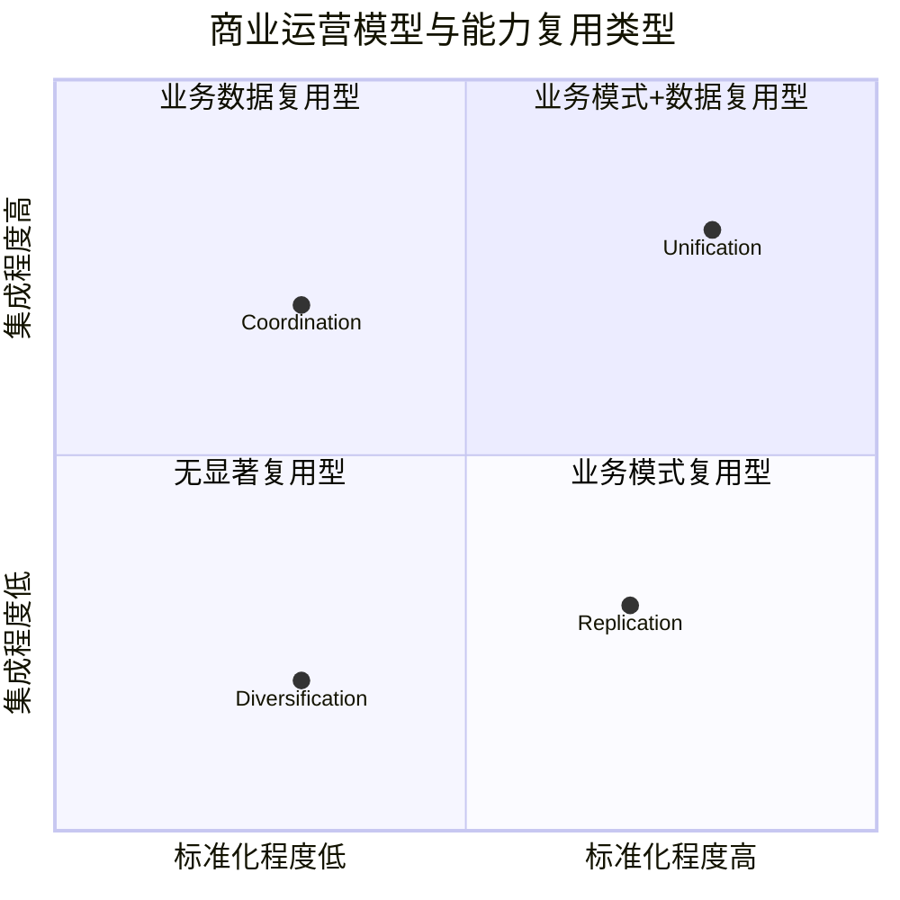
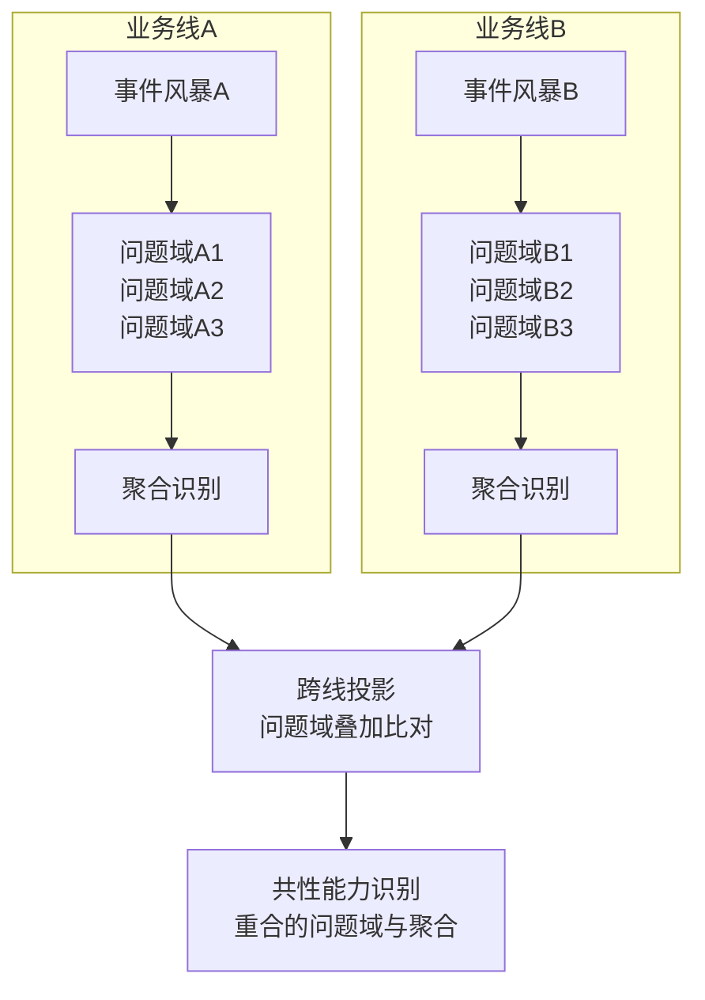
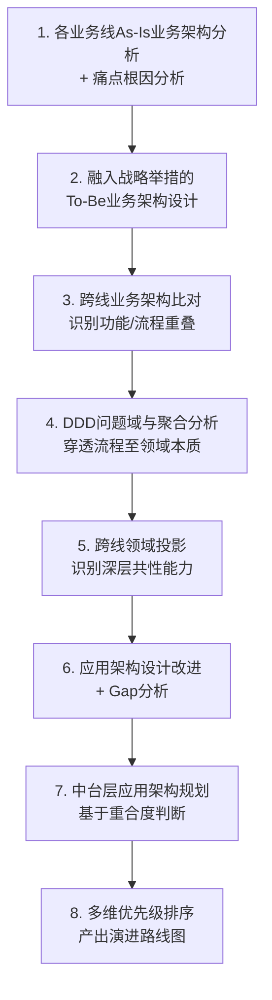

# Define：平台型企业架构设计

## 7.1 概述

Discovery 阶段完成了信息的充分发散。Define 阶段的任务是基于这些信息进行收敛——设计平台型企业架构，回答三个核心问题：

1. **要不要建中台？**
2. **需要哪些中台？**
3. **谁先建，谁后建？**

Define 是整个 PD 过程中技术含量最高的阶段，核心方法论是企业架构方法（以 TOGAF（The Open Group Architecture Framework，开放群组架构框架）为基础框架）融合领域驱动设计（DDD）与事件风暴（EventStorming）。

## 7.2 企业架构方法基础

### 7.2.1 TOGAF 架构开发方法

TOGAF 是业界最广泛采用的企业架构框架，其核心思路是从企业愿景战略出发，依次推导：

**要点解读**：TOGAF 的架构开发方法（ADM）强调从企业愿景与运营模式出发，依次推导出业务、数据、应用、技术四层架构，作为中台架构设计的分层骨架。

### 7.2.2 Define 阶段对 TOGAF 的轻量化改造

传统 TOGAF 流程偏重（长时间调研、数百页文档），不适合互联网级变化速度。Define 阶段进行以下改造：

| 改造点 | 传统方式 | Define 阶段方式 |
|--------|----------|----------------|
| 过程形式 | 文档驱动的线性流程 | 工作坊驱动的协作共创 |
| 核心工具 | 业务流程图 | 事件风暴 + DDD 工作坊 |
| 产出形式 | 数百页规划文档 | 架构决策记录（ADR）+ 可视化架构图 |
| 验证方式 | 评审会 | 架构原型验证 |

## 7.3 中台复用的能力类型

### 7.3.1 商业运营模型与能力复用类型

哈佛大学出版社 2006 年出版的企业架构战略著作提出了**商业运营模型（Business Operating Model）**，以两个维度划分企业的运营模式：

- **横轴——标准化（Standardization）**：通过业务模式（功能+流程）的复用实现业务线扩展。
- **纵轴——集成（Integration）**：通过数据的打通与复用实现业务线扩展。

将此模型映射到中台的能力复用类型，可得四类复用能力：

| 复用类型 | 描述 | 典型中台 |
|----------|------|----------|
| 业务数据复用 | 业务模式不同，但数据可打通复用 | 数据中台 |
| 业务模式复用 | 业务模式相似但数据需隔离 | 业务中台 / 内部 SaaS（Software as a Service，软件即服务） |
| 业务模式+数据复用 | 两者皆可复用 | 业务+数据双中台 |
| 通用技术复用 | 技术组件的跨线复用 | 技术中台 |

### 7.3.2 业务中台与 SaaS 的区别

业务模式复用场景中，业务中台与内部 SaaS 都解决"业务模式复用"问题，区别在于抽象层次与灵活度：

| 维度 | 内部 SaaS | 业务中台 |
|------|-----------|----------|
| 抽象层次 | 高，靠近业务 | 中，介于 PaaS（Platform as a Service，平台即服务）与 SaaS 之间 |
| 业务标准化要求 | 高 | 中 |
| 灵活度 | 低，配置化为主 | 高，插件化+配置化 |
| 适用场景 | 业务模式高度标准化的场景 | 业务模式有一定共性但需兼顾差异的场景 |

### 7.3.3 业务中台与数据中台的关系

业务中台生产业务数据，数据中台对业务数据进行二次加工（跨域整合、大数据计算、AI 赋能），结果反馈至业务中台与前台。两者互为输入输出，构成闭环。

## 7.4 通过领域分析识别共性能力

### 7.4.1 为什么需要领域分析

传统的跨业务线比对只能识别流程层面的相似性，但无法穿透到业务本质——不同业务线的流程可能截然不同，但其背后解决的**问题空间**可能高度重合。

### 7.4.2 DDD + 事件风暴工作坊

采用**领域驱动设计（DDD）结合事件风暴（EventStorming）**的工作坊方式，对各业务线的业务流程背后的**问题空间**和**解空间**进行深入分析：

1. **事件风暴**：以业务事件为线索，梳理业务流程的完整事件链。
2. **问题域划分**：将事件链归类为不同的问题域（如用户域、订单域、支付域）。
3. **聚合识别**：在每个问题域内识别关键聚合（Aggregate），即一组高度内聚的业务对象与操作。
4. **跨线投影**：将不同业务线的问题域与聚合进行叠加比对，识别重合部分。

**要点解读**：该流程先分别对各业务线开展事件风暴并划分问题域、识别聚合，再通过跨线投影将不同业务线的问题域与聚合进行叠加比对，最终识别出可沉淀为中台的重合共性能力。

### 7.4.3 共性能力识别示例

以极客地产为例：物业业务线与长租公寓业务线表面看来解决完全不同的问题。但通过 DDD 分析，可识别出以下重合的问题域：

| 重合问题域 | 业务线A（物业） | 业务线B（长租公寓） | 共性能力 |
|-----------|----------------|-------------------|----------|
| 客户域 | 物业业主管理 | 租户管理 | 客户中心、认证中心 |
| 运营域 | 物业服务管理 | 公寓运营管理 | 运营中心、工单中心 |
| 营销域 | 社区活动推广 | 租房优惠推广 | 营销中心、积分中心 |

进一步，可识别出跨业务线的**数据导流**场景——将物业业主数据转化为长租公寓潜在租户，实现新业务的快速启动。

## 7.5 中台与微服务的本质区别

### 7.5.1 核心论断

**业务中台与微服务架构没有直接关系。** 它们解决不同的问题，处于不同的抽象层次。

| 维度 | 业务中台 | 微服务架构 |
|------|----------|-----------|
| 解决的问题 | 业务领域的能力复用 | 技术领域的组件编译时依赖 |
| 抽象层次 | 业务架构层 | 技术架构层 |
| 核心关注 | 能力的可复用性与易复用性 | 服务的独立交付性 |
| 关系 | 中台不一定是微服务架构 | 微服务架构不一定服务于中台 |

### 7.5.2 微服务架构的价值前提

Martin Fowler 对微服务的定义中，"能够被独立部署"是关键——这实际上意味着"能够被独立交付"。只有真正实现独立交付的微服务，才能释放其架构价值（团队分离、交付周期分离、技术异构）。

**大量号称微服务架构的系统实际上是伪微服务**——它们因集成测试或其他因素存在，并未真正实现服务的独立交付。

### 7.5.3 两者为何常被一起提及

业务中台常采用微服务架构实现，因为微服务的"运行时依赖"低耦合特性，天然适合承载中台中不同能力单元的团队分离、技术分离、交付周期分离等需求。但这只是"好搭档"关系，而非"必然绑定"关系。

## 7.6 平台型企业架构设计过程

一个完整的平台型企业架构规划过程包含以下步骤：

**步骤 5 是关键转折点**——跨线领域投影将架构分析从"流程层面"推进到"领域层面"，识别出深层共性能力，为"是否需要建中台"提供领域层面的证据支撑。

**步骤 7 是核心决策点**——基于业务重合度与领域重合度的综合判断，决定是否引入中台层，以及中台层的应用架构设计。

**步骤 8 产出路线图**——基于多维优先级排序（战略重要性、紧急程度、成本、资源就绪情况、技术就绪情况、风险、痛点 Mapping 等），形成具体的中台建设演进路线图。

## 7.7 本章小结

Define 阶段通过企业架构方法 + DDD + 事件风暴的组合，将 Discovery 阶段收集的信息收敛为平台型企业架构设计与中台建设演进路线图。核心方法论是"穿透流程至领域本质"——通过领域驱动设计识别深层共性能力，而非仅停留在流程表面的相似性比对。

Define 阶段的关键产出：**企业到底需不需要中台、需要哪些中台、谁先建谁后建**——这些问题的回答，为后续 Design 与 Delivery 阶段提供了明确的方向指引。