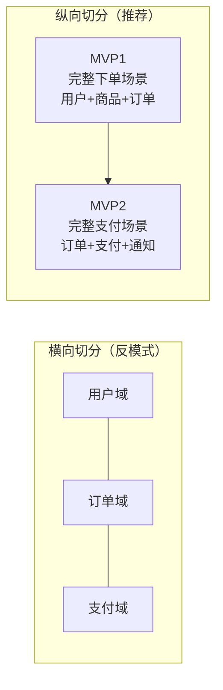

# Design：中台产品设计与MVP验证

## 8.1 概述

Discovery + Define 完成了 D4+ 的第一轮发散与收敛，产出了企业级的中台建设路线图。从本章起进入第二轮——站在具体中台产品的视角，回答"这个中台该如何设计与实施"。

Design 阶段的核心产出是**中台产品设计文档**——包含愿景、边界、需求列表、技术架构、交付计划与成本预估。完成 Design 后，团队应能清晰知道如何启动中台 MVP（Minimum Viable Product，最小可行产品）的开发工作。

## 8.2 确定中台产品愿景

### 8.2.1 愿景的重要性

中台建设是一条布满荆棘的长期之路。在过程中会遇到各种问题与选择——需求冲突、边界争议、技术选型、资源调配……一个好的愿景能让团队始终保持方向感，做到"遇事不决看愿景"。

### 8.2.2 电梯演讲工具

电梯演讲（Elevator Pitch）是强制收敛产品愿景的工具，限定以下关键要素：

> 对于 **[目标用户]**，他们需要 **[核心问题]**，我们的中台通过 **[解决方案]** 来满足，不同于 **[现有替代方案]**，我们的优势是 **[差异化特点]**。

以极客地产业务中台为例：

> 对于**前台业务线的产品与研发团队**，他们需要**新业务线从 0 到 1 构建业务系统的周期大幅缩短**，我们的中台通过**沉淀成熟业务线的通用业务能力并复用至新业务线**来满足，不同于**现有的各业务线独立建设模式**，我们的优势是**新业务线基于中台能力可快速组装上线，无需从零构建基础业务模块**。

### 8.2.3 愿景收敛的难点

**愿景的价值和难点在于充分收敛**。实践中常见的失败模式是：愿景用了电梯演讲的形式，但结果铺满一面墙，无法在电梯时间内复述完毕。做加法易，做减法难——愿景必须足够简洁明确，才能像指南针一样持续指引方向。

## 8.3 确定业务梳理范围

### 8.3.1 范围划定的困境

中台具有企业级属性，业务梳理理论上应覆盖企业全业务线、端到端全流程。但对于大型集团型企业，全量梳理既不现实也无必要——仅协调各业务线参与就是巨大的组织挑战。

### 8.3.2 基于愿景的范围收敛

"遇事不决看愿景"——中台愿景为业务梳理范围提供了聚焦依据：

- **业务线维度**：与中台愿景直接相关的业务线深入梳理，关联度低的跳过。
- **价值链维度**：端到端价值链中，与中台愿景目标匹配的阶段深入梳理，不匹配的跳过。

以极客地产为例：中台愿景是"支撑轻资产服务化转型"，则：
- 物业业务线（成熟业务，能力来源）→ 深入梳理
- 长租公寓业务线（新业务，能力消费方）→ 深入梳理
- 投资/文化/教育业务线（与转型目标关联度低）→ 跳过
- 工程建设阶段（重资产环节，与轻资产战略不匹配）→ 跳过

## 8.4 细粒度业务梳理

### 8.4.1 传统流程梳理的局限

基于现有流程的梳理容易陷入"业务债"陷阱——长期积累的业务流程并非最优解，而是历史妥协的产物。例如，复杂的审批流程可能只是信息化时代过程管控的遗留，在数字化时代可能完全可以通过实时审计分析与风险识别来替代。

### 8.4.2 设计思维驱动的方法

Design 阶段采用**设计思维（Design Thinking）**驱动的方法，以**用户旅程（User Journey Map）+ 服务蓝图（Service Blueprint）**进行业务梳理：

1. **回到问题域**：不基于现有流程推导，而是回到业务问题本身——用户在什么场景下遇到什么问题？
2. **以用户为中心**：从用户体验出发设计业务服务，而非从系统功能出发。
3. **重新设计解决方案**：基于当前技术条件（AI、大数据、实时计算），重新设计最优解决方案，而非照搬历史流程。

### 8.4.3 业务梳理产出

通过范围内的业务架构梳理，结合跨场景通用能力分析，产出：

- 各业务线的用户旅程与服务蓝图
- 跨业务线的通用业务数据、业务功能、业务流程清单
- 中台需求列表（以用户故事形式描述）

## 8.5 确定 MVP

### 8.5.1 中台需求的高风险性

Design 阶段识别的中台需求，本质上是**一系列高风险的假设**——它们来源于定性抽象，而非定量验证。中台建设的周期越长，需求假设的风险与代价越大。

### 8.5.2 MVP 原则

引入精益创业中的 **MVP（Minimum Viable Product，最小可行产品）** 原则，实现 D4+ 中的"Start Small"策略：

- **端到端纵向切分**：不按能力域横向切分（先做用户域、再做订单域），而是按业务场景纵向切分（先支撑一个完整的业务场景，即使只涉及部分能力域）。
- **多维度优先级排序**：基于业务价值、技术风险、前台接入条件等维度综合评分，确定 MVP 需求范围。
- **可验证性**：MVP 必须是可运行的、可接入前台的、可度量效果的，而非不可验证的半成品。

**要点解读**：横向切分按能力域把中台一次性铺开建设，风险高、见效慢；纵向切分按业务场景端到端切入，每个 MVP 都是一个可运行、可接入、可度量的完整闭环，符合"Start Small"原则。

## 8.6 运营前置：制定迭代计划与接入计划

### 8.6.1 为什么运营需要前置

中台建设的中后期才考虑运营与接入问题，往往为时已晚——前台不会停下来等中台建设完成。前中台并行建设时，如同分支开发修改同一块代码，合并时冲突剧烈。

### 8.6.2 接入计划（"上车计划"）

接入计划须明确：

- 哪些前台业务线是第一轮接入的种子用户？
- 接入的时间窗口与前提条件？
- 接入过程中前台业务的中断策略与回滚方案？
- 中台与前台的并行建设协调机制？

## 8.7 度量前置：定义验证指标

### 8.7.1 指标设计原则

1. **以终为始**：在建设开始前即设计验证指标。
2. **多维度**：按干系方关注点设计不同维度的指标。
3. **可归因**：指标应能区分中台贡献与前台自身贡献。

### 8.7.2 指标设计方法：5How 追问法

基于 5Why 分析法的变体——**5How 追问法**——驱动指标设计：

> - 怎么判断中台建设的成果？→ 看对新业务的赋能
> - 怎么验证对新业务的赋能效果？→ 看新业务的上线速度
> - 怎么验证新业务的上线速度？→ 看新业务从立项到上线的时间
> - 怎么验证……（逐层细化至可直接度量的指标）

### 8.7.3 指标框架

| 维度 | 典型指标 | 度量方式 |
|------|----------|----------|
| 战略价值 | 新业务基于中台上线的数量 | 项目记录 |
| 用户价值 | 前台接入满意度（NPS（Net Promoter Score，净推荐值）） | 季度调查 |
| 降本提效 | 前台接入后研发人天节省 | 工时对比 |
| 质量保障 | 中台服务 SLA（Service Level Agreement，服务等级协议）达标率 | 监控数据 |
| 创新赋能 | 基于中台衍生的创新业务数 | 评审记录 |

## 8.8 Design 阶段产出物

完成 Design 后，应产出：

1. **中台产品愿景**（电梯演讲）
2. **业务梳理范围说明**（含聚焦依据）
3. **中台需求列表**（用户故事形式，含优先级）
4. **MVP 定义**（第一轮建设的具体需求集）
5. **技术架构设计**（含技术选型与架构决策）
6. **运营与接入计划**
7. **验证指标体系**
8. **交付计划与成本预估**

## 8.9 本章小结

Design 阶段以中台产品愿景为起点，基于愿景收敛业务梳理范围，采用设计思维驱动的方法识别中台需求，通过 MVP 原则确定建设切入点，并将运营计划与度量指标前置设计。核心原则是**愿景指引、纵向切分、度量前置**——确保中台建设有方向、有重点、有验证标准。