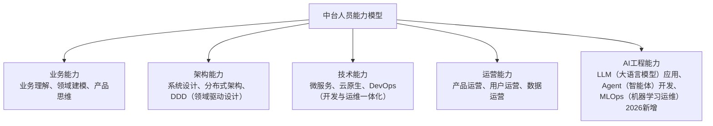
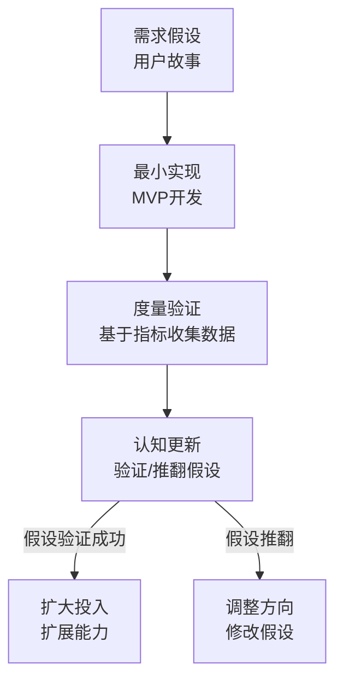
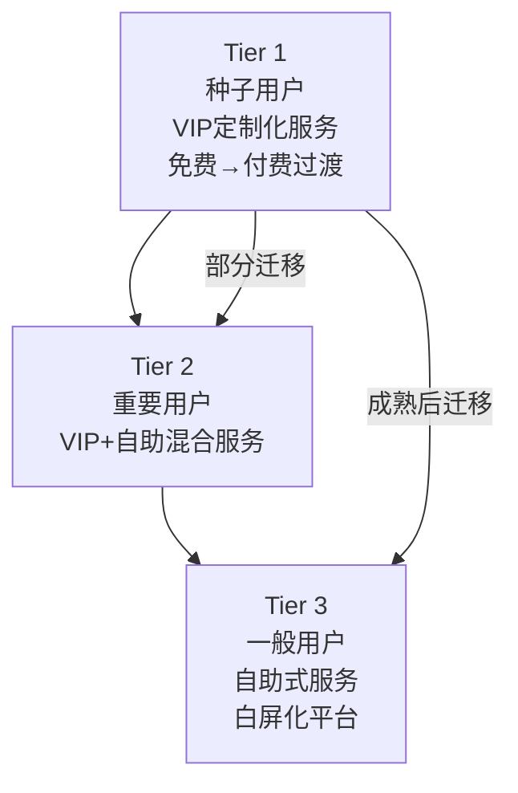
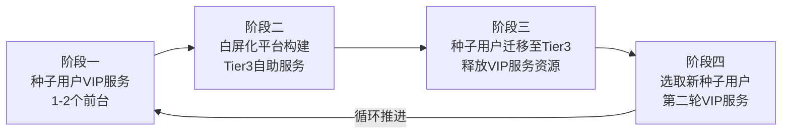

# Delivery：精益交付与运营治理

## 9.1 概述

Design 阶段产出了中台产品设计文档、MVP（Minimum Viable Product，最小可行产品）需求集、运营计划与验证指标。Delivery 阶段是将这些设计转化为可运行产品的过程，也是 D4+ 中时间最长、挑战最多的阶段。

本章从团队建设、精益研发流程、运营治理机制三个维度展开 Delivery 的实施要点。

## 9.2 中台团队建设

### 9.2.1 中台人员能力模型

中台建设对团队能力的要求远超传统产品开发——需要同时具备业务理解、架构设计、技术实现、运营治理等多维度能力。以下为孙志岗老师提出的**中台人员能力模型**（经 2026 年补充更新）：

**要点解读**：中台人员能力模型从业务、架构、技术、运营、AI 工程五个维度框定人员要求，其中 AI 工程能力为 2026 年新增维度，由能力模型可推导出中台团队组建与人才梯队建设的重点。

### 9.2.2 团队组建策略

| 策略 | 描述 | 适用场景 |
|------|------|----------|
| 核心团队+扩展团队 | 核心团队负责中台核心架构与关键能力，扩展团队（前台借调）负责特定业务场景的接入与验证 | 大多数中台建设项目 |
| 全栈小团队 | 5–7 人全栈团队，兼顾业务、架构、技术、运营 | 小型企业或试点阶段 |
| 分布式能力团队 | 各能力域由不同团队负责，通过平台治理团队统一协调 | 大型集团型企业 |

## 9.3 精益产品研发流程

### 9.3.1 精益与敏捷的区别

| 维度 | 敏捷 | 精益 |
|------|------|------|
| 前提假设 | 价值已确定 | 价值不确定 |
| 核心关注 | 如何高效交付已确定的价值 | 如何用最小成本定位真正的价值点 |
| 关键实践 | 小步迭代、按节奏交付 | MVP、快速验证、基于数据调整 |
| 在中台中的角色 | 保障交付效率 | 应对需求不确定性 |

**中台建设的核心挑战是价值不确定性**——中台需求本质上是高风险假设，只有通过精益方法（最小成本→快速验证→基于数据调整）才能逐步定位真正的价值点。

### 9.3.2 精益产品研发流程全景

此流程的核心是**加速反馈环路**——从需求假设到度量验证的速度越快，应对不确定性的能力越强。中台团队的核心职责是不断加速这个环路的运转速度。

### 9.3.3 涉及的关键工程实践

| 工程实践 | 在中台中的作用 |
|----------|--------------|
| 云化工程 | 提供弹性基础设施，支撑中台能力的动态扩展 |
| 微服务与服务化 | 实现能力单元的独立交付与独立演进 |
| DevOps | 实现快速部署、快速反馈、快速调整 |
| 数据运营 | 基于度量指标持续验证需求假设 |
| 遗留系统服务化改造 | 将后台遗留系统改造为可被中台调用的服务 |
| 架构守护 | 监控实现与设计的偏离，防止架构腐化 |
| AI 辅助开发 | 利用 LLM 加速代码生成、测试编写、文档撰写 |

## 9.4 中台的运营、治理与演进

### 9.4.1 中台运营的核心困境

中台作为企业内部平台类产品，面临一个独特困境——**所有前台理论上都是中台的潜在用户，但前台之间的需求、排期、质量要求、非功能需求可能彼此矛盾**。中台资源有限且有自身愿景，不可能无条件满足所有前台诉求，否则将陷入疲于应对的状态。

### 9.4.2 Offering = Capability + SLA/NFR

中台的产品概念（Offering）不应仅包含功能能力（Capability），还须包含**服务等级协议（SLA）与非功能需求（NFR）**：

> **Offering = Capability + SLA/NFR**

不同的前台用户对同一个能力可能有完全不同的 SLA 要求——核心业务要求 5 个 9 的稳定性与 5ms 的响应时间，创新业务可能只要求 2 个 9 的稳定性与 100ms 的响应时间。

### 9.4.3 三层用户划分机制

通过三层用户划分机制（3-tier Customer Segmentation），为不同层次的前台用户提供差异化的服务：

**Tier 1（种子用户）**：中台建设初期，选取 1–2 个关键前台业务作为种子用户，提供一对一 VIP 定制化服务。此阶段利用企业战略资源免费建设，种子用户配合度高。

**Tier 2（重要用户）**：中台能力稳定后，为无法完全自助化的重要用户提供"VIP 服务 + 自助服务"混合模式。

**Tier 3（一般用户）**：通过自助服务控制台（白屏化平台），实现前台自助接入、自助配置、自助监控。此层次是中台规模化运营的核心。

### 9.4.4 运营演进路线

此运营机制实现了中台建设的**平滑推进与产品化演进**——通过用户分层与 SLA 机制，解决了需求排期冲突、资源紧张、推广缓慢等核心运营难题。

### 9.4.5 2026 年升级：平台工程视角

2026 年的中台运营正在与**平台工程（Platform Engineering）**理念融合。平台工程强调：

- **开发者体验（Developer Experience）**：中台的白屏化平台即内部开发者平台（IDP），须以开发者体验为核心设计目标。
- **自助服务（Self-Service）**：前台开发者应能自助完成环境创建、能力接入、配置修改、监控查看等操作，无需中台团队人工介入。
- **黄金路径（Golden Path）**：为中台能力提供经过验证的最佳使用路径（如预设的接入模板、参考架构），降低前台使用门槛。

## 9.5 本章小结

Delivery 阶段的核心挑战是应对中台建设过程中的不确定性。精益思想通过最小成本、快速验证、基于数据调整的方法，提供了应对不确定性的系统框架。运营治理的核心机制是三层用户划分——通过差异化服务解决前台需求冲突与资源紧张问题。

**中台建设是一个长期且艰苦的过程，不但需要企业具备技术、业务、组织的基础，还需要做好持续探索和演进的决心与准备。**