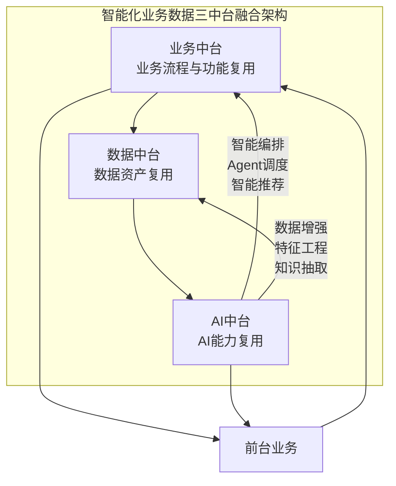
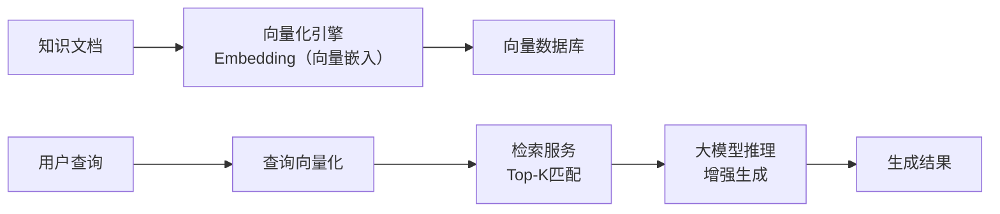
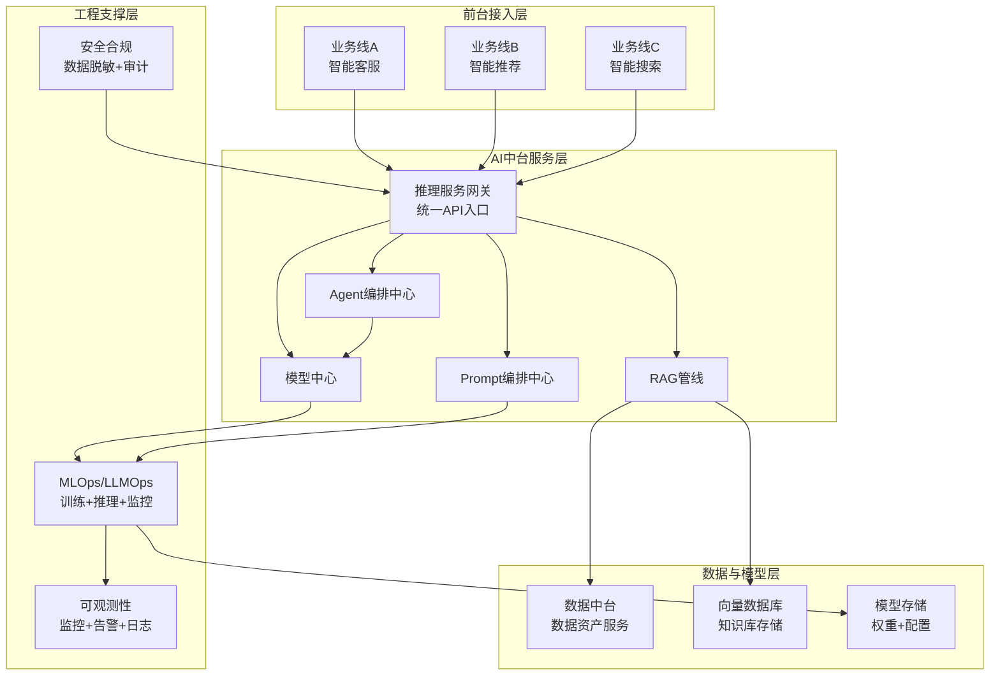

# AI中台：大模型时代的能力复用新范式

## 10.1 概述

2023 年 ChatGPT 引发的大模型浪潮，正在深刻重塑中台的形态与效率边界。AI 中台并非对业务中台/数据中台的替代，而是在新场景下的能力复用延伸——将模型推理、Prompt（提示词）编排、RAG（Retrieval-Augmented Generation，检索增强生成）管线、Agent（智能体）编排等 AI 工程能力进行平台化沉淀，实现 AI 能力在多业务线间的复用与治理。

本章系统阐述 AI 中台的定义、架构、核心能力模块、与业务/数据中台的融合模式，以及建设过程中的关键挑战与应对策略。

## 10.2 AI 中台的定义与定位

### 10.2.1 定义

> **AI 中台是承载企业 AI 能力的平台，通过将模型管理、Prompt 编排、RAG 管线、Agent 编排、MLOps/LLMOps（Machine Learning Operations / Large Language Model Operations，机器学习运维／大语言模型运维）等 AI 工程能力进行平台化沉淀，实现 AI 能力在多业务线间的识别、封装、复用与治理。**

### 10.2.2 与业务中台/数据中台的关系

AI 中台不是"第四台"，而是与业务中台、数据中台深度融合的**能力增强层**：

- **业务中台**产生业务数据，AI 中台消费业务数据（通过数据中台的加工），为业务中台提供智能编排与推理能力。
- **数据中台**为 AI 中台提供训练数据、推理数据、知识库数据等数据资产。
- **AI 中台**为业务中台提供 Agent 编排、智能推荐、智能搜索等 AI 增强服务，同时为数据中台提供数据增强、特征工程、知识抽取等数据处理能力。

### 10.2.3 AI 中台兴起的驱动力

| 驱动因素 | 具体表现 |
|----------|----------|
| 大模型推理成本高 | 企业无法为每条业务线独立部署 LLM（Large Language Model，大语言模型），需要统一的推理服务管理与成本优化 |
| AI 能力碎片化 | 各业务线独立开发 AI 应用，导致重复建设、标准不一致、治理缺失 |
| Agent 编排复杂 | 多 Agent 协作需要统一的编排框架、工具注册中心与任务调度机制 |
| 数据合规要求 | AI 使用企业数据需遵循数据安全与隐私合规，需统一管控 |
| 效果评测缺失 | 各业务线 AI 应用效果缺乏统一评测框架，无法横向比较与持续优化 |

## 10.3 AI 中台核心能力模块

### 10.3.1 能力模块全景

```mermaid
graph TD
    ROOT[AI中台能力模块] --> MC[模型中心<br/>Model Hub]
    ROOT --> PP[Prompt编排中心<br/>Prompt Registry]
    ROOT --> RAG[RAG管线<br/>知识库+向量化+检索]
    ROOT --> AO[Agent编排中心<br/>Agent Framework]
    ROOT --> ML[MLOps/LLMOps<br/>训练+推理+监控]

    MC --> MC1[模型版本管理]
    MC --> MC2[模型A/B测试]
    MC --> MC3[模型灰度发布]
    MC --> MC4[模型效果评测]

    PP --> PP1[Prompt模板管理]
    PP --> PP2[Prompt版本控制]
    PP --> PP3[Prompt效果评测]
    PP --> PP4[Prompt Flow编排]

    RAG --> RAG1[知识库管理]
    RAG --> RAG2[向量化引擎]
    RAG --> RAG3[检索服务]
    RAG --> RAG4[知识更新机制]

    AO --> AO1[Agent注册与发现]
    AO --> AO2[工具注册中心]
    AO --> AO3[任务分解与调度]
    AO --> AO4[多Agent协作编排]

    ML --> ML1[训练管线]
    ML --> ML2[推理服务网关]
    ML --> ML3[效果监控与告警]
    ML --> ML4[成本优化与调度]

```

**要点解读**：AI 中台五大能力模块（模型中心、Prompt 编排、RAG、Agent 编排、MLOps/LLMOps）为 AI 能力的识别、封装、复用与治理提供了体系化支撑，各模块又通过版本管理、效果评测、调度优化等子能力保障 AI 服务的质量与成本。

### 10.3.2 模型中心（Model Hub）

模型中心负责大模型的生命周期管理，包括版本管理、A/B 测试、灰度发布与效果评测。

| 能力 | 描述 | 关键技术 |
|------|------|----------|
| 模型版本管理 | 多版本模型并行管理，支持回滚 | 模型注册中心（如 MLflow Model Registry） |
| A/B（对照试验）测试 | 不同模型版本在同一业务场景下的效果对比 | 流量分流机制 + 效果统计 |
| 灰度发布 | 新模型版本逐步放量，降低上线风险 | 渐进式流量分配 + 实时效果监控 |
| 效果评测 | 统一的模型效果评测框架 | 基准测试集 + 自动评测流水线 |

### 10.3.3 Prompt 编排中心（Prompt Registry）

Prompt 编排中心负责 Prompt 模板的管理、版本控制与效果评测。

**核心洞察**：Prompt 是 AI 中台中**最接近业务**的能力单元——一个 Prompt 模板本质上是一段业务逻辑的 AI 表达，它封装了"在什么场景下、用什么数据、以什么方式、生成什么结果"的完整语义。Prompt 的复用，是 AI 能力复用的核心形态。

| 能力 | 描述 |
|------|------|
| Prompt 模板管理 | 模板的创建、分类、标签、搜索 |
| 版本控制 | Prompt 模板的版本演进与回滚 |
| 效果评测 | Prompt 输出质量的一致性评测 |
| Prompt Flow 编排 | 多个 Prompt 的串联/并联编排 |

### 10.3.4 RAG 管线

RAG（Retrieval-Augmented Generation）管线负责企业知识库的管理、向量化、检索与增强生成。

**要点解读**：RAG 管线先把知识文档向量化存入向量数据库，再将用户查询向量化后做 Top-K 检索，最后交由大模型基于检索到的知识进行增强生成，从而在降低幻觉的同时复用企业内部知识。

### 10.3.5 Agent 编排中心

Agent 编排中心负责多 Agent 的注册、发现、协作编排与任务调度。这是 AI 中台中最复杂也最具价值的能力模块——它将 AI 从"单模型推理"升级为"多 Agent 协作解决复杂业务问题"。

| 能力 | 描述 |
|------|------|
| Agent 注册与发现 | Agent 的能力描述、注册、搜索 |
| 工具注册中心 | Agent 可调用的外部工具（API、数据库、文件系统等）的统一注册 |
| 任务分解与调度 | 复杂业务任务分解为子任务，分配给合适的 Agent |
| 多 Agent 协作编排 | Agent 间的信息传递、并行/串行编排、冲突解决 |

### 10.3.6 MLOps / LLMOps

MLOps/LLMOps 负责 AI 模型与服务的端到端工程化管理——训练管线、推理服务、效果监控与成本优化。

| 能力 | 描述 |
|------|------|
| 训练管线 | 模型微调、LoRA（Low-Rank Adaptation，低秩适配）适配、数据标注流水线 |
| 推理服务网关 | 统一的推理 API 网关，支持多模型路由、负载均衡 |
| 效果监控 | 推理延迟、准确率、成本、使用量的实时监控 |
| 成本优化 | GPU 资源调度、推理缓存、模型蒸馏等成本优化策略 |

## 10.4 AI 中台架构设计

### 10.4.1 参考架构

**要点解读**：参考架构自下而上分为数据与模型层、工程支撑层、AI 中台服务层与前台接入层——前台业务线统一经推理服务网关接入，模型中心/Prompt 编排/RAG/Agent 编排共同构成服务层，MLOps/LLMOps、安全合规与可观测性提供工程支撑，数据中台、向量数据库与模型存储为底层数据与模型资产。

### 10.4.2 AI 原生架构 vs AI 增强架构

| 维度 | AI 增强架构 | AI 原生架构 |
|------|------------|-------------|
| 设计起点 | 在现有中台架构上叠加 AI 能力模块 | 从架构层面为 AI 而设计，能力以 Agent 可调用形式存在 |
| 能力形态 | AI 作为新增的复用能力类型 | 所有能力默认可被 AI Agent 调用（API-first + Agent-ready） |
| 接入方式 | 前台通过 API 调用 AI 服务 | 前台通过自然语言描述需求，AI Agent 自动编排能力 |
| 适用场景 | 企业已有成熟中台，需要增加 AI 能力 | 新建中台或重构中台，AI 是核心驱动力 |

## 10.5 AI 中台建设的关键挑战

### 10.5.1 成本管理

| 挑战 | 应对策略 |
|------|----------|
| GPU 推理成本高 | 推理缓存、模型蒸馏、智能路由（小模型处理简单请求，大模型处理复杂请求） |
| Prompt 调用成本不可控 | Prompt 预算机制、调用频率限制、效果-成本平衡评测 |
| 知识库维护成本 | 知识库自动更新、过期检测、冗余清理 |

### 10.5.2 效果评测

| 挑战 | 应对策略 |
|------|----------|
| LLM 输出不可控 | 基准测试集 + 自动化评测流水线 + 人工抽查 |
| 效果标准不一致 | 统一评测框架，定义业务维度（准确率、完整度、相关性）+ 技术维度（延迟、成本） |
| 评测成本高 | 利用 AI 辅助评测（LLM-as-Judge），降低人工评测成本 |

### 10.5.3 安全合规

| 挑战 | 应对策略 |
|------|----------|
| 数据泄露风险 | 数据脱敏管线、访问控制、推理日志审计 |
| Prompt 注入攻击 | Prompt 预处理、输入过滤、输出验证 |
| 模型滥用 | 使用频率限制、调用白名单、异常检测 |

### 10.5.4 能力边界

| 挑战 | 应对策略 |
|------|----------|
| AI 能力边界模糊 | 基于业务场景定义 AI 能力的边界与 SLA |
| Agent 行为不可预测 | Agent 行为约束、工具调用权限控制、执行路径可追溯 |
| 人工与 AI 的协作边界 | 明确 AI 辅助决策 vs AI 自动决策的边界 |

## 10.6 AI 中台的 MVP 定义策略

AI 中台的 MVP 定义须遵循"端到端纵向切分"原则——选取一个完整的 AI 业务场景作为切入点：

| 场景 | MVP 范围 | 验证指标 |
|------|----------|----------|
| 智能客服 | 1 个业务线的客服场景，1 个 Prompt + RAG 管线 + 推理服务 | 客服解决率 ≥ 80%，平均响应时间 ≤ 3s |
| 智能搜索 | 1 个业务线的搜索场景，向量检索 + 排序 Prompt | 搜索准确率提升 ≥ 20%，响应时间 ≤ 500ms |
| 智能推荐 | 1 个业务线的推荐场景，特征工程 + 推荐模型 + 推理服务 | 推荐 CTR（Click-Through Rate，点击率）提升 ≥ 15%，推理成本可控 |

## 10.7 本章小结

AI 中台是 2025–2026 年中台体系中最具变革性的新增模块。其核心价值在于将 AI 能力从"各业务线独立建设"升级为"企业级平台化复用与治理"。但 AI 中台建设须警惕三个误区：

1. **AI 不是中台的替代品**：中台的核心逻辑（能力识别、沉淀、复用）未因 AI 而改变，AI 改变的是实现效率与方式。
2. **AI 中台不是"大模型中台"**：AI 中台承载的不仅是大模型推理，还包含 Prompt 编排、RAG 管线、Agent 编排、MLOps 等完整的 AI 工程能力。
3. **AI 效果评测不可省略**：LLM 输出的不确定性远高于传统软件系统，效果评测是 AI 中台治理的核心环节。

下一章将聚焦中台建设的量化评估与持续治理体系。