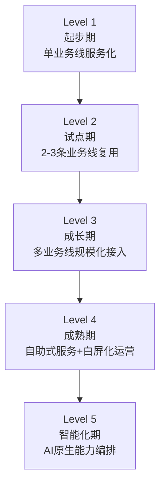
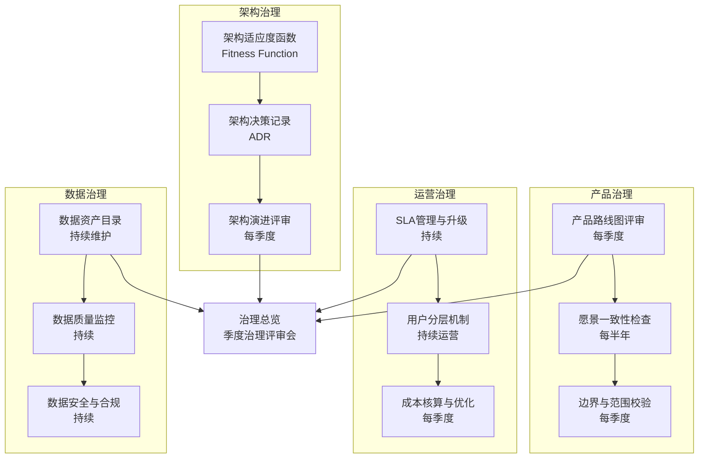

# 中台ROI评估与治理体系

## 11.1 概述

中台建设失败的常见原因之一是**无法量化建设效果**——前台可以说"中台拖了后腿"，中台可以说"前台的成功靠我赋能"，但双方都拿不出数据来证明各自的论断。

本章系统阐述中台建设的 ROI（Return on Investment，投资回报率）评估方法与持续治理体系，为中台建设提供从"定性判断"到"量化度量"的完整框架。

## 11.2 中台 ROI 评估的困难

### 11.2.1 三个核心困难

| 困难 | 原因 | 影响 |
|------|------|------|
| 价值归因困难 | 中台不直接面向最终用户，其价值须通过前台间接体现 | 无法直接度量"中台贡献了多少收入" |
| 短期-长期矛盾 | 中台建设的战略价值往往在 3–5 年后才显现，短期内可能只增加成本 | 短期 ROI 为负，动摇建设决心 |
| 间接收益难以量化 | 能力复用带来的降本增效、业务创新加速、技术债务减少等收益难以量化 | ROI 计算不完整，低估中台价值 |

### 11.2.2 中台 ROI 评估的基本思路

> **中台的 ROI 评估不应追求"精确计算"，而应追求"方向正确"。** 即不追求精确到小数点的 ROI 数字，而是确保评估方向正确——反映中台的核心价值维度，避免遗漏重要收益项。

## 11.3 中台 ROI 评估框架

### 11.3.1 收益维度

| 维度 | 收益类型 | 量化方式 | 短期/长期 |
|------|----------|----------|----------|
| **降本提效** | 前台接入中台能力后的研发成本节省 | 研发人天对比（接入前 vs 接入后） | 短期 |
| **业务加速** | 新业务基于中台上线的速度提升 | 立项→上线时间对比（有中台 vs 无中台） | 短期-中期 |
| **质量提升** | 中台能力带来的服务质量提升 | SLA（Service Level Agreement，服务等级协议）达标率、故障率对比 | 短期-中期 |
| **创新赋能** | 基于中台能力衍生的创新业务 | 创新业务数量、收入占比 | 中期-长期 |
| **数据打通** | 跨业务线数据整合带来的数据价值 | 数据资产覆盖率、数据服务调用量 | 中期 |
| **技术债务减少** | 中台沉淀替代重复建设减少的技术债务 | 被替代的系统数量、代码重复率降低 | 长期 |
| **组织效率提升** | 跨线协作效率提升 | 需求响应周期、跨团队沟通成本 | 长期 |

### 11.3.2 成本维度

| 维度 | 成本类型 | 量化方式 |
|------|----------|----------|
| **建设成本** | 中台团队的人力、基础设施、工具采购 | 项目预算、人力成本核算 |
| **接入成本** | 前台接入中台能力所需的改造成本 | 接入人天、改造代码量 |
| **运维成本** | 中台服务的日常运维与治理成本 | 运维人力、监控工具成本 |
| **机会成本** | 中台建设占用的资源可用于其他方向的收益 | 替代方案的预估 ROI |
| **治理成本** | 架构守护、持续演进、冲突处理等隐性成本 | 沟通会议时间、决策周期 |

### 11.3.3 ROI 计算公式

$$ROI = \frac{\sum 收益 - \sum 成本}{\sum 成本} \times 100\%$$

其中收益与成本均按维度分类计算，需注意：

1. **短期收益（1 年内）**与**长期收益（3–5 年）**须分开呈现，避免因短期 ROI 为负而错误否定长期价值。
2. **间接收益**（创新赋能、数据打通、技术债务减少）须纳入计算，即使量化精度较低，也不应遗漏。
3. **接入成本**须纳入总成本——前台接入中台的改造成本是中台建设真实成本的一部分。

## 11.4 中台成熟度模型

### 11.4.1 五级成熟度模型

**要点解读**：该图展示了中台从"单线服务化"到"AI 原生编排"的五级阶梯式演进路径。每一级都以上一级的复用规模为跳板：只有当跨线复用真正跑通（Level 2–3）后，中台的规模化效益与 ROI 才由负转正（对应下表 Level 3 起 ROI 才为正）。它提示建设者不必急于一步到位，而应优先把前两级"复用闭环"做实，这决定了后续 ROI 能否兑现。

| 级别 | 名称 | 特征 | ROI 预期 | 典型周期 |
|------|------|------|----------|----------|
| Level 1 | 起步期 | 单业务线服务化改造，尚不具备跨线复用能力 | ROI 可能为负 | 0–6 月 |
| Level 2 | 试点期 | 2–3 条业务线接入中台，开始验证复用假设 | ROI 接近零 | 6–12 月 |
| Level 3 | 成长期 | 多业务线规模化接入，中台能力开始产生规模化效益 | ROI 开始为正 | 1–2 年 |
| Level 4 | 成熟期 | 自助式服务 + 白屏化运营，前台接入成本大幅降低 | ROI 显著为正 | 2–3 年 |
| Level 5 | 智能化期 | AI 原生能力编排，中台从被动服务升级为主动赋能 | ROI 大幅提升 | 3–5 年 |

### 11.4.2 各级别评估要点

| 级别 | 核心评估指标 | 通过标准 |
|------|-------------|----------|
| Level 1 | 接入业务线数量 | ≥ 1 |
| Level 2 | 跨线复用能力数量 | ≥ 3 |
| Level 3 | 前台接入满意度 | NPS（Net Promoter Score，净推荐值）≥ 30 |
| Level 4 | 自助式接入覆盖率 | ≥ 80% |
| Level 5 | AI 辅助编排覆盖率 | ≥ 50% |

## 11.5 中台持续治理体系

### 11.5.1 治理的核心目标

中台治理的核心目标是**确保中台在持续演进中保持方向正确、质量可控、成本可接受**。治理不是"管控"，而是"护航"。

### 11.5.2 治理体系框架

**要点解读**：该图把中台治理拆成"架构、产品、运营、数据"四条通道，各通道按不同节奏持续运转，最终统一汇入**季度治理评审会**这个总览出口。它体现了"未雨绸缪比事后补救重要"的治理思路——架构适应度函数（Fitness Function）/架构决策记录（ADR）负责紧盯实现与设计的偏离，产品治理校正方向，运营治理控制成本与体验，数据治理守住资产与合规底线；四者共同支撑"护航而非管控"的治理宗旨。

### 11.5.3 架构适应度函数

架构适应度函数（Architecture Fitness Function）是一种自动化验证架构特性的机制——通过定义一组可自动执行的检查项，持续监控实现与设计的偏离度：

| 检查项 | 检查方式 | 偏离阈值 |
|--------|----------|----------|
| 服务独立性 | 检查是否存在跨服务的编译时依赖 | 零编译时依赖 |
| API 契约稳定性 | 检查 API 契约变更频率 | 月变更 ≤ 2 次 |
| 代码重复率 | 检查跨服务代码重复比例 | 重复率 ≤ 5% |
| 架构层级约束 | 检查是否存在跨层级直接调用 | 零跨层级调用 |
| 中台能力覆盖率 | 检查前台业务使用中台能力的比例 | 覆盖率 ≥ 60% |

### 11.5.4 季度治理评审会

每季度召开中台治理评审会，核心议程：

1. **架构偏离度回顾**：基于适应度函数数据，回顾实现与设计的偏离情况。
2. **ROI 进度回顾**：基于验证指标数据，回顾各维度 ROI 的进展。
3. **愿景一致性检查**：回顾中台建设方向是否与企业战略方向保持一致。
4. **边界与范围校验**：回顾中台产品边界是否需要调整（扩大/收缩）。
5. **成本核算与优化**：回顾中台建设成本，评估优化空间。
6. **下一步行动决策**：基于以上回顾，决定下一步的调整方向与行动。

## 11.6 中台建设的"刹车机制"

### 11.6.1 何时踩下刹车

中台建设不应是无止境的投入。以下信号表明需要踩下刹车、重新审视建设方向：

| 信号 | 含义 | 行动 |
|------|------|------|
| 前台接入持续低迷 | 中台能力无法匹配前台真实需求 | 重新审视业务梳理与需求识别 |
| ROI 持续为负（超过 2 年） | 投入产出不成比例 | 缩减建设范围或暂停建设 |
| 架构偏离持续超标 | 实现偏离设计且无法修正 | 启动架构重构或回退 |
| 组织阻力持续加剧 | 跨部门冲突无法调和 | 重新审视组织配套与投资模式 |
| 技术债务快速增长 | 中台代码质量持续下降 | 启动技术债务清理专项 |

### 11.6.2 刹车 ≠ 放弃

踩下刹车不意味着放弃中台建设，而是意味着**暂停投入、重新审视方向、调整策略后重新启动**。这与 D4+ 的"持续演进"理念一致——演进不是直线上升，而是螺旋上升。

## 11.7 本章小结

中台 ROI 评估与治理体系是确保中台建设"方向正确、质量可控、成本可接受"的制度保障。评估的核心原则是"方向正确而非精确计算"，治理的核心目标是"护航而非管控"。

**2026 年的关键洞察**：中台 ROI 评估正在从"事后评估"转向"持续度量"——通过架构适应度函数、季度治理评审会、自动化监控等机制，实现中台建设效果的实时感知与持续优化。AI 的引入进一步降低了治理成本——AI 可辅助检测架构漂移、识别技术债务、评估变更影响，使治理过程更加高效与精准。