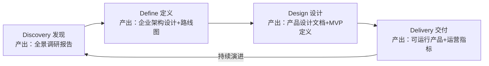
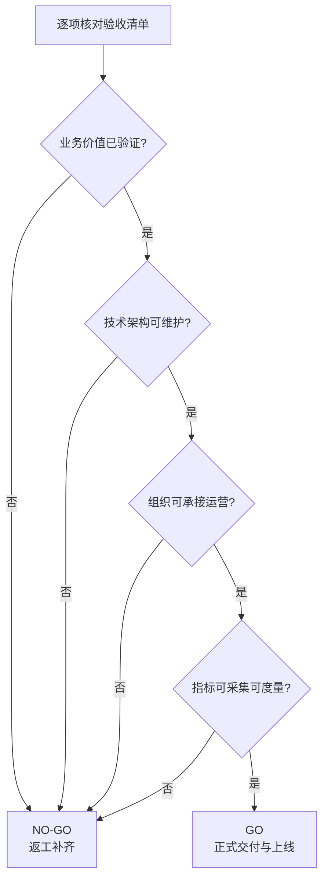

# 中台落地工具与 Checklist 模板

## 13.1 文档定位与使用方式

本文档是本专题的"可复用交付物工具模板"章。前文各章给出了这样那样的**方法论判断**（要不要建、怎么建、怎么度量、怎么治理），本章则把它们的判断标准固化为一份份**可以直接拿来填的表格与清单**，让中台建设从"听懂了"落到"能执行"。

全套工具以第 05 章的 **D4+ 模型**为骨架串联。D4+（Discovery-发现 → Define-定义 → Design-设计 → Delivery-交付 四阶段方法论，两轮发散与收敛、外加持续演进机制）与全套工具的对应关系见下图：

**要点解读**：这张图把四个阶段所要交付的标准产出物（图中每个阶段方框内的第二行）串成了中台建设的"流水线"。需要特别强调的是：无论走到哪个阶段，其质量都应该由本章对应的工具模板来校验——Discovery 用"前置决策问卷+全景调研清单"把关，Define 用"架构设计文档验收点"把关，Design 用"产品设计/MVP 验收点"把关，Delivery 用"运营指标+验收 Checklist"把关。模板不是堆文档，而是让每一轮的产出都有清晰的合格线。

**使用顺序建议**（三步走）：

1. **立项前**：先做 13.2 前置决策问卷，任一前置问题不通过则暂缓启动。
2. **建设期**：按 13.3 的 D4+ 阶段产出物清单逐段产出并验收，同时用 13.4 记录成本与收益、用 13.5 自评当前成熟度。
3. **交付/上线前**：用 13.6 验收 Checklist 做"是否可落地"的最终判定。

---

## 13.2 中台建设前置决策问卷

对应第 04 章提出的**五个前置问题**（中台建设的"周边环境"是否就绪，比方法论本身更关键）。逐题回答并在"是否通过"栏打勾，五题全过才建议启动建设。

| 前置问题 | 含义 | 核验子项（全部符合才判"是"） | 判定 |
|----------|------|------------------------------|------|
| **① 愿景是否清晰？** | 中台要解决什么问题、对企业有何价值 | ① 已产出成文的愿景陈述（一句话）；② 上至管理层、下至中台人员均知晓且达成一致；③ 愿景可指导"做什么/不做什么"的取舍 | ☐ |
| **② 用户与客户是否明确？** | 为谁服务、谁出资决策 | ① 已区分用户（前台产品/研发）与客户（管理层）及各自诉求；② 确认主要诉求是面向企业管理层的长期战略问题，而非纯粹前台短期战术外包 | ☐ |
| **③ 资金与资源从何而来？** | 投入产出及投资模式 | ① 已选定众筹/投融资/混合三种模式之一；② 管理层已承诺相应级别的战略资源（人力+预算+跨部门授权）；③ 已明确建设期成本回收的预期路径 | ☐ |
| **④ 验证指标是否定义？** | 如何度量建设成功 | ① 指标在建设启动**之前**即已定义（以终为始）；② 指标多维度且可归因（能区分中台贡献与前台贡献）；③ 指标数据来源明确（监控/工时/调查等） | ☐ |
| **⑤ AI 融合策略是否明确？** | 中台与 AI 如何协同（2026 新增） | ① 已选定 AI 辅助 / AI 增强 / AI 原生三种策略之一；② 已评估对应策略的前期投入（如 GPU 算力、模型成本）与风险；③ 已确认 AI 能力应沉淀为哪种可复用形态 | ☐ |

> **使用提示**：任何一题为"否"，都应按第 14 章共识"暂停启动、补齐条件"，而不应带病开工。全部通过后才进入 13.3 的 D4+ 阶段。

---

## 13.3 D4+ 各阶段标准产出物清单与验收要点

以下是 D4+ 四个阶段各自的标准产出物与"达到什么标准才算合格"的验收要点。可直接用作对应阶段评审会的检查依据。

| D4+ 阶段 | 标准产出物 | 验收要点（全部满足才合格） |
|----------|------------|---------------------------|
| **Discovery 发现** （发散：全景调研） | **全景调研报告**：行业趋势与竞争分析（五力/SWOT）、精益价值树、企业架构现状梳理（业务/应用/数据/技术/组织五维）、痛点清单含根因、干系人地图 | ☐ 覆盖由外到内/自上而下/自下而上三向调研；☐ 产出可由企业愿景向上追溯至举措（中台是举措之一而非目标本身）；☐ 痛点均给出根因而非仅现象 |
| **Define 定义** （收敛：架构定义） | **平台型企业架构设计文档**（业务→数据→应用→技术架构）+ **中台建设演进路线图** | ☐ 完成跨业务线重合度分析与 DDD 问题域分析；☐ 明确回答"要不要建、要哪些中台、谁先建、何时建"；☐ 路线图有优先级排序与分阶段里程碑；☐ 已定义中台的边界与范围 |
| **Design 设计** （发散：产品设计） | **中台产品设计文档**（愿景、边界、需求列表、技术架构、交付计划、成本预估）+ **MVP 定义** | ☐ 愿景用电梯演讲收敛为一段话并全员理解一致；☐ MVP 范围最小且可验证核心假设；☐ 已前置设计运营计划与度量指标；☐ 成本预估覆盖建设+接入+运维 |
| **Delivery 交付** （收敛：交付验证） | **可运行的中台产品** + **持续运营机制**（运营指标、SLA、用户分级、架构守护） | ☐ 小步迭代交付且核心 MVP 完成真实前台接入；☐ 运营指标可采集且有基线；☐ 已建立架构适应度函数与反馈回路；☐ 完成 13.6 验收 Checklist |

---

## 13.4 中台建设 ROI 评估表模板

ROI（Return on Investment，投资回报率）评估遵循第 11 章原则——**"方向正确"优先于"精确计算"**。按下面模板逐项填写，并严格区分**短期（1 年内）**与**长期（3–5 年）**区块，避免因短期 ROI 为负而否定长期价值。

### 13.4.1 收益维度记录表

| 收益维度 | 收益类型 | 量化口径 | 归属期 | 填写的实际/预估值 |
|----------|----------|----------|--------|------------------|
| 降本提效 | 前台接入后的研发成本节省 | 研发人天对比（接入前 vs 接入后） | 短期 | ＿ |
| 业务加速 | 新业务上线速度提升 | 立项→上线时长对比 | 短期–中期 | ＿ |
| 质量提升 | 服务质量提升 | SLA（Service Level Agreement，服务等级协议）达标率、故障率对比 | 短期–中期 | ＿ |
| 创新赋能 | 基于中台衍生的创新业务 | 创新业务数量、收入占比 | 中期–长期 | ＿ |
| 数据打通 | 跨业务线数据整合价值 | 数据资产覆盖率、数据服务调用量 | 中期 | ＿ |
| 技术债务减少 | 替代重复建设减少的债务 | 被替代系统数量、代码重复率下降 | 长期 | ＿ |
| 组织效率提升 | 跨线协作提效 | 需求响应周期、跨团队沟通成本 | 长期 | ＿ |
| AI 增效 | AI 能力复用收益 | AI 能力调用次数、辅助产出人天节省 | 中期–长期 | ＿ |

### 13.4.2 成本维度记录表

| 成本维度 | 成本类型 | 量化口径 | 归属期 | 填写的实际/预估值 |
|----------|----------|----------|--------|------------------|
| 建设成本 | 中台团队人力、基础设施、工具采购 | 项目预算、人力成本核算 | 短期 | ＿ |
| 接入成本 | 前台改造投入 | 接入人天、改造代码量 | 短期–中期 | ＿ |
| 运维成本 | 日常运维与治理投入 | 运维人力、监控工具成本 | 持续 | ＿ |
| 机会成本 | 资源用于其他方向的收益 | 替代方案的预估 ROI | 中期 | ＿ |
| 治理成本 | 架构守护、演进、冲突处理 | 沟通会议时间、决策周期 | 持续 | ＿ |

> **汇总公式**：$$ROI = \frac{\sum 收益 - \sum 成本}{\sum 成本} \times 100\%$$（短期与长期分开计算后并列呈现；间接收益即使精度低也必须纳入，接入成本必须计入总成本。）

---

## 13.5 中台成熟度自评表（Level 1–5）

对应第 11 章五级成熟度模型，用于对中台现状做自评打分。逐项按"达标程度"打分（每项 0–2 分：不达标 0、部分达标 1、达标 2），汇总后对照"级别判定"区间定位当前阶段。

| 评估维度 | Level 1 起步期 | Level 2 试点期 | Level 3 成长期 | Level 4 成熟期 | Level 5 智能化期 | 得分 |
|----------|----------------|----------------|----------------|-----------------|------------------|------|
| 接入规模 | 单业务线服务化 | 2–3 条业务线复用 | 多业务线规模化接入 | 自助式接入广泛 | AI 原生能力编排 | ＿ |
| 复用能力 | 尚不跨线 | 跨线复用≥3 项 | 规模化复用成立 | 能力自助化/白屏化 | AI 辅助编排≥50% | ＿ |
| 满意度 | — | — | 前台 NPS（Net Promoter Score，净推荐值）≥30 | 自助接入覆盖率≥80% | AI 编排覆盖率≥50% | ＿ |
| ROI 预期 | 可能为负 | 接近零 | 开始为正 | 显著为正 | 大幅提升 | ＿ |

> **级别判定（参考）**：以四个维度得分的**最低分维度**决定当前级别——中台成熟度受限于最短板，未跨越的门槛仍应视为未达成。建议每半年自评一次，跟踪演进进度。

---

## 13.6 项目验收 Checklist（是否可落地勾选清单）

交付/上线前逐项勾选。**任一"☐"留空，即不可判定为可落地**。可通过（GO）/需返工（NO-GO）判定流程见下图：

**要点解读**：验收不是"做完即通过"，而是围绕"能否真正落地持续运转"做四重把关——数据（业务价值）、代码（架构可维护性）、人（组织承接能力）、度量（指标可采集）缺一不可。图中只要四类中出现一个"否"，就整体判为 NO-GO 需补齐，避免带着隐性隐患草率上线；这四重把关与第 11 章"护航而非管控"的治理哲学一致，重点在于上线后可持续、可演进。

### 项目验收 Checklist

**A. 业务价值（是否解决了立项时的问题）**

- ☐ 立项时的愿景/痛点已有可数据支撑的达成证明
- ☐ 核心能力已被至少 2 条业务线真实接入（而非演示接入）
- ☐ 接入后的降本/提速效果已对照基线数据量化

**B. 技术架构（是否可长期维护与演进）**

- ☐ 通过架构适应度函数检查（无超标偏离）
- ☐ API 契约稳定、跨服务依赖合规、代码重复率达阈值
- ☐ 关键技术决策已记录（ADR 已归档）
- ☐ 具备可逆性与边界调整能力（能力可低成本迁移回前台）

**C. 组织与运营（是否有人接得住）**

- ☐ 中台团队有明确 owner 与清晰的边界授权
- ☐ 用户分层、SLA 管理、升级机制已上线
- ☐ 跨部门冲突处理与升级机制已运行
- ☐ 前后台接入培训与文档已就绪

**D. 度量与治理（是否能持续证明价值）**

- ☐ ROI 收益/成本维度表已建立基线
- ☐ 运营指标可自动采集且阈值预警已生效
- ☐ 季度治理评审会机制已排期并指定责任人
- ☐ 成熟度自评表已有当前分数与下阶段目标

---

## 13.7 本章小结

本章把方法论翻译成了五张可直接套用的工具表：前置决策问卷（立项把关）、D4+ 阶段产出物清单（过程把关）、ROI 评估表（价值度量，含短期/长期分区）、成熟度自评表（Level 1–5 定位）、项目验收 Checklist（交付把关）。

它们共同遵循一个设计原则——**把"判断标准"前置为"填写模板"**：与其到了验收现场才争论合不合格，不如在每一阶段就按模板把合格线写清楚。配合 D4+ 的持续演进机制，这套工具应在整个中台生命周期内反复使用、滚动更新，而非一次性填写后束之高阁。