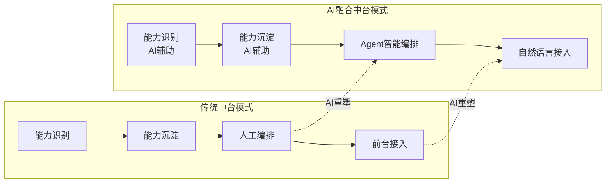
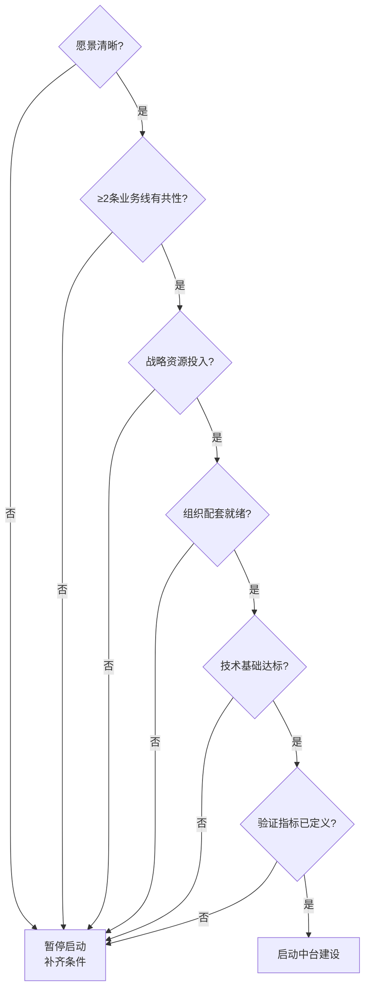

# 答疑篇 | 2026年中台核心争议与共识

## 概述

2019 年原文答疑篇聚焦四个问题：中台与微服务/中间件/数据仓库的区别、中台与后台的区别、中台与前台的边界、中台是否在炒概念。2026 年，行业关注点已发生根本性转移。本章梳理 2026 年业界对中台最具争议的五个核心问题，呈现各方观点与当前共识。

## 争议一：中台是否已死？

### 争议背景

2021 年以来，"中台已死"的论断反复出现。标志性事件包括阿里拆分中台事业群、腾讯裁撤部分中台团队、多家企业中台项目被裁撤或降级。论断的核心论据是：中台概念被过度炒作，建设中台不如直接采用微服务架构或采购 SaaS（Software as a Service，软件即服务）产品。

### 各方观点

| 立场 | 核心论据 |
|------|----------|
| 中台已死 | 概念泛化导致价值稀释，实践中大量失败案例，技术未创新，组织阻力不可克服 |
| 中台未死 | 能力复用的需求永远存在，形式在变但内核不变，AI 时代赋予中台新的生命力 |
| 中台转型 | 中台作为独立概念已消亡，但其核心理念已融入平台工程、组合式业务等新叙事 |

### 2026 年共识

> **中台作为"大一统平台"的形态确实已在多数企业中消亡，但"企业级能力识别、沉淀与复用"的内核从未失效。2026 年的共识是：中台已从"一种架构选择"演进为"一种架构能力"——任何企业架构都应具备能力复用的意识与机制，但不必冠以"中台"之名。**

### 要点解读

- "中台已死"的论争本质上是"大一统中台"模式的终结，而非能力复用理念的终结。
- 阿里拆分中台并非否定中台价值，而是从"集中式大一统平台"转向"分布式能力网格"。
- 2026 年的实践方向是：**不追求建设一个名为"中台"的系统，而是确保企业架构具备能力复用的机制与治理能力**。

## 争议二：AI 是否会取代中台？

### 争议背景

大模型与 AI Agent（AI 智能体，基于大模型自动感知、决策并执行任务的程序实体）展现出强大的"智能编排"能力——通过自然语言理解用户意图，自动调用工具与数据完成任务。这引发了"AI Agent 是否会取代中台作为能力编排层"的争议。

### 各方观点

| 立场 | 核心论据 |
|------|----------|
| AI 将取代中台 | AI Agent 可动态发现与编排能力，无需预先沉淀的静态中台 |
| AI 是中台的加速器 | AI 改变的是能力复用的实现方式，而非能力复用本身的需求 |
| AI 与中台深度融合 | AI 中台是中台在新条件下的自然延伸，而非替代关系 |

### 2026 年共识

> **AI 不会取代中台，但会深刻重塑中台的形态。** 核心逻辑：
>
> 1. AI Agent 的"智能编排"能力依赖于底层的"可编排能力"——这些能力仍需被识别、沉淀、标准化，这正是中台的核心职责。
> 2. AI 改变的是能力复用的"最后一公里"——从人工编排到智能编排，从 API 调用到自然语言驱动。但能力复用的"前 N 公里"（识别、沉淀、标准化）仍然是中台的领域。
> 3. AI 自身的能力（推理、RAG、Agent）也需要被复用与治理——这正是 AI 中台的使命。其中 RAG（Retrieval-Augmented Generation，检索增强生成）通过结合外部知识检索与大模型生成来提升回答质量，是 AI 中台需重点沉淀的复用能力。

**要点解读**：该图把中台"能力复用"链路（识别→沉淀→编排→接入）在 AI 前后的形态作了对照。核心信号是：被 AI 深刻重塑的只有后半段——编排从"人工"升级为"Agent 智能编排"，接入从"API 调用"升级为"自然语言"；而链路前端的"识别、沉淀"虽然加了 AI 辅助提效，但其本质职责并未被 AI 替代。这正是"AI 不会取代中台、只会重塑其效率边界"这一共识的直观表达。

## 争议三：平台工程是否是中台的替代？

### 争议背景

平台工程（Platform Engineering）是 2023–2025 年全球技术社区的热点概念，其核心是构建内部开发者平台（IDP），为开发团队提供自助式的技术基础设施服务。部分观点认为，平台工程是中台的"海外版"，或认为平台工程将取代中台。

### 各方观点

| 立场 | 核心论据 |
|------|----------|
| 平台工程取代中台 | 平台工程提供自助式技术基础设施，与中台"赋能前台"的目标一致，但更务实、更全球化 |
| 两者互补 | 中台关注业务能力复用，平台工程关注技术基础设施自助化，领域不同 |
| 两者融合 | 中台的技术中台层正在与平台工程融合，形成"业务中台 + 平台工程"的新架构 |

### 2026 年共识

> **平台工程与中台并非替代关系，而是不同层面的实践——平台工程解决"技术基础设施的自助化"，中台解决"业务能力的复用"。两者在"技术中台"层面存在重合，但业务中台与数据中台不在平台工程的覆盖范围内。**

| 维度 | 平台工程 | 中台 |
|------|----------|------|
| 核心关注 | 开发者体验、技术基础设施自助化 | 业务能力复用、业务赋能 |
| 典型产出 | IDP（内部开发者平台） | 业务中台、数据中台、AI 中台 |
| 目标用户 | 开发团队 | 前台业务团队（产品+研发） |
| 组织定位 | 基础设施/DevOps（开发运维一体化）团队 | 业务架构/平台团队 |
| 关系 | 技术中台层可借鉴平台工程理念 | 业务/数据/AI 中台层不在平台工程范围内 |

## 争议四：中台与前台的边界如何界定？

### 争议背景

中台与前台的边界问题是中台建设中持续性最强的争议之一——哪些能力该沉淀到中台，哪些该留在前台？边界划定过早可能遗漏能力，划定过晚则中台臃肿。

### 2026 年共识

> **中台与前台的边界不是一个技术问题，而是一个组织问题与演进问题。** 三条核心原则：

1. **愿景决定边界**：一个清晰的中台产品愿景往往就是一个好的边界——愿景之内的是中台，愿景之外的不是。
2. **演进式思维**：不追求一次划对，追求变化成本低。通过插件化、配置化、可逆性设计，使能力在中台与前台之间的迁移成本最小化。
3. **组织碰撞引导**：中台与前台的边界本质上是企业内横向平台组织与纵向业务组织的责任与利益边界。合理的组织碰撞（部门间的争议与协商）是找到最佳平衡点的过程，而非需要消除的问题。关键在于设计冲突处理与升级机制，引导碰撞向解决问题方向演进。

## 争议五：中台建设的最小必要条件是什么？

### 争议背景

大量企业在中台建设中失败，根本原因是在条件不具备时贸然启动。2026 年的共识是：中台建设存在"最小必要条件"，不满足则不应启动。

### 最小必要条件清单

| 条件 | 检查项 | 不满足时的风险 |
|------|--------|---------------|
| **清晰的愿景** | 中台建设愿景已明确且各方达成一致 | 方向不清，随波逐流 |
| **至少 2 条业务线** | 存在至少 2 条有共性需求的业务线 | 无复用场景，中台退化为单线服务化 |
| **战略级资源投入** | 企业管理层承诺战略级资源（投融资模式或混合模式） | 资源不足，中台沦为前台外包团队 |
| **组织配套就绪** | 跨部门协作机制、决策机制、冲突处理机制已建立 | 组织阻力不可克服，推进困难 |
| **技术基础达标** | 具备基本的微服务/云原生/DevOps 技术能力 | 技术能力不足，交付质量与效率低下 |
| **验证指标已定义** | 中台建设的验证指标已在建设前定义 | 无法度量效果，价值无法证明 |

**要点解读**：该图把上表的最小必要条件串成了六道**顺序闸门**，任一环节不满足都统一导向"暂停启动、补齐条件"（图中 STOP 节点）。它刻意采用"与"（且）逻辑而非"或"逻辑——六个条件缺一不可，因为按 2026 年的共识，缺失任一条件都会把中台项目拖入"方向不清、退化为外包、阻力不可调和、效果无法证明"等已知失败模式。这道流程既可用于立项前的自检，也可用于已启动项目的复盘。

## 总结：2026 年中台五大共识

| 共识 | 核心表述 |
|------|----------|
| 共识一 | 中台"大一统平台"形态已消亡，"企业级能力复用"内核未失效 |
| 共识二 | AI 不会取代中台，但会重塑中台的形态与效率边界 |
| 共识三 | 平台工程与中台互补而非替代——前者关注技术基础设施，后者关注业务能力 |
| 共识四 | 中台与前台的边界是组织问题与演进问题，不是技术问题 |
| 共识五 | 中台建设存在最小必要条件，不满足则不应启动 |

**终极心法**：

> **以用户为中心，以能力为原子，以 AI 为加速器，以演进为常态。**

这四句话是 2026 年中台实践的核心理念。中台不是目的，用户响应力才是。中台不是终点，持续演进才是。中台不是银弹，它是"企业级能力复用"这条正确道路上的一种架构实践——在 2026 年，这条道路上多了 AI 这个强大的同行者。