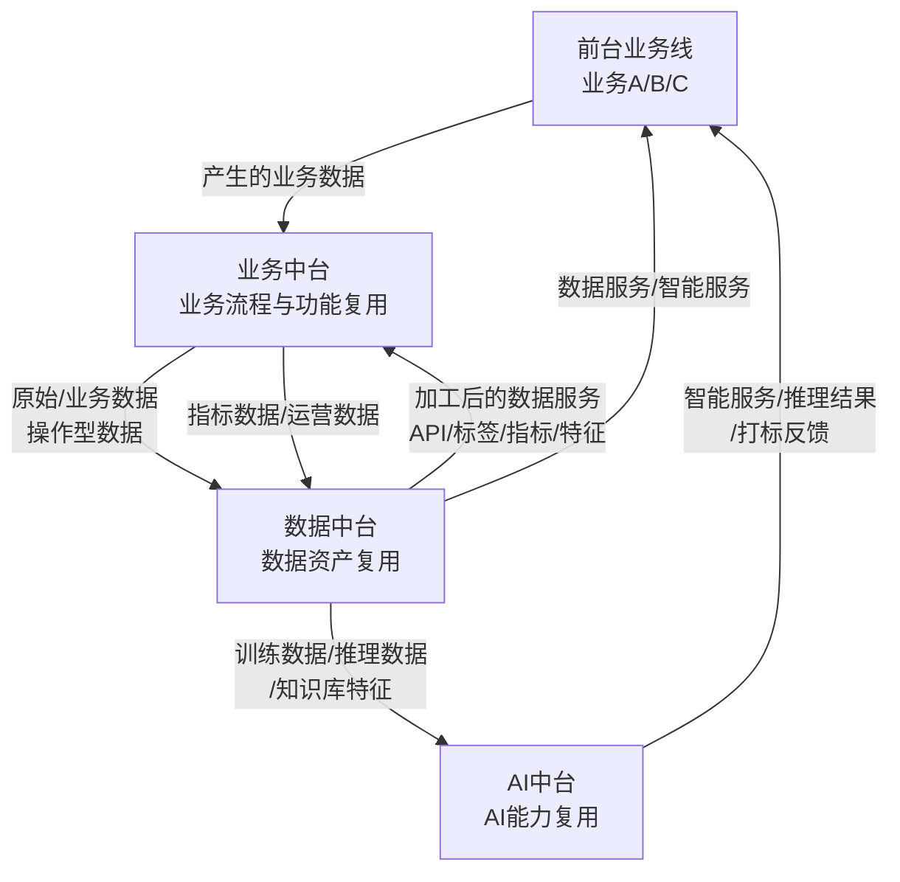
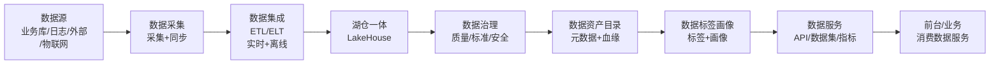
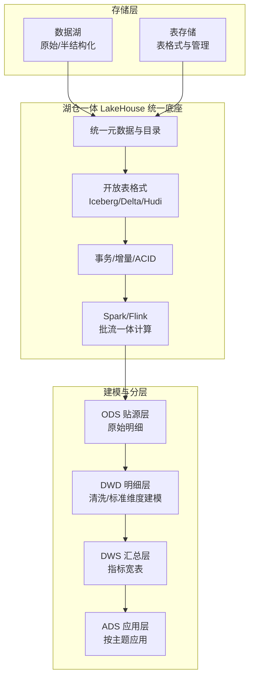
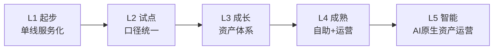

# 数据中台：从OneData到数据资产运营

## 15.1 概述

在第 02 章的分类体系中，数据中台被列为"核心三台"之一，与业务中台、技术中台共同构成中台体系的基础层。但该章对数据中台的阐述偏重定位与分类辨析，未及展开其内部的体系化建设方法论。本章作为数据中台的**深度专章**，系统回答三个问题：

1. **数据中台是什么**——定义、定位及其与业务中台/AI 中台的关系；
2. **数据中台有哪些核心能力**——从数据采集到数据资产运营的完整能力栈；
3. **数据中台怎么建**——以 OneData（OneModel/OneID）为代表的业界实践、关键挑战与 ROI/成熟度评估。

从"OneData"（阿里巴巴提出的数据中台建设方法论，强调"数据中心化、模型统一、服务沉淀"）到"数据资产运营"，恰好勾勒出数据中台的演进主线：它不再只是"把数据管起来"的技术系统，而是将数据沉淀为**可复用、可计量、可增值的企业资产**的经营平台。

## 15.2 数据中台的定义与定位

### 15.2.1 定义

> **数据中台是对业务数据进行二次加工与治理的平台，通过数据资产化管理、数据服务构建、数据体系化建设，将数据转化为可复用的数据服务，反馈至业务中台与前台，为业务进行数据与智能赋能。**

这一定义强调数据中台与数据仓库/大数据平台三个层面的本质区别：

| 维度 | 数据仓库 / 大数据平台 | 数据中台 |
|------|---------------------|----------|
| 出发点 | 技术侧：先有什么数据，能做什么分析 | 业务侧：业务需要什么数据服务，再设法获取数据 |
| 关注焦点 | 数据存储与计算效率 | 数据资产化与服务化 |
| 服务方式 | 报表、BI 看板 | 数据 API、数据产品、智能服务 |
| 价值定位 | 支撑性技术系统 | 业务赋能平台 |
| 治理深度 | 数据质量、ETL 管理 | 数据资产目录、指标体系、数据安全、成本治理 |

> **直接引述**：数据不能只存不"用"，也不能只被少数人"用"而不可复用。数据中台的独特价值在"复用"——同一份数据资产被多条业务线、多个前台产品按统一标准消费，而非各自重复采集与加工。

### 15.2.2 数据中台的"数据工厂"模型

数据中台可类比为一个"数据工厂"，将原始数据视为原材料，经过流水线加工、仓储与分销：

| 环节 | 数据中台对应能力 | 类比 |
|------|-----------------|------|
| 原材料仓库 | 数据采集与集成 | 从各业务系统、日志、外部渠道获取原始数据 |
| 流水线加工 | 数据清洗、计算、建模 | ETL/ELT、离线/实时计算、指标与标签加工 |
| 产品仓库 | 数据资产存储 | 表、指标、标签、知识库的统一资产管理 |
| 数据商店 | 数据服务出口 | 数据 API、数据集、自助查询、BI 门户 |
| 控制中心 | 调度与治理 | 任务调度、血缘、质量监控、安全审计 |

### 15.2.3 定位边界：数据中台 ≠ 数据仓库，也不等于"BI 系统"

数据中台与 BI 的核心区别在于**服务的主动性与复用性**：BI 面向分析师提供固定报表与看板；数据中台则面向业务系统与人提供可编排的**数据服务**（API/数据集/标签），并持续沉淀指标体系与数据资产。可以这样理解：BI 是数据中台的一个"消费端"（应用），而非数据中台本身。

## 15.3 数据中台与业务中台 / AI 中台的关系

数据中台不是孤立存在的一台，而是与业务中台、AI 中台深度耦合并形成数据流动闭环：

**要点解读**：这张图展示了"业务数据双中台 + AI 中台"的三台融合闭环。业务中台是数据的**生产者**，数据中台是数据的**加工者与资产管理者**，AI 中台是数据的**高级消费者**。数据中台一边把加工后的数据服务回喂业务中台与前台，一边为 AI 中台提供训练、推理所需的数据资产；而 AI 中台的打标反馈又回流数据中台，持续优化标签与特征。三者互为输入输出，构成第 10 章所述"智能化业务数据三中台"融合架构的底层。

具体而言：

- **与业务中台**：业务中台产生操作型数据（订单、会员、商品），数据中台消费并二次加工这些数据，构建主题域与指标体系，再以数据服务的形式反哺业务决策与运营。二者构成**"业务数据双中台"**模式。
- **与 AI 中台**：AI 中台依赖数据中台提供高质量、已治理的训练与推理数据（含知识库、特征工程产出）；反过来，AI 中台的推理结果、标签预测又会回写数据资产，形成"数据养模型、模型反哺数据"的飞轮。

## 15.4 数据中台核心能力全景

数据中台的核心能力可归纳为六大模块：**数据采集、数据集成、数据仓库/湖仓一体、数据治理、数据资产目录、数据服务与数据标签画像**。它们构成从"数据进"到"数据出"的完整能力栈：

**要点解读**：数据沿单一方向从左向右流动，越靠近右侧越"资产化、服务化"。值得注意的两点：其一，数据治理并不是孤立的最终模块，而是**贯穿全链路**的横向能力——质量、标准、安全在每个环节都应生效（图中以 GOV 承接加工与资产环节示意）；其二，湖仓一体（LakeHouse）同时承接离线批处理与实时流计算，是离线数仓（Data Warehouse）与数据湖（Data Lake）能力合流的产物。最终所有资产通过数据服务出口，被前台与业务线消费，形成"数据消费闭环"。

### 15.4.1 数据采集与数据集成

**数据采集（Data Collection）**：将分散在各业务系统、日志系统、外部渠道的数据统一汇集到数据平台。

| 采集方式 | 适用场景 | 典型技术 |
|----------|----------|----------|
| 离线批量采集 | 按日/按小时同步业务库数据 | 全量/增量同步、定时任务 |
| 实时流式采集 | 日志、埋点、点击流的准实时回流 | 消息队列（Kafka）、流式计算 |
| 外部数据接入 | 三方数据、公开数据、行业数据 | API 对接、爬虫（合规前提下） |
| 结构化/非结构化 | 数据库表 vs 文件、图片、文档 | Connector 组件、文件解析 |

**数据集成（Data Integration）**：解决"口径统一"与"处理范式"两大问题。业界存在两种经典范式：

- **ETL**（Extract-Transform-Load，抽取–转换–加载）：先转换后加载，适合复杂清洗与口径强一致的离线批量场景，转换在计算引擎中完成。
- **ELT**（Extract-Load-Transform，抽取–加载–转换）：先加载后转换，借助湖仓/数据湖廉价的存储与弹性算力，把转换下沉到目标端，更适合大数据量与实时场景。

现代数据中台多为"ETL 与 ELT 并存"，并用 **DataOps**（Data Operations，数据运维实践——将 DevOps 理念应用于数据工程，强调数据管线的自动化、可测试与可观测）贯穿采集、集成与上线全流程。

### 15.4.2 数据仓库 / 湖仓一体（LakeHouse）

数据仓库（Data Warehouse）是面向分析的集中式数据存储，强调结构化、强一致与高吞吐分析；数据湖（Data Lake）则以低成本存储海量原始、多格式数据，保留灵活性。

**湖仓一体（LakeHouse）**是对两者的合流——在一套平台上同时提供数据湖的低成本、多格式存储与数据仓库的分析性能、事务能力与治理能力。其核心价值在于**一份数据、一份元数据、多种消费**，避免"湖"与"仓"之间的数据搬迁与口径二次定义。

**要点解读**：这张图将"存储"与"建模"两件事区分清楚。上半部分是湖仓一体的统一底座——数据湖与表存储共享一份元数据，通过开放的表格格式（Iceberg/Delta Lake/Hudi 等）提供事务能力，用 Spark/Flink 做批流一体计算。下半部分是业界最经典的数仓分层模型 **ODS→DWD→DWS→ADS**：

- **ODS 贴源层**：原样明细，只做极轻处理，保留事实；
- **DWD 明细层**：清洗、去重、标准维度建模，形成业务明细事实表；
- **DWS 汇总层**：按业务主题加工为指标宽表，是"指标口径"的统一落脚点；
- **ADS 应用层**：面对具体前台应用的主题数据集，按需产出。

分层的价值在于**逐级抽象、口径收敛、职责分离**——既能追根溯源，又能快速响应上层应用，是数据中台指标体系与 OneModel 的物理载体。

### 15.4.3 数据治理

数据治理（Data Governance）是保障数据"可信、可用、可控"的横向工程，覆盖质量、标准、安全、生命周期等维度：

| 治理维度 | 核心内容 | 反模式警示 |
|----------|----------|-----------|
| 数据质量 | 完整性、准确性、一致性、及时性、唯一性 | 只建质检规则，无责任归属与整改闭环 |
| 数据标准 | 命名规范、代码值、口径定义统一 | 标准与模型脱节，沦为"文档摆设" |
| 数据安全 | 分级分类、脱敏、权限、合规审计 | 一刀切收紧权限，阻塞业务取数 |
| 元数据与血缘 | 字段级血缘、影响分析、变更影响评估 | 血缘缺失，改表"牵一发动全身" |
| 生命周期 | 冷热分层、归档、销毁 | 只进不出，存储成本失控 |

### 15.4.4 数据资产目录

数据资产目录（Data Asset Catalog）是数据中台"资产化"的入口——对数据资源进行**登记、编目、检索、评级**，让"数据长什么样、在哪、谁负责、能否用、怎么用"一目了然。它解决的是"数据地图"问题——业务用户可自助发现数据，并按标准接入。

| 能力 | 说明 |
|------|------|
| 元数据采集 | 表、字段、指标、标签的元数据自动登记 |
| 血缘与影响分析 | 字段级上下游追溯，评估变更影响 |
| 资产检索与推荐 | 按主题、关键词、负责人搜索并推荐可用数据 |
| 资产分级分类 | 结合安全要求对资产定级 |
| 资产生命周期 | 上架/下架、废弃清理管理 |

### 15.4.5 数据服务 / API

数据服务是数据中台对外的**出口**，将加工后的资产以标准化接口开放给业务——既包括面向系统的数据 API，也包括面向人的数据集与自助查询。衡量数据服务成熟度的关键指标是**自助化率**：前台有多少比例的数据需求不依赖中台人工加工即可自取。

| 服务形态 | 说明 | 适用场景 |
|----------|------|----------|
| 数据 API | 标准化的接口，封装指标、标签、明细查询 | 业务系统实时/准实时取数 |
| 数据集 / 数据产品 | 面向分析师的目录化数据集 | BI、报表、专题分析 |
| 自助查询与开发 | 沙箱、IDE、自助建表 | 分析师/研发自助取数与加工 |
| 特征服务 | 面向模型的在线特征读取 | 推荐、风控等机器学习场景 |

> **直接引述**：数据服务的核心评判标准不是"能提供多少 API"，而是"业务自主消费数据的比例有多高"。当大多数取数需求仍需人工加工完成，说明数据服务尚未真正成熟。

### 15.4.6 数据标签画像

数据标签与用户画像（常由 **CDP**——Customer Data Platform，客户数据平台——承担）是把数据转化为"可理解、可运营"资产的关键形态：

| 概念 | 说明 |
|------|------|
| 标签（Tag） | 对实体（用户、商品、订单）的结构化标注，如"高价值用户""偏好品类" |
| 画像（Profile） | 基于标签族构建的实体多维度属性模型（用户画像/商品画像） |
| 计算方式 | 静态规则标签 + 统计标签 + 机器学习/大模型生成标签 |
| 服务出口 | 用户分群、精准营销、个性化推荐、风控策略 |

CDP 与数据中台的边界：CDP 侧重"以客户为中心的实时运营"，而数据中台提供更通用的标签/画像基础设施（覆盖用户、商品、组织等多种实体）。实践中 CDP 通常是数据中台在"营销运营"场景下的一个应用族，二者共用底层标签治理与画像体系。

## 15.5 业界实践：OneData 体系 / OneModel、OneID

OneData 是阿里巴巴数据中台建设方法论的业界代名词，核心思想可概括为"**数出一孔、溯本求源**"——保证同一份数据口径全公司一致。其两大支柱恰好对应两个"One"：

### 15.5.1 OneData 体系的原则

| 原则 | 内涵 |
|------|------|
| 按主题域构建 | 以业务主题（用户、交易、营销…）而非业务系统组织数据模型 |
| 标准化命名与口径 | 字段、表、指标命名与计算口径全局统一，消除"同名不同义" |
| 指标体系分层 | 原子指标 + 派生指标 + 复合指标的结构化管理 |
| 数据服务统一出口 | 指标与数据只加工一次，多端消费 |
| 血缘可追溯 | 从数据服务上溯到原材料，变更影响可控 |

其中 **指标口径统一（OneModel 中指标体系规范的核心要求）**是 OneData 的灵魂——它解决的是企业中最隐蔽也最昂贵的"口径之争"：同一个"营收"，营销看含税、财务看不含税、运营看剔退回，若各算各的，数据中台就退化为又一个"数据孤岛"。

### 15.5.2 OneModel：统一数据模型

OneModel 是 OneData 体系在模型层的落地——以"主题域 + 分层建模"为骨架，辅以体系化的维度建模（遵循 Kimball 的维度建模思想，事实表 + 维度表）。它与 15.4.2 的 ODS/DWD/DWS/ADS 分层一脉相承，强调：

- **模型复用优先**：横向看，同一事实被多个分析需求共享；纵向看，上层模型尽量复用下层加工成果。
- **指标口径前置**：先定义指标口径，再组织数据模型，避免"先有表、后补口径"。

### 15.5.3 OneID：统一实体标识

OneID 解决"一个用户在多个系统中是多个 ID"的实体打通问题——通过**ID 映射与实体链接（Entity Resolution）**，把散落在各系统的用户/客户标识汇聚为一个全局唯一 ID，从而支撑完整画像、全域分析与精确触达。

| 环节 | 说明 |
|------|------|
| ID 采集 | 收集设备、账号、手机号、证件等各类标识 |
| ID 图构建 | 建立标识之间的关联与置信度 |
| 实体归并 | 将同一实体在各系统的记录映射到统一 OneID |
| 输出与维护 | 全局 ID 服务 + 实时/离线更新机制 |

**OneID 的价值**在于打破"账号维度"的割裂视角——例如同一用户用不同手机号在不同端下单，若无 OneID 会被当作两个独立用户，导致画像破碎、重复营销、风控盲区。

> **直接引述**：OneData/OneModel/OneID 的共同内核是"**唯一性**"——口径唯一、模型唯一、身份唯一。三个"唯一"是数据中台资产化的地基，也是判断一个"数据中台"是真正中台还是"数据仓库换皮"的分水岭。

## 15.6 数据中台建设的关键挑战与应对

### 15.6.1 数据质量挑战

| 挑战 | 典型表现 | 应对策略 |
|------|----------|----------|
| 质量责任不明 | 缺少 owner，质检发现问题无人认领 | 明确"数据资产负责人"，质量责任到人 |
| 口径不一致 | 同名不同义、指标打架 | OneMetric 指标口径统一，建立口径字典 |
| 数据时效不足 | 上线延迟、抽数耗时长影响业务 | 批流一体、合理分层与缓存策略 |
| 质量治理滞后 | 事后救火而非事前预防 | 质量规则进建模流程，增量治理 + 存量整治 |

### 15.6.2 数据孤岛挑战

| 挑战 | 典型表现 | 应对策略 |
|------|----------|----------|
| 系统烟囱 | 各业务线独立建数仓，"湖上一堆小岛" | 统一采集与集成层，收口至湖仓一体底座 |
| 组织割裂 | 各部门保护"自己的数据" | 明确数据资产权属与共享规则，治理委员会协调 |
| 缺乏统一地图 | 数据有无、在哪不清楚，重复开发 | 数据资产目录 + 血缘，一查即知 |
| 模型各自为政 | 各团队自建模型，口径分裂 | 主题域建模 + 模型评审机制，OneModel 约束 |

### 15.6.3 组织与取数权挑战

| 挑战 | 典型表现 | 应对策略 |
|------|----------|----------|
| 取数权之争 | 业务抱怨"要个数都得排期"，中台疲于应付 | 提升数据服务自助化率，让业务可自取 |
| 权责不清 | 数据安全 vs 便利取数的矛盾 | 分级分类 + 授权机制，安全与效率平衡 |
| 组织阻力 | 数据/IT 部门被当作"外包"，缺乏话语权 | 数据治理委员会 + 高层背书，数据资产负责人植入业务 |
| 取数黑洞 | 无数临时取数请求淹没团队 | 数据产品化，将高频取数沉淀为标准数据集与 API |

> **直接引述**：数据中台建设的最大瓶颈往往不是技术，而是**"取数权"背后的组织与利益**。数据安全与数据流通必须并行——过度收紧会窒息业务，过度放开会失控。真正的解法是"分层授权 + 自助服务"，把标准化的数据消费权交回业务，把治理规则握在中台手中。

## 15.7 数据中台的 ROI 与成熟度

### 15.7.1 ROI 评估视角

依据第 11 章的全专题 ROI 框架，数据中台的收益主要体现在：

| 收益维度 | 量化口径 | 短期/长期 |
|----------|----------|-----------|
| 数据打通与复用 | 资产覆盖率、重复开发减少、指标口径统一 | 中期 |
| 研发/取数提效 | 取数人天对比、自助率提升 | 短期-中期 |
| 决策质量与创新 | 数据驱动决策占比、新产品/新模型上线速度 | 长期 |
| 智能赋能 | AI 模型训练/推理数据的可得性、质量提升 | 长期 |

对应成本维度同样含建设、接入、运维、治理与机会成本。特别提示：数据中台的**长期价值远大于短期价值**，若以 1 年内 ROI 判断成败，极易误判（与第 11 章"短期 ROI 为负不代表失败"的论断一致）。

### 15.7.2 数据中台成熟度模型

参考第 11 章的五级成熟度模型，数据中台可定义为：

| 级别 | 名称 | 特征 | 关键指标 |
|------|------|------|----------|
| L1 | 起步期 | 单业务线数据服务化，尚未跨线复用 | 接入业务线 = 1 |
| L2 | 试点期 | 2–3 条业务线接入，开始统一口径 | 复用资产数 ≥ 3，口径统一启动 |
| L3 | 成长期 | 多业务线规模化接入，指标/资产体系成型 | 自助取数率提升、质量达标 |
| L4 | 成熟期 | 自助式数据服务 + 运营化，OneData 全面落地 | 自助化率 ≥ 60～80% |
| L5 | 智能化期 | AI 原生，数据驱动 + 大模型驱动的资产运营 | 智能标签/AI 特征覆盖率 |

数据中台的演进终点不是"系统更完善"，而是"**资产化与运营化**"——从"管数据系统"走向"运营数据资产"，资产目录持续维护、报表与应用作为资产持续计量价值、数据服务按产品化方式迭代。

**要点解读**：这张演进图把数据中台从"起步"到"智能"的五个阶段串成一条上升主线，与第 11 章中台整体成熟度模型同构、可对齐评估。关键洞察：成熟度的跃迁节点不是技术指标（存储多大、跑多快），而是**"复用与资产化"指标**——口径开始统一（L2）、资产体系成型（L3）、自助运营与 OneData 全面落地（L4）、数据被 AI 规模化消费（L5）。这提醒建设者：推进数据中台，要和全中台整体成熟度评估联动，避免单点冲刺、整体脱节。

## 15.8 本章小结

数据中台是"核心三台"中最能体现"能力复用"价值的平台——它把分散在各系统的数据沉淀为可复用的企业资产，并对接业务中台与 AI 中台形成数据流动闭环。

本章要点可概括为四条主线：

1. **定位**：数据中台是"数据资产化 + 服务化"的经营平台，区别于纯技术性的数据仓库/大数据平台——它解决问题在前（业务要什么数据服务），而非先有数据再找应用。
2. **能力**：从数据采集、集成、湖仓一体、数据治理、资产目录、数据服务到标签画像，构成完整的"数据进→资产化→服务出"能力栈。
3. **方法论**：业界实践以 OneData（OneModel + OneID）为代表，其内核是"口径唯一、模型唯一、身份唯一"——这是数据中台真正资产化的分水岭。
4. **落地**：关键挑战集中在数据质量、数据孤岛与"取数权"背后的组织问题，ROI 与成熟度应从"复用与资产化"而非"系统规模"来度量，且长期价值显著。

下一章将以本专题各章为素材，汇总中台建设的常见坑点与反模式，形成可检索、可对照的速查表。