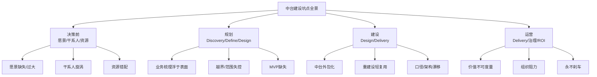

# 中台建设常见坑点速查表

## 16.1 概述

本专题前述各章从分类体系、本质论、前置决策、D4+ 方法论到 ROI 与治理体系，系统回答了"中台应该怎么建"。本章换一个角度，回答反面问题——**中台通常是怎么建坏的**。

坑点（Pitfall）与反模式（Anti-pattern）是业界失败案例的高度浓缩。本章把散落在各章中的典型误区与反模式做一次**集中、结构化、可检索**的汇总，按中台建设生命周期分为**决策前 / 规划 / 建设 / 运营**四个阶段。每条坑点统一给出五要素：**阶段、坑点名称、典型表现、危害、规避建议**，便于项目组在立项评审、里程碑复盘、季度治理评审（见第 11 章）时快速对照自查。

> **直接引述**：本章是"速查表"而非"新方法"，条目的立场与依据均来自本专题既定观点——凡与"前置决策框架（第 04 章）""D4+ 方法论（第 05–09 章）""ROI 与治理体系（第 11 章）""分类判别准则（第 02 章）"相一致的论点方纳入汇总，不作背离性发挥。

## 16.2 坑点的分类框架与演进

为避免条目散落、难以检索，本章用一张图给出坑点的整体分类与演进主线：

**要点解读**：这张图把坑点按生命周期四阶段归类，并标注了每条对应 D4+ 中最可能"翻车"的环节。它揭示了两条关键判断：其一，**坑点存在强前置性**——大量建设期、运营期的失败（如中台外包化、价值不可度量）往往根因在决策前（愿景不清、干系人未对齐）而非技术本身，这正是第 04 章"走得过早比方法不对更致命"判断的体现；其二，四条主线的反模式相互传染——规划期越界会放大建设期的范围失控，运营期不设"刹车机制"（第 11 章）会让小坑滚成大坑。下一节起按四阶段逐一展开。

## 16.3 决策前阶段的坑点与反模式

决策前阶段对应第 04 章"中台建设前置决策框架"——愿景、用户与客户、资源、验证指标、AI 融合策略五大问题未澄清即启动，是绝大部分失败的起点。

| 阶段 | 坑点名称 | 典型表现 | 危害 | 规避建议 |
|------|----------|----------|------|----------|
| 决策前 | 愿景缺失 | "领导说要做中台"，启动前未回答"解决什么问题、为谁创造价值" | 方向不清、随波逐流，中台沦为"解决问题的临时解决方案" | 落成一句话愿景（电梯演讲），全司对齐后再动手 |
| 决策前 | 愿景过大 / 空洞 | "用数据打通一切""打造行业一流中台" | 无法判断优先级，资源分散、什么都做 | 收敛为可度量、可验证的具体价值（见第 04 章做减法原则） |
| 决策前 | 干系人旋涡 | 前台、后台、管理层诉求相互矛盾，中台被多方拉扯 | 需求拥堵、边界失焦、价值模糊，团队被耗尽 | 先厘清用户（前台）与客户（管理层），以战略诉求为纲、战术诉求为约束 |
| 决策前 | 资源错配 | 未明确资金从何而来、由谁出资 | 众筹模式让中台沦为前台外包，失去自主性；投融资模式缺乏决心 | 用投资模式决策矩阵选择众筹/投融资/混合，并配套演进式投入 |
| 决策前 | 指标后置 | 建设完才补验证指标，无法归因 | "中台自有功"与"中台拖后腿"各执一词，无数据裁决 | 以终为始，开工前设计多维验证指标（战略/用户/降本/质量/创新/AI 增效） |
| 决策前 | AI 融合策略缺位 | 未回答中台与 AI 如何融合 | 或旁落（AI 仅当工具）、或激进（AI 原生架构冒进） | 按"AI 辅助/增强/原生"三策略决策树选型（第 04 章） |

## 16.4 规划阶段的坑点与反模式

规划阶段覆盖 D4+ 的 **Discovery（战略分解与全景调研）→ Define（平台型企业架构设计）→ Design（中台产品设计与 MVP 验证）** 环节（第 05–08 章）。

| 阶段 | 坑点名称 | 典型表现 | 危害 | 规避建议 |
|------|----------|----------|------|----------|
| 规划 | 业务梳理浮于表面 | 只盘点系统与接口，不拆解业务问题域 | 中台能力与真实业务痛点脱节，建成即闲置 | 以业务问题域（DDD Domain）驱动梳理，而非技术栈驱动（第 02 章判别准则） |
| 规划 | 未过分类判别准则 | 把"单业务线的服务化""公共平台"都冠以"中台" | 名不副实，资源投入偏离真正的复用点 | 用企业级/能力性/复用性/平台化/赋能性五准则过滤 |
| 规划 | 范围越界（一切皆中台） | 中台什么需求都接，边界失控 | 资源无限稀释，核心能力建不起来 | 依据愿景做减法，明确"哪些不做"，边界与范围季度校验 |
| 规划 | 直接照搬成熟考核体系 | 套用外部"40/25/20/15"等现成权重 | 与本企业愿景错位，考核绑架方向 | 借鉴设计思路（多维有侧重可量化），依据自身愿景定制 |
| 规划 | MVP 缺失 / 范围过大 | 一次性铺开全部模块，首版迟迟无法交付 | 验证周期过长，假设无法尽早证伪 | 按"端到端纵向切分"定义最小 MVP，先跑通一条完整链路（第 08、10 章） |
| 规划 | 规划与后续阶段脱节 | 规划文档完备但未衔接建设交付 | 设计方案落地时被推翻，反复返工 | 用 D4+ 的"持续演进"理念将规划与交付耦合，螺旋推进 |

## 16.5 建设阶段的坑点与反模式

建设阶段覆盖 D4+ 的 **Design（延续落地）与 Delivery（精益交付与运营治理）**（第 08–09 章），强调能力沉淀、复用与工程质量。

| 阶段 | 坑点名称 | 典型表现 | 危害 | 规避建议 |
|------|----------|----------|------|----------|
| 建设 | 中台外包化 | 中台成为前台共享外包团队，接单式应对需求 | 失去自主性，无暇沉淀，无法反哺 | 坚守能力复用边界，复用假设未验证的能力不接入（第 04 章） |
| 建设 | 重建设轻复用 | 反复为各线"定制"能力，不去抽象通用部分 | 中台沦为"更中心的烟囱"，无复用价值 | 以复用场景个数、跨线能力数为硬指标（第 11 章评估要点） |
| 建设 | 架构漂移 / 欠债 | 跳过架构守护，实现与设计持续偏离 | 技术债务快速增长，回退成本高 | 落地架构适应度函数（Fitness Function）+ 季度架构评审（第 11 章） |
| 建设 | 接入成本无人问 | 只关心中台能力自身，忽略前台接入改造成本 | 前台不愿接入，复用率低、ROI 失真 | 将接入成本纳入总成本核算，降低接入门槛给足支持 |
| 建设 | 能力作单一劳永逸 | 一处能力接完即不再演进，不迭代 | 能力陈旧、口径老化，逐步被绕过 | 产品化运营，按季度评审迭代路线图 |

## 16.6 运营阶段的坑点与反模式

运营阶段对应 **Delivery 的运营治理**与第 11 章 **ROI 评估与治理体系**——该阶段最容易出现"建完就散""无法度量""永不刹车"等问题。

| 阶段 | 坑点名称 | 典型表现 | 危害 | 规避建议 |
|------|----------|----------|------|----------|
| 运营 | 价值不可度量 | 仅有定性描述，无量化 ROI 数据 | 无法面对"中台没价值"质疑，建设决心动摇 | 按多维度量化收益与成本，短期/长期分开呈现（第 11 章） |
| 运营 | 组织阻力持续 | 跨部门数据/能力权责不清，冲突无法调和 | 中台名存实亡，各方各自为政 | 治理委员会 + 高层背书 + 明确的资产/能力负责人 |
| 运营 | 治理缺席 | 缺季度评审、无治理总览 | 方向漂移、质量失控、成本膨胀而不自知 | 落地季度治理评审会（架构/产品/运营/数据四线回顾） |
| 运营 | 永不刹车 | 只看投入不看成效，ROI 长年为负仍继续堆料 | 资源黑洞，平台成为负担 | 用第 11 章"刹车信号"清单（接入低迷/ROI 负>2 年/偏离超标）归零审视 |
| 运营 | 把"刹车"当"放弃" | 一遇阻力就彻底停摆 | 前期投入归零，团队士气受挫 | 区分"暂停重审"与"放弃"，螺旋式演进（第 11 章） |

## 16.7 跨阶段共性问题

以下坑点不局限于单个阶段，贯穿中台建设全生命周期，故单独列出以便重点防范：

| 阶段 | 坑点名称 | 典型表现 | 危害 | 规避建议 |
|------|----------|----------|------|----------|
| 全阶段 | 取数/数据权之争 | 数据资产权属不清，"谁的数据谁说了算" | 数据孤岛、重复建设、共享受阻 | 明确数据资产负责人与共享规则（第 15 章） |
| 全阶段 | 口径不一致 | 同名不同义、指标打架，无统一指标口径约束 | 数据分析失真、决策犯错、信任崩塌 | 统一指标口径与命名规范，OneData 体系约束 |
| 全阶段 | 只建不运营 | 资产目录/能力上架后无人维护、无人计费 | 资产沉睡、成本失控 | 资产化 + 运营化，目录持续维护、能力产品化迭代 |
| 全阶段 | 用"系统规模"衡量成功 | 用存储量、API 数量替代复用与价值指标 | ROI 虚高或无据，方向跑偏 | 用自助化率、跨线复用数、口径统一度等资产化指标度量 |

## 16.8 本章小结

中台建设的失败大多不是孤立的技术事故，而是**沿生命周期传导的连锁反应**——决策前的愿景与干系人问题，会放大到规划期的越界，再传导为建设期的外包化，最终表现为运营期的价值不可度量。

本章提供了一张可对照、可检索的坑点速查表，其使用建议如下：

1. **前置为主**：近半数的致命坑点源于"决策前"——先按第 04 章前置决策框架对齐愿景、干系人与资源，再谈建设。
2. **全程设卡**：把各阶段对应的自查项嵌入立项评审、里程碑复盘与季度治理评审会，让坑点"早发现、早刹车"。
3. **刹车不放弃**：遇到高频坑点信号，用第 11 章"刹车机制"暂停重审方向，而非彻底停摆。

> **直接引述（方法论定位）**：坑点速查表的终极价值，是把中台建设从"靠经验与运气"转向"按约定自查"——让每个项目组在与本表对照时，都能在建设初期就识别出"很容易翻车的地方"，从而把有限的资源投在真正决定成败的前置问题上。这样，中台的体系化建设（本专题全部章节）便可从"知道要做什么"进一步推进到"知道不能犯什么错"。