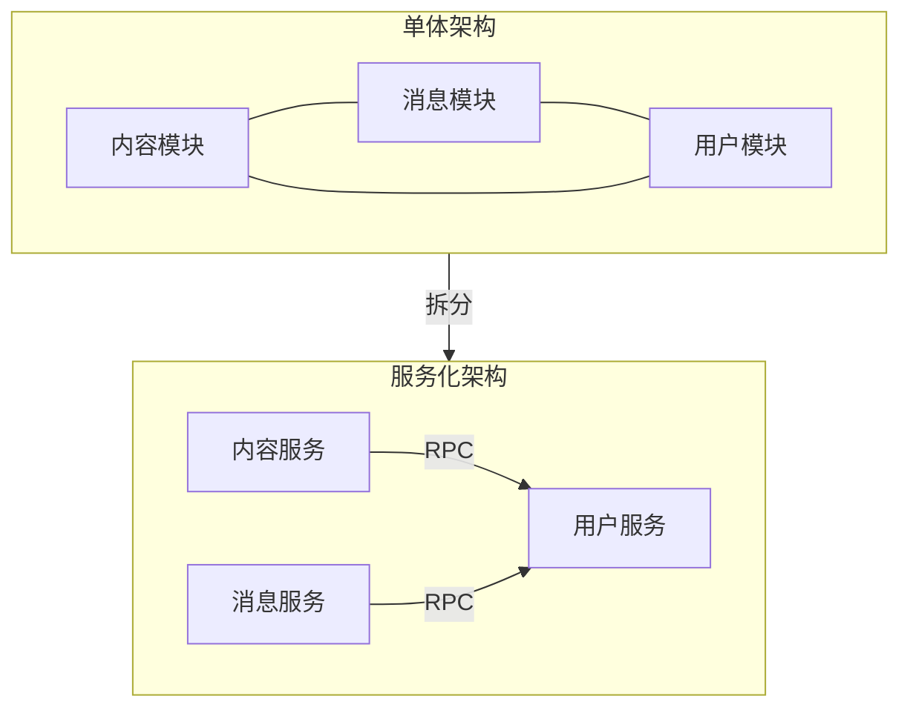
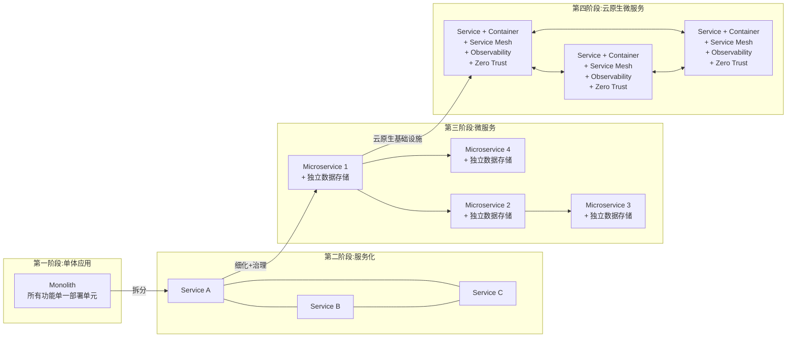
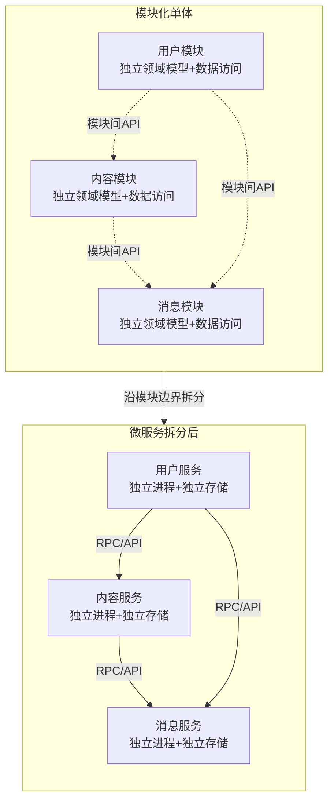
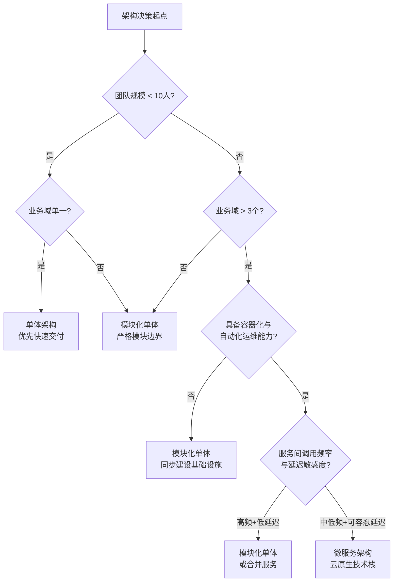

# 微服务的本质：从单体到云原生的架构演进

> **版本基线**：Kubernetes 1.30+ | containerd 2.x | Istio 1.22+ | Nacos 2.4+ | OpenTelemetry 1.x
> **阅读时间**：约 25 分钟
> **前置知识**：无

## 概述

微服务架构自2014年由 Martin Fowler 与 James Lewis 正式提出以来，经历了从概念萌芽到行业标配的完整生命周期。然而，2023-2025年间，业界对微服务的认知发生了根本性转变：从"微服务优先"（Microservices First）的激进路线，回归到"适度架构"（Right-sized Architecture）的理性立场。Amazon Prime Video 从微服务回退至单体的事件，以及 Stack Overflow 始终以单体架构支撑全球流量的实践，均表明微服务并非唯一解，模块化单体（Modular Monolith）已成为架构决策中的合理选项。

与此同时，云原生技术栈本身也在快速迭代：Service Mesh 从 Sidecar 代理模式向无 Sidecar 的 Ambient Mesh 与 eBPF 方案演进；OpenTelemetry 统一了可观测性三大支柱；零信任安全成为基础设施标配；AI 与微服务的融合正在开辟新的架构范式。

**核心问题**：微服务的本质是什么？何时应引入微服务，何时不应？在2025-2026的技术语境下，如何做出正确的架构决策？

**学习目标**：

- 理解单体应用的固有瓶颈与服务化演进的驱动力
- 掌握微服务相对于服务化的本质差异
- 认识微服务定义的演进——从"微服务优先"到"适度架构"
- 建立基于业务规模与团队规模的架构决策框架

---

## 一、单体应用：架构的起点与瓶颈

### 1.1 单体架构的特征

单体应用（Monolithic Application）将所有业务逻辑、数据访问、界面渲染等功能打包为单一部署单元。在 Java 技术栈中，典型形态是一个 WAR 包部署至 Tomcat；在脚本语言栈中，则体现为 LAMP（Linux + Apache + MySQL + PHP）等一体化方案。

单体架构的核心优势在于简单性：开发、测试、部署、运维的链路短，学习成本低，小团队即可快速交付。在业务初期——用户规模有限、功能域较少、团队人数在2-5人时，单体架构是最经济的选择。

### 1.2 规模扩张下的系统性瓶颈

当业务规模与团队规模同步增长时，单体架构的固有缺陷将逐一暴露：

| 瓶颈维度 | 具体表现 | 根因 |
|---|---|---|
| **部署效率** | 单次编译打包+部署测试耗时超过10分钟；代码量膨胀后构建时间线性增长 | 所有模块耦合在同一部署单元，任何变更均需全量构建 |
| **协作成本** | 多团队并行开发时，代码合并冲突频繁；单一功能缺陷导致全量回归测试 | 共享代码仓库与部署流水线，缺乏变更隔离机制 |
| **可用性** | 单一模块的内存泄漏或异常耗尽整个进程资源，导致全部功能不可用 | 进程内无故障隔离边界，局部故障全局扩散 |
| **弹性伸缩** | 无法针对高负载模块独立扩容，只能整体水平扩展，资源浪费严重 | 所有功能共享同一进程与资源池 |
| **技术栈锁定** | 全局技术选型受限于单一运行时，无法为不同模块选择最优方案 | 单一部署单元的运行时环境统一约束 |

上述瓶颈的本质是**缺乏隔离边界**——无论是代码边界、部署边界还是运行时边界。服务化思想正是为解决这一问题而生。

---

## 二、服务化：从本地调用到远程调用

### 2.1 服务化的核心机制

服务化的本质是将单体应用中通过 JAR 包依赖产生的本地方法调用，改造为通过 RPC 接口产生的远程方法调用。每个被拆分出的模块成为独立部署的服务，通过标准化的网络协议对外提供能力。

以社交平台为例，系统包含内容模块、消息模块、用户模块。单体架构下，三者代码耦合在同一应用中，共享进程与资源。服务化改造后，用户模块被拆分为独立服务，内容模块与消息模块通过 RPC 调用用户服务，实现了开发、测试、部署、运维的完全解耦。



### 2.2 服务化解决的问题与局限

服务化有效缓解了单体架构的协作成本与部署效率问题，但早期的服务化实践存在明显局限：

- **拆分粒度粗**：通常按业务域做粗粒度拆分，一个服务内部仍可能包含大量耦合逻辑
- **治理能力缺失**：服务间调用关系简单时问题不大，一旦服务数量增长，缺乏服务发现、熔断、限流等治理机制将导致系统脆弱
- **运维负担转移**：从管理一个大型单体变为管理多个服务，部署复杂度显著上升，若无自动化支撑则运维成本反增

---

## 三、微服务：服务化的深度演进

### 3.1 微服务与服务化的本质差异

2014年，Martin Fowler 与 James Lewis 在其标志性文章《Microservices》中，将微服务定义为一种架构风格——将单一应用程序开发为一组小型服务，每个服务运行在独立进程中，服务间通过轻量级机制（通常是 HTTP API）通信，服务可独立部署，并使用最低限度的集中式管理。

微服务相对于服务化，并非简单的粒度细化，而是在以下四个维度实现了质的跃升：

| 维度 | 服务化 | 微服务 |
|---|---|---|
| **拆分粒度** | 按业务域粗粒度拆分 | 围绕业务能力细粒度拆分，单一职责 |
| **部署独立性** | 服务可独立部署，但常共享数据库 | 服务完全独立部署，包括独立数据存储 |
| **维护独立性** | 服务由原团队维护，组织结构未调整 | 服务由跨职能小团队全权负责，康威定律驱动 |
| **治理能力** | 依赖人工配置与约定 | 依赖自动化基础设施：服务发现、熔断、限流、可观测性 |

### 3.2 微服务得以落地的技术前提

微服务架构的落地并非仅靠架构设计即可实现，它依赖一系列技术基础设施的成熟：

- **容器化**（containerd 2.x / CRI-O 1.30+）：提供标准化的打包与运行时隔离，使服务的独立部署成为可能
- **容器编排**（Kubernetes 1.30+）：解决多服务部署、调度、弹性伸缩的自动化问题
- **持续交付**（CI/CD Pipeline）：保障服务独立迭代的速度与质量
- **自动化基础设施**：服务发现（Nacos 2.4+ / Consul 1.18+ / etcd 3.5+）、配置管理、日志聚合等

没有这些基础设施的支撑，微服务的运维复杂度将远超其带来的收益。

---

## 四、架构演进的完整图景

从单体到云原生，架构演进并非线性替代，而是能力边界的逐步扩展：



每一阶段的演进都伴随着技术基础设施的升级与组织能力的提升。跳过中间阶段直接进入下一阶段，往往因基础能力缺失而导致架构失败。

---

## 五、微服务定义的演进：从"微服务优先"到"适度架构"

### 5.1 "微服务优先"时代的反思

2015-2020年间，业界普遍奉行"微服务优先"策略——新项目直接采用微服务架构，存量系统加速拆分。这一趋势的驱动力包括：容器化与 Kubernetes 的普及降低了运维门槛，Netflix、Uber 等公司的微服务实践成为行业标杆。

然而，大量中小团队在缺乏相应基础设施与组织能力的情况下盲目引入微服务，导致了严重的工程问题：分布式系统的固有复杂度（网络分区、数据一致性、调试困难）远超预期，服务拆分过细带来的通信开销与运维负担抵消了独立部署的收益。

### 5.2 Amazon Prime Video 案例：从微服务回退到单体

2023年，Amazon Prime Video 团队公开发布其音视频监控服务的架构演进经历，成为业界反思微服务过度拆分的标志性事件。

该团队最初将监控服务拆分为多个微服务，使用 AWS Step Functions 编排服务间调用。然而在实际运行中，他们发现：

- Step Functions 的状态转换延迟导致端到端处理时间过长，无法满足实时音视频监控的 SLA
- 服务间通信的序列化/反序列化开销在帧级处理场景下不可接受
- 多服务协调的运维复杂度与成本远超预期

最终，团队将多个微服务合并回单体应用，部署在 AWS Lambda 上，性能提升显著，成本降低超过90%。

**关键启示**：微服务的价值在于独立部署与独立伸缩，当服务间调用频率极高、延迟敏感、且各模块变更节奏一致时，合并不拆分反而是更优解。

### 5.3 模块化单体：第三条路径

模块化单体（Modular Monolith）是一种兼顾单体简洁性与微服务模块性的架构风格。其核心原则是：

- **严格的模块边界**：在代码层面强制模块间的依赖规则，每个模块拥有独立的领域模型与数据访问层
- **单一部署单元**：所有模块仍打包为单一应用，避免分布式系统的运行时复杂度
- **可拆分性**：当业务规模增长到需要独立部署时，模块可沿既有边界拆分为微服务，无需大规模重构

Stack Overflow 是模块化单体的典型实践者——以单一 ASP.NET MVC 应用支撑全球每月数十亿次访问，通过严格的模块边界与高性能缓存策略，在单体架构下实现了极高的可用性与开发效率。



---

## 六、Service Mesh 的演进：从 Sidecar 到 Ambient Mesh / eBPF

微服务架构的落地离不开服务间通信的治理基础设施。Service Mesh 作为独立的基础设施层，将服务发现、负载均衡、熔断、mTLS 等能力从应用代码中剥离，是微服务治理的关键组件。

### 6.1 Sidecar 模式及其局限

以 Istio（1.22之前版本）为代表的 Service Mesh 采用 Sidecar 代理模式：每个服务实例旁注入一个 Envoy 代理，拦截所有入站与出站流量。该模式的优势在于对应用代码零侵入，但存在以下固有缺陷：

- **资源开销**：每个 Pod 增加一个 Sidecar 容器，内存与 CPU 开销随服务数量线性增长
- **延迟增加**：每次服务间调用需经过 Sidecar 的拦截与转发，增加约1-2ms的延迟
- **运维复杂度**：Sidecar 的升级需逐个 Pod 重启，影响面大

### 6.2 Ambient Mesh：无 Sidecar 的 Service Mesh

Istio 1.22+ 引入的 Ambient Mesh 模式，将 Sidecar 的功能拆分为两层：

- **ztunnel**：节点级共享代理，负责 L4 流量转发与 mTLS，每个节点仅运行一个实例
- **waypoint**：按服务账户部署的 L7 代理，按需启用，负责路由、熔断等高级治理

该模式消除了 Sidecar 的资源开销与延迟惩罚，同时保留了 Service Mesh 的核心治理能力。

### 6.3 eBPF 方案：内核级的服务治理

Cilium 1.16+ 与 Tetragon 基于 eBPF 技术，将网络策略、可观测性、安全审计等能力下沉至 Linux 内核层执行，无需用户态代理介入。该方案在性能与资源效率上具有天然优势，代表了 Service Mesh 的未来演进方向。

```mermaid
graph TB
    subgraph Sidecar模式
        direction LR
        SC1[Service A] --- SC2[Envoy Sidecar]
        SC2 --- SC3[Envoy Sidecar]
        SC3 --- SC4[Service B]
    end

    subgraph Ambient Mesh模式
        direction LR
        AM1[Service A] --> AM2[ztunnel<br/>节点级L4代理]
        AM2 --> AM3[waypoint<br/>L7代理]
        AM3 --> AM4[ztunnel<br/>节点级L4代理]
        AM4 --> AM5[Service B]
    end

    subgraph eBPF模式
        direction LR
        EB1[Service A] --> EB2[eBPF<br/>内核级处理]
        EB2 --> EB3[Service B]
    end

    Sidecar模式 -->|演进| Ambient Mesh模式
    Ambient Mesh模式 -->|演进| eBPF模式

```

---

## 七、技术演进时间线

| 年份 | 里程碑事件 | 技术标志 |
|---|---|---|
| 2014 | Martin Fowler & James Lewis 发表《Microservices》 | 微服务概念正式确立 |
| 2015 | Docker 生态爆发，Kubernetes 1.0 发布 | 容器化与编排基础就绪 |
| 2016-2018 | Spring Cloud / Dubbo 生态成熟，Netflix OSS 影响力扩散 | 微服务框架标准化 |
| 2018-2019 | Istio 1.0 发布，Service Mesh 概念普及 | 服务治理基础设施化 |
| 2020-2021 | eBPF 进入主流，Cilium 兴起 | 内核级网络与安全能力 |
| 2021 | OpenTelemetry 从 CNCF 孵化器毕业，统一 Trace/Metric/Log 三大信号 | 可观测性统一标准 |
| 2023 | Amazon Prime Video 微服务回退事件；SPIFFE/SPIRE 标准化 | "适度架构"理念兴起 |
| 2024 | Istio 1.24 Ambient Mesh 进入 Beta；Kubernetes 1.29 默认启用原生 Sidecar 容器 | Service Mesh 无 Sidecar 化 |
| 2025-2026 | Cilium Service Mesh + eBPF 成熟；AI Agent 与微服务融合；零信任安全标配 | 云原生微服务新范式 |

---

## 八、架构决策指南

架构选择并非技术偏好问题，而是基于业务规模、团队规模、技术成熟度的系统性决策。以下决策框架供参考：



**决策原则**：

1. **从简单开始**：单体或模块化单体是默认选择，微服务是需要充分理由才引入的架构升级
2. **模块化先行**：无论是否采用微服务，代码层面的模块边界都是必要投资——它为未来的拆分保留可能性
3. **基础设施先行**：引入微服务前，必须具备容器化编排、CI/CD、服务发现、可观测性等基础能力
4. **按需拆分**：当且仅当某个模块的部署频率、伸缩需求、可用性要求与其他模块显著不同时，才将其拆分为独立服务
5. **持续评估**：架构不是一次性决策，应随业务与团队的变化持续评估与调整

---

## 小结

微服务的本质并非"把系统拆小"，而是**通过建立清晰的边界（代码边界、部署边界、数据边界、组织边界），实现系统的可控演进**。这一本质在不同阶段有不同的实现形态：

- 单体架构通过模块化实现代码边界
- 服务化通过 RPC 实现部署边界
- 微服务通过独立数据存储与独立团队实现完整的边界隔离
- 云原生微服务通过 Service Mesh、可观测性、零信任安全实现边界间的自动化治理

2025-2026年的技术语境下，"适度架构"已成为行业共识。模块化单体与微服务并非对立关系，而是同一演进路径上的不同节点——前者是后者的前置状态，后者是前者的自然延伸。架构决策的核心不在于选择哪种形态，而在于**在正确的阶段采用正确的形态，并始终保持向下一阶段演进的能力**。

Service Mesh 从 Sidecar 向 Ambient Mesh 与 eBPF 的演进，OpenTelemetry 对可观测性的统一，零信任安全的标准化，以及 AI 与微服务的融合，正在重塑微服务的技术基础设施。理解这些演进趋势，是做出正确架构决策的前提。

**下一篇**：[[02]](02-从单体应用走向服务化.md) 从单体应用走向服务化 →
