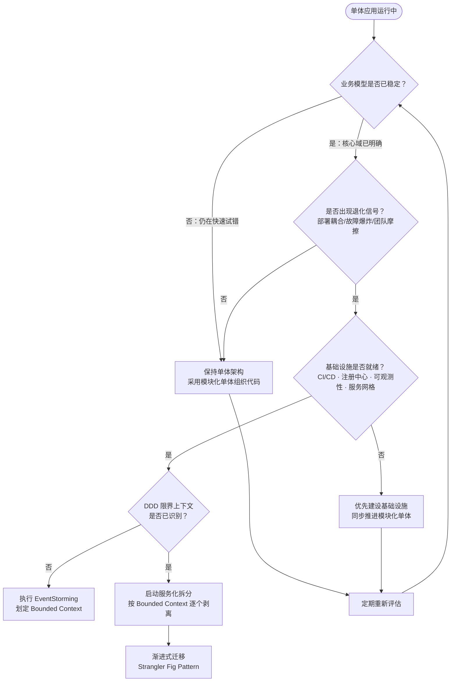
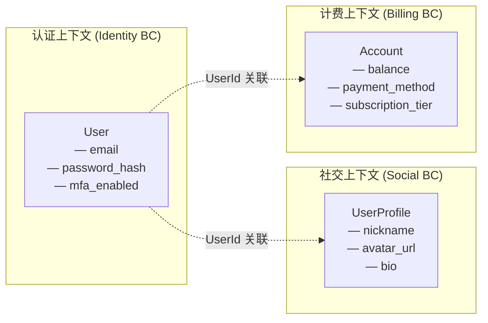
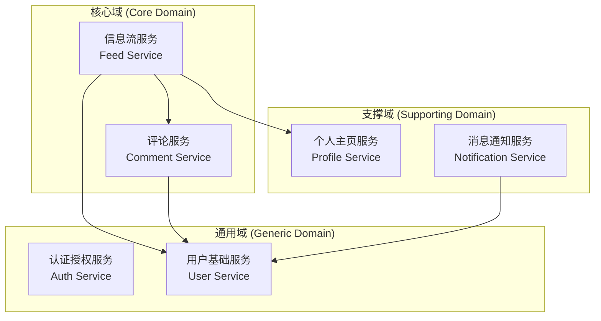
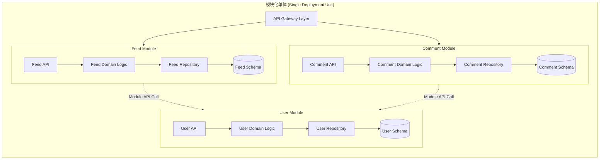
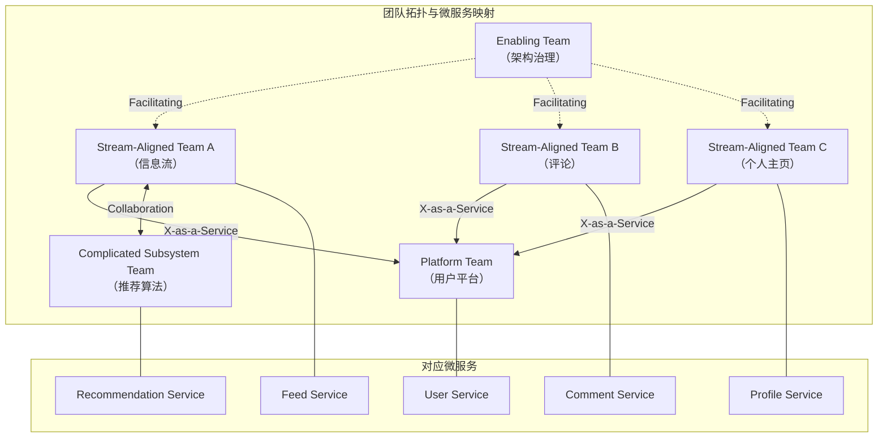

# 从单体应用走向服务化

> **版本基线**：Kubernetes 1.30+ | Istio 1.22+ | gRPC 1.71+ | Nacos 2.4+
> **阅读时间**：约 25 分钟
> **前置知识**：[[01]] 到底什么是微服务

## 概述

上一篇梳理了微服务架构的定义与演进脉络。本篇聚焦一个更具操作性的核心问题：**何时拆分单体应用？如何拆分？拆分前需要满足哪些前提？**

这三个问题并非单纯的技术选型问题，而是涉及业务域建模、组织结构、团队拓扑与基础设施成熟度的系统性决策。本篇将从领域驱动设计（Domain-Driven Design, DDD）的方法论出发，结合模块化单体（Modular Monolith）的中间态策略、团队拓扑（Team Topologies）理论与 Conway's Law 的组织约束，构建一套面向 2025-2026 年技术栈的服务化拆分决策框架。

读完本篇，读者应能回答以下问题：

1. 单体应用在什么条件下应当启动服务化拆分？
2. 如何运用 DDD 的限界上下文（Bounded Context）指导服务边界的划定？
3. 模块化单体在拆分路径中扮演什么角色？
4. 团队结构与架构形态之间如何互塑？
5. 服务化拆分有哪些常见反模式与陷阱？

---

## 正文

### 一、服务化拆分的时机判断

#### 1.1 单体应用的阶段性价值

单体应用（Monolithic Application）并非架构反模式，而是在项目特定阶段的最优选择。在业务验证期，产品核心假设尚未被市场证实，开发团队的首要目标是快速迭代、验证可行性。此时，所有功能模块部署于同一进程、同一交付物中，具有以下结构性优势：

- **认知负载低**：开发者无需理解分布式系统的复杂性，聚焦业务逻辑本身
- **调试效率高**：进程内调用栈完整，问题定位路径短
- **交付速度快**：无服务间协调开销，一次构建即可完成全量部署
- **基础设施简单**：无需注册中心、配置中心、服务网格等分布式中间件

这一阶段通常对应业务从 0 到 1 的验证期。以社交产品为例，初期仅需信息流与评论两个核心功能，单体架构足以支撑小团队（5-8 人）的快速迭代。

#### 1.2 单体架构的退化拐点

当业务验证通过、功能持续扩张时，单体架构的内部耦合将产生系统性摩擦。退化拐点通常出现在以下信号同时出现的时刻：

| 退化信号 | 具体表现 | 根因分析 |
|---------|---------|---------|
| **部署耦合** | 一次上线需全量回归测试，任一模块缺陷阻塞全局发布 | 共享交付物导致发布单元粒度过粗 |
| **故障爆炸半径** | 单模块内存泄漏或异常退出导致全进程不可用 | 进程级隔离缺失 |
| **技术栈锁定** | 全局框架升级牵一发动全身，无法对单个模块独立选型 | 共享运行时与依赖 |
| **团队协作摩擦** | 多团队并行开发产生代码冲突、环境争用 | 共享代码仓库与部署环境 |
| **扩展不均** | 高负载模块无法独立水平扩展，低负载模块被迫跟随扩容 | 统一部署单元无法差异化伸缩 |

根据行业实践，当单体应用的并行开发人员超过 10-15 人，或代码库模块数超过 5-8 个业务域时，上述信号通常会密集出现。但人员数量仅为参考指标，更可靠的判断依据是：**团队是否因架构耦合而频繁产生协作摩擦，且这种摩擦无法通过工程实践（如 Feature Toggle、Branch by Abstraction）有效缓解。**

#### 1.3 拆分决策流程

以下决策流程图整合了业务成熟度、团队规模、技术准备度三个维度的评估：

**关键决策原则**：服务化拆分不可逆，但可以渐进。先行模块化单体，再逐个剥离为独立服务，是风险可控的演进路径。

---

### 二、领域驱动设计与限界上下文

服务化拆分的核心难点不在于技术实现，而在于**边界的划定**。拆分过粗，退化为分布式单体；拆分过细，服务数量膨胀、治理成本失控。领域驱动设计（DDD）为这一问题提供了系统性的理论框架。

#### 2.1 限界上下文（Bounded Context）

限界上下文是 DDD 中定义模型边界的核心概念。一个 Bounded Context 是一个显式的语言与模型边界，在其中，领域模型具有唯一确定的含义。

**核心规则**：同一业务概念在不同 Bounded Context 中可以具有不同的属性与行为。例如，"用户"在身份认证上下文中是 Credentials 实体（关注认证信息），在社交上下文中是 Profile 实体（关注昵称、头像），在计费上下文中是 Account 实体（关注余额、支付方式）。

#### 2.2 EventStorming 与上下文识别

EventStorming 是一种协作式工作坊方法，用于快速识别业务事件与聚合边界，进而划定 Bounded Context。其核心流程如下：

1. **梳理领域事件**：以橙色便利贴标记业务中发生的事件（如 `OrderPlaced`、`PaymentCompleted`）
2. **识别命令与聚合**：每个事件由某个命令触发，命令作用于某个聚合
3. **划分上下文边界**：将高内聚的聚合-命令-事件组归入同一 Bounded Context
4. **绘制上下文映射（Context Map）**：明确上下文之间的关系模式（如 Customer-Supplier、Conformist、Anti-Corruption Layer）

#### 2.3 从 Bounded Context 到微服务

Bounded Context 与微服务并非一对一映射关系。实践中的映射策略如下：

| 映射策略 | 适用场景 | 优势 | 风险 |
|---------|---------|------|------|
| **1 BC = 1 Service** | BC 内聚度高、团队独立 | 最大独立性，部署解耦 | 可能过度拆分 |
| **1 BC = N Services** | BC 内存在独立变化的子域 | 更细粒度的伸缩与发布 | 子域间需保证一致性 |
| **N BC = 1 Service**（初期） | BC 边界尚不清晰 | 降低过早拆分的风险 | 需预留后续拆分接口 |

**推荐路径**：初期采用 N BC = 1 Service（模块化单体），待边界稳定后再演进为 1 BC = 1 Service。

---

### 三、纵向拆分与横向拆分

原文提出了纵向拆分（按业务关联度）与横向拆分（按公共功能）两种维度。在 DDD 框架下，这两种拆分方式可以获得更精确的定义。

#### 3.1 纵向拆分：按子域拆分

纵向拆分对应 DDD 中的子域划分。每个微服务封装一个完整的业务子域，包含其独立的领域模型、业务逻辑与数据存储。

**拆分依据**：子域的内聚度。高内聚的业务功能归入同一服务，低耦合的业务功能分离为独立服务。

以社交应用为例：

#### 3.2 横向拆分：提取共享内核

横向拆分对应 DDD 中的共享内核（Shared Kernel）提取。当多个服务依赖同一业务概念且该概念的变更频率较高时，将其独立为公共服务。

**典型场景**：用户昵称在信息流、评论、个人主页中均有展示。若昵称逻辑变更（如增加昵称审核规则），涉及所有依赖服务的联调上线。将其提取为独立的用户基础服务后，变更仅需发布该单一服务。

**横向拆分的边界判断**：

- 提取为独立服务的公共功能必须满足：被 **3 个及以上** 其他服务依赖
- 依赖的资源（数据存储、外部 API）与其他业务不耦合
- 具有独立的变更频率与发布节奏

**警惕过度提取**：并非所有共享功能都应独立为服务。变更频率低、接口稳定的共享逻辑更适合以 SDK/Library 的形式分发，避免引入不必要的网络调用与运维开销。

#### 3.3 两种拆分维度的协同

纵向拆分划定业务边界，横向拆分提取跨边界共享能力。实际操作中应**先纵向、后横向**——先按子域划定服务边界，再在服务间识别共享内核并逐步提取。过早的横向拆分容易产生"贫血服务"（仅提供 CRUD 接口，缺乏业务语义），增加调用链深度而未带来实质性的解耦收益。

---

### 四、模块化单体：拆分前的中间态

#### 4.1 模块化单体的定义

模块化单体（Modular Monolith）是一种架构风格：在单一部署单元内，按 Bounded Context 组织代码为独立模块，每个模块具有明确的 API 边界与独立的数据访问层，模块间通过接口而非共享数据库表通信。

其核心价值在于：**以单体部署的低成本换取模块化的高内聚，为后续拆分预留清晰边界。**

#### 4.2 模块化单体的实现要点

| 实践 | 说明 | 技术参考 |
|------|------|---------|
| **模块级包隔离** | 每个 Bounded Context 对应独立包/模块，禁止跨模块直接访问内部类 | Java 9+ Module System / .NET Assembly |
| **独立数据 Schema** | 每个模块拥有独立的数据表或 Schema，禁止跨模块直接查询 | Schema-per-module / Database-per-module |
| **模块间接口契约** | 模块间通过公共 API 接口通信，而非直接引用领域对象 | 接口定义在模块的 API 包中 |
| **独立测试** | 每个模块可独立进行单元测试与集成测试 | 模块级 Test Suite |
| **构建时隔离** | 构建工具支持模块级编译与依赖检测 | Gradle / Maven Multi-Module |

#### 4.3 从模块化单体到微服务的演进

当模块化单体的某个模块满足独立部署的必要性时，可使用 Strangler Fig Pattern 将其逐步剥离：

1. 在模块的公共 API 层引入 gRPC 或 HTTP 接口定义
2. 将模块的进程内调用替换为远程调用（可通过 Service Mesh 的流量管理实现灰度切换）
3. 独立部署该模块为微服务
4. 从单体中移除该模块的代码与数据

这一过程的核心优势：**每一步都是可逆的**。若剥离后出现问题，可将调用切回进程内模式，无需回滚整个架构变更。

---

### 五、团队拓扑与 Conway's Law

#### 5.1 Conway's Law 的架构约束

Melvin Conway 于 1968 年提出：**"设计系统的组织，其产生的设计等同于组织之内、组织之间的沟通结构。"** 这一论断已被微软、哈佛等机构的实证研究验证。

其推论——逆向 Conway 实验（Inverse Conway Maneuver）——主张：**通过有意识地调整团队结构来驱动目标架构形态的产生，而非相反。**

在微服务拆分中的具体含义：

- 微服务的边界应与团队边界对齐，一个服务由一个团队（通常 5-8 人）负责全生命周期
- 跨团队共享的服务所有权将导致责任模糊与演进停滞
- 服务间通信模式应反映团队间的协作模式

#### 5.2 Team Topologies 与服务拆分

Team Topologies 理论定义了四种团队类型与三种交互模式，为微服务的组织设计提供了系统化框架：

| 团队类型 | 职责 | 对应服务形态 | 典型示例 |
|---------|------|------------|---------|
| **Stream-Aligned Team** | 面向业务流，端到端交付 | 业务微服务（核心域/支撑域） | 信息流团队、订单团队 |
| **Platform Team** | 提供内部平台能力，减少认知负载 | 平台服务（通用域/基础设施） | 认证平台、消息平台 |
| **Enabling Team** | 帮助 Stream-Aligned Team 提升能力 | 无直接对应服务，提供咨询与工具链 | DDD 咨询团队、可观测性团队 |
| **Complicated Subsystem Team** | 处理高复杂度子系统 | 独立的高复杂度微服务 | 推荐算法服务、风控引擎服务 |

三种交互模式：

- **Collaboration**：两个团队紧密协作，共同探索（适用于服务边界尚不清晰的阶段）
- **X-as-a-Service**：一个团队向另一个团队提供明确的服务契约（适用于边界已稳定的服务间关系）
- **Facilitating**：Enabling Team 帮助其他团队提升能力（不直接对应服务间交互）

#### 5.3 服务粒度与团队规模的关系

微服务粒度的决策应遵循以下原则：

- **一个服务对应一个团队**：避免多团队共享一个服务（责任模糊），也避免一个团队维护过多服务（认知负载过载）
- **团队可维护的服务数量上限**：一个 Stream-Aligned Team 通常维护 1-3 个核心服务 + 1-2 个辅助服务，超过此范围将导致上下文切换成本过高
- **服务粒度的调整方向**：优先保证团队边界清晰，再在团队内部调整服务粒度

---

### 六、服务化拆分的反模式与常见陷阱

#### 6.1 反模式清单

| 反模式 | 描述 | 后果 | 规避策略 |
|-------|------|------|---------|
| **Big Bang 拆分** | 一次性将单体拆为数十个微服务 | 大面积故障、团队应接不暇 | 渐进式拆分，每次剥离一个 Bounded Context |
| **分布式单体** | 拆分后服务间紧耦合，变更仍需多服务联动 | 兼具单体的耦合与分布式的复杂度 | 严格遵守 Bounded Context 边界，消除同步调用链 |
| **共享数据库** | 多个服务直接访问同一数据库表 | 数据耦合未解除，独立部署不可行 | Database-per-Service，通过 API 或事件共享数据 |
| **贫血微服务** | 服务仅暴露 CRUD 接口，缺乏业务语义 | 调用链深、业务逻辑散落在 Consumer 侧 | 服务封装完整的业务能力，而非数据代理 |
| **过早优化** | 在业务模型未稳定时强行拆分 | 频繁的服务边界调整，投入产出比极低 | 先模块化单体，待业务域稳定后再拆分 |
| **Nano Service** | 拆分粒度过细，一个 API 端点即一个服务 | 服务数量膨胀、运维成本失控 | 以 Bounded Context 为最小拆分单位 |
| **忽略数据迁移** | 只拆代码，未规划数据拆分与迁移 | 数据一致性丧失，回滚困难 | 拆分前制定数据拆分策略，使用 Change Data Capture 同步 |

#### 6.2 拆分过程中的技术陷阱

1. **分布式事务陷阱**：单体中的本地事务在拆分后变为分布式事务。应优先采用 Saga 模式（Choreography 或 Orchestration），而非两阶段提交（2PC）。在 Kubernetes 环境下，可借助 Seata（Dubbo 生态）或自定义 Saga 编排器实现。

2. **调用链膨胀陷阱**：一次用户请求从进程内调用变为跨网络的多跳调用，延迟显著增加。引入缓存、批量接口与异步化（事件驱动）是主要缓解手段。OpenTelemetry 的分布式追踪能力在此阶段不可或缺。

3. **数据一致性陷阱**：从强一致性退化为最终一致性，需要业务方接受并适配。CQRS（Command Query Responsibility Segregation）模式可在读写分离的同时，通过事件溯源保证最终一致性。

---

### 七、服务化拆分的前置条件

从单体应用迁移到微服务架构，以下基础设施与工程能力是必要前提：

#### 7.1 服务定义与契约

| 维度 | 单体架构 | 微服务架构 | 关键技术 |
|------|---------|-----------|---------|
| 通信方式 | 进程内方法调用 | 跨进程网络调用 | gRPC 1.71+ / HTTP/2 |
| 契约定义 | 接口/类定义 | IDL / OpenAPI Spec | Protocol Buffers 3 / OpenAPI 3.1 |
| 契约演进 | 同步更新即可 | 需保证向后兼容 | Semantic Versioning + Compatibility Rules |

服务契约是微服务间协作的唯一约束。gRPC 使用 Protocol Buffers 定义服务接口，天然具备跨语言与向后兼容的优势；RESTful API 则使用 OpenAPI Specification 定义契约。无论采用哪种方式，契约的变更必须遵循兼容性规则——新增字段使用默认值，删除字段使用弃用标记（deprecated），严禁修改已有字段的语义。

#### 7.2 服务注册与发现

微服务实例的地址是动态变化的（弹性伸缩、滚动更新、故障迁移），因此需要注册中心提供服务的发布与订阅机制。

当前主流方案：

| 注册中心 | 适用场景 | 核心特性 | 版本参考 |
|---------|---------|---------|---------|
| **Kubernetes Service** | K8s 原生部署 | DNS + Endpoint + Headless Service | Kubernetes 1.30+ |
| **Nacos** | Dubbo / Spring Cloud 生态 | 配置中心一体化、MCP-over-XDS 协议 | Nacos 2.4+ |
| **Consul** | 多运行时混合部署 | Connect（内置 Service Mesh）、Multi-DC | Consul 1.18+ |
| **etcd** | 自研框架 / 轻量级场景 | 强一致性、Watch 机制 | etcd 3.5+ |

在 Kubernetes 环境中，优先使用 K8s Service + DNS 作为注册发现机制；在 Service Mesh 场景下，Istio 基于 xDS 协议从 K8s API Server 获取服务信息并下发至数据面，无需额外部署注册中心。

#### 7.3 可观测性体系

微服务架构下，故障定位的难度呈指数级增长。必须建立覆盖 Metrics、Traces、Logs 三大支柱的可观测性体系：

- **Metrics**：Prometheus 3.x 采集服务指标（QPS、延迟 P50/P95/P999、错误率），Grafana 可视化告警
- **Traces**：OpenTelemetry SDK 自动埋点，通过 Jaeger 或 Grafana Tempo 存储与查询分布式追踪数据
- **Logs**：结构化日志（JSON 格式），通过 Fluent Bit / Vector 采集，Loki / Elasticsearch 存储
- **eBPF 增强**：Cilium Tetragon 提供内核级无侵入可观测性，无需应用代码改动即可获取网络、文件、进程级事件

#### 7.4 服务治理

微服务数量增长后，服务间依赖关系变得复杂，需要系统化的治理能力：

- **流量管理**：Istio VirtualService / DestinationRule 实现流量切换、灰度发布、A/B 测试
- **熔断与降级**：服务端错误率超阈值时自动切断调用，避免级联故障。Sentinel（Dubbo 生态）或 Istio Circuit Breaker
- **限流**：令牌桶/滑动窗口算法保护服务不被过载。Envoy Rate Limit 或 Sentinel
- **重试与超时**：合理设置重试次数与超时时间，避免雪崩（Istio VirtualService 的重试与超时配置）

#### 7.5 安全与零信任

服务化拆分后，进程间通信从内存调用变为网络传输，安全边界发生根本性变化：

- **身份认证**：SPIFFE/SPIRE 为每个服务 workload 分配可验证的身份标识（SVID）
- **传输加密**：服务网格自动管理 mTLS 证书的签发与轮转（Istio CA / cert-manager）
- **访问控制**：OPA（Open Policy Agent）实现策略即代码，Kubernetes 环境下可使用 Gatekeeper 准入控制器
- **供应链安全**：镜像签名（Cosign）、SBOM（Software Bill of Materials）、漏洞扫描（Trivy）

#### 7.6 前置条件成熟度评估

以下评估矩阵可用于判断团队是否具备服务化拆分的基础条件：

| 前置条件 | 不具备 | 部分具备 | 完备 |
|---------|-------|---------|------|
| CI/CD 自动化 | 手动构建部署 | 自动构建，手动审批发布 | 全自动 Pipeline + Progressive Delivery |
| 服务注册发现 | 无 | 单节点注册中心 | 集群化注册中心 / K8s Service |
| 可观测性 | 仅日志 | 日志 + 基础监控 | Metrics + Traces + Logs 三支柱 |
| 服务治理 | 无 | 手动配置 | Service Mesh / SDK 治理 |
| 安全体系 | 明文通信 | TLS 网关加密 | mTLS + SPIFFE + OPA |
| 团队就绪 | 全栈混合团队 | 按功能分工 | Stream-Aligned Team |

**建议**：至少在 CI/CD、服务注册发现、可观测性三个维度达到"完备"状态后再启动拆分。

---

## 技术演进时间线

| 时间 | 里程碑 | 影响 |
|------|--------|------|
| 2014 | Martin Fowler 发表"Microservices" | 微服务概念进入主流视野，但缺乏拆分方法论 |
| 2015-2017 | Spring Cloud Netflix 体系流行 | 以技术驱动拆分，缺乏业务域建模指导，分布式单体频发 |
| 2017 | 原文发布 | 以"纵向/横向拆分"和"10人阈值"作为经验法则 |
| 2018 | Eric Evans《领域驱动设计》重新受到关注 | DDD 为服务边界划定提供理论依据 |
| 2019 | Team Topologies 理论提出 | 组织设计与架构设计的系统性关联 |
| 2020 | 模块化单体实践兴起 | Kamil Grzybek 等人系统化 Modular Monolith 方法论 |
| 2020 | Istio 1.5 合并为 Istiod 单体架构 | Service Mesh 部署复杂度降低，微服务基础设施门槛下降 |
| 2021 | OpenTelemetry 从 CNCF 孵化器毕业 | 可观测性三支柱统一标准，降低多方案集成成本 |
| 2024 | Ambient Mesh 随 Istio 1.22 进入 Alpha | Sidecar 资源开销与运维负担进一步降低 |
| 2024 | Cilium Service Mesh + eBPF 可观测性成熟 | 内核级网络策略与无侵入可观测性成为标配 |
| 2025-2026 | SPIFFE/SPIRE 零信任身份框架广泛落地 | 服务身份与 mTLS 自动化，安全不再是拆分后的补救措施 |

---

## 架构决策指南

### 何时保持单体架构

- 业务模型尚未稳定，核心域仍在快速变化
- 团队规模小于 10 人，无协作摩擦
- 缺乏基本的 CI/CD 自动化与可观测性能力
- 业务处于生存期，交付速度优先于架构优雅度

### 何时采用模块化单体

- 业务模型初步清晰，但 Bounded Context 边界尚需验证
- 团队规模在 10-20 人，出现轻微协作摩擦
- 基础设施部分就绪，但尚未完备
- 希望为未来拆分预留清晰边界，降低后续迁移成本

### 何时启动微服务拆分

- Bounded Context 边界已通过 EventStorming 验证并达成共识
- 团队规模超过 20 人，多个 Stream-Aligned Team 并行开发
- CI/CD、注册发现、可观测性三大基础设施已完备
- 单体架构的退化信号（部署耦合、故障爆炸半径、扩展不均）已实质性影响交付效率

### 何时避免微服务架构

- 团队缺乏分布式系统运维经验且无成长计划
- 业务域高度耦合且无法识别独立变更的边界
- 组织结构无法支持服务级别的团队责任制
- 对强一致性的业务要求无法适配最终一致性模型

---

## 小结

1. **拆分时机**：单体架构的退化信号（部署耦合、故障爆炸半径、团队摩擦）是启动拆分的核心依据，而非简单的人员数量阈值
2. **拆分方法论**：DDD 的限界上下文为服务边界划定提供了理论依据，EventStorming 是识别边界的实践方法
3. **中间态策略**：模块化单体以单体部署的低成本换取模块化的高内聚，为渐进式拆分提供安全路径
4. **组织约束**：Conway's Law 决定了架构形态受制于组织沟通结构，逆向 Conway 实验通过调整团队结构驱动目标架构
5. **团队拓扑**：Stream-Aligned Team 对应业务微服务，Platform Team 对应平台服务，团队边界与服务边界应对齐
6. **反模式警惕**：Big Bang 拆分、分布式单体、共享数据库、贫血微服务是最常见的四种反模式，必须通过渐进式策略规避
7. **前置条件**：CI/CD 自动化、服务注册发现、可观测性体系是拆分的必要前提，安全零信任体系是拆分后的重要保障

本篇确立了"何时拆分、如何拆分"的决策框架。下一篇将深入微服务架构的全景视图，系统梳理服务化拆分后各基础设施组件的协作关系。

**下一篇**：[[03]] 初探微服务架构
