# 如何注册和发现服务

## 概述

在微服务架构中，服务提供者与服务消费者运行于不同进程，实现了解耦，但同时也引入了一个核心问题：服务消费者如何获知服务提供者的网络地址？这一问题的解决方案即为服务注册与发现机制。

服务注册中心（Service Registry）作为微服务架构的核心基础设施，承担着服务元数据存储、健康状态监测、变更通知推送等关键职责。从2017年以ZooKeeper为代表的分布式协调器主导，到2025年以Nacos、Consul、Kubernetes原生服务发现为代表的多元化技术栈，注册中心经历了深刻的技术演进。

本文将系统阐述注册中心的核心原理，并以2025-2026年最新技术栈为基准，深入分析Nacos 2.4+、Consul 1.18+、etcd 3.5+以及Kubernetes原生服务发现的架构设计与实现机制。

## 正文

### 一、注册中心核心原理

#### 1.1 基本架构模型

在微服务架构中，服务注册与发现涉及三个核心角色：

- **服务提供者（Service Provider）**：对外提供服务的应用实例，启动时向注册中心注册自身元数据，并定期发送心跳维持存活状态。
- **服务消费者（Service Consumer）**：调用服务的应用，启动时向注册中心订阅所需服务，获取并缓存服务提供者列表。
- **注册中心（Service Registry）**：存储服务实例元数据，监测服务健康状态，并在服务变更时通知订阅者。

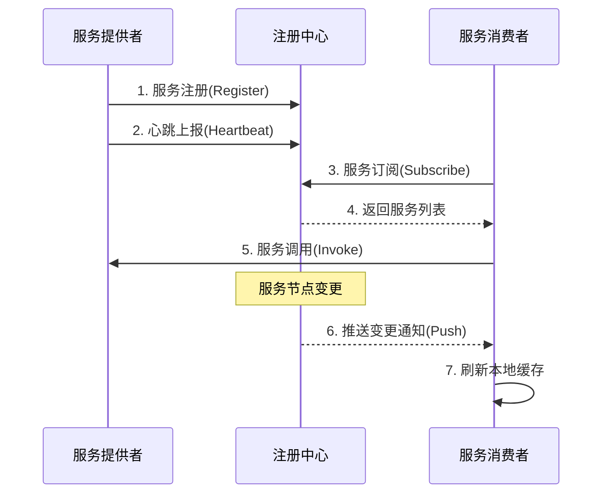

#### 1.2 注册中心核心API

注册中心需提供以下核心接口：

| 接口类型 | 接口名称 | 调用方 | 功能描述 |
|---------|---------|--------|---------|
| 服务管理 | 服务注册接口 | 服务提供者 | 注册服务实例元数据（IP、端口、权重、元数据标签等） |
| 服务管理 | 服务反注册接口 | 服务提供者 | 主动注销服务实例 |
| 健康检测 | 心跳上报接口 | 服务提供者 | 周期性上报存活状态 |
| 服务发现 | 服务订阅接口 | 服务消费者 | 订阅服务并获取实例列表 |
| 服务发现 | 服务变更查询接口 | 服务消费者 | 主动拉取最新服务实例列表 |
| 运维管理 | 服务查询接口 | 运维平台 | 查询已注册服务信息 |
| 运维管理 | 服务修改接口 | 运维平台 | 修改服务元数据或配置 |

#### 1.3 注册中心工作流程

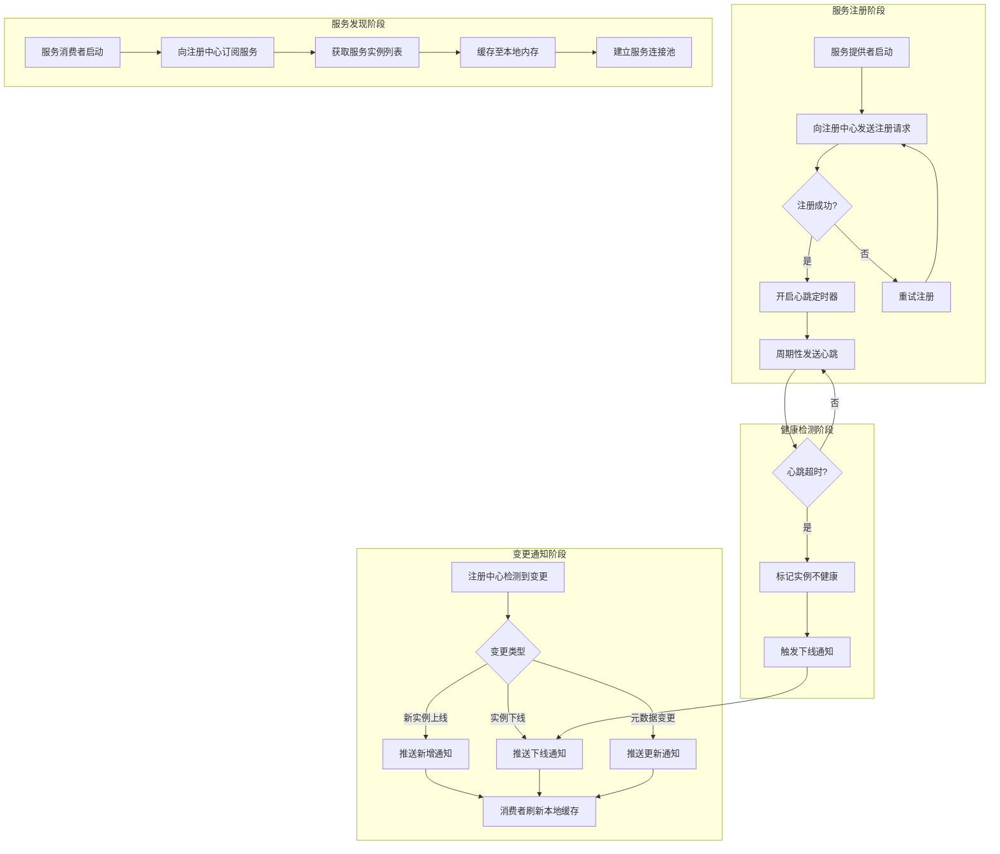

### 二、注册中心架构演进

#### 2.1 技术演进时间线

| 时间阶段 | 主流技术 | 架构特征 | 典型应用场景 |
|---------|---------|---------|-------------|
| 2010-2014 | ZooKeeper | CP强一致性、临时节点、Watcher机制 | Hadoop生态、早期Dubbo |
| 2015-2017 | etcd 2.x/3.x | Raft协议、KV存储、HTTP API | Kubernetes 1.0+、CoreOS生态 |
| 2016-2018 | Consul 1.x | HTTP API、DNS接口、Raft协议 | HashiCorp生态、多语言支持 |
| 2018-2020 | Nacos 1.x | AP/CP可切换、HTTP长轮询、配置中心集成 | Spring Cloud Alibaba |
| 2021-2024 | Nacos 2.x | gRPC长连接、连接复用、性能优化 | 云原生微服务 |
| 2022-2024 | Kubernetes原生 | Service/EndpointSlice、CoreDNS、Headless Service | K8s原生应用 |
| 2024-2026 | Service Mesh集成 | XDS协议、MCP-over-XDS、多集群服务发现 | Istio/Nacos集成、多集群架构 |

#### 2.2 ZooKeeper在服务发现领域的衰退分析

ZooKeeper作为Apache顶级项目，最初设计目标为分布式协调服务，而非专用注册中心。其在服务发现领域逐渐衰退的原因包括：

**架构层面**：
- **CP优先设计**：ZooKeeper基于ZAB协议实现强一致性，在网络分区时优先保证一致性而非可用性。对于服务发现场景，可用性往往比强一致性更为关键——短暂的数据不一致可通过客户端重试机制容忍，但注册中心不可用将导致整个服务调用链路中断。
- **临时节点机制局限**：ZooKeeper通过临时节点（Ephemeral Node）实现服务实例生命周期管理，当Session超时时节点自动删除。然而Session超时检测依赖于TCP长连接，在网络抖动场景下易产生"惊群效应"（Herd Effect），大量服务实例同时被剔除。

**性能层面**：
- **写性能瓶颈**：ZooKeeper写操作需经过Leader节点，并通过ZAB协议同步至多数Follower，写入吞吐量受限于单节点性能。
- **连接数限制**：ZooKeeper对连接数有硬性限制，大规模微服务场景下需部署大量Observer节点分担读压力。

**运维层面**：
- **JVM依赖**：ZooKeeper运行于JVM，内存管理与GC调优增加运维复杂度。
- **缺乏原生服务发现API**：需自行封装服务注册、发现、健康检测等逻辑，开发成本较高。

### 三、Nacos 2.4+ 架构深度解析

#### 3.1 整体架构

Nacos 2.4+ 采用分层架构设计，核心组件包括：

```
┌─────────────────────────────────────────────────────────────┐
│                      客户端层 (Client SDK)                    │
│   Java SDK / Go SDK / Node.js SDK / Python SDK / C++ SDK   │
├─────────────────────────────────────────────────────────────┤
│                      通信层 (gRPC)                           │
│         gRPC Stream (长连接) / gRPC Unary (短连接)           │
├─────────────────────────────────────────────────────────────┤
│                      核心服务层                              │
│  ┌─────────────┐  ┌─────────────┐  ┌─────────────┐         │
│  │ 注册中心模块 │  │ 配置中心模块 │  │ 命名服务模块 │         │
│  └─────────────┘  └─────────────┘  └─────────────┘         │
├─────────────────────────────────────────────────────────────┤
│                      一致性协议层                            │
│  ┌─────────────────────┐  ┌─────────────────────┐          │
│  │ Distro协议 (AP模式) │  │ Raft协议 (CP模式)   │          │
│  └─────────────────────┘  └─────────────────────┘          │
├─────────────────────────────────────────────────────────────┤
│                      存储层                                  │
│  ┌─────────────────────────────────────────────────────┐   │
│  │ 内存存储 + 持久化存储 (MySQL/PostgreSQL/Derby)       │   │
│  └─────────────────────────────────────────────────────┘   │
└─────────────────────────────────────────────────────────────┘
```

#### 3.2 gRPC通信机制

Nacos 2.x 相较于1.x的核心改进在于通信协议从HTTP长轮询升级为gRPC长连接：

**HTTP长轮询（Nacos 1.x）**：
- 客户端发起HTTP请求，服务端持有请求30秒（默认），期间若有变更立即返回
- 每次请求需重新建立TCP连接、解析HTTP头部
- 连接数与订阅服务数成正比，资源消耗较高

**gRPC长连接（Nacos 2.x）**：
- 基于HTTP/2实现多路复用，单连接承载多个服务订阅请求
- 双向流（Bidirectional Stream）支持服务端主动推送
- 连接建立后保持长连接，心跳开销极低
- Protobuf二进制序列化，网络传输效率显著提升（约40%，示意数值，非实测）

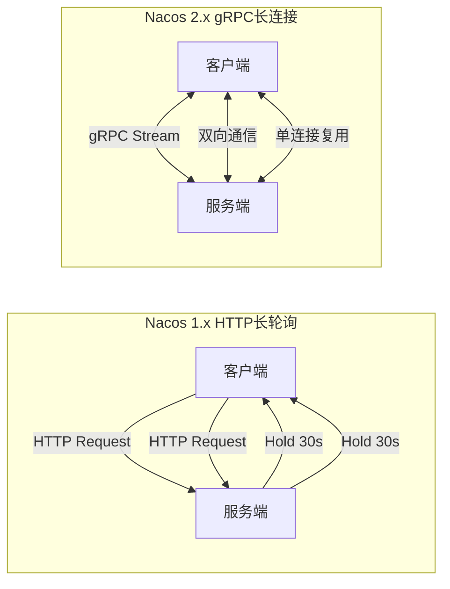

#### 3.3 AP/CP双模式支持

Nacos支持在AP（Availability + Partition Tolerance）与CP（Consistency + Partition Tolerance）模式间动态切换：

**AP模式（Distro协议）**：
- 适用场景：服务发现，优先保证可用性
- 数据模型：每个节点负责部分数据分片，节点间异步同步
- 一致性保证：最终一致性，写入立即返回，后台异步复制
- 网络分区处理：各分区独立提供服务，恢复后自动合并数据

**CP模式（Raft协议）**：
- 适用场景：配置管理、服务元数据持久化
- 数据模型：Leader-Follower架构，写入需多数节点确认
- 一致性保证：强一致性，线性一致性读
- 网络分区处理：少数分区不可写入，保证数据不分裂

Nacos 并不提供全局的 AP/CP 切换开关：实例注册时由 `ephemeral` 属性决定一致性协议——临时实例（ephemeral=true）由 Distro 协议（AP）维护，持久实例（ephemeral=false）由 JRaft 协议（CP）维护。

#### 3.4 MCP-over-XDS协议支持

Nacos 2.4+ 支持MCP-over-XDS协议，实现与Istio等Service Mesh控制平面的集成：

**XDS协议族**：
- **LDS（Listener Discovery Service）**：监听器配置发现
- **RDS（Route Discovery Service）**：路由规则发现
- **CDS（Cluster Discovery Service）**：集群配置发现
- **EDS（Endpoint Discovery Service）**：端点（服务实例）发现

**MCP（Mesh Configuration Protocol）**：
- Istio早期版本使用的配置分发协议
- Nacos作为MCP Server，向Istio Galley组件推送服务发现数据
- Nacos 2.4+ 支持直接作为XDS Server，与Envoy Sidecar通信

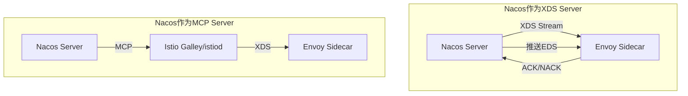

### 四、Consul 1.18+ 架构深度解析

#### 4.1 整体架构

Consul 1.18+ 采用多数据中心原生设计，核心组件包括：

```
┌─────────────────────────────────────────────────────────────┐
│                      Consul Agent                            │
│  ┌─────────────────────────────────────────────────────┐   │
│  │                    Client Agent                      │   │
│  │  ┌─────────┐ ┌─────────┐ ┌─────────┐ ┌─────────┐   │   │
│  │  │服务注册 │ │健康检查 │ │DNS接口  │ │HTTP API │   │   │
│  │  └─────────┘ └─────────┘ └─────────┘ └─────────┘   │   │
│  └─────────────────────────────────────────────────────┘   │
│  ┌─────────────────────────────────────────────────────┐   │
│  │                   Server Agent                       │   │
│  │  ┌─────────┐ ┌─────────┐ ┌─────────┐ ┌─────────┐   │   │
│  │  │Raft存储 │ │日志复制 │ │领导选举 │ │WAN Gossip│   │   │
│  │  └─────────┘ └─────────┘ └─────────┘ └─────────┘   │   │
│  └─────────────────────────────────────────────────────┘   │
├─────────────────────────────────────────────────────────────┤
│                      Gossip协议层                            │
│  ┌─────────────────────┐  ┌─────────────────────┐          │
│  │ LAN Gossip (数据中心内)│  │ WAN Gossip (数据中心间)│          │
│  └─────────────────────┘  └─────────────────────┘          │
├─────────────────────────────────────────────────────────────┤
│                      Service Mesh层                          │
│  ┌─────────────────────────────────────────────────────┐   │
│  │ Consul Connect (Sidecar Proxy / Native Integration) │   │
│  └─────────────────────────────────────────────────────┘   │
└─────────────────────────────────────────────────────────────┘
```

#### 4.2 Service Mesh集成（Consul Connect）

Consul Connect是Consul内置的Service Mesh解决方案：

**核心特性**：
- **自动Sidecar注入**：支持Kubernetes环境下自动注入Envoy Sidecar
- **服务间mTLS**：自动为服务间通信配置双向TLS认证与加密
- **意图（Intention）管理**：基于服务名的访问控制策略
- **透明代理**：无需修改应用代码，通过iptables重定向流量

**架构模式**：

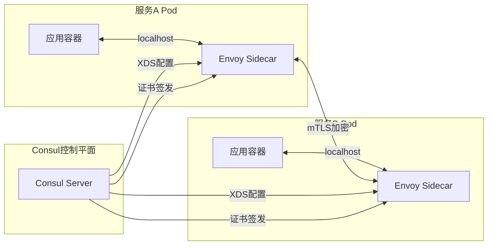

#### 4.3 WAN Federation（广域网联邦）

Consul原生支持多数据中心联邦，通过WAN Gossip协议实现跨数据中心通信：

**架构设计**：
- 每个数据中心运行独立的Consul Server集群（通常3-5节点）
- 各数据中心的Server通过WAN Gossip协议互联
- 跨数据中心服务发现通过RPC查询远程数据中心

**联邦模式**：
- **Mesh Gateway模式**：跨数据中心流量通过Mesh Gateway转发，实现网络隔离
- **直接连接模式**：数据中心间直接建立RPC连接，适用于网络互通场景

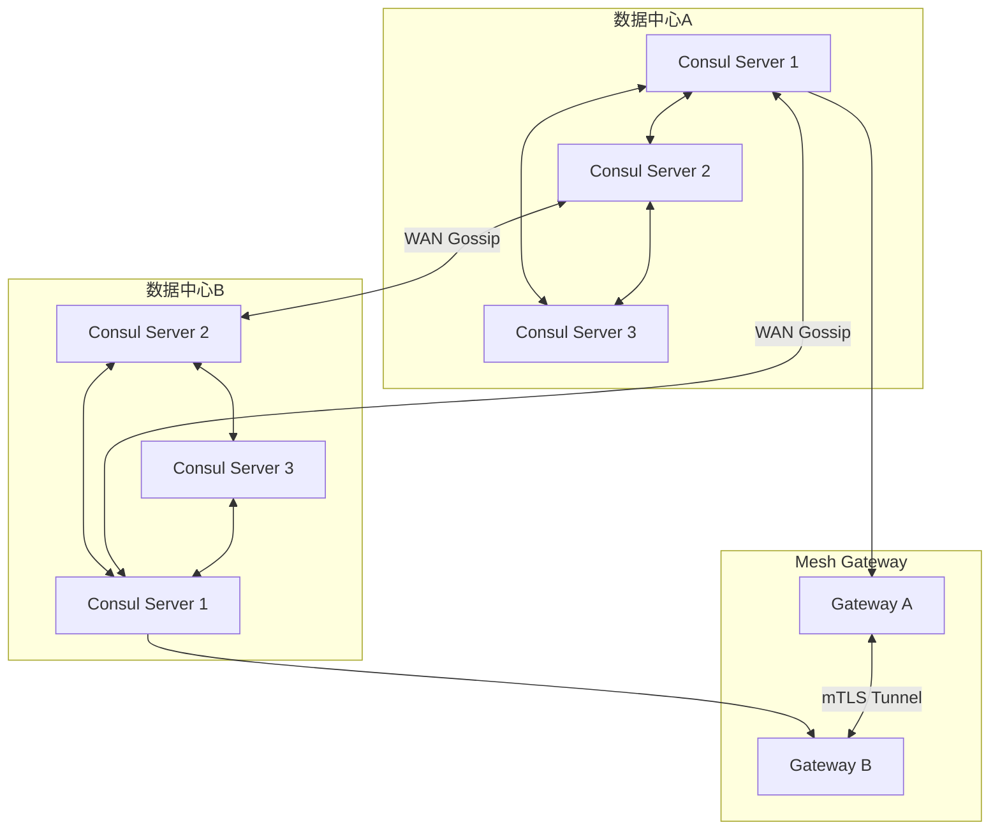

### 五、Kubernetes原生服务发现

#### 5.1 Service资源模型

Kubernetes通过Service资源实现服务发现，核心类型包括：

| Service类型 | ClusterIP | 用途 | DNS记录 |
|------------|-----------|------|---------|
| ClusterIP | 虚拟IP（默认） | 集群内部服务访问 | `<service-name>.<namespace>.svc.cluster.local` |
| NodePort | 虚拟IP + 节点端口 | 集群外部通过节点端口访问 | 同上 |
| LoadBalancer | 虚拟IP + 节点端口 + 外部LB | 云环境负载均衡器集成 | 同上 |
| Headless | None | 直接访问Pod IP，适用于StatefulSet | `<pod-name>.<service-name>.<namespace>.svc.cluster.local` |

#### 5.2 EndpointSlice机制

Kubernetes 1.21+ 将EndpointSlice作为稳定特性，替代传统Endpoints资源：

**Endpoints局限**：
- 单资源存储所有端点，大小受etcd单对象1MB限制
- 端点变更时整个对象更新，无法增量同步
- 大规模服务（如10000+ Pod）场景下性能瓶颈明显

**EndpointSlice改进**：
- 将端点分片存储，每个EndpointSlice默认存储100个端点
- 支持增量更新，减少网络传输与etcd写入压力
- 支持多地址族（IPv4/IPv6）与多端口映射

```yaml
apiVersion: discovery.k8s.io/v1
kind: EndpointSlice
metadata:
  name: my-service-abc123
  labels:
    kubernetes.io/service-name: my-service
addressType: IPv4
endpoints:
  - addresses: ["10.244.1.5"]
    conditions:
      ready: true
    nodeName: node-1
    zone: zone-a
  - addresses: ["10.244.2.8"]
    conditions:
      ready: true
    nodeName: node-2
    zone: zone-b
ports:
  - name: http
    port: 8080
    protocol: TCP
```

#### 5.3 Headless Service与StatefulSet

Headless Service（ClusterIP: None）适用于有状态应用：

**特性**：
- 不分配虚拟ClusterIP，DNS查询直接返回Pod IP列表
- 配合StatefulSet，每个Pod获得稳定的DNS名称
- 支持稳定的网络标识与持久化存储绑定

**DNS解析规则**：
- 服务域名查询：返回所有Ready Pod的A记录
- Pod域名查询：返回单个Pod的A记录

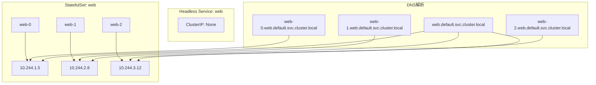

#### 5.4 CoreDNS与服务发现

CoreDNS作为Kubernetes集群DNS服务器，提供服务发现核心能力：

**CoreDNS配置示例**：

```yaml
apiVersion: coredns.k8s.io/v1
kind: Corefile
metadata:
  name: coredns
data:
  Corefile: |
    .:53 {
        errors
        health
        ready
        kubernetes cluster.local in-addr.arpa ip6.arpa {
            pods insecure
            fallthrough in-addr.arpa ip6.arpa
            ttl 30
        }
        prometheus :9153
        forward . /etc/resolv.conf
        cache 30
        loop
        reload
        loadbalance
    }
```

**服务发现流程**：

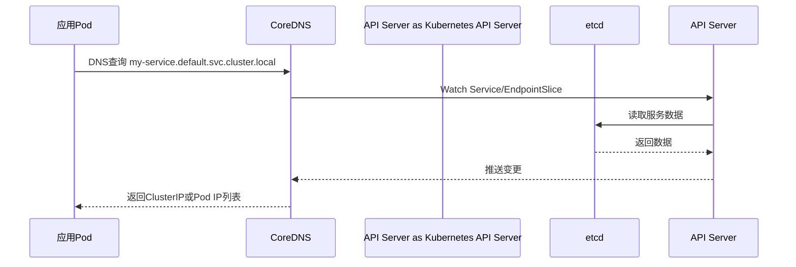

### 六、etcd 3.5+ 作为Kubernetes核心存储

#### 6.1 etcd在Kubernetes中的角色

etcd作为Kubernetes集群的唯一状态存储，承载以下数据：

- **集群状态数据**：Node、Namespace、ConfigMap、Secret等
- **服务发现数据**：Service、EndpointSlice、Ingress等
- **工作负载数据**：Pod、Deployment、StatefulSet、DaemonSet等
- **RBAC数据**：Role、RoleBinding、ClusterRole、ClusterRoleBinding等

#### 6.2 etcd 3.5+ 核心特性

| 特性 | 描述 | 性能影响 |
|-----|------|---------|
| MVCC多版本并发控制 | 支持历史版本查询与事务隔离 | 读性能提升，存储空间增加 |
| Raft协议优化 | Leader选举与日志复制性能优化 | 写吞吐量提升约30% |
| 租约（Lease）机制 | 支持TTL自动过期，减少主动删除 | 降低CPU与网络开销 |
| 事务（Transaction） | 原子性比较-设置操作 | 保证数据一致性 |
| 压缩（Compaction） | 定期清理历史版本 | 控制存储空间增长 |
| 增量快照 | 支持增量备份与恢复 | 减少备份时间与存储 |

#### 6.3 etcd架构与Kubernetes集成

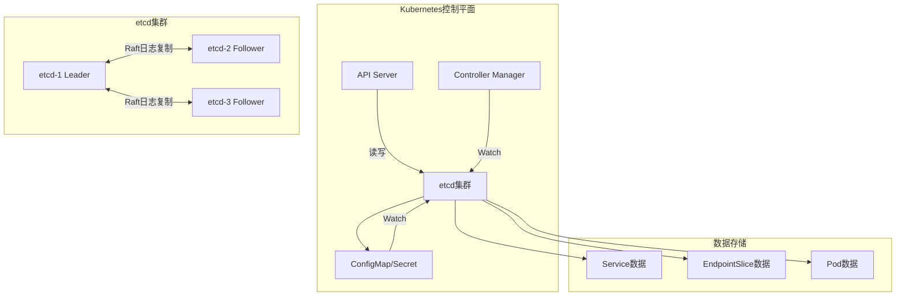

### 七、服务发现模式对比

#### 7.1 客户端发现 vs 服务端发现

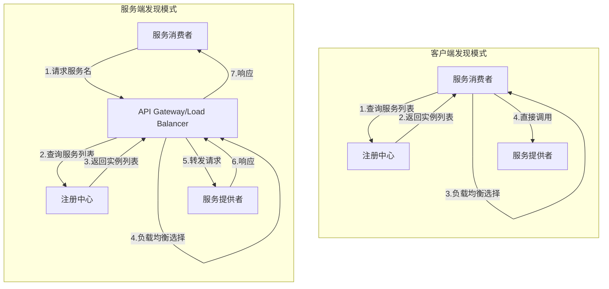

#### 7.2 模式对比分析

| 对比维度 | 客户端发现 | 服务端发现 |
|---------|-----------|-----------|
| 架构复杂度 | 较低，无中间层 | 较高，需部署网关/负载均衡器 |
| 客户端依赖 | 需集成服务发现SDK | 无需SDK，标准HTTP/gRPC调用 |
| 负载均衡位置 | 客户端 | 网关/负载均衡器 |
| 网络跳数 | 1跳（消费者→提供者） | 2跳（消费者→网关→提供者） |
| 故障域隔离 | 客户端故障不影响其他消费者 | 网关故障影响所有消费者 |
| 多语言支持 | 需各语言SDK | 语言无关 |
| 典型实现 | Nacos SDK、Consul Template、Eureka | Kubernetes Service、API Gateway、Istio Envoy |

#### 7.3 Service Mesh中的服务发现

在Service Mesh架构中，服务发现职责下沉至Sidecar Proxy：

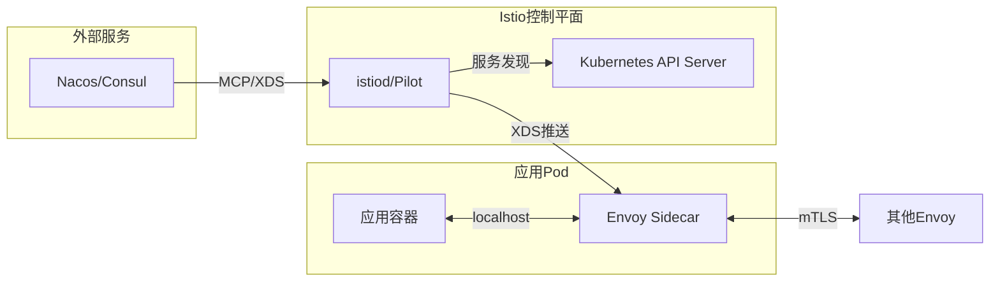

### 八、多集群服务发现

#### 8.1 多集群服务发现挑战

- **网络连通性**：集群间网络可能隔离，需通过网关或VPN打通
- **服务命名冲突**：不同集群可能存在同名服务，需引入集群标识
- **数据同步延迟**：跨集群服务信息同步存在延迟，影响实时性
- **安全策略一致性**：跨集群访问需统一认证授权策略

#### 8.2 主流多集群服务发现方案

| 方案 | 核心机制 | 适用场景 | 成熟度 |
|-----|---------|---------|--------|
| MCS API 规范 | 跨集群服务发现规范（KEP-1645 未进入 Kubernetes 核心，规范库已于 2024-06 归档） | 作为多集群方案的参考契约 | 已归档，由 Submariner/Lighthouse、Cilium 等产品实现 |
| KubeFed | 联邦化资源分发，统一控制平面 | 多集群资源编排 | v2（Kubernetes SIG 项目，已停止维护，后继方案为 Karmada） |
| Lighthouse (Submariner) | ServiceImport/ServiceExport CRD，跨集群DNS | Submariner生态 | Stable |
| Istio Multi-Cluster | 共享控制平面或联邦控制平面 | Service Mesh多集群 | Stable |
| Nacos跨集群同步 | 集群间数据同步，统一命名空间 | Nacos生态 | Stable |

#### 8.3 Kubernetes MCS API架构

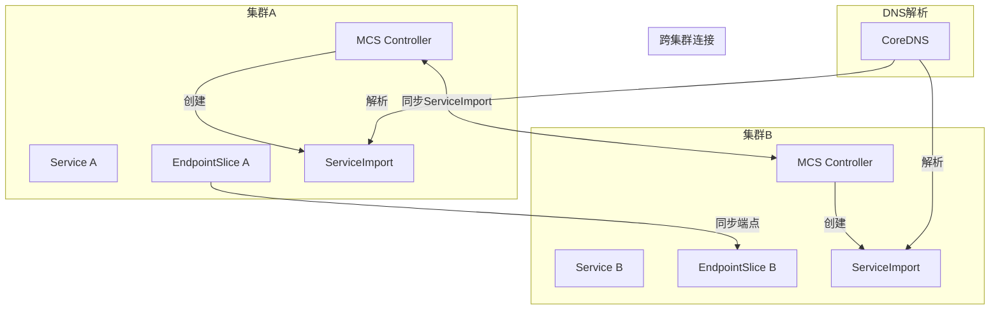

### 九、DNS-based vs Registry-based服务发现

#### 9.1 对比分析

| 对比维度 | DNS-based | Registry-based |
|---------|-----------|----------------|
| 协议标准 | DNS协议（RFC 1035） | 自定义协议（gRPC/HTTP） |
| 客户端支持 | 所有语言原生支持 | 需专用SDK |
| 负载均衡 | DNS轮询（有限） | 客户端/服务端灵活策略 |
| 健康检测 | 依赖DNS TTL，延迟高 | 实时心跳检测 |
| 变更通知 | 无原生推送，依赖轮询 | 支持实时推送 |
| 元数据支持 | 仅IP/端口，扩展性差 | 支持丰富元数据（权重、标签等） |
| 典型实现 | Kubernetes CoreDNS、Consul DNS | Nacos、Eureka、Consul HTTP API |

#### 9.2 混合模式实践

现代微服务架构常采用混合模式：

- **Kubernetes集群内**：DNS-based（CoreDNS）为主，简化应用开发
- **跨命名空间/跨集群**：Registry-based，支持精细路由与流量管理
- **Service Mesh环境**：XDS协议，统一服务发现与流量治理

### 十、注册中心选型对比

| 特性 | Nacos 2.4+ | Consul 1.18+ | etcd 3.5+ | ZooKeeper 3.9+ | K8s原生 |
|-----|-----------|-------------|-----------|----------------|---------|
| **一致性模型** | AP/CP可切换 | CP (Raft) | CP (Raft) | CP (ZAB) | CP (etcd) |
| **通信协议** | gRPC | HTTP/gRPC | gRPC | TCP私有协议 | HTTP/gRPC |
| **服务发现API** | 原生支持 | 原生支持 | 需封装 | 需封装 | 原生支持 |
| **配置管理** | 内置 | 需Consul KV | 需封装 | 需封装 | ConfigMap |
| **健康检测** | 心跳/主动探测 | 心跳/TCP/HTTP/gRPC | 租约机制 | Session超时 | Readiness/Liveness Probe |
| **DNS接口** | 不支持 | 原生支持 | 不支持 | 不支持 | CoreDNS |
| **Service Mesh集成** | XDS/MCP | Consul Connect | 需集成 | 不支持 | Istio原生 |
| **多数据中心** | 集群同步 | WAN Federation | 需自行实现 | 需自行实现 | Multi-Cluster 方案（Istio/Submariner 等） |
| **多语言SDK** | Java/Go/Node/Python/C++ | Go/Java/Python/Node等 | Go/Java/Python等 | Java原生 | 语言无关 |
| **运维复杂度** | 中等 | 中等 | 较高 | 较高 | 低（K8s托管） |
| **适用场景** | Spring Cloud、Dubbo | HashiCorp生态、多语言 | Kubernetes核心存储 | Hadoop生态、遗留系统 | Kubernetes原生应用 |

## 技术演进时间线

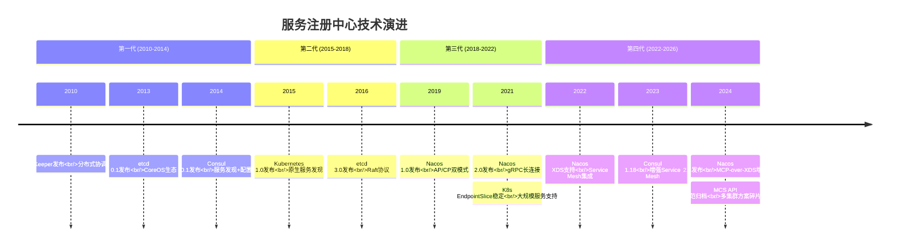

## 架构决策指南

### 选型决策树

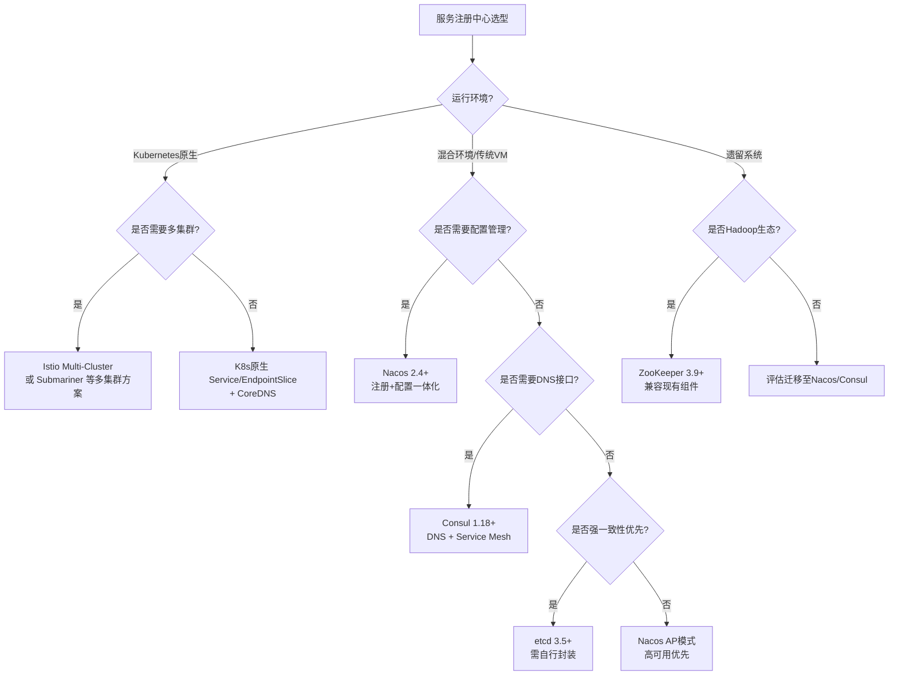

### 关键决策因素

1. **一致性需求**：金融交易等强一致性场景优先CP模式，一般业务场景AP模式更优
2. **运维能力**：Kubernetes环境优先原生方案，降低运维复杂度
3. **多语言支持**：无SDK依赖场景优先DNS接口或Kubernetes原生
4. **Service Mesh规划**：有Service Mesh规划优先Nacos/Consul/Istio
5. **多集群需求**：跨集群场景需评估 Istio Multi-Cluster、Submariner/Lighthouse、Consul Federation 等方案

> **许可提示**：Consul 曾于 2023 年起改为 BUSL 许可，2025 年随 1.22 版本回归 MPL 2.0，选型时需确认所用版本的许可条款。

## 小结

服务注册与发现是微服务架构的核心基础设施，其技术选型直接影响系统的可用性、扩展性与运维效率。从ZooKeeper的CP强一致性设计，到Nacos的AP/CP可切换架构，再到Kubernetes原生的Service/EndpointSlice机制，注册中心技术经历了从通用协调服务到专用服务发现组件的演进。

2025-2026年，服务发现领域呈现以下趋势：

1. **云原生化**：Kubernetes原生服务发现成为云上应用默认选择，EndpointSlice机制解决了大规模服务场景的性能瓶颈
2. **Service Mesh集成**：Nacos、Consul等注册中心通过XDS/MCP协议与Istio等Service Mesh深度集成，实现统一的服务发现与流量治理
3. **多集群方案碎片化**：MCS API 规范已归档，跨集群服务发现主要由 Istio Multi-Cluster、Submariner/Lighthouse、Cilium ClusterMesh 等产品级方案承载
4. **gRPC普及**：gRPC长连接取代HTTP长轮询，显著提升服务发现性能与资源效率

在实际架构决策中，应根据运行环境、一致性需求、运维能力、多语言支持等因素综合评估，选择最适合的技术方案。对于新项目，优先考虑Kubernetes原生方案或Nacos/Consul等现代注册中心；对于遗留系统，应评估迁移成本与收益，制定渐进式演进策略。

---

**思考题**：在Service Mesh架构下，服务发现的职责从应用层下沉至Sidecar Proxy，这对传统注册中心的角色定位有何影响？注册中心是否会逐渐被Kubernetes原生服务发现或Service Mesh控制平面取代？
