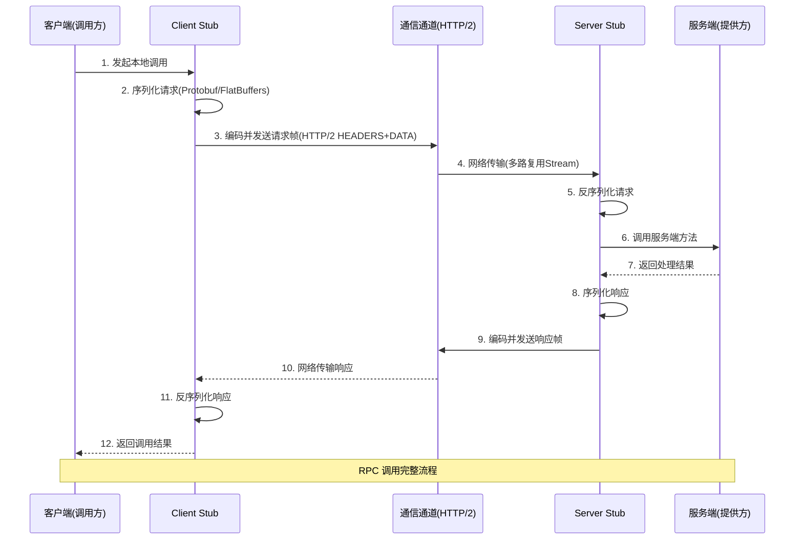
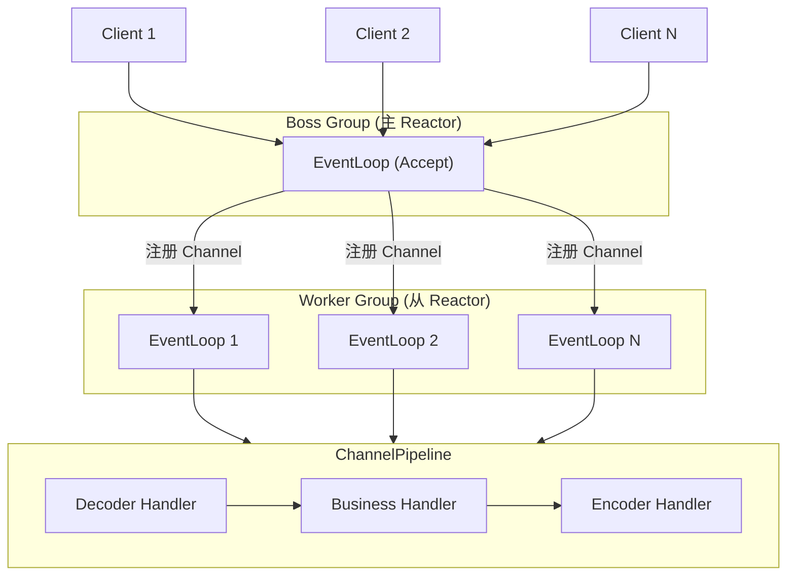

# 如何实现RPC远程服务调用

## 概述

在微服务架构中，服务消费者与服务提供者通常运行于不同物理节点的独立进程内，二者之间的调用无法再依赖进程内方法调用的本地语义，而必须通过网络完成远程方法调用——即 RPC（Remote Procedure Call）。RPC 的核心目标是使远程调用的编程体验尽可能接近本地调用：调用方无需关心底层的网络传输、序列化编解码与连接管理等细节，只需像调用本地方法一样发起请求并获取结果。

完成一次 RPC 调用，必须解决四个核心问题：

1. **网络通信**——客户端与服务端如何建立并管理网络连接？
2. **请求处理模型**——服务端如何高效地处理并发请求？
3. **通信协议**——数据传输采用何种协议与报文格式？
4. **序列化与反序列化**——数据如何高效地编码与解码？

上述四要素构成了 RPC 框架的完整技术栈。下文将以 2025-2026 年主流技术栈为基线，逐一深入剖析。

---

## 一、网络通信：客户端与服务端如何建立连接

### 1.1 从 TCP 到 HTTP/2：通信模型的演进

早期 RPC 框架（如 Dubbo 2.x 的默认协议）直接基于 TCP 长连接实现私有协议通信，而另一类框架（如 Spring Cloud Feign）则基于 HTTP/1.1 短连接。两种方式各有局限：TCP 私有协议缺乏标准化、跨语言支持困难；HTTP/1.1 则存在队头阻塞（Head-of-Line Blocking）、连接开销大等问题。

HTTP/2 的出现从根本上改变了这一局面。HTTP/2 引入了三个关键特性：

- **多路复用（Multiplexing）**：在单一 TCP 连接上并发传输多个请求/响应流（Stream），每个流通过唯一的 Stream ID 标识，彻底消除了 HTTP/1.1 的队头阻塞问题。这意味着客户端无需为每个 RPC 请求建立独立的 TCP 连接，一条连接即可承载所有并发调用。
- **头部压缩（HPACK）**：对 HTTP 头部进行差分编码与哈夫曼压缩，显著减少元数据传输量，对于高频小负载的 RPC 调用效果尤为突出。
- **流式传输（Streaming）**：原生支持双向流，为 gRPC 的四种通信模式提供了协议层基础。

当前主流 RPC 框架已全面转向 HTTP/2：

| 框架 | 传输协议 | HTTP/2 多路复用 |
|------|---------|----------------|
| gRPC 1.71+ | HTTP/2 | 原生支持 |
| Dubbo 3.3 Triple | HTTP/2 | 原生支持 |
| Spring Cloud OpenFeign | HTTP/1.1（可升级 HTTP/2） | 需额外配置 |

### 1.2 HTTP/3 与 QUIC：下一代传输层

HTTP/3 基于 QUIC（Quick UDP Internet Connections）协议，将传输层从 TCP 迁移至 UDP 之上，解决了 HTTP/2 仍存在的 TCP 层队头阻塞问题。QUIC 的核心优势包括：

- **零 RTT 连接建立**：首次连接需 1-RTT，后续重连可降至 0-RTT，极大缩短连接建立延迟。
- **连接迁移**：基于 Connection ID 而非四元组标识连接，网络切换（如 Wi-Fi 切蜂窝）时连接不断。
- **内置 TLS 1.3**：安全性与传输协议一体化，无需额外握手。

截至 2026 年，gRPC 对 HTTP/3 的支持仍处于实验性阶段（需编译时启用 `--enable-http3`），生产环境尚不建议大规模采用，但在弱网、高移动性场景中已展现出显著优势。

### 1.3 gRPC 基于 HTTP/2 的流式通信

gRPC 充分利用了 HTTP/2 的流式特性，将每个 RPC 调用映射为一个 HTTP/2 Stream，通过 Stream ID 实现多路复用。请求与响应的元数据封装在 HEADERS 帧中，业务载荷封装在 DATA 帧中，二者在不同帧类型中传输，互不干扰。

gRPC 在 HTTP/2 帧之上定义了轻量级的 gRPC 帧格式：每个 DATA 帧前缀 5 字节（1 字节 Compressed-Flag + 4 字节 Message-Length），结构极简，解析开销极低。

### 1.4 连接管理与可靠性保障

网络通信不可避免地面临连接失效问题，现代 RPC 框架通常提供以下保障机制：

- **健康检查（Health Checking）**：gRPC 定义了标准 Health Checking Protocol（`grpc.health.v1.Health`），客户端定期探测服务端健康状态，实现优雅的负载均衡与故障摘除。
- **Keep-Alive 机制**：gRPC 的 Keep-Alive 通过 HTTP/2 PING 帧实现，可配置探测间隔、超时时间与无响应时的处理策略（如关闭连接）。
- **自动重连与退避**：连接断开后，客户端采用指数退避（Exponential Backoff）策略重新建立连接，避免瞬间重连风暴。
- **连接池化**：客户端维护到同一服务端的连接池，复用已有连接，减少 TCP 握手开销。gRPC 的 Channel 本身即管理底层连接池。

---

## 二、请求处理模型：服务端如何高效处理请求

### 2.1 经典模型回顾：BIO、NIO、AIO

| 模型 | 全称 | 特点 | 适用场景 |
|------|------|------|---------|
| BIO | Blocking I/O | 一连接一线程，同步阻塞 | 低并发、简单场景 |
| NIO | Non-blocking I/O | I/O 多路复用（select/poll/epoll），单线程处理多连接 | 高并发、轻计算 |
| AIO | Asynchronous I/O | 内核完成 I/O 后回调通知，真正的异步 | 高并发、重 I/O（Linux 支持有限） |

在 Linux 生产环境中，AIO 的实际表现并不理想（`io_uring` 尚未在 Java 生态普及），NIO + epoll 仍然是主流选择。

### 2.2 Reactor 模式：Netty 的事件驱动架构

Netty 采用 Reactor 模式实现高性能网络 I/O，其核心架构为 **主从 Reactor 多线程模型**：

- **Boss Group**（主 Reactor）：负责接受客户端连接（`OP_ACCEPT`），将已建立的 Channel 注册到 Worker Group。
- **Worker Group**（从 Reactor）：负责处理已建立连接的 I/O 读写（`OP_READ`/`OP_WRITE`），每个 EventLoop 线程管理多个 Channel。
- **Pipeline 与 Handler**：I/O 事件沿 ChannelPipeline 流经一系列 ChannelHandler，实现编解码、业务处理等逻辑的链式组装。

Netty 的 Reactor 模式避免了为每个连接分配独立线程的开销，单个 EventLoop 线程可处理数百个连接的 I/O 事件，线程切换与内存占用大幅降低。gRPC Java、Dubbo 3.3 Triple 的底层通信均基于 Netty 实现。

### 2.3 Virtual Threads（Java 21+）：线程模型的范式转变

Java 21 引入的 Virtual Threads（虚拟线程，Project Loom）为 RPC 服务端提供了全新的并发模型。传统平台线程与操作系统线程 1:1 映射，而虚拟线程是 JVM 管理的轻量级线程，由 ForkJoinPool 调度，创建成本接近于零。

Virtual Threads 对 RPC 框架的影响：

- **简化编程模型**：开发者可以继续使用同步阻塞式代码编写 RPC 服务端逻辑，而无需切换到异步回调或 Reactive 编程范式。当 I/O 操作阻塞时，虚拟线程自动卸载（unmount），释放载体线程（carrier thread）执行其他任务。
- **显著提升吞吐**：在 I/O 密集型场景下，Virtual Threads 可创建百万级并发线程，吞吐量远超线程池 + NIO 的组合。
- **与 Netty 的关系**：Virtual Threads 并不替代 Netty 的 Reactor 模型，二者互补——Netty 负责网络 I/O 的事件驱动处理，Virtual Threads 则在业务逻辑层提供简洁的同步编程体验。Dubbo 3.3 已支持 Virtual Threads，可在业务线程池中启用。

### 2.4 Kotlin Coroutines 与 Go Goroutines

- **Kotlin Coroutines**：在 JVM 生态中，Kotlin 协程为 gRPC Java 提供了更优雅的异步编程体验。gRPC Kotlin 基于 `kotlinx.coroutines` 的 `Deferred` 和 `Flow` 封装了异步 Stub，使流式 RPC 调用可以像操作序列集合一样自然。
- **Go Goroutines**：gRPC Go 的每个 RPC 调用天然运行在独立的 Goroutine 中，协程调度由 Go 运行时管理，开发者无需关心线程池配置，编程模型极为简洁。

### 2.5 各模型选型对比

| 处理模型 | 编程复杂度 | 吞吐能力 | 典型框架 |
|---------|----------|---------|---------|
| BIO + 线程池 | 低 | 低 | 早期 Servlet |
| NIO + Reactor（Netty） | 中 | 高 | gRPC、Dubbo |
| NIO + Reactive（Reactor Netty） | 高 | 极高 | Spring WebFlux |
| Virtual Threads + NIO | 低 | 高 | Dubbo 3.3（实验性） |
| Goroutines | 低 | 高 | gRPC Go |
| Kotlin Coroutines | 中 | 高 | gRPC Kotlin |

---

## 三、通信协议：数据传输采用什么协议

### 3.1 协议设计的基本原则

无论采用何种通信协议，核心任务都是定义客户端与服务端之间的"契约"。一个完备的协议规范通常包含：

- **消息头（Header）**：存放公共元数据，如请求 ID、序列化类型、压缩标志、超时时间、服务标识等。
- **消息体（Body）**：存放经序列化编码后的业务数据。
- **帧格式（Frame Format）**：定义消息在传输层上的分帧规则，如长度前缀（Length-Prefixed Framing）。

### 3.2 gRPC 协议：基于 HTTP/2 的标准化 RPC 协议

gRPC 协议严格定义于 HTTP/2 之上，其协议规范具有高度的标准化与跨语言一致性：

- **请求路径**：`/{package}.{service}/{method}`，作为 HTTP/2 的伪头部 `:path`。
- **请求头**：包含 `content-type: application/grpc`、`te: trailers`、`grpc-encoding`（压缩算法）、`grpc-timeout`（超时）等。
- **消息帧**：5 字节前缀（1 字节压缩标志 + 4 字节消息长度）+ 压缩/未压缩的消息体。
- **尾部帧（Trailers）**：在 HTTP/2 HEADERS 帧中携带 gRPC 状态码（`grpc-status`）与状态信息（`grpc-message`），这是 gRPC 利用 HTTP/2 Trailers 机制实现的错误传播方案。

gRPC 协议的优势在于完全基于 HTTP/2 标准，天然穿透代理、负载均衡器与防火墙，且支持 HTTP/2 的流控机制。

### 3.3 Dubbo 3.3 Triple 协议：HTTP/2 + gRPC 兼容

Dubbo 3.x 引入的 Triple 协议是其迈向云原生的重要一步。Triple 协议基于 HTTP/2 构建，设计上与 gRPC 协议完全兼容：

- **gRPC 互操作**：Triple 协议的报文格式与 gRPC 完全一致，Dubbo Triple Client 可以直接调用标准 gRPC Server，反之亦然。这意味着 Dubbo 生态可以无缝接入 gRPC 多语言客户端。
- **同时支持 Protobuf 与非 Protobuf 序列化**：Triple 协议在 gRPC 协议基础上扩展了对 Hessian2、JSON 等序列化格式的支持，降低了从 Dubbo 2.x 迁移的成本。
- **流式通信**：Triple 协议完整支持 Unary、Server Streaming、Client Streaming、Bidirectional Streaming 四种通信模式。
- **应用级服务发现**：Dubbo 3.x 从接口级服务发现演进为应用级服务发现，与 Kubernetes Service、Nacos 等注册中心的应用级模型对齐，减少注册中心压力，提升可扩展性。

### 3.4 WebSocket 与 RSocket

- **WebSocket**：基于 HTTP 升级机制的全双工通信协议，适用于浏览器端 RPC 场景（如 gRPC-Web）。gRPC-Web 通过 Envoy 代理或 gRPC-Web Gateway 将浏览器的 HTTP/1.1 请求转换为 gRPC 的 HTTP/2 请求，实现浏览器到 gRPC Server 的通信。
- **RSocket**：面向响应式流的二进制协议，运行于 TCP/WebSocket 之上，提供四种交互模式（Fire-and-Forget、Request-Response、Request-Stream、Channel），内置背压（Backpressure）与取消（Cancel）机制。RSocket 与 Reactor 深度集成，是 Java 响应式 RPC 的备选方案，但社区生态相比 gRPC 仍有差距。

### 3.5 私有协议 vs 标准协议

| 维度 | 私有协议（如 Dubbo 协议） | 标准协议（如 gRPC 协议） |
|------|-------------------------|------------------------|
| 跨语言支持 | 差（需各语言 SDK） | 优（Protobuf 多语言代码生成） |
| 穿透性 | 差（需专用代理） | 优（基于 HTTP/2，标准代理可识别） |
| 性能 | 略优（报文开销更小） | 优（HPACK 压缩 + 多路复用补偿） |
| 生态集成 | 框架绑定 | Service Mesh 友好 |
| 调试便利性 | 差（需专用工具） | 优（HTTP/2 工具链成熟） |

在云原生时代，基于 HTTP/2 的标准协议已成为主流选择，私有协议逐步退出。

---

## 四、序列化与反序列化：数据如何高效编解码

### 4.1 序列化框架选型的关键维度

| 维度 | 说明 |
|------|------|
| 压缩比 | 序列化后的字节流大小，直接影响网络传输耗时与存储成本 |
| 序列化/反序列化速度 | CPU 开销，对高 QPS 场景至关重要 |
| 跨语言支持 | 是否提供多语言 SDK，决定 RPC 框架的跨语言能力 |
| Schema 演进 | 是否支持字段增删的向前/向后兼容 |
| 零拷贝支持 | 是否支持直接从内存映射读取数据，避免反序列化开销 |

### 4.2 Protocol Buffers 3.25+

Protocol Buffers（Protobuf）是 gRPC 的默认序列化方案，也是当前 RPC 领域应用最广泛的二进制序列化框架。Protobuf 3.25+ 的关键特性包括：

- **编码高效**：采用 Varint 编码与 Tag-Length-Value（TLV）结构，压缩比远优于 JSON（通常小 3-10 倍）。
- **Schema 驱动**：通过 `.proto` 文件定义数据结构，自动生成多语言代码，天然保证类型安全。
- **Schema 演进**：支持字段的增删与编号复用规则，保证向前/向后兼容。
- **Editions 机制**：Protobuf Editions（首个 Edition 2023，2024 年随 protobuf v27 发布）替代了 proto2/proto3 的语法版本划分，允许更细粒度地控制字段行为（如 `field_presence`、`encoding`），提升了灵活性与可演进性。

### 4.3 FlatBuffers 与 Cap'n Proto：零拷贝序列化

传统序列化框架（包括 Protobuf）在反序列化时需要将字节流解析为内存中的对象图，这一过程存在额外的 CPU 开销与内存分配。FlatBuffers 和 Cap'n Proto 采用零拷贝（Zero-Copy）设计，序列化后的数据可以直接在内存中访问，无需解析步骤。

- **FlatBuffers**：由 Google 开源，序列化后的数据布局与内存结构一一对应，读取时直接按偏移量访问字段，无需构建对象树。适用于游戏、实时渲染等对延迟极其敏感的场景。FlatBuffers 也支持 gRPC（通过 `grpc` codegen 选项），但社区支持与工具链成熟度不及 Protobuf。
- **Cap'n Proto**：由 Sandstorm 开源，设计理念与 FlatBuffers 类似，但提供了更完善的 RPC 框架（Cap'n Proto RPC）和 Schema 演进机制。其序列化速度理论上比 Protobuf 快数个数量级（因为无需解析），但在跨语言生态上相对薄弱。

### 4.4 Avro、JSON 与 MessagePack

- **Avro**：Apache Avro 采用 Schema 动态解析机制，序列化数据中不包含字段标签，压缩比优于 Protobuf。Avro 的 Schema 演进能力强大，支持字段别名与默认值，在大数据生态（Hadoop、Kafka、Flink）中广泛使用，但在 RPC 领域应用较少。
- **JSON**：可读性最佳，调试便利，但压缩比差、解析速度慢，适用于对外 API 网关、跨组织集成等场景。
- **MessagePack**：JSON 的二进制化替代方案，保持 JSON 的数据模型与动态类型特性，但编码效率更高。适用于需要 JSON 灵活性但又对性能有一定要求的场景。

### 4.5 序列化框架对比

| 框架 | 压缩比 | 速度 | 跨语言 | Schema 演进 | 零拷贝 | 典型场景 |
|------|--------|------|--------|------------|--------|---------|
| Protobuf 3.25+ | 优 | 优 | 优（12+ 语言） | 优 | 否 | gRPC、Dubbo Triple |
| FlatBuffers | 中 | 极优 | 优（C++/Java/Go/...） | 良 | 是 | 游戏、实时系统 |
| Cap'n Proto | 中 | 极优 | 中（C++/Java/Go/Python） | 优 | 是 | 极低延迟场景 |
| Avro | 优 | 良 | 优 | 优 | 否 | 大数据管道 |
| JSON | 差 | 差 | 优（通用） | N/A | 否 | 对外 API |
| MessagePack | 中 | 中 | 优 | N/A | 否 | JSON 替代 |
| Hessian2 | 中 | 中 | 中 | 良 | 否 | Dubbo 2.x 兼容 |

---

## 五、gRPC 完整架构解析

### 5.1 核心组件

gRPC 的架构由以下核心组件构成：

- **Stub（存根）**：由 Protobuf 编译器（`protoc` + gRPC 插件）根据 `.proto` 文件自动生成，包含客户端 Stub 与服务端 Skeleton。客户端 Stub 封装了序列化、网络发送与响应接收逻辑；服务端 Skeleton 封装了请求接收、反序列化与服务方法分发逻辑。
- **Channel（通道）**：客户端与服务端之间的虚拟连接抽象，底层管理 HTTP/2 连接池。Channel 是线程安全的，多个 Stub 可共享同一 Channel。Channel 负责连接建立、负载均衡、健康检查与连接状态管理。
- **Call（调用）**：一次具体的 RPC 调用实例，对应一个 HTTP/2 Stream。Call 管理单次请求的完整生命周期：发送请求元数据、发送消息、接收消息、接收尾部状态。
- **Interceptor（拦截器）**：gRPC 的横切关注点机制，分为客户端拦截器（ClientInterceptor）与服务端拦截器（ServerInterceptor）。拦截器可以在 RPC 调用的前后插入自定义逻辑，如认证鉴权、日志追踪、指标采集、限流熔断等。

### 5.2 gRPC 四种通信模式

```mermaid
flowchart TB
    subgraph Unary["Unary RPC（一元调用）"]
        U1["Client 发送请求"] --> U2["Server 返回响应"]
    end

    subgraph ServerStream["Server Streaming RPC（服务端流）"]
        SS1["Client 发送请求"] --> SS2["Server 返回流式响应 1"]
        SS2 --> SS3["Server 返回流式响应 2"]
        SS3 --> SS4["Server 返回流式响应 N"]
    end

    subgraph ClientStream["Client Streaming RPC（客户端流）"]
        CS1["Client 发送流式请求 1"] --> CS2["Client 发送流式请求 2"]
        CS2 --> CS3["Client 发送流式请求 N"]
        CS3 --> CS4["Server 返回聚合响应"]
    end

    subgraph BidiStream["Bidirectional Streaming RPC（双向流）"]
        BS1["Client ⇄ Server 双向流式通信"]
        BS2["任意端可独立发送消息"]
        BS3["任意端可独立关闭发送"]
        BS1 --> BS2 --> BS3
    end
```

| 模式 | 请求 | 响应 | 典型场景 |
|------|------|------|---------|
| Unary | 单个请求 | 单个响应 | 标准 CRUD 操作、查询 |
| Server Streaming | 单个请求 | 流式响应 | 实时日志推送、大结果集分页、股票行情 |
| Client Streaming | 流式请求 | 单个响应 | 文件分片上传、批量数据聚合 |
| Bidirectional Streaming | 流式请求 | 流式响应 | 聊天系统、实时协作、双向心跳探测 |

### 5.3 gRPC 与 xDS 集成

xDS 是 Envoy 代理定义的一套动态配置发现协议族（LDS、RDS、CDS、EDS 等），已成为 Service Mesh 数据面配置的事实标准。gRPC 原生支持 xDS 协议，实现了 **Proxyless Service Mesh** 模式：

- **传统 Service Mesh**：gRPC Client → Sidecar Proxy（Envoy）→ gRPC Server，流量经由 Sidecar 拦截与路由，存在额外的延迟与资源开销。
- **Proxyless 模式**：gRPC Client 内置 xDS Client，直接从控制面（如 Istiod）获取服务发现、路由规则、负载均衡策略等配置，无需 Sidecar 中转。gRPC 进程自行完成服务发现与负载均衡，流量路径缩短为 gRPC Client → gRPC Server。

gRPC xDS 集成的核心能力包括：

- **动态服务发现**：通过 EDS（Endpoint Discovery Service）获取后端实例列表。
- **智能路由**：通过 RDS（Route Discovery Service）实现基于路径、头部、权重的流量路由。
- **负载均衡策略**：支持 Round Robin、Weighted Round Robin、Ring Hash 等策略。
- **安全传输**：通过 CDS/SDS 获取 TLS 证书，实现 mTLS。

---

## 六、Dubbo 3.3 Triple 协议详解

### 6.1 设计目标

Triple 协议的设计目标是在保持 Dubbo 生态兼容性的同时，全面拥抱云原生标准：

1. **协议标准化**：基于 HTTP/2，报文格式与 gRPC 兼容，可穿透标准基础设施。
2. **序列化灵活性**：在 Protobuf 之外支持 Hessian2、JSON 等序列化格式，降低迁移成本。
3. **流式通信**：完整支持四种 gRPC 通信模式。
4. **云原生集成**：与 Kubernetes Service、Service Mesh 深度集成。

### 6.2 Triple 与 gRPC 的互操作

Triple 协议的报文格式与 gRPC 完全一致，因此 Dubbo 3.3 的服务端可以直接被任何语言的 gRPC 客户端调用。实现方式：

- **Protobuf 模式**：使用 `.proto` 文件定义服务，Dubbo 自动生成 Triple Stub，与 gRPC Stub 完全兼容。
- **非 Protobuf 模式**：Dubbo 3.3 支持使用 Java Interface 定义服务，Triple 协议在传输层仍使用 gRPC 帧格式，但消息体采用 Hessian2 或 JSON 序列化。此模式下无法与原生 gRPC 客户端互操作，但可平滑迁移存量 Dubbo 2.x 服务。

### 6.3 应用级服务发现

Dubbo 3.x 将服务发现模型从接口级演进为应用级：

- **接口级服务发现**（Dubbo 2.x）：每个接口（如 `com.example.UserService`）在注册中心注册独立条目，接口数量与实例数的乘积导致注册中心数据量膨胀。
- **应用级服务发现**（Dubbo 3.x）：每个应用实例注册一条记录，包含该实例提供的所有接口列表。注册中心数据量与实例数成正比，与 Kubernetes Service、Nacos 等模型对齐，显著降低注册中心压力。

应用级服务发现与 Triple 协议的结合，使 Dubbo 3.3 在保持高性能的同时，具备了与云原生基础设施深度集成的能力。

---

## 七、RPC 与 Service Mesh 的关系

### 7.1 SDK 嵌入 vs Sidecar 拦截

传统 RPC 框架将服务发现、负载均衡、熔断限流等治理能力嵌入 SDK，应用代码与治理逻辑耦合。Service Mesh 将这些能力从 SDK 中剥离至 Sidecar Proxy（如 Envoy），实现业务与治理的解耦。

| 模式 | 优势 | 劣势 |
|------|------|------|
| SDK 嵌入 | 低延迟、功能丰富、无额外资源开销 | 语言绑定、升级侵入、治理逻辑耦合 |
| Sidecar 拦截 | 语言无关、透明代理、统一治理 | 额外延迟（1-2ms/hop）、资源开销、运维复杂 |

### 7.2 xDS 协议：SDK 与 Mesh 的桥梁

xDS 协议为 SDK 模式与 Sidecar 模式提供了统一的控制面接口。gRPC 内置 xDS Client，可直接从控制面获取配置，实现 Proxyless Service Mesh：

- **Sidecar 模式**：gRPC Client → Envoy Sidecar → gRPC Server。所有治理能力由 Envoy 实现。
- **Proxyless 模式**：gRPC Client（内置 xDS Client）→ gRPC Server。gRPC 自行实现服务发现、负载均衡、路由等治理能力，无需 Sidecar。

Proxyless 模式兼顾了 SDK 模式的低延迟与 Mesh 模式的统一管控，是 RPC 与 Service Mesh 融合的重要趋势。

### 7.3 无 SDK 化趋势

长期来看，RPC 框架的治理能力将逐步收敛至基础设施层，应用代码仅保留纯粹的序列化与调用逻辑。这一趋势体现在：

- gRPC 的 xDS 集成使负载均衡、服务发现、路由等能力可由控制面动态下发，无需 SDK 硬编码。
- Dubbo 3.3 的 Mesh 方案支持将治理能力下沉至 Sidecar，Dubbo SDK 仅负责协议编解码。
- Kubernetes Gateway API 与 Service Mesh 的融合，将进一步推动 RPC 治理能力的平台化。

但需注意，完全无 SDK 化在跨语言一致性、高级流式语义、精细化治理等方面仍存在挑战，SDK 与基础设施的协同演进将是未来数年的主旋律。

---

## 八、技术演进时间线

| 时间 | 里程碑 |
|------|--------|
| 2008 | Dubbo 开源，基于 TCP 私有协议 + Hessian2 序列化 |
| 2015 | gRPC 1.0 发布，基于 HTTP/2 + Protobuf，定义 RPC 新范式 |
| 2016 | Spring Cloud Netflix OSS（Eureka + Ribbon + Hystrix + Feign）成为 Java 微服务主流 |
| 2017 | Netty 4.1 稳定，Reactor 模式成为 Java 高性能网络编程事实标准 |
| 2018 | RSocket 1.0 发布，响应式 RPC 协议 |
| 2019 | gRPC-Web 发布，浏览器端 RPC 成为可能 |
| 2020 | Dubbo 3.0 启动，Triple 协议设计，应用级服务发现 |
| 2021 | Java 17 LTS，gRPC xDS 支持进入稳定版 |
| 2022 | Java 19 Virtual Threads 预览；Dubbo 3.1 发布，Triple 协议稳定 |
| 2023 | Java 21 LTS，Virtual Threads 正式发布；Spring Cloud 2023.x 移除 Netflix OSS |
| 2024 | Protobuf Editions 发布；Dubbo 3.3 发布，Triple 协议全面成熟；gRPC HTTP/3 实验性支持 |
| 2025-2026 | gRPC 1.71+，xDS 集成成熟，HTTP/3 持续迭代；Dubbo 3.3 Proxyless Mesh 方案落地；Virtual Threads 在 RPC 框架中广泛应用 |

---

## 九、架构决策指南

### 9.1 RPC 框架选型对比

| 维度 | gRPC | Dubbo 3.3 | Spring Cloud OpenFeign |
|------|------|-----------|----------------------|
| **协议** | HTTP/2 + gRPC 帧格式 | HTTP/2 + Triple（gRPC 兼容） | HTTP/1.1（可升级 HTTP/2） |
| **序列化** | Protobuf（必须） | Protobuf / Hessian2 / JSON | JSON / XML（可扩展） |
| **流式通信** | 四种模式完整支持 | 四种模式完整支持 | 不支持 |
| **跨语言** | 12+ 语言一等支持 | Java 为主，Go/Node.js 有限支持 | Java 独占 |
| **服务发现** | xDS / DNS / 自定义 | Nacos / ZooKeeper / Kubernetes | Spring Cloud Discovery |
| **负载均衡** | 内置 + xDS | 内置（多种策略） | Spring Cloud LoadBalancer |
| **Service Mesh** | xDS Proxyless 原生支持 | Proxyless + Sidecar 双模式 | 依赖 Sidecar |
| **编程模型** | 同步/异步/流式 | 同步/异步/流式 + Virtual Threads | 同步声明式 |
| **生态** | CNCF 顶级项目，全球广泛 | Apache 顶级项目，中国主流 | Spring 生态深度集成 |
| **适用场景** | 跨语言微服务、高性能场景 | Java 微服务、存量迁移 | Spring 全家桶项目 |

### 9.2 选型决策树

1. **是否需要跨语言？**
   - 是 → gRPC（首选）或 Dubbo Triple + Protobuf
   - 否 → 进入 2

2. **是否需要流式通信？**
   - 是 → gRPC 或 Dubbo 3.3 Triple
   - 否 → 进入 3

3. **是否为 Spring 全家桶项目且无特殊性能要求？**
   - 是 → Spring Cloud OpenFeign（开发效率最高）
   - 否 → gRPC 或 Dubbo 3.3

4. **是否为存量 Dubbo 2.x 服务迁移？**
   - 是 → Dubbo 3.3 Triple（平滑迁移，兼容 Hessian2）
   - 否 → gRPC（标准化程度最高）

### 9.3 序列化选型决策

1. **是否需要跨语言？**
   - 是 → Protobuf（首选）/ FlatBuffers（极低延迟）/ Cap'n Proto
   - 否 → 进入 2

2. **是否需要零拷贝？**
   - 是 → FlatBuffers / Cap'n Proto
   - 否 → 进入 3

3. **是否需要人类可读？**
   - 是 → JSON / MessagePack
   - 否 → Protobuf / Avro

4. **是否需要兼容存量 Dubbo 服务？**
   - 是 → Hessian2
   - 否 → Protobuf

---

## 小结

RPC 远程服务调用的实现围绕四个核心问题展开：

1. **网络通信**：HTTP/2 多路复用已成为主流传输基础，HTTP/3/QUIC 在弱网场景中展现出潜力。gRPC 充分利用 HTTP/2 的流式特性实现高效的多路复用通信，连接管理通过 Health Checking、Keep-Alive 与自动重连保障可靠性。

2. **请求处理模型**：Netty 的 Reactor 模式是当前高性能网络 I/O 的事实标准。Java 21 Virtual Threads 为同步编程模型带来了高吞吐可能，Kotlin Coroutines 与 Go Goroutines 各自提供了轻量级并发方案。选择处理模型需在编程复杂度与吞吐能力之间权衡。

3. **通信协议**：gRPC 协议与 Dubbo Triple 协议均基于 HTTP/2 构建，前者是跨语言标准，后者在兼容 gRPC 的同时提供了 Java 生态的平滑迁移路径。标准协议正在取代私有协议，成为云原生时代的主流选择。

4. **序列化与反序列化**：Protobuf 是 gRPC 与 Triple 的默认选择，在压缩比、速度与跨语言支持上综合表现最优。FlatBuffers 与 Cap'n Proto 提供零拷贝能力，适用于极低延迟场景。JSON 仍是外部 API 的首选格式。

此外，RPC 框架正经历从 SDK 嵌入到基础设施化的演进：gRPC 的 xDS 集成实现了 Proxyless Service Mesh，Dubbo 3.3 支持 Proxyless 与 Sidecar 双模式。治理能力逐步下沉至基础设施层，SDK 将回归纯粹的序列化与调用职责。理解这一趋势，是做好微服务架构长期规划的关键。

---

## 思考题

1. 在你的业务场景中，如果需要从 Dubbo 2.x 迁移至 Triple 协议，需要考虑哪些兼容性问题？迁移路径应如何规划？
2. Proxyless Service Mesh 模式下，gRPC 自行实现负载均衡与服务发现，这与 Sidecar 模式相比，在安全策略（如 mTLS、Authorization Policy）的统一管控上会面临哪些挑战？
