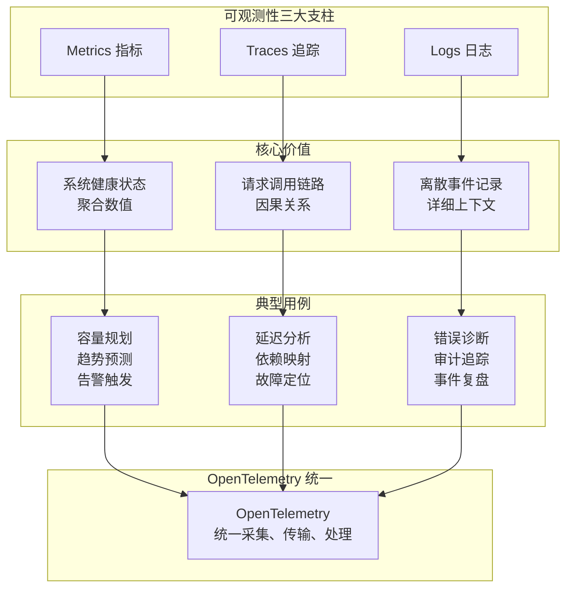
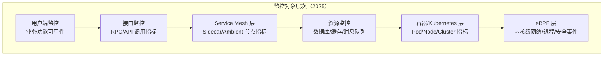
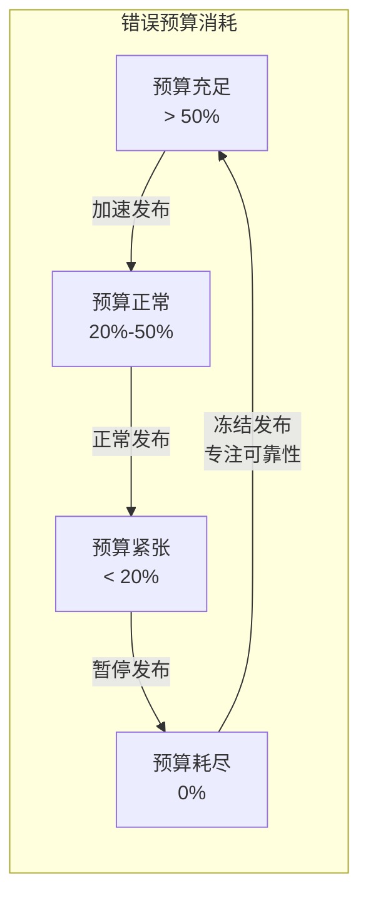
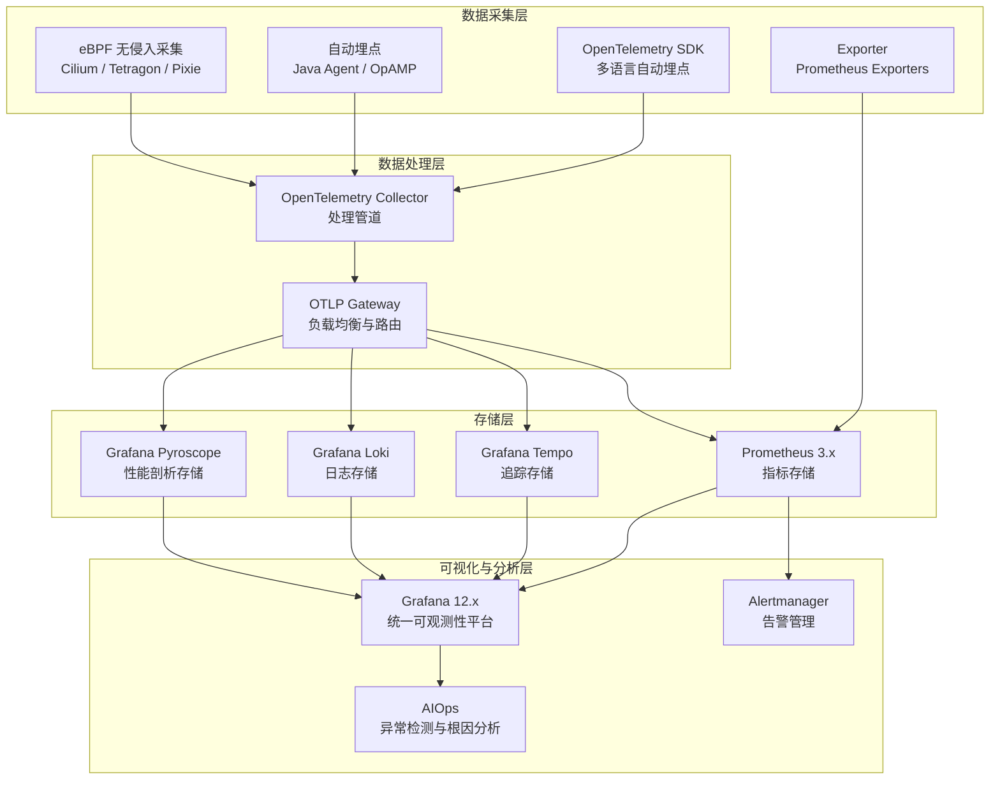
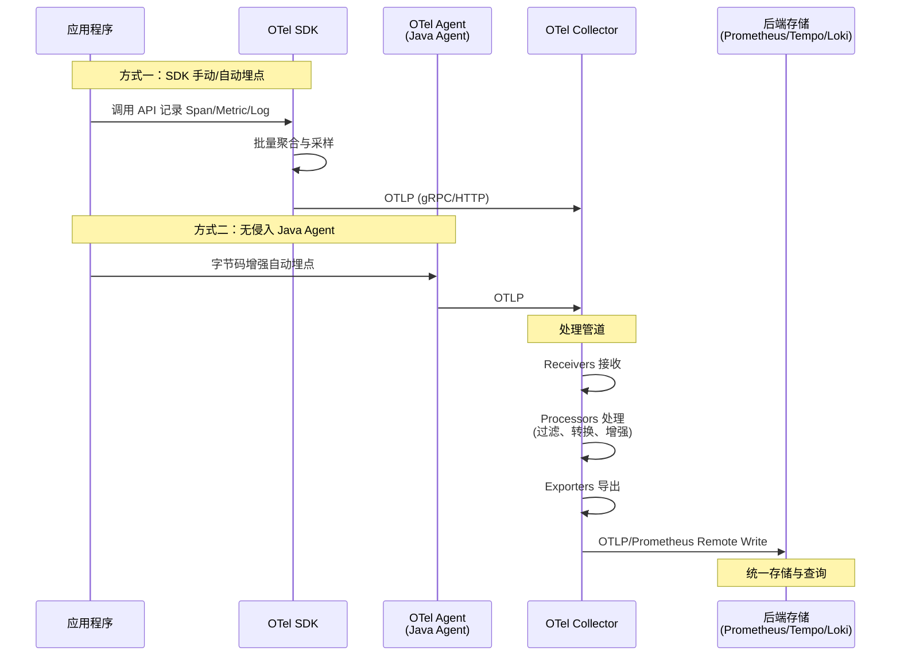
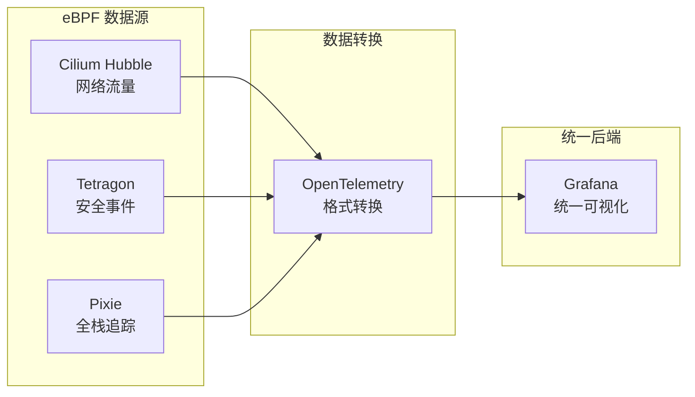
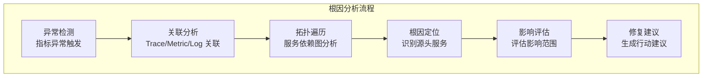

# 微服务可观测性：从监控到洞察

> **版本基线**：OpenTelemetry 1.x | Prometheus 3.x | Grafana 12.x | Cilium 1.16+
> **阅读时间**：约 25 分钟
> **前置知识**：[[06]] RPC远程服务调用

## 概述

微服务架构将单体应用拆分为多个独立服务，一次用户请求可能涉及数十个服务间的协同调用。这种分布式特性带来了前所未有的可观测性挑战：当系统出现异常时，如何快速定位问题根源？如何量化服务质量？如何预测潜在风险？

传统的"监控"概念已不足以应对云原生时代的复杂性。2025年，业界已形成以**可观测性（Observability）**为核心的新范式，通过 OpenTelemetry 统一 Trace/Metric/Log 三大支柱，结合 eBPF 无侵入采集、持续性能剖析、AIOps 智能分析，构建全栈、全链路、全维度的洞察体系。

本文将系统阐述微服务可观测性的核心概念、技术架构与实践方法。

---

## 正文

### 一、可观测性 vs 监控：概念辨析

#### 1.1 定义与本质区别

**监控（Monitoring）** 是已知问题的检测与告警。它回答"系统是否正常"的问题，基于预定义的指标和阈值，关注已知故障模式的发现。传统监控的核心是"告警"，当某个指标超过阈值时触发通知。

**可观测性（Observability）** 是系统内部状态的外部推断能力。它回答"系统为什么不正常"的问题，通过系统的外部输出（Trace、Metric、Log）推断内部状态，关注未知问题的诊断与根因分析。可观测性的核心是"洞察"，帮助理解系统的行为模式。

| 维度 | 监控（Monitoring） | 可观测性（Observability） |
|------|-------------------|--------------------------|
| 核心问题 | 系统是否正常？ | 系统为什么不正常？ |
| 问题类型 | 已知问题（Known Unknowns） | 未知问题（Unknown Unknowns） |
| 数据来源 | 预定义指标 | 任意维度的 Trace/Metric/Log |
| 分析方式 | 阈值告警 | 关联分析、根因定位 |
| 适用场景 | 稳定系统、预期故障 | 复杂分布式系统、意外故障 |
| 技术演进 | Zabbix、Nagios（2010年代） | OpenTelemetry、Grafana（2020年代） |

#### 1.2 为什么微服务需要可观测性

微服务架构的分布式特性带来了以下挑战：

1. **调用链复杂**：一次请求可能经过多个服务、多个基础设施组件，故障定位困难
2. **故障模式多样**：网络分区、服务降级、资源竞争、依赖故障等，难以预先定义所有告警规则
3. **动态性强**：服务实例频繁扩缩容、版本持续迭代，静态监控配置难以适应
4. **多语言异构**：不同服务使用不同技术栈，需要统一的可观测性标准

可观测性通过提供丰富的上下文信息和关联分析能力，使运维人员能够快速理解系统行为、定位问题根源。

---

### 二、可观测性三大支柱

OpenTelemetry 定义了可观测性的三大支柱：**Metrics（指标）**、**Traces（追踪）**、**Logs（日志）**。2025年，OpenTelemetry 已成为 CNCF 活跃度排名第二的项目，三大信号均已达到稳定（Stable）状态。



#### 2.1 Metrics（指标）

指标是系统状态的数值度量，通常以时间序列形式存储。指标数据具有高压缩比、低存储成本的特点，适合长期趋势分析和容量规划。

**核心指标类型**：

| 类型 | 描述 | 示例 | Prometheus 表达式 |
|------|------|------|-------------------|
| Counter（计数器） | 单调递增的累计值 | 请求总数、错误总数 | `http_requests_total` |
| Gauge（仪表盘） | 可增可减的瞬时值 | 当前连接数、内存使用量 | `process_resident_memory_bytes` |
| Histogram（直方图） | 观测值的分布统计 | 请求延迟分布、响应大小分布 | `http_request_duration_seconds` |
| Summary（摘要） | 分位数统计 | P99 延迟 | `http_request_duration_seconds{quantile="0.99"}` |

**Prometheus 3.x 原生直方图（Native Histograms）**：

Prometheus 3.0 引入的原生直方图是重大改进。传统直方图需要预定义 Bucket 边界，导致高基数问题或精度损失。原生直方图采用动态 Bucket 策略，自动调整分辨率，在存储效率和查询精度之间取得平衡。

```yaml
# Prometheus 3.x 原生直方图配置示例
global:
  native_histogram_min_bucket_factor: 1.1  # 最小 Bucket 因子
  native_histogram_max_bucket_number: 100  # 最大 Bucket 数量
```

原生直方图的优势：
- **无需预定义 Bucket**：自动适应数据分布
- **存储效率提升 50%+**：相比传统直方图
- **查询精度更高**：支持任意分位数计算
- **OTLP 原生支持**：与 OpenTelemetry 无缝集成

#### 2.2 Traces（追踪）

追踪记录请求在分布式系统中的完整调用路径，包含每个操作的耗时、状态和上下文信息。追踪是理解微服务调用链的核心工具。

**核心概念**：

- **Trace（追踪）**：一次请求的完整调用链，由多个 Span 组成
- **Span（跨度）**：单个操作单元，包含操作名称、开始时间、持续时间、标签、事件
- **Context Propagation（上下文传播）**：Trace ID 和 Span ID 在服务间的传递机制

**W3C Trace Context 标准**：

2025年，W3C Trace Context 已成为分布式追踪的行业标准，定义了 `traceparent` 和 `tracestate` 两个 HTTP Header：

```
traceparent: 00-4bf92f3577b34da6a3ce929d0e0e4736-00f067aa0ba902b7-01
             ^  ^^^^^^^^^^^^^^^^^^^^^^^^^^^^^^^^ ^^^^^^^^^^^^^^^^^^^ ^
             |  Trace ID (32 hex digits)       Span ID (16 hex)   |
             版本                                                采样标志
```

#### 2.3 Logs（日志）

日志记录系统中的离散事件，提供最详细的上下文信息。2025年，OpenTelemetry Logs 信号已达到稳定状态，实现了三大支柱的统一。

**日志结构化演进**：

传统文本日志 → JSON 结构化日志 → OpenTelemetry Log Records

```json
{
  "timeUnixNano": "1704067200000000000",
  "severityNumber": 17,
  "severityText": "ERROR",
  "body": {
    "stringValue": "Database connection failed"
  },
  "attributes": [
    {"key": "service.name", "value": {"stringValue": "user-service"}},
    {"key": "service.instance.id", "value": {"stringValue": "pod-abc123"}},
    {"key": "trace_id", "value": {"stringValue": "4bf92f3577b34da6a3ce929d0e0e4736"}},
    {"key": "span_id", "value": {"stringValue": "00f067aa0ba902b7"}}
  ]
}
```

**Trace-Log 关联**：

OpenTelemetry 的核心价值之一是实现了 Trace 与 Log 的自动关联。通过在日志中注入 Trace ID 和 Span ID，可以在 Grafana 中从 Trace 直接跳转到相关日志，大幅提升故障诊断效率。

---

### 三、监控对象与维度

#### 3.1 监控对象层次

2025年的微服务监控对象已从传统的四层模型演进为六层模型，新增 Service Mesh 层和 eBPF 层：



| 层次 | 监控对象 | 关键指标 | 技术方案 |
|------|----------|----------|----------|
| 用户端 | 业务功能可用性 | 成功率、端到端延迟、用户体验评分 | RUM、Synthetic Monitoring |
| 接口层 | RPC/API 调用 | QPS、延迟分布、错误率 | OpenTelemetry SDK |
| Service Mesh 层 | Sidecar/Ambient | 代理延迟、mTLS 状态、策略执行 | Istio/Ztunnel Metrics |
| 资源层 | 数据库/缓存/MQ | 连接池、命中率、队列深度 | Exporter、Native SDK |
| 容器/K8s 层 | Pod/Node/Cluster | CPU/Memory、调度延迟、资源配额 | cAdvisor、kube-state-metrics |
| eBPF 层 | 内核事件 | 网络延迟、系统调用、安全事件 | Cilium、Tetragon、Pixie |

#### 3.2 监控维度

监控维度决定了数据分析的粒度和深度。2025年的最佳实践强调**高基数（High Cardinality）** 维度的支持：

| 维度 | 描述 | 示例标签 | 基数特征 |
|------|------|----------|----------|
| 全局维度 | 整体服务健康状态 | `service="order-service"` | 低基数 |
| 机房维度 | 跨地域/可用区分析 | `region="us-west-2", zone="a"` | 低基数 |
| 实例维度 | 单实例粒度分析 | `instance="pod-abc123"` | 高基数 |
| 时间维度 | 时序趋势与同比环比 | 时间窗口聚合 | N/A |
| 核心维度 | 业务重要性分级 | `priority="critical"` | 低基数 |
| 用户维度 | 租户/用户级分析 | `tenant_id="xxx"` | 高基数 |
| 版本维度 | 版本对比分析 | `version="v2.3.1"` | 中基数 |

**高基数维度的挑战与解决方案**：

传统监控系统（如 Prometheus）对高基数维度支持有限。2025年的解决方案：

1. **Prometheus 3.x + Native Histograms**：支持更高基数的直方图数据
2. **Grafana Mimir/Prometheus 远程写入**：分布式存储支持高基数
3. **ClickHouse/Victoria Metrics**：列式存储，原生支持高基数查询
4. **Exemplars**：将 Trace ID 关联到 Metric 数据点，实现 Metric → Trace 跳转

---

### 四、核心监控指标

#### 4.1 黄金信号（Golden Signals）

Google SRE 提出的四个黄金信号是服务监控的核心指标：

| 信号 | 描述 | 计算方式 | 告警阈值建议 |
|------|------|----------|--------------|
| **Latency（延迟）** | 请求响应时间 | P50/P90/P99 延迟 | P99 > SLA 的 50% |
| **Traffic（流量）** | 系统吞吐量 | QPS/RPS | 容量规划的 80% |
| **Errors（错误）** | 失败请求比例 | 错误率 = 错误数/总请求数 | > 0.1% |
| **Saturation（饱和度）** | 资源利用程度 | CPU/Memory/连接池使用率 | > 80% |

#### 4.2 RED 方法

RED 方法是黄金信号在请求驱动服务中的简化应用：

- **Rate（请求率）**：每秒请求数
- **Errors（错误率）**：失败请求比例
- **Duration（持续时间）**：请求延迟分布

#### 4.3 USE 方法

USE 方法适用于资源监控：

- **Utilization（利用率）**：资源使用百分比
- **Saturation（饱和度）**：资源排队程度
- **Errors（错误）**：资源错误事件

---

### 五、SLI/SLO/SLA 框架

2025年，基于错误预算的可靠性工程已成为微服务治理的标准实践。

#### 5.1 概念定义

| 概念 | 全称 | 定义 | 示例 |
|------|------|------|------|
| **SLI** | Service Level Indicator | 服务水平指标，量化服务质量的具体度量 | 请求成功率、P99 延迟 |
| **SLO** | Service Level Objective | 服务水平目标，SLI 的目标值 | 99.9% 可用性、P99 < 200ms |
| **SLA** | Service Level Agreement | 服务水平协议，SLO 的商业承诺与违约后果 | 99.9% 可用性，违约退款 |

#### 5.2 错误预算（Error Budget）

错误预算是 SLO 的逆向表达，表示在给定时间窗口内允许的故障余量：

```
错误预算 = (1 - SLO) × 时间窗口内的总请求数

例如：SLO = 99.9%，月请求量 = 1000万
错误预算 = (1 - 0.999) × 10,000,000 = 10,000 次错误
```

**错误预算消耗策略**：



#### 5.3 SLO 实践示例

```yaml
# OpenSLO 规范示例（2025年行业标准）
apiVersion: openslo/v1
kind: SLO
metadata:
  name: order-service-availability
  displayName: Order Service Availability SLO
spec:
  service: order-service
  indicator:
    thresholdMetric:
      metricSource:
        type: Prometheus
        spec:
          query: |
            sum(rate(http_requests_total{service="order-service",status!~"5.."}[5m]))
            /
            sum(rate(http_requests_total{service="order-service"}[5m]))
  objectives:
    - displayName: 99.9% Availability
      target: 0.999
      timeSliceTarget: 0.995
      timeSliceWindow: 5m
  timeWindows:
    - duration: 30d
      isRolling: true
```

---

### 六、可观测性架构

#### 6.1 2025-2026 可观测性架构全景图



#### 6.2 OpenTelemetry 数据采集与传输流程



#### 6.3 OpenTelemetry Collector 架构

OpenTelemetry Collector 是可观测性数据管道的核心组件，采用 Receiver-Processor-Exporter（RPE）架构：

```yaml
# OpenTelemetry Collector 配置示例
receivers:
  otlp:
    protocols:
      grpc:
        endpoint: 0.0.0.0:4317
      http:
        endpoint: 0.0.0.0:4318

  prometheus:
    config:
      scrape_configs:
        - job_name: 'otel-collector'
          scrape_interval: 10s
          static_configs:
            - targets: ['localhost:8888']

processors:
  batch:
    timeout: 1s
    send_batch_size: 1024
    send_batch_max_size: 2048

  memory_limiter:
    check_interval: 1s
    limit_mib: 512
    spike_limit_mib: 128

  attributes:
    actions:
      - key: environment
        value: production
        action: insert

  filter:
    error_mode: ignore
    metrics:
      metric:
        - 'name == "unwanted_metric"'

exporters:
  otlp/prometheus:
    endpoint: prometheus:9090
    tls:
      insecure: true

  otlp/tempo:
    endpoint: tempo:4317
    tls:
      insecure: true

  loki:
    endpoint: http://loki:3100/loki/api/v1/push
    default_labels_enabled:
      exporter: false

service:
  pipelines:
    traces:
      receivers: [otlp]
      processors: [memory_limiter, batch]
      exporters: [otlp/tempo]

    metrics:
      receivers: [otlp, prometheus]
      processors: [memory_limiter, filter, batch]
      exporters: [otlp/prometheus]

    logs:
      receivers: [otlp]
      processors: [memory_limiter, attributes, batch]
      exporters: [loki]
```

---

### 七、eBPF 无侵入可观测性

eBPF（Extended Berkeley Packet Filter）是内核级可观测性的革命性技术，允许在内核空间安全地执行沙箱程序，无需修改应用程序代码即可采集深度可观测性数据。

#### 7.1 eBPF 可观测性优势

| 特性 | 传统 SDK 方式 | eBPF 方式 |
|------|--------------|-----------|
| 代码侵入性 | 需要修改应用代码或引入 Agent | 完全无侵入 |
| 语言支持 | 需要各语言 SDK | 语言无关 |
| 数据深度 | 应用层可见数据 | 内核级深度数据 |
| 性能开销 | 应用内开销 | 内核级低开销 |
| 部署复杂度 | 需要应用配合 | 独立 DaemonSet 部署 |
| 数据类型 | 应用定义的指标 | 网络、系统调用、文件 I/O |

#### 7.2 主流 eBPF 可观测性工具

**Cilium Hubble**：

Cilium 是基于 eBPF 的网络、安全和可观测性平台。Hubble 是其内置的可观测性组件，提供：

- **服务依赖图**：自动发现服务间调用关系
- **网络流量可视化**：L3-L7 层流量监控
- **DNS 监控**：DNS 查询与响应追踪
- **安全策略执行**：网络策略审计日志

```yaml
# Cilium Hubble 配置示例
hubble:
  enabled: true
  listenAddress: ":4244"
  metrics:
    enabled:
      - dns
      - drop
      - flow
      - http
      - icmp
      - port-distribution
      - tcp
  relay:
    enabled: true
    listenAddress: ":4245"
```

**Tetragon**：

Tetragon 是专注于安全可观测性的 eBPF 工具，提供：

- **进程执行监控**：跟踪进程创建、终止
- **系统调用追踪**：监控关键系统调用
- **文件访问审计**：文件读写操作追踪
- **网络连接监控**：TCP/UDP 连接追踪

**Pixie**：

Pixie 是 Kubernetes 原生的 eBPF 可观测性平台，提供：

- **自动服务拓扑**：无需配置自动生成服务依赖图
- **全栈请求追踪**：从 HTTP 到数据库的完整追踪
- **网络性能分析**：TCP 重传、延迟分析
- **资源热点定位**：CPU/内存热点函数识别

#### 7.3 eBPF 与 OpenTelemetry 集成

2025年，eBPF 数据与 OpenTelemetry 的集成已成为标准实践：



---

### 八、持续性能剖析（Continuous Profiling）

性能剖析（Profiling）是识别系统性能瓶颈的关键手段。传统剖析需要手动触发，难以捕获生产环境的真实性能问题。持续性能剖析通过持续采集生产环境的剖析数据，实现性能问题的主动发现。

#### 8.1 核心概念

| 概念 | 描述 |
|------|------|
| **CPU Profiling** | 采样 CPU 执行栈，识别 CPU 热点函数 |
| **Memory Profiling** | 跟踪内存分配，识别内存泄漏和大对象 |
| **I/O Profiling** | 监控文件/网络 I/O，识别 I/O 瓶颈 |
| **Lock Profiling** | 分析锁竞争，识别并发瓶颈 |
| **Goroutine/Thread Profiling** | 跟踪协程/线程状态，识别阻塞问题 |

#### 8.2 主流持续性能剖析工具

**Grafana Pyroscope**：

Grafana 于 2023 年收购 Pyroscope 并整合到 Grafana 生态，提供：

- **多语言支持**：Go、Java、Python、Ruby、.NET、Node.js、Rust
- **低开销采集**：生产环境安全，CPU 开销 < 1%
- **与 Grafana 集成**：统一可观测性平台，Profile 与 Trace/Metric/Log 关联
- **差异对比**：版本间性能对比，识别性能退化

```yaml
# Pyroscope 配置示例
pyroscope:
  scrape_configs:
    - job_name: 'order-service'
      static_configs:
        - targets: ['order-service:4040']
      profiling_config:
        profiling_enabled: true
        cpu_enabled: true
        memory_enabled: true
        goroutine_enabled: true
```

**Parca**：

Parca 是 CNCF 沙箱项目，专注于持续性能剖析：

- **eBPF 采集**：无侵入采集，无需修改应用
- **持久化存储**：长期存储剖析数据，支持历史对比
- **开源免费**：完全开源，无商业限制

#### 8.3 Profile 与 Trace 关联

2025年的最佳实践是将 Profile 数据与 Trace 关联，实现从 Trace 到 Profile 的无缝跳转：

```
Trace Span (延迟异常)
    ↓ 关联
Profile (该时间段的 CPU/Memory 剖析)
    ↓ 分析
热点函数 (根因定位)
```

---

### 九、AIOps 智能告警与根因分析

传统告警基于静态阈值，存在告警风暴、漏报误报等问题。AIOps 通过机器学习实现智能异常检测和根因分析。

#### 9.1 智能异常检测

| 方法 | 描述 | 适用场景 |
|------|------|----------|
| **统计方法** | 基于均值、标准差的异常检测 | 稳定指标、周期性数据 |
| **时序预测** | ARIMA、Prophet、LSTM 预测 | 趋势分析、容量预测 |
| **无监督学习** | Isolation Forest、DBSCAN 聚类 | 未知异常模式发现 |
| **有监督学习** | 分类模型识别已知异常模式 | 已标注历史数据 |

#### 9.2 根因分析（RCA）

AIOps 根因分析通过关联分析自动定位问题根源：



#### 9.3 主流 AIOps 工具

- **Grafana Machine Learning**：Grafana Cloud 内置的异常检测
- **Datadog Watchdog**：自动异常检测和根因分析
- **Dynatrace Davis**：AI 驱动的根因分析引擎
- **开源方案**：Prometheus + Prophet/LSTM 自建

---

### 十、Grafana 统一可观测性平台

Grafana 12.x 已成为统一可观测性的核心平台，整合 Metrics、Logs、Traces、Profiles 四大信号。

#### 10.1 Grafana LGTM+P 架构

| 组件 | 功能 | 存储后端 |
|------|------|----------|
| **Grafana** | 统一可视化与告警 | - |
| **Loki** | 日志存储 | 对象存储（S3/GCS） |
| **Tempo** | 追踪存储 | 对象存储 |
| **Mimir** | 指标存储 | 对象存储 + TSDB |
| **Pyroscope** | 性能剖析存储 | 对象存储 |

#### 10.2 核心能力

- **统一查询**：单一界面查询 Metrics、Logs、Traces、Profiles
- **关联导航**：从 Metric → Trace → Log → Profile 的无缝跳转
- **告警统一**：统一告警规则管理，支持多通道通知
- **Dashboard 即代码**：JSON/YAML 定义 Dashboard，GitOps 管理
- **插件生态**：丰富的数据源和可视化插件

---

## 技术演进时间线

| 时间 | 里程碑 | 影响 |
|------|--------|------|
| 2017 | 原文发布，监控四层模型 | 确立监控对象层次化思维 |
| 2018 | OpenTelemetry 项目启动 | CNCF 统一可观测性标准 |
| 2018 | Prometheus 2.0 发布 | 时序数据库性能大幅提升 |
| 2022 | W3C Trace Context 成为 W3C 推荐标准 | 分布式追踪标准化 |
| 2021 | OpenTelemetry Traces/Metrics 达到稳定 | 统一采集标准成熟 |
| 2022 | eBPF 可观测性兴起 | 无侵入可观测性成为可能 |
| 2023 | Grafana 收购 Pyroscope | 持续性能剖析进入主流 |
| 2024 | OpenTelemetry Logs 达到稳定 | 三大支柱完全统一 |
| 2024 | Prometheus 3.0 发布 | 原生直方图、OTLP 支持 |
| 2025 | AIOps 成为主流实践 | 智能告警与根因分析普及 |

---

## 架构决策指南

### 可观测性技术栈选型

| 场景 | 推荐方案 | 理由 |
|------|----------|------|
| 新项目，云原生架构 | OpenTelemetry + Prometheus + Grafana LGTM | 行业标准，社区活跃，生态完善 |
| 已有 Prometheus 监控 | 渐进引入 OpenTelemetry Collector + OTLP | 平滑迁移，保护现有投资 |
| 高基数需求 | Victoria Metrics / ClickHouse | 原生支持高基数，查询性能优异 |
| 无侵入需求 | eBPF 方案（Cilium/Pixie） | 无需修改应用，语言无关 |
| 性能剖析需求 | Grafana Pyroscope | 与 Grafana 生态集成，统一平台 |
| 企业级需求 | Grafana Cloud / Datadog / Dynatrace | 全托管，AIOps 能力成熟 |

### 采样率决策

| 场景 | 推荐采样率 | 理由 |
|------|-----------|------|
| 生产环境，高流量 | 1%-10% | 平衡成本与可观测性 |
| 生产环境，低流量 | 100% | 完整数据，成本可控 |
| 预发环境 | 100% | 完整数据，问题排查 |
| 错误请求 | 100% | 所有错误必须记录 |
| 慢请求 | 100% | 性能问题排查必需 |

---

## 小结

微服务可观测性是云原生架构的基石。从传统的"监控"到现代的"可观测性"，核心转变在于从"已知问题的检测"到"未知问题的诊断"。

**核心要点**：

1. **可观测性 vs 监控**：可观测性关注未知问题的诊断，监控关注已知问题的检测
2. **三大支柱统一**：OpenTelemetry 统一 Trace/Metric/Log，实现关联分析
3. **六层监控对象**：用户端→接口→Service Mesh→资源→容器→eBPF
4. **SLI/SLO/SLA 框架**：基于错误预算的可靠性工程实践
5. **eBPF 无侵入**：内核级可观测性，无需修改应用代码
6. **持续性能剖析**：主动发现性能瓶颈，而非被动响应
7. **AIOps 智能化**：机器学习驱动的异常检测与根因分析
8. **Grafana 统一平台**：LGTM+P 统一可观测性数据

**下一篇**：[[08]] 微服务调用链追踪 → 将深入探讨分布式追踪的原理与实践，包括 Trace Context 传播、Span 关联、采样策略等核心主题。

---

**参考资料**：

- [OpenTelemetry 官方文档](https://opentelemetry.io/docs/)
- [Prometheus 3.0 发布说明](https://prometheus.io/blog/2024/11/14/prometheus-3-0/)
- [Grafana 12.x 文档](https://grafana.com/docs/grafana/latest/)
- [Cilium Hubble 文档](https://docs.cilium.io/en/stable/observability/hubble/)
- [Google SRE Book - Monitoring Distributed Systems](https://sre.google/sre-book/monitoring-distributed-systems/)
