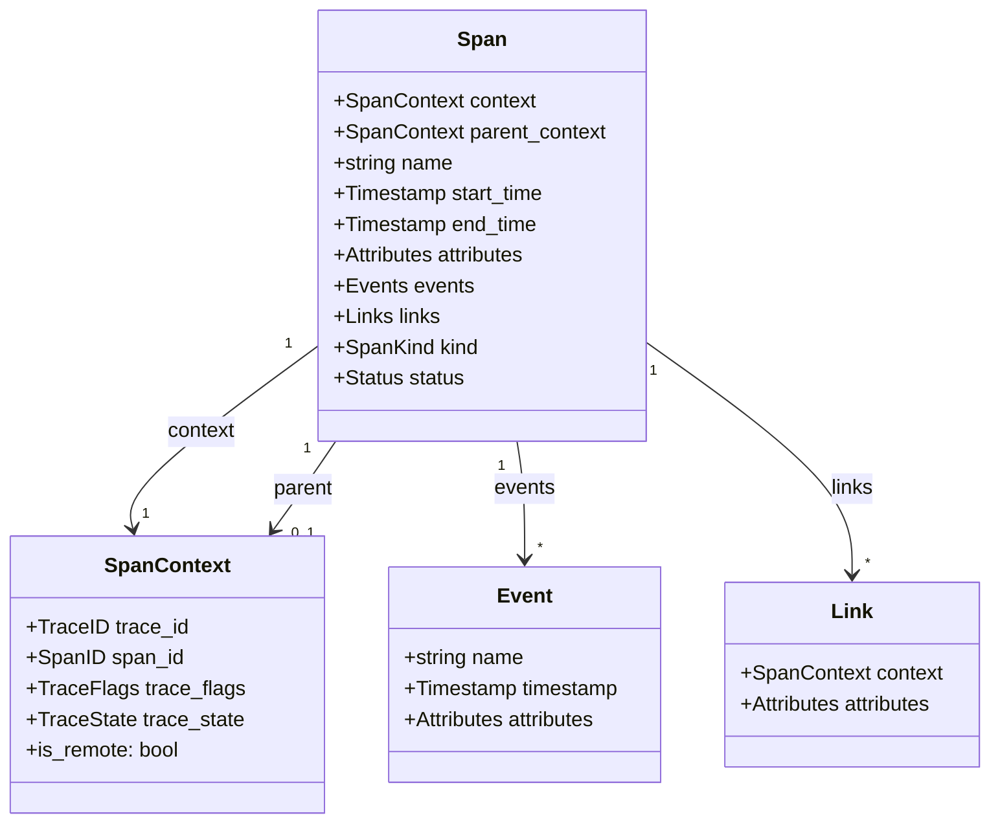
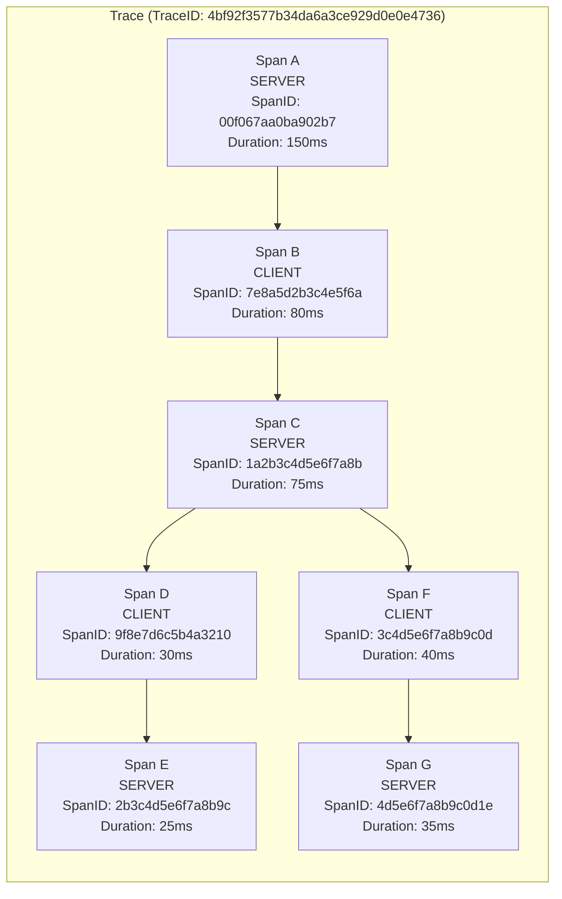
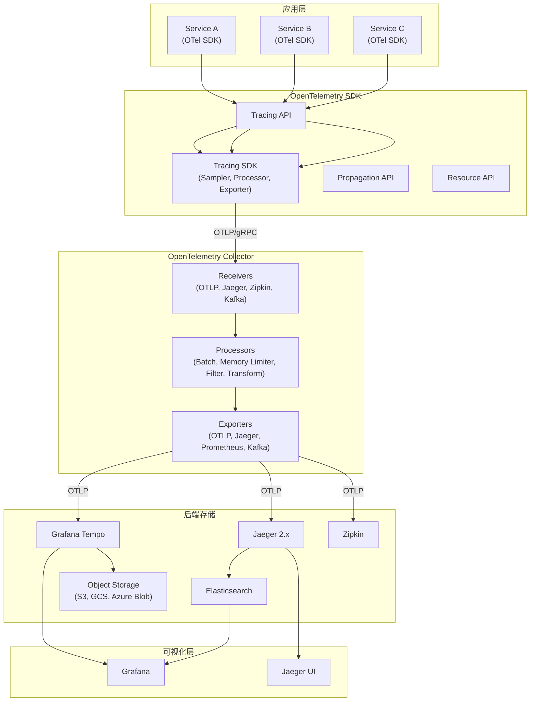
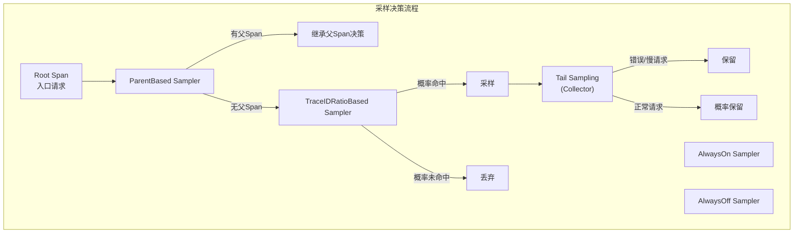
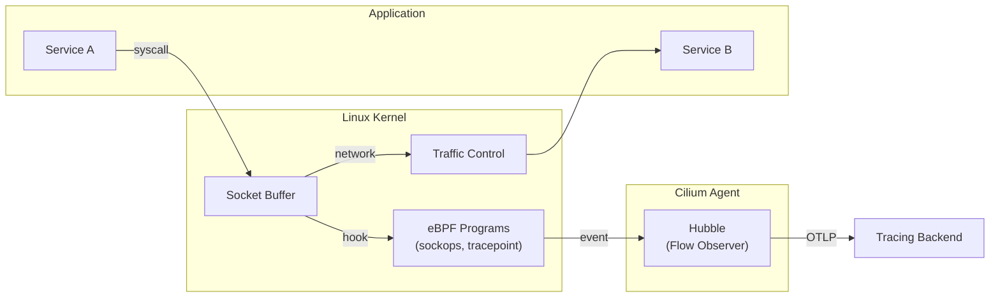
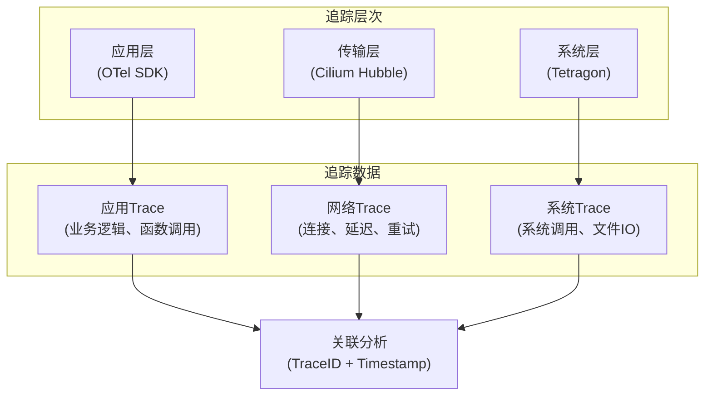
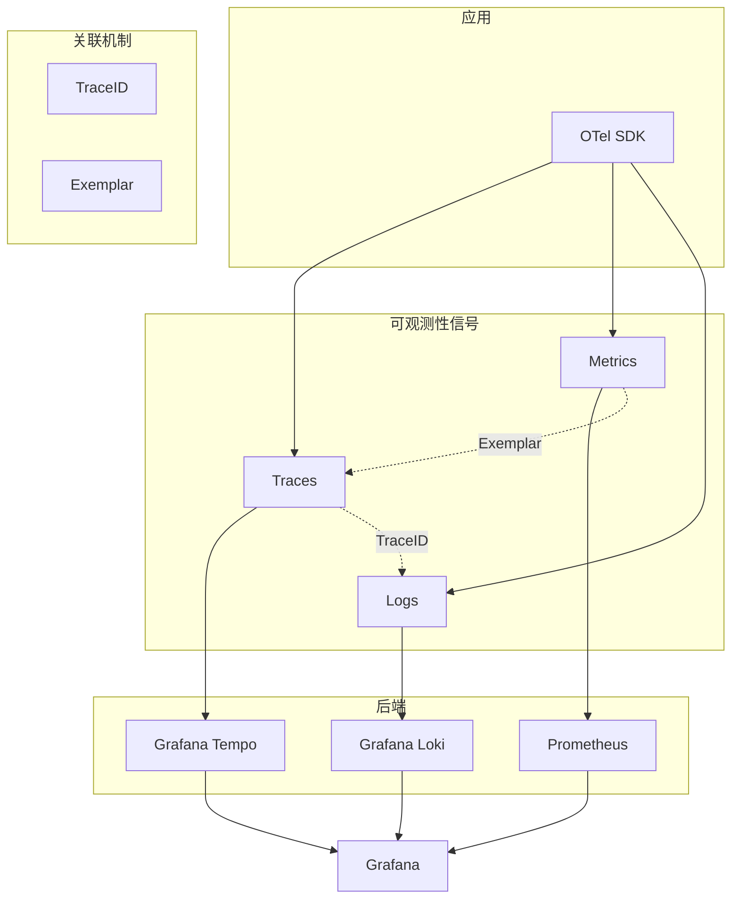

# 如何追踪微服务调用

## 概述

在微服务架构下，服务拆分导致一次请求往往涉及多个服务，这些服务可能由不同团队开发、使用不同编程语言、部署在不同机器甚至不同数据中心。当请求失败或性能下降时，定位问题根源变得极为复杂。分布式追踪系统（Distributed Tracing System）通过记录请求在服务间的完整调用路径，为故障诊断、性能优化和架构治理提供关键支撑。

自Google于2010年发表Dapper论文以来，分布式追踪技术经历了十余年演进。2020年后，随着W3C Trace Context标准的确立和OpenTelemetry项目的成熟，分布式追踪进入标准化时代。本文将基于2025-2026年最新技术栈，系统阐述分布式追踪的原理、实现与选型策略。

## 一、分布式追踪的核心价值

### 1.1 故障定位与根因分析

分布式追踪最直接的价值在于故障定位。当用户请求失败时，通过TraceID可快速检索完整调用链，定位失败发生的具体服务、操作及错误信息。相比传统日志排查，追踪系统将排查时间从小时级缩短至分钟级。

### 1.2 性能瓶颈识别

通过记录每个Span的耗时，可从全局视角识别系统瓶颈。常见瓶颈包括：
- 网络延迟（跨数据中心调用、公网调用）
- 服务处理延迟（GC停顿、锁竞争、CPU饱和）
- 存储延迟（数据库慢查询、缓存穿透）
- 下游依赖延迟（第三方API超时）

### 1.3 调用链路优化

追踪数据可揭示不合理的调用模式：
- 冗余调用：同一数据被多次请求
- 串行化瓶颈：可并行化的调用被串行执行
- 跨数据中心调用：未遵循数据本地性原则
- 深度过深的调用链：导致延迟累积

### 1.4 服务拓扑生成

基于追踪数据可自动生成服务依赖拓扑图，反映：
- 服务间的调用关系与方向
- 调用量（QPS）与错误率
- 平均延迟与P99延迟
- 服务层级与关键路径

### 1.5 上下文传播与业务透传

W3C Baggage标准支持在调用链中传播业务上下文，典型应用场景包括：
- A/B测试：透传实验分组标识
- 灰度发布：透传灰度规则
- 租户隔离：透传租户ID
- 安全审计：透传用户身份信息

## 二、分布式追踪原理与数据模型

### 2.1 从Dapper到OpenTelemetry：数据模型演进

Google Dapper论文奠定了分布式追踪的理论基础，其核心概念包括：

| 概念 | Dapper定义 | OpenTelemetry定义 |
|------|-----------|------------------|
| Trace | 一次请求的完整调用路径 | 一组共享相同TraceID的Span集合 |
| TraceID | 全局唯一的请求标识符 | 128位（或32位兼容）十六进制字符串 |
| Span | 一次RPC调用的基本信息单元 | 具有开始时间、持续时间、属性、事件的工作单元 |
| SpanID | Span的唯一标识 | 16位十六进制字符串，随机生成 |
| ParentSpanID | 父Span的标识 | 通过ParentContext隐式关联，不再显式存储 |

OpenTelemetry对Dapper模型的关键改进：

1. **SpanID随机化**：放弃Dapper的层级编码（如0.1.1），采用随机生成，避免ID冲突和编码复杂度
2. **ParentSpanID隐式关联**：通过SpanContext的Parent字段关联，而非显式存储ParentSpanID
3. **Link机制**：支持Span间的非父子关联，用于表示异步触发、批处理等场景
4. **Event机制**：Span可携带时间戳事件，记录Span生命周期内的关键节点
5. **Attribute标准化**：定义语义约定（Semantic Conventions），如`http.method`、`db.system`等

### 2.2 OpenTelemetry Span模型



**SpanKind枚举**定义了Span的类型：
- `INTERNAL`：服务内部操作
- `SERVER`：服务端处理请求
- `CLIENT`：客户端发起请求
- `PRODUCER`：消息生产者
- `CONSUMER`：消息消费者

### 2.3 分布式追踪的Span关系图



上图展示了一个典型的分布式调用链：
- Span A（网关服务）接收用户请求，总耗时150ms
- Span A调用Span B（用户服务），耗时80ms
- Span B内部调用Span C（订单服务）和Span F（支付服务）
- Span C调用Span D（库存服务）
- 关键路径为A→B→C→D→E，决定了整体延迟

### 2.4 Context Propagation机制

分布式追踪的核心挑战是跨进程传递追踪上下文。OpenTelemetry定义了Context Propagation API，支持多种传播格式：

**W3C Trace Context**（推荐标准）：
```
traceparent: 00-4bf92f3577b34da6a3ce929d0e0e4736-00f067aa0ba902b7-01
tracestate: congo=t61rcWkgMzE,rojo=00f067aa0ba902b7
```

格式解析：
- `00`：版本号
- `4bf92f3577b34da6a3ce929d0e0e4736`：TraceID（32位十六进制，128位）
- `00f067aa0ba902b7`：ParentSpanID（16位十六进制，64位）
- `01`：TraceFlags（`01`表示sampled，`00`表示not sampled）

**W3C Baggage**：
```
baggage: userId=12345,experimentGroup=A,tenantId=acme-corp
```

**其他传播格式**：
- **B3**（Zipkin）：`X-B3-TraceId`、`X-B3-SpanId`、`X-B3-ParentSpanId`、`X-B3-Sampled`
- **B3 Single**：`b3: 4bf92f3577b34da6a3ce929d0e0e4736-00f067aa0ba902b7-1`
- **Jaeger**：`uber-trace-id: 4bf92f3577b34da6a3ce929d0e0e4736:00f067aa0ba902b7:0:1`

## 三、OpenTelemetry Tracing架构

### 3.1 整体架构

OpenTelemetry是CNCF的活跃项目，提供厂商无关的可观测性框架，涵盖Tracing、Metrics、Logs三大支柱。



### 3.2 OpenTelemetry SDK组件

**TracerProvider**：Tracer的工厂，配置全局追踪行为：
```go
tp := sdktrace.NewTracerProvider(
    sdktrace.WithSampler(sdktrace.TraceIDRatioBased(0.1)), // 10%采样
    sdktrace.WithBatcher(otlptracehttp.NewClient()),      // 批量导出
    sdktrace.WithResource(resource.NewWithAttributes(
        semconv.SchemaURL,
        semconv.ServiceName("my-service"),
        semconv.ServiceVersion("1.0.0"),
    )),
)
otel.SetTracerProvider(tp)
```

**Sampler**：决定是否采样Span，影响数据量与成本：
- `AlwaysOn`：100%采样，适用于开发环境
- `AlwaysOff`：不采样，用于禁用追踪
- `TraceIDRatioBased`：基于TraceID的概率采样
- `ParentBased`：继承父Span的采样决策（默认推荐）

**SpanProcessor**：处理Span的生命周期：
- `SimpleSpanProcessor`：同步导出，适用于开发调试
- `BatchSpanProcessor`：批量异步导出，适用于生产环境

**Exporter**：导出Span数据到后端：
- `OTLP Exporter`：导出到OTLP兼容后端（Jaeger、Tempo、Collector）
- `Jaeger Exporter`：直接导出到Jaeger（已废弃，推荐OTLP）
- `Zipkin Exporter`：导出到Zipkin

### 3.3 OpenTelemetry Collector

Collector是OpenTelemetry的核心组件，提供数据收集、处理、路由能力。Jaeger 2.x基于Collector重建，成为其核心架构。

**部署模式**：
- **Agent模式**：Sidecar部署，与应用同节点，减少网络跳数
- **Gateway模式**：集中部署，便于统一配置和管理
- **混合模式**：Agent + Gateway，兼顾性能与管理

**关键Processor配置**：
```yaml
processors:
  batch:
    timeout: 1s
    send_batch_size: 1024
    send_batch_max_size: 2048
  
  memory_limiter:
    check_interval: 1s
    limit_mib: 512
    spike_limit_mib: 128
  
  filter:
    spans:
      exclude:
        match_type: regexp
        attributes:
          - key: "http.route"
            value: "/health.*"
  
  tail_sampling:
    decision_wait: 10s
    policies:
      - name: errors
        type: status_code
        status_code: { status_codes: [ERROR] }
      - name: slow-traces
        type: latency
        latency: { threshold_ms: 500 }
```

## 四、采样策略

### 4.1 头部采样（Head-based Sampling）

采样决策在Trace入口处做出，所有子Span继承该决策。

**优点**：
- 实现简单，开销低
- 一致性好，整个Trace要么完整要么不采集

**缺点**：
- 无法捕获异常Trace（错误、慢请求）
- 可能遗漏重要的边缘情况

**适用场景**：高流量、低错误率的常规业务

### 4.2 尾部采样（Tail-based Sampling）

采样决策在Trace完成后做出，基于完整Trace特征决定是否保留。

**采样策略**：
- 错误采样：保留所有包含错误的Trace
- 延迟采样：保留超过阈值的慢Trace
- 属性采样：基于特定属性（如VIP用户）采样
- 组合策略：多种策略的组合

**实现方式**：OpenTelemetry Collector的`tail_sampling`处理器

**优点**：
- 捕获所有异常Trace
- 数据价值密度高

**缺点**：
- 需要缓存完整Trace，内存开销大
- 决策延迟（通常10-30秒）
- 实现复杂度高

### 4.3 OpenTelemetry采样器体系



**生产环境推荐配置**：
- 入口：ParentBased + TraceIDRatioBased（0.1%基础采样）
- Collector：Tail Sampling（错误100%、慢请求100%、正常请求概率采样）

## 五、追踪系统后端选型

### 5.1 Jaeger 2.x

Jaeger是Uber开源的分布式追踪系统，2024年发布2.0版本，基于OpenTelemetry Collector重建。

**架构特点**：
- 存储后端：Elasticsearch、Cassandra、Kafka、Badger（嵌入式）、gRPC（自定义）
- 部署模式：All-in-One（开发）、Production（分布式）
- UI：内置Jaeger UI，支持服务拓扑、调用链、对比分析

**关键改进**：
- 原生支持OTLP协议
- 继承Collector的Processor能力
- 支持Tail Sampling
- 内存存储从ES迁移到Badger，降低部署复杂度

**适用场景**：中小规模、需要完整UI、传统部署环境

### 5.2 Grafana Tempo

Tempo是Grafana Labs开源的追踪后端，专注于大规模、低成本存储。

**架构特点**：
- 存储后端：对象存储（S3、GCS、Azure Blob、本地文件）
- 数据模型：TraceID作为唯一索引，不索引Span属性
- 查询方式：TraceID查询 + Span过滤（TraceQL）

**核心优势**：
- 成本极低：对象存储成本约为ES的1/10
- 与Grafana深度集成：统一可观测性平台
- 支持Exemplar：Metrics与Traces关联
- TraceQL：类PromQL的查询语言

**适用场景**：大规模、云原生环境、已有Grafana生态

### 5.3 Zipkin

Zipkin是Twitter开源的追踪系统，目前处于维护模式。

**现状**：
- 仍被广泛使用，但新功能开发停滞
- 支持OTLP协议接收
- 存储后端：Elasticsearch、Cassandra、MySQL

**适用场景**：遗留系统迁移、简单场景

### 5.4 选型对比

| 维度 | Jaeger 2.x | Grafana Tempo | Zipkin |
|------|-----------|---------------|--------|
| 存储成本 | 中（ES/Cassandra） | 低（对象存储） | 中（ES/Cassandra） |
| 查询能力 | 强（UI + API） | 中（TraceID + TraceQL） | 中（UI + API） |
| 部署复杂度 | 中 | 低 | 低 |
| 云原生集成 | 良好 | 优秀 | 一般 |
| 社区活跃度 | 高 | 高 | 低（维护模式） |
| 适用规模 | 中小规模 | 大规模 | 小规模 |

**选型建议**：
- 新项目：优先选择Grafana Tempo（云原生、低成本）
- 需要完整UI：选择Jaeger 2.x
- 遗留系统：保持Zipkin，逐步迁移到OTLP

## 六、eBPF无侵入追踪

传统追踪依赖SDK埋点，存在代码侵入、语言绑定、维护成本等问题。eBPF（Extended Berkeley Packet Filter）技术实现了内核级无侵入追踪。

### 6.1 Cilium Hubble

Cilium是基于eBPF的网络、安全、可观测性平台，Hubble是其可观测性组件。

**追踪能力**：
- 网络层追踪：捕获所有网络流量，自动生成Trace
- 服务依赖拓扑：基于实际流量生成
- L7协议解析：HTTP、gRPC、Kafka、DNS等
- 无需修改应用代码

**工作原理**：


**局限性**：
- 仅捕获网络层，无法获取应用层上下文
- TraceID需要通过W3C Trace Context传播
- 无法替代SDK埋点的细粒度追踪

### 6.2 Tetragon

Tetragon是Cilium生态的安全可观测性组件，专注于系统调用追踪。

**追踪能力**：
- 系统调用追踪：open、read、write、connect等
- 进程生命周期追踪：exec、exit、fork
- 文件访问追踪
- 网络连接追踪

**应用场景**：
- 安全审计：追踪敏感操作
- 故障诊断：定位异常行为
- 性能分析：识别系统调用瓶颈

### 6.3 eBPF追踪与SDK追踪的协同



**最佳实践**：
- SDK追踪：应用层业务逻辑
- Hubble：网络层调用关系、服务拓扑
- Tetragon：安全审计、异常行为检测
- 通过TraceID和时间戳关联三层数据

## 七、追踪与日志、指标的关联

### 7.1 TraceID关联日志

在日志中注入TraceID，实现日志与追踪的双向跳转。

**日志格式（JSON）**：
```json
{
  "timestamp": "2025-06-09T10:30:45.123Z",
  "level": "ERROR",
  "message": "Database connection failed",
  "trace_id": "4bf92f3577b34da6a3ce929d0e0e4736",
  "span_id": "00f067aa0ba902b7",
  "service": "order-service",
  "attributes": {
    "db.system": "postgresql",
    "db.statement": "SELECT * FROM orders WHERE id = ?"
  }
}
```

**OpenTelemetry日志集成**：
```go
logger.Info("Processing order",
    "trace_id", trace.SpanContextFromContext(ctx).TraceID().String(),
    "span_id", trace.SpanContextFromContext(ctx).SpanID().String(),
)
```

### 7.2 Exemplar关联指标

Exemplar是Prometheus/OpenMetrics标准，将TraceID附加到指标数据点。

**Exemplar格式**：
```
http_server_request_duration_seconds_bucket{method="GET",route="/api/orders",le="0.1"} 1000
# {trace_id="4bf92f3577b34da6a3ce929d0e0e4736"} 0.087 1623237045.123
```

**Grafana集成**：
- 在指标图表中点击数据点，跳转到相关Trace
- 从宏观指标下钻到微观Trace

### 7.3 三支柱关联架构



## 八、技术演进时间线

| 年份 | 里程碑事件 | 技术影响 |
|------|-----------|---------|
| 2010 | Google发表Dapper论文 | 奠定分布式追踪理论基础 |
| 2012 | Twitter开源Zipkin | 首个广泛应用的追踪系统 |
| 2017 | Uber开源Jaeger | 大规模生产验证 |
| 2016 | OpenTracing项目启动 | 追踪API标准化尝试 |
| 2018 | OpenCensus项目启动 | Google内部追踪框架开源 |
| 2019 | OpenTelemetry项目启动 | OpenTracing + OpenCensus合并 |
| 2022 | W3C Trace Context成为推荐标准 | 上下文传播标准化 |
| 2021 | W3C Baggage 进入标准草案 | 业务上下文传播标准化（尚未成为推荐标准） |
| 2021 | OpenTelemetry Tracing 达到稳定 | 生产可用 |
| 2023 | Grafana Tempo成熟 | 大规模低成本追踪 |
| 2024 | Jaeger 2.0发布 | 基于OTel Collector重建 |
| 2025 | eBPF追踪普及 | 无侵入追踪成为主流 |

## 九、架构决策指南

### 9.1 追踪系统选型决策树

```mermaid
flowchart TB
    Start["需要追踪系统"]
    
    Q1{"是否已有<br/>Grafana生态?"}
    Q2{"流量规模?"}
    Q3{"是否需要<br/>完整UI?"}
    Q4{"是否云原生<br/>部署?"}
    Q5{"遗留系统<br/>迁移?"}
    
    Tempo["Grafana Tempo<br/>(推荐)"]
    Jaeger["Jaeger 2.x"]
    Zipkin["Zipkin"]
    Hybrid["Jaeger UI + Tempo后端"]
    
    Start --> Q1
    Q1 -->|是| Tempo
    Q1 -->|否| Q2
    Q2 -->|大规模<br/>(>10K TPS)| Tempo
    Q2 -->|中小规模| Q3
    Q3 -->|是| Jaeger
    Q3 -->|否| Q4
    Q4 -->|是| Tempo
    Q4 -->|否| Q5
    Q5 -->|是| Zipkin
    Q5 -->|否| Jaeger
    
    Tempo --> Hybrid
    Jaeger --> Hybrid
```

### 9.2 采样策略决策

| 场景 | 推荐策略 | 理由 |
|------|---------|------|
| 开发环境 | AlwaysOn | 完整数据便于调试 |
| 生产环境（高流量） | ParentBased + TraceIDRatioBased(0.1%) + Tail Sampling | 平衡成本与覆盖率 |
| 生产环境（低流量） | AlwaysOn | 数据量可控，完整覆盖 |
| 故障排查期间 | 临时提高采样率或AlwaysOn | 捕获更多数据 |
| 安全敏感场景 | 基于属性采样 | 过滤敏感Trace |

### 9.3 部署模式决策

| 模式 | 适用场景 | 优缺点 |
|------|---------|--------|
| SDK直连后端 | 小规模、简单架构 | 简单，但缺乏统一处理 |
| Agent模式 | 中规模、Kubernetes | 减少网络跳数，但管理复杂 |
| Gateway模式 | 大规模、多集群 | 统一管理，但增加延迟 |
| Agent + Gateway | 超大规模、多数据中心 | 兼顾性能与管理 |

## 小结

分布式追踪是微服务可观测性的核心支柱。从Dapper论文到OpenTelemetry标准，追踪技术经历了十余年演进，已形成成熟的技术体系：

**标准化成果**：W3C Trace Context和Baggage标准解决了跨系统上下文传播问题，OpenTelemetry提供了厂商无关的API/SDK/Collector完整解决方案。

**技术栈选择**：Jaeger 2.x基于OpenTelemetry Collector重建，提供完整UI和丰富功能；Grafana Tempo以对象存储为后端，实现大规模低成本追踪；eBPF技术（Cilium Hubble、Tetragon）实现无侵入追踪，与SDK追踪形成互补。

**三支柱关联**：TraceID关联日志、Exemplar关联指标，实现从宏观到微观的全链路可观测性。

**实践建议**：新项目优先采用OpenTelemetry SDK + Grafana Tempo架构，配合Tail Sampling策略，在控制成本的同时保证关键Trace的覆盖率。对于遗留系统，可通过OTLP协议逐步迁移，避免大规模改造。

---

## 思考题

1. 在高并发场景下，如何平衡追踪数据量与存储成本？头部采样与尾部采样各有什么适用场景？

2. eBPF无侵入追踪与传统SDK追踪如何协同工作？在什么场景下可以完全依赖eBPF追踪？

3. 如何设计追踪系统的高可用架构？当追踪后端不可用时，如何保证业务系统不受影响？
