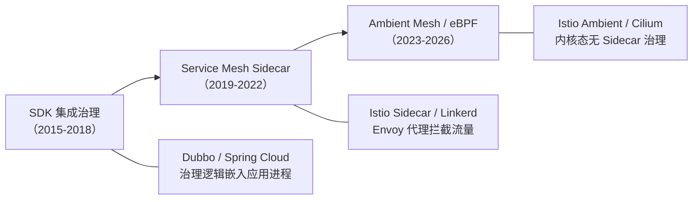
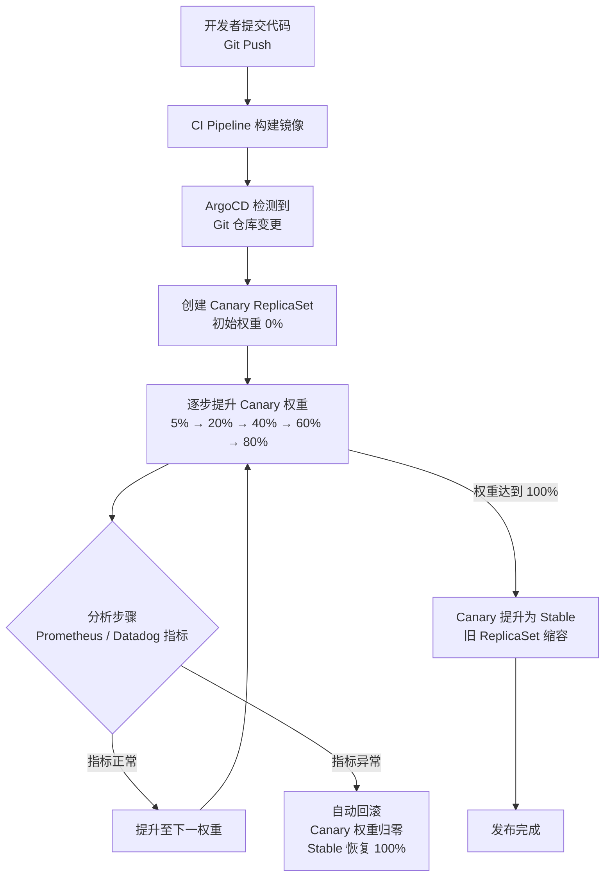

# 微服务治理的手段有哪些

## 概述

微服务架构将单体应用拆分为多个独立部署的服务单元，服务间调用从本地方法调用转变为远程网络调用。这一转变引入了服务提供者不可用、网络分区、节点性能劣化、流量突增等多类故障模式。服务治理（Service Governance）的核心目标，是在这些故障模式下保障服务调用的成功率、稳定性与安全性。

传统服务治理手段以 SDK 集成为主——治理逻辑嵌入服务框架（如 Dubbo、Motan），与业务代码耦合。随着云原生生态的成熟，服务治理经历了从 SDK 集成到 Service Mesh Sidecar 代理、再到 eBPF 内核级治理的演进，治理能力也从基本的节点管理与容错，扩展至零信任安全、自适应控制与 AIOps 智能治理。



本文沿用节点管理、负载均衡、服务路由、服务容错四大核心维度，以 2025-2026 年主流技术栈为基线进行系统阐述，并新增零信任安全治理、自适应治理与 AIOps 智能治理等内容，构建完整的现代微服务治理体系。

---

## 一、节点管理

### 1.1 问题本质

服务调用失败的根本原因可归为两类：服务提供者自身异常（进程崩溃、资源耗尽、GC 停顿）与网络异常（分区、超时、抖动）。节点管理的核心任务是在这些异常发生时，及时将故障节点从可用列表中移除，并在恢复后自动加回。

### 1.2 传统机制回顾

| 机制 | 原理 | 局限 |
|------|------|------|
| 注册中心主动摘除 | 服务提供者定时上报心跳，注册中心超时未收到心跳则摘除节点 | 注册中心与提供者之间网络异常时可能误摘全部节点 |
| 服务消费者摘除 | 消费者调用失败后将节点从本地可用列表移除 | 缺乏全局视角，单消费者判断可能片面；恢复感知延迟大 |

### 1.3 Kubernetes 健康检查体系

在 Kubernetes 环境中，节点生命周期管理由控制面统一执行，通过三类 Probe 实现细粒度的健康状态判定：

- **Startup Probe**：判定应用是否完成启动。对于启动耗时较长的服务（如需加载大量模型数据的推荐服务），Startup Probe 可设置较大的 `failureThreshold` 与 `periodSeconds`，避免在启动阶段被 Liveness Probe 误杀。
- **Liveness Probe**：判定应用是否处于运行状态。检测失败时 kubelet 将重启容器，适用于进程死锁、线程池耗尽等无法自愈的故障。
- **Readiness Probe**：判定应用是否就绪接收流量。检测失败时 Pod 从 Service Endpoints 中移除，但容器不重启。适用于依赖外部服务暂时不可用、本地缓存预热中等场景。

```yaml
apiVersion: v1
kind: Pod
spec:
  containers:
  - name: order-service
    startupProbe:
      httpGet: { path: /actuator/health/liveness, port: 8080 }
      failureThreshold: 30
      periodSeconds: 10
    livenessProbe:
      httpGet: { path: /actuator/health/liveness, port: 8080 }
      failureThreshold: 3
      periodSeconds: 10
    readinessProbe:
      httpGet: { path: /actuator/health/readiness, port: 8080 }
      failureThreshold: 3
      periodSeconds: 5
```

三者的协作逻辑为：Startup Probe 成功前，Liveness/Readiness Probe 不生效；Startup Probe 成功后，Liveness Probe 负责进程级存活保障，Readiness Probe 负责流量接入控制。Pod 仅在 Readiness Probe 通过时才被加入 Service Endpoints，实现流量无损的节点上下线。

### 1.4 Service Mesh Outlier Detection

Kubernetes 健康检查工作在基础设施层，对应用协议层的异常（如 HTTP 5xx 响应率飙升、延迟尾部增大）感知不足。Istio 通过 Outlier Detection（异常值检测）在数据面实现应用协议级的节点健康管理：

```yaml
apiVersion: networking.istio.io/v1beta1
kind: DestinationRule
spec:
  host: order-service
  trafficPolicy:
    outlierDetection:
      consecutive5xxErrors: 3
      interval: 30s
      baseEjectionTime: 60s
      maxEjectionPercent: 50
      minHealthPercent: 25
```

其工作机制为：

1. Envoy 代理对每个后端实例维护独立的错误计数器
2. 在 `interval` 窗口内连续 `consecutive5xxErrors` 次 5xx 响应后，将该实例标记为 ejected
3. 驱逐时长为 `baseEjectionTime`，后续若再次被驱逐则指数增长（2x, 3x...）
4. `maxEjectionPercent` 限制同时被驱逐的实例比例，防止雪崩
5. `minHealthPercent` 保证最低健康实例比例，低于此值时 Outlier Detection 暂停

相比传统注册中心摘除机制，Outlier Detection 具备以下优势：基于实际调用结果而非心跳判定，避免网络分区导致的误摘；驱逐粒度精确到单个消费者视角，不同消费者可独立判定同一实例的可用性；自动恢复机制内置，无需额外干预。

### 1.5 多层节点管理协同

现代微服务架构中，节点管理呈现多层协同态势：

| 层级 | 机制 | 检测维度 | 响应动作 |
|------|------|---------|---------|
| 基础设施层 | Kubernetes Probe | 进程存活 / 就绪状态 | 重启容器 / 移除 Endpoints |
| 服务网格层 | Istio Outlier Detection | 协议级错误率 / 延迟 | 驱逐异常实例 |
| 应用层 | Resilience4j / Sentinel | 业务异常率 / 慢调用比例 | 熔断 / 降级 |

三层协同的关键原则：基础设施层保障进程存活，服务网格层保障协议可用，应用层保障业务语义正确。上层不应重复处理下层已覆盖的故障场景。

---

## 二、负载均衡

### 2.1 问题本质

当服务提供者以集群形态部署时，消费者需从多个可用实例中选择一个发起调用。负载均衡的核心目标是将流量合理分配到各实例，在满足性能差异化的同时避免热点。

### 2.2 传统算法回顾

| 算法 | 原理 | 适用场景 |
|------|------|---------|
| 随机（Random） | 随机选取实例 | 实例配置无差异，调用量大时近似均匀 |
| 轮询（Round Robin） | 按固定权重依次选取 | 实例配置有差异，需按权重分配 |
| 最少活跃调用（Least Active） | 选取当前连接数最少的实例 | 实例性能差异明显 |
| 一致性 Hash（Consistent Hash） | 相同参数映射到同一实例 | 有状态服务、会话保持需求 |

### 2.3 Envoy 负载均衡算法

Istio 数据面基于 Envoy 代理，提供了更丰富的负载均衡策略：

**Ring Hash（环形哈希）**：一致性 Hash 的高级实现。将所有后端实例映射到一个可配置大小的哈希环上（Envoy 默认最小 1024 个条目，上限约 800 万），请求根据某一 Key（如 Header、Cookie）的哈希值在环上查找最近的虚拟节点，进而映射到实际实例。相比传统一致性 Hash，Ring Hash 通过大量虚拟节点实现更均匀的分布，且在实例增减时最小化请求重新映射。

```yaml
apiVersion: networking.istio.io/v1beta1
kind: DestinationRule
spec:
  host: order-service
  trafficPolicy:
    loadBalancer:
      consistentHash:
        httpHeaderName: "x-session-id"
        minimumRingSize: 65536
```

**MagLev**：Google Maglev 负载均衡器的算法实现，用于大规模流量入口。通过查找表（Lookup Table）实现 O(1) 的请求路由，支持一致性哈希特性且性能极高。适用于网关层、入口流量分发等高吞吐场景。

**Least Request**：Envoy 维护每个后端实例的活跃请求计数（通过请求开始/结束事件动态更新），每次选择当前活跃请求数最少的实例。与传统的最少活跃调用算法相比，Envoy 的实现增加了权重因子——即使活跃请求数相同，权重更高的实例也有更大的选中概率，兼顾负载感知与权重分配。

```yaml
apiVersion: networking.istio.io/v1beta1
kind: DestinationRule
spec:
  host: order-service
  trafficPolicy:
    loadBalancer:
      simple: LEAST_REQUEST
```

### 2.4 Kubernetes Service 负载均衡

Kubernetes Service 提供基础的负载均衡能力。ClusterIP 类型 Service 通过 kube-proxy 将流量分发到后端 Pod：

- **iptables 模式**：随机选取后端 Pod，无权重支持，规则数与 Service/Endpoint 数量成线性增长，大规模集群下性能劣化
- **IPVS 模式**：支持 Round Robin、Least Connections、Source Hash 等算法，基于内核哈希表实现 O(1) 查找，适用于大规模集群
- **eBPF 模式（Cilium）**：绕过 iptables/ipvs，直接在内核 eBPF 虚拟机中实现负载均衡，消除 kube-proxy 开销

### 2.5 eBPF 负载均衡（Cilium）

Cilium 利用 eBPF 在 Linux 内核态实现高性能负载均衡，核心优势：

1. **绕过 iptables 栈**：数据包在 socket 层即被重定向到目标 Pod，跳过 Netfilter 整条链路，延迟降低约 30-50%（示意数值，非实测）
2. **Socket 层负载均衡**：在 `cgroup/connect` BPF 程序中将 ClusterIP 直接映射为目标 Pod IP，同节点 Pod 间通信无需经过 NAT
3. **XDP 加速**：在网卡驱动层执行 BPF 程序，实现近线速的 DSR（Direct Server Return）负载均衡

```
传统 kube-proxy 链路：
Pod A → iptables DNAT → ClusterIP → kube-proxy → Pod B

Cilium eBPF 链路：
Pod A → eBPF socket redirect → Pod B（同节点）
Pod A → eBPF XDP → Node B → Pod B（跨节点）
```

### 2.6 负载均衡选型矩阵

| 场景 | 推荐方案 | 理由 |
|------|---------|------|
| 服务网格内服务间调用 | Istio LEAST_REQUEST / RING_HASH | 协议感知，支持权重与一致性哈希 |
| 集群内 Service 基础负载均衡 | Cilium eBPF（替代 kube-proxy） | 高性能，低延迟，无 Sidecar 开销 |
| 入口网关流量分发 | Istio IngressGateway + MagLev | 高吞吐，O(1) 查找 |
| 有状态服务会话保持 | Ring Hash（基于 Session Header） | 虚拟节点均匀分布，故障时最小迁移 |

---

## 三、服务路由

### 3.1 问题本质

服务路由解决的核心问题是：在负载均衡选定候选实例集之后，如何根据业务语义（灰度规则、机房亲和性、版本策略）进一步缩小实例选择范围。路由规则决定了流量的走向，是流量治理的核心手段。

### 3.2 传统路由机制回顾

| 方式 | 原理 | 局限 |
|------|------|------|
| 静态配置 | 路由规则硬编码在消费者本地配置文件中 | 修改需重新部署，无法动态调整 |
| 动态配置 | 路由规则存储在注册中心，消费者定时同步 | 依赖注册中心，规则变更生效有延迟 |

### 3.3 Istio VirtualService 与 DestinationRule

Istio 通过 VirtualService 和 DestinationRule 两个 CRD 实现声明式路由：

**DestinationRule** 定义目标服务的实例分组（Subset）及流量策略：

```yaml
apiVersion: networking.istio.io/v1beta1
kind: DestinationRule
spec:
  host: order-service
  subsets:
  - name: v1
    labels: { version: v1 }
  - name: v2
    labels: { version: v2 }
  - name: v2-canary
    labels: { version: v2, track: canary }
```

**VirtualService** 定义流量路由规则，支持基于 Header、URI、权重等多维度匹配：

```yaml
apiVersion: networking.istio.io/v1beta1
kind: VirtualService
spec:
  hosts: [order-service]
  http:
  - match:
    - headers: { x-user-type: { exact: "vip" } }
    route:
    - destination: { host: order-service, subset: v2 }
  - route:
    - destination: { host: order-service, subset: v1 }
      weight: 90
    - destination: { host: order-service, subset: v2 }
      weight: 10
```

上述配置实现了：VIP 用户请求路由到 v2 版本；普通用户 90% 流量到 v1、10% 到 v2。规则的声明式特性使其天然适配 GitOps 工作流。

### 3.4 Kubernetes Gateway API 路由

Kubernetes Gateway API 是 SIG-Network 主导的标准路由 API，旨在替代 Ingress，提供更细粒度的流量控制能力：

- **GatewayClass**：定义基础设施提供商（如 Istio、Cilium）
- **Gateway**：定义基础设施实例，监听端口与协议
- **HTTPRoute / GRPCRoute / TCPRoute**：定义具体的路由规则

```yaml
apiVersion: gateway.networking.k8s.io/v1
kind: HTTPRoute
spec:
  parentRefs: [{ name: order-gateway }]
  hostnames: ["order.example.com"]
  rules:
  - matches:
    - headers: [{ name: x-user-type, value: vip }]
    backendRefs:
    - name: order-service-v2
      port: 8080
  - backendRefs:
    - name: order-service-v1
      port: 8080
      weight: 90
    - name: order-service-v2
      port: 8080
      weight: 10
```

Gateway API 的核心设计理念是角色分离：集群运维管理 GatewayClass 和 Gateway，应用开发者管理 Route，安全团队管理 ReferenceGrant（原 ReferencePolicy）。这种角色模型使路由配置的权限边界清晰，适配企业级多团队协作。

### 3.5 GitOps 驱动的渐进式交付

传统灰度发布依赖运维人员手动修改路由权重并观察指标，存在操作风险高、回滚速度慢、观测不充分等问题。GitOps 模式下，渐进式交付（Progressive Delivery）将发布流程自动化、可观测化、可回滚化。

主流工具链：Argo Rollouts 与 Flagger。



**Argo Rollouts** 的核心配置示例：

```yaml
apiVersion: argoproj.io/v1alpha1
kind: Rollout
spec:
  strategy:
    canary:
      steps:
      - setWeight: 5
      - pause: { duration: 5m }
      - setWeight: 20
      - pause: { duration: 5m }
      - analysis:
          templates:
          - templateName: success-rate
      - setWeight: 40
      - pause: { duration: 10m }
      - setWeight: 60
      - pause: { duration: 10m }
      - setWeight: 80
      - pause: { duration: 10m }
      canaryService: order-service-canary
      stableService: order-service-stable
```

AnalysisTemplate 定义了基于 SLI/SLO 的自动判定逻辑：

```yaml
apiVersion: argoproj.io/v1alpha1
kind: AnalysisTemplate
spec:
  metrics:
  - name: success-rate
    provider:
      prometheus:
        query: |
          sum(rate(http_requests_total{service="order-service",status!~"5.."}[1m]))
          /
          sum(rate(http_requests_total{service="order-service"}[1m]))
    successCondition: result[0] >= 0.99
    failureLimit: 3
```

### 3.6 路由模式对比

| 路由需求 | 传统方案 | 现代方案 |
|---------|---------|---------|
| 灰度发布 | 手动修改注册中心权重 | Argo Rollouts / Flagger 自动化渐进式交付 |
| 多机房就近访问 | IP 段规则硬编码 | Istio Locality Load Balancing（基于 Kubernetes Topology） |
| A/B 测试 | 消费者端路由规则 | VirtualService Header Match / Gateway API 路由 |
| 蓝绿部署 | 切换 DNS / Nginx upstream | Argo Rollouts BlueGreen Strategy |
| 全链路灰度 | 各服务独立配置路由 | Istio VirtualService 级联 + Header 传播 |

---

## 四、服务容错

### 4.1 问题本质

即使节点管理移除了故障实例、负载均衡选择了最优实例、服务路由将流量导向正确版本，服务调用仍可能失败。网络瞬断、上游服务过载、依赖的中间件不可用等场景下，需要容错机制保障调用链路的整体韧性。

### 4.2 传统容错策略回顾

| 策略 | 原理 | 适用场景 |
|------|------|---------|
| FailOver | 失败后切换到下一实例重试 | 幂等读操作 |
| FailBack | 失败后根据错误信息决定后续策略 | 非幂等写操作 |
| FailCache | 失败后延迟重试 | 上游短暂不可用 |
| FailFast | 失败后立即返回 | 非核心业务降级 |

上述策略至今仍有效，但现代容错体系在此基础上增加了熔断（Circuit Breaking）、限流（Rate Limiting）、舱壁隔离（Bulkhead）等机制，构成多层次的韧性防护。

### 4.3 Resilience4j

Resilience4j 是 Netflix Hystrix 停止维护后的事实标准替代方案，基于函数式编程模型，提供轻量级、可组合的容错原语：

| 模块 | 功能 | 关键参数 |
|------|------|---------|
| CircuitBreaker | 熔断器 | `failureRateThreshold`, `slowCallRateThreshold`, `waitDurationInOpenState` |
| RateLimiter | 限流器 | `limitForPeriod`, `limitRefreshPeriod` |
| Bulkhead | 舱壁隔离 | `maxConcurrentCalls`, `maxWaitDuration` |
| Retry | 重试 | `maxAttempts`, `waitDuration`, `retryOnException` |
| TimeLimiter | 超时控制 | `timeoutDuration` |

熔断器状态机：

```
CLOSED ──(failureRate > threshold)──> OPEN
   ^                                    |
   |                              (waitDuration elapsed)
   |                                    v
   +──(failureRate < threshold)── HALF_OPEN
                                        |
                              (failureRate > threshold)
                                        v
                                     OPEN
```

Resilience4j 的熔断器支持基于慢调用比例（`slowCallRateThreshold`）和失败率（`failureRateThreshold`）双重判定，比 Hystrix 仅支持失败率判定更为精细。其装饰器模式允许自由组合各容错原语：

```java
Supplier<Order> supplier = () -> orderClient.getOrder();
Supplier<Order> decorated = Decorators.ofSupplier(supplier)
    .withCircuitBreaker(circuitBreaker)
    .withRateLimiter(rateLimiter)
    .withBulkhead(bulkhead)
    .withRetry(retry)
    .withTimeLimiter(timeLimiter)
    .get();
```

### 4.4 Sentinel 1.8+

Sentinel 是阿里巴巴开源的面向分布式服务架构的流量控制组件，在 Resilience4j 的基础上增加了更丰富的流量塑形与系统保护能力：

- **流量控制**：基于 QPS / 线程数的直接拒绝、冷启动（Warm Up）、匀速排队
- **熔断降级**：基于慢调用比例、异常比例、异常数的熔断策略
- **系统保护**：从集群整体维度（Load、CPU Usage、RT、线程数、入口 QPS）进行自适应保护
- **热点参数限流**：基于参数值的精细化限流（如针对特定商品 ID 限流）
- **集群流控**：Token Server 模式实现集群维度的统一限流

Sentinel 的核心优势在于其自适应保护机制：当系统 Load 超过阈值且当前并发线程数超过容量时，自动触发全局限流，防止系统过载崩溃。

### 4.5 Istio Circuit Breaker

Istio 在服务网格层提供熔断能力，无需修改应用代码：

```yaml
apiVersion: networking.istio.io/v1beta1
kind: DestinationRule
spec:
  host: payment-service
  trafficPolicy:
    connectionPool:
      tcp:
        maxConnections: 100
      http:
        h2UpgradePolicy: DEFAULT
        http1MaxPendingRequests: 1024
        http2MaxRequests: 1024
    outlierDetection:
      consecutive5xxErrors: 5
      interval: 30s
      baseEjectionTime: 60s
      maxEjectionPercent: 50
```

Istio 熔断的核心逻辑：`connectionPool` 限制并发连接数与请求数，超出限制的请求直接失败（快速失败而非排队等待）；`outlierDetection` 基于实际调用结果驱逐异常实例。两者配合形成"限流 + 驱逐"的双重防护。

### 4.6 多层容错协同策略

| 层级 | 机制 | 保护目标 | 典型参数 |
|------|------|---------|---------|
| 网格层 | Istio Connection Pool + Outlier Detection | 防止上游过载扩散、自动隔离故障实例 | maxConnections, consecutive5xxErrors |
| 应用层 | Resilience4j / Sentinel | 业务语义级容错（幂等重试、降级逻辑） | failureRateThreshold, maxAttempts |
| 基础设施层 | Kubernetes Resource Quota + Limit Range | 防止资源争抢 | CPU/Memory Limits |

关键原则：网格层提供无代码侵入的基线防护，应用层补充业务语义级的容错逻辑。网格层熔断触发后，应用层的重试应感知到熔断状态，避免无效重试加剧问题。推荐实践：应用层 Resilience4j 配合 Istio 熔断，通过 `x-envoy-overloaded` 等 Header 感知网格层状态。

---

## 五、零信任安全治理

传统微服务治理默认集群内部可信，安全边界止于网络入口。零信任架构（Zero Trust Architecture）的核心假设是"永不默认信任，始终验证"，在微服务场景下体现为身份认证、传输加密、授权控制三重保障。

### 5.1 SPIFFE/SPIRE 服务身份

SPIFFE（Secure Production Identity Framework for Everyone）定义了服务身份的标准格式 `spiffe://<trust domain>/<workload identifier>`，SPIRE 是其参考实现。

在 Kubernetes 环境中，SPIRE Agent 通过 Workload Attestor 自动识别 Pod 身份（基于 ServiceAccount、Namespace、Label 等属性），并向其签发 SVID（SPIFFE Verifiable Identity Document）。服务间通信时，双方通过 SVID 进行双向身份验证，替代传统的 IP 地址或 ServiceAccount 级别的粗粒度身份。

### 5.2 mTLS 自动轮转

Istio 在服务网格内实现自动 mTLS（Mutual TLS）：

1. Istiod 作为 CA，为每个 Envoy Sidecar 签发证书
2. 证书有效期默认 24 小时，自动轮转
3. 双向 TLS 握手时，双方验证对端证书的合法性
4. PeerAuthentication 策略可强制要求 mTLS（`STRICT` 模式）

```yaml
apiVersion: security.istio.io/v1beta1
kind: PeerAuthentication
spec:
  mtls:
    mode: STRICT
```

在 Ambient Mesh 模式下，ztunnel 节点级代理负责 mTLS 终结，不再需要每个 Pod 注入 Sidecar，证书管理由节点级统一处理，减少了证书签发与轮转的资源开销。

### 5.3 策略即代码（OPA/Gatekeeper 与 Kyverno）

**OPA/Gatekeeper**：Open Policy Agent 的 Kubernetes 准入控制器。使用 Rego 语言编写策略，在资源创建/更新时进行校验。典型场景：禁止容器以 root 运行、强制要求资源 Limit、限制镜像来源仓库。

```yaml
apiVersion: templates.gatekeeper.sh/v1
kind: ConstraintTemplate
spec:
  targets:
  - rego: |
      violation[{"msg": msg}] {
        container := input.review.object.spec.containers[_]
        container.securityContext.runAsNonRoot != true
        msg := sprintf("Container <%v> must run as non-root", [container.name])
      }
```

**Kyverno**：Kubernetes 原生策略引擎，策略以 YAML 而非 Rego 编写，学习曲线更低。支持 Mutation（自动修改资源，如注入 Sidecar、添加 Label）和 Validation（校验资源合规性）。

```yaml
apiVersion: kyverno.io/v1
kind: ClusterPolicy
spec:
  rules:
  - name: require-resource-limits
    match: { resources: { kinds: ["Pod"] } }
    validate:
      message: "Resource limits are required"
      pattern:
        spec:
          containers:
          - resources:
              limits:
                memory: "?*"
                cpu: "?*"
```

### 5.4 零信任治理体系

| 层面 | 机制 | 工具 |
|------|------|------|
| 身份 | 服务身份标准化 | SPIFFE/SPIRE |
| 传输 | 加密通信与证书轮转 | Istio mTLS / cert-manager |
| 授权 | 细粒度访问控制 | Istio AuthorizationPolicy |
| 合规 | 策略即代码 | OPA/Gatekeeper, Kyverno |
| 审计 | 访问日志与策略变更记录 | Istio Telemetry + Audit |

---

## 六、自适应治理

传统治理策略依赖静态阈值配置（如"5xx 错误率 > 5% 触发熔断"），阈值的设定高度依赖人工经验，且无法适应流量的动态变化。自适应治理（Adaptive Governance）基于 SLI/SLO（Service Level Indicator / Objective）实现自动化的熔断与限流决策。

### 6.1 基于 SLI/SLO 的自动熔断

核心思路：将熔断阈值与服务的 SLO 挂钩，而非设定固定数值。例如，服务的可用性 SLO 为 99.9%，则熔断触发条件为"过去 5 分钟的错误预算消耗率 > 阈值"。

错误预算（Error Budget）计算：

```
Error Budget = 1 - SLO
5 分钟 Error Budget = (1 - 0.999) × 300s = 0.3s

若 5 分钟内累计不可用时间 > 0.3s，则触发熔断
```

实践方案：结合 Prometheus Recording Rules 持续计算 SLI，当 Error Budget 消耗速率超过阈值时，通过 Alertmanager 触发 Webhook，自动更新 Istio VirtualService 权重或 DestinationRule Outlier Detection 参数。

### 6.2 自适应限流

Sentinel 的 System Rule 模式提供基于系统负载的自适应限流：当系统 Load1 超过阈值且当前并发线程数超过系统容量时，自动触发全局限流。限流的强度随系统负载动态调整，而非固定 QPS 阈值。

在服务网格层面，Envoy Rate Limit 支持基于令牌桶的动态限流，限流配置可通过 xDS 动态下发，无需重启代理。结合 Prometheus 指标，可实现"当上游服务延迟 P99 > 200ms 时，自动将限流阈值降低 20%"的自适应策略。

### 6.3 自适应治理架构

```
┌─────────────────────────────────────────────────────┐
│                  Observability Platform              │
│          (Prometheus / Grafana / Datadog)            │
│                                                     │
│   SLI Metrics ──> Error Budget Calculator           │
│                      │                              │
└──────────────────────┼──────────────────────────────┘
                       │ (threshold breach)
                       v
┌─────────────────────────────────────────────────────┐
│              Governance Control Plane                │
│                                                     │
│   Policy Engine ──> Adaptive Rate Limiter           │
│                   > Adaptive Circuit Breaker         │
│                   > Traffic Shifting Controller      │
│                      │                              │
└──────────────────────┼──────────────────────────────┘
                       │ (xDS / API)
                       v
┌─────────────────────────────────────────────────────┐
│                Data Plane (Envoy / eBPF)             │
│                                                     │
│   Rate Limit Filter ──> Circuit Breaker ──> Router  │
└─────────────────────────────────────────────────────┘
```

---

## 七、AIOps 智能治理

自适应治理基于预定义的 SLI/SLO 规则进行决策，其局限性在于：规则本身仍需人工设计，且无法应对规则未覆盖的未知故障模式。AIOps 智能治理引入机器学习模型，实现从异常检测到自动降级再到自动恢复的闭环。

### 7.1 异常检测

传统异常检测基于静态阈值（如"错误率 > 5%"），存在两个问题：阈值设定依赖经验；无法识别缓慢劣化趋势。AIOps 采用时序异常检测算法：

- **统计学方法**：基于 3-Sigma 或 IQR（四分位距）的离群点检测
- **机器学习方法**：Isolation Forest、One-Class SVM 对多维指标进行异常检测
- **深度学习方法**：LSTM-Autoencoder 学习正常流量的时序模式，重构误差超过阈值则判定异常

典型场景：某服务 P99 延迟从 50ms 缓慢劣化至 200ms，虽然未触发任何静态阈值，但时序模型识别出异常趋势，提前介入。

### 7.2 自动降级

异常检测触发后，AIOps 平台根据故障模式自动选择降级策略：

| 故障模式 | 自动降级策略 | 实施方式 |
|---------|------------|---------|
| 上游服务延迟劣化 | 降级为缓存响应 / 默认值 | 更新 VirtualService 故障注入 + 本地降级 |
| 上游服务错误率飙升 | 熔断 + 流量转移 | 更新 DestinationRule Outlier Detection |
| 全局流量突增 | 限流 + 非核心服务降级 | 更新 Envoy Rate Limit + VirtualService 权重 |
| 依赖链路不可用 | 功能降级（关闭非核心功能） | 更新 Feature Flag（如 LaunchDarkly / Unleash） |

### 7.3 自动恢复

AIOps 的自动恢复并非简单地将降级策略回退，而是基于持续观测的渐进式恢复：

1. **探测阶段**：向被熔断的实例发送少量探测流量（1-5%）
2. **评估阶段**：观察探测流量的 SLI 指标是否恢复正常
3. **渐进恢复**：若指标正常，逐步提升流量比例（5% → 20% → 50% → 100%）
4. **确认阶段**：全量恢复后持续观察一个完整的 SLO 窗口

### 7.4 AIOps 治理闭环

```
异常检测 ──> 根因分析 ──> 策略决策 ──> 自动降级
    ^                                        │
    │                                        v
    └── 效果评估 <── 渐进恢复 <── 故障消除
```

当前 AIOps 智能治理仍处于早期实践阶段，核心挑战包括：误报率与漏报率的平衡、自动操作的安全性保障（需设置爆炸半径上限）、模型的持续训练与漂移检测。推荐策略：AIOps 初期以辅助决策为主（推荐操作但需人工确认），逐步验证模型准确率后再放开自动执行权限。

---

## 技术演进时间线

| 时间段 | 节点管理 | 负载均衡 | 服务路由 | 服务容错 |
|-------|---------|---------|---------|---------|
| 2015-2018 | 注册中心心跳摘除 / 消费者端摘除 | Random / RoundRobin / LeastActive / ConsistentHash | 静态配置 / 注册中心动态配置 | FailOver / FailBack / FailCache / FailFast |
| 2019-2021 | Kubernetes Probe / Consul Health Check | Envoy LB（Round Robin / Least Request / Ring Hash） | Istio VirtualService / Consul Connect | Hystrix → Resilience4j / Sentinel |
| 2022-2024 | Istio Outlier Detection / K8s Probe 三件套 | Cilium eBPF LB / MagLev | Gateway API / Argo Rollouts / Flagger | Istio Circuit Breaker / Envoy Rate Limit |
| 2025-2026 | SPIRE 身份验证 + 多层节点管理协同 | Cilium eBPF Socket LB + Istio Ambient | GitOps 渐进式交付 + SLO 驱动路由 | 自适应熔断/限流 + AIOps 智能降级 |

---

## 架构决策指南：治理模式对比

### SDK 集成 vs Service Mesh vs eBPF

| 维度 | SDK 集成（Dubbo/Spring Cloud） | Service Mesh（Istio Sidecar） | eBPF/Ambient Mesh（Cilium/Istio Ambient） |
|------|------|------|------|
| 代码侵入性 | 高（依赖框架 SDK） | 低（Sidecar 透明拦截） | 无（内核态 / 节点级代理） |
| 语言依赖 | 强（Java 生态为主） | 无（语言无关） | 无（语言无关） |
| 运行开销 | 无额外开销 | 每 Pod 一对 Sidecar（约 50-100MB 内存） | 节点级共享（约 100MB/节点） |
| 治理能力 | 深度业务语义支持 | 协议级全面治理 | 网络级高性能治理，协议级能力持续补全 |
| 可观测性 | 依赖应用埋点 | 自动生成 L7 指标 | 自动生成 L3/L4 指标，L7 需配置 |
| 升级难度 | 高（需重新编译部署） | 中（独立升级 Control Plane） | 低（eBPF 程序热更新） |
| 成熟度 | 成熟 | 成熟 | 快速演进中 |
| 适用场景 | Java 单体架构微服务化 | 多语言混合 / 大规模微服务 | 超大规模集群 / Sidecar 开销敏感场景 |

### 决策流程

1. **是否已有强 SDK 依赖？** 若团队深度依赖 Dubbo/Spring Cloud，且全部为 Java 技术栈，SDK 集成模式仍为务实选择，可逐步引入 Mesh 能力
2. **是否多语言技术栈？** 是则 Service Mesh 是必选项，SDK 模式无法覆盖非 Java 服务
3. **集群规模是否超过 1000 节点？** 是则 Sidecar 开销成为显著成本因子，优先评估 Ambient Mesh / eBPF 方案
4. **是否对延迟极度敏感？** 是则 eBPF 方案可提供最低的网络栈开销
5. **混合策略**：大多数生产环境采用混合模式——核心链路使用 Service Mesh 获得完整的 L7 治理能力，基础设施层使用 eBPF 实现高性能 L3/L4 负载均衡与网络策略

---

## 小结

微服务治理手段围绕"保障服务调用成功率"这一核心目标，从节点管理、负载均衡、服务路由、服务容错四个维度构建防护体系。2025-2026 年的技术栈演进使治理能力发生了质变：

**节点管理**从注册中心心跳摘除演变为 Kubernetes Probe + Istio Outlier Detection + SPIRE 身份验证的多层协同机制，实现了从基础设施层到应用协议层再到身份层的全栈节点生命周期管理。

**负载均衡**从应用内算法实现演变为 Envoy 代理策略 + eBPF 内核级负载均衡的分层架构，Ring Hash/MagLev/Least Request 等算法提供了更精细的流量分配控制，Cilium eBPF 在内核态实现了近线速的数据面转发。

**服务路由**从静态配置与注册中心动态配置演变为 Istio VirtualService + Gateway API 的声明式路由，GitOps 驱动的渐进式交付（Argo Rollouts / Flagger）使金丝雀发布从手动操作变为基于 SLI/SLO 的自动化流程。

**服务容错**从 FailOver/FailBack 等基础策略演变为 Resilience4j + Sentinel + Istio Circuit Breaker 的多层容错体系，并进一步向基于 Error Budget 的自适应熔断/限流与 AIOps 智能降级演进。

新增的零信任安全治理（SPIFFE/SPIRE + mTLS + OPA/Kyverno）将安全从边界防护转变为全链路身份验证与授权控制，自适应治理与 AIOps 智能治理则使治理决策从静态规则驱动向数据驱动与模型驱动演进。

治理模式的选型需根据团队技术栈、集群规模、延迟敏感度等因素综合决策。SDK 集成、Service Mesh、eBPF 三种模式并非替代关系，而是互补关系——生产环境中混合使用是常态。核心原则：治理能力应尽量下沉至基础设施层，业务代码专注于业务逻辑，治理策略应声明式、可观测、可回滚。

---

## 思考题

1. 你的业务场景中，Kubernetes Probe、Istio Outlier Detection、应用层熔断这三层节点管理机制各自覆盖了哪些故障场景？是否存在重叠或盲区？
2. 若你的服务 P99 延迟要求低于 10ms，Sidecar 引入的额外延迟是否可接受？你会选择哪种治理模式？
3. 在 AIOps 智能治理中，如何设定自动降级的"爆炸半径上限"，避免自动操作本身引发更大规模故障？
