# Dubbo框架里的微服务组件

> **版本基线**：Apache Dubbo 3.3.6 | Triple 协议 | 应用级服务发现 | Kubernetes 1.30+
> **阅读时间**：约 35 分钟
> **前置知识**：[[03]] 初探微服务架构

## 概述

经过前几篇对微服务架构基本原理的阐述，我们已经明确了微服务架构的六大核心组件：服务描述、服务发现、服务调用、服务监控、服务追踪以及服务治理。然而，原理层面的认知仅是起点——每个组件从架构设计和代码实现上究竟如何落地？组件之间又如何串联为一个完整的微服务框架？

本篇以 Apache Dubbo 3.3 为实例，系统剖析微服务框架的核心组件实现。Dubbo 从 2.x 时代演进至 3.x，经历了三次架构级变革：**Triple 协议替代 Dubbo 协议**、**应用级服务发现替代接口级服务发现**、**Proxyless Service Mesh 模式接入云原生基础设施**。理解这些变革的动因与实现，是掌握现代微服务框架设计的关键。

---

## 一、Dubbo 3.3 架构全景

### 1.1 分层架构总览

Dubbo 的架构自始至终遵循**微内核 + 插件**的设计原则，以 URL 为统一配置信息格式，通过 SPI（Service Provider Interface）扩展机制实现所有功能点的可替换性。Dubbo 3.3 在保持这一核心设计哲学的同时，对多个层次进行了重大升级。

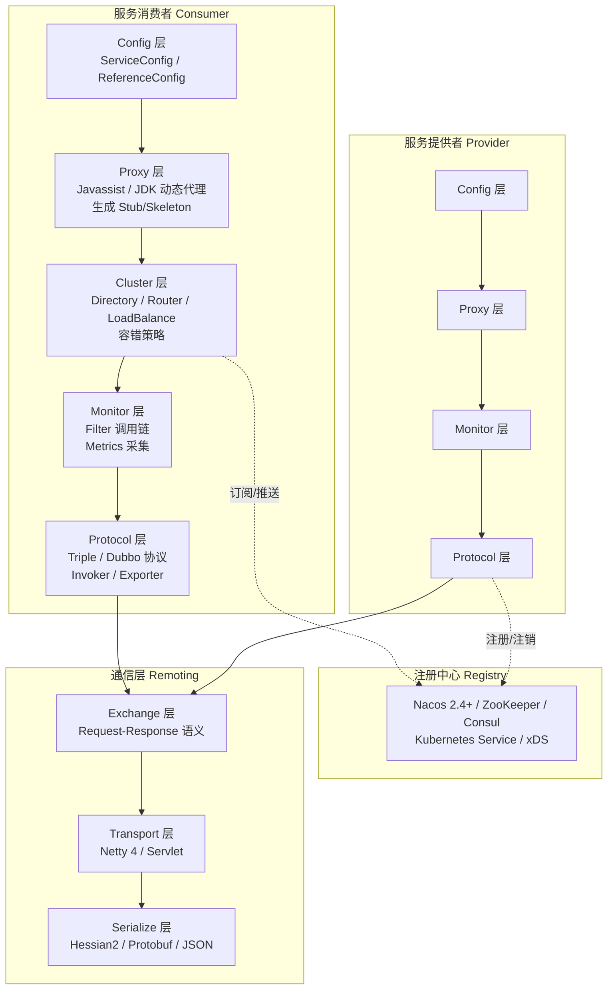

### 1.2 十层架构详解

Dubbo 的代码架构分为十层，每层单向依赖上层，各层可脱离上层独立复用：

| 层次 | 核心抽象 | 扩展接口 | Dubbo 3.3 关键变化 |
|------|---------|---------|-------------------|
| **Service** | 业务接口 | — | 支持 Java Interface 与 Protobuf IDL 双模式 |
| **Config** | ServiceConfig / ReferenceConfig | ConfigCenterFactory | Spring Boot 自动配置、dubbo.properties、环境变量多源统一 |
| **Proxy** | ServiceProxy | ProxyFactory | Javassist / JDK 动态代理，支持接口级与 IDL 级代理生成 |
| **Registry** | 服务 URL | RegistryFactory / Registry / RegistryService | **应用级服务发现**（3.x 核心变更），MetadataService 内置 |
| **Cluster** | Invoker | Cluster / Directory / Router / LoadBalance | 新增 MeshRouter、TagRouter 增强、自适应负载均衡 |
| **Monitor** | Statistics | MonitorFactory / Monitor / MonitorService | Micrometer Metrics 集成、OpenTelemetry Tracing 对接 |
| **Protocol** | Invocation / Result | Protocol / Invoker / Exporter | **Triple 协议**（3.x 默认协议），兼容 Dubbo 协议 |
| **Exchange** | Request / Response | Exchanger / ExchangeChannel | HTTP/2 帧协议、流式通信支持 |
| **Transport** | Message | Channel / Transporter / Client / Server / Codec | Netty 4、Servlet 容器复用 |
| **Serialize** | — | Serialization / ObjectInput / ObjectOutput | Hessian2、Protobuf、JSON、Kryo、FST 等 |

### 1.3 核心领域模型

Dubbo 的核心领域模型围绕三个概念构建：

- **Protocol（服务域）**：Invoker 暴露与引用的主功能入口，管理 Invoker 生命周期
- **Invoker（实体域）**：Dubbo 的核心模型，代表一个可执行体——可能是本地实现、远程实现或集群实现
- **Invocation（会话域）**：持有调用过程中的变量，如方法名、参数类型、参数值

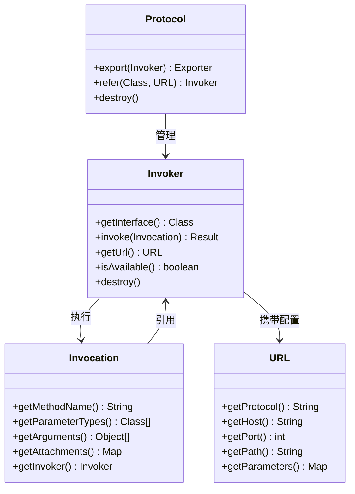

**URL 是 Dubbo 的统一配置总线**。所有扩展点通过 URL 传递配置信息，URL 的协议头决定了 SPI 自适应扩展的选择逻辑。例如：

```
# Triple 协议的服务暴露 URL
tri://192.168.1.100:20880/org.apache.dubbo.demo.DemoService?version=1.0.0&group=production

# 注册中心 URL
nacos://127.0.0.1:8848/org.apache.dubbo.registry.RegistryService?export=URL.encode(...)

# 应用级服务发现 URL（Dubbo 3.x 新格式）
service-discovery-registry://127.0.0.1:8848/org.apache.dubbo.registry.RegistryService
```

---

## 二、服务发布与引用

### 2.1 从 XML 配置到注解驱动

原文以 XML 配置方式讲解 Dubbo 的服务发布与引用，这是 Dubbo 2.x 时代的主流配置方式。Dubbo 3.3 仍兼容 XML 配置，但推荐使用 **Spring Boot 注解驱动**模式：

**服务提供者（注解方式）**：

```java
// 服务接口定义
public interface DemoService {
    String sayHello(String name);

    // 流式通信（Triple 协议新特性）
    StreamObserver<String> sayHelloStream(StreamObserver<String> responseObserver);
}

// 服务实现
@DubboService(version = "1.0.0", group = "production")
public class DemoServiceImpl implements DemoService {
    @Override
    public String sayHello(String name) {
        return "Hello " + name;
    }

    @Override
    public StreamObserver<String> sayHelloStream(StreamObserver<String> responseObserver) {
        return new StreamObserver<>() {
            @Override
            public void onNext(String data) {
                responseObserver.onNext("Echo: " + data);
            }
            @Override
            public void onError(Throwable throwable) {
                responseObserver.onError(throwable);
            }
            @Override
            public void onCompleted() {
                responseObserver.onCompleted();
            }
        };
    }
}
```

**服务消费者（注解方式）**：

```java
@Component
public class DemoConsumer {
    @DubboReference(version = "1.0.0", group = "production",
                     timeout = 3000, retries = 2,
                     loadbalance = "adaptive")  // 自适应负载均衡
    private DemoService demoService;

    public String doSayHello() {
        return demoService.sayHello("world");
    }
}
```

### 2.2 Protobuf IDL 模式

Dubbo 3.3 引入了基于 Protobuf IDL 的服务定义模式，适用于跨语言场景：

```protobuf
syntax = "proto3";
option java_multiple_files = true;
package org.apache.dubbo.demo;

message GreeterRequest {
  string name = 1;
}

message GreeterReply {
  string message = 1;
}

service Greeter {
  rpc greet(GreeterRequest) returns (GreeterReply);
  // 服务端流
  rpc greetServerStream(GreeterRequest) returns (stream GreeterReply);
  // 双向流
  rpc greetStream(stream GreeterRequest) returns (stream GreeterReply);
}
```

通过 Dubbo 提供的 `protoc` 编译插件，IDL 自动生成接口定义和 Stub 代码，后续编码与 Java Interface 模式基本一致。

### 2.3 两种编程模型的选择

| 决策维度 | Java Interface | Protobuf IDL |
|---------|---------------|-------------|
| 跨语言需求 | 仅 Java | Java / Go / Rust / Node.js |
| 学习成本 | 低（Dubbo 老用户零成本迁移） | 中（需掌握 Protobuf 语法） |
| gRPC 互操作 | 不支持 | 原生支持 |
| 序列化方式 | Hessian2 / JSON / Kryo 等 | Protobuf Binary / Protobuf JSON |
| 流式通信 | 支持（基于 StreamObserver） | 支持（原生 gRPC 语义） |
| REST 支持 | 支持（Spring MVC / JAX-RS 注解） | 支持（Triple 原生 HTTP 访问） |
| 迁移成本 | Dubbo 2.x 用户零成本 | 需重写接口定义 |

### 2.4 服务发布流程

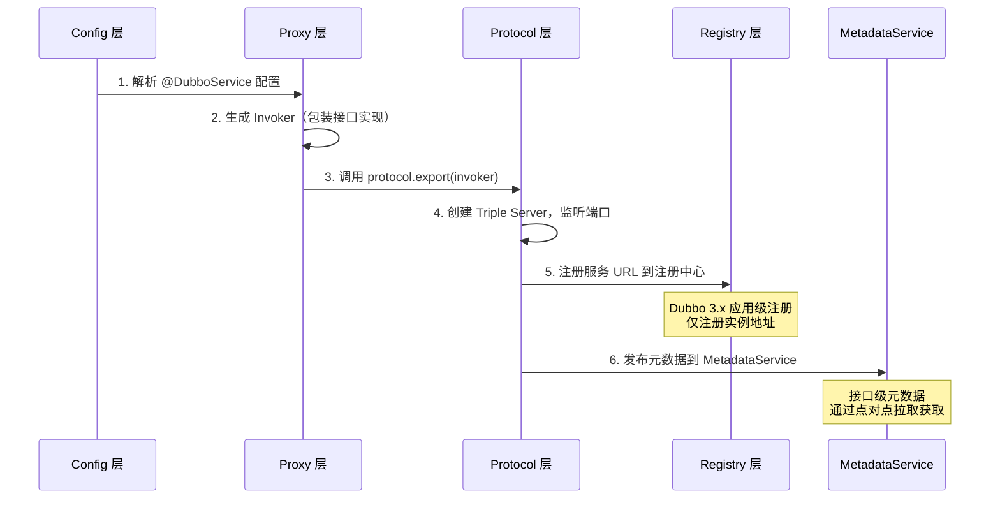

---

## 三、服务注册与发现

### 3.1 接口级 vs 应用级服务发现

这是 Dubbo 3.x 最核心的架构变更。原文描述的注册机制属于**接口级服务发现**——每个 RPC Service 注册一条独立的 URL 到注册中心。当应用规模扩大时，这种模式面临严重的容量瓶颈：

**接口级服务发现的数据膨胀问题**：

假设一个典型 Provider 应用部署 10 个 RPC Service、100 个机器实例，注册中心的数据量为 **10 × 100 = 1000 条**。数据从两个维度膨胀：
- 地址维度：100 个唯一实例地址膨胀 10 倍
- 服务维度：10 个唯一服务元数据膨胀 100 倍

在阿里巴巴和工商银行的生产环境中，当集群规模达到数万实例时，注册中心存储容量触顶、推送效率骤降，消费者端框架内存占用超过 40%。

**应用级服务发现的设计方案**：

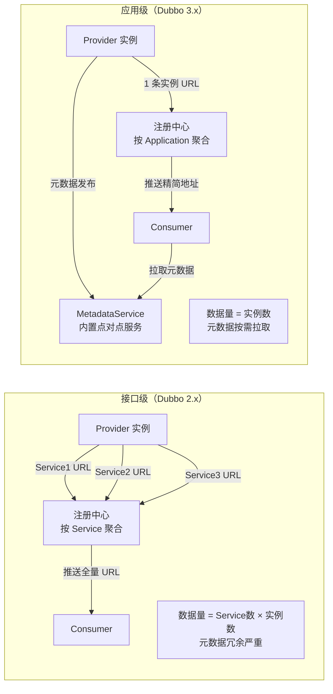

应用级服务发现的核心变化：

1. **注册粒度从 Service 变为 Application**：一个 Provider 实例仅注册一条地址到注册中心
2. **注册数据精简**：仅保留核心 IP 和端口信息，去除冗余的 RPC 元数据
3. **元数据分离**：引入内置 MetadataService，Consumer 通过点对点拉取获取接口级元数据
4. **运行时兼容**：Consumer 获取精简地址 + 元数据后，在运行时还原为与 Dubbo 2.x 兼容的 URL 格式

### 3.2 注册中心选型

| 注册中心 | 版本 | 适用场景 | 与 Dubbo 3.3 集成方式 |
|---------|------|---------|---------------------|
| **Nacos** | 2.4+ | 阿里系生态、配置中心一体化 | 原生支持，推荐首选 |
| **ZooKeeper** | 3.8+ | 传统 Hadoop 生态、强一致性需求 | 原生支持，应用级需开启 migration |
| **Consul** | 1.18+ | 多数据中心、Service Mesh 集成 | 原生支持 |
| **Kubernetes Service** | 1.30+ | 云原生部署、消除外部注册中心依赖 | xDS 协议对接，Proxyless 模式 |
| **etcd** | 3.5+ | 轻量级、Kubernetes 底层存储 | 社区扩展支持 |

### 3.3 Kubernetes 原生服务发现

Dubbo 3.3 支持两种 Kubernetes 部署模式：

**模式一：传统注册中心 + Kubernetes 调度**

Nacos/ZooKeeper 仍作为注册中心，Kubernetes 仅负责应用生命周期调度。此模式与传统部署无本质差异，适合平滑迁移。

**模式二：Kubernetes Service 原生注册**

消除外部注册中心依赖，Kubernetes APIServer 承担注册中心角色，Dubbo 通过 xDS 协议获取 Service 和 Endpoint 信息：

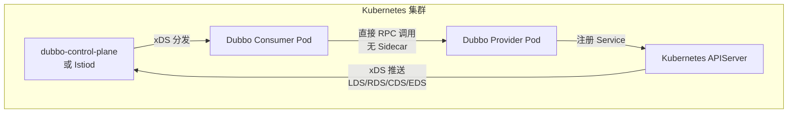

---

## 四、服务调用

### 4.1 Triple 协议：Dubbo 3.x 的默认协议

原文详细描述了 Dubbo 私有协议的报文格式。Dubbo 3.x 将默认协议从 Dubbo 协议切换为 **Triple 协议**（3.2 起默认），这是一个基于 HTTP/2 的全新协议设计，核心优势如下：

| 对比维度 | Dubbo 协议（2.x 默认） | Triple 协议（3.x 默认） |
|---------|----------------------|----------------------|
| 传输层 | TCP 长连接 | HTTP/2（支持 HTTP/3 协商） |
| 协议格式 | 私有二进制协议（16 字节固定头） | 基于 HTTP/2 帧，兼容 gRPC |
| 跨语言 | 仅 Java SDK | Java / Go / Rust / Node.js |
| 流式通信 | 不支持 | Server Stream / Client Stream / Bidirectional Stream |
| 网关穿透 | 需专用代理 | 原生支持 HTTP 网关、API Gateway |
| REST 访问 | 不支持 | 原生 cURL 访问 + REST 注解增强 |
| 互操作性 | 仅 Dubbo 间通信 | 与 gRPC 生态互操作 |
| 安全性 | 无内置 TLS | 支持 TLS/mTLS、HTTP/3 强制 TLS 1.3 |

### 4.2 Triple 协议的流式通信

Triple 协议基于 HTTP/2 继承了全双工流式通信能力，提供三种流式调用模式：

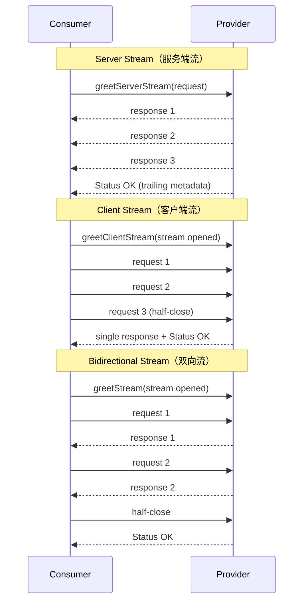

**流式通信的适用场景**：

- **大数据量传输**：单次 RPC 请求/响应无法承载的数据，需分批发送
- **有序流处理**：数据必须按发送顺序处理，且无确定边界
- **推送场景**：同一调用上下文内多次发送和处理消息

**流语义保证**：
- 提供消息边界，允许独立消息处理
- 严格有序，发送顺序与接收顺序一致
- 全双工，发送无需等待
- 支持取消和超时

### 4.3 Triple 3.3 新特性

Dubbo 3.3 对 Triple 协议进行了重大增强：

**1. 全新 REST 支持**

基于 Triple 现有 HTTP 协议栈，无需额外配置或新端口，即可直接暴露 REST 风格 API：

```java
// Basic 方言：开箱即用
public interface DemoService {
    String hello(String name);

    @Mapping(path = "/hi", method = HttpMethods.POST)
    String hello(User user, @Param(value = "c", type = ParamType.Header) int count);
}

// Spring MVC 方言
@RestController
@RequestMapping("/demo")
public interface DemoService {
    @GetMapping(value = "/hello")
    String sayHello();
}

// JAX-RS 方言
@Path("/demo")
public interface DemoService {
    @GET
    @Path("/hello")
    String sayHello();
}
```

REST 能力核心特性：
- **去中心化**：无需网关转发，Triple 服务直接暴露 REST API
- **多方言支持**：Basic / Spring MVC / JAX-RS 三种注解风格
- **高性能路由**：采用 Radix Tree + Zero Copy 优化路由性能
- **Servlet 设施复用**：支持 Servlet API 和 Filter，可集成 OAuth、Spring Security
- **20+ 扩展点**：自定义方言、参数获取、类型转换、错误处理

**2. HTTP/3 协议支持**

Triple 3.3 实现了 HTTP/3（QUIC）协议支持，默认启用 HTTP/3 协商：
- 连接先通过 HTTP/2 建立，若服务端返回 Alt-Svc 头标明支持 HTTP/3，客户端自动切换
- HTTP/3 强制 TLS 1.3 加密，提供更安全的通信保障
- 在高丢包率环境下，HTTP/3 的 QPS 和 RT 表现显著优于 HTTP/2

**3. Servlet 容器复用**

可复用 Spring Boot 的 Servlet 监听端口访问 HTTP 流量，无需 Netty 监听新端口，简化部署、降低维护成本。

### 4.4 通信框架与序列化

Dubbo 3.3 的通信层以 Netty 4 为默认实现，同时支持 Servlet 容器模式。序列化方式的选择取决于协议和编程模型：

| 序列化方式 | 适用协议 | 性能 | 跨语言 | 备注 |
|-----------|---------|------|--------|------|
| **Protobuf** | Triple (IDL 模式) | ★★★★★ | ✅ | 推荐跨语言场景 |
| **Hessian2** | Triple (Java Interface) / Dubbo | ★★★ | ❌ | Dubbo 老用户默认选择 |
| **JSON** | Triple REST | ★★ | ✅ | REST API 场景 |
| **Kryo** | Dubbo | ★★★★ | ❌ | 需注册类 |
| **FST** | Dubbo | ★★★★ | ❌ | 需注册类 |
| **JDK** | Dubbo | ★ | ❌ | 不推荐生产使用 |

---

## 五、服务监控

### 5.1 从 MonitorFilter 到 Micrometer + OpenTelemetry

原文描述的监控机制基于 MonitorFilter 拦截调用链进行埋点数据采集。Dubbo 3.3 在保留 Filter 机制的同时，全面对接了现代可观测性体系：

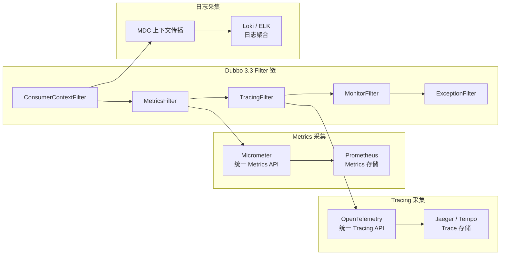

### 5.2 Filter 调用链机制

Dubbo 的 Filter 机制是其可扩展性的核心体现。无论是服务提供者还是服务消费者，每次服务调用都会经过 Filter 调用链拦截。开发者可通过 SPI 机制自定义 Filter，实现特定功能：

```java
@Activate(group = CommonConstants.CONSUMER)
public class CustomMetricsFilter implements Filter {
    @Override
    public Result invoke(Invoker<?> invoker, Invocation invocation) throws RpcException {
        long startTime = System.nanoTime();
        try {
            Result result = invoker.invoke(invocation);
            // 记录成功指标
            Metrics.counter("rpc.calls",
                "service", invocation.getServiceName(),
                "method", invocation.getMethodName(),
                "status", "success"
            ).increment();
            return result;
        } catch (Exception e) {
            // 记录失败指标
            Metrics.counter("rpc.calls",
                "service", invocation.getServiceName(),
                "method", invocation.getMethodName(),
                "status", "error"
            ).increment();
            throw e;
        } finally {
            long duration = System.nanoTime() - startTime;
            Metrics.timer("rpc.duration",
                "service", invocation.getServiceName()
            ).record(duration, TimeUnit.NANOSECONDS);
        }
    }
}
```

### 5.3 内置可观测性指标

Dubbo 3.3 通过 Micrometer 暴露以下核心指标：

| 指标类别 | 指标名称 | 说明 |
|---------|---------|------|
| 调用计数 | `dubbo.invocation.count` | 按服务、方法、分组统计调用次数 |
| 调用耗时 | `dubbo.invocation.duration` | 调用耗时分布（P50/P95/P99） |
| 并发数 | `dubbo.invocation.concurrent` | 当前并发调用数 |
| QPS | `dubbo.invocation.qps` | 每秒请求数 |
| 错误率 | `dubbo.invocation.error_rate` | 调用失败率 |

---

## 六、服务治理

### 6.1 Cluster 层架构

Dubbo 的服务治理能力集中在 Cluster 层，其核心设计是将多个 Invoker 伪装为一个 Invoker，对上层透明：

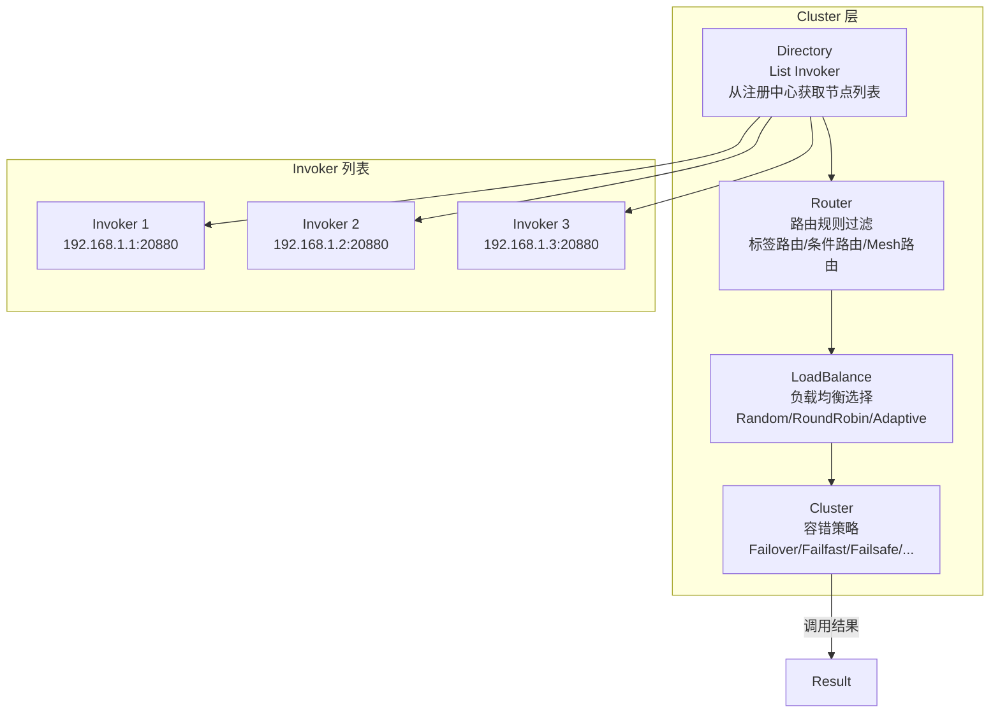

### 6.2 核心治理组件

#### 节点管理：Directory

Directory 负责从注册中心获取服务节点列表并封装为 `List<Invoker>`。其值随注册中心推送动态变化。Dubbo 3.3 中，Directory 同时支持接口级和应用级两种地址模型，通过 MigrationInvoker 与迁移规则实现平滑迁移。

#### 负载均衡：LoadBalance

Dubbo 3.3 提供多种负载均衡算法，并新增**自适应负载均衡**：

| 算法 | 策略 | 适用场景 |
|------|------|---------|
| **Random** | 加权随机（默认） | 通用场景 |
| **RoundRobin** | 加权轮询 | 请求量均匀的场景 |
| **LeastActive** | 最少活跃调用数 | 处理能力差异大的集群 |
| **ShortestResponse** | 最短响应时间 | 对延迟敏感的场景 |
| **ConsistentHash** | 一致性哈希 | 有状态请求、会话保持 |
| **Adaptive** | 自适应（3.x 新增） | 根据节点实时负载动态调整权重 |

#### 服务路由：Router

Router 负责从多个 Invoker 中按路由规则选出子集。Dubbo 3.3 增强了路由能力：

| 路由类型 | 说明 | 适用场景 |
|---------|------|---------|
| **ConditionRouter** | 条件表达式路由 | 读写分离、黑白名单 |
| **TagRouter** | 标签路由 | 灰度发布、机房隔离 |
| **MeshRouter** | Mesh 路由（3.x 新增） | Istio VirtualService 规则映射 |
| **ScriptRouter** | 脚本路由 | 动态灵活路由规则 |

#### 服务容错：Cluster 策略

| 策略 | 行为 | 适用场景 |
|------|------|---------|
| **Failover**（默认） | 失败自动切换其他 Invoker 重试 | 读操作、幂等写操作 |
| **Failfast** | 失败立即报错 | 非幂等写操作 |
| **Failsafe** | 失败忽略，仅记录日志 | 日志写入、监控上报 |
| **Failback** | 失败后台定时重试 | 消息通知、异步操作 |
| **Forking** | 并行调用多个 Invoker，取最快返回 | 实时性要求极高的场景 |
| **Broadcast** | 广播所有 Invoker | 缓存更新、通知 |

### 6.3 Proxyless Service Mesh 模式

Dubbo 3.1+ 引入了 Proxyless Service Mesh 模式，允许 Dubbo 应用直接与 Istio 控制平面通信，避免 Sidecar 代理的性能损耗：

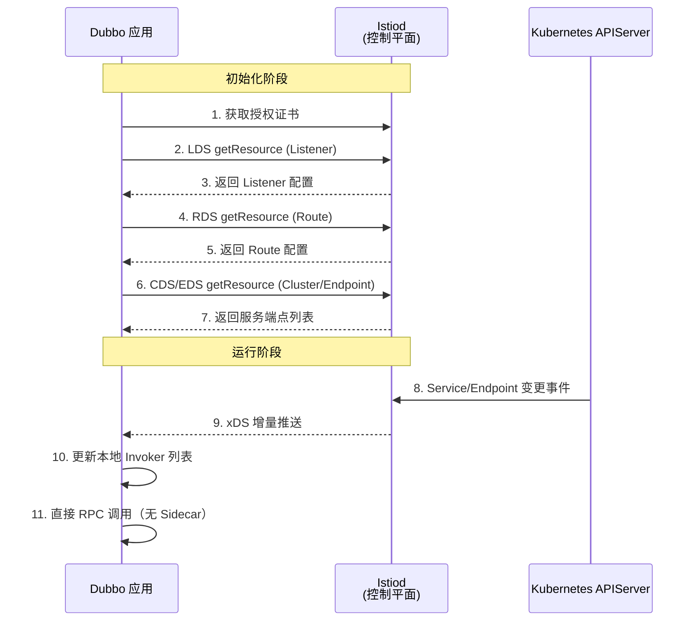

Proxyless 模式的核心优势：
- **零 Sidecar 开销**：无额外代理层，延迟降低 30%-50%（示意数值，非实测）
- **统一治理**：通过 xDS 协议获取 Istio 的流量管理、安全策略
- **平滑迁移**：Dubbo 应用无需改造即可接入 Service Mesh 体系
- **断线重连**：Istiod 离线后自动重连，无需重新部署应用

---

## 七、一次完整的服务调用流程

### 7.1 消费者端调用链

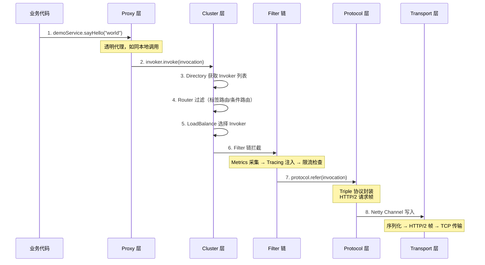

### 7.2 提供者端处理链

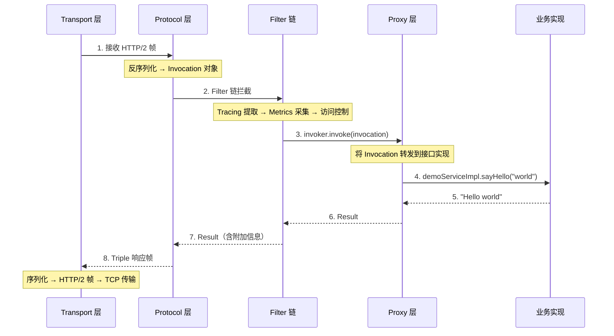

### 7.3 Dubbo 2.x vs 3.x 调用流程对比

| 流程环节 | Dubbo 2.x | Dubbo 3.3 |
|---------|-----------|-----------|
| 服务定义 | XML 配置 + Java Interface | 注解驱动 + Java Interface / Protobuf IDL |
| 协议 | Dubbo 私有协议（TCP） | Triple 协议（HTTP/2，支持 HTTP/3） |
| 注册发现 | 接口级服务发现 | 应用级服务发现 + MetadataService |
| 负载均衡 | Random / RoundRobin / LeastActive | 新增 Adaptive / ShortestResponse |
| 路由 | 条件路由 / 标签路由 | 新增 MeshRouter（xDS 规则映射） |
| 监控 | MonitorFilter + 简单计数 | Micrometer Metrics + OpenTelemetry Tracing |
| 通信模式 | 仅 Unary 调用 | Unary + Server Stream + Client Stream + Bidirectional Stream |
| Mesh 支持 | 无 | Proxyless 模式（xDS 协议） |

---

## 技术演进时间线

| 时间 | 里程碑 | 影响 |
|------|--------|------|
| 2011 | Dubbo 开源，接口级服务发现 + Dubbo 私有协议 | 奠定 Java RPC 框架标准 |
| 2017 | 捐赠 Apache，进入孵化期 | 社区化运营，生态扩展 |
| 2018 | Dubbo 2.7，异步支持、TLS | 原文描述的技术状态 |
| 2021 | Dubbo 3.0，应用级服务发现 + Triple 协议 | 解决大规模集群容量瓶颈 |
| 2022 | Dubbo 3.1，Proxyless Service Mesh | xDS 协议对接，云原生适配 |
| 2023 | Dubbo 3.2，Triple 协议成为默认 | HTTP/2 基础、流式通信、gRPC 互操作 |
| 2024 | Dubbo 3.3，Triple REST + HTTP/3 | 去中心化 REST、QUIC 协议、Servlet 复用 |
| 2025 | Dubbo 3.3.6，持续稳定版 | 生产级稳定性验证（阿里巴巴双 11 全量运行） |

---

## 架构决策指南

> **何时选择 Dubbo 3.3？**
> - Java 为主的微服务系统，需要高性能 RPC 通信
> - 从 Dubbo 2.x 迁移，希望零成本升级到云原生架构
> - 需要跨语言通信（Java + Go + Rust），且希望统一治理
> - 计划接入 Service Mesh，但暂不希望引入 Sidecar 开销

> **何时避免 Dubbo？**
> - 非 Java 技术栈为主（考虑 gRPC 或 Spring Cloud）
> - 服务规模极小（< 10 个服务），框架引入的复杂度不值得
> - 已深度绑定 Spring Cloud 生态且无迁移需求

> **Triple 协议 vs Dubbo 协议？**
> - 新项目：**必须选择 Triple**，这是 Dubbo 3.x 的默认和推荐协议
> - 老项目迁移：先以 Dubbo 协议运行，通过双注册模式逐步切换到 Triple
> - 需要网关穿透或 REST 访问：**必须选择 Triple**

> **Java Interface vs Protobuf IDL？**
> - 纯 Java 团队、无跨语言需求：**Java Interface**，迁移成本最低
> - 多语言团队或计划 gRPC 互操作：**Protobuf IDL**，一次定义多语言使用
> - 混合场景：核心服务用 IDL，内部服务用 Java Interface

---

## 小结

本篇以 Apache Dubbo 3.3 为实例，系统剖析了微服务框架六大核心组件的实现方式，以及 Dubbo 从 2.x 到 3.x 的三次架构级变革：

- **Triple 协议**：基于 HTTP/2 的新一代 RPC 协议，支持流式通信、REST 访问、HTTP/3、gRPC 互操作，彻底解决了 Dubbo 私有协议的跨语言和网关穿透问题
- **应用级服务发现**：将注册粒度从 Service 调整为 Application，通过 MetadataService 分离元数据，解决了大规模集群的注册中心容量瓶颈
- **Proxyless Service Mesh**：通过 xDS 协议直接对接 Istio 控制平面，在无 Sidecar 开销的前提下实现统一流量治理

理解 Dubbo 的组件实现和架构演进，不仅有助于掌握 Dubbo 框架本身，更能深入理解微服务架构的设计哲学：**微内核 + 插件**的可扩展性、**URL 统一配置总线**的一致性、**分层解耦**的可维护性。

**下一篇**：[[11]] 服务发布和引用的实践 →
