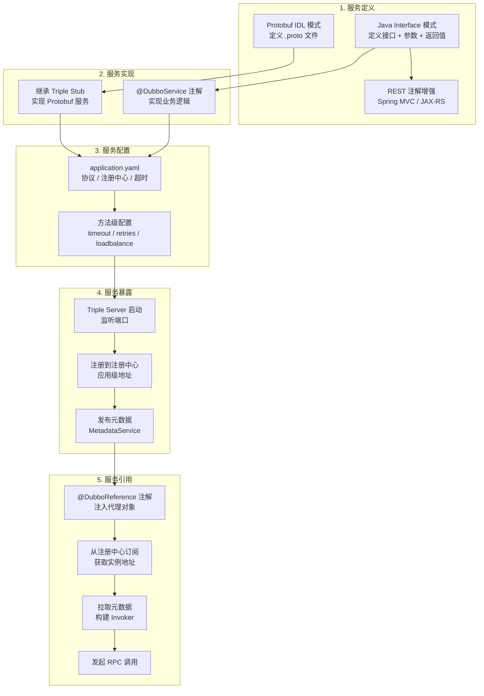
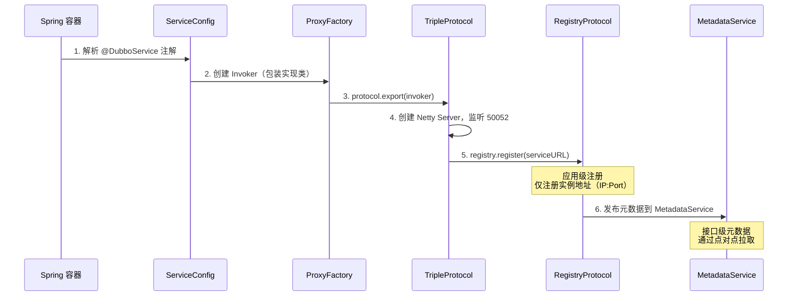
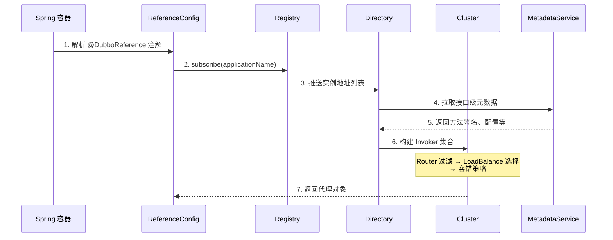
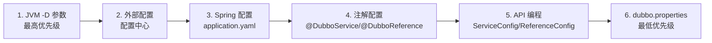
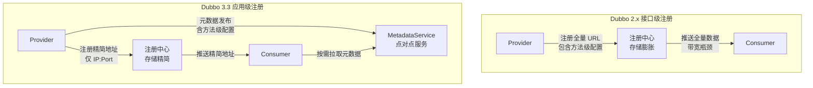
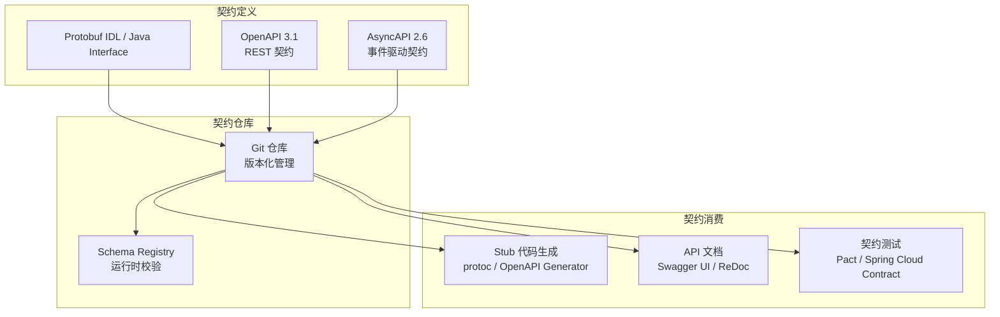
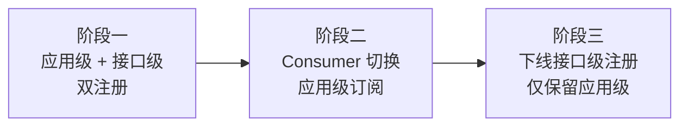

# 服务发布和引用的实践

> **版本基线**：Apache Dubbo 3.3.6 | Triple 协议 | OpenAPI 3.1 | Protobuf / Java Interface
> **阅读时间**：约 35 分钟
> **前置知识**：[[04]] 如何发布和引用服务？ · [[10]] Dubbo框架里的微服务组件

## 概述

在 [[04]] 中，我们阐述了服务发布与引用的多种契约方式：OpenAPI（RESTful API）、gRPC/Protobuf IDL、GraphQL Schema、AsyncAPI 与 Dubbo Triple。本篇将从理论走向实践，以 Apache Dubbo 3.3 为例，系统讲解服务发布与引用的完整实践流程，以及生产环境中必须面对的工程问题。

Dubbo 3.3 的服务发布与引用体系相比原文时代（Dubbo 2.x + Motan + XML 配置）发生了根本性变化：

- **配置方式**：从 XML 驱动演进为**注解驱动 + YAML 配置 + API 编程**三模式
- **服务定义**：从单一的 Java Interface 扩展为 **Java Interface + Protobuf IDL** 双模式
- **契约管理**：从隐式契约（JAR 包依赖）演进为 **OpenAPI 3.1 + AsyncAPI 2.6** 显式契约
- **元数据治理**：从注册中心全量存储演进为 **MetadataService 按需拉取**

---

## 一、服务发布与引用的完整流程

### 1.1 整体流程概览



### 1.2 Step 1：服务定义

服务定义是服务发布与引用的起点，决定了服务的契约形态。Dubbo 3.3 支持两种服务定义模式：

#### 模式一：Java Interface

适用于纯 Java 技术栈，迁移成本最低：

```java
// api 模块：服务接口定义
package com.example.dubbo.api;

public interface UserService {
    /**
     * 获取用户信息
     * @param userId 用户 ID
     * @return 用户信息
     */
    UserInfo getUser(long userId);

    /**
     * 批量获取用户信息
     * @param userIds 用户 ID 列表
     * @return 用户信息映射
     */
    Map<Long, UserInfo> batchGetUsers(long[] userIds);

    /**
     * 服务端流式通信（Triple 协议特性）
     * @param request 查询请求
     * @param responseObserver 响应流观察者
     */
    void streamUsers(UserQuery request, StreamObserver<UserInfo> responseObserver);
}

// 数据模型
public class UserInfo implements Serializable {
    private long id;
    private String name;
    private String email;
    // getters & setters
}

public class UserQuery implements Serializable {
    private String keyword;
    private int limit;
    // getters & setters
}
```

**关键实践**：服务接口独立为 `api` 模块，打包为 JAR 发布到 Maven 仓库，Consumer 通过 Maven 依赖引入。

#### 模式二：Protobuf IDL

适用于跨语言场景，一次定义多语言使用：

```protobuf
syntax = "proto3";
option java_multiple_files = true;
package com.example.dubbo.api;

message GetUserRequest {
  int64 user_id = 1;
}

message UserInfo {
  int64 id = 1;
  string name = 2;
  string email = 3;
}

message BatchGetUsersRequest {
  repeated int64 user_ids = 1;
}

message BatchGetUsersResponse {
  map<int64, UserInfo> users = 1;
}

message UserQuery {
  string keyword = 1;
  int32 limit = 2;
}

service UserService {
  // Unary 调用
  rpc getUser(GetUserRequest) returns (UserInfo);
  rpc batchGetUsers(BatchGetUsersRequest) returns (BatchGetUsersResponse);
  // Server Stream
  rpc streamUsers(UserQuery) returns (stream UserInfo);
}
```

通过 Dubbo 提供的 `dubbo-maven-plugin` 编译生成 Stub 代码：

```xml
<plugin>
    <groupId>org.apache.dubbo</groupId>
    <artifactId>dubbo-maven-plugin</artifactId>
    <version>3.3.6</version>
    <configuration>
        <outputDir>build/generated/source/proto/main/java</outputDir>
    </configuration>
</plugin>
```

执行 `mvn clean compile` 后，自动生成接口定义和 Triple Stub 基类。

#### 两种模式的选择矩阵

| 决策维度 | Java Interface | Protobuf IDL |
|---------|---------------|-------------|
| 团队语言栈 | 仅 Java | Java + Go + Rust + Node.js |
| 学习成本 | 低 | 中（需掌握 Protobuf 语法） |
| 迁移成本 | Dubbo 2.x 零成本 | 需重写接口定义 |
| gRPC 互操作 | 不支持 | 原生支持 |
| 序列化性能 | 中（Hessian2 包装层） | 高（Protobuf 原生） |
| 流式通信 | 支持 | 原生语义支持 |
| REST 兼容 | Spring MVC/JAX-RS 注解 | Triple 原生 HTTP |
| 接口演进 | 松散（需版本控制） | 严格（Protobuf 向后兼容规则） |

### 1.3 Step 2：服务实现

#### Java Interface 模式实现

```java
@DubboService(
    version = "1.0.0",
    group = "production",
    timeout = 3000,
    retries = 0,
    loadbalance = "adaptive",
    protocol = "tri"           // Triple 协议
)
public class UserServiceImpl implements UserService {

    @Override
    public UserInfo getUser(long userId) {
        return userRepository.findById(userId);
    }

    @Override
    public Map<Long, UserInfo> batchGetUsers(long[] userIds) {
        return userRepository.findByIds(userIds);
    }

    @Override
    public void streamUsers(UserQuery request, StreamObserver<UserInfo> responseObserver) {
        List<UserInfo> users = userRepository.search(request.getKeyword(), request.getLimit());
        for (UserInfo user : users) {
            responseObserver.onNext(user);
        }
        responseObserver.onCompleted();
    }
}
```

#### Protobuf IDL 模式实现

```java
// 继承 protoc 自动生成的基类
public class UserServiceImpl extends DubboUserServiceTriple.UserServiceImplBase {

    @Override
    public UserInfo getUser(GetUserRequest request) {
        return UserInfo.newBuilder()
            .setId(request.getUserId())
            .setName("User-" + request.getUserId())
            .build();
    }

    @Override
    public void streamUsers(UserQuery request, StreamObserver<UserInfo> responseObserver) {
        List<UserInfo> users = searchUsers(request.getKeyword(), request.getLimit());
        for (UserInfo user : users) {
            responseObserver.onNext(user);
        }
        responseObserver.onCompleted();
    }
}
```

### 1.4 Step 3：服务配置

Dubbo 3.3 推荐使用 **Spring Boot + application.yaml** 方式进行配置：

```yaml
# application.yaml
dubbo:
  application:
    name: user-service-provider
    logger: slf4j
  protocol:
    name: tri                          # Triple 协议
    port: 50052
  registry:
    address: nacos://127.0.0.1:8848    # Nacos 注册中心
    username: nacos
    password: nacos
  provider:                            # 全局 Provider 默认配置
    timeout: 3000
    retries: 0
    loadbalance: adaptive
  metrics:
    protocol: prometheus               # Prometheus 指标暴露
  tracing:
    enabled: true                      # OpenTelemetry Tracing
    sampling:
      probability: 0.1                 # 采样率 10%
```

**配置组件体系**：

| 配置组件 | 作用域 | 说明 |
|---------|--------|------|
| `application` | 全局唯一 | 应用名、日志等 |
| `protocol` | 可多个 | RPC 协议、端口 |
| `registry` | 可多个 | 注册中心地址 |
| `config-center` | 可多个 | 配置中心地址 |
| `metadata-report` | 可多个 | 元数据中心地址 |
| `provider` | 可多个 | Provider 侧默认值 |
| `consumer` | 可多个 | Consumer 侧默认值 |
| `service` | 每个服务 | 服务级配置 |
| `reference` | 每个引用 | 引用级配置 |
| `method` | 每个方法 | 方法级配置 |

### 1.5 Step 4：服务暴露

服务暴露的内部流程如下：



### 1.6 Step 5：服务引用

```java
@Component
public class UserConsumer {

    @DubboReference(
        version = "1.0.0",
        group = "production",
        timeout = 5000,           // 消费者侧超时覆盖
        retries = 2,              // 失败重试次数
        check = false,            // 启动时不检查
        loadbalance = "adaptive",
        protocol = "tri"
    )
    private UserService userService;

    public UserInfo getUser(long userId) {
        return userService.getUser(userId);
    }
}
```

服务引用的内部流程：



---

## 二、配置优先级与覆盖机制

### 2.1 六级配置源

Dubbo 3.3 支持六级配置源，优先级从高到低：



配置覆盖遵循的核心原则：**高优先级配置源覆盖低优先级配置源的相同配置项**。最终所有配置汇总到 URL 数据总线，驱动后续的服务暴露和引用流程。

### 2.2 配置粒度覆盖

除了配置源优先级，还存在配置粒度的覆盖关系：

| 粒度 | 作用域 | 优先级 |
|------|--------|--------|
| 方法级（method） | 单个方法 | 最高 |
| 服务级（service/reference） | 单个服务 | 高 |
| 消费者/提供者级（consumer/provider） | 一组服务 | 中 |
| 应用级（application） | 全局 | 低 |

**覆盖示例**：假设 `timeout` 配置如下：

```yaml
# application.yaml - 全局默认
dubbo:
  provider:
    timeout: 3000           # 应用级：3 秒
```

```java
// 服务级覆盖
@DubboService(timeout = 5000)   // 服务级：5 秒
public class UserServiceImpl implements UserService {

    // 方法级覆盖（通过方法配置）
}
```

最终生效的 timeout 值：**方法级 > 服务级 > Provider 级 > 应用级**。

### 2.3 配置模式（config-mode）

Dubbo 3.3 引入了配置模式控制，用于处理同一唯一配置类出现多个实例的情况：

| 模式 | 行为 | 适用场景 |
|------|------|---------|
| `strict`（默认） | 直接抛异常 | 严格模式，避免配置冲突 |
| `override` | 后者覆盖前者 | 动态配置覆盖静态配置 |
| `ignore` | 忽略后者，保留前者 | 保护静态配置不被覆盖 |
| `override_all` | 后者属性无条件覆盖前者 | 全面覆盖 |
| `override_if_absent` | 仅当前者属性为空时覆盖 | 补充默认值 |

```properties
# 通过 JVM 参数设置
-Ddubbo.config.mode=override_if_absent

# 或通过环境变量
DUBBO_CONFIG_MODE=override_if_absent
```

---

## 三、服务配置的工程实践

原文提出了一个关键的工程问题：**服务发布预定义配置 vs 服务引用定义配置**——即配置应该放在 Provider 端还是 Consumer 端。这个问题在 Dubbo 3.3 中有了更优雅的解决方案。

### 3.1 原文的问题：注册中心带宽瓶颈

原文描述的核心矛盾是：

- **Provider 预定义配置**：Consumer 继承 Provider 的方法级配置，但详细配置存储在注册中心中，大规模集群下可能导致注册中心带宽打满
- **Consumer 定义配置**：将详细配置迁移到 Consumer 端，减轻注册中心压力，但 Consumer 众多时配置维护成本高

### 3.2 Dubbo 3.3 的解决方案：应用级服务发现 + MetadataService

Dubbo 3.3 的应用级服务发现从根本上解决了这个问题：



**关键设计**：
1. 注册中心仅存储精简的实例地址（IP + Port），不含方法级配置
2. 方法级配置等详细元数据通过 **MetadataService** 发布
3. Consumer 按需从 MetadataService 拉取元数据，而非从注册中心全量推送
4. 注册中心数据量从 **Service数 × 实例数** 降至 **实例数**，彻底消除带宽瓶颈

### 3.3 配置继承与覆盖的最佳实践

在 Dubbo 3.3 中，推荐的配置策略如下：

#### Provider 侧：定义服务级默认值

```java
@DubboService(
    version = "1.0.0",
    timeout = 3000,               // 服务级默认超时
    retries = 0,                  // 服务级默认不重试
    loadbalance = "adaptive"      // 服务级默认负载均衡
)
public class UserServiceImpl implements UserService {

    // 写操作：超时 5 秒，不重试
    // 读操作：超时 3 秒，可重试 2 次
}
```

#### Consumer 侧：按需覆盖

```java
@DubboReference(
    version = "1.0.0",
    timeout = 5000,               // Consumer 侧覆盖超时
    methods = {
        @Method(name = "getUser", timeout = 1000, retries = 2),        // 读操作：短超时+重试
        @Method(name = "updateUser", timeout = 5000, retries = 0)      // 写操作：长超时+不重试
    }
)
private UserService userService;
```

#### 配置中心：动态覆盖

```yaml
# Nacos 配置中心 - 运行时动态覆盖
dubbo.service.UserService.getUser.timeout=2000
dubbo.service.UserService.getUser.retries=3
```

**配置继承优先级**：


### 3.4 方法级配置的实践原则

| 方法类型 | 超时策略 | 重试策略 | 负载均衡 | 说明 |
|---------|---------|---------|---------|------|
| **读操作** | 短（1-3 秒） | 可重试（2-3 次） | Random/Adaptive | 幂等，失败可重试 |
| **写操作** | 长（5-10 秒） | 不重试（0 次） | Failfast | 非幂等，重试可能导致重复 |
| **批量操作** | 更长（10-30 秒） | 不重试 | RoundRobin | 数据量大，超时时间需预留 |
| **流式通信** | 不适用 | 不适用 | 不适用 | 由流控机制管理 |

---

## 四、服务接口契约管理

### 4.1 从隐式契约到显式契约

原文时代的服务契约管理依赖 JAR 包传递——Provider 将接口定义打包发布到 Maven 仓库，Consumer 引入 JAR 依赖。这种方式的缺陷：

- **契约不透明**：接口变更历史不可追溯
- **版本管理困难**：JAR 版本与接口版本耦合
- **跨语言不可用**：JAR 包仅 Java 可用
- **文档与代码分离**：API 文档需单独维护

Dubbo 3.3 提供了更完善的契约管理体系：

### 4.2 OpenAPI 3.1 契约导出

Triple 协议支持自动生成 OpenAPI 3.1 文档：

```java
// REST 注解增强
@RestController
@RequestMapping("/api/v1/users")
public interface UserService {

    @GetMapping(value = "/{userId}")
    @Operation(summary = "获取用户信息", description = "根据用户 ID 获取用户详细信息")
    UserInfo getUser(@PathVariable long userId);

    @PostMapping(value = "/batch")
    @Operation(summary = "批量获取用户信息")
    Map<Long, UserInfo> batchGetUsers(@RequestBody long[] userIds);
}
```

Dubbo-go 甚至内置了 Swagger UI 和 ReDoc 界面，可直接通过浏览器浏览和调试 API：

| 端点 | 说明 |
|------|------|
| `/dubbo/openapi/swagger-ui/` | Swagger UI 界面 |
| `/dubbo/openapi/redoc/` | ReDoc 界面 |
| `/dubbo/openapi/openapi.json` | OpenAPI JSON 格式文档 |
| `/dubbo/openapi/openapi.yaml` | OpenAPI YAML 格式文档 |

### 4.3 Protobuf IDL 即契约

Protobuf IDL 天然是一种强类型、可版本化的服务契约：

```protobuf
// 向后兼容的接口演进示例
message GetUserRequest {
  int64 user_id = 1;
  // 新增字段使用新编号，不破坏旧版本
  repeated string fields = 2;  // 字段掩码，v2 新增
}
```

**Protobuf 接口演进规则**：
- ✅ 新增字段（使用新编号）
- ✅ 新增 RPC 方法
- ✅ 新增 message 类型
- ❌ 删除或重命名字段（破坏兼容性）
- ❌ 修改字段编号
- ❌ 修改字段类型

### 4.4 契约管理最佳实践



---

## 五、服务配置升级与迁移

### 5.1 Dubbo 2.x → 3.3 协议迁移

从 Dubbo 2.x（Dubbo 协议）迁移到 3.3（Triple 协议）的推荐路径：


**阶段一：双注册**

```yaml
dubbo:
  protocols:
    - name: dubbo        # 保留旧协议
      port: 20880
    - name: tri          # 新增 Triple 协议
      port: 50052
  registry:
    address: nacos://127.0.0.1:8848
```

**阶段二：逐步切换 Consumer**

Consumer 逐个切换到 Triple 协议引用，同时保留 Dubbo 协议兜底：

```java
@DubboReference(protocol = "tri")   // 新 Consumer 使用 Triple
private UserService userService;
```

**阶段三：下线 Dubbo 协议**

确认所有 Consumer 完成切换后，Provider 下线 Dubbo 协议端口：

```yaml
dubbo:
  protocols:
    - name: tri          # 仅保留 Triple
      port: 50052
```

### 5.2 接口级 → 应用级服务发现迁移



**迁移配置**：

```yaml
dubbo:
  application:
    name: user-service
    # 订阅迁移策略：FORCE_INTERFACE / APPLICATION_FIRST / FORCE_APPLICATION
    service-discovery:
      migration: APPLICATION_FIRST
  registry:
    address: nacos://127.0.0.1:8848
    # 注册模式（双注册过渡期）：interface / app / all
    register-mode: all
```

### 5.3 配置升级的安全步骤

与原文类似，配置升级需遵循严格的步骤，但 Dubbo 3.3 的 MetadataService 机制使得升级更加安全：

| 步骤 | 操作 | 验证 |
|------|------|------|
| 1 | Consumer 端添加完整的方法级配置 | 调用验证功能正常 |
| 2 | Provider 升级 2 台实例，启用应用级注册 | 观察注册中心数据量下降 |
| 3 | 验证所有 Consumer 均能正常拉取元数据 | MetadataService 调用正常 |
| 4 | 全量 Provider 切换到应用级注册 | 注册中心存储稳定 |
| 5 | 下线接口级注册 | 确认无异常 |

**安全回滚**：每个阶段均可通过 `register-mode` 配置回退到前一状态，无需代码变更。

---

## 六、Spring Boot Starter 生态

Dubbo 3.3 提供了丰富的 Spring Boot Starter，简化组件集成：

| Starter | 功能 | 版本兼容 |
|---------|------|---------|
| `dubbo-spring-boot-starter` | 核心框架，扫描注解、识别配置 | Spring Boot 1.x ~ 3.x |
| `dubbo-spring-boot-starter3` | 核心框架，Spring Boot 3.2 专用 | Spring Boot 3.2+ |
| `dubbo-nacos-spring-boot-starter` | Nacos 注册中心 + 配置中心 | — |
| `dubbo-zookeeper-spring-boot-starter` | ZooKeeper 注册中心（Curator 5） | — |
| `dubbo-sentinel-spring-boot-starter` | Sentinel 限流降级 | — |
| `dubbo-seata-spring-boot-starter` | Seata 分布式事务 | — |
| `dubbo-observability-spring-boot-starter` | Micrometer Metrics 自动采集 | — |
| `dubbo-tracing-otel-otlp-spring-boot-starter` | OpenTelemetry → OTLP | — |
| `dubbo-tracing-otel-zipkin-spring-boot-starter` | OpenTelemetry → Zipkin | — |

---

## 技术演进时间线

| 时间 | 里程碑 | 影响 |
|------|--------|------|
| 2017 | XML 配置为主，接口级注册 | 原文描述的技术状态；配置全量存储在注册中心 |
| 2018 | 注解驱动（@Service/@Reference） | 简化配置，但注册中心带宽问题未解 |
| 2021 | Dubbo 3.0：应用级服务发现、Triple 协议、Protobuf IDL | 从根本上解决注册中心容量瓶颈，跨语言与 gRPC 互操作 |
| 2022 | Spring Boot Starter 体系 | 标准化组件集成，降低接入成本 |
| 2023 | Dubbo 3.2：Triple 协议成为默认 | 配置不再存储在注册中心，按需拉取元数据 |
| 2024 | Dubbo 3.3：Triple REST + OpenAPI 文档 | 去中心化 REST、自动生成 API 文档 |
| 2025 | Dubbo 3.3.6 稳定版 | 生产级验证（阿里巴巴全量运行） |

---

## 架构决策指南

> **何时使用 Java Interface 模式？**
> - 纯 Java 团队，无跨语言需求
> - 从 Dubbo 2.x 平滑迁移，零代码改造
> - 接口变更频繁，Protobuf 演进规则过于严格

> **何时使用 Protobuf IDL 模式？**
> - 多语言团队（Java + Go + Rust）
> - 需要与 gRPC 生态互操作
> - 对序列化性能有极致要求
> - 希望通过 IDL 实现严格的接口版本管理

> **配置放在 Provider 还是 Consumer？**
> - **Dubbo 3.3 推荐混合策略**：Provider 定义服务级默认值，Consumer 按需覆盖方法级配置
> - 元数据通过 MetadataService 按需拉取，不占注册中心带宽
> - 运行时动态调整通过配置中心（Nacos/Apollo）实现

> **如何选择配置源？**
> - 开发环境：`application.yaml` + 注解，简单直接
> - 测试环境：JVM -D 参数覆盖，便于 CI/CD 注入
> - 生产环境：配置中心（Nacos/Apollo）动态管理，支持运行时调整

---

## 小结

本篇以 Apache Dubbo 3.3 为实例，系统讲解了服务发布与引用的完整实践流程，重点解决了以下工程问题：

- **服务定义双模式**：Java Interface 零成本迁移 vs Protobuf IDL 跨语言支持，根据团队技术栈选择
- **配置优先级体系**：六级配置源 + 四级配置粒度，覆盖关系清晰，运行时行为可预测
- **注册中心带宽瓶颈**：应用级服务发现 + MetadataService 元数据分离，从根本上消除了原文描述的网络风暴风险
- **协议迁移路径**：双注册 → 逐步切换 → 下线旧协议，三阶段安全迁移
- **契约管理现代化**：从隐式 JAR 依赖演进为 OpenAPI 3.1 + Protobuf IDL 显式契约

**下一篇**：[[12]] 如何将注册中心落地？ →
