# 如何将注册中心落地

> **版本基线**：Nacos 2.4+ | Consul 1.18+ | etcd 3.5+ | Kubernetes 1.30+
> **阅读时间**：约 25 分钟
> **前置知识**：[[05]] 如何注册和发现服务？ · [[10]] Dubbo框架里的微服务组件

## 概述

注册中心是微服务架构的核心基础设施，负责服务实例的注册、发现与健康治理。从早期的 ZooKeeper 到现代的 Nacos、Consul、etcd，注册中心技术经历了从"强一致性优先"到"可用性与性能优先"的演进。本文将深入剖析注册中心的存储模型、核心工作流程、主流实现方案对比，以及在生产环境中落地的关键实践。

---

## 一、注册中心存储模型

### 1.1 服务信息的数据结构

注册中心存储的服务信息不仅仅是 IP 和端口，还包含丰富的元数据。现代注册中心通常采用以下数据模型：

```json
{
  "serviceName": "user-service",
  "group": "production",
  "namespace": "default",
  "cluster": "beijing-zone-a",
  "instances": [
    {
      "ip": "10.0.1.101",
      "port": 8080,
      "weight": 1.0,
      "enabled": true,
      "healthy": true,
      "ephemeral": true,
      "metadata": {
        "version": "2.3.0",
        "region": "cn-north",
        "zone": "zone-a",
        "weight": "100",
        "warmup": "120000"
      }
    }
  ]
}
```

**核心字段解析**：

| 字段 | 说明 | 典型用途 |
|------|------|----------|
| `serviceName` | 服务标识 | 服务间调用的唯一标识 |
| `group` | 服务分组 | 核心与非核心、机房、环境隔离 |
| `namespace` | 命名空间 | 多租户、多环境隔离 |
| `cluster` | 集群/机房 | 就近路由、容灾切换 |
| `ephemeral` | 临时/持久实例 | 临时实例依赖心跳，持久实例依赖主动注销 |
| `metadata` | 自定义元数据 | 灰度发布、流量控制、路由策略 |

### 1.2 分层存储架构

现代注册中心普遍采用分层存储模型，以支持多维度的服务治理：

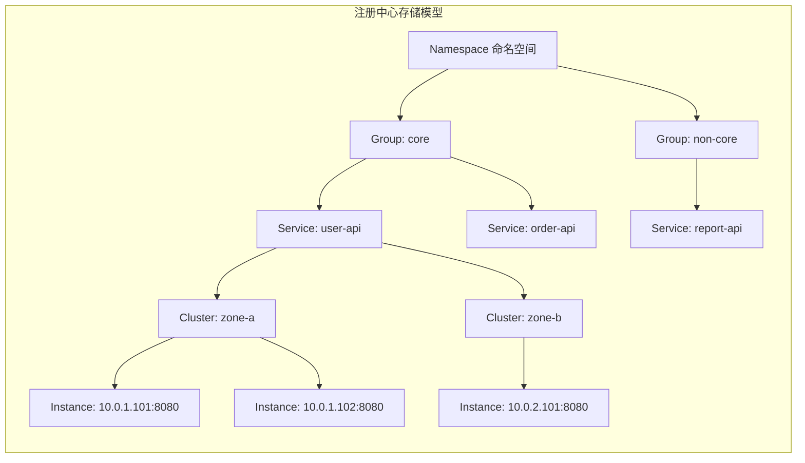

**分层设计的优势**：

1. **多租户隔离**：Namespace 实现不同业务线或租户的完全隔离
2. **环境隔离**：Group 区分开发、测试、预发、生产环境
3. **机房感知**：Cluster 支持就近路由和跨机房容灾
4. **灵活扩展**：Metadata 支持业务自定义标签，实现精细化治理

### 1.3 接口级 vs 应用级服务发现

Dubbo 3.x 引入了应用级服务发现，这是服务发现模型的重大演进：

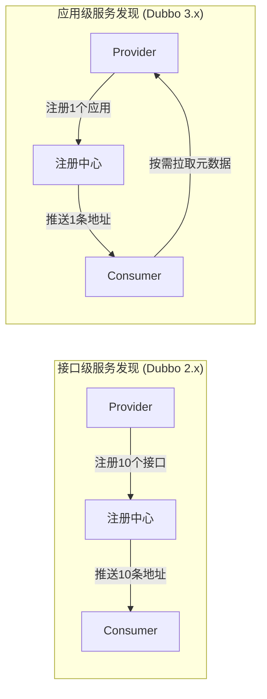

**对比分析**：

| 维度 | 接口级发现 | 应用级发现 |
|------|-----------|-----------|
| 注册数据量 | 接口数 × 实例数 | 应用数 × 实例数 |
| 推送压力 | 高（每个接口独立推送） | 低（应用维度聚合） |
| 元数据传输 | 全量注册到注册中心 | 注册中心仅存地址，元数据按需拉取 |
| 适用规模 | 中小集群（< 1万实例） | 大规模集群（10万+ 实例） |
| 与 K8s 兼容 | 差（接口概念不匹配） | 好（应用概念对齐） |

> **来源**：Apache Dubbo 官方文档 - [Application Level Service Discovery](https://github.com/apache/dubbo-website/blob/master/content/en/overview/mannual/java-sdk/reference-manual/registry/service-discovery-application-vs-interface.md)

---

## 二、注册中心核心工作流程

### 2.1 服务注册流程

服务提供者启动时，向注册中心注册自身实例信息：

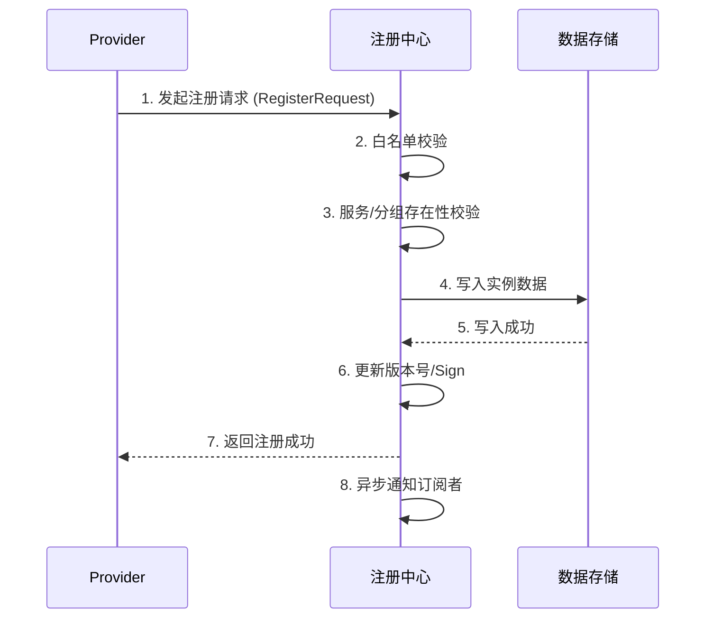

**关键步骤说明**：

1. **白名单校验**：防止非法实例注册，支持 IP 白名单、Token 认证等机制
2. **服务存在性校验**：确保注册的服务已预先定义（可选，部分注册中心支持自动创建）
3. **数据持久化**：根据实例类型（临时/持久）选择存储策略
4. **版本号更新**：用于增量同步和变更通知
5. **异步通知**：解耦注册与通知，避免阻塞注册请求

**Nacos 2.x 注册示例**：

```java
// Nacos 2.x gRPC 长连接注册
NamingService naming = NacosFactory.createNamingService("nacos-server:8848");

// 注册临时实例（依赖心跳保活）
naming.registerInstance("user-service", "10.0.1.101", 8080, 
    Instance.builder()
        .weight(1.0)
        .enabled(true)
        .ephemeral(true)
        .metadata(Map.of("version", "2.3.0", "zone", "zone-a"))
        .build()
);

// 注册持久实例（需主动注销）
naming.registerInstance("database-proxy", "10.0.1.200", 3306,
    Instance.builder()
        .ephemeral(false)  // 持久实例
        .build()
);
```

### 2.2 服务反注册流程

服务下线时，需要从注册中心移除实例信息：

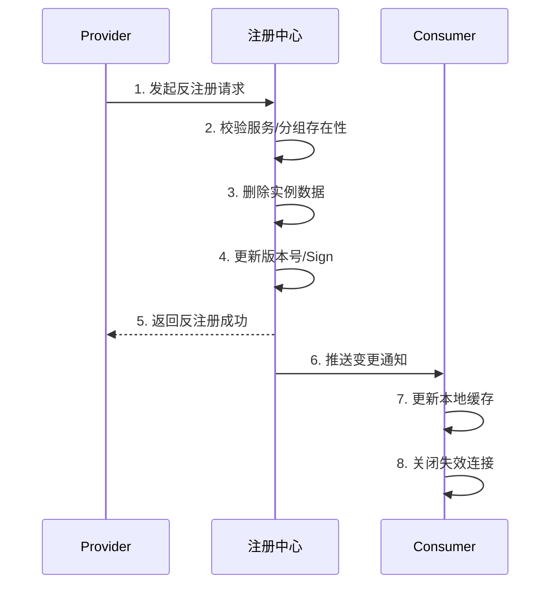

**反注册触发场景**：

| 场景 | 触发方式 | 注意事项 |
|------|---------|---------|
| 优雅停机 | 应用主动调用 deregister | 推荐：先注销再停止服务 |
| 实例销毁 | 容器/云平台回调 | 需要注册 PreStop 钩子 |
| 心跳超时 | 注册中心自动剔除 | 临时实例的兜底机制 |
| 健康检查失败 | 注册中心主动摘除 | 需配置合理的健康检查策略 |

**优雅停机最佳实践**：

```java
// Spring Boot 优雅停机
@PreDestroy
public void gracefulShutdown() {
    // 1. 先从注册中心注销
    namingService.deregisterInstance(serviceName, ip, port);
    
    // 2. 等待进行中的请求完成
    awaitInProgressRequests(Duration.ofSeconds(30));
    
    // 3. 关闭服务端口
    shutdownServer();
}
```

### 2.3 服务查询流程

服务消费者从注册中心获取服务提供者列表：

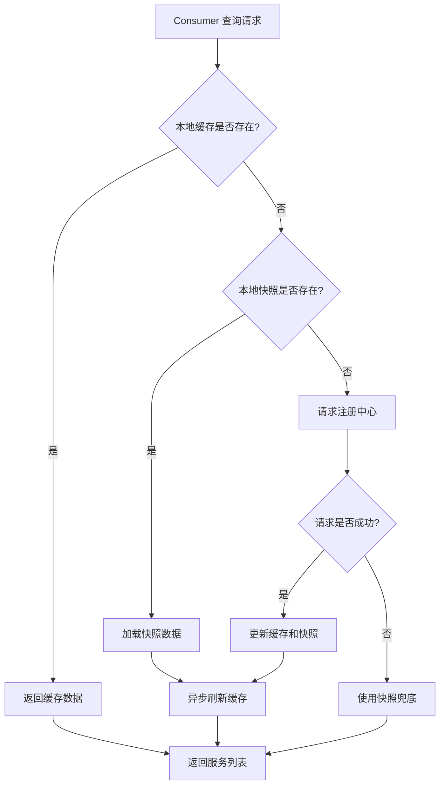

**多级缓存设计**：

| 缓存层级 | 存储位置 | 数据时效性 | 容错能力 |
|---------|---------|-----------|---------|
| 内存缓存 | Consumer JVM | 毫秒级更新 | 无（进程重启丢失） |
| 本地快照 | Consumer 磁盘 | 秒级更新 | 强（网络故障可用） |
| 注册中心 | 集群存储 | 实时 | 强（集群高可用） |

**缓存策略配置**：

```yaml
# Nacos Client 缓存相关配置（示意，实际配置项以官方文档为准）
nacos:
  naming:
    # 本地缓存目录
    cache-dir: /var/nacos/naming
    # 缓存刷新间隔（毫秒）
    refresh-interval: 5000
    # 快照保存间隔
    snapshot-interval: 30000
    # 失败重试次数
    retry-times: 3
```

### 2.4 服务变更订阅

服务消费者订阅服务变更，实时感知实例上下线：

**推送模式演进**：

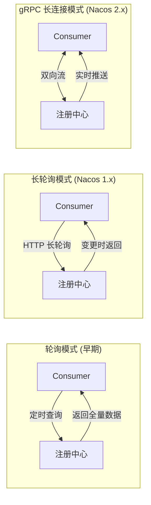

**三种模式对比**：

| 模式 | 延迟 | 资源消耗 | 实现复杂度 | 适用场景 |
|------|------|---------|-----------|---------|
| 轮询 | 秒级（取决于轮询间隔） | 高（频繁请求） | 低 | 小规模、低实时性要求 |
| 长轮询 | 秒级 | 中（连接复用） | 中 | 中等规模、一般实时性 |
| gRPC 长连接 | 毫秒级 | 低（单连接多路复用） | 高 | 大规模、高实时性要求 |

**Nacos 2.x gRPC 订阅示例**：

```java
// Nacos 2.x 自动使用 gRPC 长连接
NamingService naming = NacosFactory.createNamingService(properties);

// 订阅服务变更
naming.subscribe("user-service", new EventListener() {
    @Override
    public void onEvent(Event event) {
        if (event instanceof NamingEvent) {
            NamingEvent namingEvent = (NamingEvent) event;
            List<Instance> instances = namingEvent.getInstances();
            // 更新本地服务列表
            updateServiceInstances(instances);
        }
    }
});
```

---

## 三、主流注册中心技术对比

### 3.1 技术选型矩阵

| 特性 | Nacos 2.x | Consul | etcd | Eureka | ZooKeeper |
|------|-----------|--------|------|--------|-----------|
| **最新版本** | 2.4+ | 1.18+ | 3.5+ | 2.x（停止维护） | 3.8+ |
| **一致性协议** | Raft（持久数据）/ Distro（临时数据） | Raft | Raft | AP（无强一致） | ZAB |
| **通信协议** | gRPC 长连接 | HTTP/gRPC | gRPC | HTTP | TCP |
| **健康检查** | 心跳 + 主动探测 | TCP/HTTP/gRPC/Script | Lease 续约 | 心跳 | Session |
| **配置中心** | 内置 | 支持（KV Store） | 支持 | 不支持 | 不支持 |
| **多数据中心** | 支持 | 原生支持 | 需部署多集群 | 需部署多集群 | 需部署多集群 |
| **K8s 集成** | 支持 | 原生支持 | K8s 核心存储 | 不推荐 | 不推荐 |
| **Service Mesh** | 支持 | 原生支持 | 需集成 | 不支持 | 不支持 |
| **管理界面** | 完善 | 完善 | 需第三方工具 | 一般 | 需第三方工具 |
| **社区活跃度** | 高（阿里主导） | 高（HashiCorp） | 高（CNCF） | 低（Netflix 停止维护） | 中（Apache） |

### 3.2 Nacos 2.x 架构深度解析

Nacos 2.x 相比 1.x 进行了架构重构，核心改进包括：

**架构演进**：

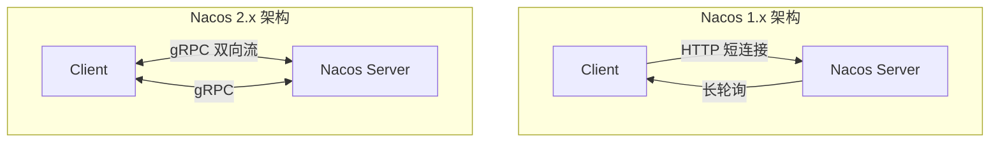

**核心改进**：

1. **gRPC 长连接替代 HTTP 短连接**
   - 连接数减少 90%+
   - 推送延迟从秒级降至毫秒级
   - 支持双向流，实现真正的实时推送

2. **临时实例与持久实例分离**
   - 临时实例：使用 Distro 协议（AP），适合微服务场景
   - 持久实例：使用 Raft 协议（CP），适合数据库等基础设施

3. **连接复用与多路复用**
   - 单个 gRPC 连接承载注册、订阅、配置等多个请求
   - 显著降低资源消耗

**Nacos 2.x 部署架构**：

```yaml
# Nacos 2.x 集群配置
nacos:
  server:
    # gRPC 端口（主端口 + 1000）
    grpc-port: 9848
    # gRPC 间通信端口（主端口 + 1001）
    grpc-port-internal: 9849
  
  # 存储配置
  storage:
    # 内置存储（仅开发环境）
    embedded:
      enabled: false
    # MySQL 存储（生产环境）
    mysql:
      jdbc-url: jdbc:mysql://mysql:3306/nacos
      username: nacos
      password: nacos
```

### 3.3 Consul 服务发现机制

Consul 是 HashiCorp 推出的服务网格解决方案，服务发现是其核心功能之一：

**核心特性**：

1. **多数据中心原生支持**
   - 通过 WAN Gossip 协议实现跨数据中心通信
   - 支持自动故障转移和就近路由

2. **丰富的健康检查**
   - TCP 检查：探测端口是否可连接
   - HTTP 检查：HTTP 健康端点探测
   - gRPC 检查：gRPC 健康检查协议
   - Script 检查：自定义脚本检查

3. **DNS 接口**
   - 标准 DNS 查询：`user-service.service.consul`
   - 支持标签过滤查询：`production.user-service.service.consul`（标签作为子域前缀）
   - 支持健康实例过滤

**Consul 服务注册示例**：

```hcl
# Consul 服务定义
service {
  name = "user-service"
  id = "user-service-1"
  tags = ["production", "v2"]
  address = "10.0.1.101"
  port = 8080
  
  # 健康检查
  check {
    id = "health-check"
    name = "HTTP Health Check"
    http = "http://10.0.1.101:8080/actuator/health"
    interval = "10s"
    timeout = "5s"
    deregister_critical_service_after = "30m"
  }
  
  # 元数据
  meta = {
    version = "2.3.0"
    zone = "zone-a"
  }
}
```

### 3.4 etcd 作为注册中心

etcd 是 Kubernetes 的核心存储，也可作为独立的注册中心使用：

**适用场景**：

- Kubernetes 原生环境（直接使用 K8s Service）
- 需要强一致性的场景
- 与 Kubernetes 深度集成的项目

**etcd 服务注册模式**：

```go
// etcd v3 客户端注册服务
import (
    "context"
    clientv3 "go.etcd.io/etcd/client/v3"
    "go.etcd.io/etcd/client/v3/concurrency"
)

func RegisterService(client *clientv3.Client, serviceName, instanceID, addr string, ttl int) error {
    ctx := context.Background()
    
    // 创建 Session（基于 Lease）
    session, err := concurrency.NewSession(client,
        concurrency.WithTTL(ttl),
    )
    if err != nil {
        return err
    }
    
    // 注册服务实例
    key := fmt.Sprintf("/services/%s/%s", serviceName, instanceID)
    _, err = client.Put(ctx, key, addr, clientv3.WithLease(session.Lease()))
    
    // concurrency.Session 已内置 Lease 自动续约（KeepAlive），无需额外心跳
    return err
}
```

### 3.5 Kubernetes Service 发现机制

在 Kubernetes 环境中，服务发现由平台原生提供：

**Kubernetes Service 类型**：

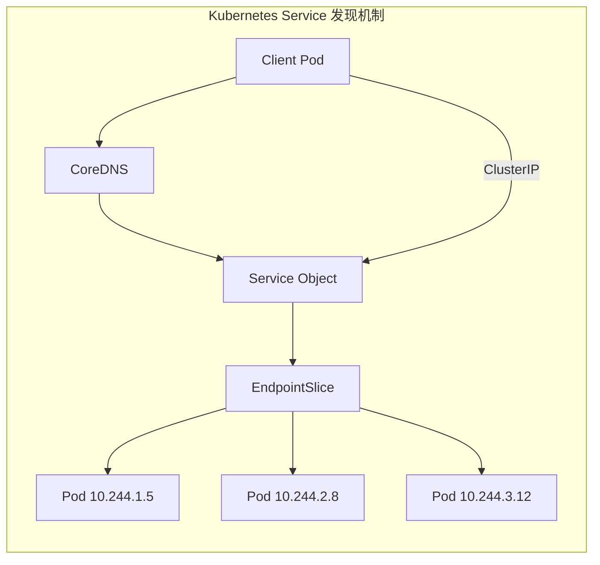

**Service 类型对比**：

| 类型 | 访问方式 | 适用场景 |
|------|---------|---------|
| ClusterIP | 集群内部访问 | 内部服务调用 |
| NodePort | 节点端口暴露 | 开发测试、外部访问 |
| LoadBalancer | 云厂商负载均衡器 | 生产环境外部访问 |
| Headless | 直接访问 Pod IP | StatefulSet、服务网格 |
| ExternalName | DNS CNAME 映射 | 外部服务引用 |

**Headless Service 与服务网格**：

```yaml
# Headless Service（无 ClusterIP）
apiVersion: v1
kind: Service
metadata:
  name: user-service
spec:
  clusterIP: None  # Headless
  selector:
    app: user-service
  ports:
  - port: 8080
---
# EndpointSlice 自动管理
apiVersion: discovery.k8s.io/v1
kind: EndpointSlice
metadata:
  name: user-service-xyz
  labels:
    kubernetes.io/service-name: user-service
addressType: IPv4
ports:
  - port: 8080
endpoints:
  - addresses:
      - "10.244.1.5"
    conditions:
      ready: true
```

---

## 四、注册中心落地实践

### 4.1 多注册中心支持

在大型企业中，多注册中心场景十分常见：

**典型场景**：

1. **跨部门协作**：不同部门使用不同的注册中心
2. **技术栈迁移**：从旧注册中心迁移到新注册中心
3. **多云部署**：不同云厂商使用各自的注册中心

**Dubbo 3 多注册中心配置**：

```yaml
# Dubbo 3 多注册中心配置
dubbo:
  registries:
    nacos-registry:
      address: nacos://nacos-prod:8848
      group: production
    consul-registry:
      address: consul://consul-prod:8500
      group: production
  
  # 服务注册到多个注册中心
  provider:
    registry-ids: nacos-registry,consul-registry
  
  # 消费者从多个注册中心订阅
  consumer:
    registry-ids: nacos-registry,consul-registry
```

### 4.2 并行订阅优化

服务消费者启动时需要订阅多个服务，串行订阅会导致启动时间过长：

**问题分析**：

假设一个消费者订阅 50 个服务，每个服务订阅耗时 500ms（含网络延迟），串行订阅总耗时约 25 秒。

**并行订阅实现**：

```java
// 并行订阅优化
public class ParallelServiceSubscriber {
    private final ExecutorService executor = 
        Executors.newFixedThreadPool(Runtime.getRuntime().availableProcessors() * 2);
    
    public void subscribeServices(List<String> serviceNames) {
        List<CompletableFuture<Void>> futures = serviceNames.stream()
            .map(serviceName -> CompletableFuture.runAsync(() -> {
                try {
                    namingService.subscribe(serviceName, eventListener);
                } catch (Exception e) {
                    log.warn("Subscribe {} failed, will retry", serviceName, e);
                }
            }, executor))
            .collect(Collectors.toList());
        
        // 等待所有订阅完成，设置超时
        CompletableFuture.allOf(futures.toArray(new CompletableFuture[0]))
            .get(30, TimeUnit.SECONDS);
    }
}
```

**优化效果**：

| 指标 | 串行订阅 | 并行订阅 |
|------|---------|---------|
| 50 个服务订阅耗时 | ~25 秒 | ~2 秒 |
| 启动成功率 | 受单个服务影响 | 部分失败不影响整体 |
| 资源消耗 | 低（单线程） | 中（多线程） |

### 4.3 批量反注册与僵尸节点治理

僵尸节点是注册中心的常见问题，会导致调用失败率上升：

**僵尸节点产生原因**：

1. 实例异常退出，未执行反注册
2. 网络分区导致心跳丢失
3. 反注册请求失败

**治理方案**：

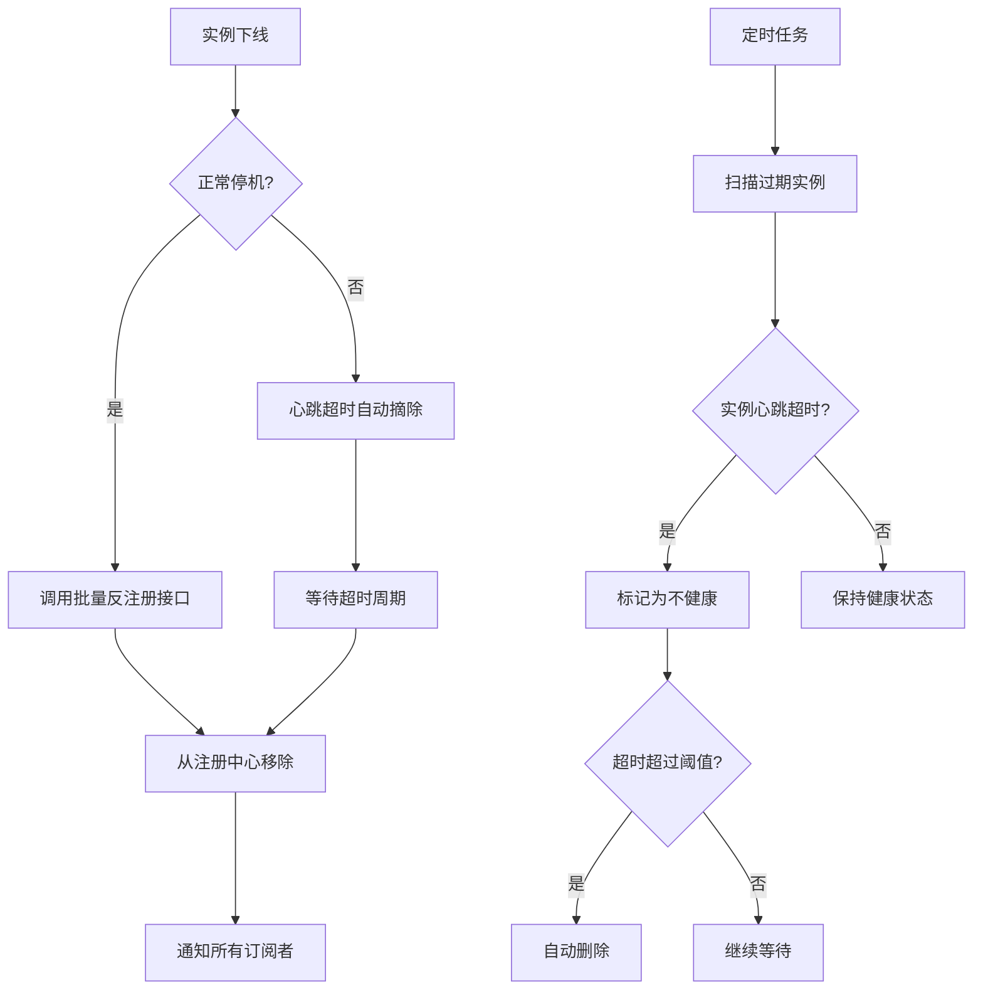

**Nacos 批量反注册示例**：

```java
// 批量反注册
public void batchDeregister(String serviceName, List<Instance> instances) {
    // Nacos 支持批量操作
    namingService.batchDeregisterInstance(serviceName, instances);
}

// 僵尸节点清理任务
@Scheduled(fixedRate = 60000)
public void cleanZombieNodes() {
    List<Instance> allInstances = namingService.getAllInstances(serviceName);
    long now = System.currentTimeMillis();
    
    for (Instance instance : allInstances) {
        // 检查心跳时间
        long lastHeartbeat = instance.getLastHeartBeatTime();
        if (now - lastHeartbeat > heartbeatTimeout) {
            log.warn("Found zombie instance: {}", instance);
            // 主动摘除
            namingService.deregisterInstance(serviceName, instance);
        }
    }
}
```

### 4.4 增量更新与网络风暴防护

大规模集群中，全量推送会导致网络风暴：

**问题场景**：

- 网络抖动导致大量实例心跳失败
- 注册中心频繁更新服务列表
- 全量推送给所有消费者，带宽被打满

**解决方案**：

1. **增量更新**：只推送变化的实例
2. **推送合并**：短时间内多次变更合并为一次推送
3. **推送限流**：限制推送频率和带宽

**Nacos 增量更新机制**：

```java
// Nacos 自动支持增量更新
// Consumer 端维护本地版本号
public class ServiceUpdateHandler {
    private long localRevision = 0;
    
    public void onServiceChange(ServiceChangeNotify notify) {
        // 检查版本号，跳过过期通知
        if (notify.getRevision() <= localRevision) {
            return;
        }
        
        // 增量更新
        List<Instance> added = notify.getAddedInstances();
        List<Instance> removed = notify.getRemovedInstances();
        List<Instance> modified = notify.getModifiedInstances();
        
        // 更新本地缓存
        localCache.applyDelta(added, removed, modified);
        localRevision = notify.getRevision();
    }
}
```

**推送限流配置**：

```yaml
# Nacos Server 推送相关配置（示意，实际配置项以官方文档为准）
nacos:
  naming:
    # 推送合并窗口（毫秒）
    push-merge-window: 500
    # 最大推送速率（条/秒）
    push-max-rate: 1000
    # 单次推送最大实例数
    push-max-instances: 1000
```

---

## 五、技术演进时间线

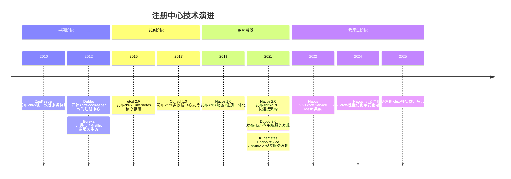

---

## 六、架构决策指南

### 6.1 选型决策树

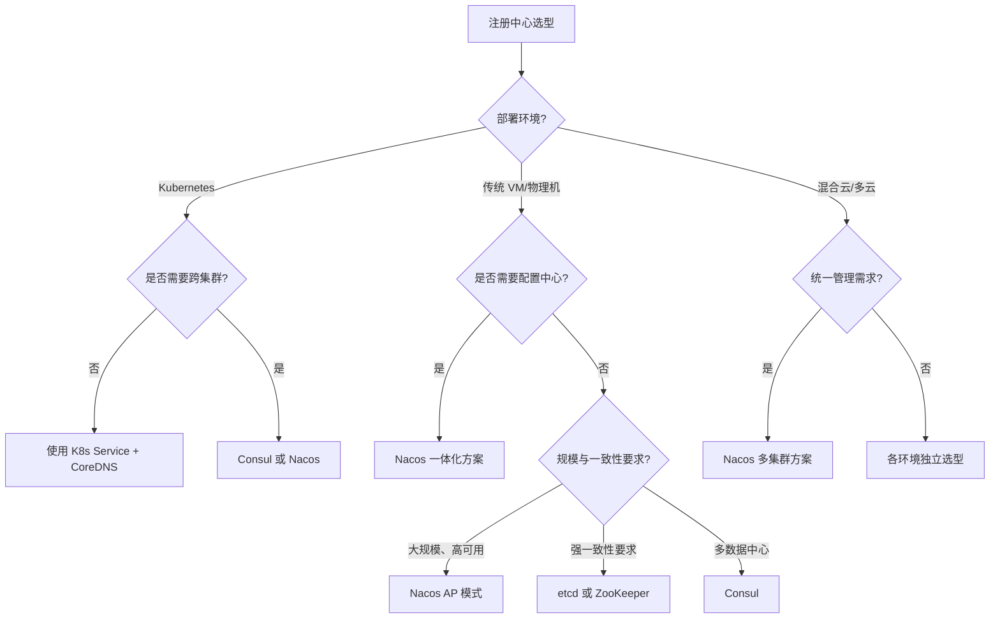

### 6.2 场景化推荐

| 场景 | 推荐方案 | 理由 |
|------|---------|------|
| 纯 Kubernetes 环境 | K8s Service + CoreDNS | 原生集成，运维成本低 |
| Spring Cloud 微服务 | Nacos | 配置+注册一体化，社区活跃 |
| Dubbo 微服务 | Nacos + Dubbo 3.x | 应用级发现，性能最优 |
| 多数据中心/混合云 | Consul | 原生多数据中心支持 |
| 强一致性场景 | etcd | Raft 协议，K8s 验证 |
| 传统遗留系统迁移 | Nacos | 兼容性好，迁移成本低 |
| Service Mesh 环境 | Consul / Nacos | 原生支持服务网格 |

### 6.3 容量规划参考

**Nacos 集群容量规划**：

| 集群规模 | 实例数 | 服务数 | 推荐配置 |
|---------|--------|--------|---------|
| 小型 | < 5,000 | < 500 | 3 节点，4C8G |
| 中型 | 5,000-50,000 | 500-2,000 | 3 节点，8C16G |
| 大型 | 50,000-200,000 | 2,000-10,000 | 5 节点，16C32G |
| 超大型 | > 200,000 | > 10,000 | 7+ 节点，32C64G + 读写分离 |

**性能基准参考**（Nacos 2.x，来源：Nacos 官方压测数据）：

| 指标 | 数值 |
|------|------|
| 单机注册 TPS | 10,000+ |
| 单机查询 QPS | 50,000+ |
| 推送延迟 P99 | < 100ms |
| 连接数支持 | 100,000+ |

---

## 七、小结

注册中心作为微服务架构的"电话簿"，其选型和落地直接影响系统的可用性和扩展性。本文从存储模型、工作流程、技术选型、落地实践四个维度进行了深入剖析：

**核心要点回顾**：

1. **存储模型演进**：从简单的 IP:Port 到支持 Namespace、Group、Cluster、Metadata 的多维模型，从接口级发现演进到应用级发现
2. **通信协议升级**：从 HTTP 轮询到 gRPC 长连接，推送延迟从秒级降至毫秒级
3. **技术选型多元化**：Nacos、Consul、etcd 各有优势，需根据场景选择
4. **落地实践关键**：多注册中心支持、并行订阅、批量反注册、增量更新是生产环境必备能力

**未来趋势**：

- **云原生融合**：注册中心与 Kubernetes、Service Mesh 深度集成
- **多集群统一**：跨集群、跨云的服务发现与治理
- **智能化治理**：基于 AI 的服务健康预测与自动故障恢复

---

## 参考资料

1. [Nacos 官方文档](https://nacos.io/docs/latest/overview/)
2. [Apache Dubbo 官方文档 - 应用级服务发现](https://github.com/apache/dubbo-website/blob/master/content/en/overview/mannual/java-sdk/reference-manual/registry/service-discovery-application-vs-interface.md)
3. [Consul 官方文档](https://developer.hashicorp.com/consul/docs)
4. [etcd 官方文档](https://etcd.io/docs/latest/)
5. [Kubernetes Service 文档](https://kubernetes.io/docs/concepts/services-networking/service/)
