# 开源服务注册中心如何选型

> **版本基线**：Nacos 3.2+ | Consul 2.0+ | etcd 3.5+ | ZooKeeper 3.9+ | Kubernetes 1.30+
> **阅读时间**：约 28 分钟
> **前置知识**：[[05]] 如何注册和发现服务？ · [[12]] 如何将注册中心落地？

## 概述

服务注册中心是微服务架构的核心基础设施之一——它承担着服务实例的注册、发现与健康检查等关键职责，是服务提供者与消费者之间的"通讯录"。选型不当，轻则引发服务调用延迟抖动，重则导致全局服务雪崩。

上一期我们讨论了注册中心的落地实践及常见问题的解决方案。如果你的团队有足够的人才和技术储备，可以选择自研注册中心；但对于大多数团队而言，使用业界成熟的开源方案、将精力聚焦于业务架构改造，是更务实的选择。

然而，自 2018 年原文发表以来，服务注册中心领域发生了深刻变革：

- **Eureka 已进入维护模式**，Netflix 不再进行功能迭代，社区活跃度极低；
- **Nacos 从 1.x 演进到 3.x**，架构从 HTTP 短连接切换为 gRPC 长连接，性能提升数倍，已成为国内微服务生态的事实标准；
- **Consul 从 1.x 演进到 2.0**，内置 Service Mesh 能力，从单纯的注册中心升级为全栈服务网络平台；
- **etcd 从 3.4 演进到 3.5+**，作为 Kubernetes 的核心存储引擎，其服务发现能力被重新审视；
- **ZooKeeper 虽仍在维护**（3.9.x），但作为注册中心的局限性日益凸显，社区已不推荐将其用于大规模服务发现场景；
- **Kubernetes 原生 Service 发现**已成为云原生环境下的默认选择，与 Istio 等 Service Mesh 深度融合。

本文将基于 2025-2026 年的技术现状，系统梳理主流开源注册中心的架构原理、核心特性与适用场景，并提供可落地的选型决策框架。

## 一、服务注册中心的两种实现范式

在深入具体产品之前，我们需要先理解服务注册中心的两种基本实现范式——这决定了注册中心与业务应用之间的耦合方式，是选型的第一层决策。

### 1.1 应用内注册与发现（SDK 模式）

应用内模式的核心特征是：注册中心提供客户端 SDK，业务应用通过引入 SDK 直接与注册中心交互，完成服务注册与发现。

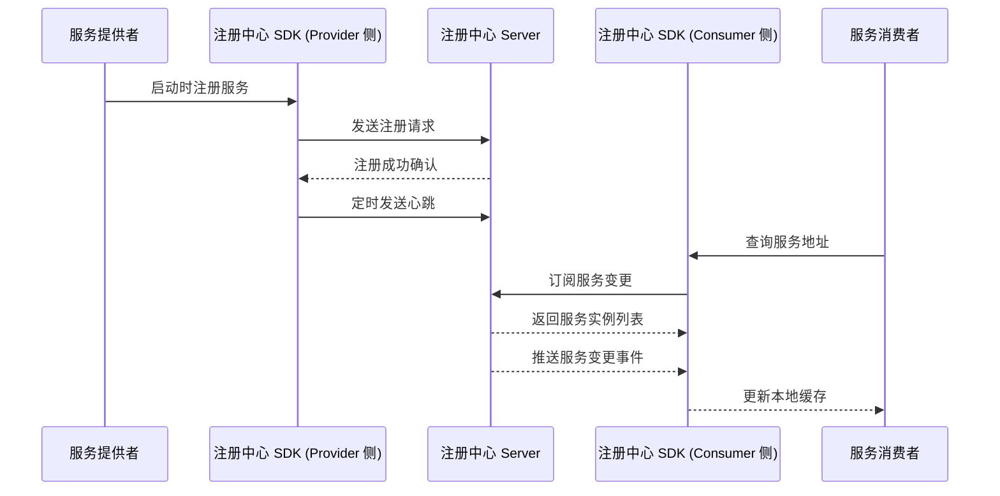

**典型代表**：Nacos（Java/Go/Node.js SDK）、Eureka（Java SDK）、ZooKeeper（Curator/ZKClient）

**优势**：
- 与业务进程同生命周期，注册/反注册时机精确
- SDK 可内置负载均衡、故障转移等客户端治理能力
- 推送模式下服务变更感知延迟低

**劣势**：
- 语言侵入性强，多语言场景需为每种语言维护 SDK
- SDK 升级需业务应用配合发版，运维成本高
- 与业务进程共享资源，极端情况下可能相互影响

### 1.2 应用外注册与发现（Proxy / Sidecar 模式）

应用外模式的核心特征是：业务应用本身不直接与注册中心交互，而是通过外部代理（Sidecar、Agent、DNS 等）间接完成服务注册与发现。

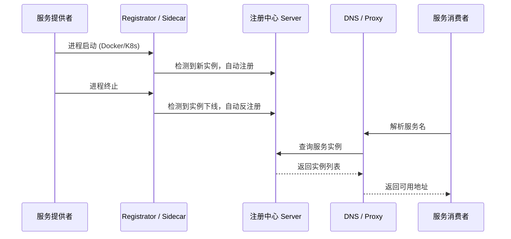

**典型代表**：Consul（配合 Consul Template / Envoy Sidecar）、Kubernetes Service（CoreDNS + kube-proxy）、Istio（istiod + Envoy）

**优势**：
- 对业务应用零侵入，不依赖特定语言 SDK
- 天然适配容器化与云原生环境
- 注册/反注册由基础设施层自动管理，业务无需关心

**劣势**：
- 引入额外代理层，增加部署复杂度和调用链路
- 代理层本身的可用性需要保障
- 调试和问题排查链路更长

### 1.3 两种范式的演进与融合

值得注意的是，两种范式并非互斥，而是在云原生时代走向融合：

| 维度 | SDK 模式 | Proxy/Sidecar 模式 | 融合趋势 |
|------|----------|-------------------|----------|
| 语言侵入性 | 高 | 低 | Nacos 提供 gRPC 通用协议，降低 SDK 依赖 |
| 云原生适配 | 弱 | 强 | Dubbo 3 支持 K8s Service 双注册 |
| 性能开销 | 低（进程内调用） | 较高（额外网络跳转） | eBPF 技术有望降低 Sidecar 开销 |
| 治理能力 | 强（客户端治理） | 强（服务端治理） | 两种治理模式互补共存 |

## 二、主流开源注册中心深度解析

### 2.1 Nacos：从配置中心到微服务核心枢纽

#### 2.1.1 架构演进

Nacos 是阿里巴巴开源的动态服务发现、配置管理和服务管理平台。从 1.x 到 3.x，其架构经历了根本性变革：

**Nacos 1.x 架构**（HTTP 短连接模式）：

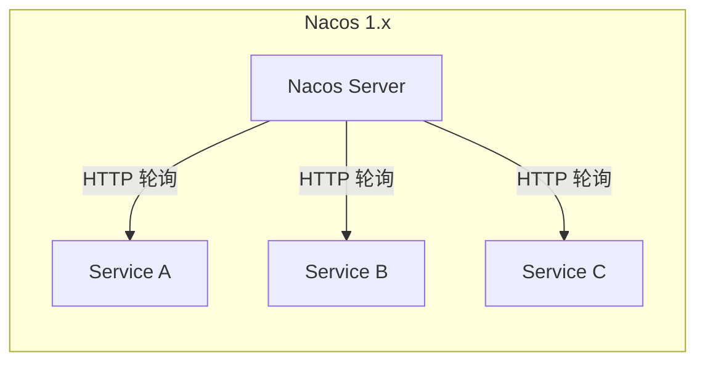

1.x 版本采用 HTTP 短连接 + 定时轮询的方式，存在以下问题：
- 每次请求都建立/断开 TCP 连接，连接开销大
- 轮询间隔导致服务变更感知延迟（默认 5 秒）
- 大量实例场景下 Server 端 HTTP 连接数成为瓶颈

**Nacos 2.x+ 架构**（gRPC 长连接模式）：

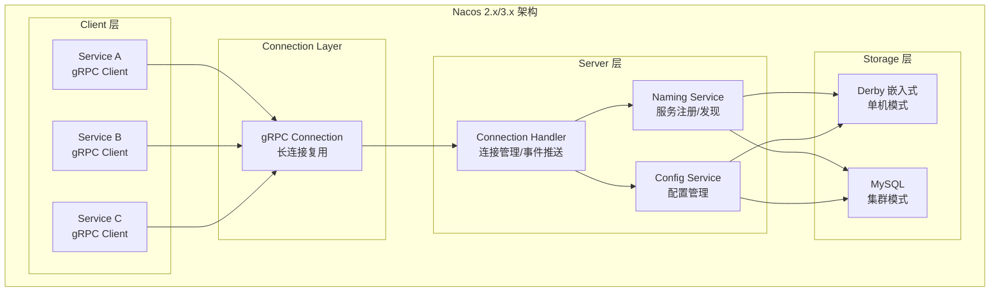

2.x 版本的核心改进：
- **gRPC 长连接替代 HTTP 短连接**：连接复用，减少握手开销
- **推送模式替代轮询模式**：服务变更实时推送，感知延迟从秒级降至毫秒级
- **连接模型统一**：注册、配置、心跳共用同一 gRPC 连接
- **性能提升**：官方基准测试显示，2.x 相比 1.x 注册性能提升约 2-3 倍，查询性能提升约 2 倍

#### 2.1.2 Nacos 3.x 新特性

Nacos 3.x（2026 年最新版本 3.2.4）在 2.x 基础上进一步演进：

- **多 SDK 语言支持**：官方提供 Java、Go、Node.js、C#、Python、C++ 等 SDK，多语言生态日趋完善
- **鉴权体系增强**：支持 OAuth2.0、OIDC 等标准认证协议，企业级安全能力提升
- **配置中心与服务发现深度整合**：支持配置变更触发服务实例动态更新
- **MCP（Model Context Protocol）服务发现**：3.2 版本新增 AI 服务发现能力，支持 MCP Server 的注册与发现，适配 AI Agent 架构
- **灰度发布与流量管理**：与 Spring Cloud Gateway、Dubbo 等框架深度集成

#### 2.1.3 Nacos 的 CAP 策略

Nacos 支持两种一致性模型，可按场景切换：

| 模式 | 一致性协议 | 适用场景 | 说明 |
|------|-----------|---------|------|
| AP 模式 | Distro 协议（临时实例） | 互联网高并发场景 | 优先保证可用性，容忍短暂不一致 |
| CP 模式 | Raft 协议（持久实例） | 金融/交易等强一致场景 | 优先保证一致性，Leader 选举期间不可写 |

```java
// Nacos 服务注册示例（Java SDK 2.x+）
// 临时实例 - AP 模式（默认）
Instance instance = new Instance();
instance.setIp("192.168.1.100");
instance.setPort(8080);
instance.setServiceName("order-service");
instance.setEphemeral(true);  // 临时实例，AP 模式
namingService.registerInstance("order-service", instance);

// 持久实例 - CP 模式
Instance persistentInstance = new Instance();
persistentInstance.setIp("192.168.1.100");
persistentInstance.setPort(8080);
persistentInstance.setServiceName("payment-service");
persistentInstance.setEphemeral(false);  // 持久实例，CP 模式
namingService.registerInstance("payment-service", persistentInstance);
```

#### 2.1.4 Nacos 集群部署架构

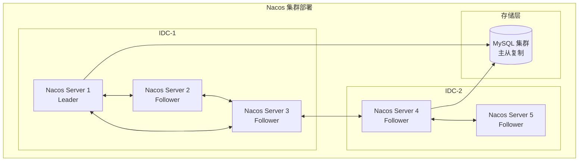

Nacos 集群的关键设计：
- **节点间通过 Distro/Raft 协议同步数据**，无需依赖外部存储即可运行（内嵌 Derby）
- **生产环境推荐使用 MySQL 作为持久化存储**，确保数据可靠性
- **支持多 IDC 部署**，通过 MySQL 主从复制或异地多活方案实现跨机房数据同步
- **推荐集群规模**：3-9 节点，奇数节点便于 Raft 选举

### 2.2 Consul：从注册中心到全栈服务网络平台

#### 2.2.1 架构演进

Consul 是 HashiCorp 开源的服务网格解决方案，提供服务发现、配置和分段功能。从 1.x 到 2.0，Consul 已从单纯的注册中心演进为全栈服务网络平台。

**Consul 核心架构**：

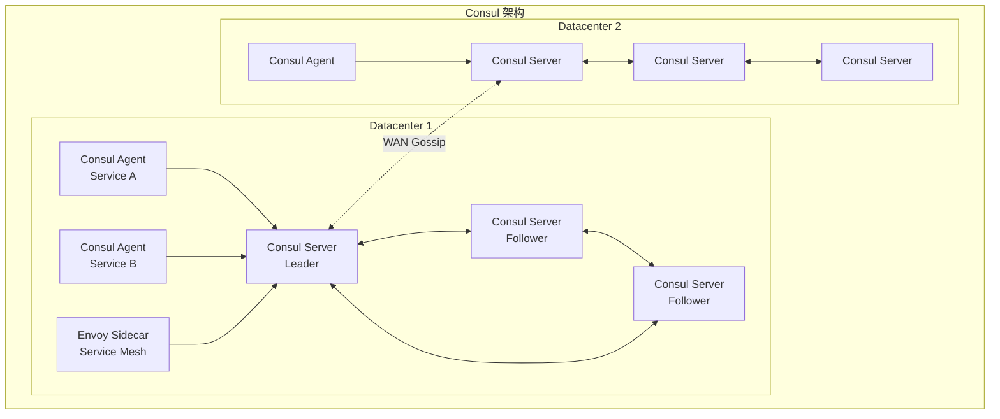

#### 2.2.2 Consul 2.0 新特性

Consul 2.0（2026 年 5 月发布）是一次重大架构升级：

- **性能大幅提升**：重写了内部存储引擎，服务注册和查询吞吐量显著提升
- **Service Mesh 增强**：内置 Envoy Sidecar 自动注入和管理，支持 L7 流量管理
- **多集群联邦（Cluster Federation）**：原生支持跨数据中心、跨 Kubernetes 集群的服务发现与连通
- **API Gateway 集成**：内置 API Gateway，统一管理南北向流量入口
- **安全增强**：支持 mTLS 自动证书轮换、Workload Identity（工作负载身份认证）
- **Kubernetes 原生集成**：Consul K8s Controller 深度集成 Kubernetes CRD，支持 Service、Endpoints 同步

#### 2.2.3 Consul 的服务发现模式

Consul 支持两种服务发现模式，分别对应应用内和应用外范式：

**DNS 接口**（应用外模式）：

```bash
# 查询 order-service 的所有健康实例
dig @consul-server -p 8600 order-service.service.consul

# 查询特定数据中心的服务
dig @consul-server -p 8600 order-service.service.dc2.consul

# 查询带标签的服务实例
dig @consul-server -p 8600 v2.order-service.service.consul
```

**HTTP API**（应用内/应用外均可）：

```bash
# 注册服务
curl -s http://consul-server:8500/v1/agent/service/register -d '{
  "ID": "order-service-1",
  "Name": "order-service",
  "Address": "192.168.1.100",
  "Port": 8080,
  "Check": {
    "HTTP": "http://192.168.1.100:8080/health",
    "Interval": "10s",
    "Timeout": "3s"
  }
}'

# 查询服务
curl -s http://consul-server:8500/v1/health/service/order-service?passing
```

#### 2.2.4 Consul Service Mesh 工作流程

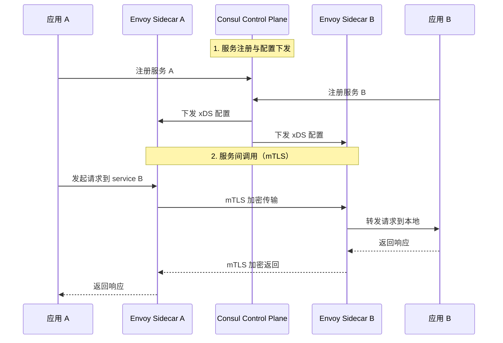

#### 2.2.5 Consul 的 CAP 策略

Consul 采用 CP 模型，使用 Raft 协议保证强一致性：

- **优势**：数据强一致，不会出现不同节点返回不同服务列表的情况
- **风险**：Leader 选举期间（通常 100-500ms）集群不可写；网络分区时，少数派分区不可用
- **缓解措施**：客户端 SDK 内置本地缓存，即使 Consul Server 短暂不可用，客户端仍可使用缓存的服务列表

### 2.3 etcd：Kubernetes 背后的分布式 KV 存储

#### 2.3.1 etcd 作为注册中心的定位

etcd 是 CoreOS（现 Red Hat）开源的分布式键值存储系统，基于 Raft 协议实现强一致性。它本身并非专为服务注册设计，但其 Watch 机制和 Lease 机制使其天然具备服务发现能力。

**etcd 服务注册的核心机制**：

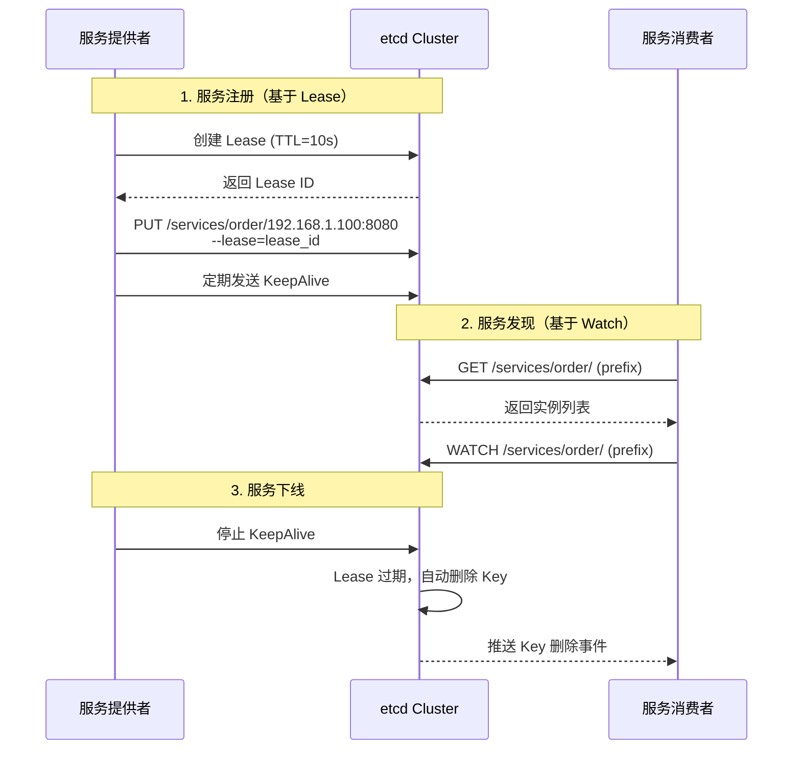

#### 2.3.2 etcd 3.5+ 关键特性

etcd 3.5.x 与 3.6.x 持续维护迭代中，3.7.x 已于 2026 年发布（当前最新 3.7.1）。关键改进：

- **MVCC 存储引擎优化**：压缩（Compaction）性能提升，减少历史版本对存储的占用
- **etcdutl 工具**：替代旧版 etcdctl 的快照管理功能，支持在线增量备份
- **gRPC Proxy**：支持客户端侧的 Watch 和 Lease 合并，减少 Server 端连接压力
- **安全增强**：支持 TLS 自动证书轮换、RBAC 细粒度权限控制
- **3.6.x 新增**：改进的后端存储引擎（BBolt 升级），更高效的 Range 查询性能

#### 2.3.3 etcd 作为注册中心的代码示例

```go
// etcd 服务注册示例（Go 客户端 v3.5+）
package main

import (
    "context"
    "log"
    "time"
    clientv3 "go.etcd.io/etcd/client/v3"
)

func main() {
    cli, err := clientv3.New(clientv3.Config{
        Endpoints:   []string{"http://etcd1:2379", "http://etcd2:2379", "http://etcd3:2379"},
        DialTimeout: 5 * time.Second,
    })
    if err != nil {
        log.Fatal(err)
    }
    defer cli.Close()

    // 创建 Lease，TTL 10 秒
    resp, err := cli.Grant(context.TODO(), 10)
    if err != nil {
        log.Fatal(err)
    }

    // 注册服务，绑定 Lease
    key := "/services/order-service/192.168.1.100:8080"
    _, err = cli.Put(context.TODO(), key, `{"ip":"192.168.1.100","port":8080,"weight":1}`,
        clientv3.WithLease(resp.ID))
    if err != nil {
        log.Fatal(err)
    }

    // 保持 Lease 续期
    ch, err := cli.KeepAlive(context.TODO(), resp.ID)
    if err != nil {
        log.Fatal(err)
    }
    for {
        select {
        case <-ch:
            // Lease 续期成功
        case <-time.After(15 * time.Second):
            // 续期失败，服务将被自动注销
            log.Println("Lease keepalive failed, service will be deregistered")
            return
        }
    }
}
```

#### 2.3.4 etcd 作为注册中心的局限性

尽管 etcd 具备服务发现的基础能力，但作为注册中心存在明显不足：

| 局限性 | 说明 |
|--------|------|
| 无原生服务模型 | etcd 是通用 KV 存储，无服务（Service）、实例（Instance）、分组（Group）等概念，需上层封装 |
| 无健康检查 | etcd 仅提供 Lease 过期机制，不支持 HTTP/TCP/gRPC 主动健康检查 |
| 无推送聚合 | 大量 Watch 在 Server 端独立处理，缺乏事件聚合与批量推送机制 |
| 客户端复杂度高 | 服务注册/发现/负载均衡需业务自行实现，开发成本大 |
| 运维门槛高 | etcd 运维（压缩、碎片整理、快照备份）需要专业知识 |

**结论**：etcd 更适合作为其他注册中心的底层存储引擎，而非直接作为业务级注册中心使用。在 Kubernetes 生态中，etcd 的服务发现能力通过 CoreDNS 和 kube-proxy 间接暴露给业务应用。

### 2.4 ZooKeeper：经典 CP 注册中心的困境

#### 2.4.1 ZooKeeper 的服务注册机制

ZooKeeper 是 Apache 基金会开源的分布式协调服务，最早被广泛用作服务注册中心（Dubbo 2.x 默认注册中心）。其服务注册机制基于临时节点（Ephemeral Node）：

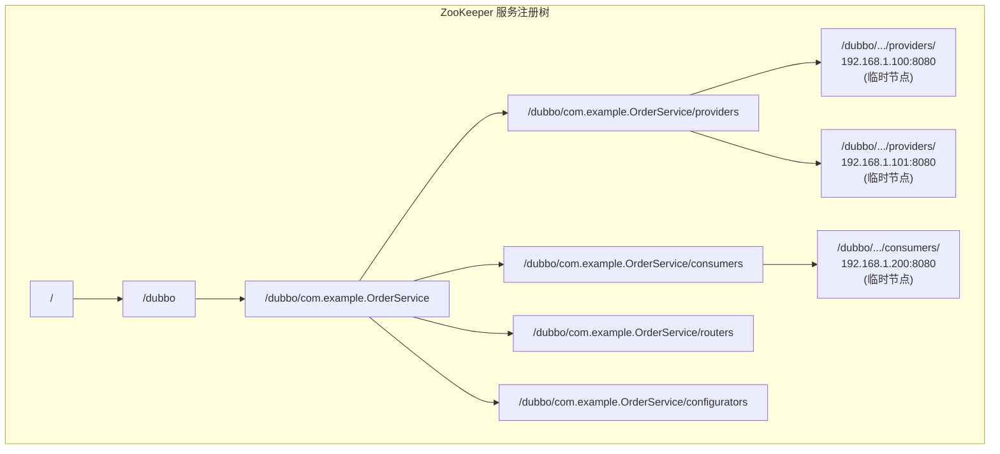

服务提供者创建临时节点，当 Session 过期或连接断开时，临时节点自动删除，实现服务自动下线。服务消费者通过 Watch 机制监听节点变化，感知服务上下线事件。

#### 2.4.2 ZooKeeper 作为注册中心的核心问题

ZooKeeper 3.9.x（当前最新版本）仍在维护，但作为注册中心的局限性已被业界广泛认知：

**1. Session 过期引发的服务雪崩**

这是 ZooKeeper 作为注册中心最严重的问题。当 ZooKeeper 集群出现 GC 停顿、网络抖动或 Leader 切换时，大量客户端 Session 可能同时过期，导致：

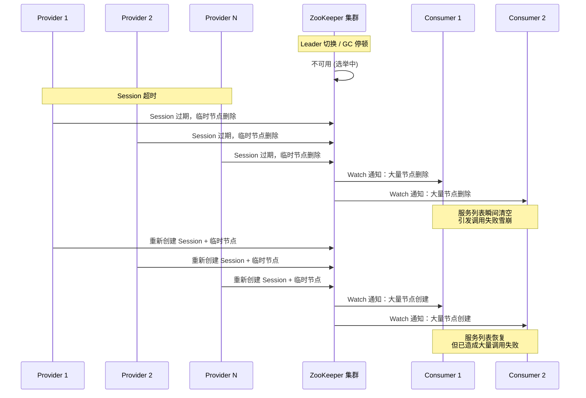

**2. Watch 机制的性能瓶颈**

- Watch 是一次性的，触发后需重新注册
- 大量服务上下线时，Watch 事件呈"惊群效应"（Herd Effect），所有监听者同时收到通知并重新注册 Watch
- 每次重新注册 Watch 都是一次全量数据读取，对 ZooKeeper Server 造成巨大压力

**3. 树形结构的扩展性限制**

- 服务实例数增长时，单个路径下的子节点数膨胀
- 单个节点挂载的子节点与 Watcher 数量过大时，通知风暴与重复注册压力会显著拖累 Server，大规模场景下性能急剧下降
- 全量订阅模式下，每次变更都推送完整的服务列表，网络带宽浪费严重

**4. 运维复杂度高**

- ZooKeeper 的 JVM 调优、事务日志清理、快照管理需要专业经验
- Leader 选举期间服务不可用，对 SLA 要求高的业务影响大
- 缺乏原生的管理控制台，运维依赖第三方工具

#### 2.4.3 ZooKeeper 的现状与建议

| 维度 | 现状 |
|------|------|
| 版本 | 3.9.x 仍在维护，但主要修复 Bug，无重大功能更新 |
| 社区活跃度 | GitHub Stars 12.7k，但注册中心相关讨论极少 |
| Dubbo 官方建议 | Dubbo 3.x 推荐使用 Nacos 作为默认注册中心，ZooKeeper 降级为备选 |
| 适用场景 | 小规模集群（< 1000 实例）、强一致性要求、已有 ZooKeeper 基础设施 |

**建议**：新项目不应选择 ZooKeeper 作为注册中心。已有 ZooKeeper 注册中心的项目，建议制定迁移计划，逐步迁移至 Nacos 或 Consul。

### 2.5 Eureka：一个时代的终结

#### 2.5.1 Eureka 的历史地位

Eureka 是 Netflix 开源的服务注册中心，是 Spring Cloud 早期生态的核心组件。它采用 AP 模型，优先保证可用性，在 Netflix 的微服务实践中发挥了重要作用。

Eureka 的核心设计理念：
- 每个 Eureka Server 独立保存服务注册信息，节点间通过异步复制同步数据
- 服务提供者通过 HTTP 心跳维持注册状态
- 服务消费者从 Eureka Server 拉取服务列表并缓存到本地
- 网络分区时，各 Eureka Server 仍可独立提供服务

#### 2.5.2 Eureka 的现状

| 维度 | 现状 |
|------|------|
| 最新版本 | 1.10.x（仍偶发补丁版本，仅 Bug 修复） |
| 社区活跃度 | GitHub Stars 12.7k，但 Issue 和 PR 响应极慢 |
| 功能迭代 | 自 2018 年起无重大功能更新，Netflix 已停止内部使用 |
| Spring Cloud 官方 | Spring Cloud 2020+ 已将 Eureka 标记为维护模式，推荐迁移至其他方案 |
| 官方声明 | Netflix Wiki 明确表示 Eureka 2.x 的开发已停止 |

#### 2.5.3 Eureka 的技术局限

即使不考虑维护状态，Eureka 本身也存在技术局限：

- **仅支持 HTTP 短连接**：无 gRPC 支持，性能无法与 Nacos 2.x+ 相比
- **仅支持 Java**：无官方多语言 SDK，非 Java 应用需通过 Sidecar 间接接入
- **无配置管理**：仅提供服务注册/发现，无配置中心能力
- **无健康检查**：仅依赖心跳判断存活，不支持 HTTP/TCP 主动健康检查
- **无推送机制**：服务消费者只能定时拉取，变更感知延迟高
- **无分组/命名空间**：缺乏多环境、多租户的隔离能力

**建议**：新项目不应选择 Eureka。使用 Eureka 的存量项目，建议参考 Spring Cloud 官方迁移指南，逐步迁移至 Nacos 或 Consul。

### 2.6 Kubernetes 原生服务发现：云原生的默认选择

#### 2.6.1 Kubernetes Service 发现机制

在 Kubernetes 环境中，服务发现由平台原生提供，无需额外部署注册中心。其核心机制包括：

```mermaid
graph TB
    subgraph "Kubernetes 服务发现"
        subgraph "服务注册"
            P1[Pod 1<br/>label: app=order] --> EP[Endpoints<br/>order-service: [10.1.1.1, 10.1.1.2, 10.1.1.3]
            P2[Pod 2<br/>label: app=order] --> EP
            P3[Pod 3<br/>label: app=order] --> EP
        end
        subgraph "服务发现 - DNS"
            DNS[CoreDNS] -->|A 记录查询| SVC[Service<br/>ClusterIP: 10.96.0.100]
            SVC -->|iptables/ipvs| EP
        end
        subgraph "服务发现 - Envoy (Istio)"
            PILOT[Istio Pilot] -->|xDS 推送| ENVOY[Envoy Sidecar]
            ENVOY -->|直接路由| P1
            ENVOY -->|直接路由| P2
            ENVOY -->|直接路由| P3
        end
    end
```

**核心组件**：

1. **Service + Endpoints**：Kubernetes 通过标签选择器（Label Selector）自动将匹配的 Pod 纳入 Service 的 Endpoints，实现服务注册
2. **CoreDNS**：集群内 DNS 服务，将服务名解析为 Service ClusterIP 或 Pod IP（Headless Service）
3. **kube-proxy**：在节点上配置 iptables/ipvs 规则，实现 Service 到 Pod 的负载均衡

#### 2.6.2 Kubernetes 服务发现的工作模式

```yaml
# Kubernetes Service 定义
apiVersion: v1
kind: Service
metadata:
  name: order-service
  namespace: production
spec:
  selector:
    app: order-service
  ports:
  - port: 8080
    targetPort: 8080
  # ClusterIP 模式（默认）：通过 ClusterIP + DNS 访问
  # Headless 模式：ClusterIP: None，DNS 直接返回 Pod IP
  # ExternalName 模式：CNAME 映射到外部服务
---
# Headless Service - 直接返回 Pod IP，适合客户端负载均衡
apiVersion: v1
kind: Service
metadata:
  name: order-service-headless
spec:
  clusterIP: None  # Headless 模式
  selector:
    app: order-service
  ports:
  - port: 8080
    targetPort: 8080
```

#### 2.6.3 Kubernetes 服务发现 vs 独立注册中心

| 维度 | Kubernetes 原生发现 | 独立注册中心（Nacos/Consul） |
|------|-------------------|---------------------------|
| 部署复杂度 | 零（平台内置） | 需额外部署和运维 |
| 服务注册 | 自动（基于 Pod 标签） | 需 SDK 或 Sidecar 主动注册 |
| 跨集群发现 | 需 Multi-Cluster 方案 / Service Mesh | 原生支持多数据中心 |
| 非容器服务 | 不支持 | 支持（物理机/虚拟机） |
| 配置管理 | 需 ConfigMap + 第三方 | Nacos 内置 / Consul KV |
| 流量治理 | 需 Istio 等补充 | Consul 内置 / Nacos + Dubbo |
| 实时性 | Endpoints 变更延迟约 5-10s | Nacos gRPC 推送 < 1s |

#### 2.6.4 混合模式：Kubernetes + 独立注册中心

在实际生产中，Kubernetes 原生发现与独立注册中心常常共存：

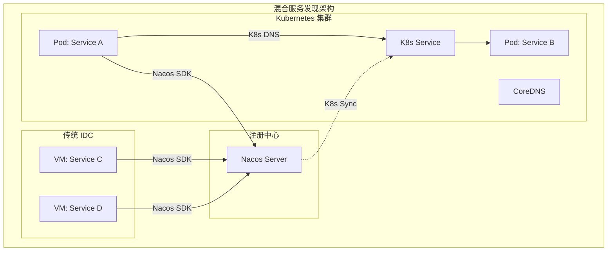

Dubbo 3.x 提供了 Kubernetes Service 双注册机制，使得同一服务同时注册到 K8s Service 和 Nacos，实现跨环境互通。

## 三、CAP 理论与注册中心选型

### 3.1 CAP 理论回顾

在分布式系统中，CAP 三者不可同时满足：

- **C（Consistency）**：所有节点在同一时刻看到相同的数据
- **A（Availability）**：每个请求都能在合理时间内得到非错误响应
- **P（Partition Tolerance）**：网络分区时系统仍能继续运行

对于注册中心而言，P 是必须保证的（分布式系统必然面临网络分区），因此实际选择在 CP 和 AP 之间。

### 3.2 注册中心的 CAP 分类

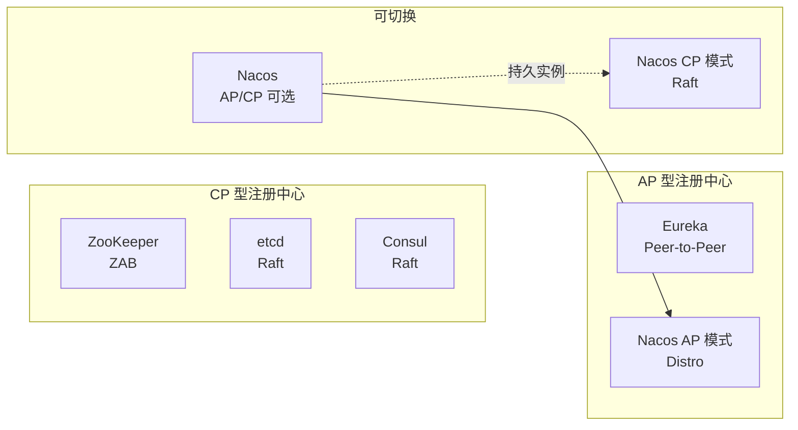

### 3.3 注册中心应该选 CP 还是 AP？

这是一个长期争论的话题。原文的观点是"AP 型注册中心一般更加合适"，理由是注册中心可用性的需求远高于数据一致性。这个观点在 2025-2026 年需要更细致的分析：

**支持 AP 的论据**：
- 注册中心短暂不可用比数据短暂不一致的后果更严重
- 即使数据不一致导致调用了不可用实例，客户端的重试/熔断机制可以兜底
- 注册中心本质是"通讯录"，允许短暂的信息滞后

**支持 CP 的论据**：
- 某些场景（如金融交易、安全认证）对服务路由准确性要求极高
- CP 模型下，客户端无需处理"已下线实例仍被调用"的复杂逻辑
- Consul 的实践证明，CP + 客户端缓存可以在大多数场景下兼顾可用性

**2025-2026 年的共识**：

| 场景 | 推荐模型 | 理由 |
|------|---------|------|
| 互联网高并发 | AP | 可用性优先，客户端治理兜底 |
| 金融/交易 | CP | 路由准确性优先，避免资金风险 |
| 混合场景 | AP/CP 可切换 | Nacos 的临时/持久实例机制 |
| Kubernetes 环境 | CP（etcd） | 平台级一致性要求 |

**关键认知**：CP/AP 的选择并非非此即彼。Nacos 通过临时实例（AP）和持久实例（CP）的混合模型，以及 Consul 通过 CP + 客户端缓存的方案，都在试图在两者之间找到平衡点。实际选型中，应关注的是"注册中心不可用时系统的容错能力"，而非单纯的理论分类。

## 四、六大注册中心全面对比

### 4.1 核心特性对比

| 特性 | Nacos 3.x | Consul 2.0 | etcd 3.5+ | ZooKeeper 3.9 | Eureka 2.x | K8s Service |
|------|-----------|------------|-----------|---------------|------------|-------------|
| CAP 模型 | AP/CP 可选 | CP | CP | CP | AP | CP（etcd） |
| 一致性协议 | Distro / Raft | Raft | Raft | ZAB | 异步复制 | Raft（etcd） |
| 健康检查 | 客户端心跳 + 服务端 TCP/HTTP | Agent + HTTP/TCP/gRPC/Script | Lease 过期 | Session 过期 | 客户端心跳 | Pod Readiness/Liveness |
| 服务发现方式 | SDK 推送 + DNS | DNS + HTTP API | Watch | Watch | 客户端拉取 | DNS + Envoy xDS |
| 配置管理 | 内置 | KV Store | KV Store | 无 | 无 | ConfigMap |
| 多语言支持 | Java/Go/Node/C#/Python/C++ | DNS + HTTP（语言无关） | Go/Java/Python 等 | Java 为主 | Java 为主 | 语言无关 |
| 多数据中心 | 支持 | 原生支持 | 需上层实现 | 需上层实现 | 需上层实现 | Multi-Cluster 方案 |
| Service Mesh | 无（需配合 Dubbo） | 内置 | 无 | 无 | 无 | 需 Istio |
| 管理控制台 | 内置 | 内置 | 无（需第三方） | 无（需第三方） | 内置 | kubectl |
| 集群规模 | 10 万+ 实例 | 1 万+ 实例 | 1 万+ 实例 | 千级实例 | 千级实例 | 5 千+ Service |

### 4.2 性能对比

基于社区基准测试和大规模生产实践的数据（仅供参考，实际性能受部署环境和配置影响）：

| 指标 | Nacos 3.x | Consul 2.0 | etcd 3.5+ | ZooKeeper 3.9 | Eureka 2.x |
|------|-----------|------------|-----------|---------------|------------|
| 注册 QPS | 10,000+ | 5,000+ | 10,000+ | 3,000+ | 2,000+ |
| 查询 QPS | 30,000+ | 10,000+ | 20,000+ | 5,000+ | 5,000+ |
| 变更推送延迟 | < 100ms | < 200ms | < 100ms | < 500ms | 5-30s（拉取） |
| 单集群最大实例 | 10 万+ | 1 万+ | 1 万+ | 千级 | 千级 |
| 客户端连接数 | 10 万+ | 5 万+ | 5 万+ | 1 万+ | 1 万+ |

### 4.3 社区与生态对比

| 维度 | Nacos 3.x | Consul 2.0 | etcd 3.5+ | ZooKeeper 3.9 | Eureka 2.x |
|------|-----------|------------|-----------|---------------|------------|
| GitHub Stars | 33k+ | 30k+ | 52k+ | 13k+ | 13k+ |
| 维护状态 | 活跃迭代 | 活跃迭代 | 活跃迭代 | 维护模式 | 维护模式 |
| 主要贡献者 | 阿里巴巴 | HashiCorp | Red Hat/Google | Apache | Netflix（已停止） |
| Spring Cloud 集成 | Spring Cloud Alibaba | Spring Cloud Consul | 无官方集成 | Spring Cloud Zookeeper | Spring Cloud Netflix |
| Dubbo 集成 | 默认推荐 | 支持 | 支持 | 支持（降级） | 不支持 |
| Kubernetes 集成 | Nacos K8s Sync | Consul K8s | 原生 | 无 | 无 |
| 商业支持 | 阿里云 MSE | HashiCorp Consul Enterprise | Red Hat 支持 | 无 | 无 |

## 五、技术演进时间线

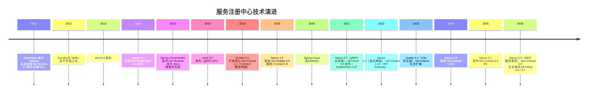

## 六、架构决策指南

### 6.1 选型决策流程

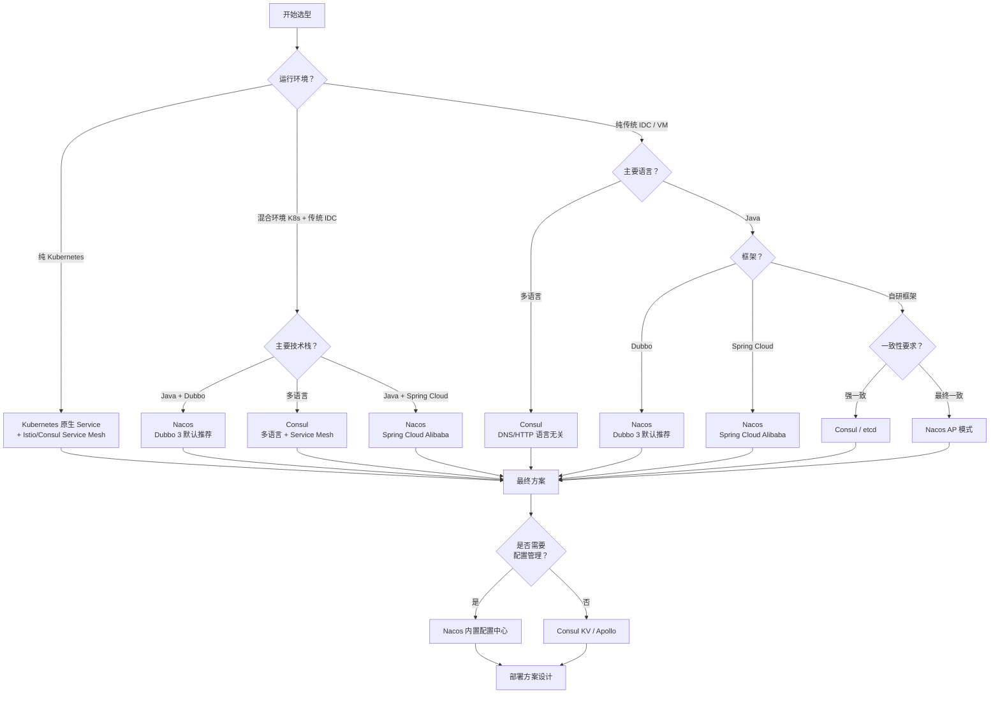

### 6.2 典型场景推荐

#### 场景一：Java 微服务 + Dubbo 3

**推荐方案**：Nacos

理由：
- Dubbo 3 官方默认推荐注册中心
- 内置配置中心，减少组件数量
- AP/CP 可切换，适配不同业务场景
- 国内社区活跃，中文文档完善
- 支持与 Kubernetes Service 双注册

#### 场景二：Java 微服务 + Spring Cloud

**推荐方案**：Nacos（Spring Cloud Alibaba）

理由：
- Spring Cloud Alibaba 已成为 Spring Cloud 生态的主流选择
- 替代 Eureka + Config Server 的组合方案
- 与 Spring Cloud Gateway、Sentinel 深度集成

#### 场景三：多语言微服务

**推荐方案**：Consul

理由：
- DNS + HTTP API 天然支持多语言
- 内置 Service Mesh，统一流量治理
- 多数据中心原生支持
- 健康检查机制丰富（HTTP/TCP/gRPC/Script）

#### 场景四：纯 Kubernetes 环境

**推荐方案**：Kubernetes 原生 Service + Istio/Consul Service Mesh

理由：
- 零额外部署，平台内置
- 与 Pod 生命周期自动绑定
- Istio/Consul 提供 L7 流量治理能力
- 避免引入外部注册中心增加运维负担

#### 场景五：Kubernetes + 传统 IDC 混合环境

**推荐方案**：Nacos（K8s Sync）或 Consul K8s

理由：
- 需要同时支持容器化和非容器化服务
- Nacos K8s Sync 可将 K8s Service 同步到 Nacos
- Consul K8s Controller 可将 K8s Service 同步到 Consul
- 实现跨环境的服务互通

#### 场景六：强一致性要求（金融/交易）

**推荐方案**：Consul 或 Nacos CP 模式

理由：
- Consul Raft 协议保证强一致性
- Nacos 持久实例使用 Raft 协议
- 客户端缓存兜底，兼顾可用性

### 6.3 迁移建议

对于使用旧方案的项目，以下是迁移路径建议：

| 当前方案 | 目标方案 | 迁移难度 | 关键步骤 |
|---------|---------|---------|---------|
| Eureka | Nacos | 低 | Spring Cloud Alibaba 提供兼容适配器 |
| ZooKeeper | Nacos | 中 | Dubbo 3 支持双注册，可灰度迁移 |
| ZooKeeper | Consul | 中 | 需重写服务注册/发现逻辑 |
| Consul 1.x | Consul 2.0 | 低 | 滚动升级，API 向后兼容 |
| Nacos 1.x | Nacos 2.x/3.x | 低 | 滚动升级，2.x 兼容 1.x 客户端 |
| 无注册中心 | Kubernetes 原生 | 低 | 仅需定义 Service + 标签 |

**迁移的核心原则**：
1. **双注册并行**：新旧注册中心同时注册，确保过渡期服务可发现
2. **灰度切换**：按服务逐步切换消费者到新注册中心
3. **回滚预案**：保留旧注册中心，随时可回退
4. **监控先行**：迁移前建立完善的服务调用监控，及时发现异常

## 七、注册中心高可用设计

无论选择哪种注册中心，高可用都是必须保障的。以下是通用的高可用设计原则：

### 7.1 集群部署

所有主流注册中心都支持集群部署，推荐配置：

| 注册中心 | 最小集群 | 推荐集群 | 说明 |
|---------|---------|---------|------|
| Nacos | 3 节点 | 3-9 节点 | 奇数节点便于 Raft 选举 |
| Consul | 3 Server | 3-5 Server + 多 Agent | Server 负责一致性，Agent 负责代理 |
| etcd | 3 节点 | 3-5 节点 | 奇数节点，官方推荐不超过 5 |
| ZooKeeper | 3 节点 | 3-5 节点 | 奇数节点，过多影响选举性能 |

### 7.2 多机房部署

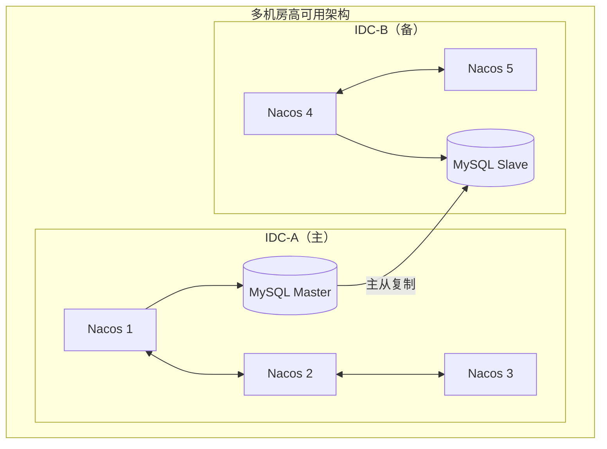

多机房部署的关键考虑：
- **数据同步**：Nacos 通过 MySQL 主从复制，Consul 通过 WAN Gossip 协议
- **就近访问**：客户端优先访问本机房注册中心，降低延迟
- **故障切换**：本机房不可用时，自动切换到备用机房
- **脑裂防护**：CP 型注册中心需配置合理的超时和选举参数

### 7.3 客户端容错

注册中心不可用时，客户端的容错策略至关重要：

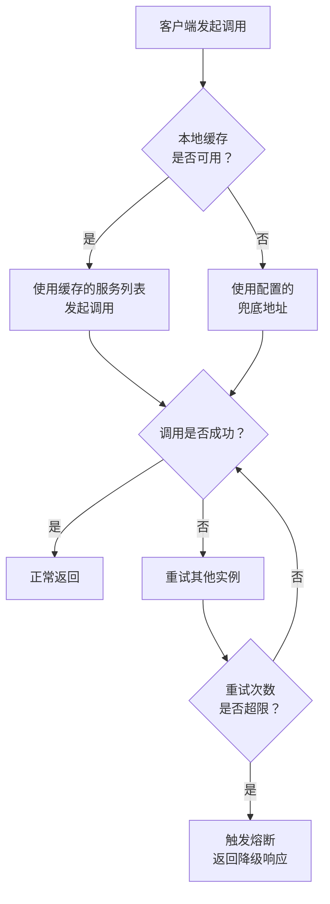

客户端容错的核心策略：
1. **本地缓存**：SDK 缓存最近一次获取的服务列表，注册中心不可用时使用缓存
2. **快速失败**：调用不可用实例时快速失败并重试，避免长时间阻塞
3. **熔断降级**：连续调用失败后触发熔断，返回降级响应
4. **兜底地址**：配置静态兜底地址，作为最后保障

## 八、小结

服务注册中心选型是微服务架构的基础决策之一。在 2025-2026 年的技术背景下，核心结论如下：

**1. Eureka 和 ZooKeeper 作为注册中心的时代已经结束**
- Eureka 已停止功能迭代，Spring Cloud 官方推荐迁移
- ZooKeeper 的 Session 过期雪崩、Watch 惊群等问题在大规模场景下难以接受
- 新项目不应选择这两者，存量项目应制定迁移计划

**2. Nacos 是国内 Java 微服务生态的首选**
- Dubbo 3 默认推荐，Spring Cloud Alibaba 核心组件
- AP/CP 可切换，适配不同业务场景
- 内置配置中心，减少组件数量
- 3.x 版本 gRPC 长连接架构，性能和实时性大幅提升

**3. Consul 是多语言和 Service Mesh 场景的首选**
- DNS + HTTP API 天然支持多语言
- 内置 Service Mesh，统一服务发现与流量治理
- 2.0 版本性能大幅提升，多集群联邦能力增强

**4. etcd 不适合直接作为业务级注册中心**
- 缺乏服务模型、健康检查、推送聚合等注册中心核心能力
- 更适合作为 Kubernetes 底层存储或其他注册中心的存储引擎

**5. Kubernetes 原生发现是云原生环境的默认选择**
- 纯 K8s 环境无需额外部署注册中心
- 混合环境需配合 Nacos/Consul 实现跨环境互通

**6. 选型的核心不是 CP vs AP，而是系统容错能力**
- 注册中心不可用时，客户端的缓存、重试、熔断机制才是最后的保障
- 关注"注册中心故障时系统的表现"，而非理论上的 CAP 分类

最后，选型没有银弹。理解每种方案的架构原理和适用场景，结合自身业务特点做出决策，才是正确的做法。

## 思考题

1. 你的业务当前使用的是哪种注册中心？是否存在本文提到的已知问题？如果有，你的迁移计划是什么？
2. 在 Kubernetes 环境中，如果需要同时支持容器化服务和非容器化（物理机/虚拟机）服务的互相发现，你会如何设计架构？
3. 当注册中心集群整体不可用时，你的系统有哪些容错机制来保证服务调用的可用性？
