# 开源RPC框架如何选型

> **版本基线**：gRPC 1.81+ | Dubbo 3.3+ | Spring Cloud 2024.x | Thrift 0.23+ | brpc 1.17+ | tRPC 1.2+
> **阅读时间**：约 25 分钟
> **前置知识**：[[06]] 如何实现RPC远程服务调用？ · [[10]] Dubbo框架里的微服务组件

## 概述

在系列第6期，我们深入讲解了RPC远程调用的核心原理：一个完整的RPC框架由通信框架、通信协议、序列化/反序列化格式三大部分组成。从零开发一个生产级RPC框架，至少需要投入三人半年以上的研发成本。对于大多数团队而言，选择成熟的开源RPC框架是更务实的选择。

然而，RPC框架的技术生态在过去几年经历了深刻变革。gRPC已成为云原生领域的事实标准，Apache Dubbo演进至3.3版本并全面拥抱Triple协议，Spring Cloud完成了从Netflix组件到Spring官方组件（LoadBalancer、Resilience4j、Gateway等）的迁移，腾讯开源了tRPC框架，百度的brpc持续迭代。这些变化使得RPC框架选型需要重新审视。

本文将从技术演进视角，系统分析主流开源RPC框架的核心特性、适用场景与选型策略。

## 正文

### 一、RPC框架的分类维度

从技术架构角度，RPC框架可按以下维度分类：

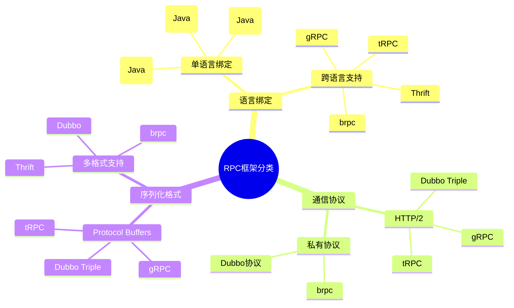

#### 1.1 语言绑定维度

**单语言绑定框架**：与特定语言深度耦合，可充分利用语言特性实现极致性能，但跨语言调用需要额外方案。

**跨语言框架**：基于IDL（Interface Definition Language）定义服务接口，通过代码生成器产出多语言SDK，天然支持异构系统集成。

#### 1.2 通信协议维度

**HTTP/2协议**：提供多路复用、双向流、头部压缩等特性，与云原生生态天然融合，但存在一定协议开销。

**私有协议**：针对RPC场景深度优化，性能更优，但与生态集成需要额外适配。

#### 1.3 序列化格式维度

**Protocol Buffers**：Google开源的高效二进制序列化格式，压缩率高、编解码快，是云原生领域的主流选择。

**多格式支持**：支持JSON、Hessian、Kryo等多种格式，灵活性更高，但需要根据场景选择最优方案。

---

### 二、跨语言RPC框架深度解析

#### 2.1 gRPC：云原生RPC的事实标准

gRPC是Google于2015年开源的跨语言RPC框架，经过近十年发展，已成为云原生生态的核心组件。

**核心架构**

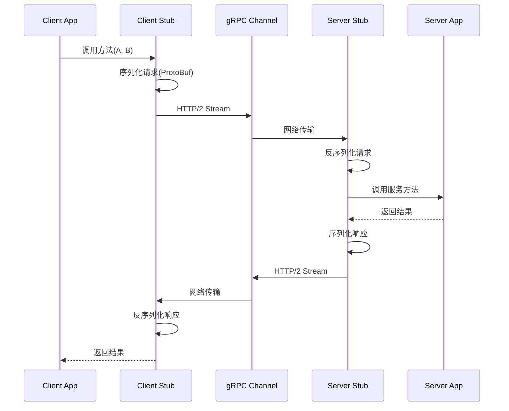

**技术特性（2025-2026版本）**

| 特性 | 说明 | 版本演进 |
|------|------|----------|
| 通信协议 | HTTP/2，支持多路复用、双向流、服务器推送 | 持续优化连接管理 |
| 序列化 | Protocol Buffers 3.x/4.x | 支持Proto3语法，向后兼容 |
| 流式RPC | Unary、Server Streaming、Client Streaming、Bidirectional Streaming | AI场景核心能力 |
| 语言支持 | C++、Java、Python、Go、Ruby、PHP、Node.js、C#、Objective-C、Dart、Kotlin、Rust | 12+语言官方支持 |
| 安全机制 | TLS/SSL、Token认证、OAuth2 | 企业级安全支持 |
| 负载均衡 | 客户端负载均衡、服务端负载均衡 | 与Kubernetes深度集成 |

**gRPC 1.81版本关键更新**

```text
- Python: 移除Python 3.9支持，最低要求Python 3.10+
- Python: 异步栈支持可观测性(Observability)
- Python: 移除GIL优化，提升并发性能
- Ruby: 移除Ruby 3.1支持，最低要求Ruby 3.2+
- Core: 修复ARM弱内存模型上的竞态条件
- Core: EventEngine Windows平台稳定性增强
- Objective-C: 新增receiveNextMessage API
```

**代码示例：Proto文件定义**

```protobuf
// user.proto - Protocol Buffers 3语法
syntax = "proto3";

package userservice;

option go_package = "github.com/example/userservice";
option java_multiple_files = true;
option java_package = "com.example.userservice";

// 用户服务定义
service UserService {
  // 一元RPC：获取用户信息
  rpc GetUser(GetUserRequest) returns (User);
  
  // 服务端流式RPC：批量获取用户
  rpc ListUsers(ListUsersRequest) returns (stream User);
  
  // 客户端流式RPC：批量创建用户
  rpc CreateUsers(stream CreateUserRequest) returns (CreateUsersResponse);
  
  // 双向流式RPC：实时用户状态同步
  rpc StreamUserStatus(stream UserStatusRequest) returns (stream UserStatusResponse);
}

message GetUserRequest {
  int64 user_id = 1;
}

message User {
  int64 id = 1;
  string name = 2;
  string email = 3;
  int32 status = 4;
  int64 created_at = 5;
}
```

**代码示例：Go服务端实现**

```go
// server.go - gRPC Go服务端实现
package main

import (
    "context"
    "log"
    "net"
    
    "google.golang.org/grpc"
    "google.golang.org/grpc/credentials"
    pb "github.com/example/userservice"
)

type userServiceServer struct {
    pb.UnimplementedUserServiceServer
}

func (s *userServiceServer) GetUser(ctx context.Context, req *pb.GetUserRequest) (*pb.User, error) {
    // 业务逻辑实现
    return &pb.User{
        Id:    req.UserId,
        Name:  "John Doe",
        Email: "john@example.com",
    }, nil
}

func (s *userServiceServer) ListUsers(req *pb.ListUsersRequest, stream pb.UserService_ListUsersServer) error {
    // 服务端流式响应
    for i := 0; i < 10; i++ {
        user := &pb.User{Id: int64(i), Name: "User"}
        if err := stream.Send(user); err != nil {
            return err
        }
    }
    return nil
}

func main() {
    // 启用TLS
    creds, err := credentials.NewServerTLSFromFile("server.crt", "server.key")
    if err != nil {
        log.Fatalf("failed to load credentials: %v", err)
    }
    
    lis, err := net.Listen("tcp", ":50051")
    if err != nil {
        log.Fatalf("failed to listen: %v", err)
    }
    
    s := grpc.NewServer(grpc.Creds(creds))
    pb.RegisterUserServiceServer(s, &userServiceServer{})
    
    log.Println("gRPC server listening on :50051")
    if err := s.Serve(lis); err != nil {
        log.Fatalf("failed to serve: %v", err)
    }
}
```

**适用场景**

- 云原生架构：与Kubernetes、Istio、Envoy深度集成
- 多语言微服务：异构系统间的标准化通信
- 流式数据处理：实时音视频、AI推理、事件流
- 移动端应用：HTTP/2的连接复用降低延迟

---

#### 2.2 Apache Thrift：老牌跨语言RPC框架

Thrift最初由Facebook开发，2007年贡献给Apache基金会，是历史最悠久的跨语言RPC框架之一。

**架构层次**

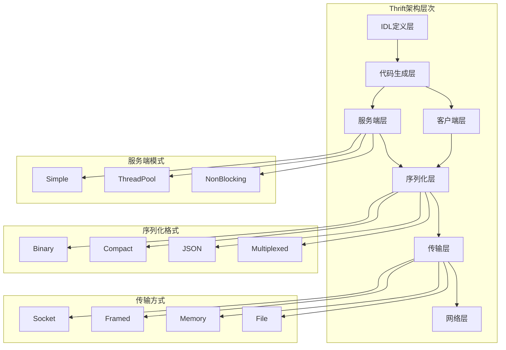

**技术特性**

| 特性 | 说明 |
|------|------|
| 语言支持 | 25+语言（C++、Java、Python、PHP、Ruby、Erlang、Go、Node.js等） |
| 序列化格式 | Binary、Compact、JSON、Multiplexed |
| 传输方式 | Socket、Framed、File、Memory、zlib压缩 |
| 服务端模式 | Simple（单线程）、ThreadPool、NonBlocking（异步IO） |
| 版本兼容 | Thrift 0.23.0（2026年4月发布） |

**Thrift IDL示例**

```thrift
// user.thrift
namespace java com.example.thrift
namespace go example.thrift

struct User {
    1: i64 id,
    2: string name,
    3: string email,
    4: i32 status
}

struct GetUserRequest {
    1: i64 userId
}

service UserService {
    User getUser(1: GetUserRequest request),
    list<User> listUsers(1: i32 limit),
    void createUser(1: User user)
}
```

**适用场景**

- 大数据生态：HBase、Hadoop、Cassandra、Hive等组件广泛使用
- 遗留系统集成：与早期大数据平台的无缝对接
- 多语言支持需求：当gRPC不支持目标语言时的备选方案

---

#### 2.3 tRPC：腾讯开源的新一代RPC框架

tRPC是腾讯于2023年开源的多语言、可插拔、高性能RPC框架，凝聚了腾讯多年微服务实践经验。

**设计理念**

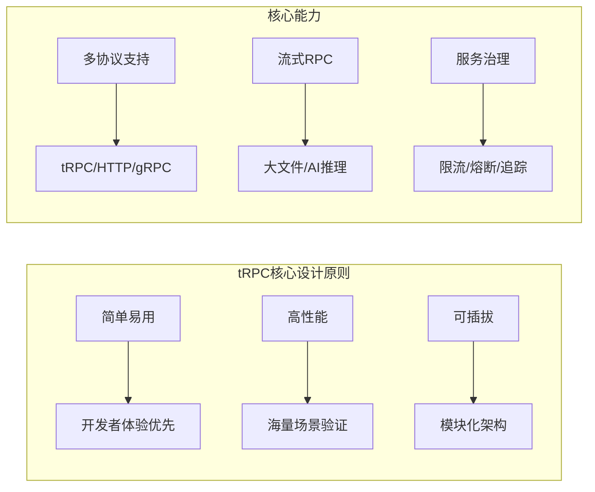

**技术特性**

| 特性 | 说明 |
|------|------|
| 语言支持 | C++、Go（官方），社区支持Java、Python、Rust |
| 协议支持 | tRPC协议、HTTP/HTTPS、gRPC协议 |
| 流式RPC | tRPC Streaming、gRPC Streaming、HTTP Streaming |
| 服务治理 | 集成Consul、Prometheus、OpenTelemetry |
| 插件生态 | 参数校验、认证、日志回放等可扩展插件 |
| 流量控制 | 多场景限流、过载保护机制 |

**tRPC协议设计**

tRPC协议帧结构：

```text
+----------------+----------------+----------------+
|  Header(16B)   |  Meta Header   |  Data Payload  |
+----------------+----------------+----------------+
|  Magic(2B)     |  Version(1B)   |  Type(1B)      |
|  Reserved(4B)  |  TotalLen(4B)  |  MetaLen(2B)   |
|  DataLen(2B)   |  StreamID(2B)  |                |
+----------------+----------------+----------------+
```

**适用场景**

- AI服务：流式推理、语音识别、视频理解
- 大文件传输：文件上传/下载、消息推送
- 腾讯生态：与腾讯云组件深度集成

---

#### 2.4 Apache brpc：百度开源的高性能RPC框架

brpc是百度开源的工业级RPC框架，在百度内部承载万亿级流量。

**技术特性（brpc 1.17.0 - 2026年5月）**

| 特性 | 说明 |
|------|------|
| 语言支持 | C++、Go、Java（通过SDK） |
| 协议支持 | 百度标准协议、HTTP、gRPC、Redis、Memcached |
| 性能优化 | SingleIOBuf高效序列化、RDMA ECE支持 |
| 新特性 | Redis Cluster原生支持、优先级队列、错误率衰减惩罚 |
| 稳定性 | ARM内存可见性修复、Use-After-Free修复 |

**brpc架构**

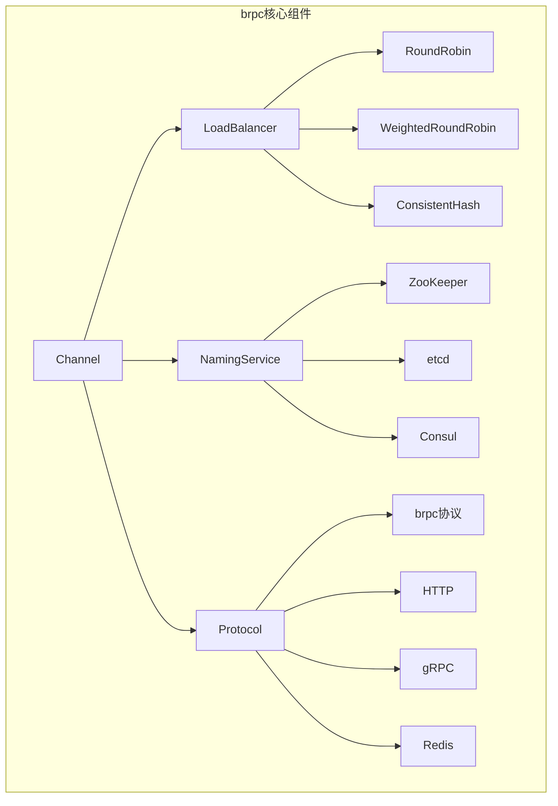

**适用场景**

- 高性能场景：单机百万QPS级别
- 多协议代理：统一接入多种后端协议
- 百度生态：与百度云组件集成

---

### 三、单语言RPC框架深度解析

#### 3.1 Apache Dubbo：国产RPC框架的演进之路

Dubbo是国内最早开源的RPC框架，由阿里巴巴于2011年开源，经历了从2.x到3.x的重大演进。

**Dubbo 3.3核心架构**

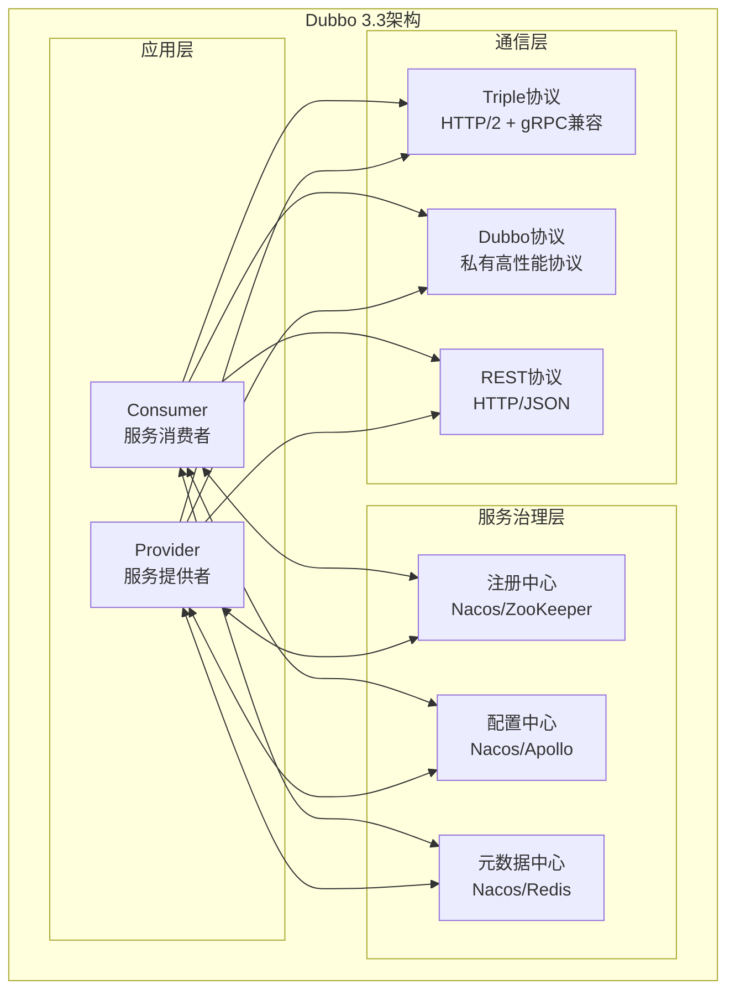

**Dubbo 3.3关键特性**

| 特性 | 说明 | 版本演进 |
|------|------|----------|
| Triple协议 | HTTP/2 + Protocol Buffers，完全兼容gRPC | 3.0引入，3.3增强 |
| 多语言支持 | 通过Triple协议实现跨语言调用 | 3.x核心能力 |
| 虚拟线程池 | Java 21虚拟线程支持 | 3.3.5引入 |
| 响应式编程 | Mutiny Reactive支持 | 3.3.6引入 |
| WebSocket | Triple协议支持WebSocket传输 | 3.3.3引入 |
| Native Image | GraalVM原生镜像支持 | 3.3.4增强 |
| SSE支持 | Server-Sent Events增强 | 3.3.5引入 |
| HTTP/2完善 | 客户端/服务端连接预置处理 | 3.3.6引入 |

**Triple协议详解**

Triple协议是Dubbo 3.x的核心创新，实现了与gRPC的完全互操作：

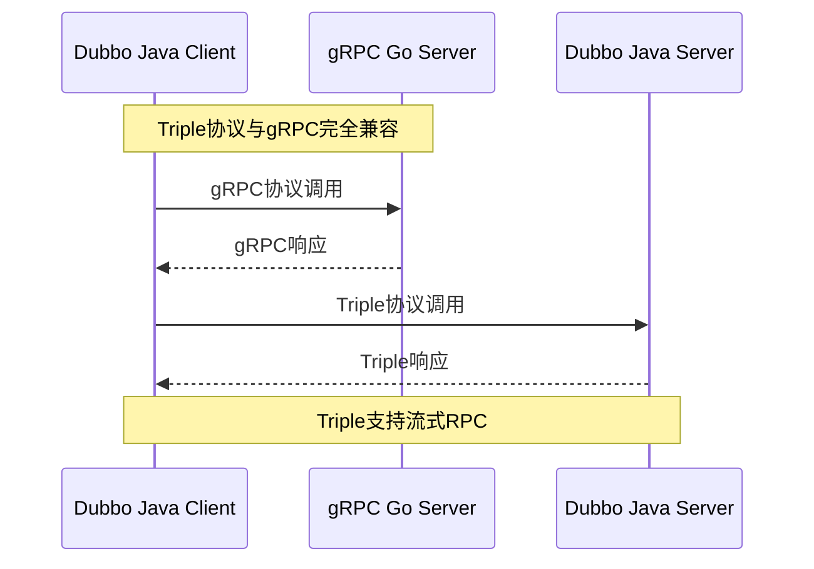

**Dubbo服务定义（Triple协议）**

```protobuf
// dubbo-triple.proto
syntax = "proto3";

package org.apache.dubbo.demo;

option java_multiple_files = true;
option java_package = "org.apache.dubbo.demo";

service DemoService {
    rpc sayHello(HelloRequest) returns (HelloReply);
    rpc sayHelloStream(HelloRequest) returns (stream HelloReply);
}

message HelloRequest {
    string name = 1;
}

message HelloReply {
    string message = 1;
}
```

**Dubbo服务实现**

```java
// DemoServiceImpl.java - Dubbo 3.3服务实现
package org.apache.dubbo.demo;

import org.apache.dubbo.config.annotation.DubboService;
import org.apache.dubbo.rpc.RpcContext;
import reactor.core.publisher.Flux;

@DubboService
public class DemoServiceImpl implements DemoService {
    
    @Override
    public HelloReply sayHello(HelloRequest request) {
        return HelloReply.newBuilder()
            .setMessage("Hello " + request.getName())
            .build();
    }
    
    // 流式响应（Reactor Flux 风格；Dubbo 3.3 同时支持 Mutiny）
    @Override
    public Flux<HelloReply> sayHelloStream(HelloRequest request) {
        return Flux.range(1, 10)
            .map(i -> HelloReply.newBuilder()
                .setMessage("Hello " + request.getName() + " - " + i)
                .build());
    }
}
```

**Dubbo消费者配置**

```java
// Consumer配置 - Spring Boot集成
@Configuration
public class DubboConsumerConfig {
    
    @DubboReference(
        interfaceClass = DemoService.class,
        version = "1.0.0",
        timeout = 3000,
        retries = 2,
        loadbalance = "roundrobin"
    )
    private DemoService demoService;
    
    // 虚拟线程池配置（Java 21+）
    @Bean
    public ExecutorService virtualThreadExecutor() {
        return Executors.newVirtualThreadPerTaskExecutor();
    }
}
```

**适用场景**

- Java技术栈：深度Spring生态集成
- 国产化替代：自主可控的RPC方案
- 渐进式迁移：从Dubbo 2.x平滑升级
- 多语言扩展：通过Triple协议实现跨语言

---

#### 3.2 Spring Cloud：微服务全家桶方案

Spring Cloud是基于Spring Boot的微服务治理框架，提供了一站式微服务解决方案。

**Spring Cloud 2024.x架构**

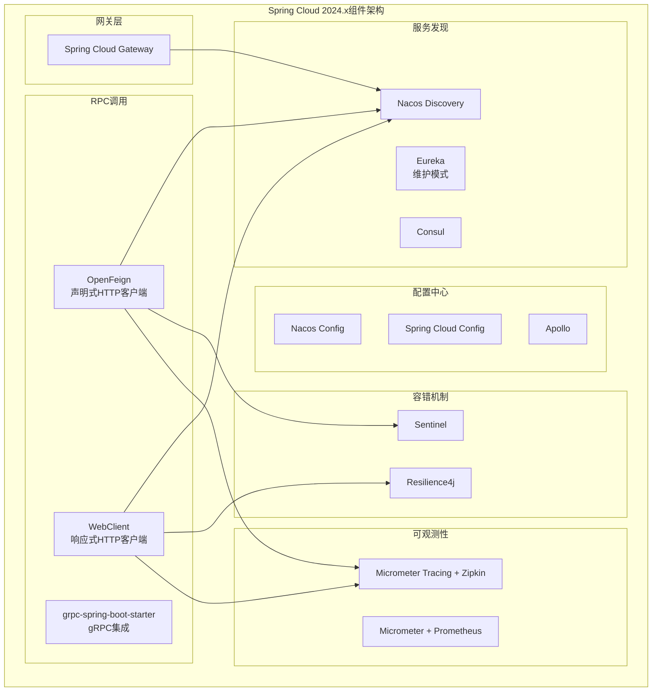

**OpenFeign声明式客户端**

```java
// UserClient.java - OpenFeign接口定义
@FeignClient(
    name = "user-service",
    url = "${user-service.url}",
    configuration = FeignConfig.class,
    fallbackFactory = UserClientFallback.class
)
public interface UserClient {
    
    @GetMapping("/api/users/{id}")
    UserDTO getUser(@PathVariable("id") Long id);
    
    @PostMapping("/api/users")
    UserDTO createUser(@RequestBody UserCreateRequest request);
    
    @GetMapping("/api/users")
    PageResult<UserDTO> listUsers(@RequestParam("page") int page, 
                                   @RequestParam("size") int size);
}

// 降级处理
@Component
public class UserClientFallback implements FallbackFactory<UserClient> {
    @Override
    public UserClient create(Throwable cause) {
        return new UserClient() {
            @Override
            public UserDTO getUser(Long id) {
                return UserDTO.builder()
                    .id(id)
                    .name("默认用户")
                    .fallback(true)
                    .build();
            }

            @Override
            public UserDTO createUser(UserCreateRequest request) {
                return UserDTO.fallback(null);
            }

            @Override
            public PageResult<UserDTO> listUsers(int page, int size) {
                return new PageResult<>();
            }
        };
    }
}
```

**WebClient响应式客户端**

```java
// ReactiveUserClient.java - WebClient响应式调用
@Service
public class ReactiveUserClient {
    
    private final WebClient webClient;
    
    public ReactiveUserClient(@Value("${user-service.url}") String baseUrl) {
        this.webClient = WebClient.builder()
            .baseUrl(baseUrl)
            .defaultHeader(HttpHeaders.CONTENT_TYPE, MediaType.APPLICATION_JSON_VALUE)
            .filter(new RetryFilter())
            .build();
    }
    
    public Mono<UserDTO> getUser(Long id) {
        return webClient.get()
            .uri("/api/users/{id}", id)
            .retrieve()
            .bodyToMono(UserDTO.class)
            .timeout(Duration.ofSeconds(3))
            .onErrorResume(WebClientResponseException.class, 
                e -> Mono.just(UserDTO.fallback(id)));
    }
    
    public Flux<UserDTO> listUsers(int page, int size) {
        return webClient.get()
            .uri(uriBuilder -> uriBuilder
                .path("/api/users")
                .queryParam("page", page)
                .queryParam("size", size)
                .build())
            .retrieve()
            .bodyToFlux(UserDTO.class);
    }
}
```

**Spring Cloud与gRPC集成**

```java
// gRPC服务端集成
@GrpcService
public class UserGrpcService extends UserServiceGrpc.UserServiceImplBase {
    
    @Autowired
    private UserService userService;
    
    @Override
    public void getUser(GetUserRequest request, 
                        StreamObserver<User> responseObserver) {
        User user = userService.findById(request.getUserId());
        responseObserver.onNext(user);
        responseObserver.onCompleted();
    }
}

// gRPC客户端集成
@GrpcClient("user-service")
private UserServiceGrpc.UserServiceBlockingStub userStub;

public User getUser(Long id) {
    GetUserRequest request = GetUserRequest.newBuilder()
        .setUserId(id)
        .build();
    return userStub.getUser(request);
}
```

**适用场景**

- Spring生态：深度Spring Boot集成
- 快速开发：声明式客户端简化代码
- 微服务全家桶：一站式服务治理方案
- 渐进式演进：从单体到微服务平滑迁移

---

#### 3.3 Motan：微博开源的轻量级RPC框架

Motan是微博开源的Java RPC框架，在微博内部支撑海量流量。

**技术特性**

| 特性 | 说明 |
|------|------|
| 语言支持 | Java（核心），PHP/Go（通过Motan-go Sidecar） |
| 注册中心 | Consul、ZooKeeper、etcd |
| 序列化 | Hessian2（默认）、JSON |
| 通信框架 | Netty NIO TCP长连接 |
| 集群策略 | Failover、Failfast、Failsafe等 |

**Motan架构**

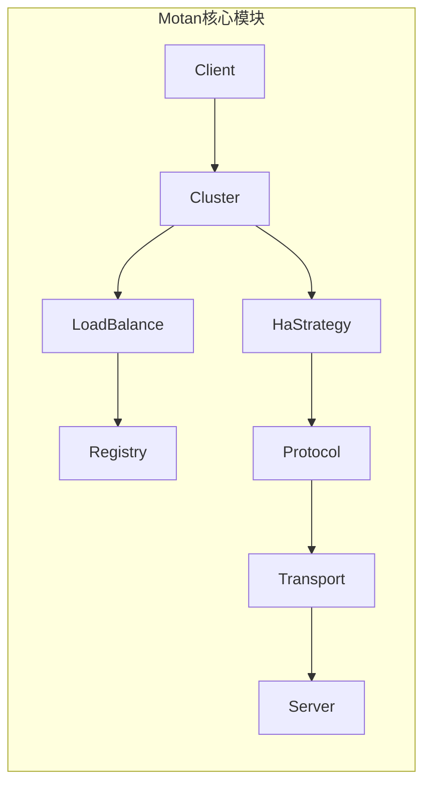

**适用场景**

- 微博生态：与微博内部组件集成
- 轻量级需求：简单RPC调用场景
- PHP/Java混合：通过Motan-go实现跨语言

---

### 四、RPC框架选型决策指南

#### 4.1 选型决策树

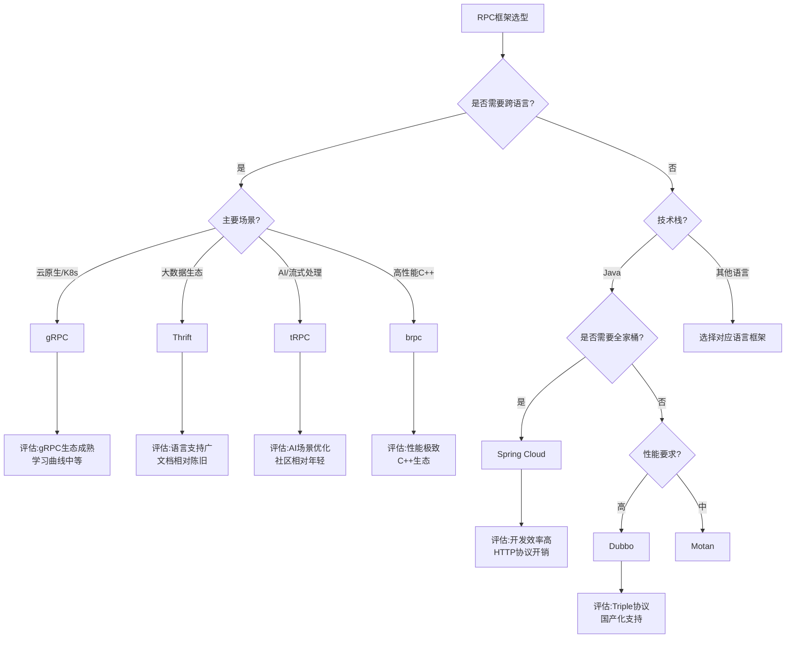

#### 4.2 综合对比表

| 框架 | 语言支持 | 通信协议 | 序列化 | 性能 | 成熟度 | 社区活跃度 | 适用场景 |
|------|----------|----------|--------|------|--------|------------|----------|
| gRPC | 12+语言 | HTTP/2 | ProtoBuf | 高 | 高 | 极高 | 云原生、多语言、流式RPC |
| Thrift | 25+语言 | 多协议 | 多格式 | 高 | 高 | 中 | 大数据生态、遗留系统 |
| tRPC | C++/Go | tRPC/HTTP/gRPC | ProtoBuf | 高 | 中 | 中 | AI服务、腾讯生态 |
| brpc | C++/Go/Java | 多协议 | 多格式 | 极高 | 高 | 中 | 高性能场景、百度生态 |
| Dubbo | Java（Triple跨语言） | Triple/Dubbo/REST | 多格式 | 高 | 高 | 高 | Java微服务、国产化 |
| Spring Cloud | Java | HTTP | JSON | 中 | 高 | 极高 | Spring生态、快速开发 |
| Motan | Java | 私有协议 | Hessian2 | 高 | 中 | 低 | 轻量级Java RPC |

#### 4.3 性能基准参考

基于典型场景的性能对比（数据仅供参考，实际性能受具体实现影响）：

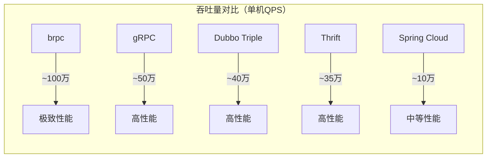

**性能优化要点**

1. **序列化选择**：ProtoBuf > Hessian2 > JSON
2. **协议选择**：私有协议 > HTTP/2 > HTTP/1.1
3. **连接复用**：长连接 > 短连接
4. **IO模型**：异步非阻塞 > 同步阻塞

---

## 技术演进时间线

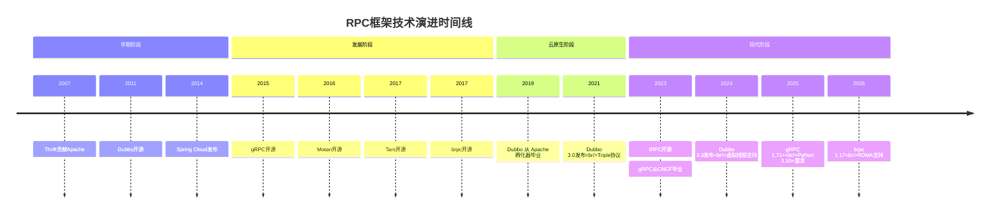

---

## 架构决策指南

### 选型决策矩阵

| 决策因素 | 权重 | gRPC | Dubbo | Spring Cloud | Thrift | tRPC | brpc |
|----------|------|------|-------|--------------|--------|------|------|
| 多语言支持 | 20% | 9 | 7 | 3 | 10 | 7 | 6 |
| 性能 | 15% | 8 | 8 | 5 | 8 | 8 | 10 |
| 云原生集成 | 15% | 10 | 7 | 7 | 4 | 7 | 5 |
| 生态成熟度 | 15% | 9 | 8 | 9 | 7 | 5 | 6 |
| 学习曲线 | 10% | 7 | 7 | 8 | 6 | 6 | 5 |
| 社区支持 | 10% | 10 | 8 | 9 | 5 | 5 | 5 |
| 国产化支持 | 10% | 3 | 10 | 5 | 3 | 8 | 8 |
| 流式RPC | 5% | 10 | 8 | 4 | 4 | 10 | 7 |

### 典型场景推荐

**场景一：云原生微服务架构**

推荐：gRPC + Kubernetes + Istio

理由：
- 与Envoy Sidecar原生集成
- HTTP/2协议支持流量管理
- 流式RPC支持实时通信
- CNCF生态完整

**场景二：Java技术栈企业应用**

推荐：Dubbo 3.3 + Nacos + Sentinel

理由：
- Spring生态深度集成
- Triple协议支持跨语言扩展
- 国产化自主可控
- 完善的服务治理能力

**场景三：快速开发微服务**

推荐：Spring Cloud 2024.x

理由：
- 声明式客户端简化开发
- 一站式微服务组件
- Spring Boot无缝集成
- 文档和社区资源丰富

**场景四：AI推理服务**

推荐：tRPC 或 gRPC

理由：
- 流式RPC支持实时推理
- 高性能序列化
- AI场景优化

**场景五：大数据平台集成**

推荐：Thrift

理由：
- HBase/Hadoop生态兼容
- 25+语言支持
- 成熟稳定

---

## 小结

RPC框架选型是一个多维度的架构决策，需要综合考虑语言生态、性能需求、云原生集成、团队能力等因素。

**核心结论**：

1. **云原生优先选gRPC**：与Kubernetes、Istio深度集成，是云原生生态的事实标准

2. **Java生态选Dubbo**：Dubbo 3.3的Triple协议实现了跨语言能力，同时保持Java生态的深度集成

3. **快速开发选Spring Cloud**：一站式微服务方案，降低开发复杂度

4. **大数据生态选Thrift**：与Hadoop生态无缝对接

5. **AI场景选tRPC/gRPC**：流式RPC是AI推理的核心能力

6. **极致性能选brpc**：C++场景下的性能王者

**未来趋势**：

- **协议统一化**：HTTP/2 + ProtoBuf成为主流组合
- **跨语言标准化**：gRPC兼容成为跨语言RPC的基准
- **流式RPC普及**：AI、实时通信场景推动流式RPC发展
- **服务网格集成**：RPC框架与Istio等Service Mesh深度集成

---

## 思考题

1. 同样是支持跨语言的RPC调用，gRPC的IDL方案和Dubbo的Triple协议方案各有什么优劣？在什么场景下应该选择哪种方案？

2. 随着Service Mesh（如Istio）的普及，传统RPC框架的负载均衡、服务发现、熔断等功能逐渐下沉到Sidecar，这对RPC框架的演进会产生什么影响？

3. 在AI大模型推理场景中，流式RPC（Streaming RPC）为什么比传统的一元RPC（Unary RPC）更适合？请从用户体验和技术实现两个角度分析。

---

**参考资料**：

- [gRPC官方文档](https://grpc.io/docs/)
- [Apache Dubbo官方文档](https://dubbo.apache.org/zh/)
- [Spring Cloud官方文档](https://spring.io/projects/spring-cloud)
- [Apache Thrift官方文档](https://thrift.apache.org/)
- [tRPC GitHub仓库](https://github.com/trpc-group/trpc)
- [Apache brpc官方文档](https://brpc.apache.org/)
