# 如何搭建一个可靠的监控系统

> **版本基线**：OpenTelemetry Collector v1.59 | Prometheus 3.12 | Grafana 13.x
> **阅读时间**：约 25 分钟
> **前置知识**：[[07]] 如何监控微服务调用？

## 概述

在微服务架构中，监控系统是保障系统可靠性的核心基础设施。一个完善的监控系统能够帮助团队快速发现故障、定位问题根因、评估系统健康状态，并为容量规划和性能优化提供数据支撑。没有监控的微服务系统如同在黑暗中飞行——你无法感知系统的运行状态，更无法在故障发生时做出快速响应。

传统的监控系统主要由四个环节组成：**数据收集**、**数据传输**、**数据处理**和**数据展示**。这四个环节构成了监控数据的完整生命周期，从数据在应用或基础设施中产生，到最终以可视化图表或告警通知的形式呈现给运维人员。不同的监控系统实现方案，在这四个环节所采用的技术方案各不相同，适合的业务场景也不一样。

然而，随着云原生技术的演进和可观测性（Observability）理念的普及，监控系统的架构设计发生了深刻变革。传统的"监控"概念正在被更广泛的"可观测性"所取代——监控关注的是已知问题的检测，而可观测性则强调对未知问题的理解能力。2025-2026年，以 OpenTelemetry 为核心的统一可观测性标准、Prometheus 3.x 的原生直方图和 Remote Write 2.0、Grafana 的 AI 辅助分析能力，以及 eBPF 无侵入监控技术，共同构成了新一代监控系统的技术基座。

本文将从传统监控方案出发，深入分析 ELK、Graphite、TICK、Prometheus 等主流方案的演进历程，重点介绍 OpenTelemetry Collector 架构、Prometheus 3.x 新特性、eBPF 无侵入监控、Micrometer 统一 API，以及 AIOps 智能告警等前沿技术，帮助读者构建面向未来的现代化监控体系。

## 一、传统监控方案回顾与演进

### 1.1 ELK Stack：集中式日志解决方案

ELK 是 Elasticsearch、Logstash、Kibana 三个开源软件首字母的缩写，作为经典的集中式日志解决方案，在日志分析和全文检索场景中占据重要地位。

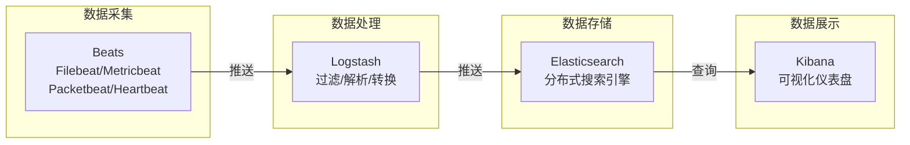

**核心组件职责**：

| 组件 | 职责 | 特点 |
|------|------|------|
| Beats | 轻量级数据采集器 | 低资源占用，支持多种数据源 |
| Logstash | 数据处理管道 | 强大的过滤和转换能力 |
| Elasticsearch | 分布式搜索引擎 | 近实时搜索，支持复杂聚合 |
| Kibana | 可视化平台 | 丰富的图表类型，支持 Dashboard |

**架构演进**：早期架构需要在每台服务器部署 Logstash 进行数据采集，资源消耗较大——Logstash 基于 JVM 运行，通常需要数百兆内存，在大规模部署场景下对服务器性能影响显著。引入 Beats 后，采集层变得轻量化，Logstash 专注于数据处理，形成了更加合理的分层架构。Beats 基于 Go 语言编写，CPU 和内存占用几乎可以忽略不计，可以安全地部署在每台服务器上作为轻量级代理。

**选型建议**：如果你的业务场景以日志检索为主，例如需要根据用户 ID 查询操作记录、根据关键词搜索异常日志、或者进行安全审计分析，ELK 依然是首选方案。但如果你的核心需求是指标监控和告警，那么 ELK 并不是最佳选择——Elasticsearch 作为搜索引擎，在存储和查询时序指标数据时，会带来额外的性能和存储开销，远不如专用的时序数据库高效。

**适用场景**：
- 日志集中管理和全文检索
- 安全事件分析和审计追踪
- 业务日志的复杂查询和聚合分析

**局限性**：
- 时序数据存储效率不如专用 TSDB
- 高基数（High Cardinality）场景下性能下降明显
- 资源消耗较高，不适合纯指标监控场景

### 1.2 Graphite：经典时序数据库方案

Graphite 由 Carbon、Whisper、Graphite-Web 三部分组成，是早期时序数据库监控方案的代表。

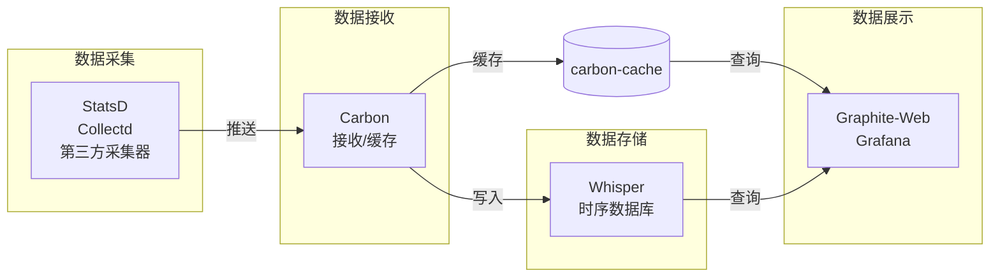

**数据格式**：

```
servers.www01.cpuUsage 42 1286269200
products.snake-oil.salesPerMinute 123 1286269200
```

格式为 `key value timestamp`，其中 key 采用点分层次结构，便于组织和查询。

**查询示例**：

```
# 查询过去24小时的CPU使用率
http://graphite.example.com/render?target=servers.www01.cpuUsage&from=-24h

# 聚合查询：所有产品的每分钟销售额总和
target=sumSeries(products.*.salesPerMinute)
```

**特点**：
- 成熟的聚合函数支持（sum、average、top5 等）
- 灵活的数据保留策略（支持不同精度的降采样）
- 可与 Grafana 无缝集成

**局限性**：
- 缺乏内置数据采集组件，需要额外部署 StatsD 或 Collectd
- Whisper 存储引擎扩展性有限，不支持分布式部署
- 不支持高基数标签，无法按用户 ID 等高维标签聚合
- 社区活跃度下降，新功能迭代缓慢

**选型建议**：Graphite 在传统运维监控场景中仍有其价值，特别是对于指标命名规则明确、聚合需求稳定的场景。但在云原生环境下，Graphite 的层次型 Key 设计和缺乏 Kubernetes 原生支持使其逐渐被 Prometheus 取代。如果你正在维护已有的 Graphite 基础设施，可以通过 Grafana 接入 Graphite 数据源来改善可视化体验；如果是新建监控系统，建议直接采用 Prometheus。

### 1.3 TICK Stack：完整的监控工具链

TICK 是 Telegraf、InfluxDB、Chronograf、Kapacitor 四个软件首字母的缩写，由 InfluxData 开发，提供端到端的监控解决方案。

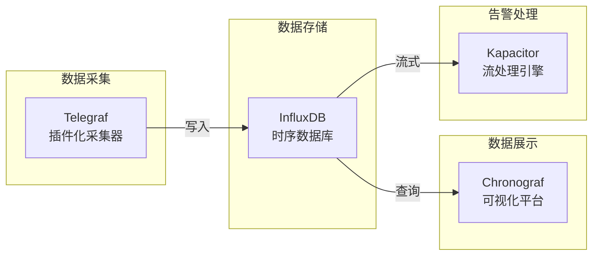

**InfluxDB 数据格式**（Line Protocol）：

```
cpu,host=serverA,region=us_west value=0.64 1434067467100293230
```

格式为 `measurement[,tag-key=tag-value...] field-key=field-value[,...] [timestamp]`，支持标签（tags）和字段（fields）的区分，标签用于索引，字段用于存储数值。

**特点**：
- InfluxDB 支持类 SQL 的 InfluxQL 查询语言
- Telegraf 插件生态丰富，支持 200+ 数据源
- Kapacitor 支持复杂的流处理和告警逻辑

**查询示例**：

```sql
-- 查询一分钟内 CPU 使用率
SELECT 100 - usage_idle FROM "autogen"."cpu"
WHERE time > now() - 1m AND "cpu"='cpu0'
```

### 1.4 Prometheus：云原生监控标准

Prometheus 受 Google Borgmon 启发，由 SoundCloud 于 2012 年创建，2016 年加入 CNCF，成为云原生监控的事实标准。Kubernetes 原生集成 Prometheus，使其成为容器化环境的首选监控方案。

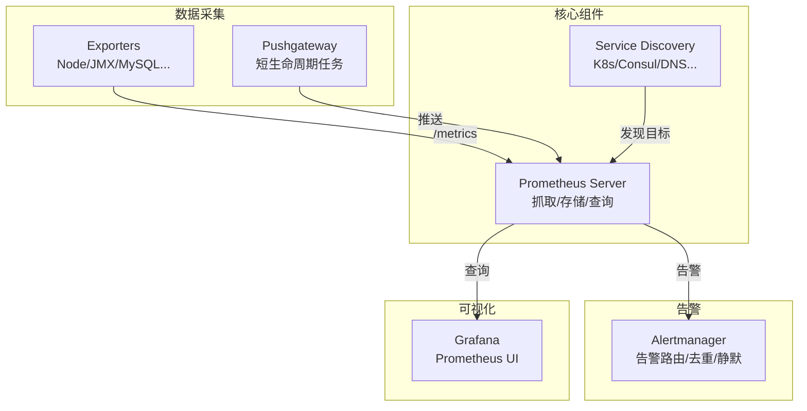

**核心设计理念**：

1. **Pull 模式**：Prometheus 主动拉取指标，而非被动接收推送。这种设计使得服务发现、健康检查、负载均衡更加自然。

2. **多维数据模型**：指标名称 + 标签键值对构成唯一时序：

```
http_requests_total{instance="1.1.1.1:80",job="cluster1",method="GET",path="/api/users"} 100
```

3. **PromQL 查询语言**：简洁而强大的查询语法：

```promql
# 计算过去5分钟的HTTP请求速率
rate(http_requests_total[5m])

# 按路径分组求和
sum by (path) (rate(http_requests_total[5m]))

# 计算 P99 延迟
histogram_quantile(0.99, rate(http_request_duration_seconds_bucket[5m]))
```

**特点**：
- 单机部署简单，运维成本低
- 与 Kubernetes 深度集成
- 强大的服务发现机制
- 丰富的 Exporter 生态

**局限性**：
- 单机存储容量有限，长期存储需配合 Thanos/Cortex/Mimir
- 不适合日志和 Trace 数据（需配合 Loki/Jaeger/Tempo）
- Pull 模式在跨网络监控时需要额外配置（如 Pushgateway）

**选型建议**：Prometheus 是云原生环境下的指标监控首选方案。如果你的系统运行在 Kubernetes 上，Prometheus 几乎是不二之选——Kubernetes 原生提供 Prometheus 指标暴露能力，且拥有丰富的 Exporter 生态。需要注意的是，Prometheus 的设计哲学是"单机足够好"，对于超大规模集群或需要长期历史数据存储的场景，需要配合 Thanos 或 Mimir 实现联邦查询和长期存储。

## 二、2025-2026 监控技术新范式

### 2.1 OpenTelemetry：统一可观测性标准

OpenTelemetry（OTel）是 CNCF 的顶级项目，由 OpenTracing 和 OpenCensus 合并而成，旨在提供统一的可观测性标准，涵盖 Traces、Metrics、Logs 三大支柱。在 OTel 出现之前，可观测性领域面临严重的碎片化问题：Tracing 有 Jaeger 和 Zipkin 两套互不兼容的 API，Metrics 有 Prometheus 和 OpenCensus 两种不同的埋点方式，日志更是缺乏统一标准。OTel 的出现统一了这些分散的标准，为应用提供了一套统一的埋点 API 和 SDK，使得开发者只需一次埋点，即可将数据导出到任意后端。

OTel 的核心价值在于"标准化"和"解耦"。标准化意味着所有语言 SDK 遵循统一的语义约定（Semantic Conventions），例如 HTTP 请求的方法统一使用 `http.method` 标签，状态码统一使用 `http.status_code` 标签。解耦意味着应用代码与后端系统完全分离——你可以随时切换后端，而无需修改应用代码。

#### 2.1.1 OpenTelemetry Collector 架构

OpenTelemetry Collector 是 OTel 的核心组件，提供厂商无关的遥测数据收集、处理和导出能力。Collector 的设计理念是"接收一切、处理一切、导出到任何地方"——它可以从多种数据源接收遥测数据，经过灵活的处理管道进行转换、过滤、聚合，最终导出到任意后端系统。

Collector 支持两种部署模式：**Agent 模式**部署在应用主机上，直接接收应用数据并转发；**Gateway 模式**作为独立服务部署，接收来自多个 Agent 的数据并进行集中处理。Gateway 模式更适合大规模生产环境，可以实现数据处理能力的水平扩展。

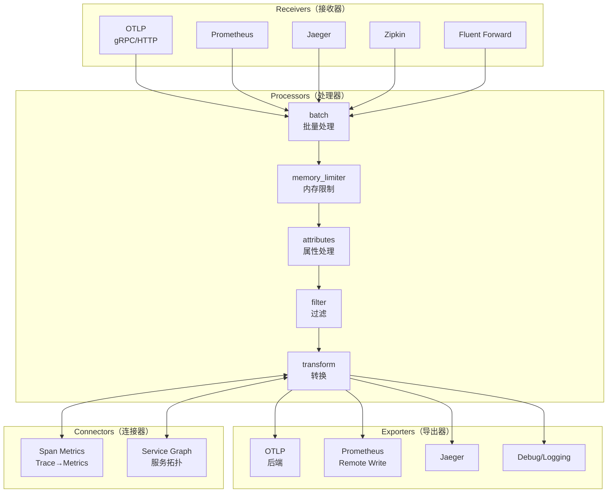

**核心组件说明**：

| 组件类型 | 功能 | 常用示例 |
|----------|------|----------|
| **Receivers** | 接收遥测数据 | OTLP、Prometheus、Jaeger、Zipkin、Fluent Forward |
| **Processors** | 处理/转换数据 | batch、memory_limiter、attributes、filter、transform、tail_sampling |
| **Exporters** | 导出数据到后端 | OTLP、Prometheus Remote Write、Jaeger、Debug |
| **Connectors** | 连接不同管道 | spanmetrics（Trace 转 Metrics）、servicegraph（服务拓扑） |

**Pipeline 配置示例**：

```yaml
# otel-collector-config.yaml (OpenTelemetry Collector v1.x)
receivers:
  otlp:
    protocols:
      grpc:
        endpoint: 0.0.0.0:4317
      http:
        endpoint: 0.0.0.0:4318

  prometheus:
    config:
      scrape_configs:
        - job_name: 'otel-collector'
          scrape_interval: 10s
          static_configs:
            - targets: ['localhost:8888']

processors:
  batch:
    timeout: 1s
    send_batch_size: 1024
    send_batch_max_size: 8192

  memory_limiter:
    check_interval: 1s
    limit_mib: 512
    spike_limit_mib: 128

  attributes:
    actions:
      - key: environment
        value: production
        action: insert

  filter:
    error_mode: ignore
    metrics:
      metric:
        - 'name == "unwanted_metric"'

exporters:
  otlp:
    endpoint: tempo:4317
    tls:
      insecure: true

  prometheusremotewrite:
    endpoint: http://prometheus:9090/api/v1/write

  debug:
    verbosity: detailed

connectors:
  spanmetrics:
    dimensions:
      - name: http.method
      - name: http.status_code
    histogram:
      explicit:
        buckets: [100us, 1ms, 10ms, 100ms, 1s]

service:
  pipelines:
    traces:
      receivers: [otlp]
      processors: [memory_limiter, batch]
      exporters: [otlp, spanmetrics]

    metrics:
      receivers: [otlp, prometheus, spanmetrics]
      processors: [memory_limiter, batch, attributes]
      exporters: [prometheusremotewrite]

    logs:
      receivers: [otlp]
      processors: [memory_limiter, batch]
      exporters: [debug]
```

#### 2.1.2 OTLP 协议

OpenTelemetry Protocol (OTLP) 是 OTel 的原生传输协议，支持 gRPC 和 HTTP 两种传输方式，已成为可观测性数据传输的事实标准。

**协议特点**：
- 高效的 Protobuf 序列化
- 支持 gRPC 流式传输
- 内置背压和流控机制
- 支持压缩（gzip、zstd）

**当前稳定版本**：OTLP v1.10.0（截至 2026 年 5 月）

OTLP 协议的成熟对可观测性生态具有深远影响。在 OTLP 之前，不同的后端系统使用不同的数据传输协议，例如 Jaeger 使用 Thrift/Protobuf、Zipkin 使用 JSON/SProtobuf、Prometheus 使用 Exposition Format，导致数据在系统间流转时需要多次格式转换。OTLP 统一了这一流程，使得任何支持 OTLP 的组件都可以无缝对接，大大简化了可观测性管道的搭建工作。

对于 Java 应用，OTel SDK 提供了自动和手动两种埋点方式。自动埋点通过 Java Agent 实现，只需在 JVM 启动参数中添加 `-javaagent:opentelemetry-javaagent.jar`，即可自动采集 HTTP、gRPC、JDBC、Redis 等常用框架的 Trace 和 Metrics 数据，对业务代码零侵入。手动埋点则通过 OTel API 在关键业务逻辑中添加 Span 和指标，提供更精细的可观测性。

### 2.2 Prometheus 3.x 新特性

Prometheus 3.0 于 2024 年 11 月正式发布，是自 2.0 以来的首个大版本更新，带来了众多重要改进。

#### 2.2.1 核心新特性

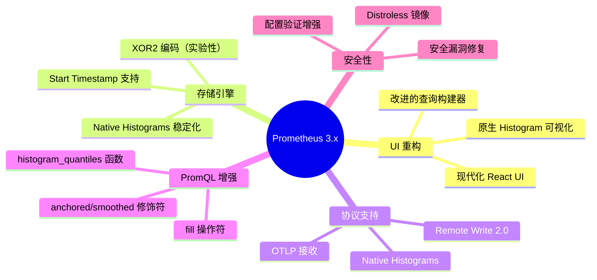

**1. Native Histograms（原生直方图）稳定化**

Prometheus 3.x 将 Native Histograms 从实验特性升级为稳定特性，通过配置项 `scrape_native_histograms` 启用。

```yaml
# prometheus.yml (Prometheus 3.x)
global:
  scrape_native_histograms: true

scrape_configs:
  - job_name: 'my-app'
    static_configs:
      - targets: ['localhost:8080']
```

**Native Histograms 优势**：
- 存储效率提升 10-100 倍（相比经典直方图；官方示例场景数值，非实测）
- 支持任意精度分位数计算
- 动态桶边界，无需预定义
- 支持自定义桶边界（NHCB）

**2. OTLP 接收支持**

Prometheus 3.x 原生支持接收 OTLP 数据，可直接作为 OpenTelemetry Collector 的后端：

```yaml
# prometheus.yml
otlp:
  promote_resource_attributes:
    - service.name
    - service.instance.id
  keep_original_resource_attributes: true
```

**3. Remote Write 2.0**

Remote Write 2.0 协议带来多项改进：
- 支持 Start Timestamp（原 Created Timestamp）
- 更高效的 Protobuf 编码
- 改进的错误处理和重试机制

**4. PromQL 增强**

```promql
# anchored 修饰符：锚定查询范围
rate(http_requests_total[5m] anchored)

# smoothed 修饰符：平滑插值
rate(http_requests_total[5m] smoothed)

# 多分位数计算（实验性）
histogram_quantiles(0.5, 0.9, 0.99, rate(http_request_duration_seconds_bucket[5m]))

# fill 操作符：填充缺失值
vector(0) fill_left (rate(http_requests_total[5m]))
```

**5. 现代化 UI**

Prometheus 3.x 采用全新的 React UI，提供：
- 原生直方图可视化
- 改进的查询编辑器
- 更好的告警规则展示
- 响应式设计

#### 2.2.2 Prometheus 3.12 版本亮点（2026年5月）

| 类别 | 新特性 |
|------|--------|
| **安全** | Remote Write 请求解码长度限制、STACKIT SD 敏感信息保护 |
| **功能** | `/api/v1/status/self_metrics` 端点、Outscale VM SD、DigitalOcean Managed Databases SD |
| **PromQL** | `start()`、`end()`、`range()`、`step()` 实验函数 |
| **性能** | Head Chunk 查询优化、PromQL FloatHistogram 性能改进 |
| **UI** | 时序删除 Web 界面 |

### 2.3 Grafana 可观测性平台

Grafana 已从单一的仪表盘工具演进为全栈可观测性平台，支持 Metrics、Logs、Traces 的统一可视化。Grafana 的演进历程反映了可观测性领域的发展趋势：从单一数据源展示到多数据源关联查询，从静态仪表盘到动态模板，从人工分析到 AI 辅助，从可视化工具到完整的可观测性平台。

Grafana 的核心竞争力在于其开放性和生态。它支持超过 30 种数据源，包括 Prometheus、Loki、Tempo、Elasticsearch、InfluxDB、Jaeger、Zipkin 等，使得运维人员可以在一个界面中关联查看不同类型的遥测数据。Grafana 的 Explore 模式特别适合故障排查场景——你可以从一条异常指标开始，通过 Exemplars 跳转到对应的 Trace，再从 Trace 的日志行跳转到 Loki 查看详细日志，实现"指标-Trace-日志"的三位一体关联分析。

#### 2.3.1 Grafana 核心能力

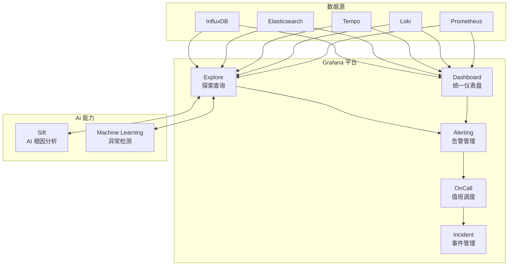

**Grafana 13.x 主要特性**：

| 功能领域 | 特性 |
|----------|------|
| **可视化** | Canvas Panel、Flame Graph、Trace View 改进 |
| **告警** | 统一告警管理、多数据源告警规则、静默和抑制 |
| **AI/ML** | Sift AI 根因分析、异常检测、预测告警 |
| **安全** | RBAC 细粒度权限、审计日志、SAML/OAuth 增强 |
| **协作** | Dashboard 版本控制、注释协作、公共 Dashboard |

#### 2.3.2 Grafana Alerting 架构

```yaml
# alerting_rules.yaml
groups:
  - name: service_health
    rules:
      - alert: HighErrorRate
        expr: |
          sum by (service) (rate(http_requests_total{status=~"5.."}[5m]))
          /
          sum by (service) (rate(http_requests_total[5m])) > 0.05
        for: 5m
        labels:
          severity: critical
        annotations:
          summary: "High error rate for {{ $labels.service }}"
          description: "Error rate is {{ $value | humanizePercentage }}"

      - alert: ServiceLatencyP99
        expr: |
          histogram_quantile(0.99,
            sum by (le, service) (rate(http_request_duration_seconds_bucket[5m]))
          ) > 1
        for: 10m
        labels:
          severity: warning
        annotations:
          summary: "High P99 latency for {{ $labels.service }}"
```

### 2.4 eBPF 无侵入可观测性

eBPF（Extended Berkeley Packet Filter）技术允许在内核空间安全地运行沙盒程序，实现无代码侵入的系统级可观测性。eBPF 是近年来 Linux 内核最重要的创新之一，它允许开发者在不修改内核源码、不重启系统的情况下，动态地注入安全沙盒程序到内核中运行。这一特性使得 eBPF 成为实现零侵入监控的理想技术。

与传统的应用层监控方案相比，eBPF 监控具有三个显著优势：第一，**零侵入**——无需修改应用代码，无需重新部署，对业务完全透明；第二，**低开销**——eBPF 程序在内核空间执行，避免了用户态和内核态之间的上下文切换，性能开销通常在 1-5% 以内；第三，**深度可见**——能够捕获内核级别的系统调用、网络数据包、文件 I/O 等事件，提供应用层无法获取的深度可观测性。

#### 2.4.1 eBPF 监控原理

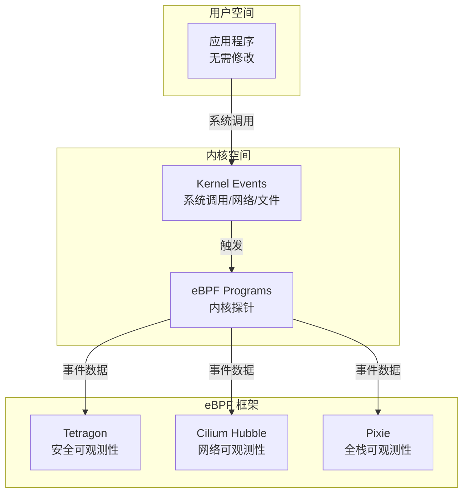

#### 2.4.2 Cilium Tetragon

Tetragon 是 Cilium 的 eBPF 安全可观测性组件，提供实时、低开销的内核级监控。

**核心能力**：
- **进程生命周期监控**：`process_exec`、`process_exit` 事件
- **系统调用追踪**：`process_kprobe`、`process_tracepoint`
- **网络可观测性**：TCP/UDP 连接、DNS 查询
- **文件访问监控**：敏感文件读写追踪
- **Kubernetes 感知**：自动关联 Pod、Namespace、Service 元数据

**TracingPolicy 示例**：

```yaml
# tetragon-policy.yaml
apiVersion: cilium.io/v1alpha1
kind: TracingPolicy
metadata:
  name: monitor-network-connect
spec:
  kprobes:
    - call: "tcp_connect"
      syscall: false
      args:
        - index: 0
          type: "sock"
      returnArg:
        index: 0
        type: "int"
      returnArgAction: "Post"
      selectors:
        - matchPIDs:
            - operator: "In"
              values:
                - 1  # 监控所有进程
          matchArgs:
            - index: 0
              operator: "Equal"
              values:
                - "AF_INET"  # IPv4
```

**Tetragon v1.7 特性**（2026年4月）：
- 改进的进程凭证监控
- 增强的特权执行检测
- 优化的 eBPF 程序加载

#### 2.4.3 Pixie 全栈可观测性

Pixie（Pixie Labs 开源，2020 年被 New Relic 收购，后捐赠给 CNCF）提供基于 eBPF 的全栈可观测性，无需修改应用代码即可获得：

- **应用层协议解析**：HTTP、gRPC、MySQL、Redis、Kafka
- **网络拓扑可视化**：服务依赖关系自动发现
- **性能剖析**：CPU、内存、I/O 热点分析
- **Kubernetes 集成**：深度 K8s 元数据关联

Pixie 的独特之处在于它的"即时可观测性"（Instant Observability）理念。部署 Pixie 后，无需任何额外配置，即可自动获得 Kubernetes 集群中所有服务的 HTTP 请求率、延迟分布、错误率等关键指标，以及服务间的网络拓扑图。这对于快速了解一个新集群的运行状态，或者排查一个不熟悉的微服务系统的故障，非常有帮助。

### 2.4.4 eBPF 与传统监控方案的协同

eBPF 监控并非要取代传统的应用层监控，而是作为补充。两者在可观测性栈中扮演不同角色：

- **应用层监控**（OTel SDK、Micrometer）：精确的业务语义，可追踪到具体的代码路径，适合业务指标和分布式追踪
- **系统层监控**（eBPF、Tetragon）：无侵入的深度可见性，可捕获内核级事件，适合安全审计和网络监控
- **基础设施监控**（Node Exporter、cAdvisor）：标准化的系统和容器指标，适合资源容量规划

在实际部署中，推荐将 eBPF 监控数据通过 OTLP 或 Prometheus 格式导出到统一的后端存储，由 Grafana 进行集中展示，实现应用层和系统层监控数据的关联分析。

### 2.5 Micrometer 统一 Metrics API

Micrometer 是 Java 生态的应用指标门面，提供厂商无关的指标采集接口，支持 Prometheus、Atlas、Datadog、InfluxDB 等多种后端。Micrometer 的设计理念类似于 SLF4J 之于日志框架——它不提供具体的指标存储和查询能力，而是定义了一套统一的指标采集 API，让开发者可以在运行时选择具体的监控后端。

在微服务监控实践中，Micrometer 的核心价值在于降低了监控方案的切换成本。当团队从 Prometheus 迁移到 Datadog，或者同时使用多个监控后端时，应用代码无需任何修改，只需调整配置即可。

#### 2.5.1 Micrometer Observation API

Micrometer 1.x 引入 Observation API，统一 Metrics 和 Tracing 的埋点方式：

```java
// Micrometer 1.14+ 示例
import io.micrometer.observation.Observation;
import io.micrometer.observation.ObservationRegistry;

@Service
public class OrderService {
    private final ObservationRegistry observationRegistry;
    private final MeterRegistry meterRegistry;

    public Order createOrder(OrderRequest request) {
        // 创建 Observation，自动生成 Span 和 Metrics
        return Observation.createNotStarted("order.create", observationRegistry)
            .lowCardinalityKeyValue("type", request.getType())
            .lowCardinalityKeyValue("customer.tier", request.getCustomerTier())
            .observe(() -> {
                // 业务逻辑
                Order order = processOrder(request);

                // 记录业务指标
                meterRegistry.counter("orders.created",
                    "type", request.getType(),
                    "status", "success"
                ).increment();

                return order;
            });
    }
}
```

**Observation API 核心概念**：

| 概念 | 说明 |
|------|------|
| **Observation** | 一次可观测操作，自动生成 Span 和 Metrics |
| **ObservationRegistry** | Observation 注册中心 |
| **KeyValues** | 低/高基数标签 |
| **ObservationConvention** | 命名和标签约定 |

#### 2.5.2 Spring Boot 集成

Spring Boot 3.x 原生集成 Micrometer Observation API：

```yaml
# application.yml
management:
  observations:
    enabled: true
  tracing:
    enabled: true
    sampling:
      probability: 1.0

  otlp:
    metrics:
      export:
        enabled: true
        url: http://otel-collector:4318/v1/metrics
    tracing:
      export:
        enabled: true
        endpoint: http://otel-collector:4318/v1/traces

  prometheus:
    metrics:
      export:
        enabled: true
```

### 2.6 AIOps 智能告警

AIOps（Artificial Intelligence for IT Operations）将机器学习应用于运维监控，实现智能告警、异常检测和根因分析。在微服务架构下，告警管理面临严峻挑战：一个服务故障可能引发数十个上游服务的告警风暴，导致运维人员被大量冗余告警淹没，难以快速定位真正的故障源头。AIOps 技术正是为解决这一痛点而生。

传统告警依赖静态阈值，例如"CPU 使用率超过 80% 触发告警"。这种方式存在两个根本性问题：第一，静态阈值无法适应业务的动态变化——凌晨 3 点的 80% CPU 使用率和促销高峰期的 80% CPU 使用率，其含义完全不同；第二，静态阈值无法捕捉复杂的异常模式——某些异常表现为指标波动频率的变化，而非绝对值的变化。AIOps 通过机器学习算法自动学习指标的正常行为模式，能够检测到传统阈值告警无法发现的异常。

#### 2.6.1 智能告警核心能力

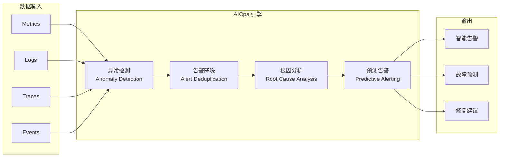

#### 2.6.2 异常检测算法

| 算法类型 | 适用场景 | 特点 |
|----------|----------|------|
| **统计方法** | 单指标异常 | 简单高效，适合稳定基线 |
| **时序分解** | 周期性数据 | 分离趋势、周期、残差 |
| **机器学习** | 复杂模式 | 需要训练数据，适应性强 |
| **深度学习** | 高维数据 | 计算密集，效果最佳 |

**Prometheus 异常检测示例**（使用 Prometheus Recording Rules）：

```yaml
# anomaly_detection.yml
groups:
  - name: anomaly_detection
    rules:
      # 计算7天滚动平均值和标准差
      - record: job:http_requests:rate_7d_avg
        expr: avg_over_time(rate(http_requests_total[5m])[7d:])

      - record: job:http_requests:rate_7d_stddev
        expr: stddev_over_time(rate(http_requests_total[5m])[7d:])

      # Z-Score 异常检测
      - alert: RequestRateAnomaly
        expr: |
          (rate(http_requests_total[5m]) - job:http_requests:rate_7d_avg)
          / job:http_requests:rate_7d_stddev > 3
        for: 5m
        labels:
          severity: warning
        annotations:
          summary: "Request rate anomaly detected"
```

#### 2.6.3 告警降噪策略

```yaml
# alertmanager.yml
route:
  group_by: ['alertname', 'cluster', 'service']
  group_wait: 30s
  group_interval: 5m
  repeat_interval: 4h
  receiver: 'team-email'

  routes:
    # 关键告警立即通知
    - match:
        severity: critical
      receiver: 'team-pagerduty'
      group_wait: 10s

    # 使用智能分组
    - match:
        alertname: HighErrorRate
      receiver: 'team-email'
      group_by: ['service', 'instance']
      group_interval: 1m

inhibit_rules:
  # 节点宕机时抑制该节点上的服务告警
  - source_matchers:
      - alertname = NodeDown
    target_matchers:
      - alertname =~ ServiceDown|HighErrorRate
    equal: ['instance']

receivers:
  - name: 'team-email'
    email_configs:
      - to: 'team@example.com'
        send_resolved: true

  - name: 'team-pagerduty'
    pagerduty_configs:
      - service_key: '<pagerduty-key>'
        severity: critical
```

## 三、监控方案选型对比

### 3.1 传统方案对比

从监控系统的四个核心环节来对比传统方案，可以更清晰地理解各方案的差异和适用场景。

**数据收集环节**：ELK 通过在每台服务器部署 Beats 代理采集数据，Beats 家族包括 Filebeat（文件）、Metricbeat（系统指标）、Packetbeat（网络流量）、Heartbeat（可用性探测）等，覆盖了常见的数据源类型。Graphite 本身没有数据采集组件，需要配合 StatsD 或 Collectd 等第三方采集器使用。TICK 使用 Telegraf 作为数据采集组件，Telegraf 的插件生态非常丰富，支持超过 200 种输入插件。Prometheus 通过 Exporters 组件获取指标数据，社区提供了数百种 Exporter 覆盖主流中间件和基础设施。

**数据传输环节**：ELK、Graphite、TICK 三种方案都采用"推数据"（Push）模式——采集器主动将数据推送到后端。而 Prometheus 采用"拉数据"（Pull）模式——Prometheus Server 定期从目标拉取指标。Pull 模式的优势在于：服务端可以感知目标的健康状态，无需在客户端配置推送地址，且天然支持服务发现。Push 模式的优势在于：可以穿越防火墙，适合短生命周期任务（如批处理作业）。

**数据处理环节**：ELK 可以对日志的任意字段建立索引，适合多维度查询，但在存储时序数据时会有额外的性能和存储开销。Graphite 通过 Graphite-Web 提供丰富的聚合函数。InfluxDB 通过 InfluxQL 提供类 SQL 的查询能力。Prometheus 通过 PromQL 提供简洁而强大的查询语法，在表达相同查询逻辑时，PromQL 通常比 InfluxQL 更加简洁。

**数据展示环节**：Graphite、TICK 和 Prometheus 自带的展示功能都比较基础，但它们都支持 Grafana 作为可视化前端。Grafana 是目前最流行的开源仪表盘工具，支持多种数据源，界面美观且功能强大。ELK 采用 Kibana 做数据展示，Kibana 在日志分析场景下功能强大，但只支持 Elasticsearch 数据源，且界面美观度不如 Grafana。

| 维度 | ELK | Graphite | TICK | Prometheus |
|------|-----|----------|------|------------|
| **数据模型** | 文档型 | 层次型 Key | Measurement+Tags | Metric+Labels |
| **采集方式** | Push | Push | Push | Pull |
| **查询语言** | Lucene/ESQL | Graphite Functions | InfluxQL/Flux | PromQL |
| **存储引擎** | Lucene 倒排索引 | Whisper | TSM | TSDB |
| **告警能力** | Kibana Alerting | 外部集成 | Kapacitor | Alertmanager |
| **K8s 集成** | 一般 | 差 | 一般 | 优秀 |
| **资源消耗** | 高 | 中 | 中 | 低 |
| **适用场景** | 日志分析 | 传统监控 | IoT/时序 | 云原生监控 |

### 3.2 现代化方案对比

| 维度 | OpenTelemetry | Prometheus 3.x | Grafana Stack | eBPF 方案 |
|------|---------------|----------------|---------------|-----------|
| **数据类型** | Traces/Metrics/Logs | Metrics | 全类型 | 全类型 |
| **侵入性** | 低（SDK） | 低（Exporters） | 无 | 无 |
| **标准化** | CNCF 标准 | 事实标准 | 开放 | 内核级 |
| **部署复杂度** | 中 | 低 | 中 | 中 |
| **学习曲线** | 中 | 低 | 低 | 高 |
| **社区活跃度** | 极高 | 极高 | 极高 | 高 |
| **成熟度** | 稳定 | 稳定 | 稳定 | 快速演进 |

### 3.3 架构决策指南

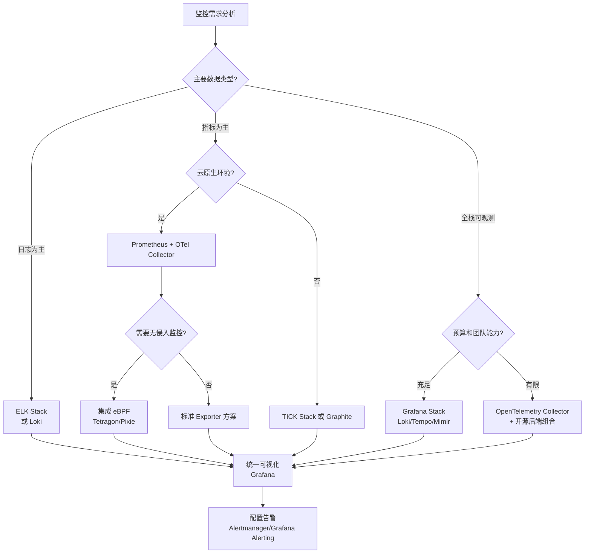

## 四、现代化监控系统架构实践

### 4.1 推荐架构：OpenTelemetry + Prometheus + Grafana

基于 2025-2026 年的技术生态，推荐采用以 OpenTelemetry 为统一采集层、Prometheus 为指标存储引擎、Grafana 为可视化平台的组合架构。这一架构的核心设计原则是"统一采集、专业存储、集中展示"：OpenTelemetry Collector 统一接收所有遥测数据并做初步处理，然后根据数据类型分发到专业的后端存储——指标数据发送到 Prometheus，Trace 数据发送到 Tempo，日志数据发送到 Loki。Grafana 作为统一入口，提供跨数据源的关联查询和可视化能力。

这一架构的优势在于：第一，应用只需接入 OTel SDK 一次，即可同时产生 Traces、Metrics、Logs 三类数据，避免了为不同监控系统分别埋点的重复工作；第二，后端组件可以根据数据特点进行专业化优化，例如 Prometheus 专门优化指标查询性能，Tempo 专门优化 Trace 存储成本；第三，Grafana 的统一入口使得运维人员可以在一个界面中关联查看指标、日志和 Trace，大幅提升故障排查效率。

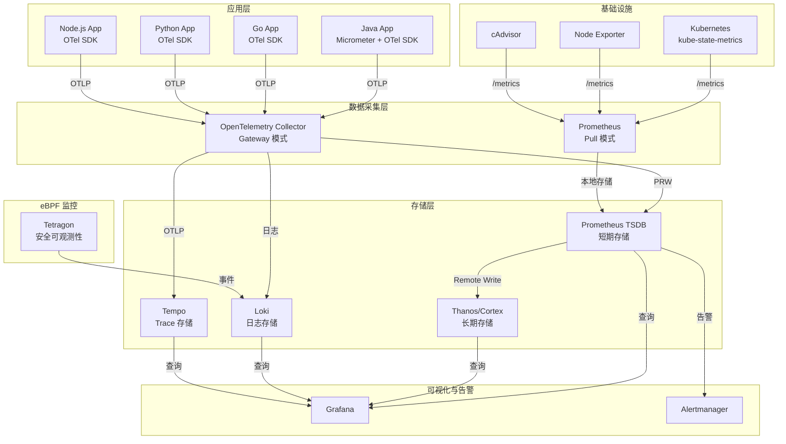

### 4.2 关键配置示例

**OpenTelemetry Collector Gateway 配置**：

```yaml
# otel-collector-gateway.yaml
receivers:
  otlp:
    protocols:
      grpc:
        endpoint: 0.0.0.0:4317
        max_recv_msg_size_mib: 16
      http:
        endpoint: 0.0.0.0:4318

processors:
  batch:
    timeout: 1s
    send_batch_size: 4096

  memory_limiter:
    limit_mib: 2048
    spike_limit_mib: 512

  tail_sampling:
    decision_wait: 10s
    policies:
      - name: errors
        type: status_code
        status_code:
          status_codes: [ERROR]
      - name: latency
        type: latency
        latency:
          threshold_ms: 500

  attributes:
    actions:
      - key: deployment.environment
        from_attribute: env
        action: insert

exporters:
  otlp/traces:
    endpoint: tempo:4317
    tls:
      insecure: true

  prometheusremotewrite:
    endpoint: http://prometheus:9090/api/v1/write
    default_resource_attributes:
      - service.name
      - service.instance.id

  otlphttp/logs:
    endpoint: http://loki:3100/otlp

service:
  pipelines:
    traces:
      receivers: [otlp]
      processors: [memory_limiter, tail_sampling, batch]
      exporters: [otlp/traces]

    metrics:
      receivers: [otlp]
      processors: [memory_limiter, attributes, batch]
      exporters: [prometheusremotewrite]

    logs:
      receivers: [otlp]
      processors: [memory_limiter, batch]
      exporters: [otlphttp/logs]
```

**Prometheus 3.x 配置**：

```yaml
# prometheus.yml
global:
  scrape_interval: 15s
  evaluation_interval: 15s
  scrape_native_histograms: true

  # Remote Write 2.0 配置
  remote_write:
    - url: http://thanos-receive:19291/api/v1/write
      send_native_histograms: true
      queue_config:
        max_samples_per_send: 10000

# OTLP 接收配置
otlp:
  promote_resource_attributes:
    - service.name
    - service.namespace
    - service.instance.id
  keep_original_resource_attributes: true

scrape_configs:
  - job_name: 'kubernetes-pods'
    kubernetes_sd_configs:
      - role: pod
    relabel_configs:
      - source_labels: [__meta_kubernetes_pod_annotation_prometheus_io_scrape]
        action: keep
        regex: true
      - source_labels: [__meta_kubernetes_pod_annotation_prometheus_io_path]
        action: replace
        target_label: __metrics_path__
        regex: (.+)

alerting:
  alertmanagers:
    - static_configs:
        - targets: ['alertmanager:9093']
```

## 五、技术演进时间线

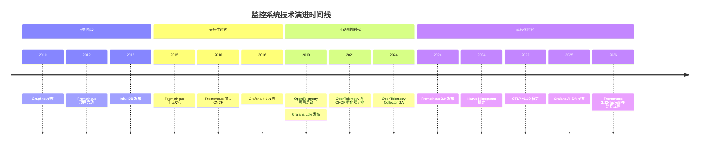

## 六、构建可靠监控系统的关键原则

在技术选型之外，构建一个真正可靠的监控系统还需要遵循若干关键原则。这些原则不依赖于具体的技术栈，而是适用于任何监控系统的建设。

### 6.1 监控分层原则

监控系统应该按照不同的关注层次进行设计，通常分为三个层次：

- **基础设施层**：监控 CPU、内存、磁盘、网络等基础资源指标，确保底层运行环境健康
- **应用层**：监控服务的可用性、延迟、吞吐量、错误率等黄金指标（Golden Signals），评估服务健康状态
- **业务层**：监控订单量、支付成功率、用户活跃度等业务指标，反映业务运行状态

每一层都应该有独立的告警规则和响应流程。基础设施层的告警通常由运维团队处理，应用层的告警由开发团队处理，业务层的告警由产品或运营团队关注。

### 6.2 告警设计原则

告警设计是监控系统中最容易被忽视、却对运维效率影响最大的环节。以下是几条核心原则：

1. **告警必须可操作**：每条告警都应该有明确的处理流程。如果收到告警后不知道该做什么，那么这条告警就是噪音，应该被删除或降级为记录。

2. **避免告警风暴**：通过合理的分组（group_by）、抑制（inhibit_rules）和静默（silences）策略，确保一个故障不会触发数十条重复告警。Alertmanager 的分组和抑制机制正是为此设计。

3. **区分严重级别**：将告警分为 Critical、Warning、Info 三个级别，Critical 级别的告警需要立即响应（如电话通知），Warning 级别的告警可以在工作时间处理（如邮件通知），Info 级别的告警仅做记录。

4. **设置合理的 For 持续时间**：避免瞬时抖动触发告警。对于关键指标，For 时间通常设置为 5-10 分钟；对于不太敏感的指标，可以设置更长的 For 时间。

### 6.3 数据保留策略

监控数据的保留策略需要在存储成本和查询需求之间取得平衡。推荐采用分层保留策略：

- **实时数据**（最近 7 天）：全精度保留，1 分钟采样间隔
- **短期数据**（7 天 - 30 天）：降采样至 5 分钟间隔
- **中期数据**（30 天 - 90 天）：降采样至 1 小时间隔
- **长期数据**（90 天以上）：降采样至 1 天间隔，仅保留聚合值

Prometheus 本身支持通过 `--storage.tsdb.retention.time` 配置保留时间，更复杂的降采样策略可以通过 Thanos 或 Mimir 的降采样功能实现。

## 七、小结

监控系统的演进反映了云原生技术的发展脉络。从早期的 ELK、Graphite、TICK 到 Prometheus，再到 OpenTelemetry 统一标准和 eBPF 无侵入监控，每一次技术迭代都带来了更高效的数据采集、更强大的处理能力和更智能的分析手段。

回顾整篇文章，我们可以看到监控系统经历了三个重要的发展阶段：第一阶段以 ELK、Graphite 为代表，解决了"有没有监控"的问题；第二阶段以 Prometheus 为代表，解决了"监控好不好用"的问题；第三阶段以 OpenTelemetry 和 eBPF 为代表，正在解决"监控是否统一和全面"的问题。

**2025-2026 年监控技术选型建议**：

1. **新项目首选 OpenTelemetry**：作为 CNCF 标准，OTel 提供了统一的可观测性数据采集方案，支持 Traces、Metrics、Logs 三大支柱，且与主流后端无缝集成。OTel 的语义约定（Semantic Conventions）确保了不同语言、不同框架产生的遥测数据具有一致的标签和命名，极大降低了跨服务关联分析的难度。

2. **Prometheus 仍是指标监控首选**：Prometheus 3.x 的 Native Histograms、OTLP 接收、Remote Write 2.0 等特性使其在云原生监控领域保持领先地位。Native Histograms 的稳定化是一个里程碑——它使得高精度分位数计算成为可能，同时存储成本比传统桶式直方图降低了一个数量级。

3. **Grafana 作为统一可视化平台**：Grafana 的多数据源支持、AI 辅助分析能力、统一告警管理，使其成为可观测性平台的最佳选择。Grafana 的 Explore 模式支持从指标到日志到 Trace 的无缝跳转，是故障排查的关键能力。

4. **eBPF 补充无侵入监控能力**：对于无法修改代码的遗留系统，或需要深度系统级可观测性的安全场景，eBPF 方案（Tetragon、Pixie）提供了独特价值。eBPF 监控不需要在应用中添加任何 SDK 或 Agent，对业务完全透明，是实现"零侵入可观测性"的最佳技术路径。

5. **AIOps 提升告警质量**：智能告警降噪、异常检测、根因分析等 AIOps 能力，能够显著降低告警疲劳，提升运维效率。AIOps 不是要取代运维人员，而是将运维人员从海量告警中解放出来，专注于真正需要人工判断的问题。

监控系统的建设是一个持续演进的过程，需要根据业务需求、团队能力、技术生态等因素综合考量，选择最适合的技术栈组合。没有"银弹"式的监控方案，只有最适合你当前场景的选择。

## 参考资料

- [OpenTelemetry Collector 官方文档](https://opentelemetry.io/docs/collector/)
- [Prometheus 3.0 发布公告](https://prometheus.io/blog/2024/11/14/prometheus-3-0/)
- [Prometheus CHANGELOG](https://github.com/prometheus/prometheus/blob/main/CHANGELOG.md)
- [Grafana 官方文档](https://grafana.com/docs/grafana/latest/)
- [Cilium Tetragon 文档](https://tetragon.io/docs/)
- [Micrometer 官方文档](https://micrometer.io/docs)
