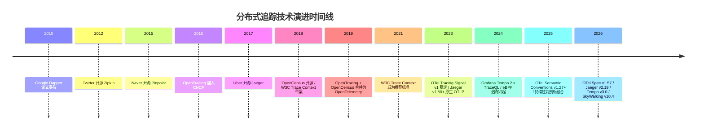
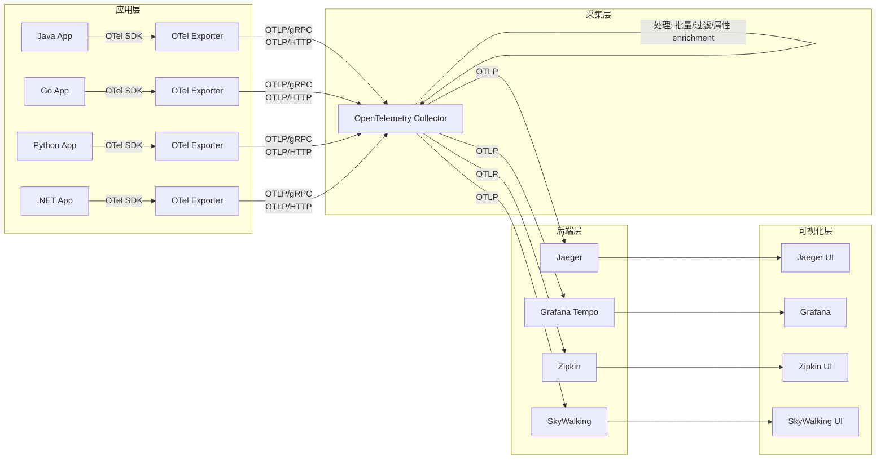
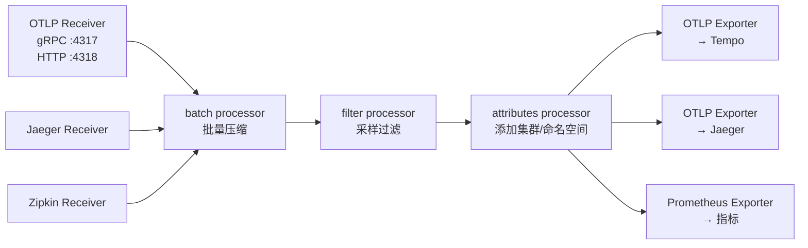
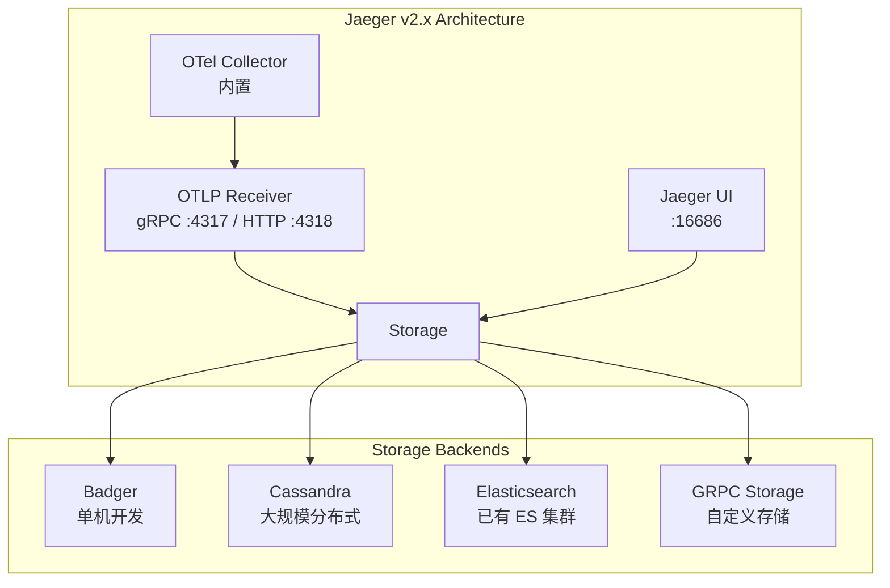
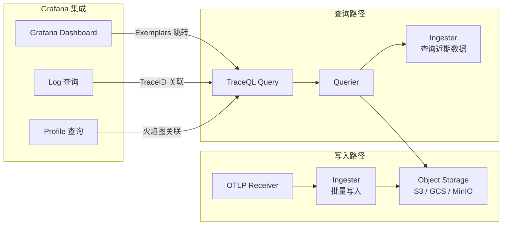
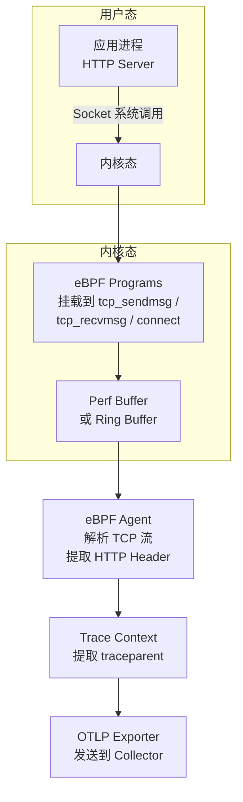
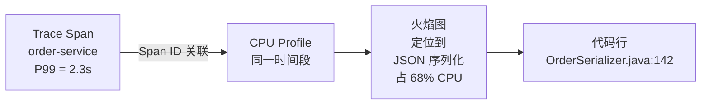
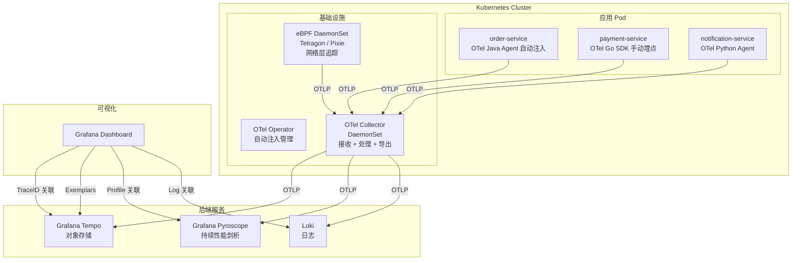
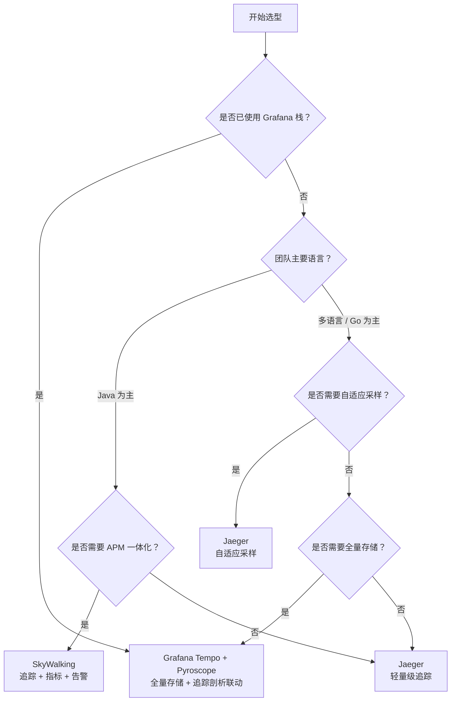
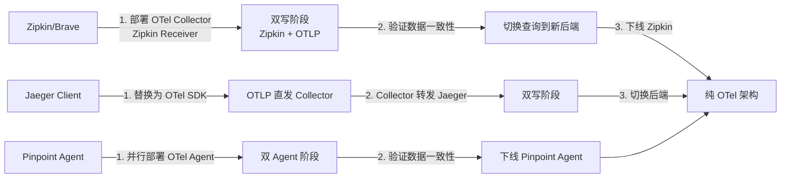

# 如何搭建一套适合你的服务追踪系统

> 前置知识：[[08]] 如何追踪微服务调用？—— 介绍了服务追踪的基本原理——Trace、Span、采样策略等核心概念。本文在此基础上，聚焦**如何从0到1落地一套生产级分布式追踪系统**，覆盖2025-2026年主流技术栈的架构、选型与实战。

## 概述

在 [[08]] 中，我们了解了服务追踪系统的三大核心环节：

1. **埋点数据收集**——在服务端拦截调用，采集上下文数据
2. **实时数据处理**——按 TraceId / SpanId 串联链路并持久化
3. **数据链路展示**——以调用链路图或拓扑图形式可视化

如果从零自研，三个环节都需要独立解决方案：框架层调用拦截、统一处理中心、链路存储与展示——技术难度和工程量都不小。好在，分布式追踪领域在2018-2026年间经历了深刻的技术演进，从百花齐放到标准统一，今天我们有了更成熟、更简单的落地路径。

**核心变化**可以概括为三点：

- **标准化**：W3C Trace Context 成为跨服务传播的事实标准，OpenTelemetry 统一了埋点 SDK 与数据格式
- **云原生化**：Kubernetes Operator 实现零代码自动注入，eBPF 实现内核级无侵入追踪
- **融合化**：追踪与指标、日志、持续性能剖析（Continuous Profiling）走向统一可观测性

本文将围绕这些变化，系统讲解现代服务追踪系统的搭建方法。

---

## 一、从 Dapper 论文到 OpenTelemetry：技术演进脉络

### 1.1 早期格局（2010-2018）

Google Dapper 论文奠定了分布式追踪的理论基础。此后业界涌现了多套实现：

| 系统 | 来源 | 语言支持 | 埋点方式 | 存储 |
|------|------|----------|----------|------|
| 鹰眼 | 阿里巴巴 | Java 为主 | 手动埋点 + Agent | 自研 HBase |
| OpenZipkin | Twitter | 多语言 | Library（Brave） | Cassandra / ES / MySQL |
| Pinpoint | Naver | 仅 Java | 字节码注入 | HBase |
| Jaeger | Uber | 多语言 | SDK + Agent | Cassandra / ES |
| SkyWalking | Apache | 多语言 | Agent + SDK | ES / H2 |

这些系统各自定义了数据格式和传播协议，**互不兼容**。一个同时运行 Java 和 Go 服务的团队，可能需要同时维护 Brave 和 Jaeger Client 两套 SDK，数据格式无法互通。

### 1.2 标准统一时代（2019-2026）

两个关键事件改变了格局：

- **2019 年**：OpenTracing 和 OpenCensus 项目合并，成立 **OpenTelemetry（OTel）**，目标是提供统一的可观测性 SDK 和数据规范
- **2021 年**：W3C Trace Context 正式成为推荐标准，定义了 `traceparent` / `tracestate` HTTP Header 格式，解决了跨服务传播的互操作问题

到 2025-2026 年，OpenTelemetry Tracing Signal 已进入 **v1.x 稳定阶段**（规范 v1.57.0，2026-05），所有主流后端（Jaeger、Tempo、Zipkin、SkyWalking）均已原生支持 OTLP（OpenTelemetry Protocol）数据接收。



---

## 二、OpenTelemetry：现代追踪系统的基石

OpenTelemetry 不再是"又一个追踪系统"，而是**可观测性的基础设施层**——它只负责数据采集与传输，不提供后端存储和展示。这种"采集与后端解耦"的架构，是现代追踪系统搭建的核心设计理念。

### 2.1 核心架构



上图展示了 OpenTelemetry 的核心数据流：**SDK → Collector → 后端 → UI**。关键组件包括：

| 组件 | 职责 | 当前版本 |
|------|------|----------|
| OTel SDK | 自动/手动埋点，生成 Span，传播 Trace Context | Java v1.63.0 / Go v1.44.0 |
| OTel Collector | 接收、处理、导出遥测数据（Receiver → Processor → Exporter） | v0.153.0 |
| OTel Operator | Kubernetes 自动注入 SDK Sidecar / DaemonSet | v0.152.0 |
| OTLP 协议 | 统一的遥测数据传输协议（gRPC / HTTP） | Spec v1.57.0 |

### 2.2 OpenTelemetry Collector：数据枢纽

Collector 是整个架构的"数据枢纽"，采用 **Receiver → Processor → Exporter** 管道模型：



一个典型的 Collector 配置（`config.yaml`）如下：

```yaml
# OpenTelemetry Collector config — v0.153.0
receivers:
  otlp:
    protocols:
      grpc:
        endpoint: 0.0.0.0:4317
      http:
        endpoint: 0.0.0.0:4318

processors:
  batch:
    send_batch_size: 1024
    timeout: 5s
  filter:
    error_mode: ignore
    traces:
      span:
        # 过滤健康检查等低价值 Span
        - 'attributes["http.route"] == "/healthz"'
        - 'attributes["http.route"] == "/readiness"'
  resource:
    attributes:
      - key: cluster.name
        value: prod-cn-east
        action: upsert
      - key: deployment.environment
        value: production
        action: upsert

exporters:
  otlp/tempo:
    endpoint: tempo:4317
    tls:
      insecure: true
  otlp/jaeger:
    endpoint: jaeger-collector:4317
    tls:
      insecure: true

service:
  pipelines:
    traces:
      receivers: [otlp]
      processors: [batch, filter, resource]
      exporters: [otlp/tempo]
```

Collector 的核心价值在于：

- **协议转换**：同时接收 OTLP、Jaeger、Zipkin 格式，统一输出 OTLP，实现存量系统平滑迁移
- **数据处理**：批量压缩降低网络开销，过滤低价值 Span 减少存储成本，属性注入实现多租户/多集群标识
- **容错缓冲**：内置队列机制，后端短暂不可用时数据不丢失

### 2.3 W3C Trace Context：跨服务传播标准

W3C Trace Context 规范定义了两个 HTTP Header：

```
traceparent: 00-4bf92f3577b34da6a3ce929d0e0e4736-00f067aa0ba902b7-01
             │  │─────────── TraceId ──────────────│ │──── SpanId ────│ │┐
             版本                                    │                 ││采样标志
                                                     ────────────────────┘
tracestate: vendor1=value1,vendor2=value2
```

- **`traceparent`**：包含版本号、TraceId（128 bit）、SpanId（64 bit）、采样标志，格式固定，所有系统必须识别
- **`tracestate`**：厂商自定义键值对，可携带 Jaeger Debug ID、OTel 采样决策等扩展信息

OpenTelemetry SDK 默认使用 W3C Trace Context 传播器，同时也兼容 B3（Zipkin）和 Jaeger Propagation 格式。在跨服务调用时，SDK 自动在 HTTP Header / gRPC Metadata / 消息队列 Header 中注入和提取 Trace Context，**业务代码无需感知**。

### 2.4 自动埋点：零代码侵入的追踪

OpenTelemetry 提供了多种自动埋点方式，大幅降低了集成成本：

| 语言 | 自动埋点方式 | 覆盖范围 |
|------|-------------|----------|
| Java | Java Agent（字节码注入） | HTTP、gRPC、JDBC、Redis、Kafka、Spring 等 40+ 库 |
| .NET | NuGet 包自动埋点 | ASP.NET Core、HttpClient、EF Core、SQL Client |
| Python | `opentelemetry-bootstrap` 自动安装 | Flask、Django、Requests、SQLAlchemy |
| Node.js | `@opentelemetry/auto-instrumentations` | Express、HTTP、MongoDB、Redis |
| Go | 官方暂无运行时自动埋点（社区提供编译期注入的实验方案），一般需手动创建 Span | — |

以 Java 为例，只需在 JVM 启动参数中添加 Agent：

```bash
# OpenTelemetry Java Agent v1.63.0
java -javaagent:opentelemetry-javaagent.jar \
     -Dotel.service.name=order-service \
     -Dotel.exporter.otlp.endpoint=http://otel-collector:4317 \
     -Dotel.exporter.otlp.protocol=grpc \
     -jar order-service.jar
```

无需修改任何业务代码，Agent 会自动拦截 HTTP 请求、数据库调用、消息队列操作，生成完整的调用链路。

### 2.5 Kubernetes 自动注入：云原生最佳实践

在 Kubernetes 环境中，OpenTelemetry Operator 可以自动将 SDK 注入到 Pod 中：

```yaml
# OpenTelemetry Operator v0.152.0 — Instrumentation CRD
apiVersion: opentelemetry.io/v1alpha1
kind: Instrumentation
metadata:
  name: otel-instrumentation
spec:
  exporter:
    endpoint: http://otel-collector:4317
  propagators:
    - tracecontext   # W3C Trace Context
    - b3             # 兼容 Zipkin B3
  sampler:
    type: parentbased_traceidratio
    argument: "0.1"  # 10% 采样率
  java:
    image: ghcr.io/open-telemetry/opentelemetry-operator/autoinstrumentation-java:1.63.0
  python:
    image: ghcr.io/open-telemetry/opentelemetry-operator/autoinstrumentation-python:0.50b0
  nodejs:
    image: ghcr.io/open-telemetry/opentelemetry-operator/autoinstrumentation-nodejs:0.55.0
```

只需在 Pod 或 Namespace 上添加注解：

```yaml
metadata:
  annotations:
    instrumentation.opentelemetry.io/inject-java: "true"
    # 或 inject-python / inject-nodejs / inject-dotnet / inject-go
```

Operator 会在 Pod 创建时自动注入对应语言的 SDK，**无需修改 Dockerfile 或部署 YAML**。

---

## 三、后端选型：四大主流方案对比

OpenTelemetry 解决了"怎么采"的问题，"存哪里、怎么查"则由后端决定。当前主流后端有四个：

### 3.1 Jaeger v2.19（2026-06）

Jaeger 是最早支持 OpenTelemetry 的后端之一。从 v1.35 起原生支持 OTLP 接收，v2.x 进一步将 OTel Collector 组件嵌入 Jaeger 自身。



**核心特性**：

- **自适应采样**：根据服务、端点、操作名动态调整采样率，无需全局统一配置
- **多存储后端**：Badger（单机开发）、Cassandra（大规模）、Elasticsearch（已有 ES 集群）、gRPC Storage（自定义）
- **部署模式**：All-in-One（开发）、Production（Collector + Query 分离）、Streaming（引入 Kafka 解耦）

### 3.2 Grafana Tempo v3.0（2026-05）

Tempo 是 Grafana Labs 推出的**对象存储优先**的追踪后端，核心设计理念是"用 S3/GCS 的成本存储全量 Trace"。



**核心特性**：

- **TraceQL**：专用的追踪查询语言，支持 Span 属性过滤、结构化查询
  ```traceql
  // TraceQL 示例：查找耗时超过 500ms 且调用 Redis 的链路
  {span.http.status_code = 500 && span.db.system = "redis"} | duration > 500ms
  ```
- **对象存储**：以 S3/GCS/MinIO 为主要存储，成本仅为 Elasticsearch 的 1/5-1/10
- **Grafana 生态融合**：Trace 与 Log 通过 TraceID 自动关联，Exemplars 从指标跳转到 Trace，Profile 通过 Stack ID 关联到 Span
- **无需采样**：存储成本极低，可以存储 100% 的 Trace 数据

### 3.3 Apache SkyWalking v10.4（2026-04）

SkyWalking 是 Apache 基金会下的 APM 平台，在追踪之外还提供指标、告警、拓扑分析等能力。

**核心特性**：

- **GenAI Observability**：v10.4 新增 LLM 调用链路追踪，支持 OpenAI、LangChain 等 AI 框架
- **多语言 Agent**：Java（字节码注入）、Python、Node.js、Go、PHP 等
- **告警体系**：内置规则引擎，支持 P99 延迟、错误率、吞吐量等多维度告警
- **兼容 Tempo**：v10.4 新增 Grafana Tempo 兼容模式，可作为 Tempo 的替代后端

### 3.4 OpenZipkin（维护模式）

Zipkin 仍在维护，但社区活跃度已大幅下降。它仍然是一个轻量级选择，适合已有 Zipkin 基础的团队。OpenTelemetry Collector 提供了 Zipkin Receiver，可以将 Zipkin 格式数据转换为 OTLP 输出到其他后端，实现平滑迁移。

### 3.5 四大后端对比

| 维度 | Jaeger v2.19 | Grafana Tempo v3.0 | SkyWalking v10.4 | Zipkin |
|------|-------------|-------------------|-----------------|--------|
| **存储模型** | Cassandra / ES / Badger | 对象存储（S3/GCS） | ES / H2 / BanyanDB | Cassandra / ES / MySQL |
| **存储成本** | 中-高 | **极低** | 中 | 中 |
| **查询能力** | UI + API | **TraceQL**（结构化查询） | UI + 告警 | UI + API |
| **采样策略** | 自适应采样 | 全量存储（无需采样） | 静态/动态采样 | 静态采样 |
| **生态集成** | 独立 | **Grafana 全栈** | 独立 APM | 独立 |
| **K8s 部署** | Helm / Operator | Helm / Grafana Agent | Helm / Operator | Helm |
| **适用场景** | 通用追踪 | 云原生 + Grafana 栈 | APM 一体化 | 轻量级/存量迁移 |
| **社区活跃度** | 高 | 高 | 高 | 低（维护模式） |

---

## 四、eBPF 无侵入追踪：内核级可观测性

传统追踪系统依赖 SDK 或 Agent 注入，存在三个痛点：

1. **语言限制**：Go、Rust、C++ 等编译型语言缺乏自动埋点
2. **升级成本**：SDK 升级需要重新构建和部署应用
3. **盲区**：无法追踪 SDK 未覆盖的底层调用（如系统调用、网络 I/O）

eBPF（Extended Berkeley Packet Filter）技术可以在**内核态**挂载 Hook，无需修改应用代码即可捕获网络请求、系统调用等信息，实现真正的零侵入追踪。

### 4.1 工作原理



eBPF 追踪的核心流程：

1. 在内核的 `tcp_sendmsg`、`tcp_recvmsg`、`connect` 等 Hook 点挂载 eBPF 程序
2. 捕获 TCP 连接的发送/接收数据，解析 HTTP Header 中的 `traceparent`
3. 对于没有 Trace Context 的请求，eBPF Agent 自动生成 TraceId/SpanId
4. 将 Span 数据通过 OTLP 发送到 OpenTelemetry Collector

### 4.2 主流 eBPF 追踪方案

| 方案 | 来源 | 追踪能力 | K8s 集成 | 特点 |
|------|------|----------|----------|------|
| **Pixie** | Pixie Labs（已被 New Relic 收购） | HTTP/gRPC/TCP/DNS | DaemonSet | 实时脚本（PxL），无需存储 |
| **Cilium Hubble** | Isovalent / Cilium | L3-L7 网络可观测 | DaemonSet | 与 Cilium CNI 深度集成 |
| **Tetragon** | Cilium / v1.7.0 | 系统调用追踪 + 网络追踪 | DaemonSet | 安全 + 可观测双场景 |
| **Odigos** | Keyval | 自动生成 OTel Span | DaemonSet + CRD | 专为 OTel 集成设计 |

### 4.3 eBPF 追踪的局限

- **仅支持 HTTP/1.1 和部分 gRPC**：HTTP/2 帧解析、TLS 加密流量需要额外处理
- **无法获取应用层语义**：只能看到网络请求，无法获取业务逻辑内部的 Span（如数据库查询详情）
- **内核版本要求**：需要 Linux Kernel 4.18+（部分功能需要 5.2+）
- **资源开销**：高流量场景下 eBPF 程序可能产生显著的 CPU 开销

**最佳实践**：eBPF 追踪不是 SDK 埋点的替代，而是**补充**。推荐组合使用——SDK 埋点覆盖应用层逻辑，eBPF 覆盖网络层和 SDK 盲区。

---

## 五、持续性能剖析：追踪的深度延伸

传统追踪系统回答"哪个请求慢"，但无法回答"为什么慢"。持续性能剖析（Continuous Profiling）通过持续采集 CPU、内存、锁竞争等性能数据，将**宏观的慢请求**定位到**微观的代码行**。

### 5.1 追踪与剖析的关联



关联方式有两种：

- **时间关联**：Profile 的时间范围与 Span 的开始/结束时间对齐
- **属性关联**：在 Profile Label 中注入 `trace_id` / `span_id`，实现精确关联（Grafana Pyroscope v2.0+ 支持）

### 5.2 主流持续性能剖析工具

| 工具 | 来源 | 版本 | 语言支持 | 追踪关联 |
|------|------|------|----------|----------|
| **Grafana Pyroscope** | Grafana Labs | v2.0.3 | Go、Java、Python、.NET、Node.js、Rust | OTel Span ID 关联 |
| **Parca** | Parca Dev | v0.28.0 | 任何支持 DWARF 调试信息的语言 | 时间关联 |
| **Google Cloud Profiler** | Google | — | Go、Java、Python、Node.js | 无 |
| **AWS CodeGuru Profiler** | AWS | — | Java、Python | 无 |

Pyroscope v2.0 已深度集成 Grafana 生态，支持在 Trace 详情页直接跳转到对应时间段的火焰图，实现"从慢请求到慢代码"的一键定位。

### 5.3 OpenTelemetry Profiling Signal（实验性）

OpenTelemetry 社区正在推进 Profiling Signal 标准化（目前处于 Alpha 阶段），目标是让 Profile 数据也通过 OTLP 协议传输，实现 Trace / Metric / Log / Profile 四大信号的统一采集与关联。

---

## 六、端到端架构：生产级追踪系统搭建

综合以上技术，一个 2025-2026 年的生产级追踪系统端到端架构如下：



### 6.1 关键设计决策

**1. 采样策略**

| 策略 | 适用场景 | 配置方式 |
|------|----------|----------|
| 全量采集 | 低流量服务 / Tempo 后端 | `sampler.type=always_on` |
| 概率采样 | 通用场景 | `parentbased_traceidratio`, argument=0.1 |
| 自适应采样 | 高流量 + 需要代表性 | Jaeger Adaptive Sampling |
| 优先采样 | 错误/慢请求优先 | OTel Tail-Based Sampling（Collector Processor） |

Tail-Based Sampling 是在 Collector 中实现的延迟采样策略——先缓存一个 Trace 的所有 Span，等整个 Trace 完成后再根据错误率、延迟等条件决定是否保留。这比 Head-Based Sampling 更精准，但需要 Collector 有足够的内存缓存。

```yaml
# OTel Collector — Tail-Based Sampling Processor
processors:
  tail_sampling:
    decision_wait: 10s
    num_traces: 100000
    expected_new_traces_per_sec: 100
    policies:
      - name: errors
        type: status_code
        status_code:
          status_codes:
            - ERROR
      - name: slow-traces
        type: latency
        latency:
          threshold_ms: 1000
      - name: sample-10pct
        type: probabilistic
        probabilistic:
          sampling_percentage: 10
```

**2. 数据量估算与存储规划**

以一个中等规模微服务系统为例（50 个服务，日均 1 亿次请求）：

| 采样率 | 日均 Span 数 | 日均数据量（压缩后） | 月存储成本（S3） |
|--------|-------------|---------------------|-----------------|
| 100% | ~5 亿 | ~50 GB | ~$1,150 |
| 10% | ~5 千万 | ~5 GB | ~$115 |
| 1% | ~5 百万 | ~0.5 GB | ~$12 |

使用 Tempo + S3 的全量存储方案，月成本约 $1,150，远低于 Elasticsearch 方案的 $5,000-10,000。

**3. 容错与高可用**

- Collector 部署为 DaemonSet（每个节点一个），避免单点故障
- Collector 内置队列，后端不可用时数据暂存本地磁盘
- Tempo Ingester 采用多副本写入，保证数据不丢失
- 跨集群场景使用 OTel Collector 级联转发

---

## 七、架构决策指南

根据团队规模、技术栈和需求，推荐以下选型路径：

### 7.1 决策树



### 7.2 场景推荐

| 场景 | 推荐方案 | 理由 |
|------|----------|------|
| 初创团队，快速上线 | OTel SDK + Jaeger All-in-One | 最小化运维，Docker 一键启动 |
| 中型团队，Grafana 用户 | OTel Operator + Tempo + Pyroscope | 全量存储，追踪/日志/剖析联动 |
| 大型团队，Java 为主 | SkyWalking + OTel SDK | APM 一体化，告警体系完善 |
| 多语言 + 高流量 | OTel Collector + Jaeger + 自适应采样 | 精准采样，存储可控 |
| 安全合规要求高 | OTel Collector + Tetragon | eBPF 内核级追踪，审计友好 |
| 存量 Zipkin 迁移 | OTel Collector（Zipkin Receiver）+ Tempo | 协议转换，平滑迁移 |

### 7.3 迁移路径

对于正在使用旧版追踪系统的团队，推荐以下迁移路径：



---

## 八、实战：从零搭建追踪系统（Grafana 栈）

以下是一个基于 Kubernetes 的完整部署示例，使用 OTel + Tempo + Pyroscope + Grafana 栈。

### 8.1 部署 OpenTelemetry Collector

```yaml
# otel-collector-daemonset.yaml
apiVersion: apps/v1
kind: DaemonSet
metadata:
  name: otel-collector
spec:
  selector:
    matchLabels:
      app: otel-collector
  template:
    metadata:
      labels:
        app: otel-collector
    spec:
      containers:
        - name: otel-collector
          image: otel/opentelemetry-collector-contrib:0.153.0
          ports:
            - containerPort: 4317  # OTLP gRPC
            - containerPort: 4318  # OTLP HTTP
          volumeMounts:
            - name: config
              mountPath: /etc/otelcol-contrib/config.yaml
              subPath: config.yaml
      volumes:
        - name: config
          configMap:
            name: otel-collector-config
---
apiVersion: v1
kind: ConfigMap
metadata:
  name: otel-collector-config
data:
  config.yaml: |
    receivers:
      otlp:
        protocols:
          grpc:
            endpoint: 0.0.0.0:4317
          http:
            endpoint: 0.0.0.0:4318

    processors:
      batch:
        send_batch_size: 2048
        timeout: 5s
      tail_sampling:
        decision_wait: 10s
        num_traces: 100000
        policies:
          - name: errors
            type: status_code
            status_code:
              status_codes: [ERROR]
          - name: slow
            type: latency
            latency:
              threshold_ms: 500
          - name: keep-10pct
            type: probabilistic
            probabilistic:
              sampling_percentage: 10

    exporters:
      otlphttp/tempo:
        endpoint: http://tempo:4318
      otlphttp/pyroscope:
        endpoint: http://pyroscope:4318

    service:
      pipelines:
        traces:
          receivers: [otlp]
          processors: [batch, tail_sampling]
          exporters: [otlphttp/tempo]
        profiles:
          receivers: [otlp]
          processors: [batch]
          exporters: [otlphttp/pyroscope]
```

### 8.2 部署 Grafana Tempo

```yaml
# tempo.yaml — Tempo v3.0
apiVersion: apps/v1
kind: Deployment
metadata:
  name: tempo
spec:
  replicas: 3
  selector:
    matchLabels:
      app: tempo
  template:
    spec:
      containers:
        - name: tempo
          image: grafana/tempo:3.0.0
          args: ["-config.file=/etc/tempo/tempo.yaml"]
          volumeMounts:
            - name: config
              mountPath: /etc/tempo
      volumes:
        - name: config
          configMap:
            name: tempo-config
---
apiVersion: v1
kind: ConfigMap
metadata:
  name: tempo-config
data:
  tempo.yaml: |
    server:
      http_listen_port: 3200

    distributor:
      receivers:
        otlp:
          protocols:
            grpc:
              endpoint: 0.0.0.0:4317
            http:
              endpoint: 0.0.0.0:4318

    ingester:
      max_block_duration: 30m

    storage:
      trace:
        backend: s3
        s3:
          bucket: tempo-traces
          endpoint: s3.amazonaws.com
          region: cn-east-1
        block:
          bloom_filter_false_positive: .05
          index_downsample_bytes: 1000
          encoding: zstd

    querier:
      max_search_duration: 0    # 禁用搜索超时

    metrics_generator:
      registry:
        external_labels:
          source: tempo
          cluster: prod-cn-east
      storage:
        path: /var/tempo/wal
        remote_write:
          - url: http://mimir:9009/api/v1/push
```

### 8.3 Grafana 数据源配置

```yaml
# Grafana datasources — 追踪 + 日志 + 剖析联动
apiVersion: v1
kind: ConfigMap
metadata:
  name: grafana-datasources
data:
  datasources.yaml: |
    apiVersion: 1
    datasources:
      - name: Tempo
        type: tempo
        url: http://tempo:3200
        uid: tempo
        jsonData:
          tracesToMetrics:
            datasourceUid: prometheus
          tracesToLogsV2:
            datasourceUid: loki
            spanStartTimeShift: '-1h'
            spanEndTimeShift: '1h'
            filterByTraceID: true
            filterBySpanID: true
          serviceMap:
            datasourceUid: prometheus
      - name: Loki
        type: loki
        url: http://loki:3100
        uid: loki
        jsonData:
          derivedFields:
            - datasourceUid: tempo
              matcherRegex: '"trace_id":"(\w+)"'
              name: TraceID
              url: '$${__value.raw}'
      - name: Pyroscope
        type: grafana-pyroscope-datasource
        url: http://pyroscope:4040
        uid: pyroscope
```

---

## 小结

从 2018 年的 Zipkin vs Pinpoint 之争，到 2026 年的 OpenTelemetry 统一标准，分布式追踪领域发生了根本性变化。搭建现代服务追踪系统的核心思路可以总结为：

1. **标准化采集**：使用 OpenTelemetry SDK + Collector，一次接入，后端可切换
2. **协议统一**：W3C Trace Context 实现跨服务、跨语言、跨系统的 Trace 传播
3. **后端选型**：Grafana Tempo 适合云原生 + 全量存储，Jaeger 适合通用场景 + 自适应采样，SkyWalking 适合 APM 一体化
4. **零侵入增强**：Kubernetes Operator 自动注入 SDK，eBPF 补充网络层追踪盲区
5. **深度可观测**：持续性能剖析将慢请求定位到代码行，Trace/Log/Metric/Profile 四信号联动

**一句话总结**：2026 年搭建追踪系统，不再是在 Zipkin 和 Pinpoint 之间二选一，而是以 OpenTelemetry 为采集标准，根据存储成本和生态需求选择后端，用 eBPF 和持续性能剖析补全可观测性的最后一块拼图。

## 思考题

1. OpenTelemetry Collector 中的 Tail-Based Sampling 需要在内存中缓存完整的 Trace 数据，如果流量突增导致内存不足，你会如何设计降级策略？
2. eBPF 追踪可以捕获网络层的请求，但无法获取应用层的业务语义。在你的业务场景中，哪些信息是 eBPF 无法覆盖但 SDK 埋点可以提供的？你会如何组合使用这两种方案？


