# 如何识别服务节点是否存活

> 前置知识：[[09]] 微服务治理的手段有哪些
> 版本基线：Kubernetes 1.30+ | Istio 1.22+ | Cilium 1.16+

## 概述

服务节点存活识别是微服务治理的基石——一个被误判为"存活"的故障节点会污染整条调用链，而一个被误判为"死亡"的健康节点则可能触发雪崩。2018 年这些内容初版时，业界主要依赖注册中心心跳机制与客户端摘除策略来解决这一问题；到 2025-2026 年，云原生生态已构建起从基础设施层（Kubernetes 三类 Probe）到服务网格层（Istio OutlierDetection）再到内核层（Cilium eBPF 深度健康检查）的多层防护体系。本文将从传统方案的局限出发，逐层剖析现代存活识别机制的设计哲学与工程实践。

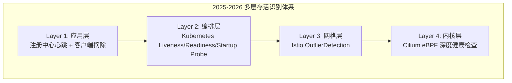

---

## 一、从注册中心心跳机制说起

### 1.1 动态注册中心的工作原理

在经典微服务架构中（以 ZooKeeper、Nacos、Eureka 为代表），服务提供者启动时向注册中心注册自身信息，并以固定间隔（通常 5-30s）发送心跳。注册中心若在超时窗口内未收到心跳，便将节点从可用列表中摘除，并通知所有订阅该服务的消费者拉取最新列表。

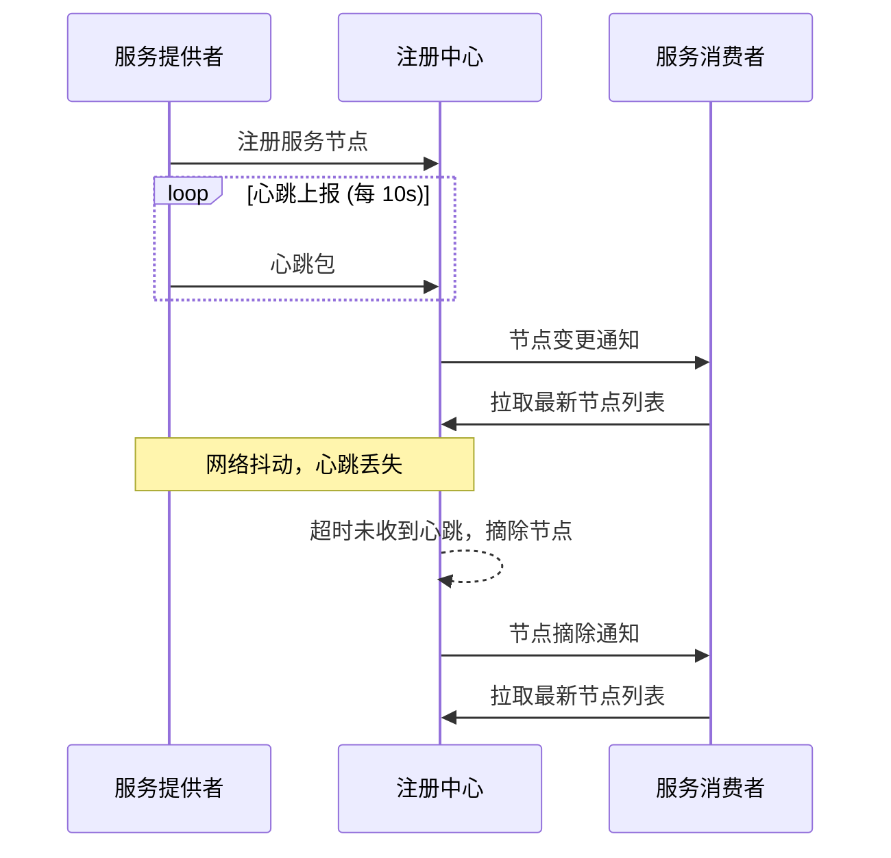

这套机制在稳定的网络环境下表现良好，但面对网络频繁抖动时，会暴露两个致命问题。

### 1.2 问题一：注册中心带宽被打满

当网络抖动导致大量服务提供者心跳失败时，注册中心会频繁变更可用节点列表。每个变更都会触发全量通知，成百上千个服务消费者同时请求注册中心拉取最新数据，可能瞬间打满注册中心带宽（尤其是百兆网卡环境）。

### 1.3 问题二：可用节点大量摘除引发雪崩

更严重的场景是：大批服务提供者仅因网络原因无法上报心跳，就被注册中心从可用列表中"无情"摘除。剩余节点无法承受全部流量，引发级联故障——即"雪崩"。实际上这些节点仍然健康，只是心跳通道暂时中断。

### 1.4 传统防护机制

针对上述两个问题，实践中发展出两种防护机制：

**心跳开关保护机制**：在注册中心设置开关，当网络频繁抖动时打开，仅向部分消费者（如 10%）推送变更通知，将注册中心请求量压缩至原来的 1/10。代价是节点变更感知延迟从秒级退化为分钟级，因此仅作为紧急降级手段。

**服务节点摘除保护机制**：设定摘除阈值比例（通常 20%），注册中心在任何情况下都不会摘除超过该比例的节点。业务明确批量下线时可关闭保护；正常运行时必须开启。

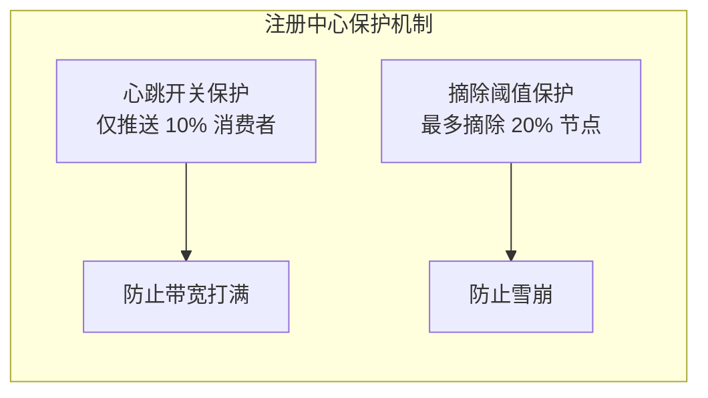

---

## 二、静态注册中心：客户端侧存活判定

### 2.1 核心思想

传统方案的根本问题在于：注册中心作为中间人，它的心跳判定并不能准确反映服务提供者的真实可用性。**服务消费者调用服务提供者是否成功，消费者自己最清楚**——这是静态注册中心的设计出发点。

具体实现：

1. 服务消费者根据实际调用结果判定节点可用性。若连续调用某节点失败超过阈值（如 3 次），在本地内存中将其标记为不可用。
2. 每隔固定时间（如 30s），消费者向被标记为不可用的节点发起保活探测（probe），探测成功则恢复可用状态。
3. 服务提供者无需向注册中心汇报心跳，注册中心中的节点信息不再动态变化，故称"静态注册中心"。

### 2.2 静态 vs 动态注册中心对比

| 维度 | 动态注册中心 | 静态注册中心 |
|------|-------------|-------------|
| 心跳方向 | Provider → Registry | Consumer → Provider（调用+探测） |
| 判定准确性 | 间接：仅反映心跳通道连通性 | 直接：反映业务调用是否成功 |
| 网络抖动敏感度 | 高：心跳丢失即摘除 | 低：调用失败才摘除 |
| 节点变更感知速度 | 快：秒级通知 | 中：依赖探测周期 |
| 注册中心压力 | 高：全量推送+拉取 | 低：近乎零推送 |
| 适用场景 | 节点变化频繁、对感知速度要求高 | 网络环境复杂、对稳定性要求高 |

### 2.3 实践建议

静态注册中心的节点信息并非永远不变。在业务上线、运维扩缩容等预知场景下，仍需主动更新注册中心中的节点信息。此时静态注册中心退化为配置中心——存储的不再是动态心跳状态，而是服务端点的静态拓扑。

> **关键洞察**：动态注册中心与静态注册中心并非互斥关系。现代微服务框架（如 Spring Cloud、Dubbo 3.x）通常将两者结合：注册中心负责拓扑发现，客户端侧负责可用性判定。这为后续 Kubernetes 与 Istio 的多层健康检查体系埋下了伏笔。

---

## 三、Kubernetes 三类 Probe：编排层存活识别

进入云原生时代，Kubernetes 成为事实标准的工作负载编排平台。Kubelet 通过三类 Probe 对容器健康状态进行精细化管理，这是存活识别从应用层下沉到基础设施层的关键一步。

### 3.1 三类 Probe 的职责划分

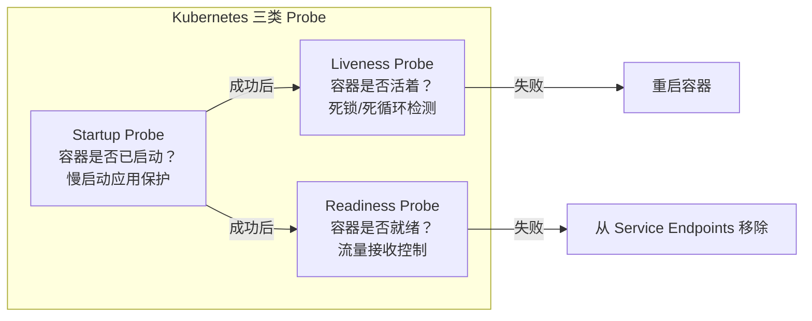

| Probe 类型 | 检测问题 | 失败后果 | 典型场景 |
|-----------|---------|---------|---------|
| **Startup Probe** | 应用是否完成初始化 | 杀死容器并重启 | JVM 预热、大型缓存加载 |
| **Liveness Probe** | 应用是否陷入死锁/死循环 | 杀死容器并重启 | 死锁检测、goroutine 泄漏 |
| **Readiness Probe** | 应用是否准备好接收流量 | 从 Service Endpoints 移除 | 依赖外部服务就绪、连接池预热 |

### 3.2 Probe 配置详解

Kubernetes 1.30+ 支持四种探测方式：

```yaml
# Kubernetes 1.30+ Probe 配置示例
apiVersion: v1
kind: Pod
metadata:
  name: order-service
spec:
  containers:
  - name: order
    image: order-service:2.1.0
    ports:
    - name: http-port
      containerPort: 8080

    # Startup Probe: 给应用 5 分钟启动时间
    startupProbe:
      httpGet:
        path: /health/startup
        port: http-port
      failureThreshold: 30   # 允许失败 30 次
      periodSeconds: 10      # 每 10s 探测一次
      # 最长启动等待 = 30 × 10 = 300s

    # Liveness Probe: 检测死锁
    livenessProbe:
      httpGet:
        path: /health/liveness
        port: http-port
      failureThreshold: 3    # 连续失败 3 次重启
      periodSeconds: 10      # 每 10s 探测一次
      successThreshold: 1    # 成功 1 次即恢复
      timeoutSeconds: 5      # 单次超时 5s

    # Readiness Probe: 流量控制
    readinessProbe:
      httpGet:
        path: /health/readiness
        port: http-port
      failureThreshold: 3    # 连续失败 3 次摘流
      periodSeconds: 5       # 每 5s 探测一次
      successThreshold: 2    # 连续成功 2 次才恢复流量
      timeoutSeconds: 3      # 单次超时 3s
```

四种探测方式对比：

| 探测方式 | 原理 | 适用场景 | 版本要求 |
|---------|------|---------|---------|
| `httpGet` | HTTP GET 请求，2xx-3xx 为健康 | REST/gRPC Gateway 服务 | 所有版本 |
| `tcpSocket` | TCP 连接建立成功即健康 | 非 HTTP 协议（Redis、MySQL） | 所有版本 |
| `exec` | 容器内执行命令，退出码 0 为健康 | 文件/脚本检测 | 所有版本 |
| `grpc` | 标准 gRPC Health Checking Protocol | gRPC 原生服务 | v1.27+ (Stable) |

### 3.3 Startup Probe 的关键价值

Startup Probe 是 Kubernetes 1.16 引入（Alpha）、1.18 进入 Beta、1.20 转正（GA）的特性，它解决了一个经典痛点：**慢启动应用的 Liveness Probe 误杀问题**。

在 Startup Probe 出现之前，为了兼顾慢启动应用，必须将 Liveness Probe 的 `initialDelaySeconds` 设得很大，但这又导致真正的死锁检测延迟过大。Startup Probe 将"是否启动完成"和"是否活着"解耦为两个独立问题：

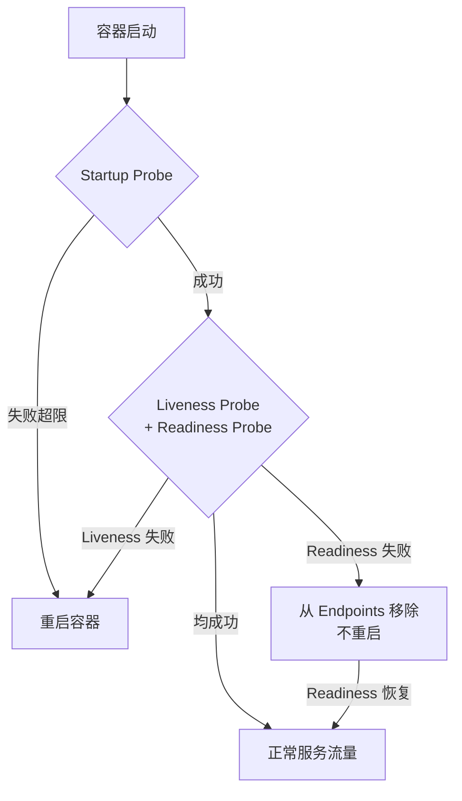

### 3.4 常见陷阱与最佳实践

| 陷阱 | 后果 | 最佳实践 |
|------|------|---------|
| Liveness Probe 与 Readiness Probe 使用相同端点 | 临时不可用触发重启 | 分离端点：liveness 检死锁，readiness 检就绪 |
| Liveness Probe 检查外部依赖 | 外部依赖抖动导致容器反复重启 | Liveness 只检测进程本身，外部依赖由 Readiness 承担 |
| `failureThreshold` 设为 1 | 单次网络超时即重启 | Liveness 至少设为 3，容忍偶发抖动 |
| Readiness `successThreshold` 设为 1 | 恢复后立即涌入流量导致二次失败 | 设为 2-3，确保真正恢复后再接收流量 |
| Startup Probe 缺失 | 慢启动应用被 Liveness 误杀 | 启动时间 > 30s 的应用必须配置 Startup Probe |

---

## 四、Istio OutlierDetection：网格层异常检测

Kubernetes Probe 解决的是单节点维度的健康判定。但在分布式系统中，一个节点进程活着（Probe 通过）并不等于它对上游调用者"健康"——可能因为连接池耗尽、GC 停顿、下游依赖慢等原因导致响应质量严重劣化。Istio 的 OutlierDetection 从服务网格层提供了基于实际调用质量的动态异常检测。

### 4.1 工作原理

OutlierDetection 基于 Envoy 的被动健康检查机制，通过监控实际请求结果来动态驱逐异常端点：

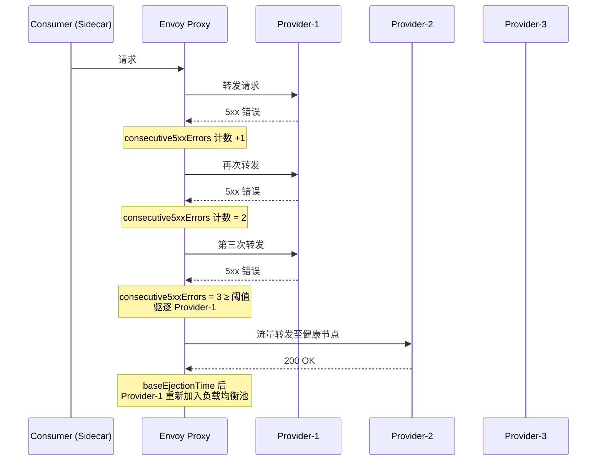

### 4.2 DestinationRule 配置

```yaml
# Istio 1.22+ OutlierDetection 配置
apiVersion: networking.istio.io/v1
kind: DestinationRule
metadata:
  name: order-service-dr
spec:
  host: order-service.prod.svc.cluster.local
  trafficPolicy:
    outlierDetection:
      # 连续 5xx 错误次数阈值
      consecutive5xxErrors: 3
      # 连续网关错误（502/503/504）次数阈值
      consecutiveGatewayErrors: 2
      # 扫描间隔：每 10s 分析一次
      interval: 10s
      # 基础驱逐时间：首次 30s，按驱逐次数递增
      baseEjectionTime: 30s
      # 最大驱逐比例：最多驱逐 50% 节点
      maxEjectionPercent: 50
      # 最低健康比例：低于此值时禁用驱逐保护
      minHealthPercent: 25
      # 区分本地错误与上游错误
      splitExternalLocalOriginErrors: true
      consecutiveLocalOriginFailures: 5
```

### 4.3 关键参数深度解读

| 参数 | 默认值 | 含义 | 调优建议 |
|------|--------|------|---------|
| `consecutive5xxErrors` | 5 | 连续 5xx 次数达阈值后驱逐 | 设为 3 可更快感知异常；设为 0 则禁用 5xx 驱逐 |
| `consecutiveGatewayErrors` | 0（禁用） | 连续 502/503/504 达阈值后驱逐 | 建议启用并设为 2，快速剔除网关层故障节点 |
| `interval` | 10s | 驱逐分析周期 | 10s 是经验值，过短增加 CPU 开销，过长延迟感知 |
| `baseEjectionTime` | 30s | 基础驱逐时长，实际 = base × 驱逐次数 | 30s 起步合理，反复被驱逐的节点自动延长惩罚 |
| `maxEjectionPercent` | 10% | 单次最多驱逐节点比例 | **务必调高**：10% 在小规模集群几乎无效，建议 50% |
| `minHealthPercent` | 0% | 健康节点比例低于此值时禁用驱逐 | 0% 意味着即使全部节点都不健康也不保护，建议设 25% |
| `splitExternalLocalOriginErrors` | false | 是否区分本地错误与上游返回的错误 | 建议启用：上游主动返回 5xx 不应触发下游驱逐 |

### 4.4 OutlierDetection 与 Kubernetes Probe 的协同

两者并不冲突，而是互补关系：

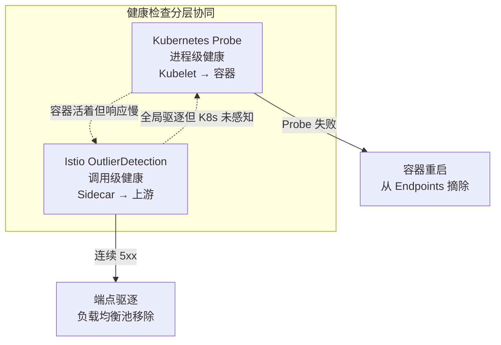

| 场景 | Kubernetes Probe | Istio OutlierDetection |
|------|-----------------|----------------------|
| 进程崩溃/OOM | 检测到 → 重启 | 也会感知 5xx 增多 → 驱逐 |
| 进程活着但死锁 | Liveness 失败 → 重启 | 无法区分 → 超时后驱逐 |
| 进程活着但 GC 停顿 | 短暂超时可能不触发 | 响应变慢 → 驱逐 |
| 依赖服务故障导致 5xx | 可能不触发（进程本身健康） | 直接驱逐 |
| 网络分区 | Node NotReady → Pod 驱逐 | 请求失败 → 驱逐 |

---

## 五、Cilium eBPF 深度健康检查：内核层突破

Kubernetes Probe 和 Istio OutlierDetection 本质上仍工作在用户态——它们依赖应用进程响应 HTTP/TCP 请求。但某些故障场景（如内核网络栈异常、eBPF 程序挂死、CNI 配置漂移）下，用户态探针无法触及根本原因。Cilium 1.16+ 引入的 eBPF 深度健康检查将探测能力下沉到内核层。

### 5.1 Cilium 健康检查架构

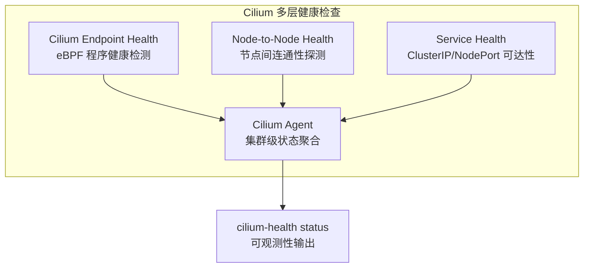

Cilium 的健康检查通过 `cilium-health` 子命令暴露：

```bash
# Cilium 1.16+ 集群健康状态
cilium-health status

# 输出示例：
# Node            Status   Endpoints
# node-01         alive    42/42 healthy
# node-02         alive    38/40 healthy  ← 2 个 Endpoint 异常
# node-03         timeout  —             ← 节点级连通性故障
```

### 5.2 eBPF 深度探测的独特价值

传统健康检查只能回答"进程是否在监听端口"，而 eBPF 深度探测能回答"数据包是否真正到达并被正确处理"：

| 检查层级 | 传统 Probe | Cilium eBPF |
|---------|-----------|-------------|
| 进程存活 | Liveness Probe | 同 |
| TCP 监听 | Readiness Probe | 同 |
| 网络策略是否生效 | 无法检测 | eBPF 程序状态检查 |
| 路由规则是否正确 | 无法检测 | BPF Map 一致性校验 |
| 节点间连通性 | 依赖应用层 | ICMP/TCP 内核态探测 |
| XDP/TC 程序挂载状态 | 无法检测 | 直接检查 BPF 程序挂载点 |

### 5.3 实践：Cilium 接管 Kubernetes NodePort / ClusterIP 健康检查

在 Cilium 以 kube-proxy 替代模式运行时（`kubeProxyReplacement: true`），Cilium 直接在 eBPF 中实现 Service 的负载均衡和健康检查：

```yaml
# Cilium 1.16+ Helm values
kubeProxyReplacement: true
# 节点间连通性健康检查（由 cilium-health 执行 ICMP/HTTP 探测）
healthChecking: true
# Endpoint 级健康检查
endpointHealthChecking: true
```

---

## 六、Dubbo 3.3 健康检查 SPI：框架层扩展

对于仍在使用传统 RPC 框架的场景，Dubbo 3.3 提供了完善的健康检查 SPI 扩展机制，允许开发者自定义存活判定逻辑。

### 6.1 Dubbo 健康检查架构

Dubbo 3.x 的健康检查基于 SPI（Service Provider Interface）机制，内置多种健康检查器并支持自定义扩展：

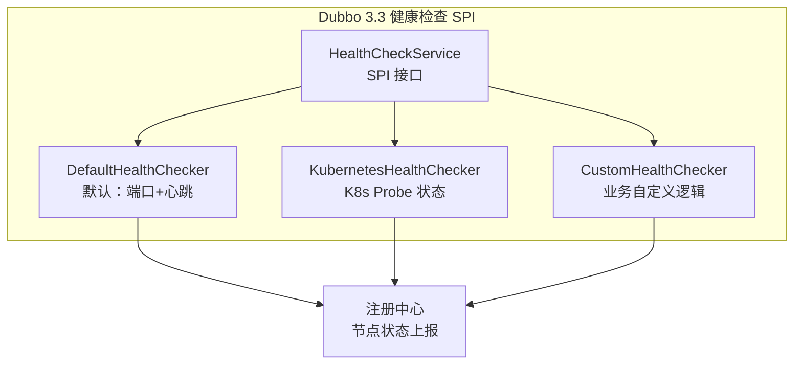

### 6.2 自定义健康检查器示例

```java
// Dubbo 3.3 自定义健康检查 SPI
@AutoService(HealthCheckService.class)
public class DatabaseHealthChecker implements HealthCheckService {

    private final DataSource dataSource;

    @Override
    public HealthCheckResult check() {
        try (Connection conn = dataSource.getConnection()) {
            // 执行简单查询验证数据库连通性
            boolean valid = conn.isValid(3);
            return HealthCheckResult.builder()
                .healthy(valid)
                .message(valid ? "DB connection OK" : "DB connection failed")
                .timestamp(Instant.now())
                .build();
        } catch (SQLException e) {
            return HealthCheckResult.builder()
                .healthy(false)
                .message("DB health check failed: " + e.getMessage())
                .timestamp(Instant.now())
                .build();
        }
    }
}
```

### 6.3 Dubbo 与 Kubernetes Probe 的集成

Dubbo 3.3 支持将内部健康检查结果暴露为 Kubernetes Probe 端点：

```yaml
# Dubbo 3.3 + Kubernetes 集成配置
dubbo:
  health:
    enabled: true
    # 将 Dubbo 健康检查暴露为 K8s Readiness 端点
    readiness-path: /health/readiness
    # 将 Dubbo 健康检查暴露为 K8s Liveness 端点
    liveness-path: /health/liveness
    # 检查项：端口可用性 + 注册中心连接 + 依赖服务
    check-items: port,registry,dependencies
```

---

## 七、服务可用性度量：SLI/SLO 视角

存活识别的最终目标是保障服务可用性。现代 SRE 实践要求用 SLI（Service Level Indicator）和 SLO（Service Level Objective）来量化健康检查策略的有效性。

### 7.1 健康检查相关的 SLI

| SLI | 定义 | 计算公式 |
|-----|------|---------|
| 可用性 (Availability) | 成功请求占比 | 成功请求数 / 总请求数 |
| 误判率 (False Positive Rate) | 被错误摘除的健康节点比例 | 错误摘除数 / 总摘除数 |
| 漏判率 (False Negative Rate) | 未被摘除的故障节点比例 | 未摘除故障数 / 总故障数 |
| 感知延迟 (Detection Latency) | 从故障发生到被检测出的时间 | 检测时间 - 故障发生时间 |
| 恢复延迟 (Recovery Latency) | 从故障恢复到重新接收流量的时间 | 恢复流量时间 - 节点恢复时间 |

### 7.2 SLO 目标与策略映射

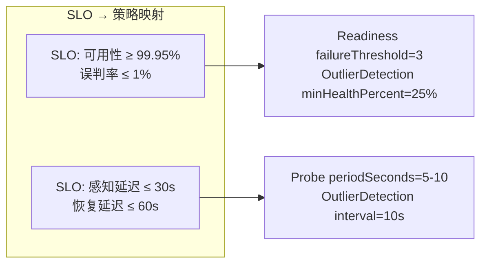

---

## 八、技术演进时间线

| 年份 | 里程碑 | 意义 |
|------|--------|------|
| 2012 | ZooKeeper Session 机制广泛应用 | 注册中心心跳成为主流存活判定方式 |
| 2015 | Spring Cloud Eureka 自我保护模式 | 注册中心侧防护机制标准化 |
| 2015 | Kubernetes 1.0 内置 Liveness/Readiness Probe | 存活识别从应用层下沉到编排层 |
| 2018 | Istio 1.0 OutlierDetection | 服务网格层被动健康检查 |
| 2019 | Kubernetes 1.16 Startup Probe Alpha | 慢启动应用保护机制 |
| 2020 | Kubernetes 1.18 Startup Probe Beta | Startup Probe 普及 |
| 2021 | Cilium 1.10 eBPF 替代 kube-proxy | 内核层健康检查萌芽 |
| 2022 | Dubbo 3.0 健康检查 SPI | 框架层可扩展健康检查 |
| 2023 | Kubernetes 1.27 gRPC Probe Stable | gRPC 原生探针支持 |
| 2024 | Istio 1.22 Ambient Mesh 健康检查 | Sidecar-less 模式下的异常检测 |
| 2024 | Cilium 1.16 深度健康检查 + eBPF | 内核态端到端存活识别 |
| 2024 | Kubernetes 1.32 ContainerRestartRules | 容器级细粒度重启策略 |

---

## 九、架构决策指南

### 9.1 不同规模下的策略选择

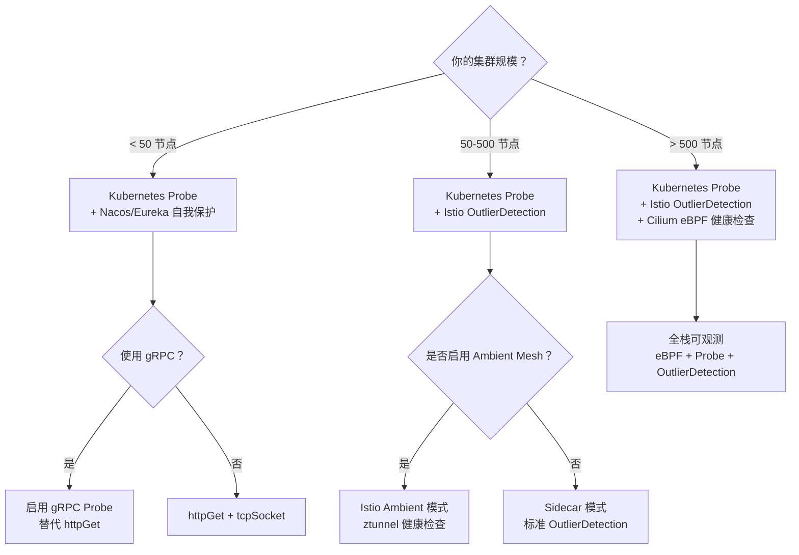

### 9.2 健康检查策略决策矩阵

| 决策因素 | 倾向方案 | 原因 |
|---------|---------|------|
| 应用启动慢 (>30s) | Startup Probe | 避免 Liveness 误杀 |
| 应用有复杂依赖 | Readiness + OutlierDetection | Readiness 检测依赖就绪，OutlierDetection 检测调用质量 |
| gRPC 原生服务 | gRPC Probe | 无需额外 HTTP 端点，直接复用 gRPC Health Protocol |
| 小规模集群 (<10 Pod/Service) | 仅 Kubernetes Probe | OutlierDetection 的 minHealthPercent 在小规模下意义不大 |
| 大规模集群 (>100 Pod/Service) | Probe + OutlierDetection + eBPF | 多层防护，精准感知 |
| 需要零信任网络策略 | Cilium eBPF | 内核层检测网络策略是否生效 |
| 传统 VM 部署 | 注册中心心跳 + 客户端摘除 | 无 K8s/Istio 基础设施 |

### 9.3 反模式清单

| 反模式 | 描述 | 正确做法 |
|--------|------|---------|
| Liveness 检查数据库 | DB 抖动导致 Pod 被反复重启 | Liveness 只检进程，DB 连通性由 Readiness 承担 |
| 所有 Probe 共用一个端点 | 无法区分"未就绪"和"已死亡" | 分离三个端点，各司其职 |
| OutlierDetection maxEjectionPercent 使用默认 10% | 小规模集群几乎无驱逐效果 | 根据实例数调高至 30-50% |
| 忽略 minHealthPercent | 集群大面积故障时 OutlierDetection 仍驱逐 | 设为 25%，保留最低可用节点 |
| Cilium 与 kube-proxy 并行运行 | 两套负载均衡逻辑冲突 | 明确选择一种模式 |

---

## 小结

服务节点存活识别经历了从"注册中心心跳"到"多层协同检测"的范式演进：

1. **应用层（传统方案）**：注册中心心跳 + 客户端摘除，简单但有单点风险和误判问题。心跳开关保护与摘除阈值保护是有效的降级策略。
2. **编排层（Kubernetes Probe）**：Startup/Liveness/Readiness 三类 Probe 将存活、就绪、启动三个状态解耦，实现了进程级精细化管理。
3. **网格层（Istio OutlierDetection）**：基于实际调用质量的被动健康检查，能感知进程活着但响应劣化的"灰色故障"。
4. **内核层（Cilium eBPF）**：突破用户态限制，从内核视角检测网络栈、eBPF 程序、路由规则的健康状态。
5. **框架层（Dubbo 3.3 SPI）**：可扩展的健康检查机制，桥接传统 RPC 框架与云原生基础设施。

**核心原则**：存活识别不是单一层的职责，而是多层的协同。下层（内核层）提供精确的连通性判定，中层（编排层/网格层）提供自动化故障响应，上层（应用层/框架层）提供业务语义丰富的健康判定。每一层都有其盲区，只有多层互补才能实现真正可靠的服务节点存活识别。

## 思考题

1. 在 Kubernetes 中，如果一个 Pod 的 Liveness Probe 和 Readiness Probe 同时失败，但 Istio OutlierDetection 认为该端点仍然健康（因为 Envoy 的请求仍在成功），你认为最终应以谁的判定为准？如何设计一个协调机制？
2. Cilium eBPF 深度健康检查能检测到内核态异常，但它自身也运行在 eBPF 中——如果 eBPF 健康检查程序本身出现异常，该如何保证"检查者的可靠性"？这是否是一个无限递归问题？


