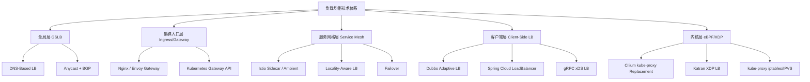
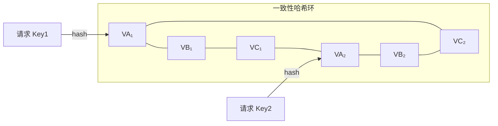
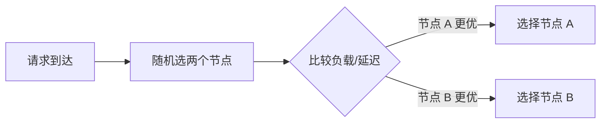
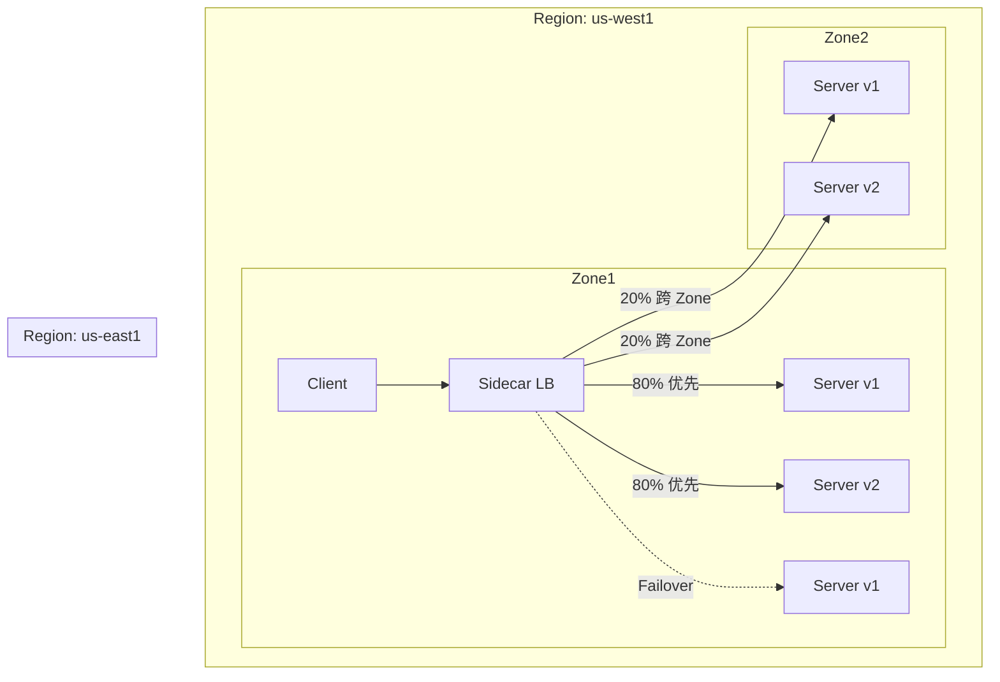
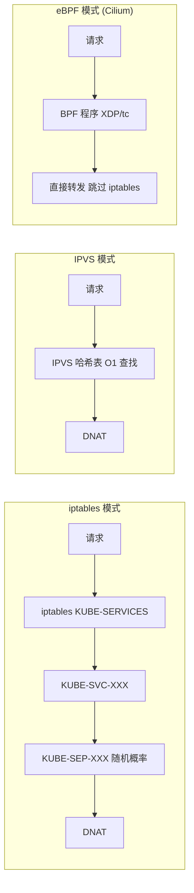
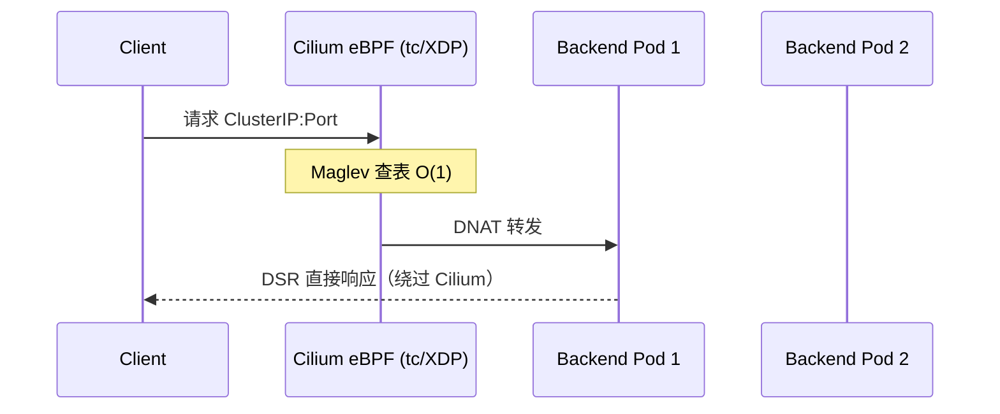
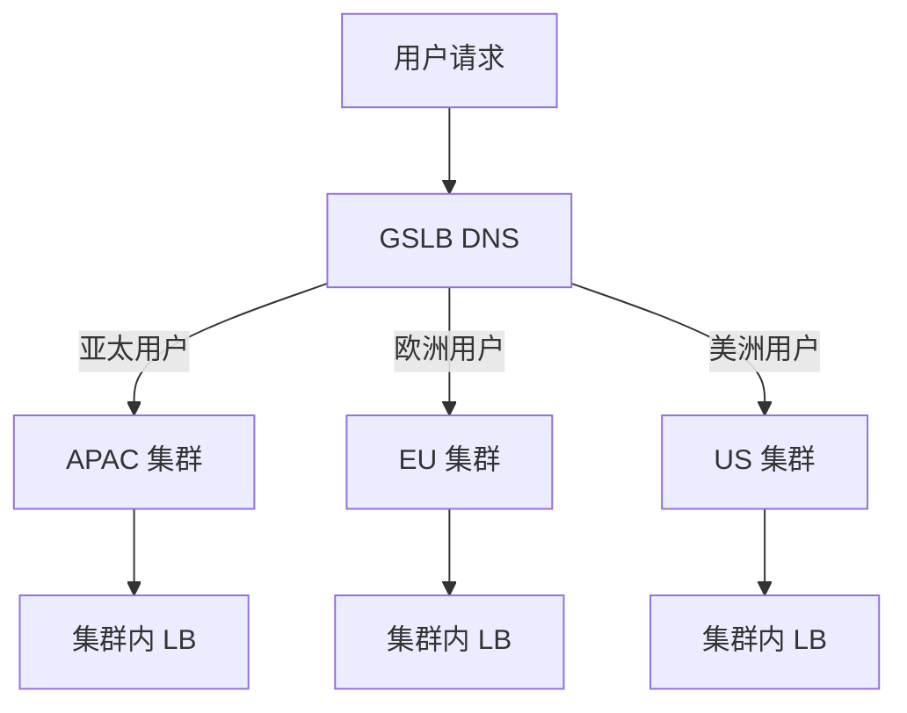
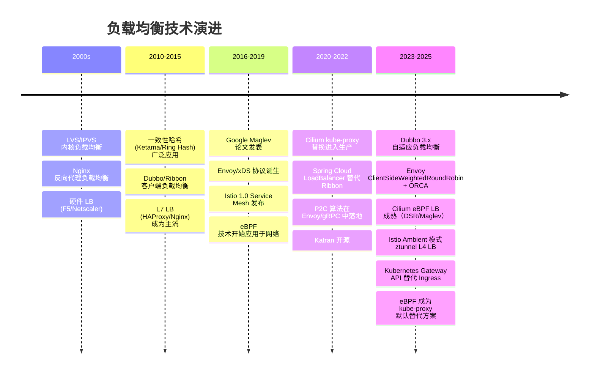
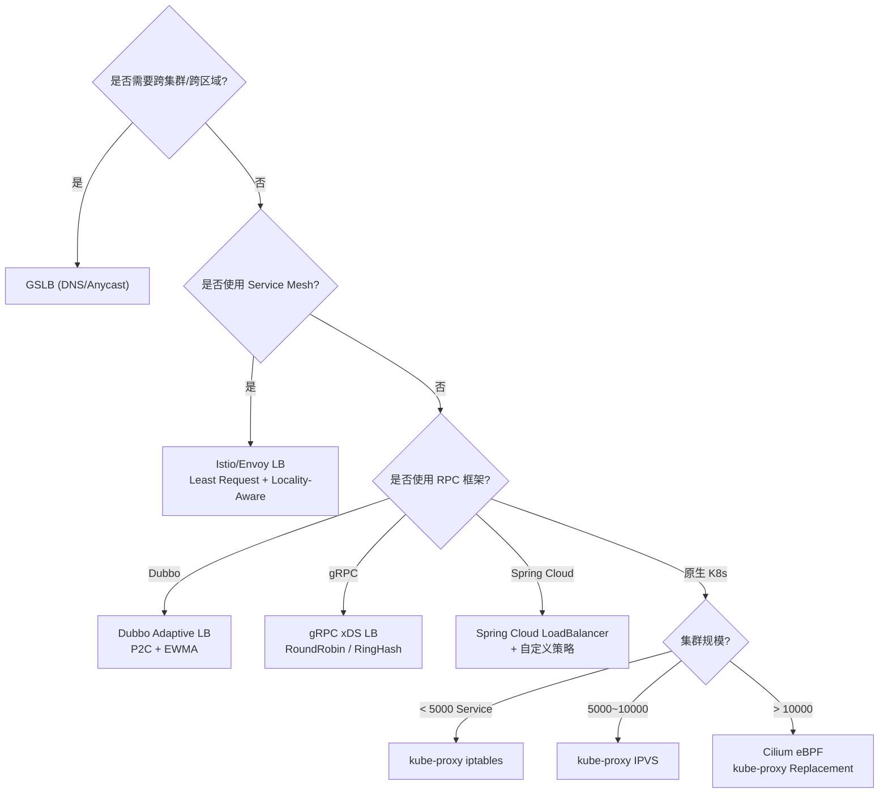

# 如何使用负载均衡算法

> 版本基线：Kubernetes 1.30+ | Istio 1.22+ | Cilium 1.16+ | Dubbo 3.3+
> 前置知识：[[09]] 微服务治理的手段有哪些？

## 概述

假设你订阅了一个别人的服务，从注册中心查询得到了这个服务的可用节点列表，而这个列表里包含了几十个节点——这个时候你该选择哪个节点发起调用呢？这就是负载均衡算法要回答的核心问题。

为什么要引入负载均衡算法？主要有两个原因：

- **均匀性**：让每个节点都接收到调用，发挥所有节点的作用；
- **性能**：哪个节点响应最快，优先调用哪个节点。

但到了 2025 年，这个问题的答案已经远不止"客户端选一个节点"这么简单。负载均衡已经演化为一个**多层、多维度**的技术体系：



本文将从**算法原理**出发，逐层剖析各层的负载均衡实现，并给出面向 2025 年的架构决策指南。

---

## 一、经典负载均衡算法

### 1.1 随机算法（Random）

从可用服务节点中随机挑选一个节点访问。在节点数量足够多、访问量较大的情况下，各节点被访问的概率基本相同。

```java
// Dubbo 3.3 RandomLoadBalance 核心逻辑（简化）
// dubbo-cluster/src/main/java/org/apache/dubbo/rpc/cluster/loadbalance/RandomLoadBalance.java
protected <T> Invoker<T> doSelect(List<Invoker<T>> invokers, URL url, Invocation invocation) {
    int length = invokers.size();
    boolean sameWeight = true;
    int[] weights = new int[length];
    int totalWeight = 0;
    // 计算总权重
    for (int i = 0; i < length; i++) {
        int weight = getWeight(invokers.get(i), invocation);
        weights[i] = weight;
        totalWeight += weight;
        if (sameWeight && i > 0 && weight != weights[i - 1]) {
            sameWeight = false;
        }
    }
    if (totalWeight > 0 && !sameWeight) {
        // 加权随机：在 [0, totalWeight) 区间内选一个随机偏移量
        int offset = ThreadLocalRandom.current().nextInt(totalWeight);
        for (int i = 0; i < length; i++) {
            offset -= weights[i];
            if (offset < 0) {
                return invokers.get(i);
            }
        }
    }
    return invokers.get(ThreadLocalRandom.current().nextInt(length));
}
```

### 1.2 轮询算法（Round Robin）

按固定顺序依次访问可用节点。将所有节点放入数组，按序号逐个访问，访问后序号自动加一。

### 1.3 加权轮询算法（Weighted Round Robin）

在轮询基础上给每个节点赋予不同权重，权重大的节点被访问概率更高。关键实现要点是**平滑加权轮询**（Smooth Weighted Round Robin），避免权重大的节点集中出现导致流量突发。

```java
// Dubbo 3.3 Smooth Weighted Round Robin 核心逻辑（简化）
// 关键：每次选择后动态调整 currentWeight，保证分布均匀
// 节点 A(3), B(2), C(1) 的选择序列为 A-B-A-C-A-B，而非 A-A-A-B-B-C
```

### 1.4 最少活跃连接算法（Least Active Connections）

每次选择当前活跃连接数最少的节点。连接数大说明处理慢，连接数小说明处理快。这是一种**被动反馈**式的负载均衡——不需要预先配置权重，而是根据运行时状态动态决策。

### 1.5 一致性哈希算法（Consistent Hash）

通过哈希函数将同一来源的请求映射到同一节点，具有"记忆功能"。只有当节点不可用时，请求才被分配到相邻的可用节点。

一致性哈希的关键创新在于**虚拟节点**（Virtual Node）：将每个物理节点映射为多个虚拟节点分布在哈希环上，使节点增删时请求的重新分布更均匀。添加或删除一个节点时，仅影响约 1/N 的请求（N 为节点数）。



### 经典算法对比

| 算法 | 均匀性 | 性能感知 | 配置复杂度 | 适用场景 |
|------|--------|---------|-----------|---------|
| 随机 | 中（请求量大时趋均） | 无 | 低 | 节点性能差异小 |
| 轮询 | 高 | 无 | 低 | 节点性能差异小 |
| 加权轮询 | 高（依赖权重配置） | 间接（通过权重） | 中 | 节点性能差异大且已知 |
| 最少活跃连接 | 高 | 弱（仅连接数） | 低 | 节点性能差异大且未知 |
| 一致性哈希 | 低（依赖 Key 分布） | 无 | 中 | 有状态服务、会话保持 |

---

## 二、进阶负载均衡算法

### 2.1 P2C 算法（Power of Two Choices）

经典算法在面对以下复杂场景时力不从心：

- 服务节点数量众多，且性能差异大
- 节点列表经常变化（扩缩容频繁）
- 客户端与节点网络情况复杂（跨数据中心、延迟抖动）

P2C 算法的核心思想来自 Michael Mitzenmacher 的经典论文：**不需要全局信息，只需随机选两个候选节点，挑更好的那个**。这种 O(1) 复杂度的算法，效果接近 O(N) 全扫描。



**为什么 P2C 有效？** 直觉上，随机选两个再比较，似乎比不上全局最优选择。但 Mitzenmacher 证明了：在 n 个球、n 个桶的经典模型中，纯随机分配的最大负载为 O(log n / log log n)，而 P2C 策略的最大负载降至 O(log log n)——这是指数级的改进。

**Envoy 的 Least Request 就是 P2C**：当所有节点权重相同时，随机选 2 个节点，挑活跃请求数更少的那个。当权重不同时，切换到动态加权模式：

```yaml
# Envoy Least Request LB 配置（Envoy 1.30+）
# weight = load_balancing_weight / (active_requests + 1)^active_request_bias
cluster:
  name: my_service
  type: EDS
  lb_policy: LEAST_REQUEST
  least_request_lb_config:
    choice_count: 2              # P2C：随机选 2 个候选
    active_request_bias: 1.0     # 活跃请求对权重的衰减系数
```

### 2.2 自适应负载均衡（Adaptive Load Balance）

自适应最优选择算法是对加权轮询的改良，可以看作**动态加权轮询**。其核心思路是：在客户端本地维护与每个节点的性能统计快照，按"二八原则"降低最慢 20% 节点的权重。

**Dubbo 3.3 AdaptiveLoadBalance** 在此基础上引入了更精细的 EWMA（Exponentially Weighted Moving Average，指数加权移动平均）指标：

```java
// Dubbo 3.3 自适应负载均衡核心思路（简化）
// 指标采集：RT（响应时间）、成功率、并发数
// 权重计算：dynamicWeight = staticWeight * (1 - errorRate) * (baselineRT / actualRT)
// 按动态权重排序，对底部 20% 节点降权
```

**EWMA 的优势**：相比简单平均，EWMA 对近期数据赋予更高权重，能更快反映性能变化，同时平滑瞬时抖动：

```
EWMA(t) = alpha * sample(t) + (1 - alpha) * EWMA(t-1)
```

- `alpha` 越大，对最新样本越敏感（推荐 0.5~0.7）
- 时间间隔建议 1 分钟：太短易受抖动影响，太长时效性不足
- 权重差异不宜过大（如差节点权重 3，正常节点权重 5），避免流量倾斜过重

### 2.3 Maglev 一致性哈希

Google 在 2016 年发表的 Maglev 论文提出了一种**查表式**的一致性哈希算法，相比 Ring Hash（Ketama）有显著性能优势：

| 特性 | Ring Hash (Ketama) | Maglev |
|------|-------------------|--------|
| 查找复杂度 | O(log n) 二分查找 | O(1) 直接查表 |
| 构建速度 | 慢（大环需大量哈希计算） | 快（约 10x） |
| 节点选择速度 | 中等 | 快（约 5x） |
| 节点变更时稳定性 | 高（仅 1/N 请求迁移） | 中（约 2x 请求迁移） |
| 内存占用 | 环大小可控 | 固定表大小（默认 65537） |
| 适用场景 | Redis、需要高稳定性 | L4 LB、需要极致性能 |

```yaml
# Envoy Maglev LB 配置（Envoy 1.30+）
cluster:
  name: redis_cluster
  lb_policy: MAGLEV
  maglev_lb_config:
    table_size: 65537    # 必须为质数，默认 65537
```

**Cilium 的 kube-proxy 替换也使用了 Maglev**：在 eBPF 数据路径中实现 Maglev 一致性哈希，保证 NodePort/LoadBalancer 服务的后端选择在节点间一致，避免连接中断。

### 2.4 Rendezvous 哈希（Highest Random Weight）

另一种一致性哈希变体，计算方式更简洁：对每个 (key, node) 对计算哈希值，选择哈希值最大的节点。优点是无需虚拟节点，实现更简单，且在节点增删时同样只影响少量请求。

---

## 三、客户端负载均衡

### 3.1 Dubbo 3.3 负载均衡体系

Dubbo 3.3 内置了丰富的负载均衡策略，并支持自适应扩展：

| 策略 | 名称 | 特点 |
|------|------|------|
| `random` | 加权随机 | 默认策略，性能好 |
| `roundrobin` | 加权轮询 | 平滑加权，分布均匀 |
| `leastactive` | 最少活跃调用 | 动态感知节点负载 |
| `consistenthash` | 一致性哈希 | 适合有状态服务 |
| `shortestresponse` | 最短响应时间 | Dubbo 3.x 新增 |
| `p2c` | Power of Two Choices | Dubbo 3.x 新增 |
| `adaptive` | 自适应负载均衡 | Dubbo 3.x 新增，EWMA 驱动 |

```java
// Dubbo 3.3 自适应负载均衡配置
// application.yml
dubbo:
  consumer:
    loadbalance: adaptive
  provider:
    loadbalance: adaptive
```

Dubbo 3.x 的 `adaptive` 策略结合了 P2C 的选择策略和 EWMA 的性能评估，是生产环境中处理异构集群的首选方案。

### 3.2 Spring Cloud LoadBalancer

Spring Cloud 2020+ 用 Spring Cloud LoadBalancer 替代了已停更的 Ribbon：

```java
// Spring Cloud LoadBalancer 配置（Spring Cloud 2023.x+）
@Configuration
public class LoadBalancerConfig {
    @Bean
    ReactorLoadBalancer<ServiceInstance> randomLoadBalancer(
            Environment environment,
            LoadBalancerClientFactory factory) {
        String name = environment.getProperty(
            LoadBalancerClientFactory.PROPERTY_NAME);
        return new RandomLoadBalancer(
            factory.getLazyProvider(name, ServiceInstanceListSupplier.class),
            name);
    }
}

// 支持的内置策略：Random、RoundRobin
// 可通过 ServiceInstanceListSupplier 自定义实例过滤和缓存
```

Spring Cloud LoadBalancer 的特点是**响应式**（基于 Reactor），与 WebClient 无缝集成，但内置策略相对简单，复杂场景通常需要自定义实现。

### 3.3 gRPC xDS 负载均衡

gRPC 从 1.26 起支持 xDS 协议，可以直接与 Istio/Envoy 控制面对接，实现**无代理**的客户端负载均衡：

```protobuf
// gRPC xDS LB 配置（gRPC 1.62+）
// 优点：无需 Sidecar，客户端直接从控制面获取后端列表和负载均衡策略
// 支持：RoundRobin、RingHash、LeastRequest
```

---

## 四、Service Mesh 负载均衡

### 4.1 Istio 负载均衡策略

Istio 通过 DestinationRule 配置负载均衡策略，底层由 Envoy 执行：

```yaml
# Istio 1.22+ DestinationRule 负载均衡配置
apiVersion: networking.istio.io/v1
kind: DestinationRule
metadata:
  name: reviews
spec:
  host: reviews.prod.svc.cluster.local
  trafficPolicy:
    loadBalancer:
      simple: LEAST_REQUEST    # 支持：ROUND_ROBIN, LEAST_REQUEST, RANDOM, PASSTHROUGH
  subsets:
  - name: v2
    labels:
      version: v2
    trafficPolicy:
      loadBalancer:
        consistentHash:         # 一致性哈希配置
          httpHeaderName: "x-session-id"
          # 或使用 Cookie：
          # httpCookie:
          #   name: "session"
          #   ttl: 3600s
          # 或使用 Maglev：
          # Maglev 配置需要通过 EnvoyFilter 注入
```

**Istio 支持的 LB 策略一览**：

| 策略 | 配置方式 | 特点 |
|------|---------|------|
| ROUND_ROBIN | `simple: ROUND_ROBIN` | 默认策略 |
| LEAST_REQUEST | `simple: LEAST_REQUEST` | P2C 实现，推荐 |
| RANDOM | `simple: RANDOM` | 无健康检查时优于轮询 |
| Ring Hash | `consistentHash.httpHeaderName` | 会话保持 |
| Maglev | 需 EnvoyFilter | 高性能一致性哈希 |

### 4.2 Locality-Aware 负载均衡

在多集群、多可用区部署中，Istio 支持**地域感知**负载均衡，优先将请求发往同一 Zone 的后端，减少跨区延迟和成本：

```yaml
# Istio 1.22+ Locality-Aware LB + Failover 配置
apiVersion: networking.istio.io/v1
kind: DestinationRule
metadata:
  name: reviews-global
spec:
  host: reviews.prod.svc.cluster.local
  trafficPolicy:
    connectionPool:
      http:
        h2UpgradePolicy: UPGRADE
    outlierDetection:
      consecutive5xxErrors: 3
      interval: 30s
      baseEjectionTime: 30s
    loadBalancer:
      localityLbSetting:        # 地域感知配置
        enabled: true
        distribute:             # 自定义流量分布
        - from: us-west1/zone1/*
          to:
            "us-west1/zone1": 80    # 80% 流量留在本 Zone
            "us-west1/zone2": 20    # 20% 跨 Zone
        failover:               # 故障转移策略
        - from: us-west1
          to: us-east1
        - from: us-east1
          to: us-west1
      simple: LEAST_REQUEST
```



### 4.3 Envoy 客户端加权轮询（Client-Side Weighted Round Robin）

Envoy 支持一种更高级的负载均衡策略——通过 ORCA（Open Request Cost Aggregation）协议从上游获取**真实负载指标**，动态调整权重：

```yaml
# Envoy 1.30+ ClientSideWeightedRoundRobin 配置
# 权重来源：上游通过 ORCA 报告 QPS、EPS、利用率
load_balancing_policy:
  policies:
  - typed_extension_config:
      name: envoy.load_balancing_policies.wrr_locality
      typed_config:
        "@type": type.googleapis.com/envoy.extensions.load_balancing_policies.wrr_locality.v3.WrrLocality
        endpoint_picking_policy:
          typed_extension_config:
            name: envoy.load_balancing_policies.client_side_weighted_round_robin
            typed_config:
              "@type": >-
                type.googleapis.com/envoy.extensions.load_balancing_policies.client_side_weighted_round_robin.v3.ClientSideWeightedRoundRobin
              slow_start_window: 600s   # 新节点慢启动窗口
```

**慢启动（Slow Start）** 是一个关键特性：新上线或恢复的节点不会立即承担全部流量，而是在窗口期内逐步增加权重，避免冷启动导致的延迟飙升。

---

## 五、eBPF / 内核层负载均衡

### 5.1 Kubernetes kube-proxy 的三种模式

Kubernetes Service 的负载均衡由 kube-proxy 实现，有三种模式：

| 模式 | 实现 | 规则数量级 | 延迟 | 适用规模 |
|------|------|-----------|------|---------|
| iptables | Netfilter 规则链 | O(n) 规则 | 随规则数线性增长 | < 5000 Service |
| IPVS | 内核 LVS 模块 | O(1) 哈希查找 | 恒定 | < 10000 Service |
| eBPF | Cilium BPF 程序 | O(1) 哈希查找 | 最低，跳过 iptables 栈 | > 10000 Service |



**iptables 的根本问题**：每条 Service 对应一条 KUBE-SVC 链规则，每条规则又有 N 条 KUBE-SEP 链（N 为后端数）。10000 个 Service 平均 3 个后端就是 40000 条规则，每次包都要线性遍历——这在大型集群中成为严重瓶颈。

**IPVS 的改进**：利用内核哈希表，查找复杂度从 O(n) 降到 O(1)，且原生支持多种调度算法（rr、wrr、lc、wlc、sh 源地址哈希等）。但 IPVS 仍需要 iptables 处理 masquerade 和 SNAT。

### 5.2 Cilium kube-proxy 替换

Cilium 用 eBPF 程序完全替代 kube-proxy，在数据路径上直接处理 Service 的 ClusterIP、NodePort、ExternalIP 和 LoadBalancer 类型：

```bash
# Cilium 1.16+ 安装（替换 kube-proxy）
# kubeadm init --skip-phases=addon/kube-proxy
helm install cilium cilium/cilium \
  --namespace kube-system \
  --set kubeProxyReplacement=true \
  --set k8sServiceHost=API_SERVER_IP \
  --set k8sServicePort=6443 \
  --set loadBalancer.algorithm=maglev   # 使用 Maglev 一致性哈希
```

**Cilium eBPF LB 的核心优势**：

1. **性能**：跳过整个 iptables/netfilter 栈，BPF 程序在 tc/XDP 层直接处理
2. **Maglev 一致性哈希**：保证同一五元组的包在所有节点上选择相同后端
3. **DSR（Direct Server Return）**：响应包直接从后端返回客户端，不经过 NodePort 转发节点
4. **Socket-Level LB**：同节点 Pod 间通信直接在 socket 层转发，无需经过网络栈



### 5.3 Katran — Meta 的高性能 L4 LB

Katran 是 Meta（原 Facebook）开源的基于 XDP 的四层负载均衡器：

- **XDP 驱动模式**：在网卡驱动层处理包，性能可达 10M+ PPS/核
- **DSR 模式**：只处理入向流量，出向流量直接从后端返回
- **一致性哈希**：内置 Maglev 算法实现
- **"单臂"部署**：单网卡同时处理入向和出向流量

Katran 适用于超大规模数据中心入口的 L4 负载均衡，与 L7 LB（如 Envoy/Nginx）配合形成分层架构。

---

## 六、全局负载均衡（GSLB）

### 6.1 DNS-Based GSLB

在多区域、多集群部署中，全局负载均衡通过 DNS 将用户引导至最近的集群：



**主流 GSLB 方案**：

| 方案 | 类型 | 特点 |
|------|------|------|
| Cloud Provider GSLB | 托管 | AWS Route53 / GCP Cloud DNS / Azure Traffic Manager |
| External DNS + Ingress | 自建 | Kubernetes ExternalDNS + Nginx/Envoy Ingress |
| Istio Multi-Cluster | 服务网格 | 跨集群服务发现 + Locality Failover |
| CoreDNS + Federation | 自建 | Kubernetes Multi-Cluster Service |

### 6.2 Istio 多集群流量调度

Istio 1.22+ 原生支持多集群部署，通过控制面共享或远程配置实现跨集群服务发现和负载均衡：

```yaml
# Istio 多集群 Locality Failover
# 当 us-west 集群不可用时，自动 failover 到 us-east
apiVersion: networking.istio.io/v1
kind: DestinationRule
metadata:
  name: reviews-multi-cluster
spec:
  host: reviews.prod.svc.cluster.local
  trafficPolicy:
    loadBalancer:
      localityLbSetting:
        enabled: true
        failover:
        - from: us-west1
          to: us-east1
      simple: LEAST_REQUEST
    outlierDetection:
      consecutive5xxErrors: 3
      interval: 30s
      baseEjectionTime: 30s
```

---

## 七、技术演进时间线



---

## 八、架构决策指南

### 8.1 按部署形态选择

| 部署形态 | 推荐方案 | LB 算法 | 理由 |
|---------|---------|---------|------|
| 单集群 + 同构节点 | Kubernetes Service (IPVS) | Round Robin / Random | 简单高效 |
| 单集群 + 异构节点 | Dubbo 3.3 / Istio | Adaptive / Least Request | 动态感知节点差异 |
| 多可用区 + 同城容灾 | Istio + Locality-Aware | Least Request + Failover | 优先本 Zone，自动容灾 |
| 多集群 + 全球部署 | GSLB + Istio Multi-Cluster | DNS + Least Request | 就近接入 + 跨集群容灾 |
| 超大规模入口 | Katran/Nginx + Envoy | Maglev + Least Request | XDP 极致性能 + L7 灵活路由 |

### 8.2 按服务特征选择

| 服务特征 | 推荐算法 | 理由 |
|---------|---------|------|
| 无状态 + 节点性能一致 | Random / Round Robin | 简单可靠 |
| 无状态 + 节点性能差异大 | P2C / Least Request | 自动感知负载 |
| 有状态 + 会话保持 | 一致性哈希 (Ring Hash / Maglev) | 请求亲和性 |
| 缓存热点 + Key 分布不均 | Rendezvous Hash | 无虚拟节点，分布更均匀 |
| 长连接 + WebSocket | Least Active Connections | 避免连接堆积 |
| 异构硬件 + 动态扩缩容 | Adaptive (EWMA) + Slow Start | 自适应 + 新节点预热 |

### 8.3 按网络层选择



### 8.4 关键决策原则

1. **算法不是越复杂越好**：10 个同构节点同机房，用 Random 或 Round Robin 既简单又高效
2. **优先选择有反馈机制的算法**：P2C/Least Request/Adaptive > 静态加权 > 纯随机
3. **有状态服务必须用一致性哈希**：但要注意节点变更时的请求迁移
4. **eBPF 不是银弹**：Cilium 替换 kube-proxy 有内核版本要求（5.10+），且调试链路更长
5. **客户端 LB 和 Service Mesh LB 不要冲突**：如果在 Istio 中运行 Dubbo，应关闭 Dubbo 客户端 LB，由 Sidecar 统一处理
6. **Slow Start 几乎总是必要的**：新节点冷启动时，JIT 编译、连接池预热、缓存填充都会导致初始延迟偏高

---

## 小结

本文从经典负载均衡算法出发，系统梳理了 2025 年负载均衡技术的全貌：

1. **经典算法**（随机、轮询、加权轮询、最少活跃连接、一致性哈希）是基础，理解原理才能正确选择
2. **P2C 和自适应算法**（EWMA 驱动）是应对异构集群和动态环境的利器，Dubbo 3.3 和 Envoy 已原生支持
3. **Maglev 一致性哈希**在 L4 LB 场景下性能远超 Ring Hash，Cilium eBPF LB 和 Katran 均采用
4. **Service Mesh 层**（Istio/Envoy）提供了 Locality-Aware、Failover、Slow Start 等企业级特性
5. **eBPF 层**（Cilium kube-proxy 替换）是 Kubernetes 大规模集群的必选项
6. **GSLB 层**解决多区域/多集群的全局流量调度

负载均衡没有"万能解"——**好的架构师不是选择最先进的算法，而是在每一层选择最合适的策略**。

---

## 思考题

1. 如果你的服务同时部署在 Kubernetes 和虚拟机上，并且需要跨集群调用，你会如何设计负载均衡的分层策略？
2. Cilium eBPF 替换 kube-proxy 后，同一个 ClusterIP 的请求在节点 A 和节点 B 上是否一定会选择同一个后端 Pod？为什么？


---

**扩展阅读：**

- Mitzenmacher P2C 论文：[The Power of Two Choices in Randomized Load Balancing](https://www.eecs.harvard.edu/~michaelm/postscripts/handbook2001.pdf)
- Google Maglev 论文：[Maglev: A Fast and Reliable Software Network Load Balancer](https://static.googleusercontent.com/media/research.google.com/en//pubs/archive/44824.pdf)
- Envoy Load Balancing 架构：[https://www.envoyproxy.io/docs/envoy/latest/intro/arch_overview/upstream/load_balancing/load_balancers](https://www.envoyproxy.io/docs/envoy/latest/intro/arch_overview/upstream/load_balancing/load_balancers)
- Cilium kube-proxy 替换：[https://docs.cilium.io/en/latest/network/kubernetes/kubeproxy-free/](https://docs.cilium.io/en/latest/network/kubernetes/kubeproxy-free/)
- Istio Locality Load Balancing：[https://istio.io/latest/docs/tasks/traffic-management/locality-load-balancing/](https://istio.io/latest/docs/tasks/traffic-management/locality-load-balancing/)
- Katran XDP Load Balancer：[https://github.com/facebookincubator/katran](https://github.com/facebookincubator/katran)
- Dubbo 3.x 负载均衡：[https://dubbo.apache.org/en/overview/what/ecosystem/load-balance/](https://dubbo.apache.org/en/overview/what/ecosystem/load-balance/)
