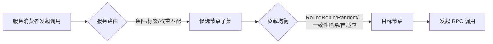
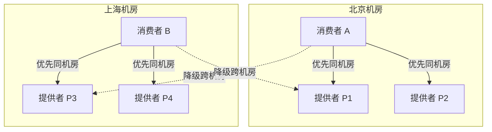
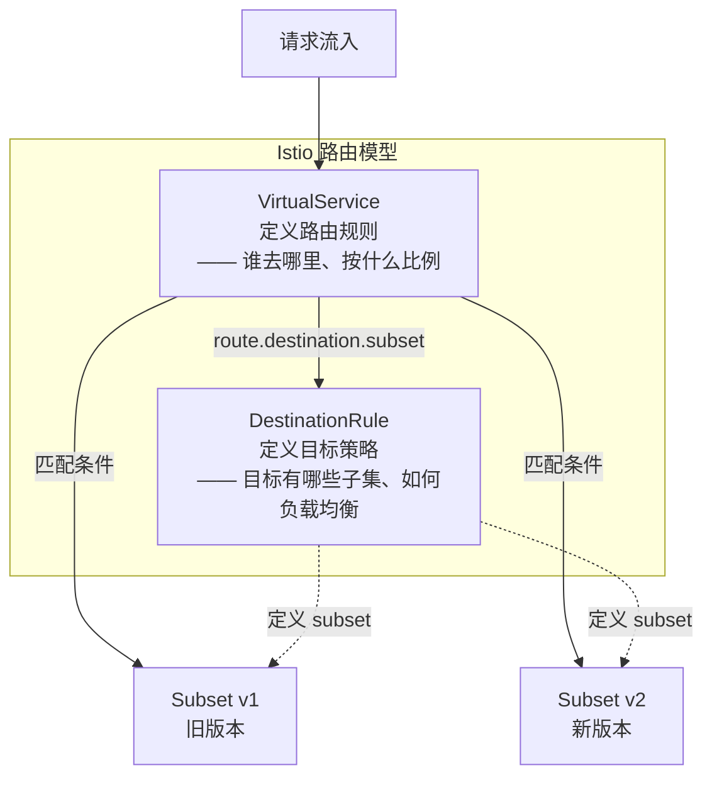
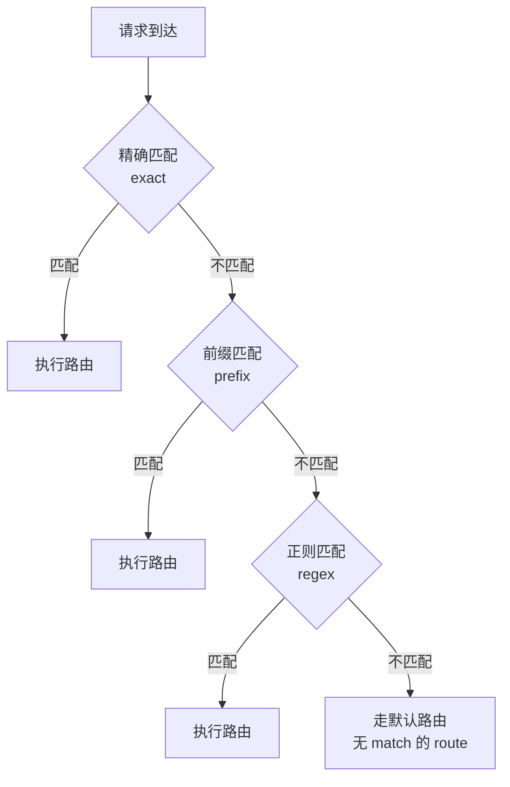
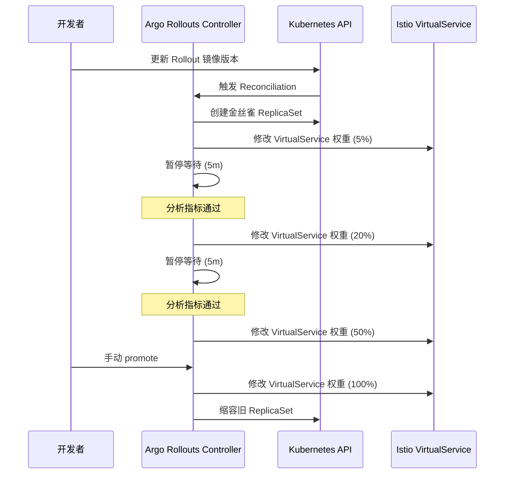
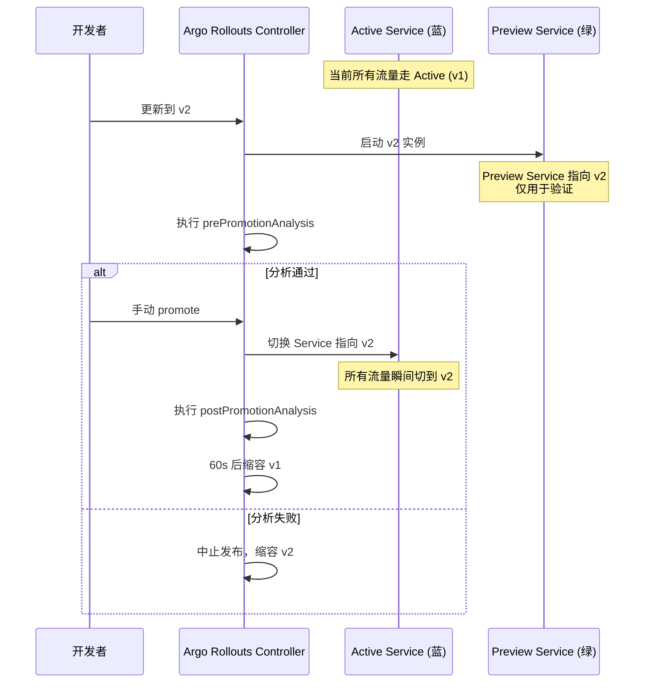
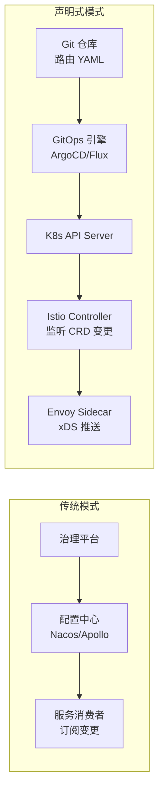
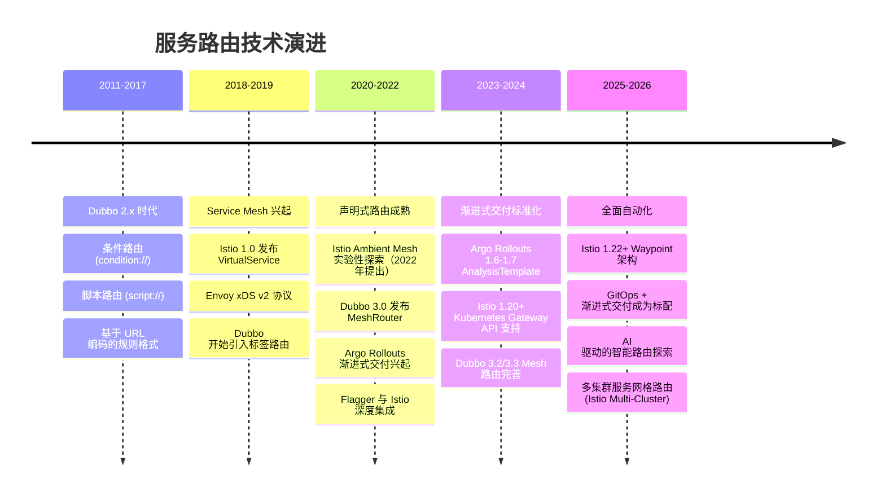
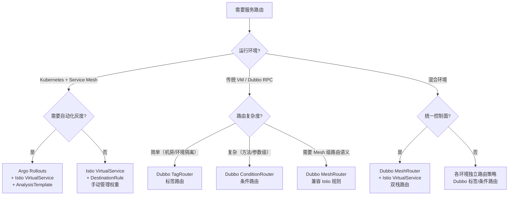

# 如何使用服务路由

> 前置知识：[[09]] 微服务治理的手段有哪些 —— 本文讨论的服务路由是微服务治理的核心手段之一，建议先了解治理框架的全貌。

## 概述

专栏上一期讲解了客户端负载均衡算法，它解决了"从众多可用节点中选取一个最合适的节点发起调用"的问题。但在生产环境中，我们经常面临更复杂的调度需求：新版本上线时如何只让 5% 的流量打到新节点？同城双活场景下如何保证请求不跨机房？线上某个节点出现故障时如何一键摘除？这些问题本质上都指向同一个概念——**服务路由**。

**服务路由，是指服务消费者在发起服务调用时，根据特定的规则来选择服务节点，从而满足某些特定的调度需求。**

如果说负载均衡解决的是"选哪个节点"的问题，那么服务路由解决的是"在哪些节点中选"的问题——路由先缩小候选集，负载均衡再从候选集中挑选。两者的协作关系如下：



2018 年原文写作时，服务路由还停留在 Dubbo 2.x 的条件路由和脚本路由阶段，Service Mesh 尚在萌芽。到 2025-2026 年，服务路由已经演进为一个多层次的体系：

| 层次 | 传统 RPC 框架（Dubbo） | Service Mesh（Istio） | 渐进式交付（Argo Rollouts / Flagger） |
|------|----------------------|---------------------|--------------------------------------|
| 路由规则 | 条件路由 / 标签路由 / Mesh 路由 | VirtualService + DestinationRule | Canary / BlueGreen Strategy |
| 配置方式 | 注册中心 / 配置中心动态下发 | K8s CRD 声明式 | GitOps + K8s CRD |
| 粒度 | IP / 方法 / 标签 | Header / Cookie / 权重 / 来源 | 全局流量百分比 |
| 自动化 | 手动修改配置 | 手动或 CI/CD 联动 | 自动化分析 + 渐进式推进 |

本文将从应用场景出发，系统讲解服务路由的规则体系、现代实现方案、以及如何根据架构选型做出决策。

---

## 一、服务路由的应用场景

### 1.1 分组调用与多机房就近路由

一个服务往往部署在多个数据中心——私有机房、公有云 A、公有云 B，甚至跨国节点。服务节点按照数据中心被分成不同的分组，消费者发起调用时必须选择合适的分组。

就近路由（Locality-based Routing）是最常见的分组策略：优先调用同机房节点，仅在本地无可用节点时才跨机房。在 Istio 中，这通过 DestinationRule 的 `localityLbSetting` 实现；在 Dubbo 3.x 中，通过标签路由（TagRouter）将同区域节点打上相同标签。



### 1.2 灰度发布（金丝雀部署）

服务上线发布时，先在一小部分节点上部署新版本，导入少量流量验证功能是否正常。正常则扩大范围；异常则回滚。这个渐进式过程就是灰度发布（Canary Deployment），也叫金丝雀部署。

灰度发布对路由的核心诉求是**流量按比例分配**：90% 流量到旧版本，10% 到新版本。现代灰度发布已经从手动改权重演进为自动化的渐进式交付，后文将详细展开。

### 1.3 流量切换（故障转移）

当某个机房因光缆被挖断、着火等不可抗力因素导致整体不可用时，需要将调用该机房的流量快速切换到其他正常机房。这是服务路由在故障应急中的关键应用——通过动态下发路由规则，实现一键流量迁移。

### 1.4 读写分离

互联网业务通常是读多写少。可以将读接口和写接口分开部署——读接口部署在高配节点上，写接口部署在稳定节点上，避免读请求异常影响写请求的稳定性。

### 1.5 A/B 测试

A/B 测试是一种更精细的灰度策略：不是随机分配流量比例，而是根据用户特征（如用户 ID、地域、设备类型）将特定用户群体路由到新版本，其余用户走旧版本。这要求路由规则能基于请求上下文（Header、Cookie、参数）做匹配。

---

## 二、服务路由的规则体系

### 2.1 条件路由（Conditional Routing）

条件路由是最基础的路由规则，基于条件表达式进行匹配和过滤。Dubbo 从 2.x 到 3.x 一直保留了条件路由的核心语法：

```
消费者匹配条件 => 提供者过滤条件
```

分隔符 `=>` 前面是消费者的匹配条件，后面是提供者的过滤条件。当消费者满足匹配条件时，对其应用过滤规则。

**典型用法：**

| 场景 | 规则表达式 | 说明 |
|------|----------|------|
| 排除故障节点 | `=> host != 172.22.3.91` | 所有消费者不访问该 IP |
| 白名单 | `host != 10.20.153.10,10.20.153.11 =>` | 仅指定 IP 可访问 |
| 黑名单 | `host = 10.20.153.10,10.20.153.11 =>` | 指定 IP 禁止访问 |
| 机房隔离 | `host = 172.22.3.* => host = 172.22.3.*` | 同网段就近访问 |
| 读写分离 | `method = find*,get* => host = 10.0.1.*` | 读方法路由到读节点组 |

Dubbo 3.x 中条件路由通过 `ServiceRouter` 和 `AppRouter` 两个实现类管理，分别对应服务级和应用级路由规则，配置存储在注册中心/配置中心中，支持动态变更。

### 2.2 标签路由（Tag Routing）

标签路由是 Dubbo 3.x 推荐的路由方式，相比条件路由更加结构化和可管理。它通过给服务节点打标签（Tag），再按标签筛选路由。

**Dubbo 3.x 标签路由配置示例（YAML 格式）：**

```yaml
# dubbo 3.x tag-router rule
force: true
runtime: false
enabled: true
priority: 1
key: demo-provider
tags:
  - name: beijing
    addresses:
      - 10.0.1.11:20880
      - 10.0.1.12:20880
  - name: shanghai
    addresses:
      - 10.0.2.11:20880
      - 10.0.2.12:20880
```

消费者通过 Attachment 传递标签信息：

```java
// Dubbo 3.x 标签路由 - 消费端设置标签
RpcContext.getContext().setAttachment("dubbo.tag", "beijing");
```

标签路由的优先级高于条件路由，适合用于机房分组、环境隔离等场景。当请求携带 `dubbo.tag` 时，优先路由到匹配标签的节点；如果匹配不到且 `force=false`，则降级到无标签节点。

### 2.3 Mesh 路由（Dubbo MeshRouter）

Dubbo 3.x 引入了 MeshRouter，这是与 Istio VirtualService/DestinationRule 对齐的路由模型。MeshRouter 的目标是让 Dubbo 在非 K8s/Istio 环境下也能使用与 Service Mesh 一致的路由语义。

MeshRouter 支持以下路由能力：
- **基于权重的流量分配**：将流量按百分比分配到不同版本
- **基于请求头的匹配**：根据 HTTP Header / RPC Attachment 做条件路由
- **基于方法的路由**：根据调用的方法名做匹配
- **重试与超时配置**：在路由层面设置重试策略和超时时间

这使得 Dubbo 应用在不部署 Sidecar 的情况下，也能获得与 Istio 等价的路由能力。

### 2.4 脚本路由（Script Routing）

脚本路由基于脚本语言（JavaScript、Groovy 等）编写路由逻辑，灵活性最高但维护成本也最大。在 Dubbo 3.x 中脚本路由已被标记为不建议使用（deprecated），推荐使用条件路由或标签路由替代。生产环境中，脚本路由因为可读性差、调试困难、安全隐患大，基本已被淘汰。

---

## 三、Istio 服务路由：VirtualService 与 DestinationRule

Service Mesh 时代，Istio 成为服务路由的事实标准。Istio 的路由模型将"路由规则"和"目标策略"分离为两个核心资源：



### 3.1 DestinationRule：定义目标子集与策略

DestinationRule 定义了服务的子集（Subset）划分和流量策略，是路由的"基础设施"。

```yaml
# Istio 1.22+ DestinationRule
apiVersion: networking.istio.io/v1
kind: DestinationRule
metadata:
  name: reviews
spec:
  host: reviews
  trafficPolicy:
    loadBalancer:
      simple: RANDOM        # 全局负载均衡策略
    connectionPool:
      tcp:
        maxConnections: 100
      http:
        h2UpgradePolicy: DEFAULT
        http1MaxPendingRequests: 1000
        http2MaxRequests: 1000
  subsets:
    - name: v1
      labels:
        version: v1
      trafficPolicy:
        loadBalancer:
          simple: ROUND_ROBIN  # 子集级负载均衡可覆盖全局
    - name: v2
      labels:
        version: v2
    - name: v3
      labels:
        version: v3
```

DestinationRule 还支持**离群检测（Outlier Detection）**——自动摘除不健康的实例：

```yaml
# Istio 1.22+ Outlier Detection
apiVersion: networking.istio.io/v1
kind: DestinationRule
metadata:
  name: reviews
spec:
  host: reviews
  trafficPolicy:
    outlierDetection:
      consecutive5xxErrors: 3      # 连续 3 次 5xx 错误
      interval: 30s                # 每 30s 检测一次
      baseEjectionTime: 60s        # 摘除 60s
      maxEjectionPercent: 50       # 最多摘除 50% 实例
```

以及**地域感知路由（Locality-aware Routing）**：

```yaml
# Istio 1.22+ Locality-aware Routing
apiVersion: networking.istio.io/v1
kind: DestinationRule
metadata:
  name: reviews
spec:
  host: reviews
  trafficPolicy:
    localityLbSetting:
      enabled: true
      failover:
        - from: bj/zone1
          to: sh/zone1
        - from: sh/zone1
          to: bj/zone1
    outlierDetection:
      consecutive5xxErrors: 3
      interval: 30s
      baseEjectionTime: 60s
```

### 3.2 VirtualService：定义路由规则

VirtualService 定义了请求的匹配条件和路由目标，是 Istio 路由的核心。

#### 权重路由（Weight-based Routing）

最常见的灰度发布场景——按比例分配流量：

```yaml
# Istio 1.22+ 权重路由：80% 到 v1，20% 到 v2
apiVersion: networking.istio.io/v1
kind: VirtualService
metadata:
  name: reviews
spec:
  hosts:
    - reviews
  http:
    - route:
        - destination:
            host: reviews
            subset: v1
          weight: 80
        - destination:
            host: reviews
            subset: v2
          weight: 20
```

#### 基于 Header 的路由（Header-based Routing）

A/B 测试场景——根据请求头将特定用户路由到新版本：

```yaml
# Istio 1.22+ Header 匹配路由
apiVersion: networking.istio.io/v1
kind: VirtualService
metadata:
  name: reviews
spec:
  hosts:
    - reviews
  http:
    - match:
        - headers:
            end-user:
              exact: jason
      route:
        - destination:
            host: reviews
            subset: v2
    - route:
        - destination:
            host: reviews
            subset: v3
```

#### 基于 Cookie 的路由（Cookie-based Routing）

通过 Cookie 进行用户分群，适合 Web 应用的灰度场景：

```yaml
# Istio 1.22+ Cookie 匹配路由
apiVersion: networking.istio.io/v1
kind: VirtualService
metadata:
  name: reviews
spec:
  hosts:
    - reviews
  http:
    - match:
        - headers:
            cookie:
              regex: "^(.*?;)?(canary=true)(;.*)?$"
      route:
        - destination:
            host: reviews
            subset: v2
          weight: 100
    - route:
        - destination:
            host: reviews
            subset: v1
          weight: 100
```

#### 故障注入与重试策略

VirtualService 还能在路由层面配置故障注入和重试，用于混沌工程测试：

```yaml
# Istio 1.22+ 故障注入 + 重试
apiVersion: networking.istio.io/v1
kind: VirtualService
metadata:
  name: reviews
spec:
  hosts:
    - reviews
  http:
    - route:
        - destination:
            host: reviews
            subset: v1
      retries:
        attempts: 3
        perTryTimeout: 2s
        retryOn: 5xx,reset,connect-failure
      fault:
        delay:
          percentage:
            value: 10    # 10% 的请求注入 5s 延迟
          fixedDelay: 5s
```

### 3.3 Istio 路由匹配优先级

当一个请求可能匹配多条 VirtualService 规则时，Istio 按以下优先级处理：



同一 VirtualService 内，`match` 块按声明顺序从上到下匹配，**第一个匹配即生效**；不同 VirtualService 之间，长域名优先于短域名。

---

## 四、渐进式交付：自动化灰度的现代实践

传统的灰度发布需要运维手动修改路由权重，观察指标后再决定是否继续推进。这个过程在 2025 年已经被**渐进式交付（Progressive Delivery）**工具链自动化了。

### 4.1 Argo Rollouts：Kubernetes 原生的渐进式交付

Argo Rollouts 是 Kubernetes 生态中应用最广泛的渐进式交付控制器，它替换了 Kubernetes 原生的 Deployment 资源，提供了更精细的发布控制。

#### 金丝雀策略（Canary Strategy）

```yaml
# Argo Rollouts 1.7+ Canary Strategy
apiVersion: argoproj.io/v1alpha1
kind: Rollout
metadata:
  name: reviews-rollout
spec:
  replicas: 10
  strategy:
    canary:
      canaryService: reviews-canary     # 指向金丝雀版本的 Service
      stableService: reviews-stable     # 指向稳定版本的 Service
      steps:
        - setWeight: 5                  # 5% 流量到金丝雀
        - pause: { duration: 5m }       # 暂停 5 分钟观察
        - setWeight: 20                 # 20% 流量到金丝雀
        - pause: { duration: 5m }       # 暂停 5 分钟观察
        - setWeight: 50                 # 50% 流量到金丝雀
        - pause: {}                     # 手动确认后继续
        - setWeight: 80                 # 80% 流量到金丝雀
        - pause: { duration: 5m }
      trafficRouting:
        istio:
          virtualServices:
            - name: reviews-vsvc        # 引用 Istio VirtualService
              routes:
                - http-primary
```

Argo Rollouts 与 Istio 的集成流程：



#### 蓝绿策略（Blue-Green Strategy）

蓝绿部署与金丝雀部署不同，它维护两套完整的环境，切换是全量的：

```yaml
# Argo Rollouts 1.7+ Blue-Green Strategy
apiVersion: argoproj.io/v1alpha1
kind: Rollout
metadata:
  name: reviews-rollout
spec:
  replicas: 5
  strategy:
    blueGreen:
      activeService: reviews-active     # 当前活跃版本的 Service
      previewService: reviews-preview   # 预览版本的 Service
      autoPromotionEnabled: false       # 需要手动确认切换
      prePromotionAnalysis:             # 切换前自动分析
        templates:
          - templateName: success-rate
        args:
          - name: service-name
            value: reviews-preview
      postPromotionAnalysis:            # 切换后自动分析
        templates:
          - templateName: error-rate
        args:
          - name: service-name
            value: reviews-active
      scaleDownDelaySeconds: 60         # 切换后 60s 再缩容旧版本
```

蓝绿部署的流程：



#### AnalysisTemplate：自动化指标分析

Argo Rollouts 最强大的特性是与 Analysis 集成，实现基于指标的自动升降级：

```yaml
# Argo Rollouts AnalysisTemplate
apiVersion: argoproj.io/v1alpha1
kind: AnalysisTemplate
metadata:
  name: success-rate
spec:
  args:
    - name: service-name
  metrics:
    - name: success-rate
      interval: 30s
      successCondition: result[0] >= 0.95
      failureLimit: 3
      provider:
        prometheus:
          address: http://prometheus:9090
          query: |
            sum(rate(http_requests_total{service="{{args.service-name}}",status!~"5.."}[1m]))
            /
            sum(rate(http_requests_total{service="{{args.service-name}}"}[1m]))
```

### 4.2 Flagger：Istio 原生的渐进式交付

Flagger 由 Weaveworks 开源（该公司已于 2024 年关闭，项目现由 flux-community 维护），与 Istio 深度集成，配置更简洁：

```yaml
# Flagger Canary 资源定义
apiVersion: flagger.app/v1beta1
kind: Canary
metadata:
  name: reviews
spec:
  targetRef:
    apiVersion: apps/v1
    kind: Deployment
    name: reviews
  service:
    port: 9080
  analysis:
    interval: 1m
    threshold: 5           # 连续 5 次分析失败则回滚
    maxWeight: 50          # 金丝雀最大权重 50%
    stepWeight: 10         # 每次增加 10% 权重
    metrics:
      - name: request-success-rate
        thresholdRange:
          min: 99          # 成功率 >= 99%
        interval: 1m
      - name: request-duration
        thresholdRange:
          max: 500         # P99 延迟 <= 500ms
        interval: 1m
    webhooks:
      - name: load-test
        type: rollout
        url: http://flagger-loadtester/
        timeout: 5s
        metadata:
          cmd: "hey -z 1m -q 10 -c 2 http://reviews:9080/"
```

### 4.3 金丝雀 vs 蓝绿 vs A/B 测试对比

| 维度 | 金丝雀部署 (Canary) | 蓝绿部署 (Blue-Green) | A/B 测试 |
|------|-------------------|---------------------|---------|
| 流量分配 | 渐进式增加（5% → 20% → 50% → 100%） | 全量切换 | 按用户特征分组 |
| 回滚速度 | 需逐步缩回 | 瞬间切回 | 瞬间切回 |
| 资源开销 | 只需少量金丝雀实例 | 需要两套完整环境 | 取决于分组数量 |
| 风险等级 | 低（影响范围逐步扩大） | 中（切换瞬间全量影响） | 低（精确控制用户群） |
| 路由需求 | 权重路由 | Service 指向切换 | Header/Cookie 匹配 |
| 适用场景 | 常规版本发布 | 关键版本切换 | 功能效果验证 |
| 推荐工具 | Argo Rollouts / Flagger | Argo Rollouts | Istio VirtualService |

---

## 五、路由规则的获取与管理方式

### 5.1 三种获取方式

| 方式 | 描述 | 优点 | 缺点 |
|------|------|------|------|
| 本地配置 | 路由规则存储在消费者本地 | 简单直接、无外部依赖 | 修改需重启、难以统一管理 |
| 配置中心管理 | 从配置中心（Nacos/Apollo/Consul）获取 | 统一管理、动态更新 | 仍需手动修改配置 |
| 动态下发 | 通过治理平台修改，配置中心实时推送 | 运维友好、实时生效 | 需要治理平台支撑 |

### 5.2 现代声明式管理

在 Kubernetes + Service Mesh 架构下，路由规则的获取方式发生了根本变化：



声明式模式下：
- 路由规则以 YAML 存储在 Git 仓库，变更可审计、可回滚
- 通过 GitOps 引擎（ArgoCD、Flux）自动同步到集群
- Istio Controller 监听 CRD 变更，通过 xDS 协议推送到 Envoy Sidecar
- 全程无需手动操作配置中心，无需重启服务

### 5.3 优先级与覆盖关系

无论哪种模式，路由规则的优先级通常遵循：

> **本地配置 > 动态下发 > 配置中心管理 > 默认规则**

在 Istio 中，多个 VirtualService 可通过 `exportTo` 限制命名空间可见性，优先级由匹配精度决定（长域名优先）。在 Dubbo 中，路由链的执行顺序为：TagRouter → MeshRouter → ConditionRouter → ScriptRouter，优先级也可通过 `priority` 字段调整。

---

## 六、技术演进时间线



---

## 七、架构决策指南：如何选择路由方案

### 7.1 决策流程



### 7.2 选型对比矩阵

| 评估维度 | Dubbo 条件路由 | Dubbo 标签路由 | Istio VirtualService | Argo Rollouts |
|---------|-------------|-------------|---------------------|--------------|
| 学习成本 | 低 | 低 | 中 | 中高 |
| 配置复杂度 | 高（URL 编码） | 低（YAML） | 中（YAML 声明式） | 中（CRD 组合） |
| 动态更新 | 支持 | 支持 | 支持（K8s 声明式） | 支持（GitOps） |
| 权重路由 | 不支持 | 不支持 | 支持 | 支持（集成 Istio） |
| Header/Cookie 路由 | 不支持 | 不支持 | 支持 | 间接支持 |
| 自动化灰度 | 不支持 | 不支持 | 不支持 | 支持 |
| 指标分析驱动 | 不支持 | 不支持 | 不支持 | 支持（AnalysisTemplate） |
| 多语言支持 | Java 生态 | Java 生态 | 全语言 | 全语言 |
| 适用架构 | 传统 Dubbo | 传统 Dubbo | K8s + Mesh | K8s + Mesh |

### 7.3 实践建议

1. **新项目优先选择 Istio + Argo Rollouts**：声明式管理、自动化灰度、全语言覆盖，是 2025-2026 年的主流方案。
2. **存量 Dubbo 项目渐进升级**：先用标签路由替换条件路由，再逐步引入 MeshRouter，最终对接 Service Mesh。
3. **灰度发布一定要自动化**：手动改权重 + 人工观察的方式已经过时，Argo Rollouts 的 AnalysisTemplate 可以基于 Prometheus 指标自动判断发布是否安全。
4. **路由规则纳入 GitOps 管理**：所有路由变更通过 Git 提交，经 Code Review 后由 ArgoCD/Flux 自动同步，确保可审计、可回滚。
5. **避免过度路由**：路由规则越复杂，排障越困难。能用标签路由解决的不用条件路由，能用权重路由解决的不用 Header 匹配。

---

## 小结

服务路由是微服务治理的核心能力，它解决的是"在哪些节点中选"的问题，与负载均衡的"选哪个节点"互补。本文从五个层面进行了系统讲解：

1. **应用场景**：分组调用、灰度发布、流量切换、读写分离、A/B 测试——随业务规模扩大，路由需求从简单的机房隔离演进到精细化的流量调度。
2. **路由规则体系**：从 Dubbo 的条件路由、标签路由、Mesh 路由，到 Istio 的 VirtualService + DestinationRule，规则的表达能力从 IP/方法级扩展到 Header/Cookie/权重级。
3. **Service Mesh 路由**：Istio 将路由规则声明式化，通过 VirtualService 定义匹配与路由，通过 DestinationRule 定义目标子集与策略，二者协作实现了比传统 RPC 框架更精细的流量控制。
4. **渐进式交付**：Argo Rollouts 和 Flagger 将灰度发布从手动操作升级为自动化流程——按步骤推进权重、自动分析指标、异常自动回滚，这是 2025-2026 年的发布标配。
5. **架构决策**：新项目选 Istio + Argo Rollouts，存量 Dubbo 项目从标签路由渐进升级，路由规则纳入 GitOps 管理。

服务路由的本质是**流量控制**——谁能访问谁、多少流量去哪里、什么时候切换。掌握路由能力的演进脉络，才能在架构决策时做出合理选择。

---

## 思考题

在实际业务场景中，经常有一类需求：一个新功能在全量上线前，需要圈一批用户优先体验。如果使用本文介绍的服务路由方案，你会选择哪种路由规则来实现？如果还需要基于实时指标（如错误率、延迟）自动决定是否继续扩大灰度范围，你会如何设计整体方案？


