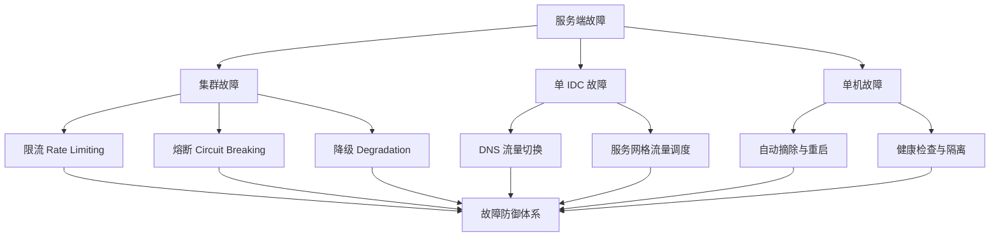
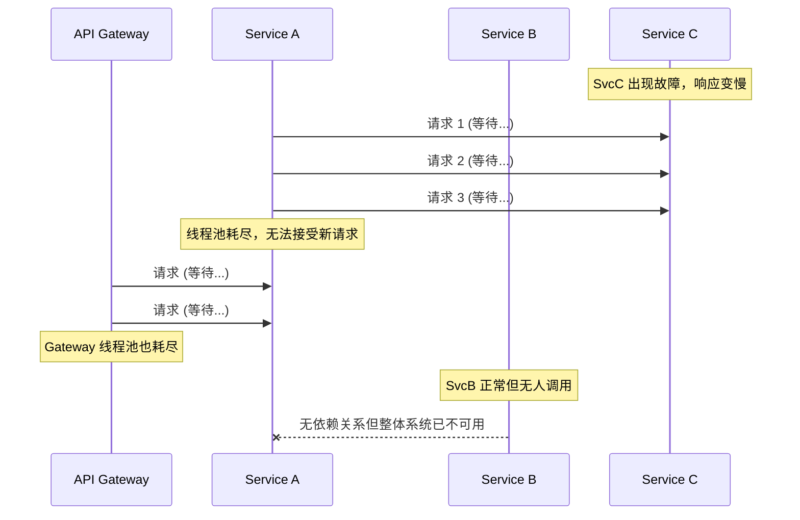
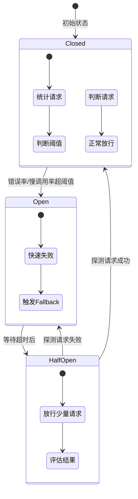
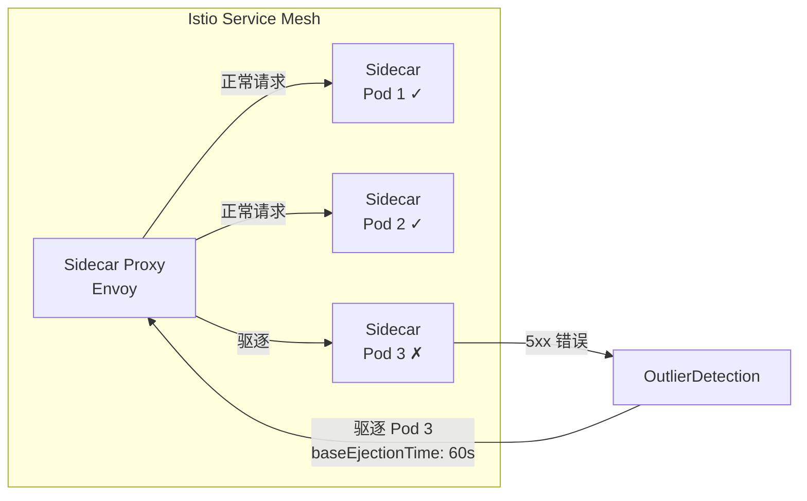
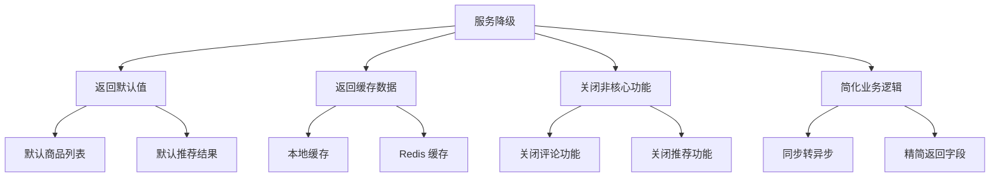
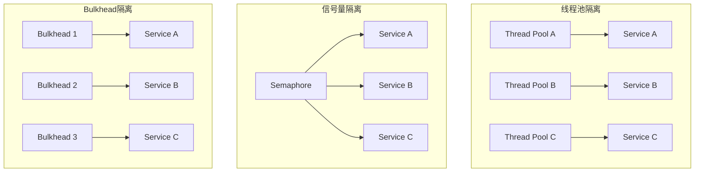
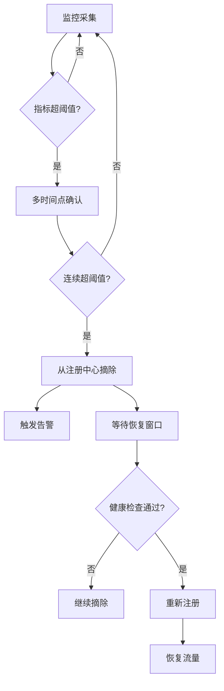
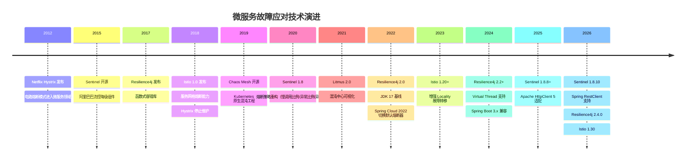
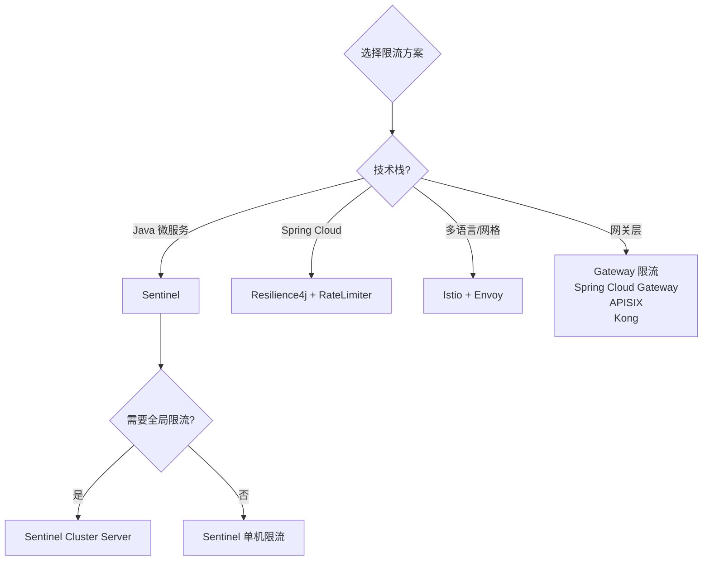
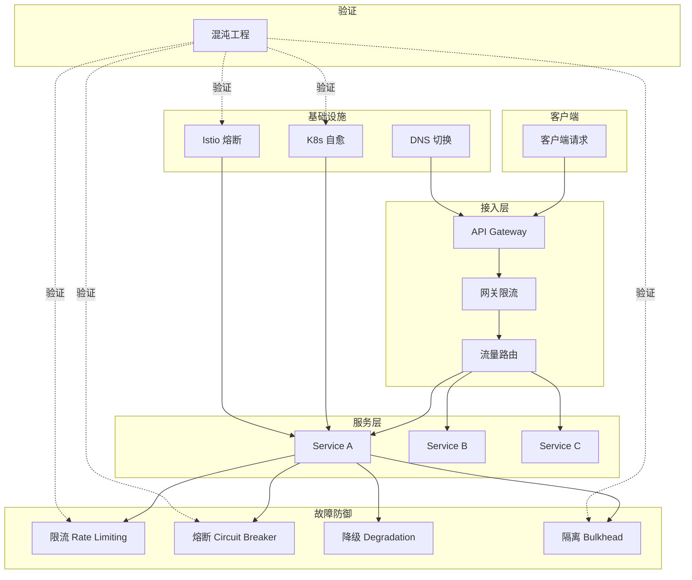

# 服务端出现故障时该如何应对

> 前置知识：[[09]] 微服务治理的手段有哪些 中我们讨论了微服务治理的基本手段，本文将深入故障场景，系统讲解如何从限流、熔断、降级、隔离到混沌工程，构建完整的故障防御体系。

## 概述

微服务架构将单体应用拆分为多个独立服务，故障影响范围从"整个应用崩溃"缩小为"单个服务不可用"——这是架构层面的进步。但随之而来的问题是：服务间存在复杂的调用依赖，一个服务的故障可能通过调用链向上游传播，引发**级联故障（Cascading Failure）**，最终导致整个系统雪崩。

Netflix 曾公开复盘过一次典型的级联故障：一次看似普通的缓存服务超时，最终导致全站大部分请求失败。这类事件的根源不在于故障本身，而在于**缺乏系统化的故障应对机制**。

本文将从故障分类出发，逐一讲解限流、熔断、降级、隔离、流量调度等核心手段，并结合 Sentinel 1.8+、Resilience4j 2.x、Istio 1.22+ 等主流框架的实践，给出架构决策指南。



## 一、故障分类与影响分析

微服务系统面临的故障可以从影响范围和持续时间两个维度来分类：

| 故障类型 | 影响范围 | 持续时间 | 发生频率 | 典型原因 |
|---------|---------|---------|---------|---------|
| 集群故障 | 整个服务集群 | 分钟~小时 | 中 | 代码 Bug（OOM、死锁）、突发流量 |
| 单 IDC 故障 | 整个机房 | 分钟~天 | 低 | 光缆中断、机房断电、自然灾害 |
| 单机故障 | 个别实例 | 秒~分钟 | 高 | 磁盘故障、GC 停顿、进程崩溃 |
| 依赖故障 | 下游服务 | 秒~小时 | 中 | 第三方 API 异常、数据库慢查询 |

> 原文聚焦前三类故障。2025 年的实践中，**依赖故障**因其级联传播特性已成为微服务故障的首要来源，需要重点关注。

### 故障传播的级联效应



上图展示了经典的级联故障场景：SvcC 故障导致 SvcA 线程池耗尽，进而影响 Gateway，最终整个系统瘫痪——即使 SvcB 完全正常也无法提供服务。这就是为什么我们需要**熔断**和**隔离**机制来切断故障传播链。

## 二、集群故障应对：限流

限流是保护集群的第一道防线。当真实流量超过系统最大承载能力时，超出的请求将被自动拒绝，确保系统在容量范围内稳定运行。

### 2.1 限流维度与算法

现代限流体系需要从多个维度进行控制：

| 限流维度 | 说明 | 典型阈值 |
|---------|------|---------|
| 全局限流 | 系统整体 QPS/并发数 | 集群容量 × 安全系数 |
| 服务级限流 | 单个服务的 QPS/并发数 | 服务容量 × 安全系数 |
| 接口级限流 | 单个 API 的 QPS/并发数 | 接口容量 × 安全系数 |
| 用户级限流 | 单个用户/租户的 QPS | 防刷策略 |
| 热点参数限流 | 按参数值（如商品 ID）限流 | 防止热点 Key 打穿缓存 |

核心限流算法的演进：

| 算法 | 原理 | 优点 | 缺点 | 适用场景 |
|-----|------|------|------|---------|
| 固定窗口计数器 | 固定时间窗口内计数 | 实现简单 | 临界点突发流量 | 低精度要求 |
| 滑动窗口计数器 | 窗口随时间滑动 | 解决临界问题 | 内存开销较大 | 一般场景 |
| 漏桶（Leaky Bucket） | 恒定速率处理请求 | 流量平滑 | 无法应对突发 | 流量整形 |
| 令牌桶（Token Bucket） | 恒定速率放入令牌 | 允许适度突发 | 实现复杂 | 大多数场景 |
| 自适应限流 | 根据系统指标动态调整 | 无需手动配置 | 调参复杂 | 云原生场景 |

### 2.2 Sentinel 限流实战

Sentinel 是阿里巴巴开源的流量治理组件，最新版本 1.8.10（2026-05 发布），支持流控、熔断、系统保护、热点限流等多种规则。

```java
// Sentinel 1.8+ 流控规则
FlowRule flowRule = new FlowRule()
    .setResource("orderService.createOrder")
    .setGrade(RuleConstant.FLOW_GRADE_QPS)   // QPS 限流
    .setCount(1000)                           // 阈值 1000 QPS
    .setControlBehavior(RuleConstant.CONTROL_BEHAVIOR_WARM_UP)  // 预热模式
    .setWarmUpPeriodSec(10);                  // 预热时长 10s

// 线程数限流 —— 更适合微服务场景
FlowRule threadRule = new FlowRule("orderService.createOrder")
    .setGrade(RuleConstant.FLOW_GRADE_THREAD) // 线程数限流
    .setCount(200);                           // 最大并发线程数 200

// 热点参数限流 —— 针对特定参数值限流
ParamFlowRule hotRule = new ParamFlowRule("orderService.queryOrder")
    .setParamIdx(0).setCount(50)
    .setGrade(RuleConstant.FLOW_GRADE_QPS);
hotRule.setParamFlowItemList(Collections.singletonList(
    new ParamFlowItem().setObject("12345").setClassType(int.class.getName()).setCount(500)
));
```

**自适应系统保护**——根据系统负载动态调整限流阈值：

```java
// Sentinel 自适应系统保护
SystemRule systemRule = new SystemRule();
systemRule.setHighestCpuUsage(0.8);   // CPU 使用率阈值 80%
systemRule.setAvgRt(500);             // 平均响应时间阈值 500ms
systemRule.setMaxThread(800);         // 最大并发线程数
systemRule.setQps(5000);              // 系统总 QPS 阈值
SystemRuleManager.loadRules(Collections.singletonList(systemRule));
```

### 2.3 分布式限流

单机限流在集群规模较大时存在偏差，分布式限流通过集中式计数器实现全局限流。典型方案是 Redis + Lua 脚本实现令牌桶：

```lua
-- Redis Lua 令牌桶限流脚本
local key = KEYS[1]
local capacity = tonumber(ARGV[1])   -- 桶容量
local rate = tonumber(ARGV[2])       -- 令牌填充速率
local now = tonumber(ARGV[3])        -- 当前时间戳（毫秒）
local requested = tonumber(ARGV[4])  -- 请求令牌数

local tokens_key = key .. ":tokens"
local timestamp_key = key .. ":ts"

local last_tokens = tonumber(redis.call("get", tokens_key)) or capacity
local last_refreshed = tonumber(redis.call("get", timestamp_key)) or now

local delta = math.max(0, now - last_refreshed)
local filled_tokens = math.min(capacity, last_tokens + (delta * rate / 1000))

local allowed = filled_tokens >= requested
if allowed then filled_tokens = filled_tokens - requested end

redis.call("set", tokens_key, filled_tokens)
redis.call("set", timestamp_key, now)
return { allowed and 1 or 0, filled_tokens }
```

## 三、集群故障应对：熔断

熔断器（Circuit Breaker）是防止级联故障的核心机制，灵感来源于电路中的保险丝——当电流过载时自动断开，保护整个电路系统。

### 3.1 熔断器状态机



熔断器三个核心状态：

| 状态 | 行为 | 转换条件 |
|-----|------|---------|
| **Closed**（关闭） | 正常放行所有请求，同时统计错误率 | 错误率/慢调用率超过阈值 → Open |
| **Open**（打开） | 快速失败，直接返回 Fallback | 超时等待后 → Half-Open |
| **Half-Open**（半开） | 放行少量探测请求 | 探测成功 → Closed；探测失败 → Open |

### 3.2 Sentinel 熔断降级

Sentinel 1.8+ 提供三种熔断策略：

```java
// Sentinel 1.8+ 熔断规则

// 策略一：慢调用比例
DegradeRule slowCallRule = new DegradeRule("orderService")
    .setGrade(CircuitBreakerStrategy.SLOW_REQUEST_RATIO.getType())
    .setCount(500)           // 慢调用临界 RT：500ms
    .setSlowRatioThreshold(0.6)  // 慢调用比例阈值：60%
    .setTimeWindow(30)       // 熔断持续时间：30s
    .setMinRequestAmount(10) // 最小请求数：10
    .setStatIntervalMs(10000); // 统计时长：10s

// 策略二：异常比例
DegradeRule errorRatioRule = new DegradeRule("orderService")
    .setGrade(CircuitBreakerStrategy.ERROR_RATIO.getType())
    .setCount(0.5)           // 异常比例阈值：50%
    .setTimeWindow(20)
    .setMinRequestAmount(5)
    .setStatIntervalMs(5000);

// 策略三：异常数
DegradeRule errorCountRule = new DegradeRule("orderService")
    .setGrade(CircuitBreakerStrategy.ERROR_COUNT.getType())
    .setCount(10)            // 异常数阈值：10
    .setTimeWindow(60)
    .setMinRequestAmount(5)
    .setStatIntervalMs(10000);

DegradeRuleManager.loadRules(
    Arrays.asList(slowCallRule, errorRatioRule, errorCountRule));
```

### 3.3 Resilience4j 熔断器实战

Resilience4j 是轻量级的容错库，专为函数式编程设计，已取代 Netflix Hystrix 成为 Spring Cloud 推荐的熔断方案。最新版本 2.4.0（2026-03 发布），支持 JDK 17+ 和 Virtual Thread。

```yaml
# Resilience4j 2.x 熔断器配置
resilience4j:
  circuitbreaker:
    configs:
      default:
        slidingWindowType: COUNT_BASED
        slidingWindowSize: 100
        minimumNumberOfCalls: 10
        failureRateThreshold: 50
        slowCallRateThreshold: 80
        slowCallDurationThreshold: 3s
        waitDurationInOpenState: 30s
        permittedNumberOfCallsInHalfOpenState: 5
        automaticTransitionFromOpenToHalfOpenEnabled: true
        recordExceptions:
          - java.io.IOException
          - java.util.concurrent.TimeoutException
    instances:
      orderService:
        baseConfig: default
        failureRateThreshold: 60
```

```java
// Resilience4j 2.x 编程式熔断
CircuitBreakerConfig config = CircuitBreakerConfig.custom()
    .slidingWindowSize(100)
    .failureRateThreshold(50.0f)
    .slowCallDurationThreshold(Duration.ofSeconds(3))
    .waitDurationInOpenState(Duration.ofSeconds(30))
    .permittedNumberOfCallsInHalfOpenState(5)
    .build();

CircuitBreaker circuitBreaker = CircuitBreaker.of("orderService", config);

// 使用熔断器包装调用，结合 Fallback
Supplier<Order> supplier = Decorators.ofSupplier(() -> orderService.getOrder(orderId))
    .withCircuitBreaker(circuitBreaker);

Order order = Try.ofSupplier(supplier)
    .recover(throwable -> Order.defaultOrder())
    .get();
```

### 3.4 Istio 服务网格熔断

Istio 在服务网格层面提供熔断能力，无需修改业务代码。通过 `DestinationRule` 的 `OutlierDetection` 配置实现：

**Istio 1.22+ OutlierDetection 配置**：

```yaml
# Istio OutlierDetection 熔断配置
apiVersion: networking.istio.io/v1beta1
kind: DestinationRule
metadata:
  name: order-service
spec:
  host: order-service.default.svc.cluster.local
  trafficPolicy:
    connectionPool:
      tcp:
        maxConnections: 100          # 最大连接数
      http:
        h2UpgradePolicy: DEFAULT
        http1MaxPendingRequests: 50  # 最大挂起请求数
        http2MaxRequests: 200        # 最大请求数
        maxRequestsPerConnection: 10 # 每连接最大请求数
    outlierDetection:
      consecutive5xxErrors: 5        # 连续 5xx 错误数
      interval: 30s                  # 检测间隔
      baseEjectionTime: 60s          # 基础驱逐时间
      maxEjectionPercent: 50         # 最大驱逐比例
      minHealthPercent: 25           # 最小健康实例比例
      consecutiveGatewayErrors: 3    # 连续网关错误数（Istio 1.22+）
```



### 3.5 三种熔断方案对比

| 特性 | Sentinel 1.8+ | Resilience4j 2.x | Istio OutlierDetection |
|-----|--------------|-------------------|----------------------|
| **实现层** | 应用层（SDK） | 应用层（SDK） | 基础设施层（Sidecar） |
| **语言支持** | Java 为主 | Java / JDK 17+ | 语言无关 |
| **熔断策略** | 慢调用比例、异常比例、异常数 | 失败率、慢调用率 | 连续错误、连续网关错误 |
| **限流能力** | 内置，功能丰富 | 需配合 RateLimiter | 需配合连接池配置 |
| **监控面板** | Sentinel Dashboard | Micrometer + Grafana | Kiali + Grafana |
| **动态规则** | Dashboard/配置中心推送 | Spring Cloud Config | Kubernetes CRD |
| **代码侵入** | 注解/API | 注解/函数式 | 零侵入 |
| **适用场景** | Java 微服务全栈 | Spring Cloud / 函数式 | 多语言 / 服务网格 |

## 四、集群故障应对：降级

降级是通过牺牲部分功能或服务质量来保障核心功能可用的策略。与熔断的自动触发不同，降级往往是有计划地主动执行。

### 4.1 降级策略分类



| 降级策略 | 原理 | 示例 | 对业务影响 |
|---------|------|------|-----------|
| 返回默认值 | 用预设值替代真实计算 | 推荐服务降级返回热门商品 | 低 |
| 返回缓存数据 | 用历史缓存替代实时数据 | 商品详情降级返回缓存 | 低~中 |
| 关闭非核心功能 | 开关控制功能启停 | 关闭评论、分享等非核心功能 | 中 |
| 简化业务逻辑 | 降低计算复杂度 | 搜索降级为全量匹配 | 中~高 |
| 写降级 | 同步写转异步写 | 下单降级为先写消息队列后落库 | 高 |

### 4.2 开关降级机制

原文中提到的开关降级机制至今仍是主流实践，但在实现上已从简单的内存开关演化为配置中心驱动的动态开关：

```java
// 基于 Nacos 配置中心的动态开关降级
@Configuration
@RefreshScope
public class DegradationConfig {
    @Value("${degradation.recommend.enabled:false}")
    private boolean recommendEnabled;

    @Value("${degradation.comment.enabled:false}")
    private boolean commentEnabled;
}

@Service
public class RecommendService {
    @Autowired private DegradationConfig config;
    @Autowired private RecommendClient client;

    public List<Product> getRecommendations(String userId) {
        if (config.isRecommendEnabled()) {
            return getDefaultHotProducts();  // 降级：返回默认热门商品
        }
        return client.getPersonalizedRecommendations(userId);
    }
}
```

### 4.3 Fallback 降级模式

Fallback 是熔断触发的降级，与开关降级的主动触发形成互补：

```java
// Sentinel Fallback 降级
@SentinelResource(value = "getOrder",
    fallback = "getOrderFallback",          // 异常降级
    blockHandler = "getOrderBlockHandler")  // 限流/熔断降级
public Order getOrder(String orderId) {
    return orderClient.getOrder(orderId);
}

public Order getOrderFallback(String orderId, Throwable t) {
    return Order.cachedOrder(orderId);  // 返回缓存数据
}

public Order getOrderBlockHandler(String orderId, BlockException ex) {
    return Order.defaultOrder();  // 返回默认值
}
```

```java
// Resilience4j 2.x Fallback
@CircuitBreaker(name = "orderService", fallbackMethod = "getOrderFallback")
@Bulkhead(name = "orderService", fallbackMethod = "getOrderFallback")
public Order getOrder(String orderId) {
    return orderClient.getOrder(orderId);
}

private Order getOrderFallback(String orderId, Throwable t) {
    return orderCacheService.getCachedOrder(orderId)
        .orElse(Order.defaultOrder());
}
```

### 4.4 降级分级体系

原文提出的降级分级思路仍然有效，但需要结合现代实践细化：

| 降级级别 | 触发方式 | 影响范围 | 典型场景 | 响应时间 |
|---------|---------|---------|---------|---------|
| **L1 自动降级** | 自动（熔断/Fallback） | 非核心功能 | 推荐降级为热门列表、搜索降级为简化模式 | 毫秒级 |
| **L2 半自动降级** | 配置中心开关 | 部分功能 | 关闭评论、关闭分享 | 秒级 |
| **L3 手动降级** | 人工决策 | 核心功能 | 关闭下单、写入转异步 | 分钟级 |
| **L4 紧急降级** | 运维介入 | 系统级 | 只读模式、限流至 10% | 分钟级 |

## 五、隔离策略：防止故障蔓延

隔离是故障防御体系中最容易被忽视但最关键的环节。即使有了熔断和限流，如果不做隔离，一个慢依赖依然可能耗尽调用方的全部资源。

### 5.1 隔离模式对比



| 隔离模式 | 原理 | 优点 | 缺点 | 适用场景 |
|---------|------|------|------|---------|
| **线程池隔离** | 每个依赖使用独立线程池 | 完全隔离，超时可控 | 线程切换开销大 | 远程调用、IO 密集 |
| **信号量隔离** | 计数器控制并发数 | 轻量，无线程开销 | 无法超时中断 | 本地调用、CPU 密集 |
| **Bulkhead 隔离** | 限制每个依赖的并发数 | 轻量且语义清晰 | 需合理配置配额 | 通用场景 |

### 5.2 Sentinel 隔离

Sentinel 通过线程数限流实现信号量级别的隔离：

```java
// Sentinel 线程数限流 —— 实现信号量隔离
FlowRule isolationRule = new FlowRule("orderService")
    .setGrade(RuleConstant.FLOW_GRADE_THREAD)  // 按并发线程数
    .setCount(50);                             // 最大并发线程数 50

// 为不同依赖设置不同的线程数上限
FlowRule dependencyA = new FlowRule("inventoryService")
    .setGrade(RuleConstant.FLOW_GRADE_THREAD)
    .setCount(30);

FlowRule dependencyB = new FlowRule("paymentService")
    .setGrade(RuleConstant.FLOW_GRADE_THREAD)
    .setCount(20);
```

### 5.3 Resilience4j Bulkhead

Resilience4j 2.x 提供信号量 Bulkhead 和线程池 Bulkhead 两种实现：

```yaml
# Resilience4j 2.x Bulkhead 配置
resilience4j:
  bulkhead:
    instances:
      orderService:
        maxConcurrentCalls: 30       # 最大并发调用数
        maxWaitDuration: 50ms        # 最大等待时间
  thread-pool-bulkhead:
    instances:
      inventoryService:
        maxThreadPoolSize: 15        # 最大线程数
        coreThreadPoolSize: 8        # 核心线程数
        queueCapacity: 30            # 队列容量
```

```java
// 组合使用：Bulkhead + CircuitBreaker + RateLimiter
Supplier<Order> supplier = Decorators.ofSupplier(() -> orderService.getOrder(orderId))
    .withBulkhead(bulkhead)
    .withCircuitBreaker(circuitBreaker)
    .withRateLimiter(rateLimiter);

Order order = Try.ofSupplier(supplier)
    .recover(throwable -> Order.defaultOrder())
    .get();
```

## 六、单 IDC 故障应对：流量调度

单 IDC 故障虽然发生概率较低，但一旦发生影响巨大。现代架构通过多可用区部署和智能流量调度来应对。

### 6.1 DNS 流量切换

原文提到的 DNS 流量切换方案仍然有效，但在 2025 年的实践中有了显著改进：

| 技术演进 | 传统方案 | 现代方案 |
|---------|---------|---------|
| DNS 解析 | 基于 VIP 手动切换 | 基于 GeoDNS / Anycast 自动切换 |
| 切换速度 | 分钟级（TTL 限制） | 秒级（结合 HTTP 302 重定向） |
| 健康检查 | 人工判断 | 自动探测 + 自动切换 |
| 典型工具 | BIND + 自研脚本 | AWS Route53 / Cloudflare / 阿里云 DNS |

### 6.2 服务网格流量调度

在 Istio 服务网格中，可以通过 `VirtualService` 和 `DestinationRule` 实现精细的流量调度：

```yaml
# Istio 多区域流量调度 + Locality 故障转移
apiVersion: networking.istio.io/v1beta1
kind: DestinationRule
metadata:
  name: order-service
spec:
  host: order-service
  trafficPolicy:
    loadBalancer:
      localityLbSetting:
        enabled: true
        failover:
          - { from: cn-beijing-a, to: cn-beijing-b }
          - { from: cn-beijing-b, to: cn-beijing-a }
    outlierDetection:
      consecutive5xxErrors: 3
      interval: 10s
      baseEjectionTime: 30s
      maxEjectionPercent: 100
  subsets:
    - name: az-a
      labels: { topology.kubernetes.io/zone: cn-beijing-a }
    - name: az-b
      labels: { topology.kubernetes.io/zone: cn-beijing-b }
```

### 6.3 多活架构对比

| 架构模式 | 部署方式 | RTO | 数据一致性 | 成本 | 典型案例 |
|---------|---------|-----|-----------|------|---------|
| 同城双活 | 同城 2 个 IDC | 分钟级 | 强一致 | 中 | 大部分互联网公司 |
| 异地双活 | 异地 2 个 IDC | 分钟级 | 最终一致 | 高 | 字节跳动 |
| 三地五中心 | 3 城市 5 个 IDC | 秒级 | 强一致 | 极高 | 支付宝 |
| 单元化架构 | 按用户分片到单元 | 秒级 | 单元内强一致 | 高 | 蚂蚁集团 |

## 七、单机故障应对：自动摘除与恢复

单机故障是最常见的故障类型，必须实现自动化处理。

### 7.1 自动摘除机制

原文提到的"自动重启"策略在实践中已演进为更精细的"自动摘除 + 健康恢复"机制：



关键设计要点：

| 要点 | 原文方案 | 现代实践 |
|-----|---------|---------|
| 指标采集 | 10s 采一个点，采 5 个点 | 基于 Sliding Window 的实时统计 |
| 阈值判断 | 5 点中 3 点超阈值 | 百分位延迟（P99）+ 错误率双指标 |
| 摘除比例 | 不超过集群 10% | 动态计算，结合最小可用实例数 |
| 恢复机制 | 重启后重新加入 | 渐进式流量恢复（warm-up） |
| 摘除方式 | 手动/脚本 | 注册中心自动摘除 + Istio OutlierDetection |

### 7.2 Kubernetes 环境下的自愈

在 Kubernetes 环境中，单机故障的处理由基础设施层自动完成：

```yaml
# Kubernetes Liveness / Readiness Probe
apiVersion: apps/v1
kind: Deployment
metadata:
  name: order-service
spec:
  replicas: 10
  template:
    spec:
      containers:
        - name: order-service
          image: order-service:2.0.0
          livenessProbe:
            httpGet:
              path: /actuator/health/liveness
              port: 8080
            initialDelaySeconds: 60
            periodSeconds: 10
            failureThreshold: 3           # 连续 3 次失败则重启
          readinessProbe:
            httpGet:
              path: /actuator/health/readiness
              port: 8080
            initialDelaySeconds: 30
            periodSeconds: 5
            failureThreshold: 3           # 连续 3 次失败则摘除流量
```

## 八、混沌工程：主动验证故障防御能力

前面讲的都是被动防御——故障发生后再应对。混沌工程则是**主动注入故障**，验证系统的故障防御能力是否真正有效。

### 8.1 混沌工程核心原则

1. **建立稳态假设**：定义系统正常运行的指标基线
2. **引入真实故障变量**：模拟实际可能发生的故障
3. **观察系统行为**：对比故障注入前后的指标变化
4. **学习与改进**：根据实验结果加固系统

### 8.2 Chaos Mesh 实践

Chaos Mesh 是 CNCF 孵化项目，支持在 Kubernetes 环境中注入网络、磁盘、Pod、HTTP 等多种故障：

```yaml
# Chaos Mesh 网络延迟注入
apiVersion: chaos-mesh.org/v1alpha1
kind: NetworkChaos
metadata:
  name: order-service-delay
  namespace: chaos-testing
spec:
  action: delay
  mode: one
  selector:
    namespaces: [production]
    labelSelectors: { app: order-service }
  delay:
    latency: "500ms"
    jitter: "100ms"
  duration: "5m"
---
# Chaos Mesh Pod 故障注入
apiVersion: chaos-mesh.org/v1alpha1
kind: PodChaos
metadata:
  name: order-service-pod-failure
  namespace: chaos-testing
spec:
  action: pod-failure
  mode: fixed-percent
  value: "10"               # 影响 10% 的 Pod
  selector:
    namespaces: [production]
    labelSelectors: { app: order-service }
  duration: "3m"
```

### 8.3 Litmus 实践

Litmus 是另一个 CNCF 孵化项目，提供更丰富的混沌实验目录：

```yaml
# Litmus ChaosEngine 配置
apiVersion: litmuschaos.io/v1alpha1
kind: ChaosEngine
metadata:
  name: order-service-chaos
  namespace: chaos-testing
spec:
  appinfo:
    appns: production
    applabel: "app=order-service"
  chaosServiceAccount: litmus-admin
  experiments:
    - name: pod-network-latency
      spec:
        components:
          env:
            - { name: TOTAL_CHAOS_DURATION, value: "60" }
            - { name: LATENCY, value: "500" }
    - name: pod-delete
      spec:
        components:
          env:
            - { name: TOTAL_CHAOS_DURATION, value: "30" }
            - { name: CHAOS_INTERVAL, value: "10" }
```

### 8.4 混沌工程工具对比

| 特性 | Chaos Mesh | Litmus | Gremlin |
|-----|-----------|--------|---------|
| **开源** | 是（CNCF 孵化） | 是（CNCF 孵化） | 否（商业） |
| **Kubernetes 原生** | 是 | 是 | 是 |
| **故障类型** | 网络/磁盘/Pod/HTTP/Stress | 网络/Pod/容器/节点 | 全类型 |
| **可视化面板** | Dashboard | ChaosCenter | Web UI |
| **调度能力** | Workflow（串联实验） | ChaosWorkflow | Schedule |
| **安全控制** | RBAC + Namespace 隔离 | RBAC + ServiceAccount | SSO + RBAC |
| **CI/CD 集成** | GitHub Actions 插件 | GitHub Actions 插件 | 全平台 |
| **适用场景** | Kubernetes 深度用户 | 多样化混沌场景 | 企业级全栈 |

## 九、技术演进时间线



## 十、架构决策指南

### 10.1 限流方案选择



### 10.2 熔断方案选择

| 决策因素 | Sentinel | Resilience4j | Istio |
|---------|----------|-------------|-------|
| 只用 Java | 首选 | 首选 | 过重 |
| 多语言团队 | 不适合 | 不适合 | 首选 |
| 需要精细化控制 | 首选 | 适合 | 有限 |
| 不想改代码 | 不适合 | 不适合 | 首选 |
| 已有 Spring Cloud | 适合 | 首选 | 可叠加 |
| 已有 Dubbo | 首选 | 不适合 | 可叠加 |

### 10.3 故障防御体系全景图



### 10.4 组合策略速查表

| 故障场景 | 首选策略 | 补充策略 | 自动化程度 |
|---------|---------|---------|-----------|
| 突发流量超限 | 限流 | 降级（L1） | 全自动 |
| 下游服务超时 | 熔断 | 隔离 + Fallback | 全自动 |
| 下游服务错误率升高 | 熔断 | 降级 + 缓存 | 全自动 |
| 单机性能劣化 | 自动摘除 | K8s 重启 | 全自动 |
| 单 IDC 故障 | DNS/流量切换 | 降级（L2） | 半自动 |
| 依赖服务宕机 | 熔断 + Fallback | 降级（L2-L3） | 半自动 |
| 核心数据库故障 | 降级（L3-L4） | 限流 + 只读 | 手动 |

## 小结

本文系统讲解了微服务故障应对的完整体系：

1. **故障分类**：集群故障、单 IDC 故障、单机故障、依赖故障，不同类型需要不同的应对策略。

2. **限流**：保护系统的第一道防线。Sentinel 1.8+ 提供了丰富的限流维度（QPS、线程数、热点参数）和自适应系统保护；分布式限流通过 Redis + Lua 实现全局限流。

3. **熔断**：防止级联故障的核心机制。Sentinel 的三种熔断策略（慢调用比例、异常比例、异常数）、Resilience4j 2.x 的函数式熔断器、Istio 的 OutlierDetection，分别适用于不同场景。

4. **降级**：牺牲非核心功能保障核心可用。从 Fallback 自动降级到开关手动降级，需要分级管理。

5. **隔离**：Bulkhead 隔离是防止故障蔓延的关键。线程池隔离适用于远程调用，信号量隔离适用于本地调用，Resilience4j 2.x 两者都支持。

6. **流量调度**：多 IDC/多可用区部署结合 DNS 切换或服务网格流量调度，实现跨区域容灾。Istio 1.22+ 的 Locality 故障转移提供了基础设施层面的自动切换能力。

7. **混沌工程**：从被动防御走向主动验证。Chaos Mesh 和 Litmus 让我们能够在生产环境中安全地注入故障，验证系统的故障防御能力。

> 原文中强调的"尽量让故障处理自动化"在今天依然是最重要的原则。区别在于，2025 年的自动化已经从简单的脚本和阈值判断，演进为基于服务网格的自适应熔断、基于 Kubernetes 的自愈机制、以及基于混沌工程的持续验证。故障应对不是一个配置项，而是一个持续演进的体系。

## 思考题

1. 在服务网格架构下，应用层熔断（如 Sentinel/Resilience4j）和基础设施层熔断（如 Istio OutlierDetection）是否需要同时使用？如果同时使用，如何避免两者的冲突？

2. 混沌工程实验可能会对生产环境造成真实影响，你如何设计一个安全的混沌工程实验流程，既能有效验证系统韧性，又能将风险控制在可接受范围内？


