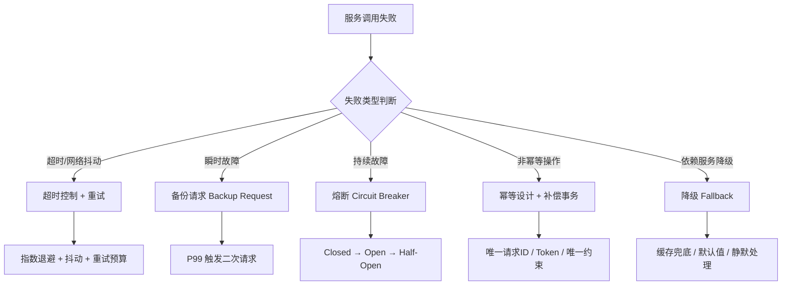
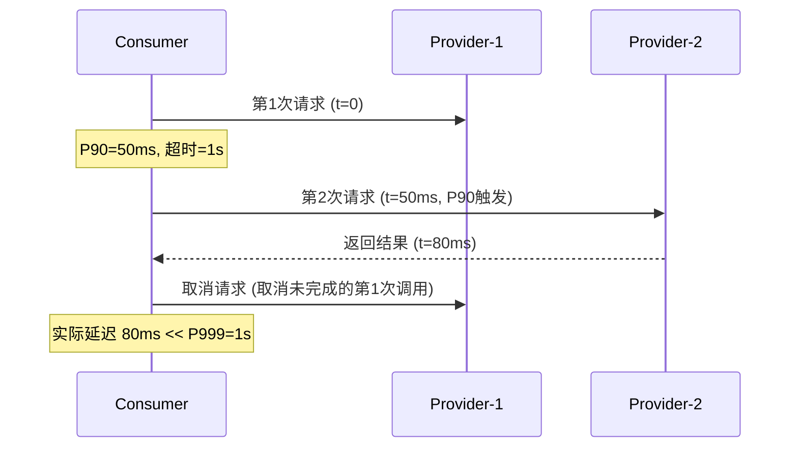
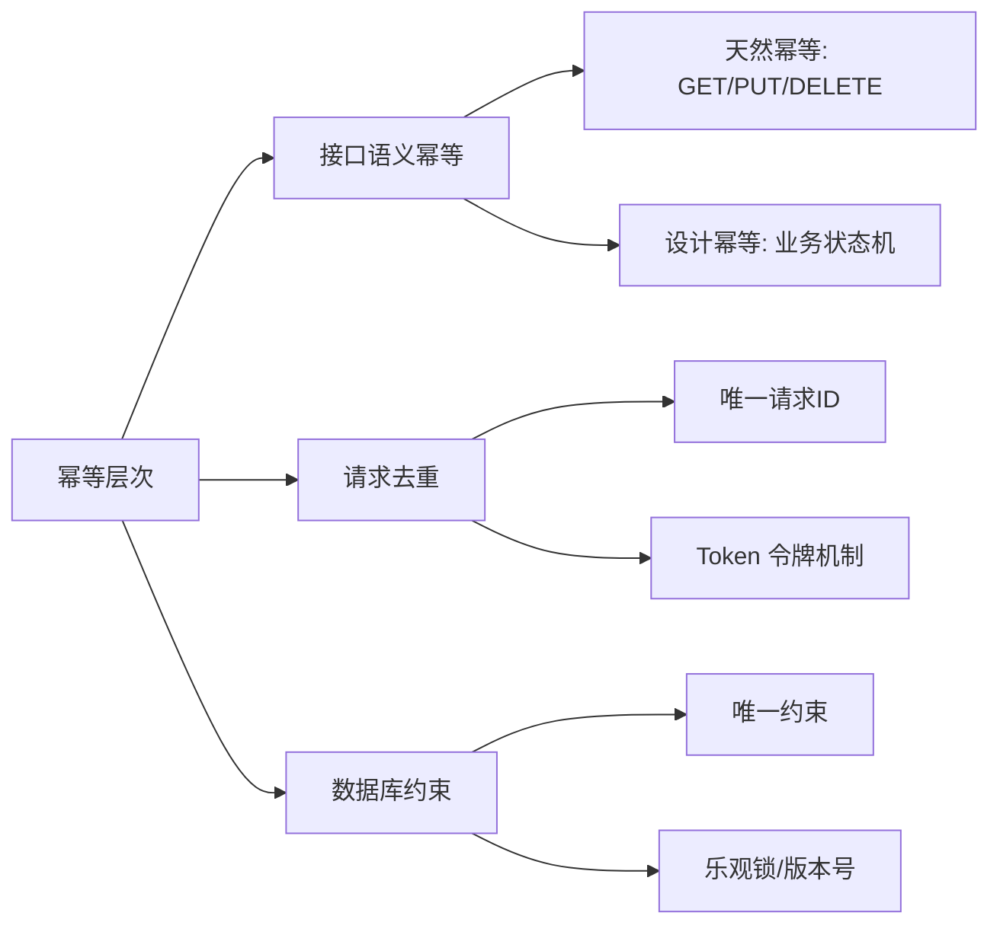
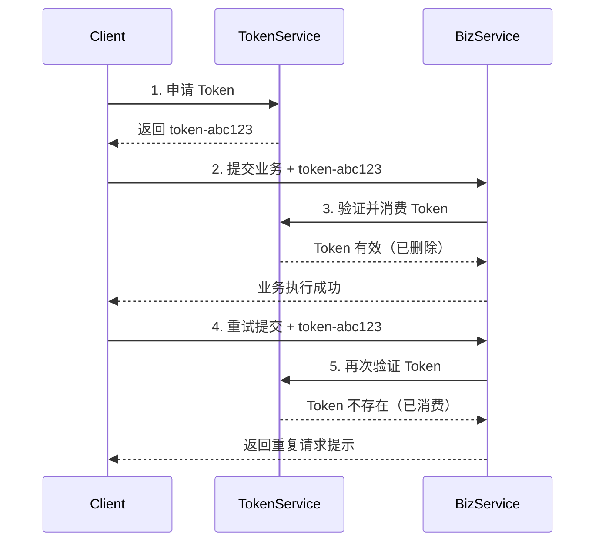
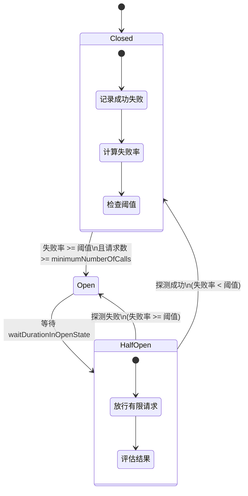
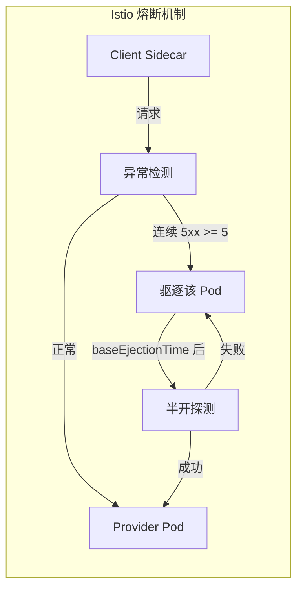
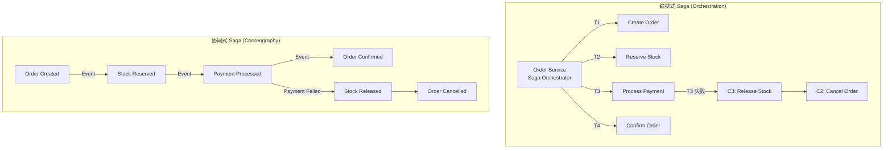
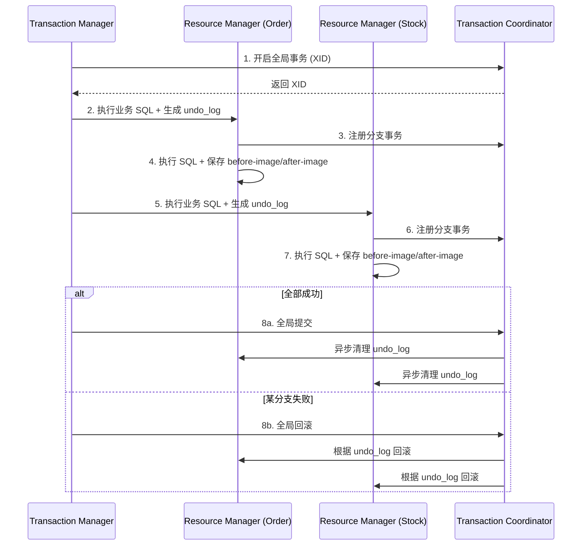
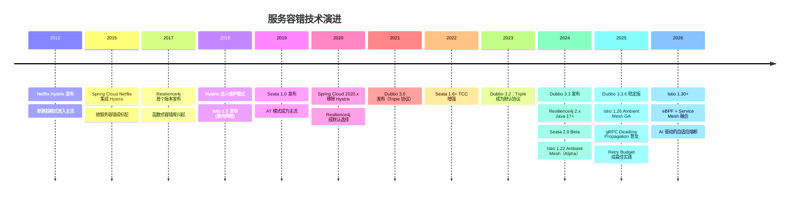
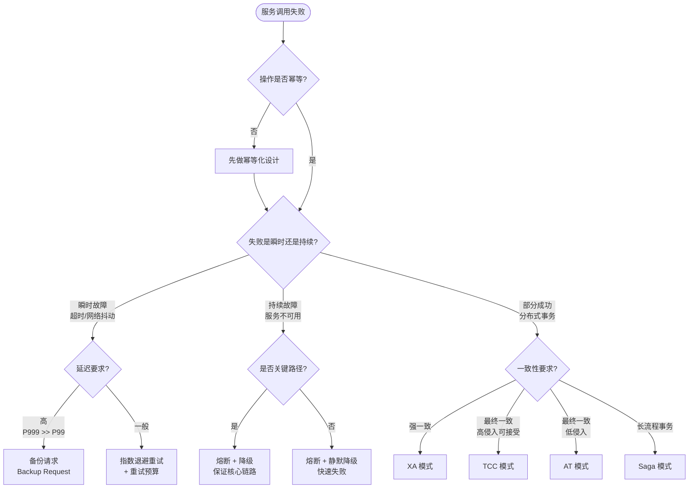

# 服务调用失败时有哪些处理手段

> 前置知识：[[09]] 微服务治理的手段有哪些？ · [[20]] 服务端出现故障时该如何应对？
> 版本基线：Dubbo 3.3+ | Seata 2.x | Istio 1.22+ | Resilience4j 2.x | gRPC 1.60+

微服务架构将单体应用中的本地方法调用变成了跨网络的远程过程调用（RPC），这一变化引入了两个根本性的不确定因素：

- **执行端不可控**：服务提供者可能因硬件故障（CPU 飙升、磁盘 I/O 饱和、内存溢出）、软件缺陷（GC 停顿、线程池耗尽、死锁）或依赖链路异常而无法正常响应。
- **传输链路不可控**：网络丢包、延迟抖动、路由切换、连接池耗尽等网络层面的不确定性，随时可能导致调用失败。

单体架构下的一次本地调用，在微服务中被拆解为多个串联甚至网状的远程调用。任何一环失败，都可能导致整个请求链路失败。更危险的是，如果没有合理的容错机制，一个服务的故障会沿着调用链向上游传播，最终引发**级联故障（Cascading Failure）**甚至**雪崩（Avalanche）**。

本文将从**超时控制、重试策略、幂等设计、熔断与限流、补偿事务**五个维度，系统梳理服务调用失败的处理手段，并结合 2025-2026 年主流技术栈的最新实践给出架构决策指南。



---

## 一、超时控制（Timeout）

### 1.1 为什么超时是第一道防线

在微服务调用链中，一个慢响应的危害远大于一个快速失败。慢响应会持续占用调用方的线程、连接和内存资源，当大量请求堆积时，消费者自身也会被拖垮。因此，**设置合理的超时时间是服务容错的第一道防线**。

### 1.2 超时时间的设定策略

超时时间不是越短越好，也不是越长越好：

- **过短**：正常慢请求被误杀，导致不必要的重试，放大后端压力。
- **过长**：消费者资源被长时间占用，降低系统吞吐能力。

推荐做法是**基于服务提供者的线上 SLI（Service Level Indicator）来设定**：

| 指标 | 含义 | 适用场景 |
|------|------|----------|
| P90 | 90% 请求在此时间内返回 | 备份请求触发时间 |
| P99 | 99% 请求在此时间内返回 | 常规超时设定 |
| P999 | 99.9% 请求在此时间内返回 | 关键路径超时设定 |

一般取 P999 或 P9999 作为超时阈值。例如某服务的 P999 为 1s，则超时设为 1s，意味着只有 0.1% 的请求会因超时被中断。

### 1.3 gRPC Deadline Propagation

在 gRPC 协议中，超时通过 **Deadline** 机制实现，并且天然支持 **Deadline Propagation（截止时间传播）**——当 A 调用 B、B 再调用 C 时，A 设置的 Deadline 会自动传递给 B，B 再传递给 C。每个下游服务根据剩余时间决定是否继续处理，避免在已经不可能成功的情况下浪费资源。

```protobuf
// gRPC Deadline Propagation 示意 (gRPC 1.60+)
// 客户端设置 500ms 超时
ManagedChannel channel = ManagedChannelBuilder
    .forAddress("service-b", 9090)
    .build();

OrderServiceGrpc.OrderServiceBlockingStub stub =
    OrderServiceGrpc.newBlockingStub(channel)
        .withDeadlineAfter(500, TimeUnit.MILLISECONDS);

// Deadline 自动传播到下游 service-c
// service-c 根据 context 中的剩余时间决定是否继续处理
```

### 1.4 Dubbo 3.3 超时配置

Dubbo 3.3 支持多粒度的超时配置，优先级从高到低为：方法级 > 接口级 > 全局默认。

```yaml
# Dubbo 3.3 超时配置 (application.yml)
dubbo:
  consumer:
    timeout: 3000          # 全局默认超时 3s
    check: false
  service:
    timeout: 5000          # 服务级超时
  method:
    createUser:
      timeout: 1000        # 方法级超时（优先级最高）
    queryUser:
      timeout: 2000
```

### 1.5 Istio 服务网格超时

在 Service Mesh 架构下，超时可以在数据面（Sidecar）层面统一配置，无需修改应用代码：

```yaml
# Istio 1.22+ VirtualService 超时配置
apiVersion: networking.istio.io/v1beta1
kind: VirtualService
metadata:
  name: order-service
spec:
  hosts:
    - order-service
  http:
    - route:
        - destination:
            host: order-service
      timeout: 3s           # 全局超时 3s
    - match:
        - uri:
            prefix: /api/v1/orders/create
      route:
        - destination:
            host: order-service
      timeout: 1s           # 特定路径超时 1s
```

> **关键演进**：在传统微服务框架中，超时由应用代码或框架配置控制；在 Service Mesh 架构下，超时成为基础设施层的能力，由 Sidecar Proxy 统一执行。两种模式可以叠加使用——应用层设粗粒度兜底，Mesh 层设细粒度控制。

---

## 二、重试策略（Retry）

### 2.1 重试的数学基础

假设单次调用失败率为 $p$，重试 $n$ 次后的失败率为 $p^n$。当 $p = 1\%$ 时：

| 重试次数 | 失败率 | 成功率提升 |
|----------|--------|-----------|
| 0 | 1.00% | 基线 |
| 1 | 0.01% | 100x |
| 2 | 0.0001% | 10000x |

但重试是一把双刃剑——在服务端真正故障时，重试会放大请求量，加剧故障。

### 2.2 指数退避与抖动（Exponential Backoff with Jitter）

固定间隔重试存在"惊群效应"（Thundering Herd）：多个客户端同时重试，导致服务端瞬间承受脉冲式流量。**指数退避**让每次重试的等待时间逐步增加，而**抖动**则在退避基础上加入随机性，避免多个客户端同步重试。

```java
// 指数退避 + 抖动算法 (Java 17+)
public class RetryPolicy {
    private static final long BASE_DELAY_MS = 100;
    private static final long MAX_DELAY_MS = 10_000;
    private static final double JITTER_RATE = 0.5;
    private final SecureRandom random = new SecureRandom();

    public long computeDelay(int attempt) {
        long exponentialDelay = (long) Math.min(
            MAX_DELAY_MS,
            BASE_DELAY_MS * Math.pow(2, attempt)
        );
        // 加入抖动：延迟在 [exponentialDelay * (1-JITTER_RATE), exponentialDelay] 之间
        long jitteredDelay = (long) (exponentialDelay *
            (1 - JITTER_RATE + random.nextDouble() * JITTER_RATE));
        return jitteredDelay;
    }
}
```

### 2.3 重试预算（Retry Budget）

单纯的退避策略无法限制重试请求的总量。2025 年业界最佳实践引入了**重试预算（Retry Budget）**概念——限制重试请求占总请求的比例上限，确保重试不会压垮服务端。

```yaml
# Istio 1.22+ 重试策略 + 重试预算
apiVersion: networking.istio.io/v1beta1
kind: VirtualService
metadata:
  name: order-service
spec:
  hosts:
    - order-service
  http:
    - route:
        - destination:
            host: order-service
      retries:
        attempts: 3
        perTryTimeout: 1s
        retryOn: 5xx,reset,connect-failure,refused-stream
      # Envoy 层面可通过 cluster 配置 retry_budget
```

```yaml
# Envoy Retry Budget 配置
retry_policy:
  retry_back_off:
    base_interval: 0.1s
    max_interval: 10s
  retry_budget:
    budget_percent:
      numerator: 20      # 重试请求占比不超过 20%
      denominator: HUNDRED
    min_retry_concurrency: 3  # 至少允许 3 个并发重试
```

### 2.4 备份请求（Backup Requests）

备份请求是"聪明的双发"——不等超时再重试，而是在 P99 或 P90 时间点提前发出第二次请求：



备份请求的核心参数：

| 参数 | 推荐值 | 说明 |
|------|--------|------|
| 触发时间 | P99 或 P90 | 在长尾延迟前提前发出备份请求 |
| 最大重试比例 | 15% | 避免服务端故障时请求量翻倍 |
| 适用场景 | 读多写少、P999 远大于 P99 | 对长尾请求效果显著 |

### 2.5 重试的前提：可重试 vs 不可重试

并非所有请求都适合重试：

| 类型 | 可否重试 | 示例 |
|------|----------|------|
| 幂等读操作 | 可重试 | GET /user/{id} |
| 幂等写操作 | 可重试 | PUT /user/{id}（全量替换） |
| 非幂等写操作 | 不可重试 | POST /orders（创建订单） |
| 非幂等写操作（幂等化后） | 可重试 | POST /orders + Idempotency-Key |

---

## 三、幂等设计（Idempotency）

重试的前提是被重试的操作是幂等的——即同一操作执行一次与执行多次的效果相同。对于非幂等操作，必须先进行幂等化设计，才能安全地重试。

### 3.1 幂等的层次



### 3.2 唯一请求 ID（Idempotency Key）

最通用的幂等方案：每个请求携带全局唯一的 Idempotency-Key，服务端记录已处理的 Key，重复请求直接返回缓存结果。

```java
// 幂等 Key 方案 (Spring Boot 3.x + Redis)
@Service
public class OrderService {

    @Autowired
    private RedisTemplate<String, String> redisTemplate;

    public OrderResult createOrder(CreateOrderRequest request) {
        String idempotencyKey = request.getIdempotencyKey();

        // 1. 尝试获取幂等锁（SETNX + 过期时间）
        Boolean acquired = redisTemplate.opsForValue()
            .setIfAbsent("idempotent:" + idempotencyKey,
                         "processing",
                         Duration.ofMinutes(30));

        if (Boolean.FALSE.equals(acquired)) {
            // 2. Key 已存在，查询并返回已有结果
            String existingResult = redisTemplate.opsForValue()
                .get("idempotent:result:" + idempotencyKey);
            return deserializeResult(existingResult);
        }

        // 3. 执行业务逻辑
        OrderResult result = doCreateOrder(request);

        // 4. 存储结果并更新状态
        redisTemplate.opsForValue()
            .set("idempotent:result:" + idempotencyKey,
                 serializeResult(result),
                 Duration.ofMinutes(30));
        redisTemplate.opsForValue()
            .set("idempotent:" + idempotencyKey,
                 "completed",
                 Duration.ofMinutes(30));

        return result;
    }
}
```

### 3.3 Token 令牌机制

Token 机制是"预分配式"幂等方案：客户端先向服务端申请一个一次性 Token，后续请求携带该 Token，服务端验证 Token 的有效性后执行操作并销毁 Token。



### 3.4 数据库唯一约束

最可靠的幂等保障，利用数据库的唯一约束来防止重复插入：

```sql
-- 唯一约束幂等方案
CREATE TABLE orders (
    id BIGINT PRIMARY KEY AUTO_INCREMENT,
    order_no VARCHAR(64) UNIQUE,     -- 业务唯一键，防止重复创建
    user_id BIGINT NOT NULL,
    amount DECIMAL(10, 2),
    status VARCHAR(32),
    created_at TIMESTAMP DEFAULT CURRENT_TIMESTAMP
);

-- 插入时利用唯一约束防重
INSERT INTO orders (order_no, user_id, amount, status)
VALUES ('ORD-20250609-001', 12345, 99.99, 'CREATED')
ON DUPLICATE KEY UPDATE status = status;  -- MySQL 8.0+
```

### 3.5 三种幂等方案对比

| 方案 | 实现复杂度 | 可靠性 | 性能影响 | 适用场景 |
|------|-----------|--------|----------|----------|
| 唯一请求 ID | 中 | 高（依赖存储） | 低（需查询） | 通用场景，推荐首选 |
| Token 令牌 | 高 | 高 | 中（两次 RPC） | 对安全性要求高的场景 |
| 数据库唯一约束 | 低 | 最高 | 低 | 数据库操作场景 |
| 业务状态机 | 中 | 高 | 低 | 有明确状态流转的场景 |

---

## 四、熔断与限流（Circuit Breaker & Rate Limiting）

### 4.1 从 Hystrix 到 Resilience4j：熔断器的演进

Netflix Hystrix 于 2018 年进入维护模式，2021 年正式停止维护。其继任者是 **Resilience4j**——一个轻量级、函数式的容错库，专为 Java 17+ 和函数式编程设计。

| 维度 | Hystrix（已停维） | Resilience4j 2.x |
|------|------------------|-------------------|
| 编程模型 | 继承 HystrixCommand | 函数式装饰器 |
| 依赖 | 重（依赖 RxJava、Archaius） | 轻（仅依赖 vavr） |
| 线程模型 | 线程池隔离 / 信号量 | 信号量（推荐） |
| 熔断状态机 | Closed → Open → Half-Open | 同上 + 配置更灵活 |
| 指标滑动窗口 | 10 桶 × 1s | 可配置桶数和时间窗口 |
| 最低请求数 | 无 | 有（minimumNumberOfCalls） |
| 慢调用比例熔断 | 不支持 | 支持（slowCallDurationThreshold） |

### 4.2 Resilience4j 熔断器详解



```yaml
# Resilience4j 2.x CircuitBreaker 配置
resilience4j:
  circuitbreaker:
    configs:
      default:
        slidingWindowSize: 100            # 滑动窗口大小
        minimumNumberOfCalls: 10          # 最少请求数（避免样本不足误判）
        failureRateThreshold: 50          # 失败率阈值 50%
        slowCallDurationThreshold: 3s     # 慢调用判定时间
        slowCallRateThreshold: 80         # 慢调用比例阈值 80%
        waitDurationInOpenState: 30s      # Open 状态持续时间
        permittedNumberOfCallsInHalfOpenState: 5  # Half-Open 探测请求数
        automaticTransitionFromOpenToHalfOpenEnabled: true
    instances:
      orderService:
        baseConfig: default
        failureRateThreshold: 60
  retry:
    configs:
      default:
        maxAttempts: 3
        waitDuration: 500ms
        enableExponentialBackoff: true
        exponentialBackoffMultiplier: 2
        retryExceptions:
          - java.io.IOException
          - java.util.concurrent.TimeoutException
```

```java
// Resilience4j 2.x 使用示例 (Java 17+)
@Service
public class OrderServiceClient {

    private final CircuitBreaker circuitBreaker;
    private final Retry retry;

    public OrderServiceClient(CircuitBreakerRegistry cbRegistry,
                               RetryRegistry retryRegistry) {
        this.circuitBreaker = cbRegistry.circuitBreaker("orderService");
        this.retry = retryRegistry.retry("orderService");
    }

    public Order getOrder(Long orderId) {
        // 函数式装饰：Retry → CircuitBreaker → 实际调用
        Supplier<Order> supplier = CircuitBreaker.decorateSupplier(
            circuitBreaker, () -> doRemoteCall(orderId));

        // 装饰 Retry
        supplier = Retry.decorateSupplier(retry, supplier);

        // 执行并处理降级
        return Try.ofSupplier(supplier)
            .recover(throwable -> fallbackOrder(orderId))
            .get();
    }
}
```

### 4.3 Dubbo 3.3 容错策略

Dubbo 3.3 内置了六种集群容错策略，覆盖了不同的故障场景：

| 策略 | 类名 | 行为 | 适用场景 |
|------|------|------|----------|
| **Failover** | FailoverClusterInvoker | 失败自动切换到其他提供者重试（默认） | 读操作，幂等写操作 |
| **Failfast** | FailfastClusterInvoker | 失败立即报错，不重试 | 非幂等写操作 |
| **Failsafe** | FailsafeClusterInvoker | 失败忽略，返回空结果 | 日志写入、监控上报等可容忍失败的操作 |
| **Failback** | FailbackClusterInvoker | 失败自动后台定时重试 | 消息通知等最终一致性场景 |
| **Forking** | ForkingClusterInvoker | 并行调用多个提供者，取最快返回 | 实时性要求极高的读操作 |
| **Broadcast** | BroadcastClusterInvoker | 广播所有提供者，任一失败则报错 | 缓存更新、通知所有节点 |

```yaml
# Dubbo 3.3 集群容错配置
dubbo:
  consumer:
    cluster: failover       # 全局默认策略
    retries: 2              # failover 重试次数（不含首次调用）
  service:
    cluster: failfast       # 非幂等操作用 failfast
    method:
      createOrder:
        cluster: failfast   # 方法级覆盖
      queryOrder:
        cluster: failover
        retries: 3
```

```java
// Dubbo 3.3 注解方式指定容错策略
@DubboService(cluster = "failfast")
public class OrderServiceImpl implements OrderService {
    // 创建订单 - 非幂等，使用 failfast
}

@DubboService(cluster = "failover", retries = 3)
public class QueryServiceImpl implements QueryService {
    // 查询服务 - 幂等，允许重试
}

@DubboService(cluster = "forking", forks = 3)
public class PriceServiceImpl implements PriceService {
    // 实时报价 - 并行调用 3 个节点取最快
}
```

> **注意**：Dubbo 的 Failover 重试次数 `retries` 不包含首次调用。设置 `retries=2` 意味着最多执行 3 次调用（1 次原始 + 2 次重试）。

### 4.4 Istio 服务网格熔断

Istio 通过 DestinationRule 的 outlierDetection（异常检测）实现服务网格层面的熔断，无需修改应用代码：

```yaml
# Istio 1.22+ DestinationRule 熔断配置
apiVersion: networking.istio.io/v1beta1
kind: DestinationRule
metadata:
  name: order-service
spec:
  host: order-service
  trafficPolicy:
    connectionPool:
      tcp:
        maxConnections: 100          # 最大 TCP 连接数
      http:
        h2UpgradePolicy: DEFAULT
        http1MaxPendingRequests: 200 # 最大待处理请求
        http2MaxRequests: 500        # 最大并发请求
    outlierDetection:
      consecutiveGatewayErrors: 5    # 连续 5 次网关错误触发熔断
      consecutive5xxErrors: 5        # 连续 5 次 5xx 错误触发熔断
      interval: 30s                  # 异常检测间隔
      baseEjectionTime: 60s          # 基础驱逐时间
      maxEjectionPercent: 50         # 最大驱逐比例（不超过 50% 节点被驱逐）
      minHealthPercent: 25           # 最少健康节点比例
```



### 4.5 应用层 vs 网格层熔断对比

| 维度 | 应用层（Resilience4j/Dubbo） | 网格层（Istio） |
|------|---------------------------|----------------|
| 粒度 | 方法级、接口级 | 服务级、Pod 级 |
| 语言绑定 | 与应用语言耦合 | 语言无关 |
| 灵活性 | 高（可定制逻辑） | 中（配置驱动） |
| 降级能力 | 可自定义 Fallback | 有限的错误响应 |
| 部署成本 | 需修改代码/配置 | 透明注入 |
| 推荐策略 | **双层叠加**：Mesh 层做粗粒度保护，应用层做细粒度控制 | |

---

## 五、补偿事务（Compensating Transaction）

当分布式事务中某个参与者失败且无法通过重试恢复时，需要通过**补偿事务**来撤销已执行的操作，保证数据最终一致性。

### 5.1 Saga 模式

Saga 模式将长事务拆解为一系列本地事务 $T_1, T_2, ..., T_n$，每个本地事务 $T_i$ 对应一个补偿操作 $C_i$。如果 $T_k$ 失败，则按 $C_{k-1}, C_{k-2}, ..., C_1$ 的逆序执行补偿。

Saga 有两种编排方式：



| 维度 | 编排式（Orchestration） | 协同式（Choreography） |
|------|----------------------|---------------------|
| 控制中心 | 有集中式协调器 | 无，事件驱动 |
| 耦合度 | 协调器与参与者耦合 | 参与者之间松耦合 |
| 可观测性 | 好（集中式状态管理） | 差（需额外追踪） |
| 适用规模 | 中等规模、流程清晰 | 大规模、流程灵活 |
| 实现框架 | Seata Saga | 事件总线 + 编排 |

### 5.2 Seata 2.x 分布式事务方案

Seata 2.x 提供了四种分布式事务模式，覆盖不同的业务场景：

| 模式 | 原理 | 一致性 | 性能 | 侵入性 | 适用场景 |
|------|------|--------|------|--------|----------|
| **AT** | 自动拦截 SQL，生成回滚日志（undo_log） | 最终一致 | 高 | 低（仅加注解） | 大多数业务场景，首选 |
| **TCC** | 手写 Try/Confirm/Cancel 三个方法 | 最终一致 | 高 | 高（三段代码） | 资金类、库存类高一致性场景 |
| **Saga** | 长事务编排，正向 + 补偿 | 最终一致 | 中 | 中 | 长流程、跨组织事务 |
| **XA** | 数据库 XA 协议两阶段提交 | 强一致 | 低 | 低 | 数据库支持 XA 的场景 |

#### AT 模式工作原理



```java
// Seata 2.x AT 模式使用示例
@Service
public class BusinessService {

    @Autowired
    private OrderService orderService;

    @Autowired
    private StockService stockService;

    @GlobalTransactional(name = "create-order", rollbackFor = Exception.class)
    public void purchase(String userId, String commodityCode, int count) {
        // 1. 扣减库存（远程调用，自动纳入全局事务）
        stockService.deduct(commodityCode, count);
        // 2. 创建订单（远程调用，自动纳入全局事务）
        orderService.create(userId, commodityCode, count);
        // 任一步骤失败，Seata 自动回滚所有分支事务
    }
}
```

#### TCC 模式

```java
// Seata 2.x TCC 模式示例
@LocalTCC
public interface AccountTccService {

    @TwoPhaseBusinessAction(
        name = "deductAccount",
        commitMethod = "commit",
        rollbackMethod = "rollback"
    )
    boolean deduct(
        @BusinessActionContextParameter(paramName = "userId") String userId,
        @BusinessActionContextParameter(paramName = "amount") BigDecimal amount
    );

    boolean commit(BusinessActionContext context);

    boolean rollback(BusinessActionContext context);
}

@Service
public class AccountTccServiceImpl implements AccountTccService {

    @Autowired
    private AccountMapper accountMapper;

    @Override
    public boolean deduct(String userId, BigDecimal amount) {
        // Try 阶段：冻结金额（而非直接扣减）
        return accountMapper.freeze(userId, amount) > 0;
    }

    @Override
    public boolean commit(BusinessActionContext context) {
        // Confirm 阶段：扣减冻结金额
        String userId = context.getActionContext("userId", String.class);
        BigDecimal amount = context.getActionContext("amount", BigDecimal.class);
        return accountMapper.deductFrozen(userId, amount) > 0;
    }

    @Override
    public boolean rollback(BusinessActionContext context) {
        // Cancel 阶段：解冻金额，归还可用余额
        String userId = context.getActionContext("userId", String.class);
        BigDecimal amount = context.getActionContext("amount", BigDecimal.class);
        return accountMapper.unfreeze(userId, amount) > 0;
    }
}
```

### 5.3 补偿事务 vs 重试 vs 熔断

| 维度 | 重试 | 熔断 | 补偿事务 |
|------|------|------|----------|
| 解决的问题 | 瞬时故障 | 持续故障 | 部分成功的不一致状态 |
| 时机 | 请求失败时 | 故障率超阈值时 | 事务部分提交后 |
| 副作用 | 放大请求量 | 阻断请求 | 执行逆向操作 |
| 适用场景 | 幂等操作的偶发失败 | 依赖服务持续不可用 | 分布式事务部分失败 |

---

## 六、技术演进时间线



---

## 七、架构决策指南

面对服务调用失败，如何选择合适的容错手段？以下决策树可作为参考：



### 生产环境推荐组合

| 场景 | 推荐组合 | 说明 |
|------|----------|------|
| 通用读服务 | 超时(P999) + 重试(3次, 指数退避) + 熔断(Resilience4j) | 最常见组合 |
| 高实时读服务 | 超时(P99) + 备份请求(15%上限) + 熔断 | 牺牲资源换延迟 |
| 非幂等写服务 | 超时(P999) + Failfast + 幂等Key + 补偿事务 | 不重试，靠补偿 |
| 幂等写服务 | 超时(P999) + 重试(2次) + 幂等Key + 熔断 | 可安全重试 |
| 跨服务事务 | 超时 + AT/TCC + Saga补偿 | 最终一致性保障 |
| Service Mesh 环境 | 应用层容错 + Istio outlierDetection + Retry Budget | 双层保护 |

### 关键配置清单

```yaml
# 生产环境推荐配置模板 (Dubbo 3.3 + Resilience4j 2.x + Istio 1.22+)
dubbo:
  consumer:
    timeout: 3000
    cluster: failover
    retries: 2
    check: false

resilience4j:
  circuitbreaker:
    instances:
      default:
        slidingWindowSize: 100
        minimumNumberOfCalls: 10
        failureRateThreshold: 50
        slowCallDurationThreshold: 3s
        slowCallRateThreshold: 80
        waitDurationInOpenState: 30s
        permittedNumberOfCallsInHalfOpenState: 5
  retry:
    instances:
      default:
        maxAttempts: 3
        waitDuration: 500ms
        enableExponentialBackoff: true
        exponentialBackoffMultiplier: 2

# Istio VirtualService + DestinationRule
# 见上文各章节配置示例
```

---

## 小结

本文系统梳理了微服务架构下服务调用失败的五大处理手段：

1. **超时控制**：服务容错的第一道防线。2025 年 gRPC Deadline Propagation 已成为跨服务超时传播的标准机制，Istio VirtualService 提供了 Mesh 层面的超时控制能力。超时值应基于线上 SLI 的 P999/P9999 来设定。

2. **重试策略**：指数退避 + 抖动 + 重试预算是 2025 年重试的最佳实践。备份请求在长尾延迟场景下可显著改善 P999。但重试的前提是操作幂等——非幂等操作必须先完成幂等化设计。

3. **幂等设计**：唯一请求 ID（Idempotency Key）是最通用的幂等方案，Token 令牌机制适合高安全场景，数据库唯一约束最可靠。三种方案可组合使用。

4. **熔断与限流**：Hystrix 已停维，Resilience4j 2.x 成为主流选择。Dubbo 3.3 内置六种容错策略覆盖不同场景。Istio outlierDetection 提供了 Mesh 层面的熔断能力。推荐"应用层 + Mesh 层"双层保护策略。

5. **补偿事务**：Seata 2.x 提供了 AT/TCC/Saga/XA 四种模式。AT 模式低侵入适合大多数场景，TCC 模式适合资金等高一致性场景，Saga 模式适合长流程事务。

核心原则：**超时是底线，重试是手段，幂等是前提，熔断是保护，补偿是兜底**。这五种手段不是孤立的，而是需要根据业务场景组合使用，形成多层防御体系。在生产环境中，建议同时从应用层（Dubbo/Resilience4j）和基础设施层（Istio）两个层面构建容错能力，实现纵深防御。

---

## 思考题

1. Resilience4j 的慢调用比例熔断（slowCallRateThreshold）与传统的失败率熔断相比，分别适用于什么场景？在什么条件下应该同时启用两者？
2. 在 Service Mesh 架构下，应用层的 Resilience4j 熔断和 Istio 的 outlierDetection 熔断可能产生什么冲突？如何协调两者？


---

**拓展阅读：**

- Martin Fowler: CircuitBreaker — https://martinfowler.com/bliki/CircuitBreaker.html
- gRPC Deadline Propagation — https://grpc.io/docs/guides/deadlines/
- Resilience4j 官方文档 — https://resilience4j.readme.io/
- Dubbo 3.3 集群容错 — https://dubbo.apache.org/en/docs3-v2/java-sdk/cluster-opts/fault-tolerant-strategy/
- Seata 官方文档 — https://seata.apache.org/docs/overview/what-is-seata/
- Istio Circuit Breaking — https://istio.io/latest/docs/tasks/traffic-management/circuit-breaking/
- Envoy Retry Budget — https://www.envoyproxy.io/docs/envoy/latest/configuration/http/http_filters/router_filter#retry-budget
- AWS: Idempotency Key 设计 — https://aws.amazon.com/builders-library/making-retries-safe-with-idempotent-APIs/
