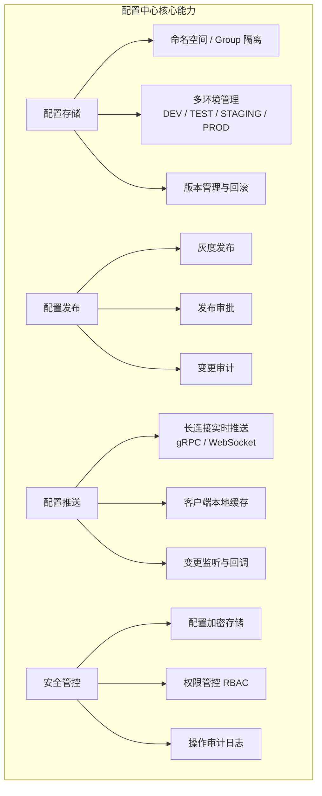
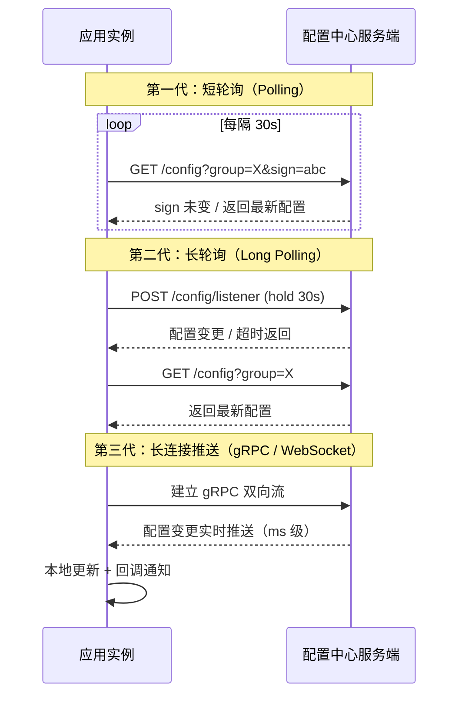
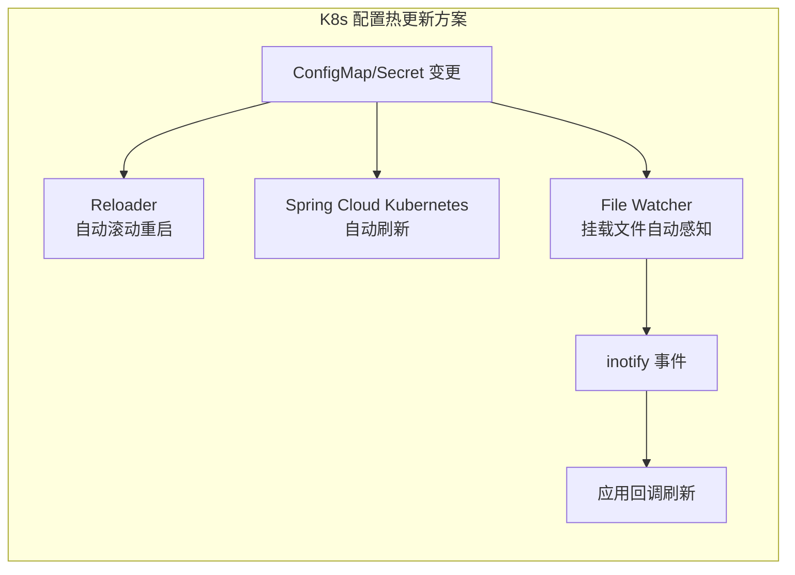
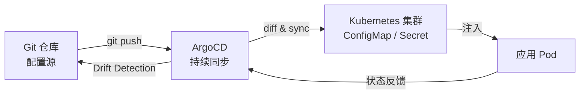
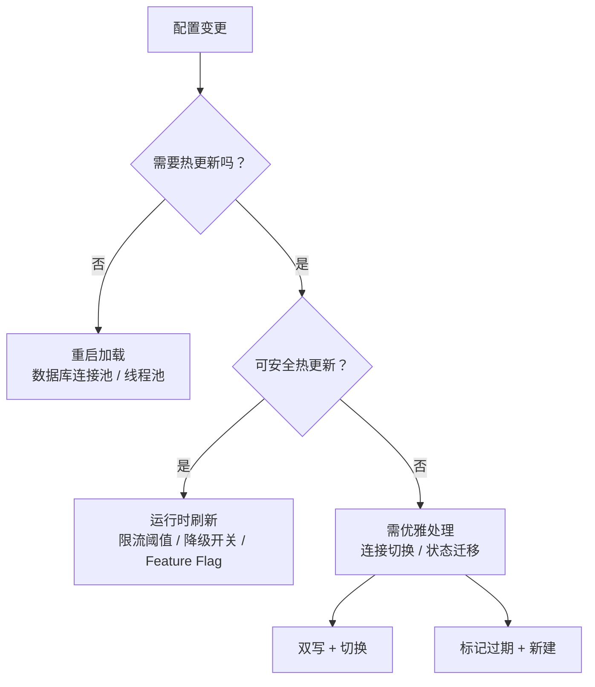
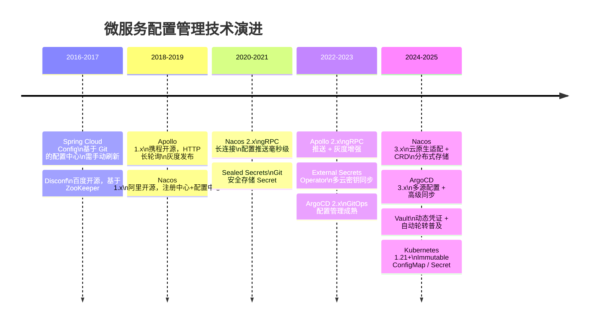
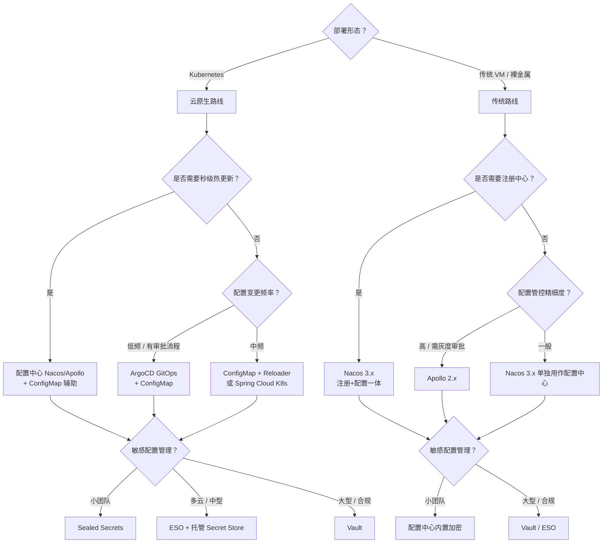

# 如何管理服务配置

在拆分为微服务架构前，单体应用只需管理一套配置；拆分后，每一个服务都拥有独立配置，且因服务治理的需要，部分配置还须支持动态变更——降级开关、流量路由、限流阈值等都需要秒级生效，这正是微服务架构下配置管理的核心挑战。上一篇 [[09]] 我们讨论了微服务治理的手段，而配置管理正是治理手段落地的关键基础设施之一。

本文将从本地配置的局限出发，深入剖析配置中心的架构演进，覆盖传统配置中心（Nacos、Apollo）与云原生配置管理（Kubernetes ConfigMap/Secret、ArgoCD GitOps）两条技术路线，并探讨配置加密、动态热更新等前沿实践，帮助你在不同技术栈和部署形态下做出合理的架构决策。

## 一、本地配置：从硬编码到配置文件

### 1.1 硬编码配置

最简单的方案是**把配置当作代码同等看待，随应用程序一起发布**。比如在熔断场景中直接在注解里定义参数：

```java
// 硬编码方式 —— 不推荐
@HystrixCommand(fallbackMethod = "getDefaultProductInventoryByCode",
    commandProperties = {
       @HystrixProperty(name = "execution.isolation.thread.timeoutInMilliseconds", value = "3000"),
       @HystrixProperty(name = "circuitBreaker.errorThresholdPercentage", value="60")
    }
)
public Optional<ProductInventoryResponse> getProductInventoryByCode(String productCode) {
    // ...
}
```

硬编码的问题显而易见：任何配置变更都需要修改源码、重新构建、重新部署，在线上业务中这相当于一次完整上线流程。

### 1.2 配置文件外部化

改进方案是**把配置抽离到独立的配置文件中，实现配置与代码分离**：

```java
// 代码中仅引用配置 Key
@HystrixCommand(commandKey = "inventory-by-productcode",
    fallbackMethod = "getDefaultProductInventoryByCode")
public Optional<ProductInventoryResponse> getProductInventoryByCode(String productCode) {
    // ...
}
```

```properties
# application.properties
hystrix.command.inventory-by-productcode.execution.isolation.thread.timeoutInMilliseconds=2000
hystrix.command.inventory-by-productcode.circuitBreaker.errorThresholdPercentage=60
```

Spring Boot 2.4+ 引入了 `spring.config.import` 机制，支持从多种来源加载配置：

```yaml
# application.yml —— Spring Boot 2.4+
spring:
  config:
    import:
      - optional:file:./override.properties
      - optional:nacos:common.properties?group=DEFAULT_GROUP
```

配置文件外部化缓解了硬编码的问题，但仍然存在核心痛点：**修改配置必须重新发布**。在微服务规模达到数十甚至上百个服务时，这种方式无论是效率还是风险都难以接受。

### 1.3 本地配置的适用场景

| 场景 | 是否适合本地配置 | 原因 |
|------|:---:|------|
| 基础框架参数（如日志格式） | 是 | 几乎不变更，随代码版本管理 |
| 环境无关的常量 | 是 | 不需要运行时动态调整 |
| 限流阈值 / 降级开关 | 否 | 需要秒级生效 |
| 数据库连接 / 缓存地址 | 否 | 资源变更时需即时同步 |
| 特性开关（Feature Flag） | 否 | 需灰度控制与快速回滚 |

## 二、配置中心：集中化配置管理

配置中心的核心理念是**将服务的各类配置集中存储、统一管理，并支持运行时动态推送**。服务启动时从配置中心拉取所需配置，运行中通过长连接监听变更并实时生效，无需重新发布。

### 2.1 配置中心核心功能模型



一个成熟的配置中心至少需要具备以下能力：

1. **配置注册与反注册**：向配置中心写入或删除配置项
2. **配置查看**：按 Group / Key 查询配置值
3. **配置变更订阅**：客户端通过长连接监听配置变更，实时接收推送
4. **版本管理**：每次发布生成版本号，支持一键回滚
5. **灰度发布**：配置变更先推送到部分实例，验证后再全量发布
6. **权限管控**：配置的编辑与发布分离，支持审批流与审计

### 2.2 配置变更推送机制演进

配置变更如何从服务端推送到客户端，是配置中心架构的关键：



| 推送方式 | 延迟 | 服务端压力 | 典型实现 |
|---------|:----:|:--------:|---------|
| 短轮询 | 30s+ | 高 | 早期自研配置中心 |
| 长轮询 | 1~5s | 中 | Apollo 1.x、Nacos 1.x |
| gRPC 长连接 | ms 级 | 低 | Nacos 2.x+、Apollo 2.x |

Nacos 2.x 起引入 gRPC 长连接替代 HTTP 短轮询，配置推送延迟从秒级降至毫秒级，同时大幅降低了服务端连接数和资源消耗。Apollo 2.x 同样支持 gRPC 推送。

### 2.3 配置中心的典型应用场景

**场景一：资源服务化**

当业务依赖的缓存（Memcached / Redis）、消息队列等资源规模膨胀后，资源 IP 的硬编码或本地文件管理方式完全不可行。通过配置中心将资源信息统一管理，某台机器故障时只需在配置中心修改对应 IP，应用自动同步，无需发布。

**场景二：业务动态降级**

微服务架构下服务越多，故障概率越大。服务消费者订阅依赖服务的降级开关配置，当依赖服务故障时，通过配置中心将开关置为"降级"，消费者实时感知并降级调用。相比熔断器的被动触发，这是一种主动的治理手段。

**场景三：分组流量切换**

异地多活场景下，服务按 IDC 维度分组部署。消费者订阅服务的分组配置，当某 IDC 故障时，修改分组配置即可将流量切换到其他 IDC，实现快速容灾。

**场景四：特性开关（Feature Flag）**

现代微服务中，Feature Flag 是实现持续交付的关键实践。通过配置中心管理开关状态，可以在不发布代码的情况下控制功能的开启与关闭，支持灰度放量、A/B 测试等场景。

## 三、开源配置中心深度对比

### 3.1 Nacos（最新版本 3.2.x）

Nacos 是阿里巴巴开源的动态服务发现与配置管理平台，定位为"注册中心 + 配置中心"二合一。从 2.x 版本开始架构重构，引入 gRPC 长连接，到 3.x 版本进一步优化了云原生适配。

**核心特性（Nacos 3.x）：**

- **gRPC 长连接**：配置推送从 HTTP 短轮询升级为 gRPC 双向流，延迟降至毫秒级
- **配置模型**：Namespace → Group → DataId 三级隔离，天然支持多环境、多租户
- **持久化存储**：内嵌 Derby（单机）或 MySQL（集群），3.x 支持分布式 KV 存储
- **灰度发布**：支持配置的 Beta 发布，按 IP 或比例灰度
- **权限管控**：3.x 增强 RBAC 模型，支持命名空间级别的权限隔离
- **多语言 SDK**：Java / Go / C++ / Node.js / Python 全覆盖
- **Kubernetes 集成**：支持通过 CRD 方式将 Nacos 配置映射为 Kubernetes ConfigMap

```yaml
# Nacos 3.x —— Spring Cloud Alibaba 配置示例
spring:
  cloud:
    nacos:
      config:
        server-addr: nacos-cluster:8848
        namespace: ${NAMESPACE:dev}
        group: ${GROUP:DEFAULT_GROUP}
        file-extension: yaml
        refresh-enabled: true          # 自动刷新
        shared-configs:                # 共享配置
          - data-id: common-db.yaml
            group: SHARED_GROUP
            refresh: true
        extension-configs:             # 扩展配置
          - data-id: redis-cluster.yaml
            group: INFRA_GROUP
            refresh: true
```

### 3.2 Apollo（最新版本 2.5.x）

Apollo 是携程开源的分布式配置中心，在配置管理领域的功能深度和成熟度上是业界标杆。

**核心特性（Apollo 2.x）：**

- **多环境管理**：Dev / FAT / UAT / PRO 四环境独立管理，Portal 统一视图
- **灰度发布**：支持按 IP 灰度、按比例灰度，灰度确认后一键全量发布
- **权限与审批**：编辑与发布权限分离，支持发布审批流，所有操作有审计日志
- **版本管理**：每次发布自动生成版本，支持任意版本回滚
- **全局搜索**：支持跨应用、跨环境模糊搜索配置项，快速定位配置归属
- **多语言 SDK**：Java / .Net 原生 SDK，Go / Python / Node.js / PHP 社区 SDK
- **开放 API**：完整的 OpenAPI 支持，便于与 CI/CD 系统集成

```properties
# Apollo 2.x —— 客户端配置（app.properties）
app.id=order-service
apollo.meta=http://apollo-config-service:8080
apollo.cluster=default
apollo.bootstrap.enabled=true
apollo.bootstrap.namespaces=application,FX-Common-Config
apollo.autoUpdateInjectedSpringProperties=true
```

```java
// Apollo 2.x —— 动态配置使用示例
@ApolloConfigChangeListener
public void onChange(ConfigChangeEvent changeEvent) {
    for (String key : changeEvent.changedKeys()) {
        ConfigChange change = changeEvent.getChange(key);
        log.info("配置变更 - key: {}, old: {}, new: {}",
            key, change.getOldValue(), change.getNewValue());
    }
    // 根据变更刷新运行时状态
    refreshRateLimiter();
}
```

### 3.3 Nacos vs Apollo 对比

| 维度 | Nacos 3.x | Apollo 2.x |
|------|-----------|-----------|
| 定位 | 注册中心 + 配置中心 | 专注配置中心 |
| 配置推送 | gRPC 长连接 | HTTP 长轮询 + gRPC（2.x） |
| 灰度发布 | Beta 发布（按 IP） | 按 IP / 按比例灰度，功能更强 |
| 权限审批 | RBAC，较简单 | 编辑/发布分离 + 审批流，更完善 |
| 版本管理 | 历史版本查询 + 回滚 | 完整版本链 + 一键回滚 |
| 多环境 | Namespace 隔离 | Portal 统一管理四环境 |
| 依赖 | 内嵌存储 / MySQL | 仅依赖 MySQL |
| 多语言 | 官方多语言 SDK | Java/.Net 官方，其余社区 |
| 部署复杂度 | 单体部署，较简单 | 四个微服务组件，较复杂 |
| 社区活跃度 | 极高（阿里 + Spring Cloud Alibaba） | 高（携程 + 独立社区） |
| K8s 适配 | CRD 集成 | 需自行对接 |

**选型建议**：如果你同时需要注册中心和配置中心，且技术栈以 Spring Cloud Alibaba 为主，Nacos 是更自然的选择；如果你对配置管理的精细化管控（灰度、审批、审计）有较高要求，Apollo 更为合适。两者在大规模生产环境中均有充分验证。

## 四、云原生配置管理：Kubernetes 原生方案

随着微服务逐步容器化并迁移到 Kubernetes，配置管理的范式发生了根本性变化——**从"应用主动拉取配置中心"变为"平台向应用注入配置"**。

### 4.1 ConfigMap 与 Secret

Kubernetes 原生提供了 ConfigMap 和 Secret 两种配置资源：

```yaml
# ConfigMap —— 非敏感配置
apiVersion: v1
kind: ConfigMap
metadata:
  name: order-service-config
  namespace: production
immutable: true                     # 1.21+ 特性，防止意外修改
data:
  APPLICATION_YML: |
    server:
      port: 8080
    spring:
      datasource:
        url: jdbc:mysql://mysql-primary:3306/order_db
      redis:
        cluster:
          nodes: redis-cluster:6379
  LOG_LEVEL: "INFO"
  RATE_LIMIT: "1000"
```

```yaml
# Secret —— 敏感配置
apiVersion: v1
kind: Secret
metadata:
  name: order-service-secret
  namespace: production
type: Opaque
data:
  DB_PASSWORD: <base64-encoded>      # Base64 编码（非加密！）
  API_KEY: <base64-encoded>
```

ConfigMap 和 Secret 的核心问题在于：**它们是静态资源，修改后需要重建 Pod 才能生效**。这显然不满足动态配置热更新的需求。

### 4.2 ConfigMap / Secret 的热更新方案

针对 Kubernetes 原生资源的动态更新，有以下几种方案：



| 方案 | 原理 | 延迟 | 是否重启 Pod | 适用场景 |
|------|------|:----:|:----------:|---------|
| Reloader | Watch ConfigMap 变更，触发 Rollout | 秒级 | 是 | 非热更新场景 |
| Spring Cloud K8s | 结合 `@RefreshScope` 自动刷新 | 秒级 | 否 | Spring Boot 应用 |
| 挂载卷 + File Watcher | kubelet 同步文件 + 应用监听 | 分钟级 | 否 | 通用语言 |
| Nacos K8s Plugin | ConfigMap 同步到 Nacos | 秒级 | 否 | Nacos 用户 |

**注意**：`immutable: true` 自 Kubernetes 1.21 起正式可用（ImmutableEphemeralVolumes 特性门控已默认开启），可避免 ConfigMap/Secret 变更引发的 watch 传播，减轻 API server 与 etcd 的负载；对于需要热更新的配置，不应标记为 immutable。

### 4.3 ArgoCD + GitOps：声明式配置管理

ArgoCD（最新版本 3.5.x）将 GitOps 理念引入配置管理，核心思想是**Git 仓库作为配置的唯一真实来源（Single Source of Truth）**。



```yaml
# ArgoCD Application —— 声明式配置管理
apiVersion: argoproj.io/v1alpha1
kind: Application
metadata:
  name: order-service-configs
  namespace: argocd
spec:
  project: default
  source:
    repoURL: https://github.com/org/service-configs.git
    targetRevision: main
    path: overlays/production
  destination:
    server: https://kubernetes.default.svc
    namespace: production
  syncPolicy:
    automated:
      prune: true
      selfHeal: true              # 自动检测并修复配置漂移
    syncOptions:
      - CreateNamespace=true
```

ArgoCD 的优势在于：

- **配置即代码**：所有配置变更通过 Git PR 进行，天然具备审批、审计、回滚能力
- **配置漂移检测**：自动检测集群实际状态与 Git 声明状态的偏差并告警
- **多集群管理**：一个 ArgoCD 实例可管理多个集群的配置分发
- **多源配置**：支持多源 Application，从多个 Git 仓库 / Helm 仓库聚合配置（Helm + Kustomize 混合）

但 GitOps 模式的局限也需注意：**Git PR 的流程天然不适合秒级动态配置变更**，它更适合管理静态配置和环境声明。

## 五、配置加密与安全

配置中往往包含数据库密码、API Key 等敏感信息，安全地存储和分发这些配置是配置管理的重要课题。

### 5.1 Kubernetes Secret 的问题

Kubernetes Secret 默认仅做 Base64 编码，**不是加密**。etcd 中的 Secret 数据可被任何有 etcd 访问权限的人读取。Kubernetes 支持通过 EncryptionConfiguration 开启 etcd 静态加密，但密钥管理仍然是一个难题。

### 5.2 配置加密方案对比

| 方案 | 原理 | Git 安全存储 | 动态轮转 | K8s 原生 | 复杂度 |
|------|------|:----------:|:-------:|:-------:|:-----:|
| **Sealed Secrets** | 非对称加密，客户端加密后可安全存入 Git | 是 | 否 | 是 | 低 |
| **External Secrets Operator** | 从外部 Secret Store（Vault / AWS SM / GCP SM）同步到 K8s Secret | 否 | 是 | 是 | 中 |
| **HashiCorp Vault** | 专用密钥管理平台，动态生成短期凭证 | 否 | 是 | 需集成 | 高 |
| **SOPS (Mozilla)** | 文件级加密，支持多云 KMS | 是 | 否 | 需集成 | 低 |
| **etcd Encryption** | K8s 原生 etcd 静态加密 | 否 | 否 | 是 | 低 |

### 5.3 Sealed Secrets 实践

Sealed Secrets 的理念是用公钥加密 Secret，加密后的 SealedSecret 可以安全地提交到 Git 仓库，只有集群内的控制器能解密：

```yaml
# SealedSecret —— 可安全存入 Git（v0.37+）
apiVersion: bitnami.com/v1alpha1
kind: SealedSecret
metadata:
  name: order-service-secret
  namespace: production
spec:
  encryptedData:
    DB_PASSWORD: AgBfj8eR2...（公钥加密后的密文）
    API_KEY: AgCK9xL3m...
  template:
    metadata:
      name: order-service-secret
      namespace: production
    type: Opaque
```

```bash
# 使用 kubeseal 加密
echo -n 'my-db-password' | kubectl create secret generic order-secret \
  --dry-run=client --from-file=db-password=/dev/stdin -o yaml | \
  kubeseal --format yaml > sealed-secret.yaml
```

### 5.4 External Secrets Operator 实践

External Secrets Operator（ESO，v2.6+）从外部 Secret Store 同步密钥到 Kubernetes Secret，支持动态轮转：

```yaml
# ESO —— 从 Vault 同步 Secret
apiVersion: external-secrets.io/v1beta1
kind: ExternalSecret
metadata:
  name: order-service-secret
  namespace: production
spec:
  refreshInterval: 1h              # 定期轮转
  secretStoreRef:
    name: vault-backend
    kind: ClusterSecretStore
  target:
    name: order-service-secret
    creationPolicy: Owner
  data:
    - secretKey: DB_PASSWORD
      remoteRef:
        key: secret/data/production/order-service
        property: db_password
```

### 5.5 HashiCorp Vault 实践

Vault（v2.0+）是企业级密钥管理平台，支持动态凭证、自动轮转和细粒度权限控制：

```hcl
# Vault —— 动态数据库凭证（v2.0+）
path "database/creds/order-service-role" {
  capabilities = ["read"]
}

# 动态凭证：每次读取生成临时账号，TTL 自动过期
```

```yaml
# Vault Agent Sidecar 注入
apiVersion: apps/v1
kind: Deployment
spec:
  template:
    metadata:
      annotations:
        vault.hashicorp.com/agent-inject: "true"
        vault.hashicorp.com/role: "order-service"
        vault.hashicorp.com/agent-inject-secret-db-creds: "database/creds/order-service-role"
```

**选型建议**：

- 小型团队 / GitOps 场景：Sealed Secrets，简单实用
- 中型团队 / 多云环境：External Secrets Operator + 托管 Secret Store（AWS SM / GCP SM）
- 大型企业 / 合规要求高：HashiCorp Vault，功能最全面但运维成本高

## 六、动态配置热更新

配置热更新是配置管理中技术难度最高的环节——不仅要推送变更，还要让应用在运行时安全地刷新内部状态。

### 6.1 热更新的挑战



并非所有配置都适合热更新：

| 配置类型 | 是否可热更新 | 原因 |
|---------|:----------:|------|
| 限流阈值 | 是 | 纯数值，无状态依赖 |
| 降级开关 | 是 | 布尔值，逻辑简单 |
| Feature Flag | 是 | 开关控制，逻辑简单 |
| 数据库连接串 | 需谨慎 | 连接池状态需切换 |
| 线程池大小 | 需谨慎 | 运行中任务需完成 |
| 服务端口 | 否 | 需重建监听 |
| 日志级别 | 是 | Logback / Log4j2 原生支持 |

### 6.2 Spring Boot 动态刷新

Spring Cloud 提供了 `@RefreshScope` 和 `@ConfigurationProperties` 两种刷新机制：

```java
// Spring Cloud —— @RefreshScope 方式（需引入 spring-cloud-starter）
@RefreshScope
@RestController
public class RateLimitController {

    @Value("${rate.limit:1000}")
    private int rateLimit;

    @GetMapping("/check")
    public boolean check() {
        return rateLimiter.tryAcquire(rateLimit);
    }
}

// Spring Cloud —— @ConfigurationProperties 方式（推荐）
@ConfigurationProperties(prefix = "rate.limit")
@Data
public class RateLimitProperties {
    private int maxRequests = 1000;
    private int windowSeconds = 60;
}
```

```bash
# 手动触发刷新（Spring Cloud Bus + 消息中间件可广播）
curl -X POST http://order-service:8080/actuator/refresh
```

### 6.3 Kubernetes 环境下的热更新

在 Kubernetes 环境中，如果仍使用 Nacos / Apollo 作为配置中心，热更新机制与传统部署一致。但如果使用 ConfigMap 作为配置源，则需结合以下方案：

```java
// Spring Cloud Kubernetes —— 自动监听 ConfigMap 变更
// 依赖：spring-cloud-kubernetes-fabric8-config
@RefreshScope
@ConfigurationProperties(prefix = "app")
public class AppConfig {
    private String featureXEnabled;
    private int rateLimit;
    // ConfigMap 变更后自动刷新
}
```

对于非 Spring 生态的微服务（Go / Rust / Node.js），通常的做法是：

1. 通过 Sidecar 注入配置代理，监听配置中心变更
2. 配置变更时，代理将新配置写入共享卷或通过 HTTP 通知应用
3. 应用通过信号（如 SIGHUP）或 HTTP Webhook 触发内部状态刷新

## 七、技术演进时间线



## 八、架构决策指南

根据不同的技术栈和部署形态，配置管理的架构选型可参考以下决策树：



### 综合选型速查表

| 维度 | Nacos 3.x | Apollo 2.x | K8s ConfigMap | ArgoCD GitOps |
|------|-----------|-----------|:------------:|:------------:|
| 部署形态 | VM + K8s | VM + K8s | 仅 K8s | 仅 K8s |
| 动态热更新 | gRPC 实时 | HTTP/gRPC 实时 | 需额外方案 | 需额外方案 |
| 灰度发布 | Beta 发布 | 按 IP/比例 | 不支持 | Rollout 策略 |
| 权限审批 | RBAC | 编辑/发布分离 | RBAC | Git PR 审批 |
| 版本回滚 | 支持 | 一键回滚 | Git 回滚 | Git 回滚 |
| 敏感配置 | 内置加密 | 内置加密 | Secret + 加密 | SealedSecret |
| 配置漂移检测 | 否 | 否 | 否 | 是 |
| 多集群支持 | 需多集群部署 | 需多集群部署 | 天然支持 | 天然支持 |
| 学习成本 | 低 | 中 | 低 | 中 |
| 运维复杂度 | 低 | 中 | 低 | 中 |

## 小结

配置管理是微服务基础设施的基石，从本地配置到配置中心再到云原生声明式管理，技术演进的核心驱动力始终是**更快的变更速度**和**更安全的管控能力**。

回顾本文的核心要点：

1. **本地配置**适用于几乎不变更的基础参数，动态配置必须依赖配置中心或平台能力
2. **传统配置中心**（Nacos / Apollo）在动态推送、灰度发布方面成熟可靠，Nacos 3.x 和 Apollo 2.x 均已支持 gRPC 长连接
3. **云原生配置管理**以 Kubernetes ConfigMap/Secret + ArgoCD GitOps 为代表，强调声明式和可审计，但动态热更新需额外方案
4. **配置加密**不可忽视：小团队用 Sealed Secrets，多云用 ESO，大型企业用 Vault
5. **不是所有配置都适合热更新**，连接池、线程池等有状态配置的刷新需要谨慎处理

实践中，传统配置中心和云原生方案并非互斥，很多团队采用**混合模式**：静态配置和环境声明走 GitOps 流程，动态开关和阈值走配置中心实时推送。关键是根据业务规模、技术栈和团队能力做出合理选择，而非盲目追求最新技术。

## 思考题

1. 在 Kubernetes 环境中，如果同时使用 Nacos 配置中心和 ArgoCD GitOps，两者管理的配置边界应该如何划分？如何避免配置冲突？
2. 对于数据库连接这类不适合直接热更新的配置，如果确实需要在线上切换数据库主库地址，你会如何设计安全可靠的切换方案？


