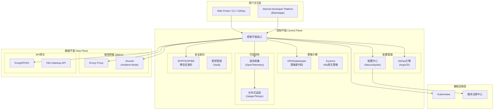
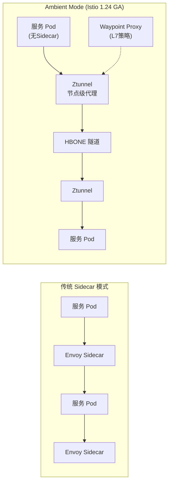
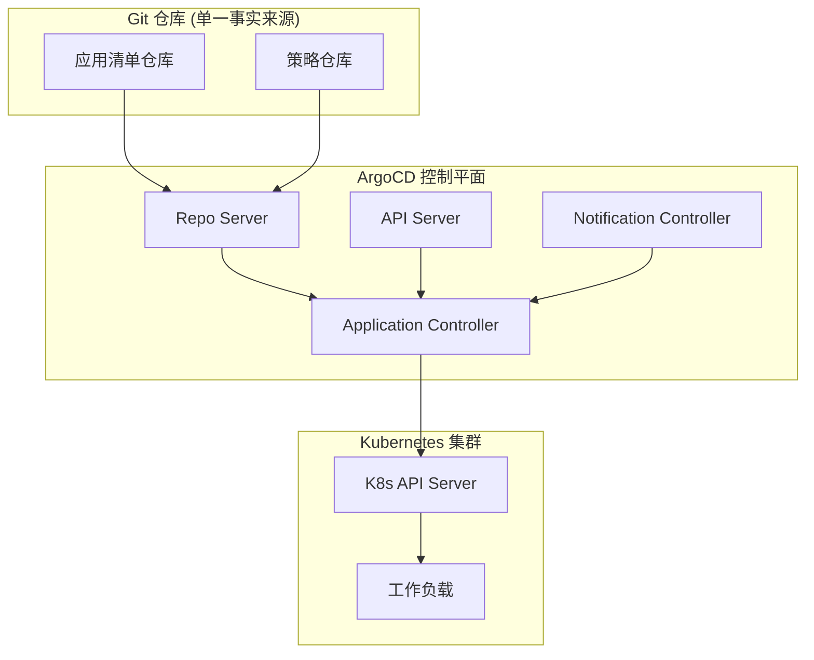
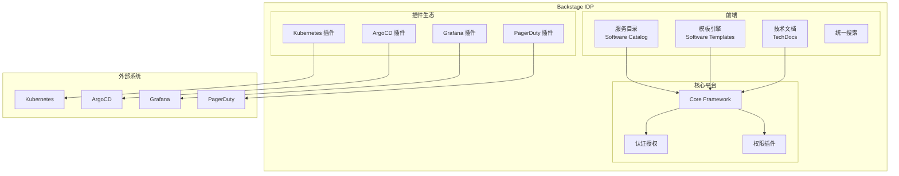
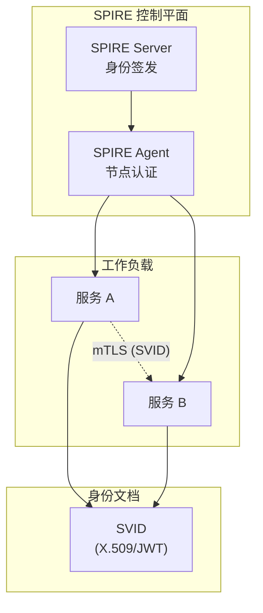
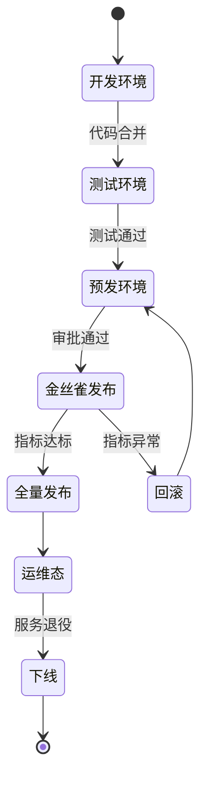
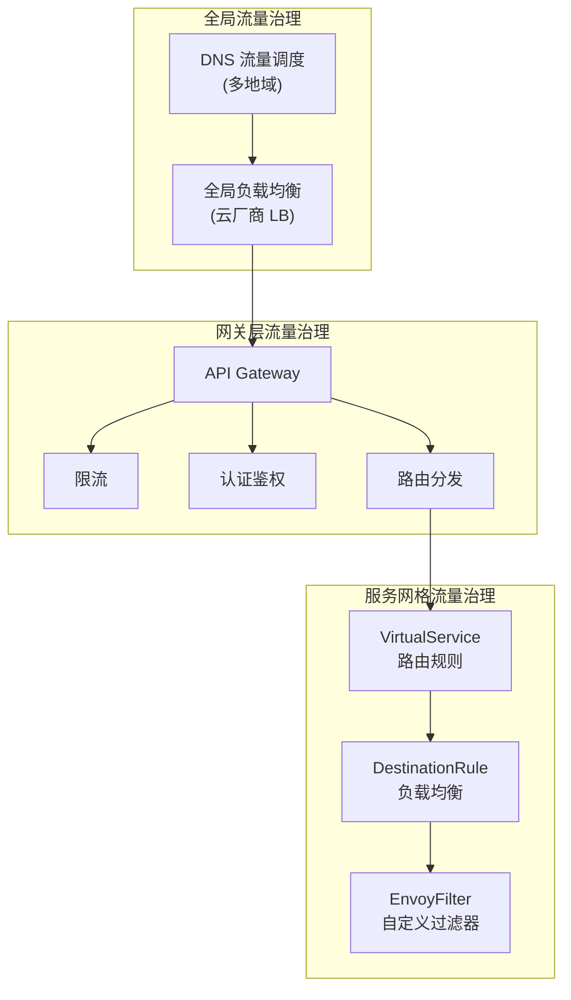
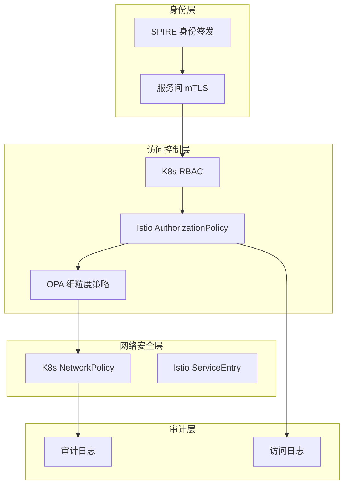
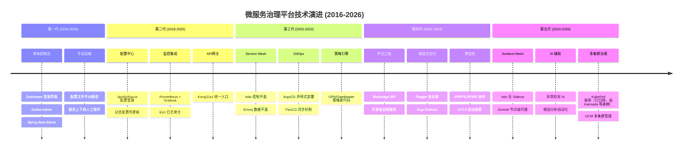
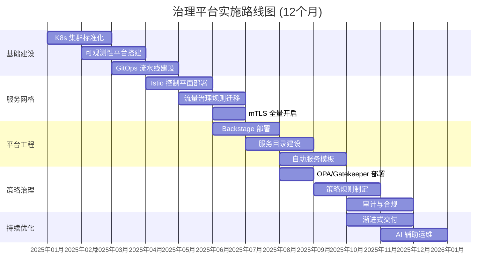

# 如何搭建微服务治理平台

> **版本基线**：Istio 1.30+ | OPA/Gatekeeper 3.22+ | ArgoCD 3.4+ | Backstage 1.51+
>
> **前置知识**：[[09]] 微服务治理的手段有哪些？ · [[17-22]] 治理实践篇

## 概述

单体应用改造为微服务架构后，服务调用从本地调用变成了远程方法调用，面临的不确定因素呈指数级增长：服务实例动态伸缩、网络分区故障、依赖服务不可用、流量突发峰值、安全边界模糊……这些问题催生了对**统一治理入口**的迫切需求。

微服务治理平台（Microservice Governance Platform）正是这一需求的答案——它是**与服务打交道的统一控制平面**，将分散在注册中心、配置中心、监控系统、容器平台、策略引擎等基础设施中的治理能力抽象聚合，为开发人员和运维人员提供声明式、可观测、可审计的服务操作界面。

从 2018 年的"控制台 + API 网关"模式，到 2025 年的**控制平面/数据平面分离架构**，微服务治理平台经历了深刻的技术演进。本文将系统阐述现代微服务治理平台的架构设计、核心组件与最佳实践。

---

## 一、治理平台架构演进：从单体控制台到控制平面/数据平面分离

### 1.1 传统架构的局限性

早期微服务治理平台（2016-2019）采用**单体控制台架构**：

```
┌─────────────────────────────────────────────────────────────┐
│                    Web Portal (前端)                         │
├─────────────────────────────────────────────────────────────┤
│                    API Gateway (后端)                        │
├──────────┬──────────┬──────────┬──────────┬────────────────┤
│ 注册中心  │ 配置中心  │ 监控系统  │ 日志系统  │ 容器平台       │
│ (ZooKeeper)│(Apollo) │(Prometheus)│(ELK)   │(K8s API)       │
└──────────┴──────────┴──────────┴──────────┴────────────────┘
```

这种架构存在三大问题：

| 问题 | 表现 | 影响 |
|------|------|------|
| **紧耦合** | 每个基础设施组件需要定制适配器 | 新组件接入成本高，维护负担重 |
| **缺乏一致性** | 各组件配置模型、API 风格各异 | 用户体验割裂，学习曲线陡峭 |
| **扩展性差** | 控制台承担所有逻辑，难以水平扩展 | 大规模场景下成为性能瓶颈 |

### 1.2 控制平面/数据平面分离架构

2020 年后，以 Istio 为代表的 Service Mesh 技术引入了**控制平面（Control Plane）/数据平面（Data Plane）分离**模式，这一模式迅速成为微服务治理平台的标准架构：



**核心设计原则**：

1. **关注点分离**：控制平面负责决策，数据平面负责执行
2. **声明式配置**：所有治理策略以声明式资源定义，存储在 Git 仓库
3. **策略即代码**：治理规则版本化、可审计、可回滚
4. **零信任安全**：每个服务实例拥有独立身份，mTLS 加密通信

---

## 二、现代治理平台核心组件详解

### 2.1 服务网格控制平面：Istio 1.30+

Istio 是目前最成熟的 Service Mesh 实现，其控制平面架构在 2024-2025 年经历了重大演进。

#### 2.1.1 传统 Sidecar 模式

```yaml
# Istio 1.22+ Sidecar 配置示例
apiVersion: networking.istio.io/v1
kind: Sidecar
metadata:
  name: default
  namespace: production
spec:
  egress:
  - hosts:
    - "./*"      # 本命名空间所有服务
    - "istio-system/*"  # Istio 系统服务
  outboundTrafficPolicy:
    mode: REGISTRY_ONLY  # 仅允许注册服务出站
```

#### 2.1.2 Ambient Mode（无 Sidecar 模式）

Istio 1.18 引入 Ambient Mode，1.24 起正式 GA，彻底改变了数据平面架构：



**Ambient Mode 核心组件**：

| 组件 | 功能 | 部署模式 |
|------|------|----------|
| **Ztunnel** | 节点级 L4 代理，负责 mTLS 加密和流量转发 | DaemonSet |
| **Waypoint Proxy** | 命名空间级 L7 代理，负责路由、限流、熔断 | Deployment |
| **istiod** | 控制平面，负责证书签发、配置分发 | Deployment |

**优势对比**：

```yaml
# Ambient Mode 启用配置 (Istio 1.30+)
apiVersion: v1
kind: Namespace
metadata:
  name: production
  labels:
    istio.io/dataplane-mode: ambient  # 启用 Ambient 模式
---
apiVersion: gateway.networking.k8s.io/v1
kind: Gateway
metadata:
  name: waypoint
  namespace: production
spec:
  gatewayClassName: istio-waypoint  # L7 策略网关
  listeners:
  - name: mesh
    port: 15008
    protocol: HBONE
```

### 2.2 策略引擎：OPA/Gatekeeper 与 Kyverno

治理平台的核心能力之一是**策略执行**——确保所有服务部署和配置符合组织规范。

#### 2.2.1 OPA/Gatekeeper：策略即代码

Open Policy Agent (OPA) 是 CNCF 毕业项目，Gatekeeper 是其 Kubernetes 原生实现：

```yaml
# Gatekeeper 3.22+ 约束模板示例
apiVersion: templates.gatekeeper.sh/v1
kind: ConstraintTemplate
metadata:
  name: k8srequiredlabels
spec:
  crd:
    spec:
      names:
        kind: K8sRequiredLabels
      validation:
        openAPIV3Schema:
          type: object
          properties:
            labels:
              type: array
              items:
                type: string
  targets:
    - target: admission.k8s.gatekeeper.sh
      rego: |
        package k8srequiredlabels
        
        violation[{"msg": msg}] {
          provided := {label | input.review.object.metadata.labels[label]}
          required := {label | label := input.parameters.labels[_]}
          missing := required - provided
          count(missing) > 0
          msg := sprintf("Missing required labels: %v", [missing])
        }
---
apiVersion: constraints.gatekeeper.sh/v1
kind: K8sRequiredLabels
metadata:
  name: require-service-labels
spec:
  match:
    kinds:
      - apiGroups: [""]
        kinds: ["Service"]
  parameters:
    labels:
      - "app.kubernetes.io/name"
      - "app.kubernetes.io/team"
      - "app.kubernetes.io/cost-center"
```

#### 2.2.2 Kyverno：Kubernetes 原生策略引擎

Kyverno 采用 YAML 定义策略，学习曲线更平缓：

```yaml
# Kyverno 策略示例 (v1.13+)
apiVersion: kyverno.io/v1
kind: ClusterPolicy
metadata:
  name: require-resource-limits
spec:
  failureAction: Enforce  # 强制执行（1.13 起替代 validationFailureAction）
  background: true
  rules:
  - name: validate-limits
    match:
      any:
      - resources:
          kinds:
          - Deployment
          - StatefulSet
    validate:
      message: "所有容器必须设置资源限制"
      pattern:
        spec:
          template:
            spec:
              containers:
              - resources:
                  limits:
                    memory: "?*"  # 必须设置
                    cpu: "?*"
---
apiVersion: kyverno.io/v1
kind: ClusterPolicy
metadata:
  name: auto-inject-sidecar
spec:
  rules:
  - name: inject-istio-sidecar
    match:
      any:
      - resources:
          kinds:
          - Namespace
    mutate:
      patchStrategicMerge:
        metadata:
          labels:
            istio-injection: enabled
```

**OPA/Gatekeeper vs Kyverno 对比**：

| 维度 | OPA/Gatekeeper | Kyverno |
|------|----------------|---------|
| **策略语言** | Rego（图灵完备） | YAML（声明式） |
| **学习曲线** | 较陡 | 平缓 |
| **表达能力** | 极强，支持复杂逻辑 | 中等，覆盖常见场景 |
| **性能** | 较高（编译执行） | 较高（原生 Go） |
| **生态集成** | 广泛（K8s、Terraform、API网关） | Kubernetes 专用 |
| **适用场景** | 复杂策略、跨平台治理 | K8s 原生策略、快速上手 |

### 2.3 GitOps 治理：ArgoCD + Flagger

GitOps 将 Git 仓库作为**单一事实来源**，所有治理配置变更通过 Git 提交触发。

#### 2.3.1 ArgoCD 3.4+ 核心架构



**ArgoCD Application 示例**：

```yaml
# ArgoCD 3.4+ Application 配置
apiVersion: argoproj.io/v1alpha1
kind: Application
metadata:
  name: payment-service
  namespace: argocd
  finalizers:
    - resources-finalizer.argocd.argoproj.io
spec:
  project: production
  source:
    repoURL: https://github.com/org/microservices.git
    targetRevision: main
    path: services/payment
    helm:
      valueFiles:
        - values-production.yaml
      parameters:
        - name: replicaCount
          value: "3"
  destination:
    server: https://kubernetes.default.svc
    namespace: production
  syncPolicy:
    automated:
      prune: true
      selfHeal: true
      allowEmpty: false
    syncOptions:
      - CreateNamespace=true
      - PrunePropagationPolicy=foreground
    retry:
      limit: 5
      backoff:
        duration: 5s
        factor: 2
        maxDuration: 3m
```

#### 2.3.2 Flagger：渐进式交付

Flagger 与 ArgoCD 集成，实现自动化金丝雀发布：

```yaml
# Flagger Canary 配置
apiVersion: flagger.app/v1beta1
kind: Canary
metadata:
  name: payment-service
  namespace: production
spec:
  targetRef:
    apiVersion: apps/v1
    kind: Deployment
    name: payment-service
  progressDeadlineSeconds: 600
  service:
    port: 8080
    targetPort: 8080
  analysis:
    interval: 1m
    threshold: 5
    maxWeight: 50
    stepWeight: 10
    metrics:
    - name: request-success-rate
      thresholdRange:
        min: 99
      interval: 1m
    - name: request-duration
      thresholdRange:
        max: 500
      interval: 1m
    webhooks:
    - name: load-test
      url: http://flagger-loadtester/
      timeout: 5s
      metadata:
        type: cmd
        cmd: "hey -z 1m -q 10 -c 2 http://payment-service.production:8080/"
```

### 2.4 平台工程：Backstage Internal Developer Platform

平台工程（Platform Engineering）是 2023-2025 年的核心理念，Backstage 是其代表性实现。

#### 2.4.1 Backstage 架构



#### 2.4.2 服务目录配置

```yaml
# Backstage 1.51+ catalog-info.yaml
apiVersion: backstage.io/v1alpha1
kind: Component
metadata:
  name: payment-service
  description: 支付处理服务
  annotations:
    backstage.io/techdocs-ref: dir:.
    github.com/project-slug: org/payment-service
    argocd/app-name: payment-service
    grafana/dashboard-selector: "payment"
    pagerduty.com/service-id: PXXXXX
  tags:
    - java
    - spring-boot
    - tier-1
  links:
    - url: https://grafana.example.com/d/payment
      title: 监控面板
      icon: dashboard
spec:
  type: service
  lifecycle: production
  owner: team-payments
  system: payment-system
  dependsOn:
    - component:default/user-service
    - component:default/order-service
  providesApis:
    - payment-api
---
apiVersion: backstage.io/v1alpha1
kind: API
metadata:
  name: payment-api
  description: 支付服务 API
spec:
  type: openapi
  lifecycle: production
  owner: team-payments
  definition:
    $text: https://github.com/org/payment-service/blob/main/openapi.yaml
```

### 2.5 零信任安全：SPIFFE/SPIRE

零信任架构要求每个服务实例拥有可验证的身份，SPIFFE/SPIRE 提供了标准化解决方案。



**SPIRE 部署配置**：

```yaml
# SPIRE Server 配置 (v1.10+)
apiVersion: spire.spiffe.io/v1
kind: ClusterSPIFFEID
metadata:
  name: production-services
spec:
  className: spire-server
  spiffeIDTemplate: spiffe://{{ .TrustDomain }}/ns/{{ .PodMeta.Namespace }}/sa/{{ .PodSpec.ServiceAccountName }}
  podSelector:
    matchLabels:
      spiffe.io/spiffe-id: "true"
  workloadSelectorTemplates:
  - k8s:ns:production
  - k8s:sa:default
---
# SPIRE Agent 配置
apiVersion: apps/v1
kind: DaemonSet
metadata:
  name: spire-agent
  namespace: spire-system
spec:
  selector:
    matchLabels:
      app: spire-agent
  template:
    spec:
      serviceAccountName: spire-agent
      containers:
      - name: spire-agent
        image: ghcr.io/spiffe/spire-agent:1.10.0
        args:
        - -config
        - /run/spire/config/agent.conf
        volumeMounts:
        - name: spire-config
          mountPath: /run/spire/config
        - name: workload-api
          mountPath: /run/spire/sockets
```

---

## 三、治理平台功能模块设计

### 3.1 服务生命周期管理



**服务管理 API 设计**：

```go
// 服务生命周期管理接口 (Go 1.22+)
package governance

import (
    "context"
    "time"
)

// ServiceManager 定义服务管理接口
type ServiceManager interface {
    // 服务注册
    Register(ctx context.Context, svc *Service) error
    
    // 服务下线（优雅停机）
    Deregister(ctx context.Context, svcID string, opts DeregisterOptions) error
    
    // 服务发现
    Discover(ctx context.Context, svcName string) ([]*ServiceInstance, error)
    
    // 健康检查
    HealthCheck(ctx context.Context, svcID string) (*HealthStatus, error)
}

// Service 服务定义
type Service struct {
    ID          string            `json:"id"`
    Name        string            `json:"name"`
    Namespace   string            `json:"namespace"`
    Version     string            `json:"version"`
    Labels      map[string]string `json:"labels"`
    Annotations map[string]string `json:"annotations"`
    Endpoints   []Endpoint        `json:"endpoints"`
    Meta        ServiceMeta       `json:"meta"`
}

// DeregisterOptions 下线选项
type DeregisterOptions struct {
    GracePeriod   time.Duration `json:"gracePeriod"`   // 优雅停机时间
    DrainTraffic  bool          `json:"drainTraffic"`  // 是否排空流量
    Force         bool          `json:"force"`         // 强制下线
    Reason        string        `json:"reason"`        // 下线原因
}
```

### 3.2 流量治理

现代治理平台支持多层次的流量治理：



**Istio 流量治理配置**：

```yaml
# Istio 1.30+ 流量治理配置
apiVersion: networking.istio.io/v1
kind: VirtualService
metadata:
  name: payment-service
  namespace: production
spec:
  hosts:
  - payment-service
  http:
  - name: canary-route
    match:
    - headers:
        x-canary:
          exact: "true"
    route:
    - destination:
        host: payment-service
        subset: canary
      weight: 100
  - name: stable-route
    route:
    - destination:
        host: payment-service
        subset: stable
      weight: 90
    - destination:
        host: payment-service
        subset: canary
      weight: 10
    retries:
      attempts: 3
      perTryTimeout: 2s
      retryOn: gateway-error,connect-failure,refused-stream
    timeout: 30s
    fault:
      delay:
        percentage:
          value: 0.1
        fixedDelay: 5s
---
apiVersion: networking.istio.io/v1
kind: DestinationRule
metadata:
  name: payment-service
  namespace: production
spec:
  host: payment-service
  trafficPolicy:
    connectionPool:
      tcp:
        maxConnections: 100
        connectTimeout: 5s
      http:
        h2UpgradePolicy: UPGRADE
        http1MaxPendingRequests: 100
        http2MaxRequests: 1000
    outlierDetection:
      consecutive5xxErrors: 5
      interval: 30s
      baseEjectionTime: 30s
      maxEjectionPercent: 50
  subsets:
  - name: stable
    labels:
      version: stable
  - name: canary
    labels:
      version: canary
```

### 3.3 可观测性集成

```yaml
# OpenTelemetry Collector 配置
apiVersion: opentelemetry.io/v1beta1
kind: OpenTelemetryCollector
metadata:
  name: governance-otel
  namespace: observability
spec:
  mode: deployment
  config:
    receivers:
      otlp:
        protocols:
          grpc:
            endpoint: 0.0.0.0:4317
          http:
            endpoint: 0.0.0.0:4318
      prometheus:
        config:
          scrape_configs:
          - job_name: 'istio-proxy'
            kubernetes_sd_configs:
            - role: pod
              namespaces:
                names:
                - production
            relabel_configs:
            - source_labels: [__meta_kubernetes_pod_label_istio_io_rev]
              action: keep
              regex: .*
    processors:
      batch:
        timeout: 1s
        send_batch_size: 1024
      memory_limiter:
        check_interval: 1s
        limit_mib: 2048
      k8sattributes:
        extract:
          metadata:
          - k8s.namespace.name
          - k8s.pod.name
          - k8s.deployment.name
    exporters:
      otlp:
        endpoint: tempo.observability:4317
        tls:
          insecure: true
      prometheusremotewrite:
        endpoint: http://mimir.observability/api/v1/push
    service:
      pipelines:
        traces:
          receivers: [otlp]
          processors: [memory_limiter, k8sattributes, batch]
          exporters: [otlp]
        metrics:
          receivers: [otlp, prometheus]
          processors: [memory_limiter, k8sattributes, batch]
          exporters: [prometheusremotewrite]
```

### 3.4 安全治理



**Istio AuthorizationPolicy 示例**：

```yaml
# Istio 1.30+ 授权策略
apiVersion: security.istio.io/v1
kind: AuthorizationPolicy
metadata:
  name: payment-service-authz
  namespace: production
spec:
  selector:
    matchLabels:
      app: payment-service
  action: ALLOW
  rules:
  # 规则1: 允许来自 order-service 的请求
  - from:
    - source:
        principals: ["cluster.local/ns/production/sa/order-service"]
    to:
    - operation:
        methods: ["POST"]
        paths: ["/api/v1/payments/*"]
    when:
    - key: request.headers[x-request-id]
      notValues: [""]
  # 规则2: 允许内部监控访问
  - from:
    - source:
        namespaces: ["observability"]
    to:
    - operation:
        methods: ["GET"]
        paths: ["/actuator/health", "/metrics"]
  # 规则3: 拒绝其他所有请求（默认 DENY）
---
apiVersion: security.istio.io/v1
kind: RequestAuthentication
metadata:
  name: payment-service-jwt
  namespace: production
spec:
  selector:
    matchLabels:
      app: payment-service
  jwtRules:
  - issuer: "https://auth.example.com"
    jwksUri: "https://auth.example.com/.well-known/jwks.json"
    audiences:
    - "payment-service"
    forwardOriginalToken: true
```

---

## 四、技术演进时间线



---

## 五、架构决策指南

### 5.1 技术选型决策树

```mermaid
flowchart TD
    Start[开始技术选型] --> Q1{服务规模?}
    
    Q1 -->|小型 (<50服务)| Small[轻量级方案]
    Q1 -->|中型 (50-200服务)| Medium[标准方案]
    Q1 -->|大型 (>200服务)| Large[企业级方案]
    
    Small --> S1[K8s Dashboard<br/>+ Prometheus<br/>+ ArgoCD]
    
    Medium --> M1[Istio Sidecar<br/>+ ArgoCD<br/>+ Backstage<br/>+ OPA/Gatekeeper]
    
    Large --> Q2{多集群需求?}
    Q2 -->|是| L1[Istio Ambient<br/>+ ArgoCD + Flagger<br/>+ Backstage<br/>+ SPIRE + OPA]
    Q2 -->|否| L2[Istio Sidecar<br/>+ ArgoCD<br/>+ Backstage<br/>+ OPA]
```

### 5.2 核心组件选型对比

| 功能领域 | 方案A | 方案B | 推荐场景 |
|----------|-------|-------|----------|
| **服务网格** | Istio (Ambient) | Linkerd | Istio: 功能全面、生态丰富<br/>Linkerd: 轻量、运维简单 |
| **策略引擎** | OPA/Gatekeeper | Kyverno | OPA: 复杂策略、跨平台<br/>Kyverno: K8s 原生、快速上手 |
| **GitOps** | ArgoCD | FluxCD | ArgoCD: UI 完善、企业友好<br/>FluxCD: 轻量、CNCF 原生 |
| **IDP** | Backstage | Port/ Cortex | Backstage: 开源、可定制<br/>Port/Cortex: SaaS、开箱即用 |
| **可观测性** | Prometheus + Grafana + Tempo | Datadog/ New Relic | 开源栈: 成本可控、灵活<br/>SaaS: 功能全面、免运维 |
| **密钥管理** | HashiCorp Vault | Sealed Secrets | Vault: 企业级、动态密钥<br/>Sealed Secrets: 简单、GitOps 友好 |

### 5.3 实施路径建议



---

## 六、小结

微服务治理平台从 2016 年的"单体控制台"演进到 2025 年的"控制平面/数据平面分离架构"，其核心价值始终不变：**将分散的治理能力聚合为统一的开发者体验**。

**关键要点回顾**：

1. **架构模式**：控制平面/数据平面分离是现代治理平台的标准架构，Istio Ambient Mode 代表了最新演进方向
2. **策略治理**：OPA/Gatekeeper 实现策略即代码，确保所有服务配置符合组织规范
3. **GitOps**：ArgoCD + Flagger 实现声明式部署和渐进式交付，降低人为错误风险
4. **平台工程**：Backstage 提供开发者自助服务门户，提升研发效能
5. **零信任**：SPIFFE/SPIRE 为每个服务实例提供可验证身份，实现 mTLS 自动加密

**实践建议**：

- 从小规模试点开始，逐步扩展治理范围
- 优先建设可观测性，"没有度量就没有治理"
- 策略规则与业务解耦，避免过度复杂化
- 投资开发者体验，降低治理平台使用门槛

微服务治理平台的建设是一个持续演进的过程，没有"银弹"方案。选择适合团队规模和技术能力的组件，循序渐进地构建治理能力，才是成功的关键。

---

## 思考题

1. 在你的组织中，微服务治理平台应该由哪个团队负责建设？是平台团队、SRE 团队还是架构团队？为什么？
2. 如何平衡治理平台的"统一管控"与业务团队的"自主灵活性"？你有哪些实践经验？
3. 随着云原生技术的普及，传统的 Dubbo Admin、Spring Boot Admin 等治理平台将如何演进？

---

**参考资料**：

- [Istio Ambient Mode Architecture](https://istio.io/latest/docs/ops/deployment/architecture/)
- [OPA Gatekeeper Documentation](https://open-policy-agent.github.io/gatekeeper/website/docs/)
- [Backstage Documentation](https://backstage.io/docs/overview/what-is-backstage)
- [SPIFFE/SPIRE Specification](https://spiffe.io/docs/latest/spiffe-about/overview/)
- [ArgoCD Documentation](https://argo-cd.readthedocs.io/)
- [Kyverno Documentation](https://kyverno.io/docs/)
