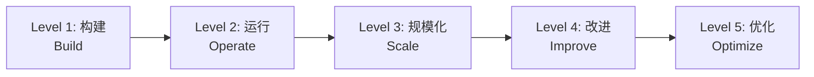
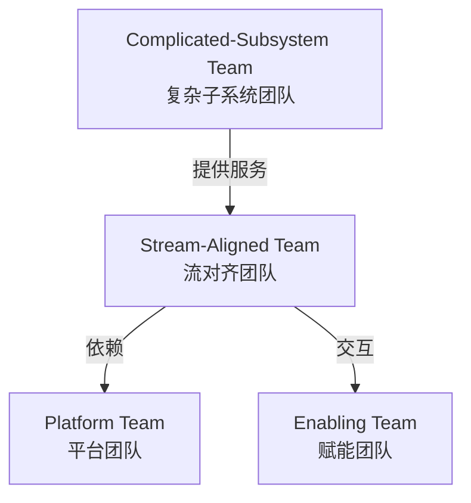
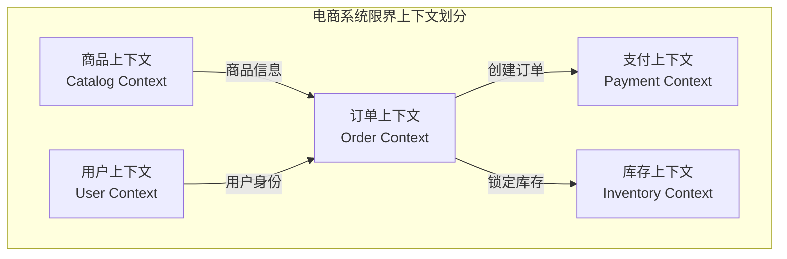
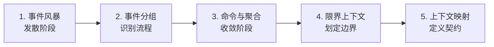
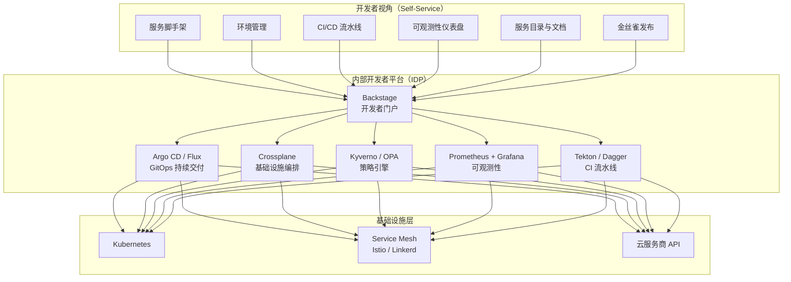
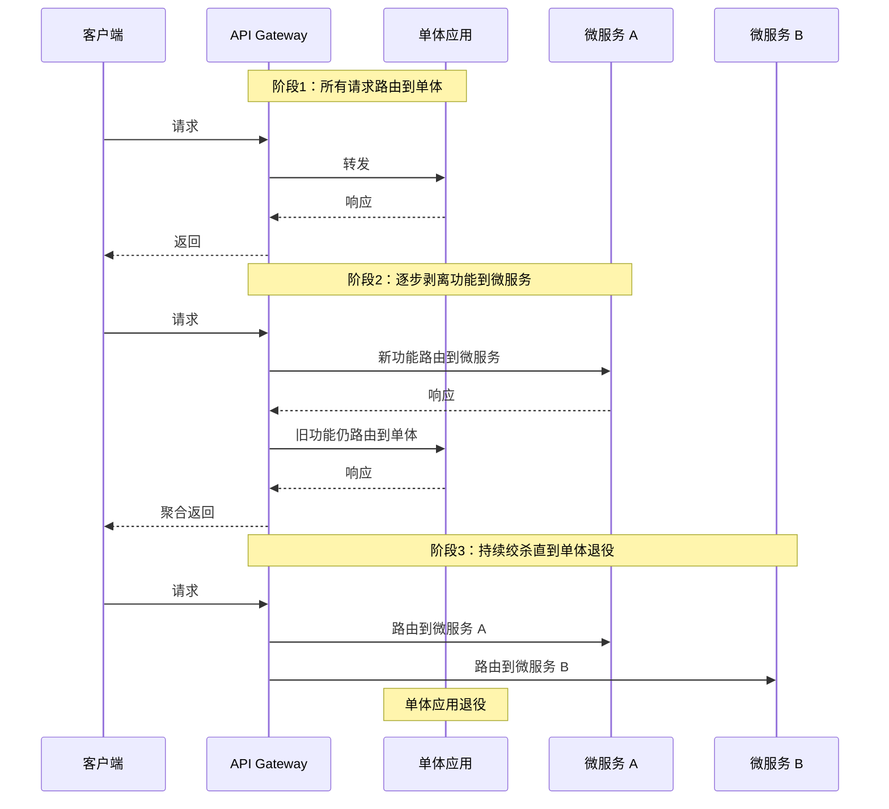
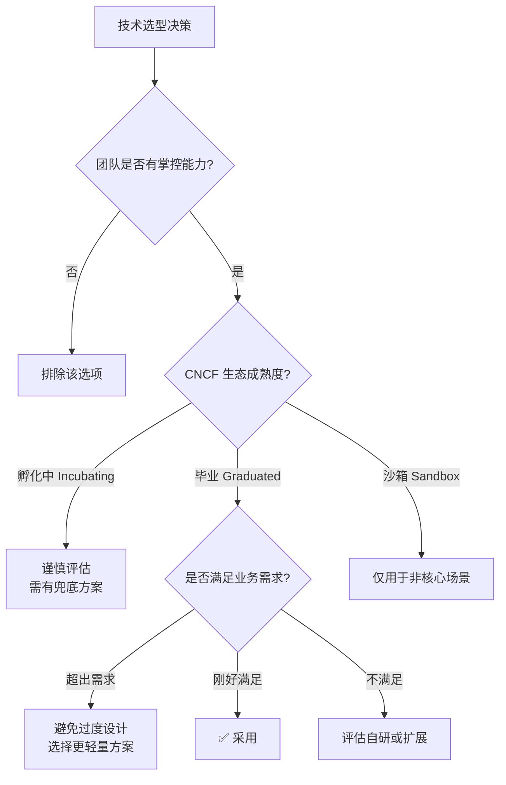
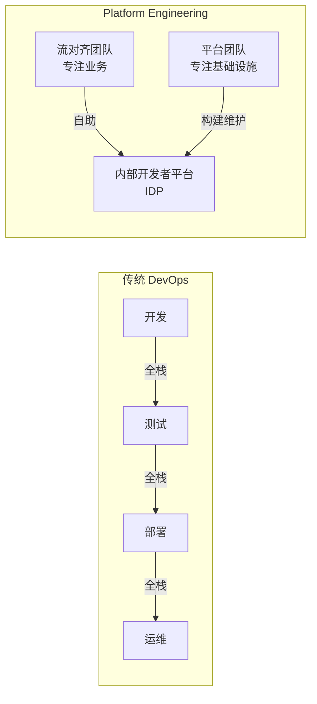
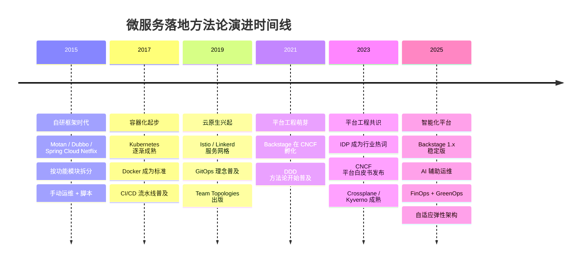

# 微服务架构该如何落地

> **版本基线**：CNCF Landscape 2025 | Backstage 1.x | DDD 战术设计 | Team Topologies 方法论
> **前置知识**：[[01-23]] 基础篇全部内容——注册中心、配置中心、RPC 框架、服务网关、服务治理、监控追踪等核心组件

专栏前 23 篇文章，我们系统讲解了微服务架构的各个组成部分——从注册中心、配置中心、RPC 框架，到服务网关、服务治理、监控追踪、容器化与编排，以及实践过程中可能遇到的问题和解决方案。到这里，你应该对微服务架构有了一个完整的认识。

但"知道"和"做到"之间，隔着一道巨大的鸿沟。在实际项目中，如何让一个团队把我们所学的微服务架构真正落地？这不仅仅是技术问题，更是组织、流程和文化的系统工程。

2025 年的云原生生态已经远比 2018 年成熟——CNCF 毕业项目超过 20 个，Platform Engineering 成为行业共识，Backstage 成为事实上的开发者门户标准，DDD 与 Event Storming 的方法论被广泛采纳。这些变化深刻影响了微服务落地的路径和方法。

今天我就结合行业最新实践，定位在中小规模团队，系统讲解微服务架构到底该如何落地。

## 一、落地全景图：从战略到执行

微服务落地不是一步到位的跳跃，而是一个分阶段、有节奏的渐进过程。CNCF 云原生成熟度模型（Cloud Native Maturity Model）将这一过程划分为五个层级：



| 层级 | 核心目标 | 关键活动 | 典型工具 |
|------|---------|---------|---------|
| **L1 构建** | 基础能力就绪 | 容器化、CI/CD、服务注册发现 | Docker, Argo CD, CoreDNS |
| **L2 运行** | 稳定运行服务 | 可观测性、配置管理、服务网格入门 | Prometheus, Grafana, Istio |
| **L3 规模化** | 多团队多服务 | 平台工程、开发者门户、自动化治理 | Backstage, Crossplane, Kyverno |
| **L4 改进** | 持续优化 | SLO 驱动、混沌工程、FinOps | Litmus, OpenCost, Sloth |
| **L5 优化** | 自适应演进 | AIOps、自适应弹性、全链路自动化 | Keptn, KEDA, Parca |

**关键洞察**：大多数团队卡在 L2 到 L3 之间——技术组件有了，但缺乏系统化的平台支撑和治理体系，导致"有组件无平台、有服务无治理"。这正是 Platform Engineering 要解决的核心问题。

## 二、组织先行：康威定律与团队拓扑

### 2.1 康威定律的深层含义

Melvin Conway 在 1967 年提出：**"设计系统的组织，其产生的设计等同于组织之内沟通的结构。"** 这意味着——你的微服务架构形态，最终会映射你的团队组织结构。

- 如果你的团队是按"前端组、后端组、DBA 组"划分的，你的架构大概率会变成"单体前端 + 单体后端 + 共享数据库"
- 如果你的团队是按业务域划分的跨职能小团队，你的架构才有可能演进为真正的微服务

**逆向康威机动（Inverse Conway Maneuver）** 的核心思想是：**先调整团队结构，再让架构自然跟随**。这不是理论推演，而是被大量实践验证的有效策略。

### 2.2 Team Topologies：四种团队类型

Matthew Skelton 和 Manuel Pais 在《Team Topologies》中定义了四种基本团队类型，为微服务团队组织提供了清晰的框架：



| 团队类型 | 职责定位 | 与微服务的关系 | 典型规模 |
|---------|---------|--------------|---------|
| **Stream-Aligned（流对齐）** | 面向特定业务流，端到端交付 | 每个团队拥有 2-5 个微服务 | 5-8 人（Two-Pizza Team） |
| **Platform（平台）** | 提供内部开发者平台（IDP） | 构建和维护微服务基础设施 | 6-10 人 |
| **Enabling（赋能）** | 帮助流对齐团队提升能力 | 微服务最佳实践推广、培训 | 3-5 人 |
| **Complicated-Subsystem（复杂子系统）** | 管理高复杂度组件 | 搜索引擎、推荐算法等独立服务 | 5-8 人 |

### 2.3 Two-Pizza Team 原则

Amazon 的 Two-Pizza Team 原则至今仍是微服务团队规模的最佳实践：**一个团队的规模不应超过两个披萨能喂饱的人数**，即 6-10 人。这个原则背后有深刻的工程逻辑：

1. **认知负载有限**：一个人能深度理解的微服务数量上限约为 3-5 个
2. **沟通成本指数增长**：n 个人的团队沟通路径为 n(n-1)/2
3. **所有权清晰**：小团队对服务的所有权边界明确，减少"公地悲剧"

> **实践建议**：不要先拆服务再配团队，而是先划分业务域和团队，让团队自己决定服务的拆分粒度。团队边界即服务边界——这是康威定律最务实的应用。

## 三、服务拆分：DDD 与 Event Storming 驱动

### 3.1 从"按技术层拆"到"按业务域拆"

早期微服务拆分最常见的错误是按技术层拆分——前端服务、后端服务、数据库服务。这种拆分方式违背了高内聚低耦合的原则，导致一个业务变更需要跨多个服务协调。

**正确的拆分策略是按业务域拆分**，而 DDD（Domain-Driven Design）的限界上下文（Bounded Context）为此提供了系统化的方法论。

### 3.2 限界上下文：微服务的天然边界

限界上下文是 DDD 战略设计的核心概念。一个限界上下文定义了一个明确的语义边界，在这个边界内，领域模型的含义是一致的、无歧义的。



**限界上下文与微服务的映射关系**：

| 维度 | 限界上下文 | 微服务 |
|------|-----------|--------|
| 粒度 | 一个限界上下文 = 1-N 个微服务 | 一个微服务属于且仅属于一个限界上下文 |
| 边界 | 语义边界（Ubiquitous Language） | 物理边界（独立部署单元） |
| 通信 | 上下文映射（Context Map） | API / 事件 / 共享内核 |
| 数据 | 各上下文独立模型 | 各服务独立数据库 |

**关键原则**：先确定限界上下文，再在上下文内部决定是否进一步拆分为多个微服务。不要跨上下文边界拆分微服务。

### 3.3 Event Storming：协作式领域发现

Event Storming 是 Alberto Brandolini 发明的一种协作式工作坊方法，用于快速发现领域事件和业务流程，是确定限界上下文边界的最佳实践。

**工作坊流程**：



1. **发散阶段**：所有参与者（业务专家 + 开发 + 测试 + 运维）在墙上贴出所有能想到的领域事件（橙色便利贴）
2. **事件分组**：按时间顺序和业务流程对事件进行排列和分组
3. **命令与聚合**：识别触发事件的命令（蓝色便利贴）和执行命令的聚合（黄色便利贴）
4. **划定边界**：根据聚合的归属关系，划定限界上下文的边界
5. **上下文映射**：定义上下文之间的关系模式——共享内核（Shared Kernel）、防腐层（ACL）、开放主机服务（OHS）、发布语言（PL）等

> **实践建议**：Event Storming 工作坊建议持续 2-3 天，参与者 8-15 人，必须包含业务领域专家。产出物不是代码，而是限界上下文图和服务拆分方案。

### 3.4 拆分策略决策矩阵

面对一个具体的业务场景，如何决定拆分粒度？以下决策矩阵可作为参考：

| 决策维度 | 倾向粗粒度（少拆） | 倾向细粒度（多拆） |
|---------|-------------------|-------------------|
| **团队规模** | 团队 < 5 人 | 团队 > 8 人 |
| **变更频率** | 变更集中、同频发布 | 变更独立、发布节奏差异大 |
| **数据一致性** | 强一致性要求 | 最终一致性可接受 |
| **流量特征** | 流量均匀 | 部分功能需独立扩缩容 |
| **领域边界** | 同一限界上下文内 | 跨限界上下文 |
| **运维能力** | 运维自动化不足 | DevOps 体系成熟 |

## 四、平台工程：构建内部开发者平台（IDP）

### 4.1 从"自建组件"到"平台工程"

原文中提到需要"统一微服务治理平台"，这在 2025 年已经演进为一个更系统化的概念——**平台工程（Platform Engineering）**。

CNCF 平台白皮书（2023 v1.0）明确定义：**内部开发者平台（Internal Developer Platform, IDP）** 是一个由平台团队构建的自助服务平台，为应用开发团队提供微服务全生命周期的标准化能力，降低认知负载，加速交付。



### 4.2 Backstage：开发者门户的事实标准

Backstage 是 Spotify 开源的开发者门户框架，2020 年进入 CNCF 沙箱、2022 年起为 CNCF 孵化项目，是构建 IDP 的首选方案。其核心价值在于：

| 能力 | 说明 | 对微服务落地的价值 |
|------|------|-------------------|
| **Service Catalog** | 统一的服务资产目录 | 解决"我们有多少服务、谁负责、依赖谁"的可见性问题 |
| **Software Templates** | 标准化服务脚手架 | 新服务一键创建，统一技术栈和最佳实践 |
| **TechDocs** | 服务文档自动生成 | 文档即代码，与代码仓库同步更新 |
| **Kubernetes 插件** | 集群资源可视化 | 开发者自助查看服务运行状态，无需 kubectl |
| **ArgoCD 插件** | GitOps 交付可视化 | 发布状态透明化，降低运维门槛 |
| **CI/CD 插件** | 流水线状态集成 | 构建部署一站式查看 |

**Backstage Software Template 示例**（创建标准化微服务）：

```yaml
# backstage-templates/microservice/template.yaml  (Backstage 1.x)
apiVersion: scaffolder.backstage.io/v1beta3
kind: Template
metadata:
  name: microservice-java-spring
  title: Java Spring Boot 微服务模板
  description: 创建一个标准化的 Spring Boot 微服务项目
spec:
  owner: platform-team
  type: service
  parameters:
    - title: 服务基本信息
      required:
        - name
        - owner
        - boundedContext
      properties:
        name:
          title: 服务名称
          type: string
          pattern: '^[a-z][a-z0-9-]*$'
        owner:
          title: 负责团队
          type: string
          ui:field: OwnerPicker
        boundedContext:
          title: 所属限界上下文
          type: string
          enum:
            - catalog
            - order
            - payment
            - inventory
            - user
  steps:
    - id: fetch-base
      name: 获取基础模板
      action: fetch:template
      input:
        url: ./skeleton
        values:
          name: ${{ parameters.name }}
          owner: ${{ parameters.owner }}
          boundedContext: ${{ parameters.boundedContext }}
    - id: publish
      name: 发布到 Git 仓库
      action: publish:github
      input:
        repoUrl: github.com/${{ parameters.owner }}
        repoName: ${{ parameters.name }}
    - id: register
      name: 注册到 Catalog
      action: catalog:register
      input:
        catalogInfoUrl: https://github.com/${{ parameters.owner }}/${{ parameters.name }}/blob/main/catalog-info.yaml
  output:
    links:
      - title: 仓库地址
        url: ${{ steps.publish.output.remoteUrl }}
      - title: 打开服务详情
        icon: catalog
        entityRef: ${{ steps.register.output.entityRef }}
```

### 4.3 IDP 成熟度模型

参考 CNCF 平台工程相关实践（如平台白皮书与平台成熟度模型），可以将 IDP 的建设分为四个阶段：

| 阶段 | 特征 | 开发者体验 | 典型能力 |
|------|------|-----------|---------|
| **L0 手工** | 脚本 + Wiki 文档 | "我该找谁？" | Shell 脚本、Runbook |
| **L1 自助** | 基础自助服务 | "我能自己创建" | Backstage Templates、Argo CD |
| **L2 集成** | 端到端流水线 | "一键创建到上线" | 全链路 GitOps、自动环境管理 |
| **L3 智能** | 策略驱动 + 自愈 | "平台帮我兜底" | Policy-as-Code、自动弹性、SLO 告警 |

> **关键原则**：平台是产品，开发者是客户。平台团队需要像对待产品一样对待 IDP——收集开发者反馈、迭代功能、衡量 NPS。不要构建"没人用的平台"。

## 五、渐进式落地：从一个业务域开始

### 5.1 为什么不能"大而全"

原文中强调的"从一个案例入手"原则，在 2025 年依然是微服务落地的黄金法则。但我们需要更精确地定义"一个案例"——不是随便选一个小业务，而是选择一个**独立的限界上下文**作为试点。

选择试点业务域的标准：

| 选择维度 | 优先选择 | 避免选择 |
|---------|---------|---------|
| **业务独立性** | 依赖少、被依赖少的上下文 | 核心交易链路、被大量服务依赖的上下文 |
| **团队意愿** | 团队有意愿、有技术热情 | 被迫参与、抵触变革的团队 |
| **流量规模** | 中等流量（有验证价值但不至于灾难） | 零流量（无法验证）或超大流量（风险过高） |
| **业务价值** | 有明确业务痛点的域 | 无痛点、为拆而拆 |
| **技术复杂度** | 领域模型相对清晰 | 领域边界模糊、强一致性要求极高 |

### 5.2 渐进式迁移策略

Martin Fowler 提出的"绞杀者模式（Strangler Fig Pattern）"至今仍是微服务迁移的最佳策略：



**绞杀者模式的关键步骤**：

1. **部署 API Gateway**：在单体应用前部署网关，作为流量路由的统一入口
2. **逐个迁移功能**：每次将一个功能模块从单体剥离为独立微服务
3. **双写与数据同步**：迁移期间，新旧系统可能需要数据双写或 CDC（Change Data Capture）同步
4. **流量切换**：通过网关逐步将流量从单体切换到微服务
5. **单体退役**：当所有功能都迁移完毕，单体应用退役

### 5.3 微博案例的当代解读

原文提到微博从 2013 年开始微服务改造，到 2015 年逐步推广到上百个服务，整个过程持续两年多。用当代方法论重新审视：

- **2013-2014**：对应 L1-L2 阶段，构建基础组件（Motan RPC、注册中心、配置中心）
- **2014 用户关系服务**：选择了一个相对独立的业务域作为试点——这正是"选择独立限界上下文"策略的体现
- **2015 Feed 业务**：在试点验证后推广到更核心的业务——渐进式扩展
- **春晚流量考验**：用极端场景验证架构弹性——相当于混沌工程的前身

如果用 2025 年的方法论重新做，微博的落地路径可能是：

| 阶段 | 2013-2015 实际路径 | 2025 推荐路径 |
|------|-------------------|--------------|
| 组织准备 | 架构组驱动 | Event Storming 工作坊 + Team Topologies |
| 服务拆分 | 按功能模块拆分 | DDD 限界上下文 + 上下文映射 |
| 基础设施 | 自研 Motan + Redis 注册中心 | Kubernetes + Istio + Backstage |
| 治理平台 | 自研治理平台 | Backstage + Argo CD + Kyverno |
| 弹性验证 | 春晚实战 | 混沌工程（Litmus/Chaos Mesh） |

## 六、技术取舍：从"够用就好"到"平台化决策"

### 6.1 技术选型的决策框架

原文强调"一切以业务的实际情况为准"，这个原则在 2025 年依然成立，但需要更系统化的决策框架：



### 6.2 2025 年技术选型参考

基于 CNCF 毕业项目和行业实践，以下是各组件的选型参考：

| 组件领域 | 轻量级方案 | 标准方案 | 适用场景 |
|---------|-----------|---------|---------|
| **容器编排** | Docker Compose | Kubernetes | 开发环境 / 生产环境 |
| **服务网格** | Linkerd | Istio | 简单场景 / 复杂治理需求 |
| **CI/CD** | Dagger | Tekton + Argo CD | 小团队 / 中大规模 |
| **配置管理** | K8s ConfigMap + Vault | Argo CD + External Secrets | 简单配置 / 密钥管理 |
| **可观测性** | Prometheus + Grafana | Prometheus + Grafana + Tempo + Loki | 指标监控 / 全链路追踪 |
| **开发者门户** | 自建文档站 | Backstage | < 10 服务 / > 10 服务 |
| **策略治理** | OPA | Kyverno | 通用策略 / K8s 原生策略 |
| **消息队列** | NATS | Apache Kafka | 低延迟 / 高吞吐事件流 |

### 6.3 自研 vs 开源：重新审视

原文提到微博自研 Motan 和基于 Redis 的注册中心。在 2025 年的生态下，这个决策需要重新审视：

| 决策因素 | 2015 年倾向自研 | 2025 年倾向开源 |
|---------|----------------|----------------|
| **生态成熟度** | 开源方案不成熟，自研更可控 | CNCF 毕业项目经过大规模验证 |
| **社区支持** | 社区小，遇到问题需自行解决 | 活跃社区，问题快速响应 |
| **多语言支持** | 自研可按需支持 | 开源方案天然多语言 |
| **维护成本** | 自研需持续投入 | 开源由社区维护 |
| **定制灵活性** | 自研完全可控 | 开源可通过扩展机制定制 |

**2025 年的决策原则**：优先采用 CNCF 毕业项目，仅在以下情况考虑自研——
1. 开源方案确实无法满足核心需求（而非"我们想做得更好"）
2. 团队有长期维护自研方案的能力和意愿
3. 自研方案能形成差异化竞争力

## 七、DevOps 演进：从 DevOps 到 Platform Engineering

### 7.1 DevOps 的困境

原文正确指出微服务需要 DevOps，但传统 DevOps 在微服务规模化后面临困境：

- **认知负载过重**：每个开发人员都需要理解 Kubernetes、Istio、Argo CD 等基础设施
- **重复建设**：每个团队都在重复搭建 CI/CD 流水线、监控仪表盘
- **标准缺失**：不同团队使用不同的技术栈和部署方式，增加运维复杂度

### 7.2 Platform Engineering：DevOps 的进化

Platform Engineering 不是替代 DevOps，而是 DevOps 的进化形态。其核心理念是：

> **让开发人员专注于业务逻辑，由平台团队负责基础设施的复杂性。**



**DevOps vs Platform Engineering 对比**：

| 维度 | DevOps | Platform Engineering |
|------|--------|---------------------|
| 核心理念 | "You build it, you run it" | "You build it, platform runs it" |
| 认知负载 | 开发承担全部 | 开发只关注业务层 |
| 标准化 | 团队各自实践 | 平台统一提供黄金路径 |
| 自助程度 | 依赖文档和脚本 | 自助式开发者门户 |
| 适用规模 | < 20 服务 | > 20 服务 |
| 关键角色 | DevOps 工程师 | 平台工程师 |

### 7.3 GitOps：声明式交付的基石

GitOps 是 Platform Engineering 的核心实践，其原则是：

1. **声明式**：系统期望状态用声明式描述（YAML/Kustomize/Helm）
2. **版本控制**：所有变更通过 Git 提交，可审计可回滚
3. **自动拉取**：部署代理自动拉取并同步期望状态
4. **持续协调**：持续比对期望状态与实际状态，自动纠正漂移

```yaml
# argocd-app.yaml (Argo CD v3.x)
apiVersion: argoproj.io/v1alpha1
kind: Application
metadata:
  name: order-service
  namespace: argocd
  labels:
    bounded-context: order
    team: order-team
spec:
  project: order-context
  source:
    repoURL: https://github.com/org/order-service-manifests
    targetRevision: main
    path: overlays/production
  destination:
    server: https://kubernetes.default.svc
    namespace: order-context
  syncPolicy:
    automated:
      prune: true
      selfHeal: true
      allowEmpty: false
    syncOptions:
      - CreateNamespace=true
      - ServerSideApply=true
    retry:
      limit: 3
      backoff:
        duration: 5s
        factor: 2
        maxDuration: 3m
```

## 八、微服务成熟度评估

### 8.1 评估维度

如何判断你的微服务架构是否"落地成功"？需要从多个维度进行评估：

| 评估维度 | L1 初级 | L2 中级 | L3 高级 | L4 卓越 |
|---------|--------|--------|--------|--------|
| **服务拆分** | 按功能模块拆分 | 按业务域拆分 | DDD 限界上下文驱动 | 自适应拆分粒度 |
| **团队组织** | 按技术层划分 | 跨职能团队 | Team Topologies | 流对齐 + 平台团队 |
| **交付效率** | 手动部署 > 1天 | CI/CD 自动化 < 1小时 | GitOps < 15分钟 | 金丝雀发布 < 5分钟 |
| **可观测性** | 基础监控 | 指标 + 日志 + 追踪 | SLO 驱动 + 仪表盘 | 自愈 + AIOps |
| **服务治理** | 手动配置 | 配置中心 + 网关 | 服务网格 + 策略引擎 | 自适应治理 |
| **弹性能力** | 手动扩缩容 | HPA 自动扩缩容 | KEDA 事件驱动 | 混沌工程验证 |
| **开发者体验** | Wiki 文档 | 脚本 + 文档 | Backstage 门户 | IDP 全自助 |

### 8.2 关键指标（KPI）

| 指标类别 | 具体指标 | 目标值 | 度量方式 |
|---------|---------|--------|---------|
| **交付效率** | 部署频率 | 每天可部署 | DORA Metrics |
| **交付效率** | 变更前置时间 | < 1 小时 | CI/CD 统计 |
| **稳定性** | 变更失败率 | < 5% | 发布回滚率 |
| **稳定性** | MTTR（平均恢复时间） | < 30 分钟 | 事件管理系统 |
| **开发者体验** | 开发者 NPS | > 50 | 季度调查 |
| **开发者体验** | 新服务上线时间 | < 1 天 | 平台统计 |
| **治理** | 服务文档覆盖率 | > 90% | Backstage Catalog |
| **治理** | SLO 覆盖率 | > 80% | Sloth / Prometheus |

## 九、技术演进时间线

从 2015 年到 2025 年，微服务落地方法论经历了深刻演进：



## 十、架构决策指南

### 10.1 落地路径选择

根据团队规模和业务复杂度，选择不同的落地路径：

| 团队规模 | 服务数量 | 推荐路径 | 关键里程碑 |
|---------|---------|---------|-----------|
| **5-15 人** | 1-5 个 | 轻量级微服务 | Docker Compose → K3s → Linkerd → Prometheus |
| **15-50 人** | 5-20 个 | 标准云原生 | Kubernetes → Argo CD → Istio → Backstage |
| **50-200 人** | 20-100 个 | 平台工程 | K8s + IDP + Team Topologies + DDD |
| **200+ 人** | 100+ 个 | 全面平台化 | 多集群 + 多租户 IDP + 联邦治理 |

### 10.2 关键决策检查清单

在微服务落地的每个阶段，以下检查清单可帮助团队做出正确决策：

**阶段一：准备期（1-3 个月）**
- [ ] 是否完成了 Event Storming 工作坊？
- [ ] 是否确定了限界上下文划分？
- [ ] 是否按 Team Topologies 重组了团队？
- [ ] 是否选择了试点业务域？
- [ ] 是否评估了团队的技术掌控能力？

**阶段二：试点期（3-6 个月）**
- [ ] 试点服务是否独立部署和运行？
- [ ] CI/CD 流水线是否自动化？
- [ ] 可观测性（指标 + 日志 + 追踪）是否就绪？
- [ ] 是否建立了服务文档和知识库？
- [ ] 是否复盘了试点过程中的问题？

**阶段三：推广期（6-18 个月）**
- [ ] 是否构建了 Backstage 开发者门户？
- [ ] Software Templates 是否标准化？
- [ ] GitOps 交付流程是否建立？
- [ ] 服务治理策略是否自动化（Kyverno/OPA）？
- [ ] SLO 体系是否建立？

**阶段四：成熟期（18+ 个月）**
- [ ] DORA Metrics 是否持续度量？
- [ ] 混沌工程是否常态化？
- [ ] FinOps 成本治理是否就位？
- [ ] 开发者 NPS 是否 > 50？
- [ ] 平台是否作为产品持续迭代？

## 小结

今天我系统讲解了微服务架构如何在业务中落地，核心要点如下：

1. **组织先行**：遵循康威定律，先调整团队结构再调整架构。采用 Team Topologies 的四种团队类型，以 Two-Pizza Team 为规模上限，让团队边界即服务边界。

2. **领域驱动拆分**：用 DDD 限界上下文确定服务边界，用 Event Storming 工作坊协作发现领域模型。先确定限界上下文，再在上下文内部决定微服务粒度。

3. **平台工程支撑**：构建内部开发者平台（IDP），以 Backstage 为开发者门户，以 GitOps 为交付基石，以 Policy-as-Code 为治理手段。平台是产品，开发者是客户。

4. **渐进式落地**：选择独立的限界上下文作为试点，采用绞杀者模式逐步迁移，用极端场景验证弹性。切忌大而全，稳步推进。

5. **技术取舍**：优先采用 CNCF 毕业项目，以团队掌控能力和业务实际需求为准绳。2025 年的生态已足够成熟，自研应作为最后手段。

6. **成熟度评估**：从服务拆分、团队组织、交付效率、可观测性、服务治理、弹性能力、开发者体验七个维度评估，用 DORA Metrics 和开发者 NPS 量化度量。

微服务落地没有银弹，每个团队都有各自不同的情况。但只要秉承"组织先行、领域驱动、平台支撑、渐进演进"的基本准则，就可以走出一条适合自己团队的微服务架构路线。适合自己的才是最好的——但"适合"需要方法论来发现，而不是凭直觉。

## 思考题

1. 传统单体应用下进行测试只需要启动单体应用部署一个测试环境即可进行集成测试，但经过微服务改造后，一个功能依赖了多个微服务，每个微服务都有自己的测试环境，这个时候该如何进行集成测试呢？你可以考虑 Contract Testing（契约测试）和 Service Virtualization（服务虚拟化）两种方案。

2. 你的团队目前处于 CNCF 云原生成熟度模型的哪个层级？最大的瓶颈是什么——是技术组件缺失、团队组织不合理，还是缺乏平台化的开发者体验？


