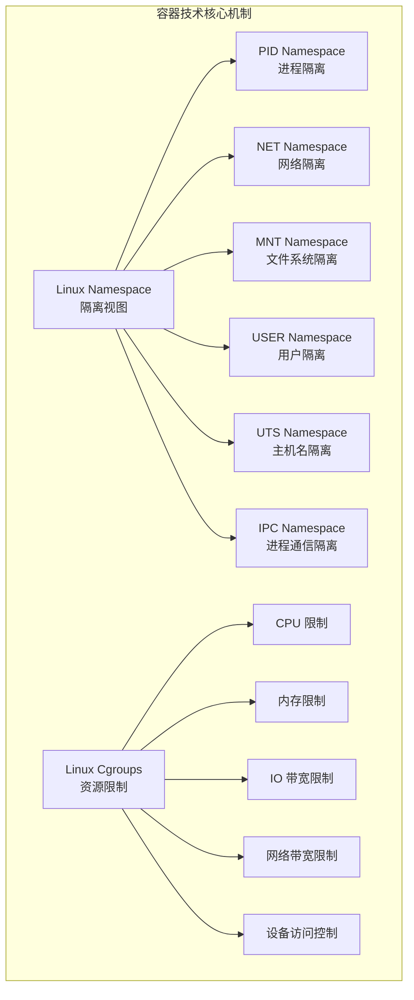
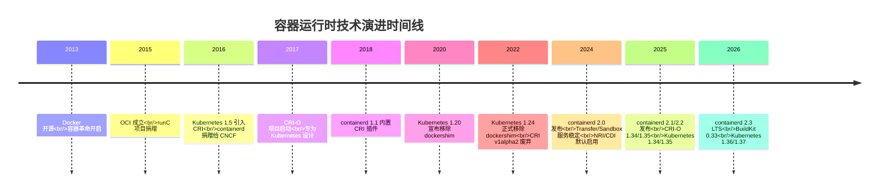
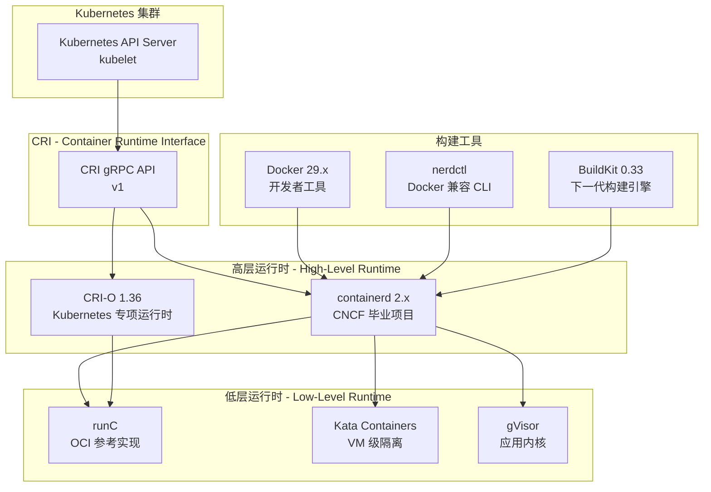
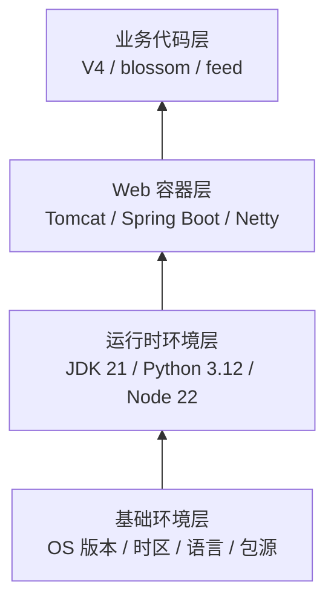
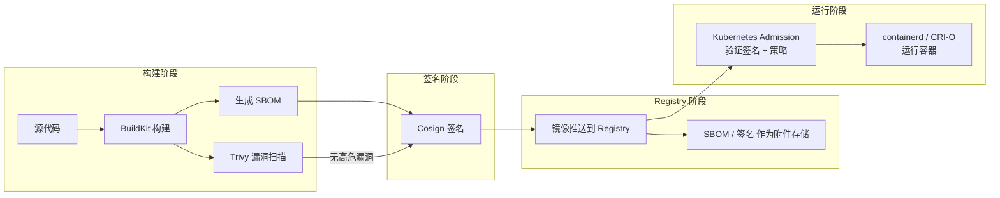
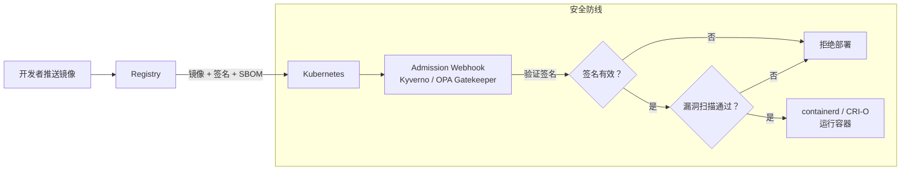
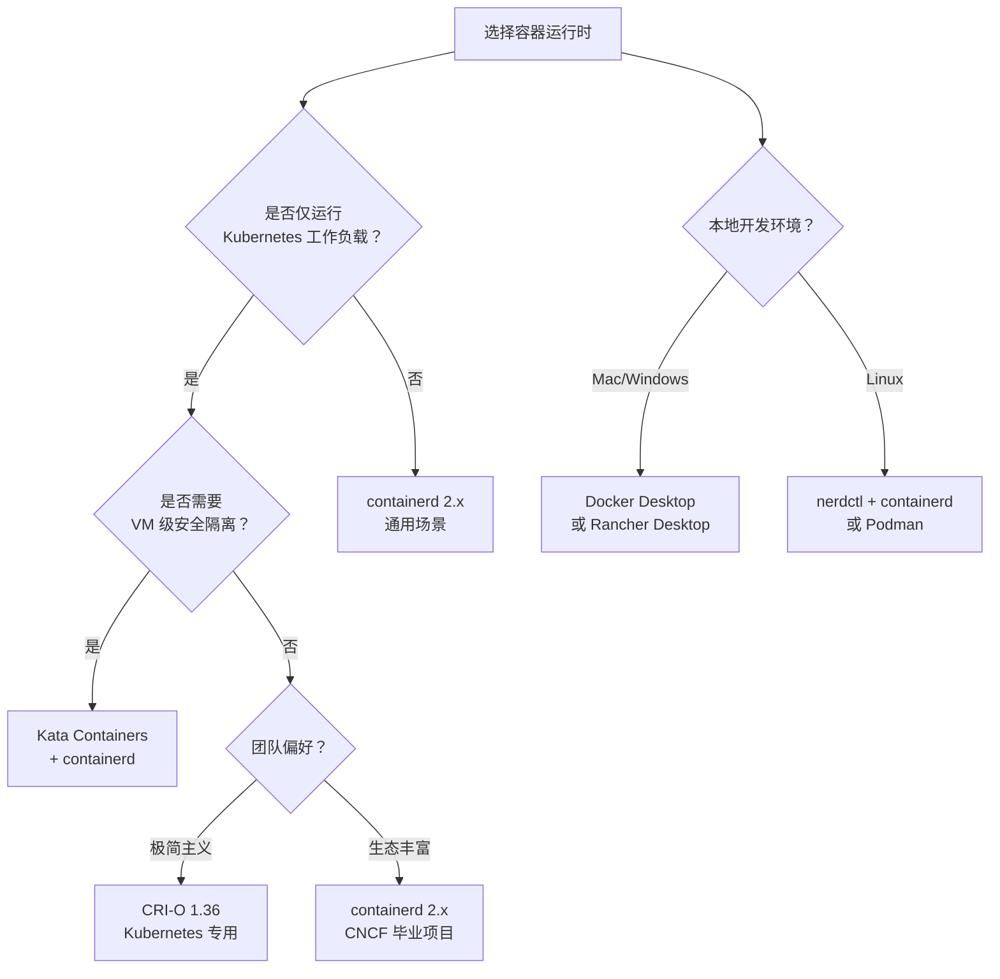

# 微服务为什么要容器化

> 前置知识：[[24-微服务架构该如何落地？]]

专栏前面的文章，我主要给你讲解了微服务架构的基础组成以及在具体落地实践过程中会遇到的问题和解决方案，这些是掌握微服务架构最基础的知识。从今天开始，我们将进一步深入微服务架构进阶的内容，也就是微服务与容器、DevOps 之间的关系。它们三个虽然分属于不同领域，但却有着千丝万缕的关系——可以说没有容器的普及，就没有微服务架构的蓬勃发展，也就没有 DevOps 今天的盛行其道。

之后我还会具体分析它们三者之间是如何紧密联系的，今天我们先来看一个根本性的问题：**微服务为什么要容器化？** 这个问题在 2018 年和 2025 年有着截然不同的答案。早期我们谈论的是"Docker 镜像解决环境一致性"，而今天我们需要站在整个云原生技术栈的视角来重新审视——容器化不仅仅是打包工具的更替，更是微服务从开发到运行时治理的基础设施基石。

## 概述：容器化为何是微服务的必选项

微服务架构将单体应用拆分为多个独立部署的服务单元，这带来了三个核心运维挑战：

1. **环境一致性问题**——开发、测试、生产环境差异导致的"在我机器上能跑"困境
2. **弹性扩缩容问题**——不同微服务依赖不同运行环境，扩容时初始化成本高
3. **供应链安全问题**——微服务数量激增后，镜像来源可信度和漏洞管理成为系统性风险

容器技术通过"打包即运行"的范式解决了前两个问题，而 2024-2025 年云原生生态的成熟（镜像签名、SBOM、运行时安全策略）则补齐了供应链安全的最后一块拼图。下面我们从问题出发，逐步深入。

## 一、微服务带来的运维挑战

### 1.1 环境一致性：从"复制代码"到"复制环境"

单体应用拆分成多个微服务后，能够实现快速开发迭代，但随之带来的问题是测试和运维部署成本的提升。我讲个具体的例子——微博业务早期就是一个大的单体 Web 应用，在测试和运维的时候，只需要把 Web 应用打成一个大的 WAR 包，部署到 Tomcat 中就行了。后来拆分成多个微服务之后，有的业务需求需要同时修改多个微服务的代码，这时候就有多个微服务都需要打包、测试和上线发布，一个业务需求就需要同时测试多个微服务接口的功能，上线发布多个系统，给测试和运维的工作量增加了很多。

DevOps 要求开发、测试和发布的流程必须自动化，这就需要**保证开发人员将自己本地部署测试通过的代码和运行环境，能够复制到测试环境中去，测试通过后再复制到线上环境进行发布**。虽然这个过程看上去好像复制代码一样简单，但在现实中，本地环境、测试环境以及线上环境往往是隔离的，软件配置环境的差异也很大——操作系统版本、运行时版本、系统库版本、时区配置、DNS 配置……任何一环不一致都可能导致服务行为异常。这也导致了开发、测试和发布流程的割裂。

### 1.2 弹性扩缩容：初始化的噩梦

拆分后的微服务相比原来大的单体应用更加灵活，经常要根据实际的访问量情况做在线扩缩容，而且通常会采用在公有云上创建的 ECS 来扩缩容。这给微服务的运维带来另外一个挑战：公有云上创建的 ECS 通常只包含了基本的操作系统环境，微服务运行依赖的软件配置等需要运维再单独进行初始化工作。因为不同的微服务的软件配置依赖不同——Java 服务依赖了 JDK，就需要在 ECS 上安装 JDK，而且可能不同的微服务依赖的 JDK 版本也不相同，新业务可能依赖 JDK 21，而旧业务可能依赖 JDK 8 甚至 JDK 6。为此，服务部署的初始化工作十分繁琐，手动配置既容易出错又难以标准化。

### 1.3 供应链安全：被忽视的第三重挑战

到了 2024-2025 年，随着微服务数量从几十个增长到几百甚至上千个，第三个挑战浮出水面：**镜像供应链安全**。每一个微服务镜像都是一个软件交付单元，它里面包含的每一层依赖都可能是攻击面。如果没有系统性的安全扫描、签名验证和来源追溯机制，一个被注入恶意代码的基础镜像可能同时影响上百个微服务。SolarWinds 事件和 XZ Utils 后门事件已经给整个行业敲响了警钟。

## 二、容器技术：从进程隔离到云原生基石

### 2.1 容器的本质：封装运行环境的"集装箱"

容器（Container）一词又可以翻译成"集装箱"。我们都知道，**集装箱的作用就是，在港口把货物用集装箱封装起来，然后经过货轮从海上运输到另一个港口，再在港口卸载后通过大货车运送到目的地。货物在世界的任何地方流转时，都是在集装箱里封装好的，不需要根据是在货轮上还是大货车上而对货物进行重新装配**。同样，在软件的世界里，容器也起到了相同的作用，只不过它封装的是软件的运行环境。

容器的本质就是 Linux 操作系统里的进程，但与操作系统中运行的一般进程不同的是，容器通过 [Namespace](https://en.wikipedia.org/wiki/Linux_namespaces) 和 [Cgroups](https://zh.wikipedia.org/wiki/Cgroups) 这两种机制，可以拥有自己的 root 文件系统、自己的网络配置、自己的进程空间，甚至是自己的用户 ID 空间，容器里的进程就像是运行在宿主机上的另外一个单独的操作系统内，从而实现与宿主机操作系统里运行的其他进程隔离。



### 2.2 容器 vs 虚拟机：不是替代，是不同层次

容器的概念乍一看与虚拟机有些类似，但它们有着本质的不同：

| 对比维度 | 容器（Container） | 虚拟机（VM） |
|---------|-------------------|-------------|
| 隔离层级 | 进程级隔离（Namespace + Cgroups） | 硬件级隔离（Hypervisor） |
| 内核共享 | 共享宿主机内核 | 独立 Guest OS 内核 |
| 启动速度 | 秒级 | 分钟级 |
| 镜像大小 | MB 级（Alpine 约 5MB） | GB 级 |
| 资源开销 | 极低（无额外 OS 开销） | 较高（每个 VM 需要完整 OS） |
| 安全边界 | 较弱（内核共享，逃逸风险） | 较强（硬件级隔离） |
| 密度 | 单机可运行数百容器 | 单机通常运行数十 VM |
| 适用场景 | 微服务、无状态应用 | 强隔离需求、异构 OS、数据库 |

**关键洞察**：容器和虚拟机不是替代关系，而是互补关系。在生产环境中，常见的模式是"VM 提供硬件隔离边界 + 容器提供应用打包和快速伸缩"，这正是 Kubernetes 节点池的经典部署方式。Kubernetes 1.30+ 还引入了 [User Namespace](https://kubernetes.io/docs/concepts/workloads/pods/user-namespaces/) 支持，通过用户 ID 映射进一步增强容器的安全隔离。

### 2.3 镜像：容器的灵魂

容器解决了应用程序运行时隔离的问题，但是要想实现应用能够从一台机器迁移到另外一台机器上还能正常运行，就必须保证另外一台机器上的运行环境是一致的。Docker 镜像恰恰解决了这个痛点——**Docker 镜像不光可以打包应用程序本身，而且还可以打包应用程序的所有依赖，甚至可以包含整个操作系统**。这样你在本机上运行通过的应用程序，就可以使用镜像把应用程序文件、所有依赖的软件以及操作系统本身都打包成一个镜像，可以在任何一个支持 OCI 标准的容器运行时上运行。

镜像的核心价值在于：

- **环境封装**：应用及其全部依赖打包为不可变制品
- **分层复用**：通过分层存储机制，不同镜像共享相同的基础层
- **可移植性**：基于 OCI（Open Container Initiative）标准，不绑定特定运行时
- **可验证性**：支持签名和摘要（digest），确保镜像未被篡改

## 三、容器运行时生态：从 Docker 到 CRI 时代

### 3.1 技术演进：Docker 不再是唯一答案

原文发表时，Docker 是容器运行时的代名词。但自 Kubernetes 1.24（2022 年 5 月）移除 dockershim 以来，容器运行时生态已经发生了根本性的变化。Docker 作为品牌和工具依然存在，但作为 Kubernetes 的容器运行时，它已经退居幕后。



### 3.2 当代容器运行时架构

今天的容器运行时已经形成了清晰的分层架构：



#### containerd 2.x：云原生的默认运行时

containerd 2.0（2024 年 11 月发布，LTS 支持至 2027 年 3 月）是容器运行时生态的核心。它不仅仅是一个"精简版 Docker"，而是一个面向云原生设计的、可扩展的容器运行时守护进程。关键特性包括：

- **Transfer Service（稳定）**：提供源到目标的统一传输接口，支持镜像的 pull/push/import/export，无需频繁更新协议和 API
- **Sandbox Service（稳定）**：扩展了 shim 管理，为 Pod 和 VM 等多容器环境提供更灵活的生命周期管理
- **NRI（Node Resource Interface）默认启用**：允许第三方插件介入容器的创建和资源分配过程，实现 GPU 分配、网络策略等自定义逻辑
- **CDI（Container Device Interface）默认启用**：为 GPU 等特殊设备提供标准化描述机制，已集成到 Kubernetes Device Plugin 框架
- **CRI v1alpha2 已移除**：仅保留 CRI v1 API，与 Kubernetes 完全对齐
- **User Namespace 支持**：通过用户 ID 映射增强容器安全隔离
- **镜像验证插件**：Transfer Service 支持验证插件，可强制执行镜像签名策略

containerd 版本与 Kubernetes 的对应关系：

| Kubernetes 版本 | 推荐 containerd 版本 | CRI 版本 |
|----------------|---------------------|---------|
| 1.32 | 2.1.0+, 2.0.1+, 1.7.24+ | v1 |
| 1.33 | 2.1.0+, 2.0.4+, 1.7.24+ | v1 |
| 1.34 | 2.1.3+, 2.0.6+, 1.7.28+ | v1 |
| 1.35 | 2.2.0+, 2.1.5+, 1.7.28+ | v1 |
| 1.36 | 2.3.0+, 2.2.0+ | v1 |

> containerd 2.3（2026 年 4 月发布）是当前 LTS 版本，支持周期至 2028 年 4 月。自 2.3 起，containerd 采用与 Kubernetes 同步的 4 个月发布节奏（4/8/12 月）。

#### CRI-O 1.36：Kubernetes 的轻量级选择

CRI-O 是专为 Kubernetes 设计的容器运行时，其设计哲学是"只做 CRI 要求的事"。与 containerd 相比：

| 对比维度 | containerd 2.x | CRI-O 1.36 |
|---------|---------------|------------|
| 设计目标 | 通用容器运行时 | Kubernetes 专用运行时 |
| CRI 支持 | 通过 CRI 插件实现 | 原生实现 |
| 镜像管理 | Transfer Service + 多种 snapshotter | containers/storage + containers/image |
| 监控接口 | CRI + 自有 API | 仅 CRI |
| 扩展机制 | NRI 插件、proxy/binary 插件 | NRI 插件 |
| 社区 | CNCF 毕业项目，生态更大 | Kubernetes SIG-Node 子项目 |
| 适用场景 | 通用场景、混合工作负载 | 纯 Kubernetes 集群、追求极简 |

#### Docker 的角色演变

Docker 并没有消失——它完成了从"运行时"到"开发者工具"的角色转型：

- **Docker 29.x**（2026 年 6 月）底层使用 containerd 作为运行时
- **Docker Desktop** 仍然是本地开发最流行的容器工具
- **Docker Build** 集成 BuildKit 作为构建引擎
- **Docker Scout** 提供镜像安全扫描能力
- Docker 构建的镜像完全符合 OCI 标准，可以在 containerd、CRI-O 上运行

简言之：**Docker 是开发者的入口，containerd/CRI-O 是生产运行时的选择**。

### 3.3 为什么 Kubernetes 选择 CRI 而不是 Docker

Kubernetes 移除 dockershim 不是抛弃 Docker，而是架构上的必然选择：

1. **解耦**：Dockershim 是 Kubernetes 代码库中维护 Docker 适配的薄层，每次 Docker API 变更都需要 K8s 侧同步修改，增加了维护负担
2. **标准化**：CRI 提供了统一的运行时接口，任何实现 CRI 的运行时都可以与 Kubernetes 无缝集成
3. **性能**：去掉 Docker Engine 中间层，kubelet 直接通过 CRI 与 containerd 通信，减少了一次 gRPC 调用开销
4. **安全**：containerd 的攻击面远小于完整的 Docker Engine

## 四、微服务容器化实践

### 4.1 镜像分层设计：从经验法则到工程规范

Docker 能帮助解决服务运行环境可迁移问题的关键就在于镜像的使用。实际在使用镜像时往往并不是把业务代码、依赖的软件环境以及操作系统本身直接都打包成一个镜像，而是利用镜像的**分层机制**，在每一层通过编写 Dockerfile 文件来逐层打包镜像。这是因为虽然不同的微服务依赖的软件环境不同，但还是存在大大小小的相同之处，因此在打包镜像的时候，可以分层设计、逐层复用，减少每一层镜像文件的大小。

以微博的业务镜像为例，大致分为四层：



这样的话，每一层的镜像都是在上一层镜像的基础上添加新的内容组成的。以微博 V4 镜像为例，Dockerfile 内容如下：

```dockerfile
# containerd 2.x / Docker 29.x 兼容
# 第一层：基础环境层
FROM registry.intra.weibo.com/weibo_rd_content/base:ubuntu-22.04-2025q2

# 第二层：运行时环境层
FROM registry.intra.weibo.com/weibo_rd_content/runtime:jdk-21.0.7_tomcat-10.1.40

# 第三层：Web 容器层（JVM 参数调优）
FROM registry.intra.weibo.com/weibo_rd_content/tomcat_feed:jdk21_tomcat10_g1_dns
# G1 GC 配置、DNS 缓存策略等

# 第四层：业务代码层
ADD confs /data1/confs/
ADD node_pool /data1/node_pool/
ADD authconfs /data1/authconfs/
ADD authkey.properties /data1/
ADD watchman.properties /data1/
ADD 200.sh /data1/weibo/bin/200.sh
ADD 503.sh /data1/weibo/bin/503.sh
ADD catalina.sh /data1/weibo/bin/catalina.sh
ADD server.xml /data1/weibo/conf/server.xml
ADD logging.properties /data1/weibo/conf/logging.properties
ADD ROOT /data1/weibo/webapps/ROOT/
RUN chmod +x /data1/weibo/bin/200.sh /data1/weibo/bin/503.sh /data1/weibo/bin/catalina.sh
WORKDIR /data1/weibo/bin
```

`FROM` 代表了上一层镜像文件，从名字可以看出上一层镜像里包含了 Java 运行时环境和 Web 容器；`ADD` 是这一层镜像里添加的文件，主要包含业务代码和配置；`RUN` 代表这一层镜像构建时需要执行的命令；`WORKDIR` 代表容器启动后的工作目录。

### 4.2 镜像优化：构建又小又安全的镜像

在 2025 年，镜像优化已经不仅仅是大小问题，更关乎安全攻击面和供应链可信度。

#### 多阶段构建（Multi-Stage Build）

多阶段构建是消除构建依赖、缩小最终镜像的最有效手段：

```dockerfile
# ---- 构建阶段 ----
FROM eclipse-temurin:21-jdk AS builder   # JDK 21, 2025
WORKDIR /app
COPY . .
RUN ./gradlew bootJar --no-daemon        # Gradle 构建

# ---- 运行阶段 ----
FROM eclipse-temurin:21-jre-alpine       # 仅 JRE, Alpine 基础
WORKDIR /app
COPY --from=builder /app/build/libs/*.jar app.jar
EXPOSE 8080
ENTRYPOINT ["java", "-jar", "app.jar"]
```

构建阶段使用完整 JDK，运行阶段仅包含 JRE 和业务 JAR 包，镜像大小从约 800MB 降至约 200MB。

#### Distroless：极致精简

Google 的 Distroless 镜像只包含应用及其运行时依赖，不包含包管理器、Shell 等工具，攻击面极小：

```dockerfile
# ---- 构建阶段 ----
FROM eclipse-temurin:21-jdk AS builder
WORKDIR /app
COPY . .
RUN ./gradlew bootJar --no-daemon

# ---- 运行阶段：Distroless ----
FROM gcr.io/distroless/java21-debian12:nonroot
COPY --from=builder /app/build/libs/*.jar app.jar
EXPOSE 8080
ENTRYPOINT ["java", "-jar", "app.jar"]
# 没有 Shell，无法 exec 进入容器
# 没有 apk/apt/yum，无法安装额外软件
# nonroot tag 以非 root 用户运行
```

#### 镜像基础选择对比

| 基础镜像 | 大小 | 包管理器 | Shell | 安全攻击面 | 适用场景 |
|---------|------|---------|-------|-----------|---------|
| Ubuntu 22.04 | ~77MB | apt | bash | 大 | 需要调试和系统工具 |
| Alpine 3.21 | ~5MB | apk | ash/sh | 中 | 追求极致体积 |
| Distroless | ~20MB | 无 | 无 | 极小 | 生产环境推荐 |
| Scratch | 0MB | 无 | 无 | 零 | 静态编译的 Go/Rust 程序 |

```dockerfile
# Go 微服务：Scratch 基础镜像
FROM golang:1.23 AS builder
WORKDIR /app
COPY . .
RUN CGO_ENABLED=0 GOOS=linux go build -o server .

FROM scratch
COPY --from=builder /app/server /server
COPY --from=builder /etc/ssl/certs/ca-certificates.crt /etc/ssl/certs/
ENTRYPOINT ["/server"]
```

> **实践建议**：开发环境使用 Alpine/Ubuntu 方便调试；生产环境使用 Distroless 或 Scratch，通过 `docker exec` 无法进入容器，需使用 `kubectl debug` 或 `kubectl logs` 排查问题。

### 4.3 BuildKit：下一代构建引擎

BuildKit（当前 v0.33）是 Docker Engine 默认的构建后端，相比传统 docker build 有显著优势：

- **并行构建**：自动识别无依赖关系的构建步骤并行执行
- **缓存导入/导出**：支持将构建缓存推送到 Registry，CI/CD 中跨流水线复用
- **多平台构建**：无需 QEMU，直接交叉编译多架构镜像
- **Secret 挂载**：`--mount=type=secret` 安全传递构建凭据，不留在镜像层
- **SSH Agent 转发**：构建时安全拉取私有 Git 仓库

```dockerfile
# syntax=docker/dockerfile:1.24
# BuildKit 高级特性示例

# 并行构建多个二进制
FROM golang:1.23 AS builder-api
RUN --mount=type=cache,target=/go/pkg/mod \
    --mount=type=bind,source=.,target=/src \
    cd /src && CGO_ENABLED=0 go build -o /api ./cmd/api

FROM golang:1.23 AS builder-worker
RUN --mount=type=cache,target=/go/pkg/mod \
    --mount=type=bind,source=.,target=/src \
    cd /src && CGO_ENABLED=0 go build -o /worker ./cmd/worker

# 使用 secret 安全拉取私有依赖
FROM node:22-alpine AS builder-frontend
RUN --mount=type=secret,id=npmrc,target=/root/.npmrc \
    npm ci --production

# 最终镜像
FROM gcr.io/distroless/static-debian12:nonroot
COPY --from=builder-api /api /api
COPY --from=builder-worker /worker /worker
```

## 五、镜像安全：2025 年的必答题

### 5.1 供应链安全全景

2024-2025 年，容器镜像安全已经从"可选"变成"必选"，形成了从构建到运行的全链路安全体系：



### 5.2 Trivy：一体化安全扫描

[Trivy](https://github.com/aquasecurity/trivy)（当前 v0.74）是 CNCF 毕业项目，提供了一体化的安全扫描能力：

```bash
# Trivy v0.74 - 扫描镜像漏洞
trivy image --severity HIGH,CRITICAL my-registry/my-service:v2.1.0

# 生成 SBOM（Software Bill of Materials）
trivy image --format spdx-json --output sbom.json my-registry/my-service:v2.1.0

# 扫描 SBOM 中的漏洞（离线扫描）
trivy sbom --severity HIGH,CRITICAL sbom.json

# 扫描 IaC 配置（Terraform, K8s Manifest）
trivy config ./k8s-manifests/

# 扫描 Secret 泄露
trivy fs --scanners secret ./src/
```

Trivy 的核心能力：

| 扫描类型 | 说明 | 集成方式 |
|---------|------|---------|
| OS 漏洞 | 扫描 Alpine/Debian/Ubuntu 等系统包 | CI Pipeline |
| 语言漏洞 | 扫描 npm/pip/go.mod/maven 等依赖 | CI Pipeline |
| Secret 检测 | 检测硬编码的密钥、Token | Pre-commit / CI |
| IaC 扫描 | 检测 K8s Manifest / Terraform 配置风险 | CI Pipeline |
| License 合规 | 检测开源协议合规性 | CI Pipeline |
| SBOM 生成 | 生成 SPDX/CycloneDX 格式的物料清单 | 构建阶段 |

### 5.3 Cosign：镜像签名与验证

[Cosign](https://github.com/sigstore/cosign)（当前 v3.1）是 [Sigstore](https://www.sigstore.dev/) 项目的核心工具，为容器镜像提供密钥签名和验证能力：

```bash
# Cosign v3.1 - 生成密钥对
cosign generate-key-pair

# 对镜像签名（Key 模式）
cosign sign --key cosign.key my-registry/my-service:v2.1.0

# 对镜像签名（Keyless 模式 - 使用 OIDC 身份 + Fulcio CA）
cosign sign my-registry/my-service:v2.1.0
# 自动使用 GitHub/GitLab/Google 身份签名
# 签名记录存储在 Rekor 透明日志中

# 验证镜像签名
cosign verify --key cosign.pub my-registry/my-service:v2.1.0

# 附加 SBOM 到镜像（作为 Referrer）
cosign attach sbom --sbom sbom.json my-registry/my-service:v2.1.0

# 验证 SBOM 签名
cosign verify-attestation --key cosign.pub \
  --type spdxjson my-registry/my-service:v2.1.0
```

**Keyless 签名**是 Cosign 的革命性特性：开发者不需要管理密钥，签名时使用 OIDC 身份（如 GitHub 账号）进行身份验证，签名记录自动存入 Rekor 透明日志，任何人都可以审计。

### 5.4 Kubernetes 准入控制：运行时策略执行

签名和扫描是"防"，准入控制是"守"。在 Kubernetes 中，通过 Admission Webhook 强制执行镜像安全策略：

```yaml
# Cosign + Gatekeeper / Kyverno 策略示例（Kyverno）
apiVersion: kyverno.io/v1
kind: ClusterPolicy
metadata:
  name: verify-image-signature
spec:
  failureAction: Enforce  # 强制拒绝未签名镜像（1.13 起替代 validationFailureAction）
  rules:
    - name: verify-cosign-signature
      match:
        any:
          - resources:
              kinds:
                - Pod
      verifyImages:
        - imageReferences:
            - "my-registry.io/*"
          attestors:
            - entries:
                - keys:
                    publicKeys: |-
                      -----BEGIN PUBLIC KEY-----
                      ...
                      -----END PUBLIC KEY-----
```



## 六、架构决策指南

### 6.1 容器运行时选型决策树



### 6.2 镜像策略选型矩阵

| 场景 | 基础镜像 | 安全策略 | 构建工具 |
|------|---------|---------|---------|
| Java 微服务（生产） | Distroless Java 21 | Cosign 签名 + Trivy 扫描 | BuildKit 多阶段 |
| Java 微服务（开发） | Eclipse Temurin Alpine | Trivy 扫描 | BuildKit |
| Go 微服务 | Scratch | Cosign + SBOM | BuildKit 多阶段 |
| Node.js 微服务 | Distroless Node 22 | Cosign + Trivy | BuildKit 多阶段 |
| Python 微服务 | Distroless Python 3.12 | Cosign + Trivy | BuildKit 多阶段 |
| 需要调试的遗留服务 | Ubuntu 22.04 | Trivy 扫描 | 传统 Dockerfile |

### 6.3 从 Docker 迁移到 containerd 的检查清单

如果你的 Kubernetes 集群还在使用 Docker 作为运行时，以下是迁移检查清单：

| 检查项 | 说明 | 影响 |
|-------|------|------|
| 日志驱动 | Docker 使用 json-file，containerd 使用 CRI 日志 | 日志采集适配 |
| 监控指标 | Docker 有自有的 metrics API | 切换到 kubelet metrics |
| 镜像拉取 | Docker Hub 镜像兼容 OCI 标准 | 无影响 |
| 特权容器 | 行为基本一致 | 需回归测试 |
| `docker exec` | 需改用 `kubectl exec` 或 `crictl exec` | 运维脚本修改 |
| `docker logs` | 需改用 `kubectl logs` 或 `crictl logs` | 运维脚本修改 |
| `docker ps` | 需改用 `kubectl get pods` 或 `crictl ps` | 运维脚本修改 |
| 构建流程 | BuildKit 独立于运行时 | 无影响 |
| 私有 Registry | containerd 支持 `config_path` 配置 | 配置迁移 |
| NRI 插件 | containerd 2.0+ 默认启用 | 可选增强 |

## 七、技术演进时间线

| 时间 | 里程碑 | 对微服务的影响 |
|------|-------|--------------|
| 2013 | Docker 开源 | 容器化成为可能 |
| 2015 | OCI 成立、Kubernetes 1.0 | 容器标准化起步 |
| 2016 | Kubernetes 引入 CRI | 运行时解耦 |
| 2018 | containerd 1.1 内置 CRI | containerd 可直接用于 K8s |
| 2020 | Kubernetes 1.20 宣布移除 dockershim | Docker 运行时退场倒计时 |
| 2022 | Kubernetes 1.24 移除 dockershim | CRI 生态正式确立 |
| 2023 | SLSA 框架 v1.0 发布 | 供应链安全标准化 |
| 2024 | containerd 2.0 发布；NRI/CDI 默认启用 | 运行时可扩展性成熟 |
| 2024 | Sigstore/Cosign 广泛采用 | 镜像签名成为行业标配 |
| 2025 | containerd 2.1/2.2；Kubernetes 1.34/1.35 | User Namespace 稳定 |
| 2026 | containerd 2.3 LTS；Kubernetes 1.36/1.37 | 完整供应链安全链路 |

## 小结

今天我给你讲解了微服务拆分后带来的三个核心运维挑战：环境一致性、弹性扩缩容初始化、以及供应链安全。容器技术通过镜像的不可变封装解决了环境一致性问题，通过分层复用和快速启动解决了扩缩容初始化问题，而 2024-2025 年成熟的安全工具链（Trivy + Cosign + SBOM + Admission Policy）则补齐了供应链安全的最后一块拼图。

几个关键认知更新：

1. **容器运行时已从 Docker 演进到 CRI 时代**——containerd 2.x 和 CRI-O 是生产环境的选择，Docker 回归开发者工具定位
2. **镜像安全不再是可选项**——Trivy 扫描 + Cosign 签名 + SBOM 生成应内建到 CI/CD 流水线
3. **镜像优化有成熟方法论**——多阶段构建 + Distroless/Scratch 基础镜像 + BuildKit 缓存复用
4. **容器和虚拟机是互补关系**——VM 提供隔离边界，容器提供打包和弹性，User Namespace 进一步增强容器安全

正是因为容器技术做到了"一处构建、处处运行"，解决了应用程序在开发、测试、生产环境之间移植难的痛点，极大提高了运维自动化水平，为 DevOps 理念的流行和业务上云提供了基础。但容器也不是"银弹"——引入容器后，旧的针对物理机的运维模式无法适应，需要一种新的针对容器的运维模式。所以接下来，我将分三期给你详细讲解微服务容器化后该如何运维。

## 思考题

1. 容器和虚拟机不是替代关系而是互补关系，在你的生产环境中，哪些微服务适合用 VM 级隔离（如 Kata Containers），哪些用普通容器就够了？划分的依据是什么？
2. 如果要求所有上线镜像必须经过 Cosign 签名验证，你们的 CI/CD 流水线需要做哪些改造？Keyless 模式和 Key 模式各有什么优劣？


