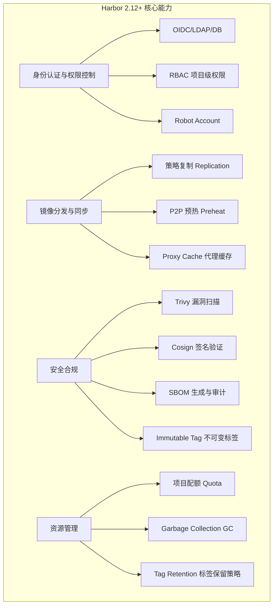
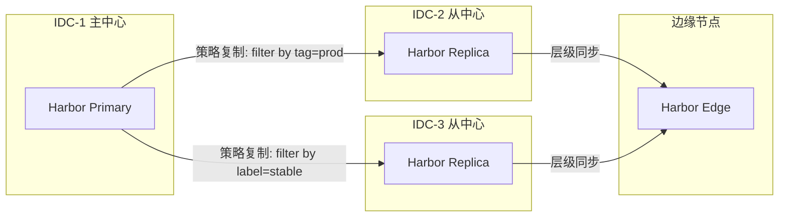
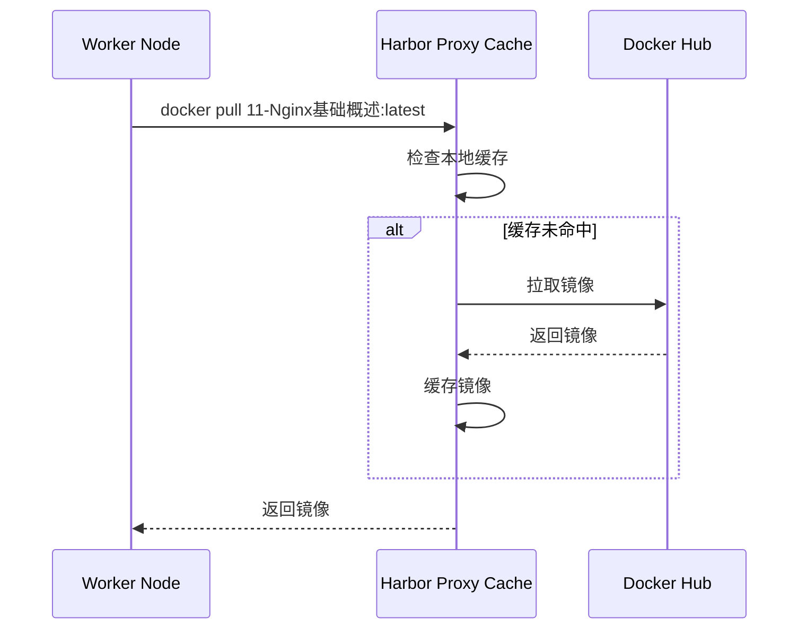
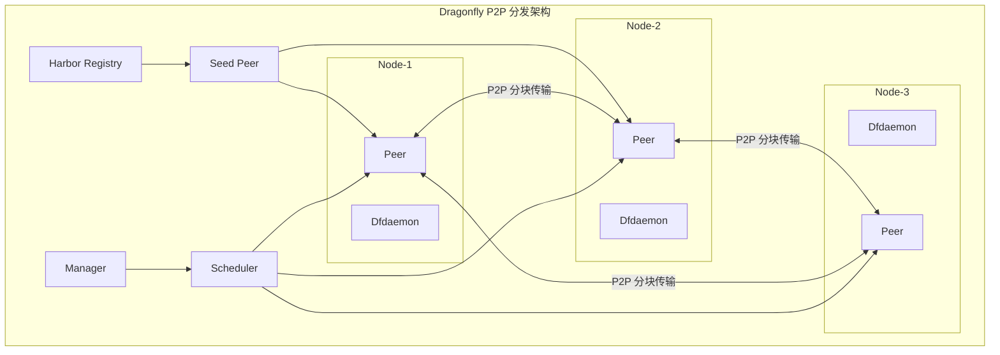
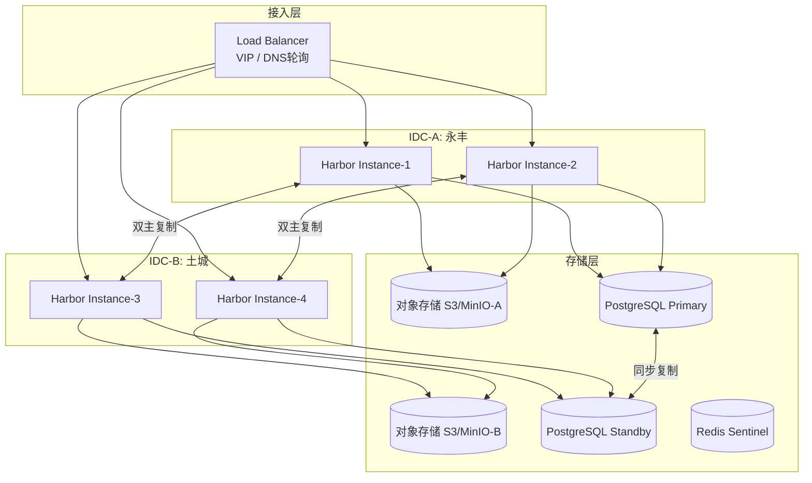
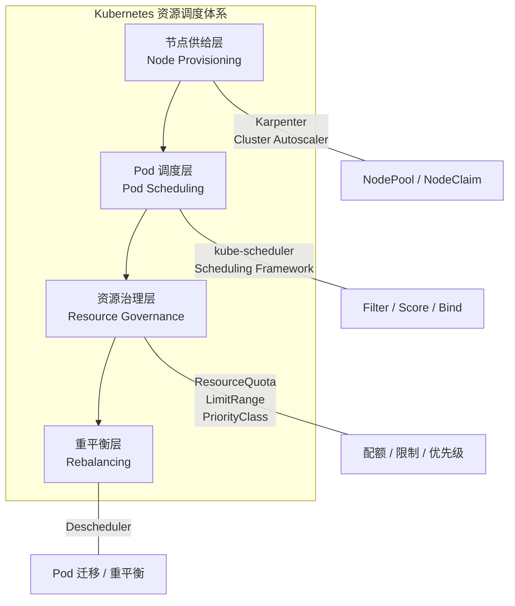
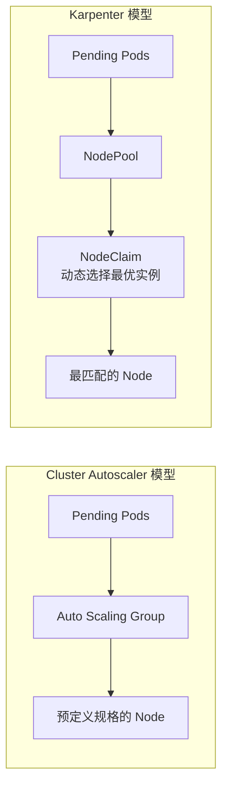
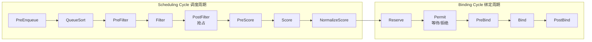
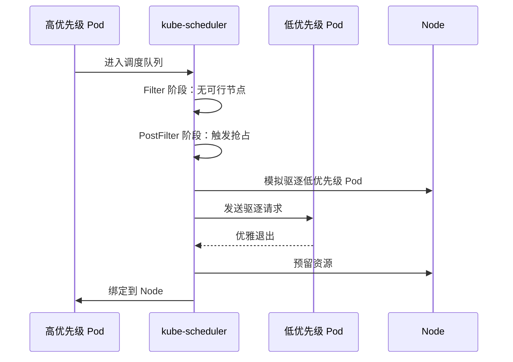

# 微服务容器化运维：镜像仓库与资源调度

> 版本基线：Harbor 2.12+ | Kubernetes 1.30+ | Karpenter v1.14+ | Descheduler 0.31+
> 前置知识：[[25]] 微服务为什么要容器化？

上一期我们讨论了容器化技术如何解决微服务拆分后的测试与发布复杂度问题——容器化天生就是为微服务而生的。但微服务容器化之后，又带来了一个全新的挑战：**容器的运维问题**。

为什么微服务容器化的运维会成为新问题？在容器化之前，服务部署在物理机或虚拟机上，运维团队通常有一套成熟的运维平台来完成服务的发布、扩缩容和故障恢复。以微博的运维平台 JPool 为例：服务发布时，JPool 根据集群和服务池定位到对应的机器 IP，通过 Puppet 等工具分批逐次发布代码并重启服务。但容器化之后，运维面对的不再是有固定 IP 的物理机/虚拟机，而是生命周期短暂、IP 不固定的 Docker 容器。传统的运维模式必须彻底变革。

这时候就需要一个**面向容器的新型运维平台**——它能在物理机/虚拟机上创建容器，并像管理物理机一样对容器全生命周期进行管理。根据业界实践，一个容器运维平台通常包含以下核心组成：

| 组成部分 | 职责 | 核心技术 |
|---------|------|---------|
| 镜像仓库 | 容器镜像的存储、分发与安全管控 | Harbor、Dragonfly |
| 资源调度 | 计算资源的统一管理与按需分配 | Kubernetes、Karpenter |
| 容器调度 | 容器在集群中的最优放置 | kube-scheduler |
| 服务编排 | 微服务间的依赖与生命周期管理 | Helm、ArgoCD |

本文聚焦**镜像仓库**和**资源调度**两大主题，下两期将深入容器调度与服务编排。

---

## 一、镜像仓库：从存储中心到安全枢纽

### 1.1 为什么需要私有镜像仓库

Docker 容器运行依托的是 Docker 镜像。要发布服务，首先必须把镜像分发到各个节点上去——这就是**镜像仓库（Container Registry）**的职责。镜像仓库的概念类似 Git 代码仓库：集中存储镜像，各节点在发布时从仓库拉取镜像、启动容器。

Docker 官方提供了 Docker Hub（https://hub.docker.com/），测试或小规模业务可以直接使用。但对于生产环境，几乎所有团队都会搭建**私有镜像仓库**，原因有三：

- **安全合规**：商业镜像不能暴露在公网，必须在内网闭环管理
- **访问速度**：公网下载受带宽限制，大规模集群拉取镜像时瓶颈明显
- **供应安全**：避免对单一公网服务的依赖，防止服务中断

### 1.2 Harbor：CNCF 毕业级企业镜像仓库

Harbor 是由 VMware 开源、CNCF 毕业的项目，已成为企业级私有镜像仓库的事实标准。从 1.x 到 2.12+，Harbor 已从单纯的镜像存储演进为**集安全扫描、策略复制、内容信任于一体的 Artifact 管理平台**。



#### 1.2.1 权限控制：从两层门禁到零信任

镜像仓库首先要解决权限控制问题——哪些用户可以拉取镜像，哪些用户可以修改镜像。Harbor 2.x 的权限体系远超早期的"登录+项目角色"两层模型：

| 层次 | 机制 | 说明 |
|------|------|------|
| 身份认证 | OIDC / LDAP / DB / UAA | 对接企业 SSO，支持 SAML 2.0 和 OIDC 协议 |
| 项目级 RBAC | 项目管理员/开发者/客人/受限客人 | 细粒度控制镜像的 push/pull 权限 |
| Robot Account | 系统级/项目级机器人账号 | 为 CI/CD 流水线提供受限凭据，可设过期时间 |
| 不可变标签 | Immutable Tag Rule | 防止已发布镜像被覆盖或删除 |
| 审计日志 | Audit Log | 记录所有 push/pull/delete/scan 操作，满足合规要求 |

用办公楼的类比来理解：进入大厦需要门禁卡（身份认证），进入楼层需要楼层权限（项目 RBAC），某些房间需要特殊钥匙（Robot Account），保险柜一旦封存不可修改（Immutable Tag），而所有进出记录都被监控留存（审计日志）。

```yaml
# Harbor 2.12+ - Robot Account 配置示例
apiVersion: v1
kind: Secret
metadata:
  name: harbor-robot-token
type: Opaque
data:
  token: <robot-account-token>
---
# 在 CI/CD 中使用 Robot Account 登录
# docker login harbor.example.com -u robot\$project+ci-bot -p <token>
```

#### 1.2.2 镜像同步：从主从复制到策略驱动

在生产环境中，镜像需要同时发布到几十甚至上百个集群节点，单个镜像仓库实例的带宽无法满足。Harbor 2.x 的**策略复制（Policy-based Replication）**替代了早期简单的"一主多从"模式：



**策略复制**的核心能力：

- **过滤条件**：按 tag、label、资源类型过滤，只同步需要的镜像（如只同步 `prod-*` 标签）
- **触发模式**：事件驱动（push 即同步）或定时同步
- **覆盖策略**：可选跳过、覆盖或保留目标已有镜像
- **层级同步**：支持从主 IDC 到从 IDC 再到边缘 IDC 的链式分发

Harbor 还支持**双主复制（Bidirectional Replication）**：两个 IDC 的 Harbor 实例互相同步，任一 IDC 故障时另一 IDC 仍可提供服务且不丢失数据。微博的镜像仓库正是采用此方案，部署在永丰、土城两个内网 IDC，通过双主复制实现高可用。

#### 1.2.3 安全扫描：从可选到强制

Harbor 2.x 将**安全合规**从可选功能提升为核心能力：

| 安全能力 | 实现方式 | 价值 |
|---------|---------|------|
| 漏洞扫描 | 内置 Trivy 扫描器 | 自动发现镜像中的 CVE 漏洞 |
| 签名验证 | Cosign (Sigstore) | 确保镜像未被篡改，供应链安全 |
| SBOM 生成 | 自动生成软件物料清单 | 满足 SLSA/SSDF 合规要求 |
| 阻断策略 | Vulnerability Preventive Policy | 阻止有严重漏洞的镜像部署 |
| 安全中心 | Security Hub | 聚合查看所有项目的安全态势 |

```yaml
# Harbor 2.12+ - 阻断策略配置（CLI/API）
# 阻止有 Critical 漏洞的镜像被 pull
# 通过 Web UI: Configuration -> Security -> Prevent vulnerable images from running
# 设置阈值为 Critical 或 High
```

#### 1.2.4 Proxy Cache：加速公网镜像拉取

对于 Docker Hub、GCR、Quay 等公网镜像，Harbor 2.x 提供了**Proxy Cache**功能：配置一个 Harbor 项目作为远程仓库的代理缓存，首次拉取时 Harbor 从远程下载并缓存，后续拉取直接从 Harbor 本地返回，大幅提升速度并减少公网带宽消耗。



### 1.3 镜像分发加速：P2P 方案

在大规模集群（数百节点同时拉取镜像）场景下，即便有多个 Harbor 实例做负载均衡，仍然可能遇到带宽瓶颈。这时需要引入 **P2P 镜像分发**方案。

CNCF 毕业项目 **Dragonfly**（蜻蜓）是当前最成熟的 P2P 镜像分发系统，已于 2025 年 7 月正式成为 CNCF Graduated 项目。其核心架构包括：

| 组件 | 职责 |
|------|------|
| Manager | 集群管理、调度策略、控制面 |
| Scheduler | P2P 调度，决定 Peer 间的分块传输策略 |
| Dfdaemon | 部署在每个节点上的 Peer 代理，拦截镜像拉取请求 |
| Seed Peer | 种子节点，从 Registry 拉取原始数据 |



**主从复制 vs P2P 方案对比**：

| 维度 | Harbor 主从复制 | Dragonfly P2P |
|------|----------------|---------------|
| 原理 | 仓库级全量/增量同步 | 节点级分块 P2P 传输 |
| 扩展性 | 受仓库实例数限制 | 线性扩展，节点越多越快 |
| 带宽利用 | 集中出口带宽 | 利用各节点空闲上行带宽 |
| 一致性 | 强一致（仓库同步） | 最终一致（哈希校验保证） |
| 适用场景 | 跨 IDC 同步、灾备 | 大规模集群并发拉取 |
| 部署复杂度 | 低（Harbor 原生） | 中（需额外组件） |
| 推荐策略 | **两者互补**：跨 IDC 用 Replication，集群内用 P2P Preheat | |

Harbor 2.x 已原生集成 Dragonfly 的 P2P Preheat 功能：在镜像 push 后自动触发 P2P 预热，将镜像分块预热到集群各节点，实现秒级拉取。

### 1.4 高可用设计

镜像仓库的高可用性直接影响服务的发布和恢复能力。基于 Harbor 的企业级高可用架构通常包含以下层面：



关键设计要点：

1. **多实例部署**：每个 IDC 部署 2+ Harbor 实例，前端 Load Balancer 做流量分发
2. **存储分离**：镜像数据存对象存储（S3/MinIO），元数据存 PostgreSQL，两者均做跨 IDC 复制
3. **双主复制**：IDC 间 Harbor 双向同步，任一 IDC 故障不影响服务
4. **Redis Sentinel**：Harbor 依赖 Redis 做任务队列和缓存，需保证高可用

---

## 二、资源调度：从机器管理到弹性算力

解决了镜像存储与分发问题后，下一个关键问题：**Docker 镜像要分发到哪些机器上？这些机器从哪里来？** 这就是资源调度的核心命题。

### 2.1 集群类型的演进

服务部署的集群经历了从物理机到虚拟机再到云原生的演进：

| 集群类型 | 代表技术 | 优势 | 劣势 |
|---------|---------|------|------|
| 物理机集群 | DELL/HPE 服务器 | 性能独占、安全可控 | 配置碎片化、扩缩容慢、利用率低 |
| 虚拟机集群 | OpenStack、VMware | 资源池化、按需分配 | 虚拟化开销、运维复杂 |
| 公有云集群 | AWS/Azure/GCP ECS | 分钟级弹性、配置统一 | 成本不可控、供应商锁定 |
| Kubernetes 集群 | K8s + 云/自建 | 声明式管理、自动调度 | 学习曲线陡峭、生态复杂 |

**现代微服务架构的标准答案是 Kubernetes**——它将资源调度、容器调度和服务编排统一到一个平台中，并提供声明式 API 和自动化运维能力。但这并不意味着历史包袱可以忽略，许多企业的演进路径是：物理机 → 虚拟机私有云 → 混合云 → Kubernetes。

### 2.2 Kubernetes 资源调度体系

Kubernetes 的资源调度是一个多层体系，每一层解决不同层面的问题：



### 2.3 节点供给：Karpenter 重新定义弹性伸缩

在 Kubernetes 生态中，**节点自动伸缩**一直由 Cluster Autoscaler 承担。但随着云厂商实例类型的爆炸式增长（仅 AWS 就有 800+ 实例类型），Cluster Autoscaler 基于 NodeGroup 的模型显得力不从心。

**Karpenter**（由 AWS 开源，已迁至 kubernetes-sigs 组织）从 2024 年发布 v1.0 到当前的 v1.14，已成为节点自动伸缩的新一代标准。它的核心设计理念是 **"Just-in-time Nodes"**——按需即时供给节点。



**Cluster Autoscaler vs Karpenter 对比**：

| 维度 | Cluster Autoscaler | Karpenter |
|------|-------------------|-----------|
| 供给模型 | 基于 NodeGroup/ASG | 基于 NodePool + NodeClaim |
| 实例选择 | 预定义几种规格 | 动态从全量实例类型中选择最优 |
| 供给速度 | 1-3 分钟 | 秒级（直接调用云 API） |
| 整合策略 | Scale Down 仅删除空节点 | Consolidation 主动合并低利用率节点 |
| 漂移检测 | 无 | Drift Detection：检测配置偏差并自动修复 |
| 过期策略 | 无 | ExpireAfter：自动轮换老化节点 |
| 多云支持 | 各云厂商独立实现 | 统一 API，Provider 接口扩展 |
| K8s 版本 | 跟随 Kubernetes 各版本发布 | 1.25+ |

```yaml
# Karpenter v1.12 - NodePool 配置示例
apiVersion: karpenter.sh/v1
kind: NodePool
metadata:
  name: general-purpose
spec:
  template:
    metadata:
      labels:
        billing-team: platform
    spec:
      nodeClassRef:
        group: karpenter.k8s.aws
        kind: EC2NodeClass
        name: default
      taints:
        - key: example.com/special-taint
          effect: NoSchedule
      startupTaints:          # 临时污点，DaemonSet 初始化后移除
        - key: example.com/another-taint
          effect: NoSchedule
      expireAfter: 720h       # 节点最长存活 30 天，自动轮换
  disruption:
    consolidationPolicy: WhenEmptyOrUnderutilized  # 主动整合
    consolidateAfter: 1m    # 空闲 1 分钟后开始整合
    budgets:
      - nodes: "10%"         # 每次最多中断 10% 节点
  limits:
    cpu: "1000"
  weight: 10
```

**Karpenter 的三种自动中断机制**：

1. **Consolidation（整合）**：当节点利用率低时，Karpenter 主动将 Pod 迁移到更合适的节点，释放空闲节点
2. **Drift（漂移检测）**：当节点配置与 NodePool/NodeClass 定义不一致时（如 AMI 更新、安全组变更），自动替换节点
3. **Expiration（过期）**：节点运行超过 `expireAfter` 时限后自动替换，避免长期运行带来的安全风险和碎片化

### 2.4 Pod 调度：Kubernetes 调度框架

有了节点之后，Pod 应该调度到哪个节点？这是 **kube-scheduler** 的职责。从 Kubernetes 1.19 开始，Scheduling Framework 成为稳定特性，将调度过程拆解为可插拔的扩展点：



**各扩展点详解**：

| 扩展点 | 阶段 | 作用 | 示例插件 |
|--------|------|------|---------|
| PreEnqueue | 入队前 | 检查 Pod 是否可进入调度队列 | SchedulingGates |
| QueueSort | 排序 | 决定 Pod 在队列中的优先级 | PrioritySort |
| PreFilter | 预过滤 | 预处理 Pod 信息，检查前置条件 | NodePorts, PodTopologySpread |
| Filter | 过滤 | 排除不满足条件的节点 | NodeName, NodeAffinity, TaintToleration |
| PostFilter | 后过滤 | 无可行节点时的兜底（抢占） | DefaultPreemption |
| PreScore | 预评分 | 为评分阶段准备共享状态 | InterPodAffinity |
| Score | 评分 | 对可行节点打分排序 | NodeResourcesFit, ImageLocality |
| NormalizeScore | 标准化 | 将评分归一化到统一范围 | 各 Score 插件 |
| Reserve | 预留 | 预留资源，防止并发冲突 | VolumeBinding |
| Permit | 许可 | 可暂停绑定等待外部条件 | WaitForPodsReady |
| PreBind | 预绑定 | 绑定前的最后校验 | VolumeBinding |
| Bind | 绑定 | 将 Pod 绑定到节点 | DefaultBinder |
| PostBind | 绑定后 | 绑定成功后的通知/清理 | 无默认插件 |

#### SchedulingGates：调度门控

Kubernetes 1.26+ 引入的 **SchedulingGates** 允许外部控制器"暂停"Pod 调度，直到满足特定条件：

```yaml
# SchedulingGates 示例 - 等待外部控制器移除 gate
apiVersion: v1
kind: Pod
metadata:
  name: gated-pod
spec:
  schedulingGates:
    - name: example.com/feature-dependency  # 自定义 gate 名称
  containers:
    - name: app
      image: 11-Nginx基础概述:latest
      resources:
        requests:
          cpu: "1"
          memory: "1Gi"
# 当外部控制器就绪后，移除 schedulingGates，Pod 进入正常调度流程
```

#### Dynamic Resource Allocation (DRA)

Kubernetes 1.26 引入 alpha、1.30 升级为 beta 的 **Dynamic Resource Allocation** 是调度框架的重大演进，它替代了传统的 Device Plugin 模型，支持：

- 通用资源声明（GPU、FPGA、RDMA 等）
- 资源参数化配置（如 GPU 显存大小）
- 结构化参数（Structured Parameters，1.30+）
- 多资源联合分配

```yaml
# DRA 示例 - Kubernetes 1.34+（GA，resource.k8s.io/v1）
apiVersion: resource.k8s.io/v1
kind: ResourceClaim
metadata:
  name: gpu-claim
spec:
  deviceClassName: gpu.nvidia.com
---
apiVersion: v1
kind: Pod
metadata:
  name: gpu-workload
spec:
  resourceClaims:
    - name: gpu
      resourceClaimName: gpu-claim
  containers:
    - name: app
      image: ml-training:latest
      command: ["python", "train.py"]
```

### 2.5 资源治理：配额、限制与优先级

在多租户共享集群的场景下，不加约束的资源使用会导致"公地悲剧"——某个团队消耗过多资源，影响其他团队的服务质量。Kubernetes 提供了三层资源治理机制：

#### 2.5.1 ResourceQuota：命名空间级配额

ResourceQuota 在命名空间级别限制资源总量，防止单个租户过度占用：

```yaml
# ResourceQuota 示例 - Kubernetes 1.30+
apiVersion: v1
kind: ResourceQuota
metadata:
  name: team-a-quota
  namespace: team-a
spec:
  hard:
    # 计算资源
    requests.cpu: "20"
    requests.memory: 40Gi
    limits.cpu: "40"
    limits.memory: 80Gi
    # 存储资源
    requests.storage: "500Gi"
    persistentvolumeclaims: "20"
    # 临时存储
    requests.ephemeral-storage: "100Gi"
    limits.ephemeral-storage: "200Gi"
    # 对象数量
    pods: "50"
    services: "10"
    configmaps: "50"
    secrets: "50"
    replicationcontrollers: "20"
  scopeSelector:
    matchExpressions:
      - operator: In
        scopeName: PriorityClass
        values: ["high-priority", "medium-priority"]
```

**ResourceQuota 支持的资源类型**：

| 类别 | 资源名 | 说明 |
|------|--------|------|
| 计算资源 | `requests.cpu`, `limits.cpu` | CPU 配额 |
| 计算资源 | `requests.memory`, `limits.memory` | 内存配额 |
| 存储资源 | `requests.storage` | 存储总量 |
| 存储资源 | `persistentvolumeclaims` | PVC 数量 |
| 临时存储 | `requests.ephemeral-storage` | 临时存储（日志、缓存等） |
| 对象数量 | `pods`, `services`, `configmaps`, `secrets` | API 对象数量限制 |

#### 2.5.2 LimitRange：Pod 级默认约束

ResourceQuota 要求每个 Pod 都设置资源请求和限制，但这对开发者来说很繁琐。**LimitRange** 可以自动为未设置资源的 Pod 注入默认值，并限制单个资源对象的范围：

```yaml
# LimitRange 示例 - Kubernetes 1.30+
apiVersion: v1
kind: LimitRange
metadata:
  name: default-limits
  namespace: team-a
spec:
  limits:
    - type: Container
      default:              # 默认 limits（未设置时注入）
        cpu: "500m"
        memory: "256Mi"
      defaultRequest:       # 默认 requests（未设置时注入）
        cpu: "100m"
        memory: "128Mi"
      max:                  # 单容器最大限制
        cpu: "4"
        memory: "8Gi"
      min:                  # 单容器最小请求
        cpu: "50m"
        memory: "64Mi"
      maxLimitRequestRatio: # limits/requests 最大比率（防止过度超卖）
        cpu: "4"
        memory: "4"
    - type: Pod
      max:
        cpu: "8"
        memory: "16Gi"
    - type: PersistentVolumeClaim
      max:
        storage: "50Gi"
      min:
        storage: "1Gi"
```

#### 2.5.3 PriorityClass 与抢占

当集群资源不足时，如何决定哪些 Pod 优先运行？**PriorityClass** 定义优先级，**抢占（Preemption）**机制允许高优先级 Pod 驱逐低优先级 Pod：

```yaml
# PriorityClass 示例 - Kubernetes 1.30+
apiVersion: scheduling.k8s.io/v1
kind: PriorityClass
metadata:
  name: high-priority
value: 1000000
globalDefault: false
preemptionPolicy: PreemptLowerPriority  # 默认：允许抢占
description: "生产环境核心服务"
---
apiVersion: scheduling.k8s.io/v1
kind: PriorityClass
metadata:
  name: medium-priority
value: 500000
globalDefault: false
preemptionPolicy: PreemptLowerPriority
description: "生产环境普通服务"
---
apiVersion: scheduling.k8s.io/v1
kind: PriorityClass
metadata:
  name: low-priority-nonpreempting
value: 100000
globalDefault: false
preemptionPolicy: Never           # 不抢占：低优先级但不驱逐他人
description: "批处理任务，不抢占其他 Pod"
```

**抢占流程**：



**抢占的关键注意事项**：

1. 抢占考虑 PodDisruptionBudget（PDB），不会违反 PDB 约束
2. 被抢占的 Pod 有优雅终止期（默认 60 秒）
3. `preemptionPolicy: Never` 创建"非抢占式"优先级——优先调度但不驱逐他人
4. Pod Overhead（容器运行时开销）也计入资源请求，确保调度准确

```yaml
# Pod Overhead 示例 - RuntimeClass 定义
apiVersion: node.k8s.io/v1
kind: RuntimeClass
metadata:
  name: kata-containers
overhead:
  podFixed:
    cpu: "500m"
    memory: "128Mi"    # VM 额外开销
handler: kata
```

### 2.6 Descheduler：集群重平衡

Kubernetes 调度器是**一次性决策**——Pod 一旦绑定到节点，不会主动迁移。但随着集群运行，会出现各种不均衡：

- 新节点加入后空载，旧节点拥挤
- 节点故障恢复后负载不均
- Pod 反亲和约束被违反
- 长期运行的 Pod 积累在少数节点

**Descheduler** 就是解决这些问题的"重平衡器"。它定期扫描集群，根据策略驱逐不合理的 Pod，由调度器重新调度到更合适的节点。

**Descheduler 策略一览**：

| 策略 | 类别 | 作用 |
|------|------|------|
| RemoveDuplicates | Balance | 同一 ReplicaSet 的多个副本不在同一节点 |
| LowNodeUtilization | Balance | 从高利用率节点迁移 Pod 到低利用率节点 |
| HighNodeUtilization | Balance | 合并低利用率节点上的 Pod，释放空闲节点 |
| RemovePodsViolatingInterPodAntiAffinity | Deschedule | 驱逐违反 Pod 反亲和约束的 Pod |
| RemovePodsViolatingNodeAffinity | Deschedule | 驱逐不再满足节点亲和约束的 Pod |
| RemovePodsViolatingNodeTaints | Deschedule | 驱逐不再容忍节点污点的 Pod |
| RemovePodsViolatingTopologySpreadConstraint | Deschedule | 驱逐违反拓扑分布约束的 Pod |
| PodLifeTime | Deschedule | 驱逐超过最大存活时间的 Pod |
| RemovePodsHavingTooManyRestarts | Deschedule | 驱逐重启次数过多的 Pod |
| RemoveFailedPods | Deschedule | 驱逐长期处于 Failed 状态的 Pod |

```yaml
# DeschedulerPolicy 示例 - v0.31+
apiVersion: "descheduler/v1alpha2"
kind: "DeschedulerPolicy"
profiles:
  - name: ProfileName
    pluginConfig:
      - name: DefaultEvictor
        args:
          evictFailedBarePods: true
          evictLocalStoragePods: true
          evictSystemCriticalPods: false
          nodeFit: true               # 驱逐前检查是否有合适节点
          minReplicas: 2              # 少于 2 副本的 Pod 不驱逐
      - name: LowNodeUtilization
        args:
          thresholds:
            cpu: 20
            memory: 20
            pods: 10
          targetThresholds:
            cpu: 50
            memory: 50
            pods: 50
          useDeviationThresholds: false
      - name: RemoveDuplicates
        args: {}
      - name: RemovePodsViolatingTopologySpreadConstraint
        args:
          includeSoftConstraints: true
      - name: PodLifeTime
        args:
          maxPodLifeTimeSeconds: 86400  # 超过 24 小时的 Pod 可驱逐
          podLifeTimeStatuses:
            - Pending
    plugins:
      balance:
        enabled:
          - LowNodeUtilization
          - RemoveDuplicates
      deschedule:
        enabled:
          - RemovePodsViolatingTopologySpreadConstraint
          - PodLifeTime
```

**Descheduler 的运行模式**：

| 模式 | 适用场景 | 特点 |
|------|---------|------|
| Job | 一次性执行 | 简单，适合手动触发 |
| CronJob | 定期执行 | 最常用，如每 5 分钟一次 |
| Deployment | 持续运行 | 实时感知，但资源占用更多 |

**重要提醒**：Descheduler 是**辅助工具**，不是调度器的替代。它遵循 PodDisruptionBudget 和优先级规则，被驱逐的 Pod 会进入调度器重新调度。生产环境建议从 CronJob 模式开始，观察效果后再调整频率和策略。

---

## 三、技术演进时间线

| 时间 | 里程碑 | 意义 |
|------|--------|------|
| 2016 | Docker Registry v2 / Harbor 1.0 | 企业级私有镜像仓库诞生 |
| 2017 | Dragonfly 1.0 开源 | P2P 镜像分发方案问世 |
| 2018 | Kubernetes Scheduling Framework 提案 | 调度器可插拔架构设计 |
| 2019 | Harbor 进入 CNCF 孵化 | 私有镜像仓库走向开源治理 |
| 2020 | Harbor 2.0 | OCI Artifact 支持，从镜像仓库到制品仓库 |
| 2021 | Dragonfly 2.0 架构重构 | Manager + Scheduler + Dfdaemon 新架构 |
| 2021 | Karpenter 项目启动 | 重新思考节点自动伸缩 |
| 2022 | Kubernetes 1.26 SchedulingGates alpha | 调度门控能力引入 |
| 2024 | Karpenter v1.0 GA | 节点自动伸缩新标准确立 |
| 2024 | Kubernetes 1.31 QueueingHint beta | 调度队列优化 |
| 2024 | Kubernetes 1.30 DRA beta | 动态资源分配走向成熟 |
| 2024 | Kubernetes 1.31 PodReadyToStartContainers | 容器就绪信号增强 |
| 2025 | Dragonfly CNCF Graduated | P2P 分发成为行业标准 |
| 2025 | Kubernetes 1.33 StorageCapacityScoring alpha | 存储容量感知调度 |
| 2025 | Karpenter v1.12 | NodeOverlays、ODCR 支持等增强 |
| 2025 | Harbor 2.12 | Security Hub、SBOM 增强等 |
| 2026 | Kubernetes 1.34+ QueueingHint stable | 调度性能进一步优化 |

---

## 四、架构决策指南

### 4.1 镜像仓库选型

| 场景 | 推荐方案 | 理由 |
|------|---------|------|
| <50 节点，单 IDC | Harbor 单实例 + 本地存储 | 部署简单，满足基本需求 |
| 50-500 节点，单 IDC | Harbor HA + 对象存储 + Dragonfly Preheat | 高可用 + P2P 加速 |
| 500+ 节点，多 IDC | Harbor 双主复制 + Dragonfly P2P + Proxy Cache | 多维度保障分发效率 |
| 全云上部署 | 云厂商 ACR/ECR + Harbor Proxy Cache | 降低运维成本，Harbor 做缓存层 |
| 强合规场景 | Harbor + Cosign + SBOM + Immutable Tag + 阻断策略 | 供应链安全全覆盖 |

### 4.2 资源调度选型

| 场景 | 推荐方案 | 理由 |
|------|---------|------|
| 自建 IDC | Kubernetes + kube-scheduler + Descheduler | 无云厂商依赖 |
| 单云部署 | Karpenter + kube-scheduler | 最快弹性，最优成本 |
| 多云/混合云 | Karpenter（云侧）+ 自建节点管理（IDC 侧） | 分层管理 |
| GPU/AI 工作负载 | Karpenter + DRA + 优先级抢占 | 异构资源精准调度 |
| 多租户平台 | ResourceQuota + LimitRange + PriorityClass + Descheduler | 全链路资源治理 |

### 4.3 关键决策清单

- [ ] 镜像仓库是否支持 OIDC/LDAP 对接企业 SSO？
- [ ] 镜像同步策略是否满足跨 IDC 分发时效要求？
- [ ] 是否配置了漏洞扫描阻断策略，防止带病镜像上线？
- [ ] 节点供给是否实现了自动伸缩（Karpenter/CA）？
- [ ] 是否配置了 ResourceQuota 防止资源挤占？
- [ ] 是否配置了 LimitRange 自动注入默认资源限制？
- [ ] 是否定义了 PriorityClass 并规划了抢占策略？
- [ ] 是否部署了 Descheduler 做集群重平衡？
- [ ] 是否为 Pod 配置了 PodDisruptionBudget 保障服务可用性？

---

## 小结

本文深入探讨了容器运维平台的两个核心组成：**镜像仓库**与**资源调度**。

**镜像仓库**已从单纯的存储中心演进为安全合规枢纽。Harbor 2.12+ 提供了权限控制（OIDC/RBAC/Robot Account）、策略复制、Trivy 漏洞扫描、Cosign 签名验证、SBOM 生成、Proxy Cache 等企业级能力，配合 Dragonfly P2P 分发解决大规模集群的镜像拉取性能问题。高可用设计需要从实例、存储、网络三个层面综合考虑。

**资源调度**在 Kubernetes 生态下已形成完整体系：Karpenter 负责节点按需供给与自动伸缩，kube-scheduler 的 Scheduling Framework 负责 Pod 的最优放置（支持 SchedulingGates、DRA 等高级特性），ResourceQuota/LimitRange/PriorityClass 构成多租户资源治理的三道防线，Descheduler 则作为"重平衡器"解决长期运行后的集群不均衡问题。

从 Docker Machine 到 Kubernetes，从手动运维到声明式自动化，容器资源调度的演进方向始终是：**让开发者无需关心底层基础设施，让运维从手工操作转向策略驱动**。这正与微服务的核心理念——通过抽象降低复杂度——一脉相承。

下一期，我们将深入**容器调度与服务编排**，看看 Kubernetes 如何管理微服务的部署、升级与故障恢复。

---

## 思考题

1. Harbor 的策略复制和 Dragonfly 的 P2P 预热都能加速镜像分发，在什么场景下应该选择哪种方案？是否可以组合使用？
2. Karpenter 的 Consolidation 机制会主动合并低利用率节点上的 Pod，这与 Descheduler 的 LowNodeUtilization 策略有什么区别？两者是否冲突？


